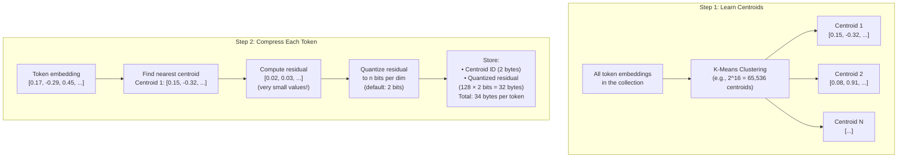
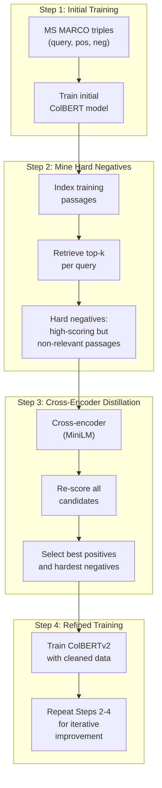
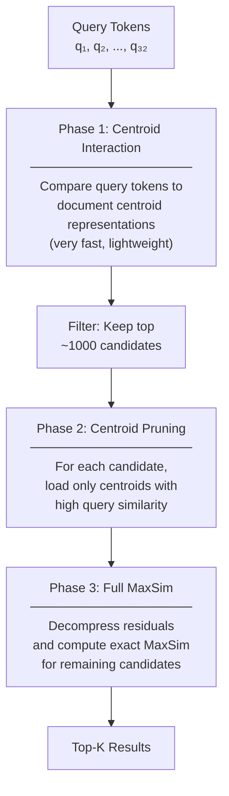

# ColBERTv2 & RAGatouille

## Introduction

The original ColBERT proved that late interaction could deliver near-cross-encoder quality at near-bi-encoder speed. But it had a practical problem: storing one 128-dimensional floating-point vector for every token in every document consumed enormous amounts of disk space. A collection of 8.8 million passages (MS MARCO) required **~25 GB** of storage for ColBERT embeddings—compared to under 2 GB for a single-vector approach.

**ColBERTv2** solved this with two key innovations:
1. **Residual compression** — reduces storage by 6–10× while preserving quality
2. **Denoised supervision** — improves training quality using cross-encoder distillation

The **PLAID** (Performance-optimized Late Interaction Driver) engine then made ColBERTv2 searches dramatically faster, achieving latencies of tens of milliseconds even on CPUs.

And **RAGatouille** wrapped it all in a Python library so simple that indexing and searching takes three lines of code. This lesson covers all three advances and shows you how to use them in practice.

### Prerequisites

- Understanding of ColBERT architecture and MaxSim (Lesson 01)
- Familiarity with Python package management (`pip install`)
- Basic understanding of vector compression concepts

### What You'll Learn

- How ColBERTv2's residual compression reduces storage by 6-10×
- How denoised supervision improves retrieval quality
- How PLAID's centroid interaction speeds up search
- Complete RAGatouille workflow: install, index, search, update, fine-tune
- Practical code examples for production use

---

## ColBERTv2: Compression Without Compromise

### The Storage Problem

In the original ColBERT, each token embedding is stored as 128 floating-point numbers (4 bytes each):

```
Storage per token: 128 dimensions × 4 bytes = 512 bytes
Storage per 200-token document: 200 × 512 = 100 KB
Storage for 1M documents: 100 KB × 1M = ~100 GB
```

This is 16× more than a single-vector bi-encoder storing one 1536-dim vector per document (~6 GB for 1M documents). ColBERTv2's residual compression changes this equation dramatically.

### Residual Compression: How It Works

Instead of storing full 128-dimensional vectors for each token, ColBERTv2 stores only the **residual** (difference) between each token embedding and its nearest **centroid**:



### Compression Ratios

| Configuration | Storage per Token | Compression vs. ColBERTv1 | Quality Impact |
|---------------|------------------|--------------------------|----------------|
| **ColBERTv1** (fp32) | 512 bytes | 1× (baseline) | — |
| **ColBERTv1** (fp16) | 256 bytes | 2× | Negligible |
| **ColBERTv2** (4 bits) | ~66 bytes | ~8× | Minimal |
| **ColBERTv2** (2 bits) | ~34 bytes | ~15× | Very small |
| **ColBERTv2** (1 bit) | ~18 bytes | ~28× | Noticeable |

The default configuration uses **2 bits per dimension**, achieving a ~15× compression with virtually no quality loss:

```
ColBERTv1: 100 GB for 1M documents
ColBERTv2: ~7 GB for 1M documents (2-bit residuals)
```

### Reconstruction at Query Time

When computing MaxSim during search, ColBERTv2 reconstructs approximate token embeddings:

$$\hat{e} = c_k + \text{dequantize}(r)$$

Where $c_k$ is the centroid and $r$ is the stored quantized residual. This reconstruction is fast and introduces minimal error because:
1. Centroids capture the bulk of the embedding's magnitude
2. Residuals are small by definition (difference from nearest centroid)
3. Even aggressive quantization preserves the residual direction

```python
# Conceptual demonstration of residual compression

import numpy as np

def compress_embedding(embedding, centroids):
    """Compress a token embedding using residual compression."""
    # Find nearest centroid
    distances = np.linalg.norm(centroids - embedding, axis=1)
    centroid_id = np.argmin(distances)
    nearest_centroid = centroids[centroid_id]
    
    # Compute residual
    residual = embedding - nearest_centroid
    # Residual values are small → can be quantized aggressively
    
    # Quantize to 2 bits per dimension (4 possible values)
    quantized = quantize_to_nbits(residual, n_bits=2)
    
    return centroid_id, quantized


def decompress_embedding(centroid_id, quantized_residual, centroids):
    """Reconstruct approximate embedding from compressed form."""
    centroid = centroids[centroid_id]
    residual = dequantize(quantized_residual)
    return centroid + residual  # Approximate original embedding
```

---

## Denoised Supervision: Better Training Data

ColBERTv2 doesn't just improve compression—it also improves the model itself through a refined training strategy called **denoised supervision**.

### The Problem with Standard Training

Standard ColBERT training uses triples from the MS MARCO dataset: a query, a positive document, and a random negative document. The problem is that:
- **Random negatives are too easy**: The model quickly learns to distinguish clearly irrelevant documents but doesn't learn to differentiate between subtly different relevant and near-relevant documents
- **Noisy labels**: Some "positive" documents in MS MARCO aren't actually the best match for their query

### The Denoised Supervision Pipeline



The result: ColBERTv2's MRR@10 on MS MARCO jumped from 0.360 (ColBERTv1) to **0.397** (ColBERTv2)—a significant improvement driven entirely by better training data quality.

---

## PLAID: The Fast Search Engine

**PLAID** (Performance-optimized Late Interaction Driver) is ColBERTv2's search engine that makes retrieval dramatically faster by introducing **centroid interaction**—a lightweight pre-filtering step that eliminates most documents before full MaxSim scoring.

### How PLAID Works



### PLAID's Three-Phase Pipeline

| Phase | What It Does | Speed | Documents Remaining |
|-------|-------------|-------|---------------------|
| **1. Centroid Interaction** | Approximate scoring using only centroid IDs | ⚡ μs | ~1,000 from millions |
| **2. Centroid Pruning** | Sparsify document representations | ⚡ μs | ~1,000 (fewer embeddings each) |
| **3. Full MaxSim** | Exact scoring with decompressed residuals | ~ms | Top-K final results |

### Speed Improvements

| Setup | ColBERTv2 (vanilla) | ColBERTv2 + PLAID | Speedup |
|-------|--------------------|--------------------|---------|
| **GPU** | ~200ms | ~28ms | 7× |
| **CPU** | ~4,500ms | ~100ms | 45× |

PLAID achieves **tens of milliseconds** latency on GPU and **~100ms on CPU** for collections of 8.8M passages—fast enough for real-time applications.

---

## RAGatouille: ColBERT Made Simple

**RAGatouille** is a Python library that wraps ColBERT's complexity into a developer-friendly API. Created by Benjamin Clavié, it's the recommended way to use ColBERT in applications (endorsed by the ColBERT team at Stanford).

### Installation

```bash
pip install ragatouille
```

> **Note**: RAGatouille requires Python 3.9+ and works on Linux and macOS. Windows users should use WSL2. A GPU is recommended for indexing but not required for search.

### Complete Workflow: Index, Search, Update

```python
from ragatouille import RAGPretrainedModel

# ──────────────────────────────────────────
# Step 1: Load a pretrained ColBERT model
# ──────────────────────────────────────────
RAG = RAGPretrainedModel.from_pretrained("colbert-ir/colbertv2.0")

# Other available models:
# RAG = RAGPretrainedModel.from_pretrained("jinaai/jina-colbert-v1-en")  # 8K context
# RAG = RAGPretrainedModel.from_pretrained("jinaai/jina-colbert-v2")     # Multilingual

print(f"Model loaded: {RAG}")
```

### Indexing Documents

```python
# ──────────────────────────────────────────
# Step 2: Index your documents
# ──────────────────────────────────────────

# Your document collection (list of strings)
documents = [
    "The Mediterranean diet emphasizes fruits, vegetables, whole grains, "
    "and healthy fats like olive oil. Studies show it reduces cardiovascular "
    "disease risk by up to 30%.",
    
    "Intermittent fasting involves cycling between periods of eating and "
    "fasting. The 16:8 method restricts eating to an 8-hour window each day.",
    
    "The ketogenic diet is a high-fat, low-carbohydrate diet that puts the "
    "body into a metabolic state called ketosis, where fat is burned for energy "
    "instead of carbohydrates.",
    
    "Plant-based diets exclude all animal products and have been associated "
    "with lower rates of heart disease, type 2 diabetes, and certain cancers.",
    
    "The DASH diet (Dietary Approaches to Stop Hypertension) was specifically "
    "designed to lower blood pressure through reduced sodium intake and "
    "increased consumption of potassium-rich foods.",
]

# Optional: Add document IDs and metadata
document_ids = ["med_diet", "intermittent", "keto", "plant_based", "dash"]
document_metadatas = [
    {"category": "heart-health", "year": 2023},
    {"category": "weight-loss", "year": 2023},
    {"category": "weight-loss", "year": 2022},
    {"category": "heart-health", "year": 2024},
    {"category": "blood-pressure", "year": 2023},
]

# Create the index
# ColBERT handles: tokenization, embedding, compression, storage
index_path = RAG.index(
    index_name="nutrition_index",
    collection=documents,
    document_ids=document_ids,
    document_metadatas=document_metadatas,
)
print(f"Index created at: {index_path}")
```

### Searching

```python
# ──────────────────────────────────────────
# Step 3: Search the index
# ──────────────────────────────────────────

# Load from an existing index (preferred method)
RAG = RAGPretrainedModel.from_index(index_path)

# Single query
results = RAG.search(
    query="Which diet is best for reducing heart disease risk?",
    k=3,
)

# Display results
for result in results:
    print(f"Rank {result['rank']} | Score: {result['score']:.2f}")
    print(f"  ID: {result['document_id']}")
    print(f"  Content: {result['content'][:100]}...")
    if 'document_metadata' in result:
        print(f"  Metadata: {result['document_metadata']}")
    print()

# Expected output:
# Rank 1 | Score: 26.45
#   ID: med_diet
#   Content: The Mediterranean diet emphasizes fruits, vegetables, whole grains...
#   Metadata: {'category': 'heart-health', 'year': 2023}
#
# Rank 2 | Score: 23.12
#   ID: plant_based
#   Content: Plant-based diets exclude all animal products and have been...
#   Metadata: {'category': 'heart-health', 'year': 2024}
#
# Rank 3 | Score: 21.87
#   ID: dash
#   Content: The DASH diet was specifically designed to lower blood pressure...
#   Metadata: {'category': 'blood-pressure', 'year': 2023}
```

### Multi-Query Search

```python
# Search with multiple queries at once (batch processing)
multi_results = RAG.search(
    query=[
        "How to lose weight through diet?",
        "What reduces blood pressure?",
        "Benefits of eating more vegetables?",
    ],
    k=2,
)

# multi_results is a list of lists
for i, query_results in enumerate(multi_results):
    print(f"Query {i+1} results:")
    for result in query_results:
        print(f"  Rank {result['rank']}: {result['content'][:60]}...")
    print()
```

### Updating an Existing Index

```python
# ──────────────────────────────────────────
# Step 4: Add documents to an existing index
# ──────────────────────────────────────────

new_documents = [
    "The paleo diet focuses on foods that were available to our "
    "hunter-gatherer ancestors, excluding processed foods, grains, "
    "and dairy products.",
    
    "Omega-3 fatty acids found in fish, flaxseeds, and walnuts "
    "have anti-inflammatory properties that benefit heart health "
    "and brain function.",
]

new_ids = ["paleo", "omega3"]
new_metadata = [
    {"category": "weight-loss", "year": 2024},
    {"category": "supplements", "year": 2024},
]

# Add to existing index without re-indexing everything
RAG.add_to_index(
    new_collection=new_documents,
    new_document_ids=new_ids,
    new_document_metadatas=new_metadata,
)

# Now searches will include the new documents
updated_results = RAG.search("What foods contain omega-3?", k=2)
```

### Deleting Documents

```python
# Remove documents from the index by ID
RAG.delete_from_index(
    document_ids=["keto"],  # Remove the keto diet document
)
```

---

## RAGatouille in a RAG Pipeline

Here's how to integrate ColBERT retrieval with an LLM for a complete RAG application:

```python
from ragatouille import RAGPretrainedModel
from openai import OpenAI

# ──────────────────────────────────────────
# ColBERT-powered RAG Pipeline
# ──────────────────────────────────────────

class ColBERTRAG:
    """RAG pipeline using ColBERT for retrieval."""
    
    def __init__(self, index_path: str, llm_model: str = "gpt-4o-mini"):
        self.rag = RAGPretrainedModel.from_index(index_path)
        self.client = OpenAI()
        self.llm_model = llm_model
    
    def retrieve(self, query: str, k: int = 5) -> list[dict]:
        """Retrieve relevant documents using ColBERT."""
        return self.rag.search(query=query, k=k)
    
    def generate(self, query: str, k: int = 5) -> str:
        """Retrieve documents and generate an answer."""
        # Step 1: Retrieve with ColBERT
        results = self.retrieve(query, k=k)
        
        # Step 2: Format context from retrieved documents
        context_parts = []
        for r in results:
            meta = r.get("document_metadata", {})
            source = r.get("document_id", "unknown")
            context_parts.append(
                f"[Source: {source} | Score: {r['score']:.1f}]\n"
                f"{r['content']}"
            )
        context = "\n\n---\n\n".join(context_parts)
        
        # Step 3: Generate answer with LLM
        response = self.client.chat.completions.create(
            model=self.llm_model,
            messages=[
                {
                    "role": "system",
                    "content": (
                        "Answer the user's question based on the provided "
                        "context. Cite sources using [Source: id] format. "
                        "If the context doesn't contain enough information, "
                        "say so."
                    ),
                },
                {
                    "role": "user",
                    "content": f"Context:\n{context}\n\nQuestion: {query}",
                },
            ],
        )
        
        return response.choices[0].message.content


# Usage
pipeline = ColBERTRAG(index_path="path/to/nutrition_index")
answer = pipeline.generate(
    "What diet should I follow to reduce heart disease risk?"
)
print(answer)
```

---

## Fine-Tuning ColBERT with RAGatouille

If the pretrained ColBERTv2 model doesn't perform well enough on your domain, RAGatouille makes fine-tuning straightforward:

```python
from ragatouille import RAGTrainer

# ──────────────────────────────────────────
# Fine-tune ColBERT for your domain
# ──────────────────────────────────────────

# Prepare training data as pairs or triples
training_pairs = [
    # (query, relevant_document)
    (
        "symptoms of iron deficiency",
        "Iron deficiency anemia causes fatigue, weakness, pale skin, "
        "shortness of breath, and brittle nails."
    ),
    (
        "how to increase iron absorption",
        "Vitamin C significantly enhances iron absorption. Eating citrus "
        "fruits with iron-rich foods can increase absorption by up to 6x."
    ),
    (
        "foods high in iron",
        "Red meat, spinach, lentils, fortified cereals, and dark chocolate "
        "are excellent sources of dietary iron."
    ),
    # ... many more pairs (hundreds to thousands recommended)
]

# Optional: provide full corpus for hard negative mining
full_corpus = [
    "Iron deficiency anemia causes fatigue...",
    "Vitamin C enhances iron absorption...",
    "Red meat and spinach are rich in iron...",
    "Calcium can inhibit iron absorption...",
    "Hemoglobin requires iron to transport oxygen...",
    # ... more documents
]

# Initialize trainer
trainer = RAGTrainer(
    model_name="my-nutrition-colbert",
    pretrained_model_name="colbert-ir/colbertv2.0",  # Fine-tune from v2
    language_code="en",
)

# Prepare training data (handles negative mining automatically)
trainer.prepare_training_data(
    raw_data=training_pairs,
    data_out_path="./training_data/",
    all_documents=full_corpus,  # Used for hard negative mining
    num_new_negatives=10,       # Mine 10 hard negatives per query
)

# Train (inherits ColBERTv2 hyperparameters by default)
trainer.train(
    batch_size=32,
    nbits=2,          # Compression level for the trained model
    maxsteps=500,     # Adjust based on dataset size
    use_ib_negatives=True,  # Use in-batch negatives for efficiency
    learning_rate=1e-5,
)

# The fine-tuned model is saved and can be loaded with:
# RAG = RAGPretrainedModel.from_pretrained("my-nutrition-colbert")
```

### When to Fine-Tune vs. Use Pretrained

| Scenario | Recommendation |
|----------|---------------|
| **General domain** (web, news) | Use pretrained ColBERTv2 |
| **Specialized domain** (medical, legal) | Try pretrained first; fine-tune if <80% accuracy |
| **Non-English language** | Use Jina-ColBERT-v2 (89 languages) or fine-tune |
| **Highly specific terminology** | Fine-tune with domain pairs |
| **Small document corpus** (<10K docs) | Pretrained is usually sufficient |
| **Large corpus with user query data** | Fine-tune with real query-document pairs |

---

## Available ColBERT Models

| Model | Context Length | Languages | Size | Best For |
|-------|--------------|-----------|------|----------|
| `colbert-ir/colbertv2.0` | 512 tokens | English | 110M params | General-purpose English retrieval |
| `jinaai/jina-colbert-v1-en` | 8,192 tokens | English | 137M params | Long document retrieval |
| `jinaai/jina-colbert-v2` | 8,192 tokens | 89 languages | 559M params | Multilingual retrieval |
| `answerdotai/answerai-colbert-small-v1` | 512 tokens | English | 33M params | Resource-constrained deployments |

### Choosing a Model

```python
# For most English use cases:
RAG = RAGPretrainedModel.from_pretrained("colbert-ir/colbertv2.0")

# For long documents (papers, contracts, books):
RAG = RAGPretrainedModel.from_pretrained("jinaai/jina-colbert-v1-en")

# For multilingual retrieval:
RAG = RAGPretrainedModel.from_pretrained("jinaai/jina-colbert-v2")

# For edge/mobile deployments:
RAG = RAGPretrainedModel.from_pretrained("answerdotai/answerai-colbert-small-v1")
```

---

## Integration with Existing Frameworks

### LangChain Integration

```python
from langchain_community.retrievers import ColBERTRetriever
from ragatouille import RAGPretrainedModel

# Create RAGatouille index
RAG = RAGPretrainedModel.from_pretrained("colbert-ir/colbertv2.0")
RAG.index(
    index_name="langchain_demo",
    collection=documents,
)

# Use as a LangChain retriever
retriever = RAG.as_langchain_retriever(k=5)

# Now use in any LangChain chain
from langchain.chains import RetrievalQA
from langchain_openai import ChatOpenAI

qa_chain = RetrievalQA.from_chain_type(
    llm=ChatOpenAI(model="gpt-4o-mini"),
    retriever=retriever,
    return_source_documents=True,
)

result = qa_chain.invoke({"query": "What diet reduces heart disease?"})
print(result["result"])
```

### LlamaIndex Integration

```python
from llama_index.core import VectorStoreIndex, Document
from ragatouille import RAGPretrainedModel

# RAGatouille can work alongside LlamaIndex
# Create ColBERT retriever
RAG = RAGPretrainedModel.from_pretrained("colbert-ir/colbertv2.0")

# Index documents
index_path = RAG.index(
    index_name="llamaindex_demo",
    collection=[doc.text for doc in documents],
)

# Use ColBERT as a custom retriever in LlamaIndex
results = RAG.search("your query here", k=5)
```

---

## Summary

| Component | What It Does | Key Benefit |
|-----------|-------------|-------------|
| **ColBERTv2** | Improved ColBERT with compression + better training | 6-10× less storage, higher quality |
| **Residual Compression** | Store centroid ID + quantized residual per token | ~34 bytes/token vs 512 bytes (15×) |
| **Denoised Supervision** | Cross-encoder distillation for cleaner training data | MRR@10: 0.360 → 0.397 |
| **PLAID Engine** | Three-phase search with centroid pre-filtering | 7× faster GPU, 45× faster CPU |
| **RAGatouille** | Python library wrapping ColBERT complexity | 3-line indexing and searching |
| **Fine-tuning** | Domain adaptation with RAGTrainer | Adapt to specialized domains easily |

### Key RAGatouille API Summary

```python
# Load model
RAG = RAGPretrainedModel.from_pretrained("colbert-ir/colbertv2.0")

# Create index
RAG.index(index_name="name", collection=docs)

# Load from index  
RAG = RAGPretrainedModel.from_index("path/to/index")

# Search
results = RAG.search(query="...", k=10)

# Batch search
results = RAG.search(query=["q1", "q2"], k=10)

# Update index
RAG.add_to_index(new_collection=[...])
RAG.delete_from_index(document_ids=[...])

# LangChain integration
retriever = RAG.as_langchain_retriever(k=5)
```

---

## Practice Exercises

1. **Install and index**: Install RAGatouille and create an index from 10-20 documents about a topic you're interested in. Search with 5 different queries and examine the scores.

2. **Compare with embeddings**: For the same documents, also create embeddings with OpenAI or a sentence-transformer model. Compare which approach ranks results more accurately for complex queries.

3. **Compression analysis**: Calculate the storage requirements for a corpus of 100,000 documents (average 300 tokens each) under ColBERTv1 (fp32), ColBERTv2 (2-bit), and a bi-encoder (1536-dim fp32).

4. **RAG pipeline**: Build a complete RAG pipeline using RAGatouille for retrieval and an LLM for generation. Test it with multi-faceted queries and evaluate answer quality.

---

*Next: [Multi-Vector Representations →](./04-multi-vector-representations.md)*
