# Multi-Vector Representations

## Introduction

ColBERT introduced the concept of representing documents as **bags of embeddings**—one vector per token. But this idea of using multiple vectors per document isn't unique to ColBERT. It's part of a broader family of approaches called **multi-vector representations** that explore different ways to decompose documents into multiple embeddings.

Understanding this broader family helps you appreciate why ColBERT's specific design choices work so well, and when alternative multi-vector strategies might be more appropriate. This lesson explores the theory behind multi-vector representations, different decomposition strategies, how late fusion scoring works across all of them, and the fundamental trade-off between storage cost and retrieval accuracy.

### Prerequisites

- Understanding of ColBERT architecture and MaxSim (Lesson 01)
- Familiarity with ColBERTv2's residual compression (Lesson 03)
- Basic knowledge of clustering and dimensionality reduction

### What You'll Learn

- What multi-vector representations are and why they exist
- Different strategies for decomposing documents into multiple vectors
- How late fusion scoring works across multi-vector approaches
- The storage vs. accuracy trade-off and how to navigate it
- Compression techniques beyond ColBERTv2's residual approach
- How multi-vector indexing works at scale

---

## What Are Multi-Vector Representations?

In the simplest terms, a multi-vector representation replaces the standard "one document → one vector" mapping with "one document → **N vectors**":

```mermaid
flowchart TB
    subgraph "Single-Vector (Bi-Encoder)"
        DOC1["📄 Document"] --> ENC1["Encoder"]
        ENC1 --> V1["1 Vector<br>[0.12, -0.45, ...]<br>d = 768-1536"]
    end
    
    subgraph "Multi-Vector (Token-Level)"
        DOC2["📄 Document"] --> ENC2["Encoder"]
        ENC2 --> V2["N Vectors (one per token)<br>token₁ → [...]<br>token₂ → [...]<br>...<br>tokenₙ → [...]<br>d = 128 each"]
    end
    
    subgraph "Multi-Vector (Passage-Level)"
        DOC3["📄 Document"] --> CHUNK["Chunk into<br>passages"]
        CHUNK --> ENC3["Encoder"]
        ENC3 --> V3["K Vectors (one per passage)<br>passage₁ → [...]<br>passage₂ → [...]<br>passage₃ → [...]<br>d = 768 each"]
    end
    
    subgraph "Multi-Vector (Aspect-Level)"
        DOC4["📄 Document"] --> ASPECTS["Extract<br>aspects/topics"]
        ASPECTS --> ENC4["Encoder"]
        ENC4 --> V4["M Vectors (one per aspect)<br>topic₁ → [...]<br>topic₂ → [...]<br>topic₃ → [...]<br>d = 768 each"]
    end
```



The key insight is that **any** strategy for creating multiple vectors per document can potentially capture more information than a single vector. The question is: **at what granularity should you decompose?**

---

## Decomposition Strategies

### Strategy 1: Token-Level (ColBERT)

Every token in the document gets its own embedding. This is the finest granularity possible.

```python
# Token-level decomposition (ColBERT's approach)
def token_level_decompose(document: str, encoder) -> list[list[float]]:
    """One embedding per token."""
    tokens = tokenize(document)  # ["The", "ocean", "is", "warming", ...]
    
    # BERT encodes all tokens with full self-attention context
    embeddings = encoder(tokens)  # Shape: (num_tokens, 128)
    
    return embeddings  # ~200 vectors for a typical passage

# Properties:
# ✅ Maximum information preservation
# ✅ Fine-grained matching (any query term → any doc term)
# ✅ Contextual (each embedding sees surrounding tokens via attention)
# ❌ Most storage: ~200 vectors per passage
# ❌ Requires specialized scoring (MaxSim, not cosine)
```

### Strategy 2: Passage-Level (Chunked Multi-Vector)

Split the document into chunks/passages and embed each separately. This is what many RAG systems already do (without calling it "multi-vector"):

```python
# Passage-level decomposition
def passage_level_decompose(
    document: str, 
    encoder,
    chunk_size: int = 256,
    overlap: int = 50,
) -> list[list[float]]:
    """One embedding per passage/chunk."""
    # Split document into overlapping chunks
    chunks = chunk_text(document, chunk_size, overlap)
    
    # Embed each chunk independently
    embeddings = [encoder(chunk) for chunk in chunks]
    
    return embeddings  # ~5-20 vectors for a long document

# Properties:
# ✅ Works with any bi-encoder model
# ✅ Standard cosine similarity scoring
# ✅ Compatible with all vector databases
# ⚠️ Medium storage: ~5-20 vectors per document
# ❌ Loses cross-chunk context
# ❌ Chunk boundary artifacts
```

### Strategy 3: Aspect-Level (Topic Decomposition)

Extract distinct topics or aspects from the document and create a vector for each:

```python
# Aspect-level decomposition
def aspect_level_decompose(
    document: str, 
    encoder,
    topic_model,
) -> list[list[float]]:
    """One embedding per semantic aspect/topic."""
    # Extract distinct topics/aspects
    aspects = topic_model.extract_aspects(document)
    # e.g., ["climate impact", "economic cost", "policy recommendations"]
    
    # Create embedding for each aspect's text
    embeddings = []
    for aspect_text in aspects:
        embeddings.append(encoder(aspect_text))
    
    return embeddings  # ~3-10 vectors per document

# Properties:
# ✅ Semantically meaningful decomposition
# ✅ Moderate storage
# ✅ Works with standard vector search
# ❌ Requires topic extraction (additional complexity)
# ❌ Topic extraction quality varies
# ❌ Misses fine-grained token matches
```

### Strategy 4: Learned Multi-Vector (Poly-Encoder)

Learn a fixed number of "attention codes" that capture different aspects of the document through learned aggregation:

```python
# Poly-encoder style decomposition
def learned_multi_vector(
    document: str,
    encoder,
    num_codes: int = 16,  # Fixed number of output vectors
) -> list[list[float]]:
    """Learn M fixed vectors through attention over tokens."""
    # Encode all tokens
    token_embeddings = encoder(document)  # (num_tokens, 768)
    
    # Learned attention codes aggregate token information
    # Each code "attends" to different parts of the document
    codes = learned_attention_codes  # (num_codes, 768)
    
    # Attention: each code queries the token embeddings
    multi_vectors = []
    for code in codes:
        attention_weights = softmax(code @ token_embeddings.T)
        aggregated = attention_weights @ token_embeddings
        multi_vectors.append(aggregated)
    
    return multi_vectors  # Exactly num_codes vectors

# Properties:
# ✅ Fixed number of vectors (predictable storage)
# ✅ Learned compression (captures most important info)
# ⚠️ Moderate quality (between bi-encoder and ColBERT)
# ❌ Requires custom training
# ❌ Fixed codes may miss unexpected topics
```

### Comparison of Strategies

| Strategy | Vectors per Doc | Granularity | Scoring | Storage | Quality |
|----------|----------------|-------------|---------|---------|---------|
| **Single-vector** | 1 | Document | Cosine | ⭐ | ⭐⭐⭐ |
| **Passage-level** | 5-20 | Paragraph | Cosine (max) | ⭐⭐ | ⭐⭐⭐ |
| **Aspect-level** | 3-10 | Topic | Cosine (max) | ⭐⭐ | ⭐⭐⭐ |
| **Poly-encoder** | 16-64 (fixed) | Learned | Attention | ⭐⭐ | ⭐⭐⭐⭐ |
| **Token-level (ColBERT)** | 100-500+ | Token | MaxSim | ⭐⭐⭐⭐ | ⭐⭐⭐⭐⭐ |

---

## Late Fusion: Scoring Multi-Vector Documents

"Late fusion" refers to any scoring method where query and document are encoded separately and combined only at scoring time. Different multi-vector strategies use different late fusion methods:

### Fusion Strategy 1: Max-Score (Passage/Aspect Level)

For passage-level decomposition, the simplest approach is to return the **maximum** similarity across all passage vectors:

$$S(Q, D) = \max_{i \in \{1, \ldots, K\}} \cos(q, d_i)$$

```python
import numpy as np

def max_passage_score(
    query_vec: np.ndarray,           # (768,) - single query vector
    passage_vecs: list[np.ndarray],  # List of (768,) passage vectors
) -> float:
    """Score = max similarity across all passages."""
    similarities = [
        np.dot(query_vec, p_vec) / (np.linalg.norm(query_vec) * np.linalg.norm(p_vec))
        for p_vec in passage_vecs
    ]
    return max(similarities)
```

### Fusion Strategy 2: Sum-of-Max (ColBERT's MaxSim)

ColBERT's approach: for each query token, find the max similarity with any document token, then sum:

$$S(Q, D) = \sum_{i=1}^{n} \max_{j \in \{1, \ldots, m\}} (q_i \cdot d_j)$$

```python
def maxsim_score(
    query_tokens: np.ndarray,    # (n, 128) - per-token query embeddings
    doc_tokens: np.ndarray,      # (m, 128) - per-token document embeddings
) -> float:
    """ColBERT's MaxSim: sum of per-query-token max similarities."""
    # All pairwise similarities
    sim_matrix = query_tokens @ doc_tokens.T  # (n, m)
    
    # Max per query token, then sum
    return sim_matrix.max(axis=1).sum()
```

### Fusion Strategy 3: Average-of-Max

A softer version that averages instead of summing (normalizes by query length):

$$S(Q, D) = \frac{1}{n} \sum_{i=1}^{n} \max_{j \in \{1, \ldots, m\}} (q_i \cdot d_j)$$

### Fusion Strategy 4: Weighted Fusion

Weight different document vectors differently, e.g., by position or importance:

```python
def weighted_fusion(
    query_vec: np.ndarray,
    doc_vecs: list[np.ndarray],
    weights: list[float],
) -> float:
    """Weighted combination of passage scores."""
    similarities = [
        np.dot(query_vec, d_vec) / (np.linalg.norm(query_vec) * np.linalg.norm(d_vec))
        for d_vec in doc_vecs
    ]
    return sum(s * w for s, w in zip(similarities, weights))
```

### Why MaxSim Outperforms Other Fusions

```mermaid
flowchart TB
    subgraph "Max-Passage: Loses query decomposition"
        Q1["Query: 'ocean acidification<br>coral reefs'"] --> QV1["1 query vector<br>(averaged)"]
        QV1 --> MAX1["max(cos(q, p₁), cos(q, p₂), ...)"]
        MAX1 --> SCORE1["Best matching PASSAGE<br>but query detail lost"]
    end
    
    subgraph "MaxSim: Preserves query decomposition"
        Q2["Same query"] --> QT["Per-token query vectors<br>ocean → [...]<br>acidification → [...]<br>coral → [...]<br>reefs → [...]"]
        QT --> MS["Each token finds<br>its best match<br>independently"]
        MS --> SCORE2["Each CONCEPT in query<br>matched independently"]
    end
    
    style SCORE1 fill:#f9a825,color:#000
    style SCORE2 fill:#2e7d32,color:#fff
```



MaxSim preserves the query's multi-concept structure. A query about "ocean acidification AND coral reefs" evaluates both concepts independently. Max-passage scoring, by contrast, finds the best single passage but may miss a passage that covers one concept well—it can't combine evidence across passages the way MaxSim combines across tokens.

---

## The Storage vs. Accuracy Trade-Off

The fundamental tension in multi-vector retrieval is clear: **more vectors = more information = better retrieval, but also more storage and slower search**.

### Quantifying the Trade-Off

```python
# Storage calculation for different approaches
def calculate_storage(
    num_documents: int,
    avg_tokens_per_doc: int,
    approach: str,
) -> dict:
    """Calculate storage requirements for different approaches."""
    
    if approach == "bi-encoder":
        # 1 vector × 1536 dims × 4 bytes
        per_doc = 1 * 1536 * 4  # 6,144 bytes
        
    elif approach == "colbert-v1":
        # N tokens × 128 dims × 4 bytes (fp32)
        per_doc = avg_tokens_per_doc * 128 * 4
        
    elif approach == "colbert-v2-2bit":
        # N tokens × (2 bytes centroid + 128 dims × 2 bits / 8)
        per_doc = avg_tokens_per_doc * (2 + 128 * 2 / 8)
        
    elif approach == "passage-chunked":
        # ~5 chunks × 1536 dims × 4 bytes
        num_chunks = max(1, avg_tokens_per_doc // 256)
        per_doc = num_chunks * 1536 * 4
        
    elif approach == "poly-encoder-16":
        # 16 codes × 768 dims × 4 bytes
        per_doc = 16 * 768 * 4
    
    total_gb = (per_doc * num_documents) / (1024 ** 3)
    
    return {
        "approach": approach,
        "per_doc_bytes": per_doc,
        "total_gb": round(total_gb, 2),
    }


# Compare for 1 million documents, avg 200 tokens
approaches = [
    "bi-encoder", "colbert-v1", "colbert-v2-2bit",
    "passage-chunked", "poly-encoder-16"
]

for approach in approaches:
    result = calculate_storage(1_000_000, 200, approach)
    print(f"{result['approach']:25s} | "
          f"Per doc: {result['per_doc_bytes']:>8,} bytes | "
          f"Total: {result['total_gb']:>8.2f} GB")
```

Expected output:

```
bi-encoder                 | Per doc:    6,144 bytes | Total:     5.72 GB
colbert-v1                 | Per doc:  102,400 bytes | Total:    95.37 GB
colbert-v2-2bit            | Per doc:    6,800 bytes | Total:     6.33 GB
passage-chunked            | Per doc:    6,144 bytes | Total:     5.72 GB
poly-encoder-16            | Per doc:   49,152 bytes | Total:    45.78 GB
```

### The Pareto Frontier

Not all approaches offer good trade-offs. The best approaches sit on the **Pareto frontier**—improving one dimension without worsening the other:


**ColBERTv2 with 2-bit compression is the clear winner**: it achieves the highest retrieval quality (MRR 0.40) at storage comparable to a simple bi-encoder (~6 GB for 1M docs). The original ColBERTv1 without compression sits in an awkward spot—worse quality than v2 at 15× the storage.

---

## Compression Techniques for Multi-Vector Models

Beyond ColBERTv2's residual compression, several other techniques can reduce multi-vector storage:

### Technique 1: Dimensionality Reduction

Reduce the number of dimensions per embedding:

```python
# ColBERT already does this: BERT's 768 → 128 via linear projection
# Further reduction is possible with minimal quality loss

# PCA-based reduction
from sklearn.decomposition import PCA

def reduce_dimensions(embeddings, target_dim=64):
    """Reduce embedding dimensions with PCA."""
    pca = PCA(n_components=target_dim)
    reduced = pca.fit_transform(embeddings)
    return reduced

# Impact on ColBERT:
# 128 dims: MRR@10 = 0.397 (default)
# 64 dims:  MRR@10 = 0.393 (-1.0%)
# 32 dims:  MRR@10 = 0.385 (-3.0%)
```

### Technique 2: Token Pruning

Not all tokens are equally important. Remove less informative tokens:

```python
def prune_tokens(
    token_embeddings: list,
    tokens: list[str],
    keep_ratio: float = 0.5,
) -> list:
    """Remove uninformative tokens to reduce storage."""
    # Strategy 1: Remove punctuation and stop words
    informative = [
        (tok, emb) for tok, emb in zip(tokens, token_embeddings)
        if tok.lower() not in STOP_WORDS and tok not in PUNCTUATION
    ]
    
    # Strategy 2: Remove tokens similar to their neighbors
    # (redundant information)
    pruned = remove_redundant_neighbors(informative, threshold=0.95)
    
    return pruned

# Typical impact:
# Keeping 100% tokens: MRR = 0.397 (baseline)
# Keeping 70% tokens:  MRR = 0.395 (-0.5%)
# Keeping 50% tokens:  MRR = 0.390 (-1.8%)
# Keeping 30% tokens:  MRR = 0.378 (-4.8%)
```

### Technique 3: Product Quantization (PQ)

Decompose vectors into sub-vectors and quantize each independently:

```python
# Product quantization splits each vector into sub-vectors
# and maps each sub-vector to its nearest centroid

# 128-dim vector → 16 sub-vectors of 8 dims each
# Each sub-vector mapped to 1 of 256 centroids (1 byte)
# Storage: 16 bytes per token (vs 512 bytes for fp32)

# This is what FAISS uses under the hood for ANN indexes
```

### Technique 4: Binary Quantization

The most aggressive compression—each dimension becomes 0 or 1:

```python
import numpy as np

def binary_quantize(embeddings: np.ndarray) -> np.ndarray:
    """Quantize to binary: 1 bit per dimension."""
    return (embeddings > 0).astype(np.uint8)

# 128 dims × 1 bit = 16 bytes per token
# But quality drops significantly
# Best used as a pre-filter with full re-scoring

# ColBERT with binary pre-filter + residual re-score:
# Nearly full quality at 2× faster search
```

### Compression Comparison

| Technique | Bytes per Token | Compression vs. fp32 | Quality Retention |
|-----------|----------------|---------------------|-------------------|
| **fp32 (baseline)** | 512 | 1× | 100% |
| **fp16** | 256 | 2× | ~100% |
| **Residual (2-bit)** | 34 | 15× | ~99% |
| **Residual (1-bit)** | 18 | 28× | ~97% |
| **Product Quantization** | 16 | 32× | ~96% |
| **Binary** | 16 | 32× | ~90% (as pre-filter: ~98%) |
| **Token pruning (50%)** | 256* | 2× | ~98% |

*Per remaining token; combined with other methods for multiplicative savings.

---

## How Multi-Vector Indexing Works at Scale

Multi-vector retrieval requires different indexing strategies than single-vector search. You can't just put all token embeddings into a flat ANN index—that would return individual tokens, not documents.

### Inverted Index Approach (ColBERT)

ColBERT uses a modified inverted index where centroids serve as the "vocabulary" and documents are represented by their centroid assignments:

```mermaid
flowchart TB
    subgraph "Indexing Phase"
        DOCS["All Documents"] --> ENC["Encode all tokens"]
        ENC --> CLUSTER["K-Means clustering<br>of all token embeddings"]
        CLUSTER --> ASSIGN["Assign each token<br>to nearest centroid"]
        ASSIGN --> INV["Inverted Index<br>────────────────<br>Centroid 1 → [Doc3:tok5, Doc7:tok2, ...]<br>Centroid 2 → [Doc1:tok8, Doc5:tok1, ...]<br>Centroid 3 → [Doc2:tok3, Doc9:tok7, ...]<br>..."]
        ASSIGN --> RES["Residual Store<br>────────────────<br>Doc1:tok1 → compressed residual<br>Doc1:tok2 → compressed residual<br>..."]
    end
    
    subgraph "Search Phase"
        QUERY["Query tokens"] --> PROBE["Probe nearest centroids<br>for each query token"]
        PROBE --> CAND["Gather candidate<br>documents"]
        INV --> CAND
        CAND --> DECOMP["Decompress residuals<br>for candidates"]
        RES --> DECOMP
        DECOMP --> SCORE["Full MaxSim scoring"]
        SCORE --> TOPK["Top-K results"]
    end
```



### Multi-Vector with Standard Vector Databases

If you're using passage-level chunking (not token-level), you can use standard vector databases with a document grouping strategy:

```python
# Passage-level multi-vector with a standard vector DB

from qdrant_client import QdrantClient
from qdrant_client.models import PointStruct, Distance, VectorParams

client = QdrantClient(":memory:")

# Create collection
client.create_collection(
    collection_name="multi_vector_docs",
    vectors_config=VectorParams(
        size=1536,
        distance=Distance.COSINE,
    ),
)

# Index document chunks with shared document_id
def index_document(
    doc_id: str,
    chunks: list[str],
    embeddings: list[list[float]],
):
    """Index multiple chunks per document."""
    points = []
    for i, (chunk, embedding) in enumerate(zip(chunks, embeddings)):
        points.append(PointStruct(
            id=hash(f"{doc_id}_{i}") % (2**63),
            vector=embedding,
            payload={
                "document_id": doc_id,
                "chunk_index": i,
                "content": chunk,
            },
        ))
    client.upsert(
        collection_name="multi_vector_docs",
        points=points,
    )


# Search with document-level aggregation
def search_multi_vector(query_embedding: list[float], k: int = 5):
    """Search and aggregate by document."""
    # Get more results than needed to allow grouping
    raw_results = client.search(
        collection_name="multi_vector_docs",
        query_vector=query_embedding,
        limit=k * 5,  # Over-fetch for grouping
    )
    
    # Group by document and take max score per document
    doc_scores = {}
    doc_content = {}
    for result in raw_results:
        doc_id = result.payload["document_id"]
        if doc_id not in doc_scores or result.score > doc_scores[doc_id]:
            doc_scores[doc_id] = result.score
            doc_content[doc_id] = result.payload["content"]
    
    # Sort by score and return top-k documents
    ranked = sorted(doc_scores.items(), key=lambda x: x[1], reverse=True)
    return ranked[:k]
```

---

## Multi-Vector vs. Single-Vector: When Storage Cost Matters

### Cost Analysis for Cloud Deployments

| Scale | Bi-Encoder Storage | ColBERTv2 Storage | Monthly Cost Delta (AWS) |
|-------|-------------------|-------------------|------------------------|
| 100K docs | 0.6 GB | 0.6 GB | ~$0 |
| 1M docs | 6 GB | 6.3 GB | ~$1/mo |
| 10M docs | 60 GB | 63 GB | ~$10/mo |
| 100M docs | 600 GB | 630 GB | ~$100/mo |
| 1B docs | 6 TB | 6.3 TB | ~$1,000/mo |

With ColBERTv2's residual compression, the storage cost difference is **negligible** for most applications. The cost difference only becomes significant at billions of documents—and at that scale, the accuracy improvement from ColBERT likely justifies the marginal storage increase.

### Memory Considerations

Multi-vector indexes are often loaded into RAM for fast search. Memory requirements follow the same pattern as storage:

```python
# Memory planning for multi-vector deployment

def estimate_memory(
    num_docs: int,
    avg_tokens: int,
    bits_per_dim: int = 2,
    embedding_dim: int = 128,
) -> dict:
    """Estimate memory requirements for ColBERTv2 index."""
    # Centroid table (always in memory)
    num_centroids = 2 ** 16  # 65,536
    centroid_memory = num_centroids * embedding_dim * 4  # fp32
    
    # Token embeddings (compressed)
    bytes_per_token = 2 + (embedding_dim * bits_per_dim / 8)
    token_memory = num_docs * avg_tokens * bytes_per_token
    
    # Inverted index (centroid → doc/token mappings)
    inverted_memory = num_docs * avg_tokens * 8  # doc_id + token_pos
    
    total = centroid_memory + token_memory + inverted_memory
    
    return {
        "centroid_table_mb": centroid_memory / (1024**2),
        "token_embeddings_gb": token_memory / (1024**3),
        "inverted_index_gb": inverted_memory / (1024**3),
        "total_gb": total / (1024**3),
    }

# Example: 10M documents, 200 tokens avg, 2-bit compression
mem = estimate_memory(10_000_000, 200)
# centroid_table: ~32 MB
# token_embeddings: ~12.7 GB  
# inverted_index: ~14.9 GB
# total: ~27.6 GB (fits in a single server with 32 GB RAM)
```

---

## The Bag-of-Embeddings Intuition

Benjamin Clavié's description of ColBERT as a "bag-of-embeddings" model is the most intuitive way to understand multi-vector retrieval:

```mermaid
flowchart TB
    subgraph "Traditional IR: Bag of Words"
        BOW["Document = {word: count}<br>──────────────────<br>'climate': 3<br>'change': 2<br>'ocean': 5<br>'acidification': 2<br>'coral': 4<br>──────────────────<br>✅ Each word preserved<br>❌ No semantics"]
    end
    
    subgraph "Dense Retrieval: One Embedding"
        DE["Document = 1 vector<br>──────────────────<br>[0.12, -0.45, 0.33, ...]<br>──────────────────<br>✅ Semantic understanding<br>❌ Information compressed"]
    end
    
    subgraph "ColBERT: Bag of Embeddings"
        BOE["Document = {token: embedding}<br>──────────────────<br>'climate' → [0.92, -0.13, ...]<br>'change' → [0.45, 0.67, ...]<br>'ocean' → [0.11, 0.89, ...]<br>'acidification' → [-0.33, 0.71, ...]<br>'coral' → [0.78, 0.22, ...]<br>──────────────────<br>✅ Each word preserved<br>✅ Semantic understanding<br>✅ Best of both worlds"]
    end
```



Just like **bag-of-words** preserves individual words but loses meaning, and **dense embeddings** capture meaning but lose individual words, **bag-of-embeddings** preserves both: each token retains its identity AND carries semantic meaning from its context.

---

## Summary

| Concept | Key Takeaway |
|---------|-------------|
| **Multi-vector representations** | Documents → N vectors, capturing more information than a single vector |
| **Token-level (ColBERT)** | Finest granularity, one embedding per token, highest quality |
| **Passage-level** | Moderate granularity, works with standard vector DBs |
| **Late fusion** | Scoring happens after independent encoding (MaxSim, max-passage, etc.) |
| **Storage trade-off** | More vectors = better accuracy but more storage |
| **ColBERTv2 compression** | Residual compression makes token-level storage practical (~34 bytes/token) |
| **Token pruning** | Remove uninformative tokens for 2× compression with <2% quality loss |
| **Bag-of-embeddings** | Best intuition: each word preserved AND semantically meaningful |
| **At scale** | ColBERTv2 storage cost is comparable to bi-encoders for most deployments |

---

## Practice Exercises

1. **Storage calculator**: Write a function that takes corpus size, average document length, and compression method as inputs and returns estimated storage in GB. Compare bi-encoder, ColBERTv1, ColBERTv2, and passage-chunked approaches.

2. **Late fusion experiment**: Given a query and 5 documents (use random vectors), implement and compare three fusion strategies: max-passage, MaxSim, and average-of-max. Which ranks documents most intuitively?

3. **Token pruning analysis**: For 10 sample documents, identify which tokens you'd prune (stop words, punctuation, redundant). Calculate the storage savings and discuss potential quality impact.

4. **Multi-vector with a vector DB**: Using any vector database (Qdrant, ChromaDB, etc.), implement passage-level multi-vector retrieval with document-level aggregation. Compare results with standard single-vector retrieval.

---

*Next: [When to Use ColBERT →](./05-when-to-use-colbert.md)*
