# When to Use ColBERT

## Introduction

You now understand **how** ColBERT works and **why** it outperforms single-vector retrieval in many scenarios. The remaining question is the most practical one: **should you use ColBERT for your specific project?**

The answer depends on your documents, queries, accuracy requirements, infrastructure constraints, and where you are in the build-vs-buy spectrum. This lesson provides a structured decision framework, walks through real-world use cases, shows how to build hybrid architectures that combine ColBERT with other retrieval methods, and addresses the production engineering considerations that matter in deployment.

### Prerequisites

- All previous lessons in this section (Lessons 01–04)
- Experience building RAG pipelines (earlier lessons in this unit)
- Understanding of vector database deployment options

### What You'll Learn

- A decision framework for choosing ColBERT vs. other retrieval methods
- Specific use cases where ColBERT excels (and where it doesn't)
- How to build hybrid retrieval architectures
- Production deployment considerations
- How to evaluate whether ColBERT is improving your pipeline

---

## The Decision Framework

Before choosing ColBERT, ask these five questions about your use case:

```mermaid
flowchart TB
    START["Should I use ColBERT?"] --> Q1{"Are your documents<br>> 300 tokens on average?"}
    Q1 -->|Yes| PLUS1["✅ +2 points<br>ColBERT handles long docs better"]
    Q1 -->|No| ZERO1["➖ 0 points<br>Bi-encoder may suffice"]
    
    PLUS1 --> Q2{"Do queries have<br>multiple distinct concepts?"}
    ZERO1 --> Q2
    
    Q2 -->|Yes| PLUS2["✅ +2 points<br>MaxSim matches each concept"]
    Q2 -->|No| ZERO2["➖ 0 points"]
    
    PLUS2 --> Q3{"Do you need<br>explainability?"}
    ZERO2 --> Q3
    
    Q3 -->|Yes| PLUS3["✅ +2 points<br>Token-level matching is inspectable"]
    Q3 -->|No| ZERO3["➖ 0 points"]
    
    PLUS3 --> Q4{"Is accuracy critical<br>(medical, legal, financial)?"}
    ZERO3 --> Q4
    
    Q4 -->|Yes| PLUS4["✅ +2 points<br>ColBERT's quality advantage matters"]
    Q4 -->|No| ZERO4["➖ 0 points"]
    
    PLUS4 --> Q5{"Can you self-host<br>the model?"}
    ZERO4 --> Q5
    
    Q5 -->|Yes| PLUS5["✅ +1 point<br>Full ColBERT capability"]
    Q5 -->|No| MINUS5["❌ -2 points<br>Limited managed options"]
    
    PLUS5 --> SCORE["Calculate total score"]
    MINUS5 --> SCORE
    
    SCORE --> HIGH{"Score ≥ 5?"}
    HIGH -->|Yes| USE["Use ColBERT ✅"]
    HIGH -->|No| MED{"Score = 3-4?"}
    MED -->|Yes| HYBRID["Consider Hybrid ⚡"]
    MED -->|No| BIENC["Stick with Bi-Encoder 🔄"]
    
    style USE fill:#2e7d32,color:#fff
    style HYBRID fill:#f9a825,color:#000
    style BIENC fill:#1565c0,color:#fff
```



### Decision Matrix

| Factor | Weight | Bi-Encoder Wins When... | ColBERT Wins When... |
|--------|--------|------------------------|---------------------|
| **Document length** | High | Short docs (<200 tokens), FAQ-style | Long docs (>300 tokens), full articles |
| **Query complexity** | High | Simple keyword-like queries | Multi-faceted, natural language queries |
| **Accuracy needs** | High | "Good enough" is acceptable | Every % point of recall matters |
| **Explainability** | Medium | Black-box scoring is fine | Must justify retrieval decisions |
| **Infrastructure** | Medium | Need managed cloud service | Can self-host or use Vespa |
| **Latency budget** | Medium | <10ms strict requirement | 30-100ms is acceptable |
| **Corpus size** | Low | Billions of documents | Millions of documents |
| **Team expertise** | Low | No ML engineering capacity | Team can manage model serving |

---

## Use Cases Where ColBERT Excels

### 1. Legal Document Retrieval

Legal documents are long, densely packed with specific terminology, and require precise matching. A single missing clause or case reference can change the entire legal analysis.

```python
# Legal RAG with ColBERT
from ragatouille import RAGPretrainedModel

# Legal documents are perfect for ColBERT:
# - Long (10-100+ pages per document)
# - Multi-faceted queries ("breach of contract AND negligence in California")
# - Explainability required (must cite specific passages)
# - Accuracy is critical (wrong case law = malpractice risk)

RAG = RAGPretrainedModel.from_pretrained("colbert-ir/colbertv2.0")

legal_docs = [
    "Section 2-302 of the Uniform Commercial Code provides that a court "
    "may refuse to enforce a contract or any clause of a contract found "
    "to be unconscionable at the time it was made...",
    
    "Under California Civil Code Section 1714, everyone is responsible "
    "for an injury caused to another by their want of ordinary care or "
    "skill in the management of their property or person...",
    # ... hundreds of legal documents
]

RAG.index(
    index_name="legal_index",
    collection=legal_docs,
    document_ids=[f"doc_{i}" for i in range(len(legal_docs))],
)

# Complex legal query with multiple facets
results = RAG.search(
    query="unconscionable contract terms in consumer credit agreements "
          "under California law",
    k=10,
)

# ColBERT excels because it matches:
# "unconscionable" → specific UCC provision
# "consumer credit" → consumer protection statutes
# "California" → California Civil Code sections
# Each concept matched independently!
```

### 2. Medical Research Retrieval

Clinical queries often combine a disease, a treatment, a patient population, and an outcome—four distinct concepts that must all be present in a relevant document.

```python
# Medical RAG with ColBERT

# Query: "efficacy of metformin for type 2 diabetes in elderly patients
#          with renal impairment"
#
# Facets: metformin, type 2 diabetes, elderly, renal impairment, efficacy
#
# Single-vector challenge: 5 concepts compressed into 1 vector
# ColBERT advantage: each concept matched independently
#
# Results with ColBERT vs Bi-Encoder:
# ┌──────────────────────────────────────────────────────┐
# │ ColBERT: Finds paper specifically about metformin    │
# │ dosing adjustments for elderly patients with eGFR    │
# │ <60 mL/min (matches ALL 5 facets)                   │
# │                                                      │
# │ Bi-Encoder: Returns generic metformin overview       │
# │ (matches 2-3 facets, misses elderly + renal)         │
# └──────────────────────────────────────────────────────┘
```

### 3. Technical Documentation Search

Developer documentation spans APIs, tutorials, troubleshooting guides, and changelog entries. Queries are often highly specific combinations of technologies, error codes, and contexts.

```python
# Technical docs with ColBERT

technical_queries = [
    # Multi-faceted: framework + feature + error
    "React useEffect cleanup function memory leak warning",
    
    # Specific technology combination
    "TypeScript generic constraints with conditional types",
    
    # Error + context
    "CORS preflight 403 error when calling AWS Lambda from localhost",
    
    # Version-specific
    "Python 3.12 asyncio TaskGroup exception handling",
]

# ColBERT's token-level matching handles these well because:
# - "useEffect" matches the specific React hook
# - "cleanup" matches the cleanup function pattern
# - "memory leak" matches the specific warning
# All independently, finding the exact Stack Overflow answer or docs page
```

### 4. Academic Paper Search

Research papers are long, multi-topic documents where relevant information may be buried in methodology sections, results tables, or footnotes.

```python
# Academic search with ColBERT

# ColBERT is especially strong here because:
# 1. Papers are 5,000-15,000 tokens (massive information compression in single vectors)
# 2. Queries combine methodology, domain, and findings
# 3. Zero-shot generalization matters (trained on web data, used on academic text)
# 4. Recall is critical (missing a relevant paper = incomplete literature review)

# Example query:
# "transformer architecture attention mechanism computational complexity
#  compared to recurrent neural networks"
#
# ColBERT finds papers that discuss ALL aspects:
# - Transformer architecture
# - Attention mechanism details  
# - Computational complexity analysis
# - Comparison with RNNs
```

---

## Use Cases Where Bi-Encoder Is Sufficient

ColBERT isn't always necessary. These scenarios favor simpler retrieval:

### 1. FAQ and Short-Answer Retrieval

```python
# FAQ retrieval: bi-encoder is fine
faq_items = [
    "How do I reset my password? Go to Settings > Security > Reset Password.",
    "What are your business hours? We're open Monday-Friday, 9 AM to 5 PM.",
    "How do I cancel my subscription? Email support@company.com.",
    # Short documents, simple queries → single vector captures the full meaning
]

# Query: "how to change my password"
# A single vector for "how to change my password" easily matches
# the single vector for the FAQ item about password reset
# No need for token-level matching
```

### 2. Semantic Similarity / Duplicate Detection

When you're comparing document-to-document similarity (not query-to-document), single vectors are usually sufficient because both sides have similar length and complexity.

### 3. Very High Throughput Requirements

If you need sub-10ms retrieval latency for millions of queries per second, single-vector similarity search is the only option that meets the latency budget.

### 4. Fully Managed Infrastructure

If your team can only use managed services (Pinecone, Weaviate Cloud, etc.) without any self-hosted models, you're limited to bi-encoder approaches.

---

## Hybrid Retrieval Architectures

The most effective production RAG systems don't choose a single retrieval method—they combine multiple approaches. Here's how to build hybrid architectures with ColBERT:

### Pattern 1: BM25 + ColBERT

Combine keyword matching with semantic late interaction:

```python
from ragatouille import RAGPretrainedModel
import math

class HybridBM25ColBERT:
    """Combine BM25 keyword search with ColBERT semantic search."""
    
    def __init__(self, colbert_index_path: str, bm25_index):
        self.colbert = RAGPretrainedModel.from_index(colbert_index_path)
        self.bm25 = bm25_index  # e.g., rank_bm25 or Elasticsearch
    
    def search(
        self,
        query: str,
        k: int = 10,
        colbert_weight: float = 0.7,
        bm25_weight: float = 0.3,
    ) -> list[dict]:
        """Hybrid search with score fusion."""
        # Get results from both systems
        colbert_results = self.colbert.search(query, k=k * 2)
        bm25_results = self.bm25.search(query, k=k * 2)
        
        # Normalize scores to [0, 1] range
        colbert_scores = self._normalize_scores(colbert_results)
        bm25_scores = self._normalize_scores(bm25_results)
        
        # Combine scores with Reciprocal Rank Fusion (RRF)
        combined = {}
        for doc_id, score in colbert_scores.items():
            combined[doc_id] = combined.get(doc_id, 0) + colbert_weight * score
        for doc_id, score in bm25_scores.items():
            combined[doc_id] = combined.get(doc_id, 0) + bm25_weight * score
        
        # Sort by combined score
        ranked = sorted(combined.items(), key=lambda x: x[1], reverse=True)
        return ranked[:k]
    
    @staticmethod
    def _normalize_scores(results: list[dict]) -> dict[str, float]:
        """Min-max normalize scores to [0, 1]."""
        if not results:
            return {}
        scores = {r.get("document_id", str(i)): r["score"] 
                  for i, r in enumerate(results)}
        min_s = min(scores.values())
        max_s = max(scores.values())
        rng = max_s - min_s or 1
        return {k: (v - min_s) / rng for k, v in scores.items()}
```

### Pattern 2: ColBERT Retriever + Cross-Encoder Re-Ranker

Use ColBERT for initial retrieval, then re-rank with a cross-encoder for maximum accuracy:

```python
from ragatouille import RAGPretrainedModel
from sentence_transformers import CrossEncoder

class ColBERTWithReranker:
    """ColBERT retrieval + cross-encoder re-ranking."""
    
    def __init__(
        self,
        colbert_index_path: str,
        reranker_model: str = "cross-encoder/ms-marco-MiniLM-L-12-v2",
    ):
        self.colbert = RAGPretrainedModel.from_index(colbert_index_path)
        self.reranker = CrossEncoder(reranker_model)
    
    def search(self, query: str, k: int = 5, retrieve_k: int = 50):
        """
        1. Retrieve top-50 with ColBERT (fast, high recall)
        2. Re-rank top-50 with cross-encoder (slow, highest accuracy)
        3. Return top-5
        """
        # Phase 1: ColBERT retrieval (broad, fast)
        candidates = self.colbert.search(query, k=retrieve_k)
        
        # Phase 2: Cross-encoder re-ranking (precise, slower)
        pairs = [(query, r["content"]) for r in candidates]
        rerank_scores = self.reranker.predict(pairs)
        
        # Combine ColBERT and re-ranker scores
        for i, candidate in enumerate(candidates):
            candidate["rerank_score"] = float(rerank_scores[i])
            candidate["combined_score"] = (
                0.4 * candidate["score"] / max(r["score"] for r in candidates) +
                0.6 * candidate["rerank_score"]
            )
        
        # Sort by combined score
        candidates.sort(key=lambda x: x["combined_score"], reverse=True)
        return candidates[:k]


# Usage
pipeline = ColBERTWithReranker("path/to/index")
results = pipeline.search(
    "What are the side effects of metformin in elderly patients?"
)
```

### Pattern 3: Router-Based Hybrid

Route queries to different retrieval systems based on query characteristics:

```python
from ragatouille import RAGPretrainedModel

class SmartRouter:
    """Route queries to the best retrieval method."""
    
    def __init__(self, colbert_index_path: str, biencoder_index):
        self.colbert = RAGPretrainedModel.from_index(colbert_index_path)
        self.biencoder = biencoder_index
    
    def classify_query(self, query: str) -> str:
        """Determine which retriever to use based on query analysis."""
        words = query.split()
        
        # Heuristic routing rules
        if len(words) > 10:
            return "colbert"  # Complex queries → ColBERT
        
        if any(w in query.lower() for w in ["compare", "difference", "vs", "and"]):
            return "colbert"  # Multi-faceted queries → ColBERT
        
        if "?" in query and len(words) < 6:
            return "biencoder"  # Simple questions → bi-encoder (faster)
        
        return "colbert"  # Default to ColBERT for higher quality
    
    def search(self, query: str, k: int = 10) -> list[dict]:
        """Route and search."""
        method = self.classify_query(query)
        
        if method == "colbert":
            return self.colbert.search(query, k=k)
        else:
            return self.biencoder.search(query, k=k)
```

### Hybrid Architecture Comparison

| Pattern | Latency | Quality | Complexity | Best For |
|---------|---------|---------|------------|----------|
| **BM25 + ColBERT** | ~60ms | Very high | Medium | Keyword + semantic needs |
| **ColBERT + Re-ranker** | ~200ms | Highest | Medium | Max accuracy applications |
| **Router-based** | Variable | High | High | Mixed query workloads |
| **ColBERT only** | ~40ms | High | Low | Most applications |

---

## Production Deployment Considerations

### Hardware Requirements

| Deployment Phase | GPU Needed? | CPU Requirements | RAM |
|-----------------|-------------|------------------|-----|
| **Indexing** | Recommended (10× faster) | 8+ cores | 16 GB+ |
| **Searching** | Optional (PLAID fast on CPU) | 4+ cores | Index size + 4 GB |
| **Fine-tuning** | Required | 8+ cores | 32 GB+ |

### Deployment Options


### Serving ColBERT as an API

```python
# FastAPI wrapper for ColBERT retrieval
from fastapi import FastAPI, HTTPException
from pydantic import BaseModel
from ragatouille import RAGPretrainedModel

app = FastAPI(title="ColBERT Search API")

# Load model at startup
rag = RAGPretrainedModel.from_index("/data/indexes/my_index")


class SearchRequest(BaseModel):
    query: str
    k: int = 10


class SearchResult(BaseModel):
    rank: int
    score: float
    content: str
    document_id: str | None = None


class SearchResponse(BaseModel):
    results: list[SearchResult]
    query: str
    num_results: int


@app.post("/search", response_model=SearchResponse)
async def search(request: SearchRequest):
    """Search the ColBERT index."""
    try:
        results = rag.search(query=request.query, k=request.k)
        return SearchResponse(
            results=[
                SearchResult(
                    rank=r["rank"],
                    score=r["score"],
                    content=r["content"],
                    document_id=r.get("document_id"),
                )
                for r in results
            ],
            query=request.query,
            num_results=len(results),
        )
    except Exception as e:
        raise HTTPException(status_code=500, detail=str(e))


@app.get("/health")
async def health():
    return {"status": "healthy", "index_loaded": True}

# Run with: uvicorn server:app --host 0.0.0.0 --port 8000
```

### Monitoring and Evaluation

```python
# Evaluation framework for ColBERT vs. bi-encoder

import time
from dataclasses import dataclass

@dataclass
class RetrievalMetrics:
    """Metrics for comparing retrieval systems."""
    method: str
    mrr_at_10: float        # Mean Reciprocal Rank
    recall_at_10: float     # Recall at 10
    recall_at_100: float    # Recall at 100
    avg_latency_ms: float   # Average query latency
    p99_latency_ms: float   # 99th percentile latency
    index_size_gb: float    # Index storage size


def evaluate_retrieval(
    retriever,
    test_queries: list[dict],  # [{"query": "...", "relevant_ids": [...]}]
    k: int = 10,
) -> dict:
    """Evaluate a retrieval system on test queries."""
    reciprocal_ranks = []
    recalls = []
    latencies = []
    
    for test in test_queries:
        # Measure latency
        start = time.perf_counter()
        results = retriever.search(test["query"], k=k)
        latency = (time.perf_counter() - start) * 1000  # ms
        latencies.append(latency)
        
        # Get retrieved document IDs
        retrieved_ids = [r.get("document_id") for r in results]
        relevant_ids = set(test["relevant_ids"])
        
        # MRR: reciprocal of the rank of the first relevant result
        rr = 0
        for rank, doc_id in enumerate(retrieved_ids, 1):
            if doc_id in relevant_ids:
                rr = 1 / rank
                break
        reciprocal_ranks.append(rr)
        
        # Recall: fraction of relevant docs found
        found = len(set(retrieved_ids) & relevant_ids)
        recall = found / len(relevant_ids) if relevant_ids else 0
        recalls.append(recall)
    
    return {
        "mrr_at_k": sum(reciprocal_ranks) / len(reciprocal_ranks),
        "recall_at_k": sum(recalls) / len(recalls),
        "avg_latency_ms": sum(latencies) / len(latencies),
        "p99_latency_ms": sorted(latencies)[int(len(latencies) * 0.99)],
    }


# Compare systems
# bi_metrics = evaluate_retrieval(bi_encoder_retriever, test_data)
# colbert_metrics = evaluate_retrieval(colbert_retriever, test_data)
# 
# print(f"Bi-Encoder:  MRR={bi_metrics['mrr_at_k']:.3f}, "
#       f"Recall={bi_metrics['recall_at_k']:.3f}, "
#       f"Latency={bi_metrics['avg_latency_ms']:.1f}ms")
# print(f"ColBERT:     MRR={colbert_metrics['mrr_at_k']:.3f}, "
#       f"Recall={colbert_metrics['recall_at_k']:.3f}, "
#       f"Latency={colbert_metrics['avg_latency_ms']:.1f}ms")
```

---

## Migration Guide: From Bi-Encoder to ColBERT

If you decide to adopt ColBERT, here's a practical migration path:

### Phase 1: Evaluation (1-2 days)

```python
# Step 1: Set up ColBERT alongside your existing system
from ragatouille import RAGPretrainedModel

RAG = RAGPretrainedModel.from_pretrained("colbert-ir/colbertv2.0")

# Index your existing documents
RAG.index(
    index_name="evaluation_index",
    collection=your_documents,
    document_ids=your_doc_ids,
)

# Step 2: Run the same test queries on both systems
# Step 3: Compare MRR, recall, and latency
# Step 4: Decide whether the quality improvement justifies the migration
```

### Phase 2: Shadow Mode (1-2 weeks)

Run ColBERT in parallel with your existing system. Log both sets of results but serve only the existing system's results. Compare outcomes over real query traffic.

### Phase 3: A/B Testing (2-4 weeks)

Serve ColBERT results to a subset of users. Measure engagement metrics (click-through rate, answer helpfulness) alongside retrieval metrics.

### Phase 4: Full Rollout

Switch to ColBERT as the primary retriever. Keep the bi-encoder as a fallback.

---

## Final Decision Checklist

Before committing to ColBERT, verify:

- [ ] **Documents are long enough** (>200 tokens average) to benefit from multi-vector
- [ ] **Queries are complex enough** (multi-faceted, natural language) to benefit from MaxSim
- [ ] **Accuracy improvement is measurable** on your evaluation set (>5% MRR improvement)
- [ ] **Latency budget allows** 30-100ms retrieval (PLAID on CPU/GPU)
- [ ] **Infrastructure supports** self-hosted model serving or Vespa
- [ ] **Team can maintain** the model, index, and search pipeline
- [ ] **Storage requirements** are manageable (ColBERTv2 ≈ bi-encoder storage with compression)

If most boxes are checked → **use ColBERT**. If 3-4 boxes → **use hybrid architecture**. If fewer → **stick with bi-encoder** and revisit when your use case evolves.

---

## Summary

| Decision Factor | Use ColBERT | Use Bi-Encoder | Use Hybrid |
|----------------|------------|----------------|------------|
| **Long documents** | ✅ Clear advantage | Short docs only | Mix of lengths |
| **Complex queries** | ✅ Multi-faceted queries | Simple keyword queries | Variable complexity |
| **Accuracy critical** | ✅ Medical, legal, financial | "Good enough" works | Priority varies |
| **Explainability** | ✅ Must justify results | Black box is fine | Selective explanation |
| **Infrastructure** | Can self-host | Need managed only | Have both options |
| **Latency** | 30-100ms acceptable | Need <10ms | Route by urgency |

### Key Takeaways

1. **ColBERT is not always better**—for short documents and simple queries, bi-encoders are sufficient and simpler
2. **Hybrid architectures** often provide the best real-world results by combining strengths
3. **Always evaluate on your data**—benchmarks are guidelines, not guarantees
4. **ColBERTv2 + RAGatouille** make the cost of trying ColBERT very low—you can set up and evaluate in an afternoon
5. **Start simple, add complexity when needed**—begin with a bi-encoder, add ColBERT when accuracy requirements demand it

---

## Practice Exercises

1. **Decision analysis**: For your current or planned RAG project, work through the 5-question decision framework. Score each factor and determine whether ColBERT, a hybrid, or a bi-encoder is the right choice.

2. **Build a hybrid**: Implement the BM25 + ColBERT hybrid pattern using RAGatouille and a simple BM25 library (like `rank_bm25`). Compare results with ColBERT-only retrieval.

3. **Evaluation pipeline**: Create an evaluation dataset with 20 queries and their relevant documents. Measure MRR@10 and Recall@10 for both a bi-encoder and ColBERT. Present the results in a comparison table.

4. **API deployment**: Wrap RAGatouille in a FastAPI server and serve it locally. Benchmark the throughput (queries/second) and latency distribution.

5. **Cost analysis**: For a hypothetical production deployment of 5 million documents, calculate the total cost (compute + storage + bandwidth) for both a managed bi-encoder solution (e.g., Pinecone) and a self-hosted ColBERT deployment (e.g., AWS EC2).

---

*This concludes the ColBERT & Multi-Vector Retrieval section. Next: [Production RAG Patterns →](../15-production-rag-patterns/00-production-rag-patterns.md)*
