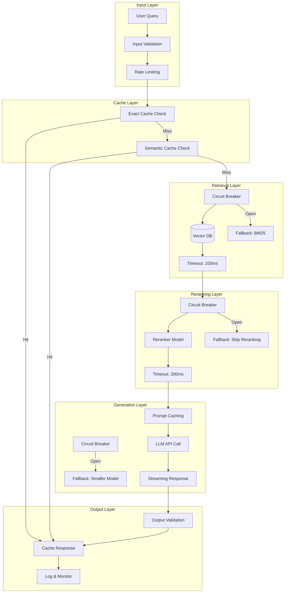

# 9.15 Production RAG Patterns — Overview

## Introduction

Building a RAG system that works in a Jupyter notebook is one thing. Running it reliably at scale — with hundreds or thousands of concurrent users, sub-second response times, and predictable costs — is an entirely different challenge. Production RAG patterns are the battle-tested engineering practices that bridge this gap.

This section covers six critical areas that every production RAG system needs: **caching strategies** that cut costs and latency, **batching and async processing** for throughput, **fallback and circuit breaker patterns** for resilience, **latency optimization** techniques to hit response time targets, **monitoring and observability** for visibility into system health, and **A/B testing** for data-driven iteration.

## Prerequisites

Before diving into production patterns, you should be comfortable with:

- **RAG fundamentals** (Lessons 1–5): Document ingestion, embedding, retrieval, generation
- **Retrieval strategies** (Lessons 8–10): Hybrid search, reranking, query transformation
- **Python async programming**: `asyncio`, `await`, `async for`
- **Basic software engineering**: Error handling, logging, configuration management

## The Production RAG Pipeline

A prototype RAG pipeline is a simple chain: query → retrieve → generate. A production pipeline adds multiple layers of engineering around that core:



## Key Production Metrics

Every production RAG system should track these metrics across its pipeline:

| Metric | Target | Why It Matters |
|--------|--------|---------------|
| **Retrieval latency** (p50) | < 50ms | Users expect instant results |
| **Retrieval latency** (p99) | < 100ms | Tail latency kills experience |
| **Reranking latency** | < 200ms | Additional quality step budget |
| **End-to-end latency** (TTFB) | < 1s | Time to first token with streaming |
| **End-to-end latency** (total) | < 2s | Total response completion |
| **Cache hit rate** | > 30% | Cost reduction indicator |
| **Retrieval relevance** (MRR@10) | > 0.7 | Quality of retrieved documents |
| **Error rate** | < 0.1% | System reliability |
| **LLM cost per query** | Tracked | Budget management |
| **Availability** | 99.9%+ | Three nines uptime |

## The Cost of Getting It Wrong

Production failures in RAG systems cascade quickly:

```
Scenario: Vector DB goes down for 30 seconds

Without production patterns:
  → All queries fail instantly
  → 500 errors returned to users
  → No visibility into what happened
  → Manual investigation needed
  → Time to recovery: 30+ minutes

With production patterns:
  → Circuit breaker detects failures in 5 seconds
  → Fallback to BM25 search activates automatically
  → Cached responses continue serving common queries
  → Alert fires to on-call engineer
  → Monitoring dashboard shows exactly what happened
  → Time to recovery: automatic (0 minutes)
```

## Quick Example: Production-Ready RAG Wrapper

Here's a preview of what a production-hardened RAG call looks like, combining multiple patterns we'll explore in this section:

```python
import asyncio
import time
import hashlib
from dataclasses import dataclass, field
from typing import Optional


@dataclass
class RAGResponse:
    """Structured response from the RAG pipeline."""
    answer: str
    sources: list[dict]
    latency_ms: float
    cache_hit: bool
    model_used: str
    retrieval_count: int


@dataclass
class RAGMetrics:
    """Collected metrics from a single RAG invocation."""
    query_hash: str
    retrieval_latency_ms: float = 0.0
    reranking_latency_ms: float = 0.0
    generation_latency_ms: float = 0.0
    total_latency_ms: float = 0.0
    cache_hit: bool = False
    fallback_used: bool = False
    error: Optional[str] = None


class ProductionRAGPipeline:
    """A RAG pipeline with caching, fallbacks, and monitoring."""

    def __init__(self, config: dict):
        self.cache = QueryCache(config["cache"])
        self.retriever = ResilientRetriever(config["retrieval"])
        self.generator = ResilientGenerator(config["generation"])
        self.monitor = RAGMonitor(config["monitoring"])

    async def query(self, question: str, user_id: str) -> RAGResponse:
        """Execute a production RAG query with all safety patterns."""
        start = time.perf_counter()
        metrics = RAGMetrics(query_hash=hashlib.md5(question.encode()).hexdigest())

        try:
            # 1. Check cache first
            cached = await self.cache.get(question)
            if cached:
                metrics.cache_hit = True
                metrics.total_latency_ms = (time.perf_counter() - start) * 1000
                self.monitor.record(metrics)
                return cached

            # 2. Retrieve with circuit breaker + fallback
            t0 = time.perf_counter()
            documents = await self.retriever.retrieve(question)
            metrics.retrieval_latency_ms = (time.perf_counter() - t0) * 1000

            # 3. Generate with timeout + streaming
            t0 = time.perf_counter()
            response = await self.generator.generate(question, documents)
            metrics.generation_latency_ms = (time.perf_counter() - t0) * 1000

            # 4. Cache the result
            await self.cache.set(question, response)

            metrics.total_latency_ms = (time.perf_counter() - start) * 1000
            self.monitor.record(metrics)
            return response

        except Exception as e:
            metrics.error = str(e)
            metrics.total_latency_ms = (time.perf_counter() - start) * 1000
            self.monitor.record(metrics)
            raise
```

This is a taste of what we'll build throughout this section. Each sub-lesson dives deep into one of these patterns.

## What You'll Learn

### Lesson 1: [Caching Strategies](./01-caching-strategies.md)
How to implement query-level caching, semantic caching for similar questions, context caching for repeated documents, and Claude's prompt caching for up to 90% cost reduction.

### Lesson 2: [Batching & Async Processing](./02-batching-async-processing.md)
Techniques for batch embedding generation, parallel retrieval across collections, async LLM calls, and queue-based document ingestion pipelines.

### Lesson 3: [Fallback & Circuit Breakers](./03-fallback-circuit-breakers.md)
Building resilient retrieval with timeout handling, empty result fallbacks, LLM error recovery, and circuit breaker patterns that prevent cascade failures.

### Lesson 4: [Latency Optimization](./04-latency-optimization.md)
Hitting production latency targets: < 100ms retrieval, < 200ms reranking, < 2s total pipeline, plus streaming for perceived speed and profiling for bottlenecks.

### Lesson 5: [Monitoring & Observability](./05-monitoring-observability.md)
Setting up retrieval latency tracking, cache hit rate dashboards, relevance score distributions, error rate monitoring, and LangSmith for trace visualization.

### Lesson 6: [A/B Testing RAG Changes](./06-ab-testing-rag.md)
Running controlled experiments on chunking strategies, retrieval algorithms, prompt variations, and using metrics like MRR, faithfulness, and user satisfaction for data-driven optimization.

## Key Terminology

| Term | Definition |
|------|-----------|
| **Cache hit rate** | Percentage of queries served from cache rather than full pipeline execution |
| **Semantic cache** | Cache that matches queries by meaning (vector similarity) rather than exact string match |
| **Circuit breaker** | Pattern that stops calling a failing service to prevent cascade failures; has Closed, Open, and Half-Open states |
| **Graceful degradation** | Serving reduced-quality responses when components fail, rather than returning errors |
| **TTFB** | Time To First Byte — how quickly the user sees the first token of a streaming response |
| **p99 latency** | The latency at the 99th percentile — 99% of requests are faster than this value |
| **Prompt caching** | API feature (e.g., Anthropic's) that caches prefix tokens across requests for cost and speed savings |
| **Observability** | The ability to understand a system's internal state from its external outputs (logs, metrics, traces) |
| **A/B testing** | Controlled experiment comparing two system variants to measure which performs better |
| **Trace** | End-to-end record of a request through the RAG pipeline, capturing each step's inputs, outputs, and timing |
| **Fallback** | Alternative execution path used when the primary path fails or times out |
| **Rate limiting** | Controlling the number of requests processed per time window to prevent overload |

---

**Next:** [Caching Strategies →](./01-caching-strategies.md)
