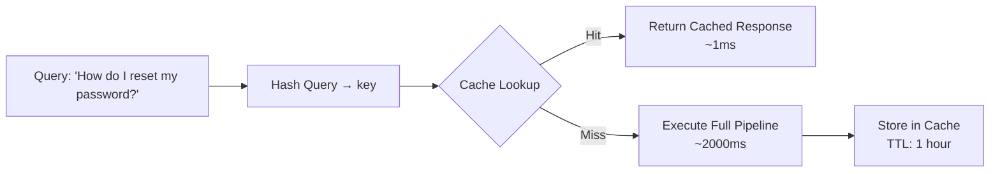
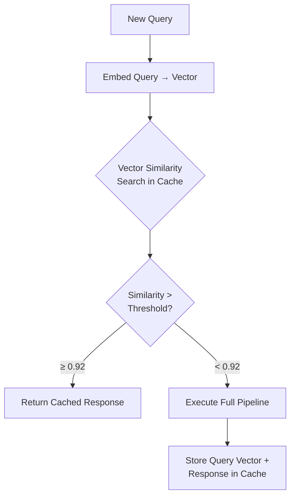
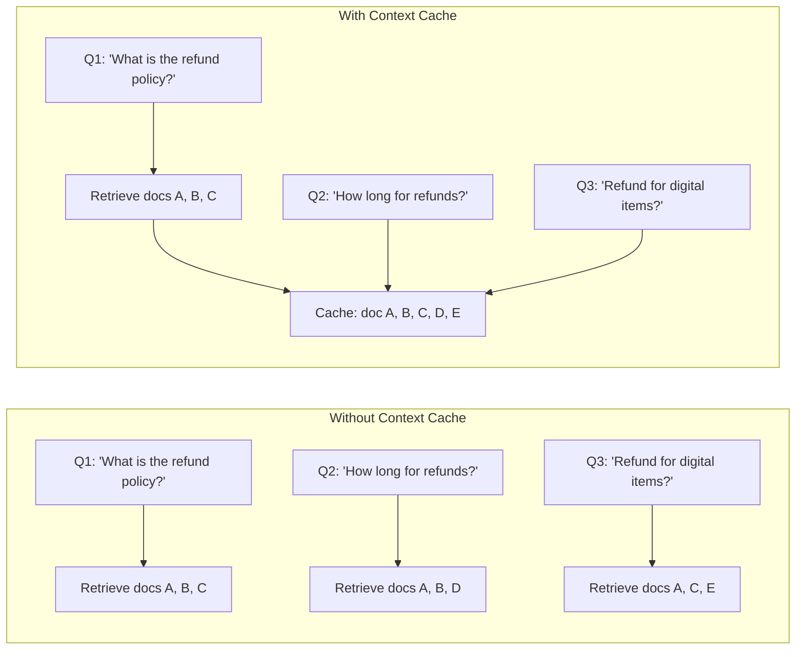
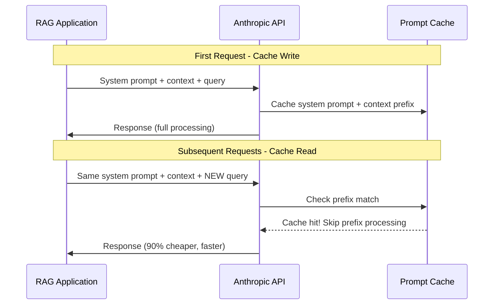
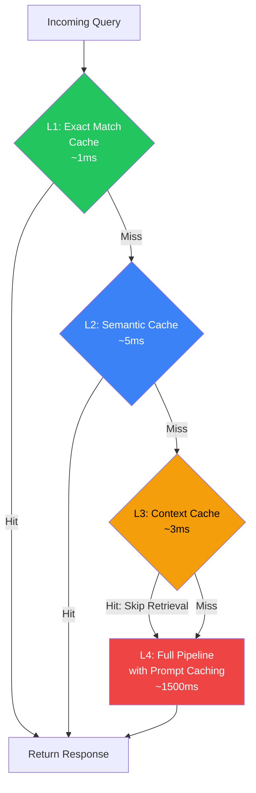

# 9.15.1 Caching Strategies for RAG Systems

## Introduction

Caching is the single most impactful optimization you can apply to a production RAG system. A well-designed caching strategy can reduce costs by 50–90%, cut response times from seconds to milliseconds, and dramatically reduce load on your vector database and LLM provider. But RAG caching is more nuanced than traditional web caching — you need to handle the fuzzy nature of natural language queries while maintaining answer freshness and accuracy.

This lesson covers four caching strategies, from simple exact-match caching to sophisticated semantic caching, and includes the powerful prompt caching capabilities offered by providers like Anthropic.

## Prerequisites

- Understanding of RAG pipeline components (Lesson 9.1–9.5)
- Basic familiarity with key-value stores (Redis concepts)
- Python `async`/`await` syntax
- Understanding of vector embeddings (Lesson 9.7)

---

## The Caching Opportunity in RAG

Before diving into strategies, let's understand why caching matters so much in RAG. Every RAG query involves multiple expensive operations:

```
Full RAG Pipeline Cost Breakdown (per query):
┌─────────────────────────────────────────────┐
│ 1. Query Embedding        ~10ms,   $0.00001 │
│ 2. Vector Search          ~50ms,   $0.0001  │
│ 3. Reranking              ~200ms,  $0.001   │
│ 4. LLM Generation         ~2000ms, $0.01    │
│                                              │
│ Total:                    ~2260ms, ~$0.011   │
│                                              │
│ With cache hit:           ~5ms,    ~$0.00    │
│ Savings:                  99.8% time,        │
│                           99.9% cost         │
└─────────────────────────────────────────────┘
```

In real-world applications, 20–60% of queries are either identical or semantically equivalent to previous queries. Customer support bots, FAQ systems, and documentation assistants see even higher repetition rates.

---

## Strategy 1: Query-Level Caching (Exact Match)

The simplest and fastest caching strategy: store the exact query string as a key and the full RAG response as the value. If the same query comes in again, return the cached response immediately.

### How It Works



### Implementation

```python
import hashlib
import json
import time
from dataclasses import dataclass, field
from typing import Optional

import redis.asyncio as redis


@dataclass
class CachedResponse:
    """A cached RAG response with metadata."""
    answer: str
    sources: list[dict]
    cached_at: float
    query: str
    ttl_seconds: int


class ExactMatchCache:
    """Query-level cache using exact string matching.

    Fast and simple — works best when users submit identical queries,
    such as FAQ systems, chatbot interfaces, or API endpoints
    where client applications cache and resend queries.
    """

    def __init__(
        self,
        redis_url: str = "redis://localhost:6379",
        default_ttl: int = 3600,  # 1 hour
        key_prefix: str = "rag:exact:",
    ):
        self.redis = redis.from_url(redis_url)
        self.default_ttl = default_ttl
        self.key_prefix = key_prefix
        self.stats = {"hits": 0, "misses": 0}

    def _make_key(self, query: str) -> str:
        """Create a cache key from the query string.

        We normalize the query (lowercase, strip whitespace) and hash it
        to create a fixed-length key that works well with Redis.
        """
        normalized = query.strip().lower()
        query_hash = hashlib.sha256(normalized.encode()).hexdigest()[:16]
        return f"{self.key_prefix}{query_hash}"

    async def get(self, query: str) -> Optional[CachedResponse]:
        """Look up a cached response for the exact query."""
        key = self._make_key(query)
        data = await self.redis.get(key)

        if data is None:
            self.stats["misses"] += 1
            return None

        self.stats["hits"] += 1
        cached = json.loads(data)
        return CachedResponse(**cached)

    async def set(
        self,
        query: str,
        answer: str,
        sources: list[dict],
        ttl: Optional[int] = None,
    ) -> None:
        """Store a RAG response in the cache."""
        key = self._make_key(query)
        response = CachedResponse(
            answer=answer,
            sources=sources,
            cached_at=time.time(),
            query=query,
            ttl_seconds=ttl or self.default_ttl,
        )
        await self.redis.set(
            key,
            json.dumps(response.__dict__),
            ex=ttl or self.default_ttl,
        )

    async def invalidate(self, query: str) -> bool:
        """Remove a specific query from cache."""
        key = self._make_key(query)
        return bool(await self.redis.delete(key))

    async def clear_all(self) -> int:
        """Clear all cached queries. Returns count of deleted keys."""
        keys = []
        async for key in self.redis.scan_iter(f"{self.key_prefix}*"):
            keys.append(key)
        if keys:
            return await self.redis.delete(*keys)
        return 0

    @property
    def hit_rate(self) -> float:
        """Calculate cache hit rate as a percentage."""
        total = self.stats["hits"] + self.stats["misses"]
        if total == 0:
            return 0.0
        return (self.stats["hits"] / total) * 100


# Usage example
async def example_exact_cache():
    cache = ExactMatchCache(redis_url="redis://localhost:6379")

    # First query — cache miss, execute full pipeline
    query = "How do I reset my password?"
    cached = await cache.get(query)

    if cached is None:
        # Execute full RAG pipeline
        answer = "To reset your password, go to Settings > Security > Reset Password..."
        sources = [{"doc": "user-guide.md", "chunk": 42}]

        # Store result in cache
        await cache.set(query, answer, sources, ttl=3600)
        print(f"Cache MISS — stored result (TTL: 1 hour)")
    else:
        print(f"Cache HIT — returned in ~1ms")
        print(f"Answer: {cached.answer}")

    # Second identical query — cache hit!
    cached = await cache.get(query)
    print(f"Hit rate: {cache.hit_rate:.1f}%")
```

### Limitations of Exact Match

Exact match caching has a critical weakness — it only matches identical strings:

| Query 1 | Query 2 | Match? |
|---------|---------|--------|
| "How do I reset my password?" | "How do I reset my password?" | ✅ Hit |
| "How do I reset my password?" | "how do i reset my password?" | ✅ Hit (after normalization) |
| "How do I reset my password?" | "How can I change my password?" | ❌ Miss |
| "How do I reset my password?" | "Password reset instructions" | ❌ Miss |
| "How do I reset my password?" | "I forgot my password" | ❌ Miss |

All five queries above are asking for essentially the same information, but exact matching only catches the first two. This is where semantic caching comes in.

---

## Strategy 2: Semantic Caching

Semantic caching matches queries based on their **meaning** rather than their exact text. It converts queries into vector embeddings and uses cosine similarity to find cached queries that ask the same thing in different words.

### How It Works



### Implementation

```python
import numpy as np
import time
import json
from dataclasses import dataclass
from typing import Optional


@dataclass
class SemanticCacheEntry:
    """An entry in the semantic cache."""
    query: str
    query_embedding: list[float]
    answer: str
    sources: list[dict]
    cached_at: float
    access_count: int = 0


class SemanticCache:
    """Cache that matches queries by semantic similarity.

    Uses vector embeddings to find semantically equivalent queries.
    A query like 'How do I reset my password?' will match
    'I forgot my password, how can I change it?' if they're
    similar enough (above the similarity threshold).

    Args:
        embedding_model: Model to generate query embeddings
        similarity_threshold: Minimum cosine similarity for a cache hit (0.0-1.0)
        max_entries: Maximum number of cached entries (LRU eviction)
        ttl_seconds: Time-to-live for cache entries
    """

    def __init__(
        self,
        embedding_model,
        similarity_threshold: float = 0.92,
        max_entries: int = 10_000,
        ttl_seconds: int = 3600,
    ):
        self.embedding_model = embedding_model
        self.similarity_threshold = similarity_threshold
        self.max_entries = max_entries
        self.ttl_seconds = ttl_seconds

        # In-memory storage (production: use a vector DB)
        self.entries: list[SemanticCacheEntry] = []
        self.embedding_matrix: Optional[np.ndarray] = None

        self.stats = {"hits": 0, "misses": 0, "near_misses": 0}

    def _cosine_similarity(
        self, query_vec: np.ndarray, matrix: np.ndarray
    ) -> np.ndarray:
        """Compute cosine similarity between a query vector and all cached vectors."""
        # Normalize vectors
        query_norm = query_vec / np.linalg.norm(query_vec)
        matrix_norms = matrix / np.linalg.norm(matrix, axis=1, keepdims=True)
        return np.dot(matrix_norms, query_norm)

    async def get(self, query: str) -> Optional[SemanticCacheEntry]:
        """Look up a semantically similar cached response.

        Returns the cached response if a sufficiently similar query
        exists in the cache. Otherwise returns None.
        """
        if not self.entries:
            self.stats["misses"] += 1
            return None

        # Embed the query
        query_embedding = await self.embedding_model.embed(query)
        query_vec = np.array(query_embedding)

        # Compute similarity against all cached entries
        similarities = self._cosine_similarity(query_vec, self.embedding_matrix)
        best_idx = int(np.argmax(similarities))
        best_score = float(similarities[best_idx])

        # Check if the best match is above threshold
        if best_score >= self.similarity_threshold:
            entry = self.entries[best_idx]

            # Check TTL
            if time.time() - entry.cached_at > self.ttl_seconds:
                # Entry expired — remove it
                self._remove_entry(best_idx)
                self.stats["misses"] += 1
                return None

            entry.access_count += 1
            self.stats["hits"] += 1
            return entry

        # Track near misses for threshold tuning
        if best_score >= self.similarity_threshold - 0.05:
            self.stats["near_misses"] += 1

        self.stats["misses"] += 1
        return None

    async def set(
        self, query: str, answer: str, sources: list[dict]
    ) -> None:
        """Store a new query-response pair in the semantic cache."""
        query_embedding = await self.embedding_model.embed(query)

        entry = SemanticCacheEntry(
            query=query,
            query_embedding=query_embedding,
            answer=answer,
            sources=sources,
            cached_at=time.time(),
        )

        # Evict oldest entry if at capacity
        if len(self.entries) >= self.max_entries:
            self._evict_lru()

        self.entries.append(entry)
        self._rebuild_matrix()

    def _rebuild_matrix(self) -> None:
        """Rebuild the embedding matrix from all entries."""
        if self.entries:
            self.embedding_matrix = np.array(
                [e.query_embedding for e in self.entries]
            )
        else:
            self.embedding_matrix = None

    def _remove_entry(self, idx: int) -> None:
        """Remove an entry by index and rebuild the matrix."""
        self.entries.pop(idx)
        self._rebuild_matrix()

    def _evict_lru(self) -> None:
        """Evict the least recently used entry."""
        if not self.entries:
            return
        # Find entry with lowest access_count (simple LRU proxy)
        lru_idx = min(range(len(self.entries)), key=lambda i: self.entries[i].access_count)
        self._remove_entry(lru_idx)

    def get_diagnostics(self) -> dict:
        """Get cache performance diagnostics for monitoring."""
        total = self.stats["hits"] + self.stats["misses"]
        return {
            "total_queries": total,
            "hit_rate": (self.stats["hits"] / total * 100) if total > 0 else 0,
            "near_miss_rate": (self.stats["near_misses"] / total * 100) if total > 0 else 0,
            "entries_count": len(self.entries),
            "capacity_used": len(self.entries) / self.max_entries * 100,
        }
```

### Choosing the Right Similarity Threshold

The similarity threshold is the most important parameter in semantic caching. Too high, and you'll rarely get cache hits. Too low, and you'll serve incorrect cached responses.

| Threshold | Hit Rate | False Positive Risk | Best For |
|-----------|----------|-------------------|----------|
| **0.98+** | Very low (~5%) | Nearly zero | High-stakes (medical, legal) |
| **0.95** | Low (~15%) | Very low | Precise technical queries |
| **0.92** | Medium (~30%) | Low | General purpose (recommended) |
| **0.88** | High (~45%) | Moderate | FAQ-style applications |
| **0.85** | Very high (~55%) | High | Casual chatbots |

**Best practice:** Start at 0.92, monitor false positives (cached responses that don't answer the new query), and adjust based on your data.

```python
class AdaptiveThreshold:
    """Automatically adjusts similarity threshold based on user feedback.

    If users frequently reject cached responses (thumbs down),
    the threshold increases. If cache hits are always accepted,
    the threshold can decrease to improve hit rate.
    """

    def __init__(self, initial_threshold: float = 0.92):
        self.threshold = initial_threshold
        self.feedback_window: list[bool] = []  # True = accepted, False = rejected
        self.window_size = 100

    def record_feedback(self, accepted: bool) -> None:
        """Record whether a cached response was accepted by the user."""
        self.feedback_window.append(accepted)
        if len(self.feedback_window) > self.window_size:
            self.feedback_window.pop(0)

        # Adjust threshold based on recent feedback
        if len(self.feedback_window) >= 20:
            rejection_rate = 1 - (sum(self.feedback_window) / len(self.feedback_window))

            if rejection_rate > 0.05:  # More than 5% rejections
                self.threshold = min(0.99, self.threshold + 0.01)
            elif rejection_rate < 0.01:  # Less than 1% rejections
                self.threshold = max(0.85, self.threshold - 0.005)
```

---

## Strategy 3: Context Caching (Document-Level)

Context caching addresses a different problem: when multiple queries retrieve the **same documents**, we can cache the retrieved context to skip the retrieval step entirely.

### When Context Caching Helps

This is especially valuable when:
- Multiple users ask questions about the same popular document
- A single user asks multiple questions about a document they just uploaded
- Your knowledge base has "hot" documents that appear in many query results



### Implementation

```python
import time
import hashlib
from typing import Optional
from dataclasses import dataclass


@dataclass
class CachedContext:
    """Cached document context for a topic cluster."""
    documents: list[dict]
    document_hashes: set[str]
    topic_embedding: list[float]
    cached_at: float
    access_count: int = 0


class ContextCache:
    """Caches retrieved document contexts for topic clusters.

    When a query matches a known topic cluster, the cached documents
    are returned directly, skipping the vector search entirely.
    This is useful when many queries hit the same set of documents.
    """

    def __init__(
        self,
        embedding_model,
        topic_threshold: float = 0.88,
        max_clusters: int = 500,
        ttl_seconds: int = 1800,  # 30 minutes
    ):
        self.embedding_model = embedding_model
        self.topic_threshold = topic_threshold
        self.max_clusters = max_clusters
        self.ttl_seconds = ttl_seconds
        self.clusters: list[CachedContext] = []

    async def get_context(
        self, query: str
    ) -> Optional[list[dict]]:
        """Try to find cached documents relevant to this query.

        Returns cached documents if the query matches an existing
        topic cluster, otherwise returns None.
        """
        if not self.clusters:
            return None

        query_embedding = await self.embedding_model.embed(query)

        for cluster in self.clusters:
            similarity = self._cosine_sim(query_embedding, cluster.topic_embedding)
            if similarity >= self.topic_threshold:
                # Check TTL
                if time.time() - cluster.cached_at > self.ttl_seconds:
                    self.clusters.remove(cluster)
                    return None

                cluster.access_count += 1
                return cluster.documents

        return None

    async def store_context(
        self,
        query: str,
        documents: list[dict],
    ) -> None:
        """Store retrieved documents as a topic cluster."""
        query_embedding = await self.embedding_model.embed(query)
        doc_hashes = {
            hashlib.md5(json.dumps(doc, sort_keys=True).encode()).hexdigest()
            for doc in documents
        }

        # Check if this overlaps with an existing cluster
        for cluster in self.clusters:
            overlap = len(doc_hashes & cluster.document_hashes) / max(
                len(doc_hashes), len(cluster.document_hashes)
            )
            if overlap > 0.5:
                # Merge into existing cluster
                cluster.documents = self._merge_docs(
                    cluster.documents, documents
                )
                cluster.document_hashes |= doc_hashes
                cluster.cached_at = time.time()
                return

        # Create new cluster
        if len(self.clusters) >= self.max_clusters:
            # Evict least accessed cluster
            self.clusters.sort(key=lambda c: c.access_count)
            self.clusters.pop(0)

        self.clusters.append(
            CachedContext(
                documents=documents,
                document_hashes=doc_hashes,
                topic_embedding=query_embedding,
                cached_at=time.time(),
            )
        )

    def _merge_docs(
        self, existing: list[dict], new: list[dict]
    ) -> list[dict]:
        """Merge document lists, deduplicating by content hash."""
        seen = set()
        merged = []
        for doc in existing + new:
            doc_hash = hashlib.md5(
                json.dumps(doc, sort_keys=True).encode()
            ).hexdigest()
            if doc_hash not in seen:
                seen.add(doc_hash)
                merged.append(doc)
        return merged

    @staticmethod
    def _cosine_sim(a: list[float], b: list[float]) -> float:
        """Compute cosine similarity between two vectors."""
        import numpy as np
        a_arr, b_arr = np.array(a), np.array(b)
        return float(
            np.dot(a_arr, b_arr) / (np.linalg.norm(a_arr) * np.linalg.norm(b_arr))
        )
```

---

## Strategy 4: Prompt Caching (Provider-Level)

Prompt caching is a game-changing feature offered by LLM providers (most notably Anthropic) that caches the **prefix** of your prompt at the API level. For RAG systems, this means the system prompt and frequently-retrieved context can be cached, dramatically reducing both cost and latency.

### How Prompt Caching Works



### Anthropic Prompt Caching for RAG

```python
from anthropic import Anthropic


def create_rag_request_with_caching(
    system_prompt: str,
    retrieved_context: str,
    user_query: str,
    model: str = "claude-sonnet-4-5-20250929",
) -> dict:
    """Create an Anthropic API request with prompt caching for RAG.

    The system prompt and retrieved context are marked for caching
    with cache_control. On subsequent requests with the same prefix,
    these tokens are read from cache at 1/10th the cost.

    Pricing impact (Claude Sonnet 4):
    - Base input: $3/MTok
    - Cache write: $3.75/MTok (1.25x, first request only)
    - Cache read: $0.30/MTok (0.1x, all subsequent requests!)

    For a RAG system with a 2000-token system prompt + 8000-token context:
    - Without caching: 10,000 tokens × $3/MTok = $0.03 per query
    - With caching (after first): 10,000 tokens × $0.30/MTok = $0.003 per query
    - Savings: 90% on input tokens!
    """
    client = Anthropic()

    response = client.messages.create(
        model=model,
        max_tokens=1024,
        system=[
            {
                "type": "text",
                "text": system_prompt,
                # Cache the system prompt — it rarely changes
                "cache_control": {"type": "ephemeral"},
            },
            {
                "type": "text",
                "text": f"Retrieved context:\n\n{retrieved_context}",
                # Cache the context — same for related queries
                "cache_control": {"type": "ephemeral"},
            },
        ],
        messages=[
            {
                "role": "user",
                "content": user_query,
            }
        ],
    )

    # Check cache performance in the response
    usage = response.usage
    cache_metrics = {
        "input_tokens": usage.input_tokens,
        "cache_read_tokens": getattr(usage, "cache_read_input_tokens", 0),
        "cache_write_tokens": getattr(usage, "cache_creation_input_tokens", 0),
        "output_tokens": usage.output_tokens,
    }

    # Calculate effective cost
    total_input = (
        cache_metrics["cache_read_tokens"]
        + cache_metrics["cache_write_tokens"]
        + cache_metrics["input_tokens"]
    )
    is_cache_hit = cache_metrics["cache_read_tokens"] > 0

    print(f"Total input tokens: {total_input}")
    print(f"Cache {'HIT' if is_cache_hit else 'MISS'}")
    if is_cache_hit:
        savings = (1 - 0.1) * cache_metrics["cache_read_tokens"] / total_input
        print(f"Estimated savings: {savings:.0%}")

    return {
        "response": response.content[0].text,
        "cache_metrics": cache_metrics,
    }


# RAG application using prompt caching
class CacheOptimizedRAG:
    """RAG pipeline that leverages Anthropic's prompt caching.

    Keeps the system prompt and frequently-used context cached
    to minimize cost on repeated queries about the same topics.
    """

    def __init__(self, system_prompt: str):
        self.system_prompt = system_prompt
        self.client = Anthropic()
        self.context_cache: dict[str, str] = {}  # topic → context

    def query(
        self,
        question: str,
        context: str,
        model: str = "claude-sonnet-4-5-20250929",
    ) -> dict:
        """Execute a RAG query with prompt caching."""
        response = self.client.messages.create(
            model=model,
            max_tokens=1024,
            system=[
                {
                    "type": "text",
                    "text": self.system_prompt,
                    "cache_control": {"type": "ephemeral"},
                },
                {
                    "type": "text",
                    "text": f"Context:\n{context}",
                    "cache_control": {"type": "ephemeral"},
                },
            ],
            messages=[{"role": "user", "content": question}],
        )

        return {
            "answer": response.content[0].text,
            "cached_tokens": getattr(
                response.usage, "cache_read_input_tokens", 0
            ),
        }
```

### Prompt Caching Constraints and Best Practices

| Aspect | Details |
|--------|---------|
| **Minimum cacheable size** | 1,024 tokens (Sonnet), 4,096 tokens (Opus, Haiku 4.5) |
| **Cache lifetime** | 5 minutes (default, free refresh), 1 hour (at 2× base price) |
| **Max breakpoints** | 4 per request |
| **Cache matching** | Exact prefix match — any change to cached content invalidates |
| **Structure order** | tools → system → messages (cache hierarchy) |
| **Best for RAG** | Cache system prompt + large context documents |

**Key strategies for RAG prompt caching:**

1. **Put stable content first**: System prompt (rarely changes) → Retrieved context (changes per topic) → User query (always changes)
2. **Group related queries**: When a user asks follow-up questions about the same documents, the cached context carries over automatically
3. **Use the 5-minute window**: For chatbot sessions, the cache refreshes with each query, so multi-turn conversations benefit naturally
4. **Monitor cache metrics**: Track `cache_read_input_tokens` in the response to measure your hit rate

---

## Combining Cache Layers: The Cache Waterfall

In production, you don't choose one caching strategy — you layer them in a **cache waterfall** where each miss cascades to the next level:



### Multi-Layer Cache Implementation

```python
import time
from typing import Optional
from dataclasses import dataclass


@dataclass
class CacheResult:
    """Result from the cache waterfall."""
    response: Optional[dict]
    cache_level: str  # "exact", "semantic", "context", "none"
    latency_ms: float


class CacheWaterfall:
    """Multi-layer cache that checks each level in order.

    Layer 1 (Exact Match): Fastest, lowest hit rate
    Layer 2 (Semantic): Moderate speed, moderate hit rate
    Layer 3 (Context): Caches documents, not full responses
    Layer 4 (Prompt): Provider-level caching for LLM cost reduction

    Each layer adds ~1–5ms of overhead, but a hit at any layer
    saves 1000–2000ms of full pipeline execution.
    """

    def __init__(
        self,
        exact_cache: ExactMatchCache,
        semantic_cache: SemanticCache,
        context_cache: ContextCache,
    ):
        self.exact = exact_cache
        self.semantic = semantic_cache
        self.context = context_cache
        self.stats = {
            "exact_hits": 0,
            "semantic_hits": 0,
            "context_hits": 0,
            "misses": 0,
        }

    async def lookup(self, query: str) -> CacheResult:
        """Check all cache layers in order, returning the first hit."""
        start = time.perf_counter()

        # Layer 1: Exact match (fastest)
        exact_result = await self.exact.get(query)
        if exact_result:
            self.stats["exact_hits"] += 1
            return CacheResult(
                response={"answer": exact_result.answer, "sources": exact_result.sources},
                cache_level="exact",
                latency_ms=(time.perf_counter() - start) * 1000,
            )

        # Layer 2: Semantic match
        semantic_result = await self.semantic.get(query)
        if semantic_result:
            self.stats["semantic_hits"] += 1
            return CacheResult(
                response={"answer": semantic_result.answer, "sources": semantic_result.sources},
                cache_level="semantic",
                latency_ms=(time.perf_counter() - start) * 1000,
            )

        # Layer 3: Context match (returns documents, not full response)
        context_docs = await self.context.get_context(query)
        if context_docs:
            self.stats["context_hits"] += 1
            return CacheResult(
                response={"documents": context_docs},  # Still need generation
                cache_level="context",
                latency_ms=(time.perf_counter() - start) * 1000,
            )

        # All caches missed
        self.stats["misses"] += 1
        return CacheResult(
            response=None,
            cache_level="none",
            latency_ms=(time.perf_counter() - start) * 1000,
        )

    def get_stats(self) -> dict:
        """Return cache performance statistics."""
        total = sum(self.stats.values())
        if total == 0:
            return {"total": 0, "overall_hit_rate": 0}

        return {
            "total_queries": total,
            "exact_hit_rate": f"{self.stats['exact_hits'] / total:.1%}",
            "semantic_hit_rate": f"{self.stats['semantic_hits'] / total:.1%}",
            "context_hit_rate": f"{self.stats['context_hits'] / total:.1%}",
            "overall_hit_rate": f"{(total - self.stats['misses']) / total:.1%}",
            "miss_rate": f"{self.stats['misses'] / total:.1%}",
        }
```

---

## Cache Invalidation Strategies

Cache invalidation — knowing when to discard stale cached responses — is famously one of the hardest problems in computing. For RAG systems, you need strategies for different scenarios:

### Time-Based (TTL)

```python
# Different TTLs for different content types
TTL_CONFIG = {
    "static_faq": 86400,       # 24 hours — FAQs rarely change
    "product_docs": 3600,      # 1 hour — docs update periodically
    "pricing_info": 300,       # 5 minutes — prices change frequently
    "real_time_data": 30,      # 30 seconds — stock quotes, weather
    "user_specific": 600,      # 10 minutes — personalized results
}
```

### Event-Based Invalidation

```python
class EventDrivenCacheInvalidation:
    """Invalidate cache entries when source documents change.

    Listens for document update events and clears any cached
    responses that were generated from those documents.
    """

    def __init__(self, cache: ExactMatchCache):
        self.cache = cache
        self.doc_to_queries: dict[str, set[str]] = {}

    async def on_document_updated(self, doc_id: str) -> int:
        """Called when a source document is updated.

        Invalidates all cached responses that used this document.
        Returns the number of cache entries invalidated.
        """
        affected_queries = self.doc_to_queries.get(doc_id, set())
        invalidated = 0

        for query in affected_queries:
            if await self.cache.invalidate(query):
                invalidated += 1

        # Clean up tracking
        self.doc_to_queries.pop(doc_id, None)
        return invalidated

    def track_query_documents(
        self, query: str, doc_ids: list[str]
    ) -> None:
        """Track which documents were used to answer a query."""
        for doc_id in doc_ids:
            if doc_id not in self.doc_to_queries:
                self.doc_to_queries[doc_id] = set()
            self.doc_to_queries[doc_id].add(query)
```

---

## Summary

| Strategy | Speed | Hit Rate | Cost | Complexity | Best For |
|----------|-------|----------|------|------------|----------|
| **Exact match** | ~1ms | Low (10–20%) | Very low | Simple | Identical repeated queries |
| **Semantic cache** | ~5ms | Medium (30–45%) | Moderate | Medium | Natural language variation |
| **Context cache** | ~3ms | Medium (25–35%) | Low | Medium | Same-document queries |
| **Prompt caching** | Provider-level | High (60–80%) | Very low | Simple | Multi-turn, repeated context |
| **Cache waterfall** | ~5ms worst | High (50–70%) | Combined | Higher | Production systems |

### Key Takeaways

1. **Start with exact match caching** — it's the easiest win with zero risk of serving wrong answers
2. **Add semantic caching** when your users phrase the same questions differently (most real-world scenarios)
3. **Use prompt caching** (Anthropic) to reduce LLM costs by up to 90% — it's nearly free to enable
4. **Layer your caches** in a waterfall for maximum hit rate
5. **Monitor hit rates** and adjust thresholds based on real traffic patterns
6. **Invalidate proactively** when source documents change

## Practice Exercises

1. **Implement an in-memory exact match cache** with TTL support and measure the hit rate on a set of 100 test queries where 30% are duplicates
2. **Build a semantic cache** using a local embedding model and experiment with different similarity thresholds (0.85, 0.90, 0.95) — measure hit rate vs. false positive rate
3. **Calculate cost savings** for a Claude-based RAG system processing 10,000 queries/day with a 5,000-token system prompt and 8,000-token context, comparing with and without prompt caching
4. **Design a cache invalidation strategy** for a knowledge base that updates 50 documents per day out of 10,000 total

---

← [Previous: Overview](./00-production-rag-patterns.md) | [Next: Batching & Async Processing →](./02-batching-async-processing.md)
