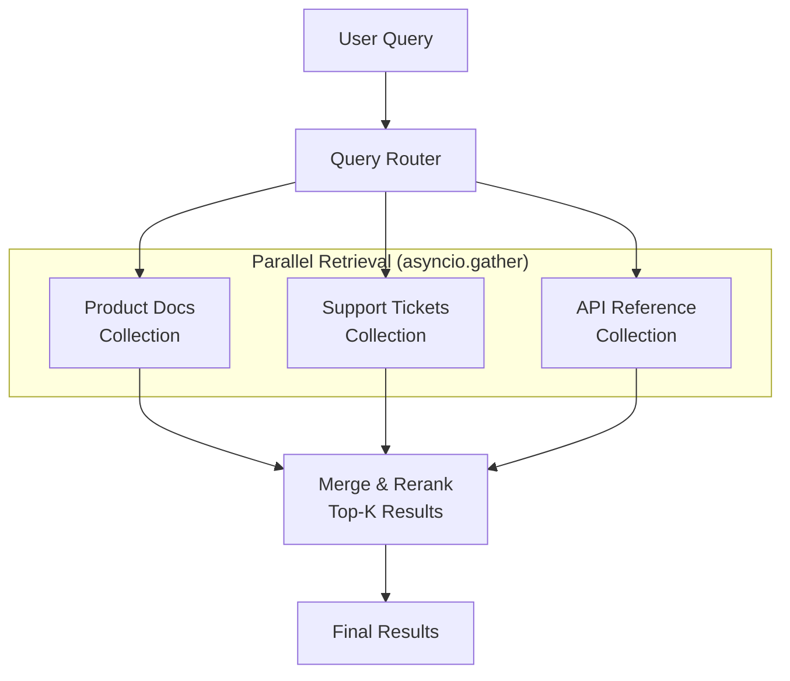
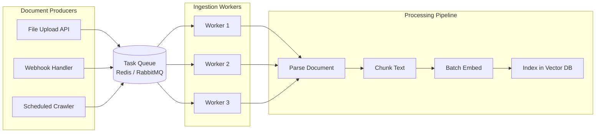

# 9.15.2 Batching & Async Processing

## Introduction

A production RAG system handles three fundamentally different workloads: **real-time queries** from users expecting instant responses, **bulk ingestion** of new documents into the knowledge base, and **batch operations** like re-embedding documents or running evaluations. Each workload demands a different processing strategy.

This lesson covers how to use Python's async capabilities and batching techniques to maximize throughput, reduce costs, and keep your RAG pipeline responsive under load. You'll learn to process embeddings in batches (reducing API costs by up to 80%), run retrieval queries in parallel across multiple collections, handle LLM calls asynchronously, and build queue-based document ingestion pipelines.

## Prerequisites

- Python `asyncio` fundamentals (`async`/`await`, event loops)
- Understanding of RAG pipeline components (Lesson 9.1–9.5)
- Basic knowledge of message queues (conceptual)
- Familiarity with `aiohttp` or `httpx` for async HTTP

---

## Why Batching and Async Matter

Consider a RAG system that needs to process 1,000 documents and serve 100 concurrent user queries:

```
Sequential Processing:
  1,000 docs × 2s each = 2,000 seconds (33 minutes)
  100 queries × 2s each = 200 seconds (waiting in line)

With Batching + Async:
  1,000 docs ÷ 100 per batch × 3s/batch = 30 seconds
  100 queries × 2s, 20 concurrent = 10 seconds

Speedup: 66× for ingestion, 20× for queries
```

The improvement comes from two complementary techniques:

| Technique | What It Does | When to Use |
|-----------|-------------|-------------|
| **Batching** | Group multiple items into a single API call | Embeddings, database writes, re-indexing |
| **Async** | Process multiple independent tasks concurrently | Parallel retrieval, concurrent LLM calls, I/O-bound work |
| **Queuing** | Buffer incoming work and process at sustainable rates | Document ingestion, background updates |

---

## Batch Embedding Generation

Embedding APIs charge per token, not per request. But there's significant overhead per API call (network round-trip, connection setup). Batching reduces this overhead dramatically.

### The Cost of Not Batching

```python
# ❌ BAD: One API call per document
async def embed_one_at_a_time(documents: list[str], client) -> list[list[float]]:
    """Embed documents one at a time — slow and expensive."""
    embeddings = []
    for doc in documents:
        # Each call: ~50ms network overhead + processing
        response = await client.embeddings.create(
            model="text-embedding-3-small",
            input=doc,
        )
        embeddings.append(response.data[0].embedding)
    return embeddings
    # 1,000 documents: 1,000 API calls × 50ms = 50 seconds overhead alone!
```

### Batched Embedding

```python
import asyncio
from typing import Optional
from openai import AsyncOpenAI


class BatchEmbedder:
    """Generate embeddings in efficient batches.

    OpenAI's embedding API accepts up to 2,048 inputs per request.
    Batching reduces network overhead from O(n) to O(n/batch_size).

    Args:
        model: Embedding model name
        batch_size: Number of texts per API call (max 2048 for OpenAI)
        max_concurrent: Maximum concurrent API calls
        retry_attempts: Number of retries on failure
    """

    def __init__(
        self,
        model: str = "text-embedding-3-small",
        batch_size: int = 100,
        max_concurrent: int = 5,
        retry_attempts: int = 3,
    ):
        self.client = AsyncOpenAI()
        self.model = model
        self.batch_size = batch_size
        self.semaphore = asyncio.Semaphore(max_concurrent)
        self.retry_attempts = retry_attempts
        self.stats = {
            "total_texts": 0,
            "total_batches": 0,
            "total_tokens": 0,
            "failed_batches": 0,
        }

    async def embed_batch(
        self, texts: list[str]
    ) -> list[list[float]]:
        """Embed a single batch of texts with retry logic."""
        async with self.semaphore:
            for attempt in range(self.retry_attempts):
                try:
                    response = await self.client.embeddings.create(
                        model=self.model,
                        input=texts,
                    )
                    self.stats["total_tokens"] += response.usage.total_tokens
                    return [item.embedding for item in response.data]

                except Exception as e:
                    if attempt == self.retry_attempts - 1:
                        self.stats["failed_batches"] += 1
                        raise
                    # Exponential backoff
                    wait_time = 2 ** attempt
                    print(f"Batch failed (attempt {attempt + 1}): {e}")
                    print(f"Retrying in {wait_time}s...")
                    await asyncio.sleep(wait_time)

    async def embed_all(
        self, texts: list[str], show_progress: bool = True
    ) -> list[list[float]]:
        """Embed all texts using batched parallel processing.

        Splits texts into batches and processes them concurrently
        (up to max_concurrent at a time).

        Args:
            texts: List of texts to embed
            show_progress: Print progress updates

        Returns:
            List of embeddings in the same order as input texts
        """
        self.stats["total_texts"] = len(texts)

        # Split into batches
        batches = [
            texts[i:i + self.batch_size]
            for i in range(0, len(texts), self.batch_size)
        ]
        self.stats["total_batches"] = len(batches)

        if show_progress:
            print(f"Embedding {len(texts)} texts in {len(batches)} batches")
            print(f"Batch size: {self.batch_size}, Max concurrent: {self.semaphore._value}")

        # Process all batches concurrently (bounded by semaphore)
        tasks = [self.embed_batch(batch) for batch in batches]
        results = await asyncio.gather(*tasks, return_exceptions=True)

        # Flatten results, handling any failures
        all_embeddings = []
        for i, result in enumerate(results):
            if isinstance(result, Exception):
                print(f"Batch {i} failed: {result}")
                # Fill with None for failed batches
                all_embeddings.extend([None] * len(batches[i]))
            else:
                all_embeddings.extend(result)

        if show_progress:
            success_count = sum(1 for e in all_embeddings if e is not None)
            print(f"Complete: {success_count}/{len(texts)} successful")
            print(f"Total tokens used: {self.stats['total_tokens']:,}")

        return all_embeddings


# Usage example
async def example_batch_embedding():
    embedder = BatchEmbedder(
        batch_size=100,
        max_concurrent=5,
    )

    # Simulate 1,000 document chunks
    documents = [f"Document chunk {i}: Some content here..." for i in range(1000)]

    embeddings = await embedder.embed_all(documents)
    # Output:
    # Embedding 1000 texts in 10 batches
    # Batch size: 100, Max concurrent: 5
    # Complete: 1000/1000 successful
    # Total tokens used: ~50,000
```

### Batching Performance Comparison

| Approach | API Calls | Network Overhead | Time (1K docs) | Relative Cost |
|----------|-----------|-----------------|-----------------|--------------|
| One at a time | 1,000 | 50s | ~55s | 1.0× |
| Batch (100) | 10 | 0.5s | ~3s | 1.0× |
| Batch (100) + 5 concurrent | 10 | 0.1s | ~1s | 1.0× |
| Batch (100) + 10 concurrent | 10 | 0.05s | ~0.6s | 1.0× |

> **Note:** Token costs are identical regardless of batching — you pay the same per token. The savings come entirely from reduced network overhead and parallelism.

---

## Parallel Retrieval Across Collections

Many production RAG systems split their knowledge base across multiple collections (by department, document type, language, or time period). Parallel retrieval queries all relevant collections simultaneously.



### Implementation

```python
import asyncio
import time
from dataclasses import dataclass
from typing import Optional


@dataclass
class RetrievalResult:
    """A single retrieval result from a collection."""
    content: str
    score: float
    collection: str
    metadata: dict


class ParallelRetriever:
    """Retrieve from multiple collections simultaneously.

    Instead of querying collections sequentially (total time = sum of all),
    parallel retrieval queries all at once (total time = max of all).

    Args:
        collections: Dict mapping collection name to vector store client
        timeout_seconds: Max time to wait for any single collection
        min_collections: Minimum collections that must respond
    """

    def __init__(
        self,
        collections: dict,
        timeout_seconds: float = 2.0,
        min_collections: int = 1,
    ):
        self.collections = collections
        self.timeout = timeout_seconds
        self.min_collections = min_collections
        self.stats = {name: {"queries": 0, "failures": 0, "avg_ms": 0}
                      for name in collections}

    async def _query_collection(
        self,
        name: str,
        client,
        query_embedding: list[float],
        top_k: int,
    ) -> list[RetrievalResult]:
        """Query a single collection with timeout protection."""
        start = time.perf_counter()
        try:
            results = await asyncio.wait_for(
                client.search(
                    query_vector=query_embedding,
                    limit=top_k,
                ),
                timeout=self.timeout,
            )

            elapsed_ms = (time.perf_counter() - start) * 1000
            self.stats[name]["queries"] += 1

            # Update running average
            prev_avg = self.stats[name]["avg_ms"]
            count = self.stats[name]["queries"]
            self.stats[name]["avg_ms"] = prev_avg + (elapsed_ms - prev_avg) / count

            return [
                RetrievalResult(
                    content=r.text,
                    score=r.score,
                    collection=name,
                    metadata=r.metadata,
                )
                for r in results
            ]

        except asyncio.TimeoutError:
            self.stats[name]["failures"] += 1
            print(f"Collection '{name}' timed out after {self.timeout}s")
            return []

        except Exception as e:
            self.stats[name]["failures"] += 1
            print(f"Collection '{name}' failed: {e}")
            return []

    async def retrieve(
        self,
        query_embedding: list[float],
        top_k: int = 10,
        collections: Optional[list[str]] = None,
    ) -> list[RetrievalResult]:
        """Query multiple collections in parallel and merge results.

        Args:
            query_embedding: The query vector
            top_k: Number of results per collection
            collections: Specific collections to query (None = all)

        Returns:
            Merged and sorted results from all collections
        """
        target_collections = collections or list(self.collections.keys())

        # Launch all queries simultaneously
        tasks = {
            name: self._query_collection(
                name, self.collections[name], query_embedding, top_k
            )
            for name in target_collections
            if name in self.collections
        }

        # Wait for all with individual timeouts (already handled per-task)
        results_by_collection = await asyncio.gather(
            *tasks.values(),
            return_exceptions=True,
        )

        # Merge all results
        all_results = []
        successful_collections = 0

        for name, results in zip(tasks.keys(), results_by_collection):
            if isinstance(results, Exception):
                print(f"Collection '{name}' raised: {results}")
                continue
            if results:
                successful_collections += 1
                all_results.extend(results)

        if successful_collections < self.min_collections:
            raise RuntimeError(
                f"Only {successful_collections} collections responded, "
                f"minimum required: {self.min_collections}"
            )

        # Sort by score (descending) and return top-k overall
        all_results.sort(key=lambda r: r.score, reverse=True)
        return all_results[:top_k]


# Usage example
async def example_parallel_retrieval():
    retriever = ParallelRetriever(
        collections={
            "product_docs": product_collection,
            "support_tickets": support_collection,
            "api_reference": api_collection,
        },
        timeout_seconds=1.0,
        min_collections=2,
    )

    # All three collections queried simultaneously
    results = await retriever.retrieve(
        query_embedding=query_vector,
        top_k=10,
    )

    # Sequential: 3 × 100ms = 300ms
    # Parallel:   max(80ms, 100ms, 90ms) = 100ms
    # Speedup:    3×
```

---

## Async LLM Calls

When your RAG pipeline needs to make multiple LLM calls (e.g., parallel generation for multi-part questions, or generating answers from different retrieved contexts), async processing is essential.

### Async Streaming with Concurrency Control

```python
import asyncio
from typing import AsyncIterator
from openai import AsyncOpenAI


class AsyncLLMManager:
    """Manages concurrent LLM API calls with rate limiting.

    Controls concurrency to stay within API rate limits while
    maximizing throughput for parallel generation tasks.

    Args:
        max_concurrent: Maximum simultaneous LLM API calls
        requests_per_minute: Rate limit for the API
    """

    def __init__(
        self,
        max_concurrent: int = 10,
        requests_per_minute: int = 60,
    ):
        self.client = AsyncOpenAI()
        self.semaphore = asyncio.Semaphore(max_concurrent)
        self.rate_limiter = AsyncRateLimiter(requests_per_minute)

    async def generate(
        self,
        system_prompt: str,
        user_message: str,
        model: str = "gpt-4.1-mini",
        max_tokens: int = 1024,
    ) -> str:
        """Generate a response with concurrency and rate limiting."""
        async with self.semaphore:
            await self.rate_limiter.acquire()

            response = await self.client.chat.completions.create(
                model=model,
                messages=[
                    {"role": "system", "content": system_prompt},
                    {"role": "user", "content": user_message},
                ],
                max_tokens=max_tokens,
            )
            return response.choices[0].message.content

    async def generate_stream(
        self,
        system_prompt: str,
        user_message: str,
        model: str = "gpt-4.1-mini",
    ) -> AsyncIterator[str]:
        """Generate a streaming response with concurrency control."""
        async with self.semaphore:
            await self.rate_limiter.acquire()

            stream = await self.client.chat.completions.create(
                model=model,
                messages=[
                    {"role": "system", "content": system_prompt},
                    {"role": "user", "content": user_message},
                ],
                stream=True,
            )

            async for chunk in stream:
                if chunk.choices[0].delta.content:
                    yield chunk.choices[0].delta.content

    async def generate_parallel(
        self,
        prompts: list[dict],
        model: str = "gpt-4.1-mini",
    ) -> list[str]:
        """Generate responses for multiple prompts in parallel.

        Useful for:
        - Multi-part questions split into sub-questions
        - Generating answers from different context windows
        - Comparison responses from different models
        """
        tasks = [
            self.generate(
                system_prompt=p["system"],
                user_message=p["user"],
                model=model,
            )
            for p in prompts
        ]
        return await asyncio.gather(*tasks, return_exceptions=True)


class AsyncRateLimiter:
    """Token bucket rate limiter for async API calls.

    Ensures we don't exceed API rate limits even under high
    concurrency. Uses a sliding window approach.
    """

    def __init__(self, requests_per_minute: int):
        self.rate = requests_per_minute
        self.tokens = requests_per_minute
        self.last_refill = time.time()
        self.lock = asyncio.Lock()

    async def acquire(self) -> None:
        """Wait until a request token is available."""
        async with self.lock:
            now = time.time()
            elapsed = now - self.last_refill

            # Refill tokens based on elapsed time
            self.tokens = min(
                self.rate,
                self.tokens + elapsed * (self.rate / 60),
            )
            self.last_refill = now

            if self.tokens < 1:
                # Wait for a token to become available
                wait_time = (1 - self.tokens) / (self.rate / 60)
                await asyncio.sleep(wait_time)
                self.tokens = 0
            else:
                self.tokens -= 1
```

### Multi-Query RAG with Async Generation

```python
class MultiQueryRAG:
    """RAG pipeline that decomposes complex queries and processes them in parallel.

    For complex questions like 'Compare the pricing and features of Product A vs B',
    this pipeline:
    1. Decomposes into sub-queries ('Product A pricing', 'Product A features', etc.)
    2. Retrieves context for each sub-query in parallel
    3. Generates sub-answers in parallel
    4. Synthesizes a final combined answer
    """

    def __init__(self, retriever, llm_manager: AsyncLLMManager):
        self.retriever = retriever
        self.llm = llm_manager

    async def query(self, question: str) -> dict:
        """Execute a multi-query RAG pipeline."""
        # Step 1: Decompose the question
        sub_queries = await self._decompose_query(question)

        # Step 2: Retrieve context for all sub-queries in parallel
        retrieval_tasks = [
            self.retriever.retrieve(sq) for sq in sub_queries
        ]
        all_contexts = await asyncio.gather(*retrieval_tasks)

        # Step 3: Generate sub-answers in parallel
        generation_prompts = [
            {
                "system": "Answer based on the provided context only.",
                "user": f"Context: {ctx}\n\nQuestion: {sq}",
            }
            for sq, ctx in zip(sub_queries, all_contexts)
        ]
        sub_answers = await self.llm.generate_parallel(generation_prompts)

        # Step 4: Synthesize final answer
        synthesis_prompt = self._build_synthesis_prompt(
            question, sub_queries, sub_answers
        )
        final_answer = await self.llm.generate(
            system_prompt="Synthesize sub-answers into a comprehensive response.",
            user_message=synthesis_prompt,
        )

        return {
            "answer": final_answer,
            "sub_queries": sub_queries,
            "sub_answers": sub_answers,
        }

    async def _decompose_query(self, question: str) -> list[str]:
        """Use LLM to decompose a complex question into sub-queries."""
        response = await self.llm.generate(
            system_prompt=(
                "Decompose this question into 2-4 simpler sub-questions. "
                "Return each sub-question on a new line. "
                "Only return the sub-questions, nothing else."
            ),
            user_message=question,
        )
        return [sq.strip() for sq in response.strip().split("\n") if sq.strip()]

    def _build_synthesis_prompt(
        self,
        original_question: str,
        sub_queries: list[str],
        sub_answers: list[str],
    ) -> str:
        """Build a prompt to synthesize sub-answers."""
        parts = []
        for sq, sa in zip(sub_queries, sub_answers):
            if not isinstance(sa, Exception):
                parts.append(f"Q: {sq}\nA: {sa}")

        return (
            f"Original question: {original_question}\n\n"
            f"Sub-answers:\n{'---'.join(parts)}\n\n"
            f"Provide a comprehensive answer to the original question."
        )
```

---

## Queue-Based Document Ingestion

Document ingestion — splitting, embedding, and indexing new documents — is a heavy background task that should never block user queries. A queue-based approach decouples ingestion from serving.



### Implementation

```python
import asyncio
import json
import uuid
import time
from dataclasses import dataclass, field
from enum import Enum
from typing import Optional

import redis.asyncio as redis


class TaskStatus(Enum):
    PENDING = "pending"
    PROCESSING = "processing"
    COMPLETED = "completed"
    FAILED = "failed"
    RETRYING = "retrying"


@dataclass
class IngestionTask:
    """A document ingestion task in the queue."""
    task_id: str
    document_path: str
    document_type: str  # "pdf", "html", "markdown", etc.
    collection: str
    priority: int = 0  # Higher = more urgent
    created_at: float = field(default_factory=time.time)
    metadata: dict = field(default_factory=dict)
    retry_count: int = 0
    max_retries: int = 3


class IngestionQueue:
    """Redis-backed queue for document ingestion tasks.

    Supports priority ordering, retry with backoff,
    and dead-letter handling for permanently failed tasks.
    """

    def __init__(
        self,
        redis_url: str = "redis://localhost:6379",
        queue_name: str = "rag:ingestion",
    ):
        self.redis = redis.from_url(redis_url)
        self.queue_name = queue_name
        self.processing_key = f"{queue_name}:processing"
        self.dead_letter_key = f"{queue_name}:dead_letter"
        self.stats_key = f"{queue_name}:stats"

    async def enqueue(self, task: IngestionTask) -> str:
        """Add a document ingestion task to the queue."""
        task_data = json.dumps({
            "task_id": task.task_id,
            "document_path": task.document_path,
            "document_type": task.document_type,
            "collection": task.collection,
            "priority": task.priority,
            "created_at": task.created_at,
            "metadata": task.metadata,
            "retry_count": task.retry_count,
            "max_retries": task.max_retries,
        })

        # Use sorted set for priority queue (higher priority = processed first)
        await self.redis.zadd(
            self.queue_name,
            {task_data: task.priority},
        )
        await self.redis.hincrby(self.stats_key, "total_enqueued", 1)
        return task.task_id

    async def dequeue(self) -> Optional[IngestionTask]:
        """Pop the highest-priority task from the queue."""
        # Get and remove the highest-priority item
        items = await self.redis.zpopmax(self.queue_name, count=1)
        if not items:
            return None

        task_data, _score = items[0]
        data = json.loads(task_data)

        # Mark as processing
        await self.redis.hset(
            self.processing_key, data["task_id"], task_data
        )

        return IngestionTask(**data)

    async def complete(self, task_id: str) -> None:
        """Mark a task as completed."""
        await self.redis.hdel(self.processing_key, task_id)
        await self.redis.hincrby(self.stats_key, "total_completed", 1)

    async def fail(self, task: IngestionTask, error: str) -> None:
        """Handle a failed task — retry or move to dead letter queue."""
        await self.redis.hdel(self.processing_key, task.task_id)

        if task.retry_count < task.max_retries:
            # Re-enqueue with incremented retry count
            task.retry_count += 1
            task.priority -= 1  # Lower priority on retry
            await self.enqueue(task)
            await self.redis.hincrby(self.stats_key, "total_retries", 1)
        else:
            # Move to dead letter queue
            dead_letter_data = json.dumps({
                **task.__dict__,
                "error": error,
                "failed_at": time.time(),
            })
            await self.redis.rpush(self.dead_letter_key, dead_letter_data)
            await self.redis.hincrby(self.stats_key, "total_failed", 1)

    async def get_stats(self) -> dict:
        """Get queue statistics."""
        queue_size = await self.redis.zcard(self.queue_name)
        processing = await self.redis.hlen(self.processing_key)
        dead_letters = await self.redis.llen(self.dead_letter_key)
        stats = await self.redis.hgetall(self.stats_key)

        return {
            "queue_size": queue_size,
            "processing": processing,
            "dead_letters": dead_letters,
            "total_enqueued": int(stats.get(b"total_enqueued", 0)),
            "total_completed": int(stats.get(b"total_completed", 0)),
            "total_retries": int(stats.get(b"total_retries", 0)),
            "total_failed": int(stats.get(b"total_failed", 0)),
        }


class IngestionWorker:
    """Worker that processes documents from the ingestion queue.

    Runs continuously, pulling tasks from the queue and processing
    them through the full ingestion pipeline: parse → chunk → embed → index.
    """

    def __init__(
        self,
        queue: IngestionQueue,
        embedder: BatchEmbedder,
        vector_store,
        worker_id: str = "worker-1",
        poll_interval: float = 1.0,
    ):
        self.queue = queue
        self.embedder = embedder
        self.vector_store = vector_store
        self.worker_id = worker_id
        self.poll_interval = poll_interval
        self.running = False

    async def start(self) -> None:
        """Start the worker loop."""
        self.running = True
        print(f"[{self.worker_id}] Starting ingestion worker...")

        while self.running:
            task = await self.queue.dequeue()

            if task is None:
                # No tasks available, wait before polling again
                await asyncio.sleep(self.poll_interval)
                continue

            print(f"[{self.worker_id}] Processing: {task.document_path}")
            try:
                await self._process_task(task)
                await self.queue.complete(task.task_id)
                print(f"[{self.worker_id}] Completed: {task.task_id}")
            except Exception as e:
                print(f"[{self.worker_id}] Failed: {task.task_id} — {e}")
                await self.queue.fail(task, str(e))

    async def _process_task(self, task: IngestionTask) -> None:
        """Process a single ingestion task through the full pipeline."""
        # 1. Parse the document
        content = await self._parse_document(
            task.document_path, task.document_type
        )

        # 2. Chunk the content
        chunks = self._chunk_text(content, chunk_size=512, overlap=50)

        # 3. Batch embed all chunks
        embeddings = await self.embedder.embed_all(
            [c["text"] for c in chunks],
            show_progress=False,
        )

        # 4. Index in vector store
        await self.vector_store.upsert(
            collection=task.collection,
            documents=[
                {
                    "id": f"{task.task_id}_{i}",
                    "text": chunk["text"],
                    "embedding": embedding,
                    "metadata": {
                        **task.metadata,
                        "source": task.document_path,
                        "chunk_index": i,
                    },
                }
                for i, (chunk, embedding) in enumerate(zip(chunks, embeddings))
                if embedding is not None
            ],
        )

    async def _parse_document(
        self, path: str, doc_type: str
    ) -> str:
        """Parse a document into plain text."""
        # Simplified — in production, use specialized parsers
        parsers = {
            "markdown": self._parse_markdown,
            "pdf": self._parse_pdf,
            "html": self._parse_html,
        }
        parser = parsers.get(doc_type, self._parse_text)
        return await parser(path)

    def _chunk_text(
        self,
        text: str,
        chunk_size: int = 512,
        overlap: int = 50,
    ) -> list[dict]:
        """Split text into overlapping chunks."""
        words = text.split()
        chunks = []
        for i in range(0, len(words), chunk_size - overlap):
            chunk_words = words[i:i + chunk_size]
            chunks.append({
                "text": " ".join(chunk_words),
                "start_word": i,
                "end_word": min(i + chunk_size, len(words)),
            })
        return chunks

    def stop(self) -> None:
        """Signal the worker to stop after current task."""
        self.running = False


# Running multiple workers
async def run_ingestion_workers(num_workers: int = 3):
    """Start multiple ingestion workers for parallel processing."""
    queue = IngestionQueue()
    embedder = BatchEmbedder(batch_size=100, max_concurrent=3)

    workers = [
        IngestionWorker(
            queue=queue,
            embedder=embedder,
            vector_store=vector_store,
            worker_id=f"worker-{i}",
        )
        for i in range(num_workers)
    ]

    # Run all workers concurrently
    await asyncio.gather(*[w.start() for w in workers])
```

---

## Putting It All Together: Async RAG Pipeline

Here's how batching, parallel retrieval, and async generation combine into a production-ready async RAG pipeline:

```python
class AsyncRAGPipeline:
    """Complete async RAG pipeline with batching and parallelism.

    Combines:
    - Batch embedding for queries
    - Parallel retrieval across collections
    - Async LLM generation with streaming
    - Background document ingestion
    """

    def __init__(self, config: dict):
        self.embedder = BatchEmbedder(**config["embedding"])
        self.retriever = ParallelRetriever(**config["retrieval"])
        self.llm = AsyncLLMManager(**config["generation"])

    async def query(self, question: str) -> dict:
        """Execute a complete async RAG query."""
        start = time.perf_counter()

        # Embed query
        embeddings = await self.embedder.embed_all([question], show_progress=False)
        query_embedding = embeddings[0]

        # Parallel retrieval
        results = await self.retriever.retrieve(
            query_embedding=query_embedding,
            top_k=5,
        )

        # Build context from results
        context = "\n\n".join([
            f"[Source: {r.collection}] {r.content}" for r in results
        ])

        # Generate response
        answer = await self.llm.generate(
            system_prompt="Answer based on the provided context.",
            user_message=f"Context:\n{context}\n\nQuestion: {question}",
        )

        elapsed = (time.perf_counter() - start) * 1000

        return {
            "answer": answer,
            "sources": [{"collection": r.collection, "score": r.score} for r in results],
            "latency_ms": elapsed,
        }
```

---

## Summary

| Pattern | Problem It Solves | Key Benefit |
|---------|------------------|-------------|
| **Batch embedding** | API call overhead for many documents | 10–50× faster ingestion |
| **Parallel retrieval** | Sequential collection queries | N× speedup (N = collections) |
| **Async LLM calls** | Blocking on slow LLM responses | Concurrent request handling |
| **Rate limiting** | Exceeding API quotas | Prevents 429 errors |
| **Queue-based ingestion** | Heavy ingestion blocking queries | Decoupled serving and processing |
| **Multi-query decomposition** | Complex questions need multiple retrievals | Better answers via parallelism |

### Key Takeaways

1. **Batch your embeddings** — the token cost is the same, but you eliminate network overhead
2. **Always use async** for I/O-bound operations (API calls, database queries, file reads)
3. **Parallel retrieval** is a free speedup when you have multiple collections
4. **Rate limit your concurrent calls** to stay within API provider limits
5. **Queue document ingestion** so it never interferes with user-facing query latency
6. **Use `asyncio.gather`** with `return_exceptions=True` for robust parallel processing

## Practice Exercises

1. **Benchmark batching**: Embed 500 texts with batch sizes of 1, 10, 50, and 100. Plot the total time vs. batch size
2. **Build a parallel retriever**: Create a retriever that queries 3 in-memory collections simultaneously and merges results by score
3. **Implement a rate limiter**: Build a token bucket rate limiter and test it under 100 concurrent simulated requests at a 60/min limit
4. **Design a dead-letter handler**: Write a function that processes tasks from the dead-letter queue, analyzes failure patterns, and generates an alert report

---

← [Previous: Caching Strategies](./01-caching-strategies.md) | [Next: Fallback & Circuit Breakers →](./03-fallback-circuit-breakers.md)
