# 9.15.3 Fallback & Circuit Breakers

## Introduction

A production RAG system is a chain of external services — vector databases, embedding APIs, LLM providers, reranking models. Any one of these can fail at any time: a network timeout, an overloaded server, a rate-limited API, or a full outage. Without proper resilience patterns, a single failing component takes down your entire system.

This lesson covers the two most important resilience patterns for RAG: **fallback strategies** (what to do when something fails) and **circuit breakers** (how to detect failures early and stop wasting resources on broken services). You'll learn to build RAG pipelines that gracefully degrade instead of crashing.

## Prerequisites

- Understanding of RAG pipeline architecture (Lesson 9.1–9.5)
- Python `asyncio` and exception handling
- Familiarity with HTTP status codes (429, 500, 503)
- Batching & async concepts (Lesson 9.15.2)

---

## Why RAG Systems Are Fragile

A typical RAG pipeline has 4–6 points of failure:


Each failure mode requires a different response:

| Component | Common Failures | Impact | Recovery Time |
|-----------|----------------|--------|--------------|
| **Embedding API** | Rate limits (429), timeouts | Can't encode query | Seconds to minutes |
| **Vector DB** | Connection errors, slow queries | No retrieval | Seconds to hours |
| **Reranker** | OOM, model loading failures | No reranking | Minutes |
| **LLM API** | Rate limits, overload (503) | No generation | Seconds to minutes |

Without resilience patterns, users see raw error messages, experience long timeouts, and lose trust in the system. With them, they see slightly degraded but still useful responses.

---

## Fallback Strategies

A fallback is an alternative execution path activated when the primary path fails. Good fallbacks are **pre-configured**, **tested**, and **transparent** about reduced quality.

### Retrieval Fallbacks

```python
import asyncio
import time
from typing import Optional
from dataclasses import dataclass, field
from enum import Enum


class FallbackLevel(Enum):
    """Indicates which retrieval method was used."""
    PRIMARY = "primary"           # Vector search (best quality)
    SECONDARY = "secondary"       # BM25/keyword search
    CACHED = "cached"             # Previously cached results
    STATIC = "static"             # Pre-built FAQ responses
    NONE = "none"                 # No retrieval possible


@dataclass
class RetrievalResult:
    """Result from the resilient retriever."""
    documents: list[dict]
    fallback_level: FallbackLevel
    latency_ms: float
    warning: Optional[str] = None


class ResilientRetriever:
    """Retriever with multiple fallback levels.

    Attempts retrieval methods in order of quality:
    1. Primary: Vector similarity search (best quality)
    2. Secondary: BM25 keyword search (good quality, no embeddings)
    3. Cached: Previously retrieved results for similar queries
    4. Static: Pre-configured FAQ responses (last resort)

    Each level has its own timeout. If all fail, returns
    an empty result with a clear error message.
    """

    def __init__(
        self,
        vector_store,
        keyword_store,
        cache,
        faq_store: Optional[dict] = None,
        primary_timeout: float = 2.0,
        secondary_timeout: float = 3.0,
    ):
        self.vector_store = vector_store
        self.keyword_store = keyword_store
        self.cache = cache
        self.faq_store = faq_store or {}
        self.primary_timeout = primary_timeout
        self.secondary_timeout = secondary_timeout
        self.stats = {level.value: 0 for level in FallbackLevel}

    async def retrieve(
        self,
        query: str,
        query_embedding: Optional[list[float]] = None,
        top_k: int = 5,
    ) -> RetrievalResult:
        """Retrieve documents with automatic fallback."""
        start = time.perf_counter()

        # Level 1: Vector search (primary)
        if query_embedding:
            try:
                docs = await asyncio.wait_for(
                    self.vector_store.search(query_embedding, top_k),
                    timeout=self.primary_timeout,
                )
                if docs:
                    self.stats["primary"] += 1
                    return RetrievalResult(
                        documents=docs,
                        fallback_level=FallbackLevel.PRIMARY,
                        latency_ms=(time.perf_counter() - start) * 1000,
                    )
            except asyncio.TimeoutError:
                print(f"Vector search timed out after {self.primary_timeout}s")
            except Exception as e:
                print(f"Vector search failed: {e}")

        # Level 2: Keyword/BM25 search (secondary)
        try:
            docs = await asyncio.wait_for(
                self.keyword_store.search(query, top_k),
                timeout=self.secondary_timeout,
            )
            if docs:
                self.stats["secondary"] += 1
                return RetrievalResult(
                    documents=docs,
                    fallback_level=FallbackLevel.SECONDARY,
                    latency_ms=(time.perf_counter() - start) * 1000,
                    warning="Using keyword search (vector DB unavailable)",
                )
        except (asyncio.TimeoutError, Exception) as e:
            print(f"Keyword search failed: {e}")

        # Level 3: Cached results
        cached_docs = await self.cache.get_context(query)
        if cached_docs:
            self.stats["cached"] += 1
            return RetrievalResult(
                documents=cached_docs,
                fallback_level=FallbackLevel.CACHED,
                latency_ms=(time.perf_counter() - start) * 1000,
                warning="Using cached results (search services unavailable)",
            )

        # Level 4: Static FAQ
        faq_answer = self._match_faq(query)
        if faq_answer:
            self.stats["static"] += 1
            return RetrievalResult(
                documents=[faq_answer],
                fallback_level=FallbackLevel.STATIC,
                latency_ms=(time.perf_counter() - start) * 1000,
                warning="Using pre-built FAQ response",
            )

        # All fallbacks exhausted
        self.stats["none"] += 1
        return RetrievalResult(
            documents=[],
            fallback_level=FallbackLevel.NONE,
            latency_ms=(time.perf_counter() - start) * 1000,
            warning="All retrieval methods failed. Cannot answer this query.",
        )

    def _match_faq(self, query: str) -> Optional[dict]:
        """Simple keyword matching against FAQ database."""
        query_lower = query.lower()
        for keywords, answer in self.faq_store.items():
            if any(kw in query_lower for kw in keywords.split(",")):
                return {"content": answer, "source": "FAQ", "score": 0.5}
        return None
```

### LLM Generation Fallbacks

```python
class ResilientGenerator:
    """LLM generator with model fallback chain.

    Tries models in order of quality/cost. If the primary model
    fails (rate limited, overloaded), falls back to cheaper models
    that are more likely to be available.

    Fallback chain:
    1. GPT-4.1 (best quality)
    2. GPT-4.1-mini (good quality, lower cost)
    3. GPT-4.1-nano (acceptable quality, very low cost)
    4. Static template (no LLM needed)
    """

    def __init__(self, client, timeout: float = 30.0):
        self.client = client
        self.timeout = timeout
        self.model_chain = [
            {"model": "gpt-4.1", "timeout": 30.0, "label": "primary"},
            {"model": "gpt-4.1-mini", "timeout": 20.0, "label": "secondary"},
            {"model": "gpt-4.1-nano", "timeout": 10.0, "label": "tertiary"},
        ]
        self.stats = {m["label"]: {"attempts": 0, "successes": 0, "failures": 0}
                      for m in self.model_chain}

    async def generate(
        self,
        system_prompt: str,
        user_message: str,
        context: str,
    ) -> dict:
        """Generate a response, falling back through models on failure."""
        last_error = None

        for model_config in self.model_chain:
            model = model_config["model"]
            label = model_config["label"]
            model_timeout = model_config["timeout"]
            self.stats[label]["attempts"] += 1

            try:
                response = await asyncio.wait_for(
                    self.client.chat.completions.create(
                        model=model,
                        messages=[
                            {"role": "system", "content": system_prompt},
                            {"role": "user", "content": f"Context:\n{context}\n\nQuestion: {user_message}"},
                        ],
                        max_tokens=1024,
                    ),
                    timeout=model_timeout,
                )

                self.stats[label]["successes"] += 1
                answer = response.choices[0].message.content

                return {
                    "answer": answer,
                    "model_used": model,
                    "fallback_level": label,
                    "warning": None if label == "primary" else f"Used fallback model: {model}",
                }

            except asyncio.TimeoutError:
                last_error = f"{model} timed out after {model_timeout}s"
                self.stats[label]["failures"] += 1
                print(f"Model {model} timed out, trying next...")

            except Exception as e:
                last_error = f"{model} error: {str(e)}"
                self.stats[label]["failures"] += 1
                print(f"Model {model} failed: {e}, trying next...")

        # All models failed — use static template
        return {
            "answer": self._static_response(context, user_message),
            "model_used": "static_template",
            "fallback_level": "static",
            "warning": f"All LLM models unavailable. Showing relevant context. Last error: {last_error}",
        }

    def _static_response(self, context: str, question: str) -> str:
        """Generate a template-based response when all LLMs fail."""
        # Extract the first few relevant sentences from context
        sentences = context.split(". ")[:3]
        relevant = ". ".join(sentences) + "."

        return (
            f"I'm currently unable to generate a full answer to your question: "
            f"'{question}'\n\n"
            f"However, here is the most relevant information from our knowledge base:\n\n"
            f"{relevant}\n\n"
            f"Please try again in a few minutes for a complete response."
        )
```

---

## The Circuit Breaker Pattern

A circuit breaker is like an electrical circuit breaker: it monitors for failures and "trips open" to stop sending requests to a failing service. This prevents cascade failures and gives the failing service time to recover.

### How Circuit Breakers Work

```mermaid
stateDiagram-v2
    [*] --> Closed
    Closed --> Open: Failure threshold reached
    Open --> HalfOpen: Timeout expires
    HalfOpen --> Closed: Test request succeeds
    HalfOpen --> Open: Test request fails

    state Closed {
        [*] --> Normal
        Normal: Requests pass through
        Normal: Track failures
        Normal: Reset on success
    }

    state Open {
        [*] --> Blocked
        Blocked: All requests fail immediately
        Blocked: No load on failing service
        Blocked: Timer counting down
    }

    state HalfOpen {
        [*] --> Testing
        Testing: Allow ONE test request
        Testing: If succeeds → Close
        Testing: If fails → Open again
    }
```



### Circuit Breaker States

| State | Behavior | Duration | Transitions |
|-------|----------|----------|-------------|
| **Closed** | All requests pass through normally. Failures are counted. | Until failure threshold | → Open (when threshold reached) |
| **Open** | All requests fail immediately (fast fail). No load on broken service. | Configurable timeout (e.g., 30s) | → Half-Open (when timeout expires) |
| **Half-Open** | One test request allowed through. If it succeeds, close the circuit. | Single request | → Closed (success) or → Open (failure) |

### Implementation

```python
import asyncio
import time
from enum import Enum
from typing import Callable, Optional, Any
from dataclasses import dataclass, field


class CircuitState(Enum):
    CLOSED = "closed"
    OPEN = "open"
    HALF_OPEN = "half_open"


@dataclass
class CircuitBreakerConfig:
    """Configuration for the circuit breaker."""
    failure_threshold: int = 5       # Failures before opening
    success_threshold: int = 2       # Successes to close from half-open
    timeout_seconds: float = 30.0    # Time in open state before half-open
    half_open_max_calls: int = 1     # Test calls allowed in half-open
    excluded_exceptions: tuple = ()  # Exceptions that don't count as failures


class CircuitBreaker:
    """Circuit breaker pattern for protecting external service calls.

    Monitors call success/failure rates and automatically stops
    sending requests to a failing service, giving it time to recover.

    Usage:
        breaker = CircuitBreaker("vector_db")

        try:
            result = await breaker.call(vector_db.search, query)
        except CircuitOpenError:
            # Service is down, use fallback
            result = await fallback_search(query)

    Args:
        name: Identifier for this circuit (for logging/monitoring)
        config: Circuit breaker configuration
        on_state_change: Callback when state transitions
    """

    def __init__(
        self,
        name: str,
        config: Optional[CircuitBreakerConfig] = None,
        on_state_change: Optional[Callable] = None,
    ):
        self.name = name
        self.config = config or CircuitBreakerConfig()
        self.on_state_change = on_state_change

        self._state = CircuitState.CLOSED
        self._failure_count = 0
        self._success_count = 0
        self._last_failure_time = 0.0
        self._half_open_calls = 0

        self.stats = {
            "total_calls": 0,
            "successful_calls": 0,
            "failed_calls": 0,
            "rejected_calls": 0,  # Calls rejected by open circuit
            "state_transitions": [],
        }

    @property
    def state(self) -> CircuitState:
        """Current state with automatic timeout transition."""
        if self._state == CircuitState.OPEN:
            elapsed = time.time() - self._last_failure_time
            if elapsed >= self.config.timeout_seconds:
                self._transition_to(CircuitState.HALF_OPEN)
        return self._state

    async def call(self, func: Callable, *args, **kwargs) -> Any:
        """Execute a function call through the circuit breaker.

        If the circuit is:
        - Closed: Call executes normally
        - Open: Raises CircuitOpenError immediately (fast fail)
        - Half-Open: Allows limited test calls

        Returns:
            The result of the function call

        Raises:
            CircuitOpenError: If the circuit is open
            Exception: The original exception from the function
        """
        self.stats["total_calls"] += 1
        current_state = self.state  # Triggers timeout check

        if current_state == CircuitState.OPEN:
            self.stats["rejected_calls"] += 1
            raise CircuitOpenError(
                f"Circuit '{self.name}' is OPEN. "
                f"Service unavailable. Retry after "
                f"{self.config.timeout_seconds - (time.time() - self._last_failure_time):.0f}s"
            )

        if current_state == CircuitState.HALF_OPEN:
            if self._half_open_calls >= self.config.half_open_max_calls:
                self.stats["rejected_calls"] += 1
                raise CircuitOpenError(
                    f"Circuit '{self.name}' is HALF_OPEN, max test calls reached"
                )
            self._half_open_calls += 1

        try:
            # Execute the actual call
            if asyncio.iscoroutinefunction(func):
                result = await func(*args, **kwargs)
            else:
                result = func(*args, **kwargs)

            self._on_success()
            return result

        except self.config.excluded_exceptions:
            # These exceptions don't count as circuit failures
            # (e.g., validation errors, not-found)
            raise

        except Exception as e:
            self._on_failure(e)
            raise

    def _on_success(self) -> None:
        """Handle a successful call."""
        self.stats["successful_calls"] += 1

        if self._state == CircuitState.HALF_OPEN:
            self._success_count += 1
            if self._success_count >= self.config.success_threshold:
                self._transition_to(CircuitState.CLOSED)
        else:
            # Reset failure count on success in closed state
            self._failure_count = 0

    def _on_failure(self, error: Exception) -> None:
        """Handle a failed call."""
        self.stats["failed_calls"] += 1
        self._failure_count += 1
        self._last_failure_time = time.time()

        if self._state == CircuitState.HALF_OPEN:
            # Any failure in half-open goes back to open
            self._transition_to(CircuitState.OPEN)
        elif self._failure_count >= self.config.failure_threshold:
            self._transition_to(CircuitState.OPEN)

    def _transition_to(self, new_state: CircuitState) -> None:
        """Transition to a new state."""
        old_state = self._state
        self._state = new_state

        # Reset counters based on new state
        if new_state == CircuitState.CLOSED:
            self._failure_count = 0
            self._success_count = 0
        elif new_state == CircuitState.HALF_OPEN:
            self._half_open_calls = 0
            self._success_count = 0
        elif new_state == CircuitState.OPEN:
            self._success_count = 0

        # Record transition
        transition = {
            "from": old_state.value,
            "to": new_state.value,
            "timestamp": time.time(),
        }
        self.stats["state_transitions"].append(transition)

        # Notify callback
        if self.on_state_change:
            self.on_state_change(self.name, old_state, new_state)

        print(f"Circuit '{self.name}': {old_state.value} → {new_state.value}")

    def get_health(self) -> dict:
        """Get circuit breaker health information."""
        total = self.stats["total_calls"]
        return {
            "name": self.name,
            "state": self.state.value,
            "failure_count": self._failure_count,
            "failure_threshold": self.config.failure_threshold,
            "success_rate": (
                f"{self.stats['successful_calls'] / total:.1%}"
                if total > 0 else "N/A"
            ),
            "rejected_calls": self.stats["rejected_calls"],
            "recent_transitions": self.stats["state_transitions"][-5:],
        }


class CircuitOpenError(Exception):
    """Raised when a circuit breaker is open and rejecting calls."""
    pass
```

### Using Circuit Breakers in a RAG Pipeline

```python
class CircuitProtectedRAG:
    """RAG pipeline with circuit breakers on every external service.

    Each external dependency gets its own circuit breaker with
    appropriate thresholds and fallback behavior.
    """

    def __init__(self):
        # Circuit breakers for each service
        self.retrieval_breaker = CircuitBreaker(
            "vector_db",
            CircuitBreakerConfig(
                failure_threshold=3,       # Trip after 3 failures
                timeout_seconds=30.0,      # Try again after 30s
                success_threshold=2,       # Need 2 successes to close
            ),
            on_state_change=self._alert_on_state_change,
        )

        self.reranker_breaker = CircuitBreaker(
            "reranker",
            CircuitBreakerConfig(
                failure_threshold=5,
                timeout_seconds=60.0,
                success_threshold=3,
            ),
        )

        self.llm_breaker = CircuitBreaker(
            "llm_api",
            CircuitBreakerConfig(
                failure_threshold=3,
                timeout_seconds=15.0,
                success_threshold=1,
                # Don't count validation errors as circuit failures
                excluded_exceptions=(ValueError, KeyError),
            ),
        )

    async def query(self, question: str) -> dict:
        """Execute a RAG query with circuit breaker protection."""

        # Step 1: Retrieval with circuit breaker
        try:
            documents = await self.retrieval_breaker.call(
                self._vector_search, question
            )
        except CircuitOpenError:
            # Vector DB is down — fall back to keyword search
            print("Vector DB circuit OPEN, using keyword fallback")
            documents = await self._keyword_search(question)

        if not documents:
            return self._empty_result(question)

        # Step 2: Reranking with circuit breaker
        try:
            documents = await self.reranker_breaker.call(
                self._rerank, question, documents
            )
        except CircuitOpenError:
            # Reranker down — skip reranking, use original scores
            print("Reranker circuit OPEN, skipping reranking")

        # Step 3: Generation with circuit breaker
        try:
            answer = await self.llm_breaker.call(
                self._generate, question, documents
            )
        except CircuitOpenError:
            # LLM API down — return relevant documents without generation
            answer = self._template_response(question, documents)

        return {
            "answer": answer,
            "documents": documents,
            "circuit_health": self._get_all_health(),
        }

    def _get_all_health(self) -> dict:
        """Get health status of all circuit breakers."""
        return {
            "retrieval": self.retrieval_breaker.get_health(),
            "reranker": self.reranker_breaker.get_health(),
            "llm": self.llm_breaker.get_health(),
        }

    def _alert_on_state_change(
        self, name: str, old_state: CircuitState, new_state: CircuitState
    ) -> None:
        """Alert when a circuit breaker changes state."""
        if new_state == CircuitState.OPEN:
            # Send alert to monitoring system
            print(f"🚨 ALERT: Circuit '{name}' opened! Service may be down.")
        elif new_state == CircuitState.CLOSED:
            print(f"✅ Circuit '{name}' closed. Service recovered.")

    async def _vector_search(self, query: str) -> list[dict]:
        """Primary vector search (would call actual vector DB)."""
        # Placeholder for actual implementation
        raise NotImplementedError

    async def _keyword_search(self, query: str) -> list[dict]:
        """Fallback keyword/BM25 search."""
        raise NotImplementedError

    async def _rerank(self, query: str, docs: list[dict]) -> list[dict]:
        """Rerank documents using cross-encoder."""
        raise NotImplementedError

    async def _generate(self, query: str, docs: list[dict]) -> str:
        """Generate answer using LLM."""
        raise NotImplementedError

    def _template_response(self, query: str, docs: list[dict]) -> str:
        """Template response when LLM is unavailable."""
        context = "\n".join(f"- {d.get('content', '')[:200]}" for d in docs[:3])
        return (
            f"I found relevant information for '{query}':\n\n"
            f"{context}\n\n"
            f"(Note: Full answer generation is temporarily unavailable.)"
        )

    def _empty_result(self, query: str) -> dict:
        """Response when no documents are found."""
        return {
            "answer": (
                f"I couldn't find relevant information for '{query}'. "
                f"Please try rephrasing your question or check back later."
            ),
            "documents": [],
            "circuit_health": self._get_all_health(),
        }
```

---

## Empty Results Handling

One of the most common fallback scenarios is when retrieval returns no relevant documents. A good production system handles this gracefully:

```python
class EmptyResultsHandler:
    """Handles cases where retrieval returns no or low-quality results.

    Strategies:
    1. Query relaxation (remove filters, broaden search)
    2. Query expansion (add synonyms, rephrase)
    3. Suggest related topics
    4. Honest 'I don't know' response
    """

    def __init__(self, retriever, llm_client, min_relevance: float = 0.5):
        self.retriever = retriever
        self.llm = llm_client
        self.min_relevance = min_relevance

    async def handle_empty_results(
        self,
        query: str,
        query_embedding: list[float],
        filters: Optional[dict] = None,
    ) -> dict:
        """Progressive fallback for empty or low-quality results."""

        # Strategy 1: Remove filters and retry
        if filters:
            results = await self.retriever.search(
                query_embedding, top_k=10, filters=None
            )
            relevant = [r for r in results if r.score >= self.min_relevance]
            if relevant:
                return {
                    "documents": relevant,
                    "strategy": "filter_relaxation",
                    "warning": "Results found by broadening search (filters removed)",
                }

        # Strategy 2: Query expansion
        expanded_queries = await self._expand_query(query)
        for expanded in expanded_queries:
            # Embed and search with expanded query
            results = await self.retriever.search_text(
                expanded, top_k=5
            )
            relevant = [r for r in results if r.score >= self.min_relevance * 0.9]
            if relevant:
                return {
                    "documents": relevant,
                    "strategy": "query_expansion",
                    "expanded_query": expanded,
                    "warning": f"Results found using expanded query: '{expanded}'",
                }

        # Strategy 3: Suggest related topics
        suggestions = await self._suggest_topics(query)

        return {
            "documents": [],
            "strategy": "no_results",
            "suggestions": suggestions,
            "message": (
                f"I don't have information about '{query}' in my knowledge base. "
                f"Here are some related topics I can help with:\n"
                + "\n".join(f"  • {s}" for s in suggestions)
            ),
        }

    async def _expand_query(self, query: str) -> list[str]:
        """Use LLM to generate alternative phrasings of the query."""
        response = await self.llm.chat.completions.create(
            model="gpt-4.1-mini",
            messages=[
                {
                    "role": "system",
                    "content": (
                        "Generate 3 alternative phrasings of this question. "
                        "Use different words but preserve the meaning. "
                        "One per line, no numbering."
                    ),
                },
                {"role": "user", "content": query},
            ],
            max_tokens=200,
        )
        return [
            line.strip()
            for line in response.choices[0].message.content.strip().split("\n")
            if line.strip()
        ]

    async def _suggest_topics(self, query: str) -> list[str]:
        """Suggest related topics that exist in the knowledge base."""
        # In production, this would query available topic categories
        response = await self.llm.chat.completions.create(
            model="gpt-4.1-mini",
            messages=[
                {
                    "role": "system",
                    "content": (
                        "The user asked a question we can't answer. "
                        "Suggest 3-5 related topics they might find helpful. "
                        "One per line, no numbering."
                    ),
                },
                {"role": "user", "content": query},
            ],
            max_tokens=150,
        )
        return [
            line.strip()
            for line in response.choices[0].message.content.strip().split("\n")
            if line.strip()
        ]
```

---

## Graceful Degradation Strategy

Graceful degradation means your system provides the **best possible service** given current conditions, rather than all-or-nothing behavior:


```python
from enum import IntEnum


class ServiceLevel(IntEnum):
    """Service degradation levels, from full service to minimal."""
    FULL = 4           # All components working
    DEGRADED_LIGHT = 3 # Minor component down (reranker)
    DEGRADED_HEAVY = 2 # Major component down (vector DB)
    MINIMAL = 1        # Most components down
    OFFLINE = 0        # System cannot serve at all


class GracefulDegradationManager:
    """Manages system degradation levels based on component health.

    Automatically determines the current service level by checking
    circuit breaker states and adjusts pipeline behavior accordingly.
    """

    def __init__(self, circuit_breakers: dict[str, CircuitBreaker]):
        self.breakers = circuit_breakers

    @property
    def service_level(self) -> ServiceLevel:
        """Determine current service level from component health."""
        states = {
            name: breaker.state
            for name, breaker in self.breakers.items()
        }

        open_circuits = [
            name for name, state in states.items()
            if state == CircuitState.OPEN
        ]

        if not open_circuits:
            return ServiceLevel.FULL
        elif open_circuits == ["reranker"]:
            return ServiceLevel.DEGRADED_LIGHT
        elif "vector_db" in open_circuits and "llm" not in open_circuits:
            return ServiceLevel.DEGRADED_HEAVY
        elif "llm" in open_circuits and "vector_db" not in open_circuits:
            return ServiceLevel.DEGRADED_HEAVY
        elif len(open_circuits) >= 2:
            return ServiceLevel.MINIMAL
        else:
            return ServiceLevel.DEGRADED_LIGHT

    def get_status_message(self) -> str:
        """Generate a user-facing status message."""
        level = self.service_level
        messages = {
            ServiceLevel.FULL: "All systems operational",
            ServiceLevel.DEGRADED_LIGHT: (
                "⚠️ Some features are running in reduced mode. "
                "Response quality may be slightly affected."
            ),
            ServiceLevel.DEGRADED_HEAVY: (
                "⚠️ Experiencing service degradation. "
                "Responses may be less detailed than usual."
            ),
            ServiceLevel.MINIMAL: (
                "🔴 Significant service issues. "
                "Only basic responses are available."
            ),
            ServiceLevel.OFFLINE: (
                "🔴 Service is temporarily unavailable. "
                "Please try again in a few minutes."
            ),
        }
        return messages.get(level, "Unknown status")
```

---

## Retry Strategies

For transient failures (network blips, momentary rate limits), retrying is often the right approach — but it must be done correctly:

```python
import asyncio
import random
from typing import Callable, Optional, Type


async def retry_with_backoff(
    func: Callable,
    *args,
    max_retries: int = 3,
    base_delay: float = 1.0,
    max_delay: float = 30.0,
    exponential_base: float = 2.0,
    jitter: bool = True,
    retryable_exceptions: tuple[Type[Exception], ...] = (Exception,),
    **kwargs,
):
    """Retry a function with exponential backoff and jitter.

    Exponential backoff prevents thundering herd problems when
    many clients retry simultaneously after a service recovers.

    Jitter adds randomness to spread out retries even further.

    Delay calculation:
    - Attempt 1: 1s (+ jitter)
    - Attempt 2: 2s (+ jitter)
    - Attempt 3: 4s (+ jitter)
    - Capped at max_delay

    Args:
        func: Async function to retry
        max_retries: Maximum retry attempts
        base_delay: Initial delay in seconds
        max_delay: Maximum delay cap
        exponential_base: Base for exponential growth
        jitter: Add randomness to prevent thundering herd
        retryable_exceptions: Exception types that trigger retry
    """
    last_exception = None

    for attempt in range(max_retries + 1):
        try:
            if asyncio.iscoroutinefunction(func):
                return await func(*args, **kwargs)
            return func(*args, **kwargs)

        except retryable_exceptions as e:
            last_exception = e

            if attempt == max_retries:
                raise  # Final attempt, propagate the error

            # Calculate delay with exponential backoff
            delay = min(
                base_delay * (exponential_base ** attempt),
                max_delay,
            )

            # Add jitter (±50% of delay)
            if jitter:
                delay = delay * (0.5 + random.random())

            print(
                f"Attempt {attempt + 1}/{max_retries + 1} failed: {e}. "
                f"Retrying in {delay:.1f}s..."
            )
            await asyncio.sleep(delay)

    raise last_exception  # Should not reach here
```

---

## Summary

| Pattern | Purpose | When to Use |
|---------|---------|-------------|
| **Retrieval fallbacks** | Alternative search methods when primary fails | Vector DB outages, timeout spikes |
| **LLM model chain** | Fall back to cheaper/faster models | Rate limits, API overload |
| **Circuit breaker** | Stop calling failing services early | Repeated failures, cascade prevention |
| **Empty results handler** | Graceful handling of no-match queries | Out-of-domain questions |
| **Graceful degradation** | Best service possible given failures | Any component failure |
| **Retry with backoff** | Handle transient failures | Network blips, momentary errors |

### Key Takeaways

1. **Every external call needs a timeout** — never wait indefinitely
2. **Circuit breakers prevent cascade failures** — they're the most important resilience pattern
3. **Fallbacks should be pre-tested** — don't discover they're broken during an outage
4. **Graceful degradation beats all-or-nothing** — a partial answer is better than an error page
5. **Retries need jitter** — exponential backoff alone causes thundering herd problems
6. **Monitor circuit breaker state changes** — they're your early warning system

## Practice Exercises

1. **Implement a circuit breaker** with all three states (closed, open, half-open) and test it by simulating a service that fails 60% of the time
2. **Build a fallback chain** for retrieval with 3 levels: vector search → keyword search → FAQ lookup. Simulate failures at each level
3. **Create a graceful degradation manager** that determines service level from 3 circuit breakers and generates appropriate user messages
4. **Test the retry with backoff** function: measure actual retry delays over 5 attempts and verify the exponential pattern with jitter

---

← [Previous: Batching & Async Processing](./02-batching-async-processing.md) | [Next: Latency Optimization →](./04-latency-optimization.md)
