# 9.15.4 Latency Optimization

## Introduction

Users notice latency. Research consistently shows that every 100ms of additional latency reduces user engagement, and responses taking more than 3 seconds feel "broken." For RAG systems, latency is particularly challenging because you're chaining multiple slow operations: embedding → retrieval → reranking → generation.

This lesson covers how to hit production latency targets across every stage of the RAG pipeline. You'll learn to profile bottlenecks, optimize each component, use streaming to improve perceived speed, and build latency budgets that ensure consistent sub-second response times.

## Prerequisites

- Understanding of the full RAG pipeline (Lessons 9.1–9.5)
- Async processing patterns (Lesson 9.15.2)
- Fallback and circuit breaker patterns (Lesson 9.15.3)
- Basic understanding of HTTP streaming and Server-Sent Events

---

## The RAG Latency Budget

Every production system needs a **latency budget** — a breakdown of how much time each component is allowed to consume. If any component exceeds its budget, you need to optimize it or find alternatives.

```mermaid
gantt
    title RAG Pipeline Latency Budget (Target: 2s total)
    dateFormat X
    axisFormat %L ms

    section Query Processing
    Input validation      :0, 10
    Query embedding       :10, 30

    section Retrieval
    Vector search         :30, 80
    Reranking            :80, 280

    section Generation
    Prompt construction   :280, 290
    LLM TTFB            :290, 800
    LLM streaming        :800, 2000

    section Post-processing
    Output validation     :done, 2000, 2020
```



### Target Latencies by Component

| Component | Target (p50) | Target (p99) | Why This Target |
|-----------|-------------|-------------|-----------------|
| **Input validation** | < 5ms | < 10ms | Pure computation, no I/O |
| **Query embedding** | < 20ms | < 50ms | Single short text, fast model |
| **Vector search** | < 30ms | < 100ms | Indexed retrieval, ANN algorithms |
| **Reranking** | < 150ms | < 300ms | Cross-encoder, batched pairs |
| **Prompt construction** | < 5ms | < 10ms | String formatting only |
| **LLM TTFB** | < 500ms | < 1000ms | Network + model warmup |
| **LLM full generation** | < 1500ms | < 3000ms | Token-by-token generation |
| **Output validation** | < 10ms | < 20ms | Content filtering check |
| **Total (with streaming)** | < 800ms TTFB | < 1200ms TTFB | User sees first token |
| **Total (no streaming)** | < 2000ms | < 3000ms | Complete response |

---

## Profiling Your RAG Pipeline

Before optimizing, you need to measure. A profiler wraps each stage and records timing:

```python
import time
import statistics
from dataclasses import dataclass, field
from typing import Optional
from contextlib import asynccontextmanager


@dataclass
class StageProfile:
    """Timing profile for a single pipeline stage."""
    name: str
    durations_ms: list[float] = field(default_factory=list)
    target_p50_ms: float = 0.0
    target_p99_ms: float = 0.0

    @property
    def p50(self) -> float:
        if not self.durations_ms:
            return 0.0
        return statistics.median(self.durations_ms)

    @property
    def p99(self) -> float:
        if not self.durations_ms:
            return 0.0
        sorted_durations = sorted(self.durations_ms)
        idx = int(len(sorted_durations) * 0.99)
        return sorted_durations[min(idx, len(sorted_durations) - 1)]

    @property
    def mean(self) -> float:
        if not self.durations_ms:
            return 0.0
        return statistics.mean(self.durations_ms)

    @property
    def meets_target(self) -> bool:
        return self.p50 <= self.target_p50_ms and self.p99 <= self.target_p99_ms


class PipelineProfiler:
    """Profile each stage of the RAG pipeline to identify bottlenecks.

    Wraps pipeline stages with timing instrumentation and provides
    analysis of where time is being spent.

    Usage:
        profiler = PipelineProfiler()

        async with profiler.stage("embedding"):
            embedding = await embed(query)

        async with profiler.stage("retrieval"):
            docs = await retrieve(embedding)

        profiler.print_report()
    """

    def __init__(self):
        self.stages: dict[str, StageProfile] = {}
        self.targets = {
            "input_validation": (5, 10),
            "query_embedding": (20, 50),
            "vector_search": (30, 100),
            "reranking": (150, 300),
            "prompt_construction": (5, 10),
            "llm_generation": (1500, 3000),
            "output_validation": (10, 20),
        }

    @asynccontextmanager
    async def stage(self, name: str):
        """Context manager that times a pipeline stage."""
        if name not in self.stages:
            p50_target, p99_target = self.targets.get(name, (0, 0))
            self.stages[name] = StageProfile(
                name=name,
                target_p50_ms=p50_target,
                target_p99_ms=p99_target,
            )

        start = time.perf_counter()
        try:
            yield
        finally:
            elapsed_ms = (time.perf_counter() - start) * 1000
            self.stages[name].durations_ms.append(elapsed_ms)

    def print_report(self, last_n: Optional[int] = None) -> None:
        """Print a formatted profiling report."""
        print("\n" + "=" * 70)
        print("RAG Pipeline Latency Report")
        print("=" * 70)
        print(f"{'Stage':<22} {'p50':>8} {'p99':>8} {'Mean':>8} {'Target':>12} {'Status':>8}")
        print("-" * 70)

        total_p50 = 0
        for name, profile in self.stages.items():
            if last_n:
                profile_data = StageProfile(
                    name=name,
                    durations_ms=profile.durations_ms[-last_n:],
                    target_p50_ms=profile.target_p50_ms,
                    target_p99_ms=profile.target_p99_ms,
                )
            else:
                profile_data = profile

            status = "✅" if profile_data.meets_target else "❌"
            target_str = f"{profile_data.target_p50_ms:.0f}/{profile_data.target_p99_ms:.0f}ms"
            total_p50 += profile_data.p50

            print(
                f"{name:<22} "
                f"{profile_data.p50:>7.1f} "
                f"{profile_data.p99:>7.1f} "
                f"{profile_data.mean:>7.1f} "
                f"{target_str:>12} "
                f"{status:>8}"
            )

        print("-" * 70)
        print(f"{'Total (sum of p50)':<22} {total_p50:>7.1f}ms")
        print(f"{'Samples per stage':<22} {len(next(iter(self.stages.values())).durations_ms)}")
        print("=" * 70)

    def get_bottleneck(self) -> Optional[str]:
        """Identify the biggest bottleneck (stage exceeding target by most)."""
        worst_ratio = 0
        worst_stage = None

        for name, profile in self.stages.items():
            if profile.target_p50_ms > 0:
                ratio = profile.p50 / profile.target_p50_ms
                if ratio > worst_ratio:
                    worst_ratio = ratio
                    worst_stage = name

        return worst_stage if worst_ratio > 1.0 else None
```

### Using the Profiler

```python
async def profiled_rag_query(question: str, profiler: PipelineProfiler):
    """Execute a RAG query with full profiling."""

    async with profiler.stage("input_validation"):
        validated_query = validate_input(question)

    async with profiler.stage("query_embedding"):
        embedding = await embed_query(validated_query)

    async with profiler.stage("vector_search"):
        documents = await vector_store.search(embedding, top_k=10)

    async with profiler.stage("reranking"):
        reranked = await reranker.rerank(validated_query, documents, top_k=5)

    async with profiler.stage("prompt_construction"):
        prompt = build_prompt(validated_query, reranked)

    async with profiler.stage("llm_generation"):
        answer = await llm.generate(prompt)

    async with profiler.stage("output_validation"):
        validated = validate_output(answer)

    return validated


# Run 100 queries and analyze
profiler = PipelineProfiler()
for query in test_queries[:100]:
    await profiled_rag_query(query, profiler)

profiler.print_report()
# Output:
# ======================================================================
# RAG Pipeline Latency Report
# ======================================================================
# Stage                     p50      p99     Mean       Target   Status
# ----------------------------------------------------------------------
# input_validation          1.2      3.1      1.5      5/10ms       ✅
# query_embedding          18.5     42.3     20.1     20/50ms       ✅
# vector_search            45.2    120.5     52.3    30/100ms       ❌
# reranking               180.3    350.2    195.7   150/300ms       ❌
# prompt_construction       2.1      4.8      2.5      5/10ms       ✅
# llm_generation         1250.0   2800.5   1380.2  1500/3000ms      ✅
# output_validation         5.3     12.1      6.2     10/20ms       ✅
# ----------------------------------------------------------------------
# Total (sum of p50)     1502.6ms
# Samples per stage      100
# ======================================================================
```

---

## Optimization Techniques by Component

### 1. Query Embedding Optimization

```python
class OptimizedQueryEmbedder:
    """Fast query embedding with local model and caching.

    Strategies:
    1. Use a lightweight model for queries (MiniLM, 384 dims)
    2. Cache embeddings for repeated queries
    3. Use GPU inference when available
    4. Quantize to int8 for faster similarity search
    """

    def __init__(
        self,
        model_name: str = "all-MiniLM-L6-v2",
        cache_size: int = 10_000,
        use_gpu: bool = True,
    ):
        from sentence_transformers import SentenceTransformer
        import torch

        device = "cuda" if use_gpu and torch.cuda.is_available() else "cpu"
        self.model = SentenceTransformer(model_name, device=device)
        self.cache: dict[str, list[float]] = {}
        self.cache_size = cache_size

    def embed(self, query: str) -> list[float]:
        """Embed a query with caching.

        Typical latency:
        - Cache hit: <1ms
        - GPU inference: ~5ms
        - CPU inference: ~15ms
        """
        # Check cache first
        normalized = query.strip().lower()
        if normalized in self.cache:
            return self.cache[normalized]

        # Generate embedding
        embedding = self.model.encode(
            query,
            normalize_embeddings=True,  # Pre-normalize for cosine sim
            show_progress_bar=False,
        ).tolist()

        # Cache it
        if len(self.cache) >= self.cache_size:
            # Evict oldest entry
            oldest = next(iter(self.cache))
            del self.cache[oldest]
        self.cache[normalized] = embedding

        return embedding
```

### 2. Vector Search Optimization

```python
class OptimizedVectorSearch:
    """Optimized vector search with pre-filtering and index tuning.

    Key optimizations:
    1. Pre-filter with metadata before vector search
    2. Use HNSW with tuned ef_search parameter
    3. Reduce vector dimensions with Matryoshka truncation
    4. Use binary quantization for initial candidate retrieval
    """

    def __init__(self, collection):
        self.collection = collection

    async def search_optimized(
        self,
        query_vector: list[float],
        top_k: int = 5,
        prefetch_k: int = 50,
        metadata_filter: Optional[dict] = None,
    ) -> list[dict]:
        """Two-phase search: broad ANN → precise rescoring.

        Phase 1: Fast ANN search with lower precision settings
                 to get candidates (prefetch_k >> top_k)
        Phase 2: Exact rescore on candidates for final top_k

        This is faster than doing high-precision search directly
        because the candidate set is much smaller.
        """
        # Phase 1: Broad retrieval with relaxed precision
        candidates = await self.collection.search(
            query_vector=query_vector,
            limit=prefetch_k,
            search_params={
                "hnsw_ef": 64,    # Lower = faster, less precise
                "exact": False,    # Use ANN approximation
            },
            query_filter=metadata_filter,
        )

        # Phase 2: Exact rescore on candidate set
        if len(candidates) > top_k:
            # Compute exact cosine similarity for candidates
            import numpy as np
            query_arr = np.array(query_vector)
            scored = []
            for candidate in candidates:
                candidate_arr = np.array(candidate.vector)
                exact_score = float(
                    np.dot(query_arr, candidate_arr)
                    / (np.linalg.norm(query_arr) * np.linalg.norm(candidate_arr))
                )
                scored.append((candidate, exact_score))

            scored.sort(key=lambda x: x[1], reverse=True)
            return [
                {"content": c.payload["text"], "score": s, "metadata": c.payload}
                for c, s in scored[:top_k]
            ]

        return [
            {"content": c.payload["text"], "score": c.score, "metadata": c.payload}
            for c in candidates[:top_k]
        ]
```

### 3. Reranking Optimization

Reranking is often the second biggest latency contributor (after LLM generation). Key optimizations:

```python
class OptimizedReranker:
    """Reranker with batching and early stopping optimizations.

    Strategies:
    1. Batch all query-document pairs for GPU efficiency
    2. Early stopping when top results are confident
    3. Limit context length for each document
    4. Use a smaller reranker model for initial filtering
    """

    def __init__(
        self,
        model_name: str = "cross-encoder/ms-marco-MiniLM-L-6-v2",
        max_doc_length: int = 256,  # Tokens, not characters
        batch_size: int = 32,
    ):
        from sentence_transformers import CrossEncoder
        self.model = CrossEncoder(model_name, max_length=512)
        self.max_doc_length = max_doc_length
        self.batch_size = batch_size

    def rerank(
        self,
        query: str,
        documents: list[dict],
        top_k: int = 5,
    ) -> list[dict]:
        """Rerank documents with optimized batching.

        Typical latency:
        - 10 documents, MiniLM: ~50ms (GPU), ~150ms (CPU)
        - 50 documents, MiniLM: ~100ms (GPU), ~400ms (CPU)
        - 10 documents, large model: ~200ms (GPU), ~800ms (CPU)
        """
        if len(documents) <= top_k:
            return documents

        # Truncate documents to reduce computation
        pairs = [
            (query, self._truncate(doc["content"]))
            for doc in documents
        ]

        # Batch scoring
        scores = self.model.predict(
            pairs,
            batch_size=self.batch_size,
            show_progress_bar=False,
        )

        # Sort by reranker score
        scored_docs = list(zip(documents, scores))
        scored_docs.sort(key=lambda x: x[1], reverse=True)

        return [
            {**doc, "rerank_score": float(score)}
            for doc, score in scored_docs[:top_k]
        ]

    def _truncate(self, text: str) -> str:
        """Truncate text to max token length (approximate)."""
        words = text.split()
        if len(words) > self.max_doc_length:
            return " ".join(words[:self.max_doc_length])
        return text
```

---

## Streaming for Perceived Speed

Streaming is the single most impactful technique for perceived latency. Instead of waiting for the full LLM response, stream tokens to the user as they're generated:

```python
import asyncio
from typing import AsyncIterator


class StreamingRAGPipeline:
    """RAG pipeline that streams the LLM response to the user.

    Time-to-first-token (TTFB) is typically 300-800ms,
    compared to 2-3 seconds for a complete non-streaming response.
    The user starts reading immediately.

    Perceived latency comparison:
    - Non-streaming: User waits 2.5s, then sees full response
    - Streaming: User sees first word at 0.5s, reads as it generates
    """

    def __init__(self, embedder, retriever, reranker, llm_client):
        self.embedder = embedder
        self.retriever = retriever
        self.reranker = reranker
        self.llm = llm_client

    async def query_stream(
        self, question: str
    ) -> AsyncIterator[dict]:
        """Execute RAG and stream the response.

        Yields events:
        - {"type": "status", "message": "Searching..."} — progress updates
        - {"type": "sources", "data": [...]} — retrieved sources
        - {"type": "token", "content": "..."} — streaming answer tokens
        - {"type": "done", "metadata": {...}} — completion with metrics
        """
        import time
        start = time.perf_counter()

        # Phase 1: Retrieval (non-streaming, but fast)
        yield {"type": "status", "message": "Searching knowledge base..."}

        embedding = await self.embedder.embed(question)
        documents = await self.retriever.search(embedding, top_k=10)
        reranked = self.reranker.rerank(question, documents, top_k=5)

        retrieval_ms = (time.perf_counter() - start) * 1000

        # Send sources immediately so user sees them while answer generates
        yield {
            "type": "sources",
            "data": [
                {"title": d.get("title", ""), "snippet": d["content"][:200]}
                for d in reranked
            ],
        }

        # Phase 2: Generation (streaming)
        yield {"type": "status", "message": "Generating answer..."}

        context = "\n\n".join(d["content"] for d in reranked)
        system_prompt = (
            "Answer the question based on the provided context. "
            "Be concise and cite sources when possible."
        )

        full_response = []
        gen_start = time.perf_counter()
        first_token_time = None

        stream = await self.llm.chat.completions.create(
            model="gpt-4.1-mini",
            messages=[
                {"role": "system", "content": f"{system_prompt}\n\nContext:\n{context}"},
                {"role": "user", "content": question},
            ],
            stream=True,
            max_tokens=1024,
        )

        async for chunk in stream:
            content = chunk.choices[0].delta.content
            if content:
                if first_token_time is None:
                    first_token_time = time.perf_counter()
                full_response.append(content)
                yield {"type": "token", "content": content}

        total_ms = (time.perf_counter() - start) * 1000
        ttfb_ms = ((first_token_time or time.perf_counter()) - start) * 1000

        yield {
            "type": "done",
            "metadata": {
                "retrieval_ms": round(retrieval_ms, 1),
                "ttfb_ms": round(ttfb_ms, 1),
                "total_ms": round(total_ms, 1),
                "tokens_generated": len(full_response),
                "sources_count": len(reranked),
            },
        }
```

### Server-Sent Events (SSE) for Web Streaming

```python
from fastapi import FastAPI, Request
from fastapi.responses import StreamingResponse
import json

app = FastAPI()


@app.get("/api/rag/stream")
async def stream_rag_response(question: str):
    """Stream RAG responses using Server-Sent Events.

    The client receives events as they happen:
    - Status updates while searching
    - Source documents as soon as retrieval completes
    - Answer tokens one at a time
    - Final metadata on completion
    """
    pipeline = StreamingRAGPipeline(
        embedder=embedder,
        retriever=retriever,
        reranker=reranker,
        llm_client=llm_client,
    )

    async def event_generator():
        async for event in pipeline.query_stream(question):
            # Format as SSE
            data = json.dumps(event)
            yield f"data: {data}\n\n"

    return StreamingResponse(
        event_generator(),
        media_type="text/event-stream",
        headers={
            "Cache-Control": "no-cache",
            "Connection": "keep-alive",
            "X-Accel-Buffering": "no",  # Disable nginx buffering
        },
    )
```

### Client-Side SSE Consumption

```javascript
// JavaScript client for streaming RAG responses
async function streamRAGQuery(question) {
  const eventSource = new EventSource(
    `/api/rag/stream?question=${encodeURIComponent(question)}`
  );

  const answerElement = document.getElementById("answer");
  const sourcesElement = document.getElementById("sources");

  eventSource.onmessage = (event) => {
    const data = JSON.parse(event.data);

    switch (data.type) {
      case "status":
        // Show loading indicator with message
        answerElement.innerHTML = `<span class="loading">${data.message}</span>`;
        break;

      case "sources":
        // Display source documents
        sourcesElement.innerHTML = data.data
          .map((s) => `<div class="source"><strong>${s.title}</strong><p>${s.snippet}</p></div>`)
          .join("");
        answerElement.innerHTML = ""; // Clear loading
        break;

      case "token":
        // Append each token as it arrives
        answerElement.innerHTML += data.content;
        break;

      case "done":
        // Show completion metadata
        eventSource.close();
        console.log(`TTFB: ${data.metadata.ttfb_ms}ms, Total: ${data.metadata.total_ms}ms`);
        break;
    }
  };
}
```

---

## Latency Optimization Checklist

A structured approach to optimizing each component:

```python
OPTIMIZATION_CHECKLIST = {
    "query_embedding": {
        "target": "< 20ms p50",
        "optimizations": [
            "Use lightweight model (MiniLM-L6, 384 dims) for queries",
            "Cache embeddings for repeated queries",
            "Use GPU inference (5ms vs 15ms on CPU)",
            "Use ONNX runtime for 2-3× speedup",
            "Pre-warm model on startup (avoid cold-start delay)",
        ],
    },
    "vector_search": {
        "target": "< 30ms p50",
        "optimizations": [
            "Tune HNSW ef_search (lower = faster, less precise)",
            "Pre-filter by metadata before vector search",
            "Use binary quantization for initial pass",
            "Keep frequently-accessed vectors in memory",
            "Shard index across nodes for large collections",
            "Use Matryoshka embeddings (truncate dimensions)",
        ],
    },
    "reranking": {
        "target": "< 150ms p50",
        "optimizations": [
            "Use small cross-encoder (MiniLM-L6, not L12)",
            "Limit input document length (256 tokens max)",
            "Batch all query-document pairs for GPU efficiency",
            "Consider skipping reranking for simple queries",
            "Use late interaction (ColBERT) instead of cross-encoder",
            "Pre-compute and cache reranking for popular queries",
        ],
    },
    "llm_generation": {
        "target": "< 500ms TTFB",
        "optimizations": [
            "Always stream responses",
            "Use prompt caching (Anthropic) for repeated context",
            "Minimize context size (better retrieval = less text)",
            "Use smaller models (4.1-mini) for simple queries",
            "Set max_tokens to limit generation length",
            "Pre-warm connections with keep-alive",
        ],
    },
}
```

---

## Connection Pooling and Pre-warming

Network connection overhead is often overlooked but adds 50–200ms on first request:

```python
import httpx
from contextlib import asynccontextmanager


class ConnectionManager:
    """Manage persistent connections to external services.

    Pre-warms connections on startup so the first user query
    doesn't pay the TCP + TLS handshake overhead (~100ms).
    """

    def __init__(self):
        self.http_client = httpx.AsyncClient(
            timeout=httpx.Timeout(30.0, connect=5.0),
            limits=httpx.Limits(
                max_connections=100,
                max_keepalive_connections=20,
                keepalive_expiry=30.0,
            ),
            http2=True,  # HTTP/2 for multiplexing
        )

    async def warmup(self) -> dict:
        """Pre-warm connections to all external services on startup.

        Call this during application initialization, before serving
        any user traffic. Each service gets a lightweight health
        check that establishes the TCP + TLS connection.
        """
        services = {
            "openai": "https://api.openai.com/v1/models",
            "anthropic": "https://api.anthropic.com/v1/messages",
            "vector_db": "http://localhost:6333/health",
        }

        results = {}
        for name, url in services.items():
            try:
                start = time.perf_counter()
                response = await self.http_client.get(url)
                elapsed = (time.perf_counter() - start) * 1000
                results[name] = {
                    "status": "warm",
                    "latency_ms": round(elapsed, 1),
                }
            except Exception as e:
                results[name] = {"status": "failed", "error": str(e)}

        return results

    async def close(self) -> None:
        """Close all connections gracefully."""
        await self.http_client.aclose()


# FastAPI lifecycle integration
@asynccontextmanager
async def lifespan(app: FastAPI):
    """Warm up connections before serving traffic."""
    conn_manager = ConnectionManager()
    warmup_results = await conn_manager.warmup()
    print(f"Connection warmup: {warmup_results}")
    app.state.connections = conn_manager
    yield
    await conn_manager.close()

app = FastAPI(lifespan=lifespan)
```

---

## Summary

| Optimization | Typical Savings | Effort | Risk |
|-------------|----------------|--------|------|
| **Streaming** | -1500ms perceived | Low | None |
| **Query embedding cache** | -15ms (cache hit) | Low | None |
| **Connection pre-warming** | -100ms (first request) | Low | None |
| **Batch reranking** | -50ms | Low | None |
| **HNSW tuning** | -20–50ms | Medium | Slight precision loss |
| **Smaller reranker model** | -100ms | Medium | Slight quality loss |
| **Matryoshka dimensions** | -10–30ms | Medium | Slight precision loss |
| **Prompt caching** | -200ms + 90% cost | Low | None |
| **Binary quantization** | -20ms + 32× less RAM | High | Moderate precision loss |

### Key Takeaways

1. **Always stream LLM responses** — it's the single biggest perceived latency improvement
2. **Profile before optimizing** — find your actual bottleneck, don't guess
3. **Set latency budgets per component** — so you know when something degrades
4. **Pre-warm connections** on startup — first-request latency matters
5. **Use appropriate model sizes** — MiniLM for embeddings, smaller models for simple queries
6. **Monitor p99, not just p50** — tail latency is where user pain lives

## Practice Exercises

1. **Build a pipeline profiler** that times each RAG stage and generates a report like the one shown above
2. **Implement streaming** for a RAG query using FastAPI SSE and a JavaScript client
3. **Compare reranking latency** with different context lengths (64, 128, 256, 512 tokens) and measure quality impact
4. **Measure connection warmup impact** by comparing first-request latency with and without pre-warming

---

← [Previous: Fallback & Circuit Breakers](./03-fallback-circuit-breakers.md) | [Next: Monitoring & Observability →](./05-monitoring-observability.md)
