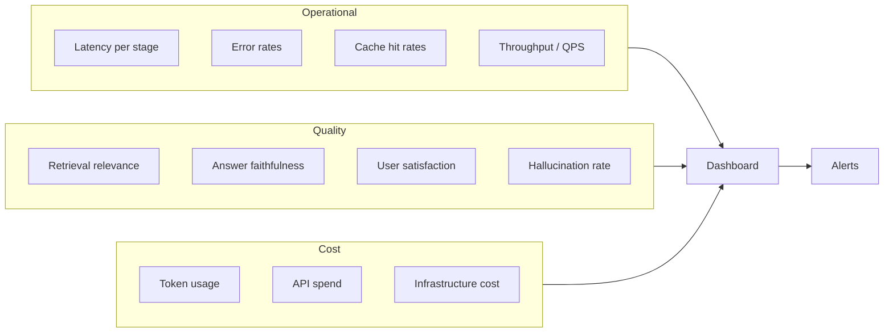

# 9.15.5 Monitoring & Observability

## Introduction

You can't improve what you don't measure. Production RAG systems are complex pipelines with multiple failure modes — and without observability, you won't know if retrieval quality is degrading, latency is creeping up, or a model update broke your prompt formatting. This lesson covers how to instrument your RAG pipeline end-to-end, set up meaningful dashboards, and configure alerts that catch problems before users complain.

## Prerequisites

- Full RAG pipeline understanding (Lessons 9.1–9.5)
- Latency optimization concepts (Lesson 9.15.4)
- Fallback and circuit breaker patterns (Lesson 9.15.3)
- Basic familiarity with structured logging

---

## What to Monitor in a RAG System

RAG systems have unique monitoring needs compared to traditional web applications. You need to track both **operational metrics** (is it fast? is it up?) and **quality metrics** (are answers correct? are retrievals relevant?).



### The Four Pillars of RAG Observability

| Pillar | Metrics | Why It Matters |
|--------|---------|----------------|
| **Latency** | p50, p95, p99 per stage | Detect slowdowns before users notice |
| **Quality** | MRR@10, faithfulness, relevance | Catch retrieval/generation degradation |
| **Reliability** | Error rate, circuit breaker trips | Know when fallbacks are activating |
| **Cost** | Tokens/query, cache savings, API spend | Budget management and optimization |

---

## Structured Logging for RAG Pipelines

The foundation of observability is structured logs. Every query should produce a structured event that captures timing, results, and metadata:

```python
import time
import uuid
import json
import logging
from dataclasses import dataclass, field, asdict
from typing import Optional


@dataclass
class RAGTraceEvent:
    """Structured trace event for a single RAG query.

    Every field is queryable and aggregatable in your logging
    backend (e.g., Datadog, Elasticsearch, CloudWatch Logs).
    """
    # Identity
    trace_id: str = field(default_factory=lambda: str(uuid.uuid4()))
    user_id: Optional[str] = None
    session_id: Optional[str] = None

    # Query
    query_text: str = ""
    query_length: int = 0

    # Retrieval
    retrieval_count: int = 0
    retrieval_latency_ms: float = 0.0
    retrieval_top_score: float = 0.0
    retrieval_min_score: float = 0.0
    retrieval_source_types: list[str] = field(default_factory=list)

    # Reranking
    reranking_latency_ms: float = 0.0
    reranking_count_in: int = 0
    reranking_count_out: int = 0
    reranking_score_delta: float = 0.0  # How much reranking changed ordering

    # Generation
    generation_latency_ms: float = 0.0
    generation_model: str = ""
    generation_tokens_in: int = 0
    generation_tokens_out: int = 0
    generation_ttfb_ms: float = 0.0

    # Cache
    cache_hit: bool = False
    cache_layer: Optional[str] = None  # exact, semantic, context, prompt
    cache_latency_ms: float = 0.0

    # Circuit Breaker
    circuit_breaker_state: str = "closed"
    fallback_used: bool = False
    fallback_level: Optional[str] = None

    # Total
    total_latency_ms: float = 0.0
    error: Optional[str] = None

    def to_json(self) -> str:
        return json.dumps(asdict(self), default=str)


class RAGLogger:
    """Structured logger for RAG pipeline events.

    Emits JSON-formatted log lines that can be parsed by any
    log aggregation system. Each query produces exactly one log
    event with all metrics in a flat structure.

    Usage:
        logger = RAGLogger("production-rag")

        event = RAGTraceEvent(query_text="What is RAG?")
        # ... populate fields during pipeline execution ...
        logger.log_query(event)
    """

    def __init__(self, service_name: str):
        self.logger = logging.getLogger(service_name)
        handler = logging.StreamHandler()
        handler.setFormatter(logging.Formatter("%(message)s"))
        self.logger.addHandler(handler)
        self.logger.setLevel(logging.INFO)

    def log_query(self, event: RAGTraceEvent) -> None:
        """Log a completed RAG query event."""
        self.logger.info(event.to_json())

    def log_error(self, event: RAGTraceEvent, error: Exception) -> None:
        """Log a failed RAG query with error details."""
        event.error = f"{type(error).__name__}: {str(error)}"
        self.logger.error(event.to_json())
```

### Instrumented RAG Pipeline

```python
class ObservableRAGPipeline:
    """RAG pipeline with full observability instrumentation.

    Every stage records timing and metadata into the trace event,
    which is emitted as a single structured log on completion.
    """

    def __init__(self, embedder, retriever, reranker, llm, cache, logger):
        self.embedder = embedder
        self.retriever = retriever
        self.reranker = reranker
        self.llm = llm
        self.cache = cache
        self.logger = logger

    async def query(
        self,
        question: str,
        user_id: Optional[str] = None,
        session_id: Optional[str] = None,
    ) -> dict:
        """Execute an instrumented RAG query."""
        event = RAGTraceEvent(
            query_text=question,
            query_length=len(question),
            user_id=user_id,
            session_id=session_id,
        )
        pipeline_start = time.perf_counter()

        try:
            # Cache check
            cache_start = time.perf_counter()
            cached = await self.cache.get(question)
            event.cache_latency_ms = (time.perf_counter() - cache_start) * 1000

            if cached:
                event.cache_hit = True
                event.cache_layer = cached.get("layer", "unknown")
                event.total_latency_ms = (time.perf_counter() - pipeline_start) * 1000
                self.logger.log_query(event)
                return cached["response"]

            # Embedding + retrieval
            embedding = await self.embedder.embed(question)

            retrieval_start = time.perf_counter()
            documents = await self.retriever.search(embedding, top_k=10)
            event.retrieval_latency_ms = (time.perf_counter() - retrieval_start) * 1000
            event.retrieval_count = len(documents)

            if documents:
                scores = [d["score"] for d in documents]
                event.retrieval_top_score = max(scores)
                event.retrieval_min_score = min(scores)

            # Reranking
            rerank_start = time.perf_counter()
            event.reranking_count_in = len(documents)
            reranked = self.reranker.rerank(question, documents, top_k=5)
            event.reranking_latency_ms = (time.perf_counter() - rerank_start) * 1000
            event.reranking_count_out = len(reranked)

            # Generation
            context = "\n\n".join(d["content"] for d in reranked)
            gen_start = time.perf_counter()
            response = await self.llm.generate(question, context)
            event.generation_latency_ms = (time.perf_counter() - gen_start) * 1000
            event.generation_model = response.get("model", "")
            event.generation_tokens_in = response.get("prompt_tokens", 0)
            event.generation_tokens_out = response.get("completion_tokens", 0)

            event.total_latency_ms = (time.perf_counter() - pipeline_start) * 1000
            self.logger.log_query(event)

            return response

        except Exception as e:
            event.total_latency_ms = (time.perf_counter() - pipeline_start) * 1000
            self.logger.log_error(event, e)
            raise
```

---

## LangSmith Integration

LangSmith provides purpose-built tracing for LLM applications. It captures the full execution graph with inputs, outputs, and latencies at every step:

```python
import os
from openai import AsyncOpenAI
from langsmith import wrappers, traceable

# Configure LangSmith — set these environment variables
os.environ["LANGSMITH_TRACING"] = "true"
os.environ["LANGSMITH_API_KEY"] = "lsv2_pt_..."
os.environ["LANGSMITH_PROJECT"] = "production-rag"

# Wrap OpenAI client — all calls are automatically traced
client = wrappers.wrap_openai(AsyncOpenAI())


@traceable(name="embed_query", run_type="embedding")
async def embed_query(query: str) -> list[float]:
    """Embed a query — automatically traced by LangSmith."""
    response = await client.embeddings.create(
        model="text-embedding-3-small",
        input=query,
    )
    return response.data[0].embedding


@traceable(name="retrieve_documents", run_type="retriever")
async def retrieve_documents(
    embedding: list[float], top_k: int = 10
) -> list[dict]:
    """Retrieve documents — automatically traced by LangSmith.

    LangSmith captures the retrieved documents and their scores,
    making it easy to inspect retrieval quality for any query.
    """
    results = await vector_store.search(embedding, limit=top_k)
    return [
        {"content": r.payload["text"], "score": r.score, "id": r.id}
        for r in results
    ]


@traceable(name="generate_answer", run_type="llm")
async def generate_answer(question: str, context: str) -> str:
    """Generate an answer — automatically traced by LangSmith.

    LangSmith records the full prompt, response, token counts,
    and latency. You can view the exact prompt for any query
    in the LangSmith dashboard.
    """
    response = await client.chat.completions.create(
        model="gpt-4.1-mini",
        messages=[
            {
                "role": "system",
                "content": f"Answer based on context:\n\n{context}",
            },
            {"role": "user", "content": question},
        ],
    )
    return response.choices[0].message.content


@traceable(name="rag_pipeline")
async def rag_query(question: str) -> dict:
    """Full RAG pipeline — all child calls appear as a trace tree.

    In LangSmith, this renders as:
    rag_pipeline (2.1s)
    ├── embed_query (15ms)
    ├── retrieve_documents (35ms)
    └── generate_answer (2.0s)

    You can click into any node to see inputs, outputs, and timing.
    """
    embedding = await embed_query(question)
    documents = await retrieve_documents(embedding)
    context = "\n\n".join(d["content"] for d in documents[:5])
    answer = await generate_answer(question, context)
    return {"answer": answer, "sources": documents[:5]}
```

---

## Building Metrics Dashboards

Whether you use Prometheus/Grafana, Datadog, or custom dashboards, these are the key metrics to track:

```python
from dataclasses import dataclass, field
import time
from collections import deque
from typing import Optional


class MetricsCollector:
    """Collect and aggregate RAG pipeline metrics.

    Maintains rolling windows of metric values and computes
    statistics for dashboard display.

    Metrics are organized into four categories:
    - Latency: Timing for each pipeline stage
    - Quality: Retrieval and generation quality signals
    - Reliability: Error rates and fallback usage
    - Cost: Token usage and API spending
    """

    def __init__(self, window_size: int = 1000):
        self.window_size = window_size
        self.metrics: dict[str, deque] = {}

    def record(self, name: str, value: float) -> None:
        """Record a single metric value."""
        if name not in self.metrics:
            self.metrics[name] = deque(maxlen=self.window_size)
        self.metrics[name].append((time.time(), value))

    def get_stats(self, name: str) -> dict:
        """Get statistics for a metric."""
        if name not in self.metrics or not self.metrics[name]:
            return {"count": 0}

        values = [v for _, v in self.metrics[name]]
        sorted_values = sorted(values)
        n = len(sorted_values)

        return {
            "count": n,
            "mean": sum(values) / n,
            "p50": sorted_values[n // 2],
            "p95": sorted_values[int(n * 0.95)],
            "p99": sorted_values[int(n * 0.99)],
            "min": sorted_values[0],
            "max": sorted_values[-1],
        }

    def get_rate(self, name: str, window_seconds: float = 60) -> float:
        """Calculate rate of events per second over a time window."""
        if name not in self.metrics:
            return 0.0

        cutoff = time.time() - window_seconds
        count = sum(1 for ts, _ in self.metrics[name] if ts >= cutoff)
        return count / window_seconds


# Global metrics collector
metrics = MetricsCollector()


# Instrument the pipeline
class MetricsInstrumentedPipeline:
    """Pipeline with metrics collection for dashboarding.

    Records latency, quality, and cost metrics on every query.
    """

    async def query(self, question: str) -> dict:
        start = time.perf_counter()

        try:
            # Retrieval with metrics
            ret_start = time.perf_counter()
            documents = await self.retrieve(question)
            ret_latency = (time.perf_counter() - ret_start) * 1000
            metrics.record("retrieval.latency_ms", ret_latency)
            metrics.record("retrieval.count", len(documents))

            if documents:
                metrics.record("retrieval.top_score", documents[0]["score"])

            # Generation with metrics
            gen_start = time.perf_counter()
            response = await self.generate(question, documents)
            gen_latency = (time.perf_counter() - gen_start) * 1000
            metrics.record("generation.latency_ms", gen_latency)
            metrics.record("generation.tokens_in", response["prompt_tokens"])
            metrics.record("generation.tokens_out", response["completion_tokens"])

            # Total latency
            total = (time.perf_counter() - start) * 1000
            metrics.record("pipeline.latency_ms", total)
            metrics.record("pipeline.success", 1)

            return response

        except Exception:
            metrics.record("pipeline.error", 1)
            raise
```

### Dashboard Layout

```python
DASHBOARD_PANELS = {
    "row_1_overview": {
        "title": "Pipeline Overview",
        "panels": [
            {
                "title": "Queries per Second",
                "query": "rate(pipeline.success + pipeline.error)",
                "type": "stat",
            },
            {
                "title": "Success Rate",
                "query": "pipeline.success / (pipeline.success + pipeline.error) * 100",
                "type": "gauge",
                "thresholds": {"red": 95, "yellow": 99, "green": 99.5},
            },
            {
                "title": "p50 Latency",
                "query": "percentile(pipeline.latency_ms, 50)",
                "type": "stat",
                "unit": "ms",
            },
            {
                "title": "Cache Hit Rate",
                "query": "cache.hit / (cache.hit + cache.miss) * 100",
                "type": "gauge",
                "thresholds": {"red": 10, "yellow": 25, "green": 40},
            },
        ],
    },
    "row_2_latency": {
        "title": "Latency Breakdown",
        "panels": [
            {
                "title": "Latency by Stage (p50)",
                "queries": {
                    "Embedding": "percentile(embedding.latency_ms, 50)",
                    "Retrieval": "percentile(retrieval.latency_ms, 50)",
                    "Reranking": "percentile(reranking.latency_ms, 50)",
                    "Generation": "percentile(generation.latency_ms, 50)",
                },
                "type": "stacked_bar",
            },
            {
                "title": "p99 Latency Over Time",
                "queries": {
                    "Total": "percentile(pipeline.latency_ms, 99)",
                    "TTFB": "percentile(generation.ttfb_ms, 99)",
                },
                "type": "timeseries",
                "alert_threshold": 3000,
            },
        ],
    },
    "row_3_quality": {
        "title": "Quality Signals",
        "panels": [
            {
                "title": "Retrieval Score Distribution",
                "query": "histogram(retrieval.top_score)",
                "type": "histogram",
            },
            {
                "title": "Empty Results Rate",
                "query": "count(retrieval.count == 0) / count(retrieval.count) * 100",
                "type": "stat",
                "alert_threshold": 5,
            },
            {
                "title": "Avg Tokens per Response",
                "query": "avg(generation.tokens_out)",
                "type": "timeseries",
            },
        ],
    },
    "row_4_cost": {
        "title": "Cost Tracking",
        "panels": [
            {
                "title": "Daily Token Usage",
                "queries": {
                    "Input": "sum(generation.tokens_in)",
                    "Output": "sum(generation.tokens_out)",
                },
                "type": "bar",
            },
            {
                "title": "Estimated Daily Cost",
                "query": (
                    "sum(generation.tokens_in) * 0.15 / 1_000_000 "
                    "+ sum(generation.tokens_out) * 0.60 / 1_000_000"
                ),
                "type": "stat",
                "unit": "USD",
            },
        ],
    },
}
```

---

## Alerting Rules

Define alerts for anomalies that need investigation:

```python
@dataclass
class AlertRule:
    """Configuration for a monitoring alert.

    Alerts fire when a metric breaches its threshold for the
    specified duration. The severity determines notification
    routing (page, Slack, email, etc.).
    """
    name: str
    metric: str
    condition: str  # gt, lt, eq
    threshold: float
    duration_seconds: int
    severity: str  # critical, warning, info
    message: str


ALERT_RULES = [
    # Latency alerts
    AlertRule(
        name="high_p99_latency",
        metric="pipeline.latency_ms.p99",
        condition="gt",
        threshold=5000,
        duration_seconds=300,
        severity="warning",
        message="RAG p99 latency exceeded 5s for 5 minutes",
    ),
    AlertRule(
        name="critical_p99_latency",
        metric="pipeline.latency_ms.p99",
        condition="gt",
        threshold=10000,
        duration_seconds=60,
        severity="critical",
        message="RAG p99 latency exceeded 10s for 1 minute",
    ),

    # Error rate alerts
    AlertRule(
        name="high_error_rate",
        metric="pipeline.error_rate",
        condition="gt",
        threshold=0.05,
        duration_seconds=300,
        severity="warning",
        message="RAG error rate exceeded 5% for 5 minutes",
    ),
    AlertRule(
        name="critical_error_rate",
        metric="pipeline.error_rate",
        condition="gt",
        threshold=0.20,
        duration_seconds=60,
        severity="critical",
        message="RAG error rate exceeded 20% for 1 minute",
    ),

    # Quality alerts
    AlertRule(
        name="low_retrieval_scores",
        metric="retrieval.top_score.p50",
        condition="lt",
        threshold=0.5,
        duration_seconds=600,
        severity="warning",
        message="Median retrieval score dropped below 0.5 — possible index issue",
    ),
    AlertRule(
        name="high_empty_results",
        metric="retrieval.empty_rate",
        condition="gt",
        threshold=0.10,
        duration_seconds=300,
        severity="warning",
        message="More than 10% of queries returning empty results",
    ),

    # Cost alerts
    AlertRule(
        name="token_usage_spike",
        metric="generation.tokens_in.hourly_sum",
        condition="gt",
        threshold=10_000_000,  # 10M tokens/hour
        duration_seconds=0,
        severity="warning",
        message="Token usage spiked above 10M tokens/hour",
    ),

    # Circuit breaker alerts
    AlertRule(
        name="circuit_breaker_open",
        metric="circuit_breaker.state",
        condition="eq",
        threshold=2,  # 0=closed, 1=half_open, 2=open
        duration_seconds=0,
        severity="critical",
        message="Circuit breaker is OPEN — service is failing",
    ),

    # Cache alerts
    AlertRule(
        name="cache_hit_rate_drop",
        metric="cache.hit_rate",
        condition="lt",
        threshold=0.15,
        duration_seconds=600,
        severity="warning",
        message="Cache hit rate dropped below 15% — possible cache issue",
    ),
]


class AlertEvaluator:
    """Evaluate alert rules against current metrics.

    Checks each rule against the metrics collector and fires
    alerts when conditions are met. Supports deduplication
    to avoid alert storms.
    """

    def __init__(self, metrics: MetricsCollector, rules: list[AlertRule]):
        self.metrics = metrics
        self.rules = rules
        self.active_alerts: dict[str, float] = {}  # name → first_triggered
        self.notified: set[str] = set()

    def evaluate(self) -> list[AlertRule]:
        """Check all rules and return those that are firing."""
        firing = []
        now = time.time()

        for rule in self.rules:
            stats = self.metrics.get_stats(rule.metric)
            if not stats or stats["count"] == 0:
                continue

            current_value = stats.get("p99", stats.get("mean", 0))
            is_breached = self._check_condition(
                current_value, rule.condition, rule.threshold
            )

            if is_breached:
                if rule.name not in self.active_alerts:
                    self.active_alerts[rule.name] = now
                elif (
                    now - self.active_alerts[rule.name] >= rule.duration_seconds
                    and rule.name not in self.notified
                ):
                    firing.append(rule)
                    self.notified.add(rule.name)
            else:
                # Clear alert when condition resolves
                self.active_alerts.pop(rule.name, None)
                self.notified.discard(rule.name)

        return firing

    @staticmethod
    def _check_condition(value: float, condition: str, threshold: float) -> bool:
        if condition == "gt":
            return value > threshold
        elif condition == "lt":
            return value < threshold
        elif condition == "eq":
            return value == threshold
        return False
```

---

## Relevance Score Monitoring

Track how retrieval quality changes over time. A drop in retrieval scores could mean your embeddings are stale, your index is corrupted, or user queries have shifted:

```python
class RelevanceMonitor:
    """Monitor retrieval relevance scores over time.

    Detects quality degradation by comparing current score
    distributions against historical baselines. If the median
    score drops significantly, something has changed.

    Common causes of score drops:
    - Stale embeddings (content updated, vectors not re-computed)
    - Index corruption or misconfiguration
    - Query distribution shift (users asking new types of questions)
    - Model changes (new embedding model with different similarity scale)
    """

    def __init__(self, window_size: int = 500, alert_threshold: float = 0.15):
        self.baseline_scores: deque[float] = deque(maxlen=window_size)
        self.current_scores: deque[float] = deque(maxlen=window_size)
        self.alert_threshold = alert_threshold
        self.baseline_median: Optional[float] = None

    def record_scores(self, scores: list[float]) -> None:
        """Record retrieval scores from a single query."""
        if scores:
            top_score = max(scores)
            self.current_scores.append(top_score)

    def set_baseline(self) -> None:
        """Capture current scores as the baseline for comparison."""
        self.baseline_scores = deque(self.current_scores, maxlen=len(self.current_scores))
        sorted_baseline = sorted(self.baseline_scores)
        self.baseline_median = sorted_baseline[len(sorted_baseline) // 2]

    def check_degradation(self) -> Optional[dict]:
        """Check if retrieval quality has degraded from baseline.

        Returns a report dict if degradation is detected, None otherwise.
        """
        if self.baseline_median is None or len(self.current_scores) < 50:
            return None

        sorted_current = sorted(self.current_scores)
        current_median = sorted_current[len(sorted_current) // 2]

        delta = self.baseline_median - current_median
        relative_drop = delta / self.baseline_median if self.baseline_median > 0 else 0

        if relative_drop > self.alert_threshold:
            return {
                "status": "degraded",
                "baseline_median": round(self.baseline_median, 4),
                "current_median": round(current_median, 4),
                "absolute_drop": round(delta, 4),
                "relative_drop_pct": round(relative_drop * 100, 1),
                "sample_size": len(self.current_scores),
                "recommendation": self._diagnose(relative_drop),
            }
        return None

    @staticmethod
    def _diagnose(relative_drop: float) -> str:
        """Suggest investigation steps based on severity."""
        if relative_drop > 0.30:
            return (
                "Severe quality drop. Check: 1) Was the embedding model changed? "
                "2) Is the vector index healthy? 3) Has content been bulk-updated "
                "without re-embedding?"
            )
        elif relative_drop > 0.20:
            return (
                "Significant quality drop. Check: 1) Has the query distribution "
                "shifted? 2) Are there new content areas without coverage? "
                "3) Has index configuration changed?"
            )
        else:
            return (
                "Moderate quality drop. Monitor for further degradation. "
                "Consider: 1) Refreshing embeddings for updated content "
                "2) Reviewing recent query logs for new patterns"
            )
```

---

## Health Check Endpoint

Expose a health endpoint that monitoring systems can poll:

```python
from fastapi import FastAPI


app = FastAPI()


@app.get("/health")
async def health_check():
    """Comprehensive health check for load balancers and monitoring.

    Returns component-level health so you can pinpoint which
    service is degraded without checking each one individually.
    """
    checks = {}

    # Vector database health
    try:
        start = time.perf_counter()
        await vector_store.health()
        latency = (time.perf_counter() - start) * 1000
        checks["vector_db"] = {"status": "healthy", "latency_ms": round(latency, 1)}
    except Exception as e:
        checks["vector_db"] = {"status": "unhealthy", "error": str(e)}

    # LLM API health
    try:
        start = time.perf_counter()
        await llm_client.models.list()
        latency = (time.perf_counter() - start) * 1000
        checks["llm_api"] = {"status": "healthy", "latency_ms": round(latency, 1)}
    except Exception as e:
        checks["llm_api"] = {"status": "unhealthy", "error": str(e)}

    # Cache health
    try:
        await cache.ping()
        hit_rate = metrics.get_stats("cache.hit_rate")
        checks["cache"] = {
            "status": "healthy",
            "hit_rate": round(hit_rate.get("mean", 0), 3),
        }
    except Exception as e:
        checks["cache"] = {"status": "unhealthy", "error": str(e)}

    # Overall status
    all_healthy = all(c["status"] == "healthy" for c in checks.values())

    return {
        "status": "healthy" if all_healthy else "degraded",
        "components": checks,
        "metrics": {
            "qps": round(metrics.get_rate("pipeline.success"), 2),
            "p50_latency_ms": metrics.get_stats("pipeline.latency_ms").get("p50", 0),
            "error_rate": round(metrics.get_rate("pipeline.error") / max(metrics.get_rate("pipeline.success"), 0.001), 4),
        },
    }
```

---

## Summary

| What to Monitor | How | Alert When |
|-----------------|-----|------------|
| **Latency per stage** | Pipeline profiler + structured logs | p99 > 2× target |
| **Error rates** | Error counters per component | > 5% for 5 minutes |
| **Cache hit rates** | Cache layer metrics | < 15% (cache may be broken) |
| **Retrieval quality** | Top-score tracking + baselines | Median drops > 15% |
| **Token usage** | Per-query token counting | Hourly spike > 2× normal |
| **Circuit breaker state** | State change events | Any service OPEN |
| **Cost** | Token × price aggregation | Daily cost > budget |

### Key Takeaways

1. **Log structured events** for every query — flat JSON with all metrics in one record
2. **Use LangSmith** for trace-level debugging — see exact inputs/outputs for any query
3. **Track quality, not just latency** — retrieval scores, empty results, and faithfulness
4. **Set baselines first, then alert on deviation** — absolute thresholds miss gradual degradation
5. **Build a health endpoint** that reports component-level status
6. **Alert on symptoms, not causes** — high latency is a symptom; which component is slow is the diagnosis

## Practice Exercises

1. **Instrument a RAG pipeline** with the `RAGTraceEvent` model and emit structured logs for 100 test queries
2. **Set up LangSmith tracing** using `@traceable` decorators and inspect the trace tree in the dashboard
3. **Build a relevance monitor** that detects when retrieval quality drops below baseline
4. **Design a dashboard layout** for your RAG system covering latency, quality, reliability, and cost panels

---

← [Previous: Latency Optimization](./04-latency-optimization.md) | [Next: A/B Testing RAG →](./06-ab-testing-rag.md)
