# 9.16 RAG for Specific Domains — Overview

## Introduction

A generic RAG pipeline retrieves text chunks and generates answers. A **domain-specific** RAG pipeline understands the structure, vocabulary, compliance requirements, and user expectations of its target field. The difference between them is the difference between a helpful intern and a seasoned specialist.

Every domain brings unique challenges that generic pipelines handle poorly: legal documents have citation networks and hierarchical authority. Medical texts require safety guardrails and regulatory compliance. Code repositories need AST-aware chunking and cross-file context. Financial data is time-sensitive and regulation-bound. Customer support demands tone matching and escalation awareness.

This section covers how to adapt your RAG pipeline for five high-value domains, transforming a general-purpose system into one that domain experts actually trust.

## Prerequisites

Before diving into domain-specific RAG, you should be comfortable with:

- **RAG fundamentals** (Lessons 9.1–9.5): Ingestion, embedding, retrieval, generation
- **Chunking strategies** (Lesson 9.6): How document splitting affects retrieval quality
- **Hybrid search & reranking** (Lessons 9.8–9.10): Combining retrieval methods
- **Evaluation** (Lesson 9.12): Measuring RAG quality with metrics
- **Production patterns** (Lesson 9.15): Caching, monitoring, error handling

## The Domain Adaptation Framework

Every domain-specific RAG system adapts the same five pipeline components, but the **priorities** and **constraints** differ dramatically:

```mermaid
flowchart TB
    subgraph Generic["Generic RAG Pipeline"]
        A[Document Ingestion]
        B[Chunking]
        C[Embedding & Indexing]
        D[Retrieval]
        E[Generation]
    end

    subgraph Adaptations["Domain Adaptations"]
        A1["📄 Document parsing<br/>Structure-aware extraction"]
        B1["✂️ Domain chunking<br/>Preserve semantic units"]
        C1["🔤 Domain vocabulary<br/>Specialized embeddings"]
        D1["🔍 Domain retrieval<br/>Metadata filtering, authority ranking"]
        E1["✍️ Domain generation<br/>Compliance, citations, tone"]
    end

    A --> A1
    B --> B1
    C --> C1
    D --> D1
    E --> E1
```



## Domain Comparison Matrix

| Aspect | Legal | Medical | Code | Financial | Customer Support |
|--------|-------|---------|------|-----------|-----------------|
| **Document types** | Cases, statutes, regulations, contracts | Guidelines, studies, drug labels, records | Source files, docs, issues, PRs | Filings, transcripts, reports | FAQs, manuals, tickets, chat logs |
| **Chunking strategy** | Section-aware (holdings, reasoning, dicta) | Guideline-section-aware, evidence-graded | AST-aware (function, class, module) | Table-preserving, temporal sections | Q&A pair-preserving, article-based |
| **Key metadata** | Jurisdiction, court level, date, citation | Evidence level, specialty, drug names | Language, file path, symbols, imports | Ticker, date, form type, period | Product, version, category, language |
| **Authority ranking** | Court hierarchy (Supreme > Appeals > District) | Evidence pyramid (RCT > cohort > case) | Freshness + stars + official docs | Recency + filing type + audited | Official docs > community > tickets |
| **Compliance** | Attorney-client privilege, confidentiality | HIPAA, disclaimer requirements | License compliance, IP concerns | SEC regulations, material info | Data privacy, PII handling |
| **Citation format** | Bluebook (e.g., *Smith v. Jones*, 570 U.S. 1) | AMA/Vancouver (PMID, DOI) | File path + line number | Filing ID + section + date | Article ID + version |
| **Failure mode risk** | Wrong precedent → bad legal advice | Wrong dosage → patient harm | Wrong API → broken code | Stale data → financial loss | Wrong answer → customer churn |
| **Typical latency tolerance** | 5–10s (research context) | < 3s (clinical decision support) | < 2s (IDE integration) | < 3s (trading/analysis) | < 2s (live chat) |

## Quick Example: Domain-Aware Pipeline Configuration

```python
from dataclasses import dataclass
from typing import Optional
from enum import Enum


class Domain(Enum):
    LEGAL = "legal"
    MEDICAL = "medical"
    CODE = "code"
    FINANCIAL = "financial"
    CUSTOMER_SUPPORT = "customer_support"


@dataclass
class DomainConfig:
    """Configuration that adapts a RAG pipeline to a specific domain.

    Each domain has different chunking, retrieval, and generation
    requirements. This config captures those differences so a
    single pipeline codebase can serve multiple domains.
    """
    domain: Domain
    chunk_size: int
    chunk_overlap: int
    chunking_strategy: str
    embedding_model: str
    retrieval_top_k: int
    rerank: bool
    required_metadata: list[str]
    system_prompt_template: str
    citation_format: str
    disclaimer: Optional[str] = None
    max_response_tokens: int = 1024


# Domain-specific configurations
DOMAIN_CONFIGS = {
    Domain.LEGAL: DomainConfig(
        domain=Domain.LEGAL,
        chunk_size=1024,
        chunk_overlap=128,
        chunking_strategy="section_aware",
        embedding_model="text-embedding-3-large",
        retrieval_top_k=15,
        rerank=True,
        required_metadata=["jurisdiction", "court_level", "date", "citation"],
        system_prompt_template=(
            "You are a legal research assistant. Answer based ONLY on the "
            "provided case law and statutes. Cite every source using Bluebook "
            "format. Distinguish between binding and persuasive authority. "
            "Never provide legal advice — present findings for attorney review."
        ),
        citation_format="bluebook",
        disclaimer="This is legal research, not legal advice. Consult a licensed attorney.",
    ),
    Domain.MEDICAL: DomainConfig(
        domain=Domain.MEDICAL,
        chunk_size=512,
        chunk_overlap=64,
        chunking_strategy="guideline_section",
        embedding_model="text-embedding-3-large",
        retrieval_top_k=10,
        rerank=True,
        required_metadata=["evidence_level", "specialty", "publication_date"],
        system_prompt_template=(
            "You are a clinical decision support assistant. Answer based ONLY "
            "on the provided clinical guidelines and peer-reviewed evidence. "
            "State the evidence level for each recommendation. Flag any "
            "contraindications or interactions. Never diagnose or prescribe."
        ),
        citation_format="vancouver",
        disclaimer="For informational purposes only. Not a substitute for professional medical advice.",
        max_response_tokens=800,
    ),
    Domain.CODE: DomainConfig(
        domain=Domain.CODE,
        chunk_size=768,
        chunk_overlap=96,
        chunking_strategy="ast_aware",
        embedding_model="text-embedding-3-small",
        retrieval_top_k=10,
        rerank=False,
        required_metadata=["file_path", "language", "symbols", "imports"],
        system_prompt_template=(
            "You are a code assistant. Answer based on the provided codebase "
            "context. Include file paths and line references. Show code examples "
            "that follow the existing codebase patterns and conventions."
        ),
        citation_format="filepath_line",
    ),
    Domain.FINANCIAL: DomainConfig(
        domain=Domain.FINANCIAL,
        chunk_size=512,
        chunk_overlap=64,
        chunking_strategy="table_preserving",
        embedding_model="text-embedding-3-large",
        retrieval_top_k=12,
        rerank=True,
        required_metadata=["ticker", "filing_date", "form_type", "period"],
        system_prompt_template=(
            "You are a financial research assistant. Answer based ONLY on the "
            "provided filings and data. Always state the source date and filing "
            "type. Present numerical data precisely. Flag if information may be "
            "outdated. Never provide investment advice."
        ),
        citation_format="filing_reference",
        disclaimer="Not investment advice. Data may be delayed. Verify with official sources.",
    ),
    Domain.CUSTOMER_SUPPORT: DomainConfig(
        domain=Domain.CUSTOMER_SUPPORT,
        chunk_size=256,
        chunk_overlap=32,
        chunking_strategy="qa_pair_aware",
        embedding_model="text-embedding-3-small",
        retrieval_top_k=5,
        rerank=False,
        required_metadata=["product", "version", "category", "language"],
        system_prompt_template=(
            "You are a helpful customer support agent for {product_name}. "
            "Answer based on the provided documentation. Be friendly and "
            "concise. If you can't answer from the docs, offer to escalate "
            "to a human agent. Include step-by-step instructions when applicable."
        ),
        citation_format="article_id",
    ),
}
```

## What You'll Learn

| Lesson | Domain | Key Concepts |
|--------|--------|-------------|
| [01 – Legal RAG](./01-legal-rag.md) | Legal | Case law retrieval, statute cross-referencing, precedent chains, Bluebook citations, privilege handling |
| [02 – Medical RAG](./02-medical-rag.md) | Medical | Clinical guideline retrieval, drug interactions, evidence grading, HIPAA compliance, disclaimers |
| [03 – Code RAG](./03-code-rag.md) | Code | AST-aware chunking, repository indexing, symbol extraction, cross-file context, API docs |
| [04 – Financial RAG](./04-financial-rag.md) | Financial | SEC filing parsing, earnings transcripts, temporal data, regulatory compliance, table extraction |
| [05 – Customer Support RAG](./05-customer-support-rag.md) | Support | FAQ/KB systems, ticket history, escalation detection, multi-language, product versioning |

## Glossary

| Term | Definition |
|------|-----------|
| **AST** | Abstract Syntax Tree — a structured representation of source code parsed by language grammar rules |
| **Bluebook** | Standard legal citation format used in U.S. courts and law reviews |
| **Evidence level** | Grade assigned to medical evidence based on study design (RCT, cohort, case report, expert opinion) |
| **HIPAA** | Health Insurance Portability and Accountability Act — U.S. law governing protected health information |
| **Metadata filtering** | Narrowing retrieval candidates using structured attributes before or alongside vector search |
| **PII** | Personally Identifiable Information — data that can identify an individual |
| **Precedent** | A court decision that serves as an authoritative rule in future similar cases |
| **SEC** | Securities and Exchange Commission — U.S. regulator requiring public company financial disclosures |
| **Semantic unit** | A logically complete segment of content (e.g., a function, a guideline section, a Q&A pair) |
| **Temporal relevance** | How the recency of information affects its value for answering a query |

---

→ [Start with Legal RAG →](./01-legal-rag.md)
