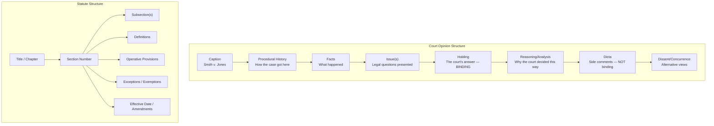

# 9.16.1 Legal RAG

## Introduction

Legal research is fundamentally about finding the right authority for a given question. Lawyers don't just search for relevant text — they search for **binding precedent** from the right jurisdiction, at the right court level, on the right legal issue, that hasn't been overruled. A generic RAG pipeline treats all retrieved documents equally. A legal RAG pipeline understands that a U.S. Supreme Court case outweighs a district court opinion, that a statute from the relevant jurisdiction overrides persuasive authority from another state, and that a case overruled in 2023 is worse than useless — it's dangerous.

This lesson covers how to build a RAG system that handles the unique structure and requirements of legal documents: case law retrieval with authority ranking, statute cross-referencing, precedent chain building, proper citation formatting, and confidentiality protections.

## Prerequisites

- RAG pipeline fundamentals (Lessons 9.1–9.5)
- Hybrid search and reranking (Lessons 9.8–9.10)
- Metadata filtering concepts (Lesson 9.8)
- Basic understanding of legal document structure (cases, statutes, regulations)

---

## Legal Document Structure

Legal documents have a unique hierarchical structure that generic chunking destroys. Understanding this structure is essential for building effective chunking and retrieval:



### Why Generic Chunking Fails for Legal Text

| Problem | Example | Impact |
|---------|---------|--------|
| **Splits holding from reasoning** | Holding in chunk 1, reasoning in chunk 2 | LLM cites rule without understanding why |
| **Loses citation context** | "The court held..." without identifying which court | Can't assess authority level |
| **Mixes binding and non-binding** | Dicta chunked alongside holdings | LLM presents non-binding dicta as law |
| **Breaks statutory cross-references** | "As defined in § 2(a)" but definition is in another chunk | Incomplete or wrong interpretation |
| **Ignores jurisdiction** | Cases from multiple states mixed together | Wrong law for the question's jurisdiction |

---

## Section-Aware Legal Chunking

```python
import re
from dataclasses import dataclass, field
from typing import Optional
from enum import Enum


class LegalSectionType(Enum):
    """Types of sections in a legal opinion."""
    CAPTION = "caption"
    PROCEDURAL_HISTORY = "procedural_history"
    FACTS = "facts"
    ISSUE = "issue"
    HOLDING = "holding"
    REASONING = "reasoning"
    DICTA = "dicta"
    DISSENT = "dissent"
    CONCURRENCE = "concurrence"
    FOOTNOTE = "footnote"


@dataclass
class LegalChunk:
    """A chunk from a legal document with section-level metadata.

    Unlike generic text chunks, legal chunks carry information about
    what type of legal content they contain and how authoritative
    it is. This lets the retrieval system prioritize holdings over
    dicta, and binding authority over persuasive.
    """
    content: str
    section_type: LegalSectionType
    case_citation: str  # e.g., "570 U.S. 1 (2013)"
    case_name: str      # e.g., "Smith v. Jones"
    court: str          # e.g., "Supreme Court of the United States"
    court_level: int    # 1=Supreme, 2=Appeals, 3=District, 4=State
    jurisdiction: str   # e.g., "federal", "california", "new_york"
    date: str           # e.g., "2023-06-15"
    is_binding: bool    # Whether this is binding precedent
    overruled: bool = False
    overruled_by: Optional[str] = None
    cited_cases: list[str] = field(default_factory=list)
    cited_statutes: list[str] = field(default_factory=list)


class LegalDocumentChunker:
    """Chunk legal documents while preserving section boundaries.

    Legal opinions have a well-defined structure. This chunker
    identifies section boundaries using heading patterns and
    content signals, then creates chunks that respect those
    boundaries. Each chunk is tagged with its section type and
    case metadata.

    Key principles:
    1. Never split a holding across chunks
    2. Keep holdings and their immediate reasoning together
    3. Tag each chunk with section type for authority-aware retrieval
    4. Preserve citation references within each chunk
    5. Mark dicta and dissents so they can be deprioritized
    """

    # Patterns that indicate section boundaries in court opinions
    SECTION_PATTERNS = {
        LegalSectionType.PROCEDURAL_HISTORY: [
            r"(?i)procedural\s+(history|background|posture)",
            r"(?i)this\s+case\s+comes\s+(before|to)\s+us",
            r"(?i)on\s+appeal\s+from",
        ],
        LegalSectionType.FACTS: [
            r"(?i)factual\s+background",
            r"(?i)statement\s+of\s+facts",
            r"(?i)the\s+facts\s+are\s+as\s+follows",
        ],
        LegalSectionType.ISSUE: [
            r"(?i)(?:the\s+)?(?:issue|question)\s+(?:presented|before|is)",
            r"(?i)we\s+(?:must\s+)?decide\s+whether",
            r"(?i)the\s+(?:central|primary)\s+question",
        ],
        LegalSectionType.HOLDING: [
            r"(?i)we\s+hold\s+that",
            r"(?i)(?:it\s+is\s+)?(?:so\s+)?ordered",
            r"(?i)the\s+judgment\s+(?:of\s+the\s+court\s+)?is",
            r"(?i)we\s+(?:affirm|reverse|remand|vacate)",
            r"(?i)accordingly,?\s+we\s+(?:conclude|find|determine)",
        ],
        LegalSectionType.REASONING: [
            r"(?i)(?:analysis|discussion|reasoning)",
            r"(?i)we\s+(?:begin|turn\s+to|consider|examine|address)",
            r"(?i)(?:section|part)\s+(?:I{1,3}|[A-D])\.",
        ],
        LegalSectionType.DISSENT: [
            r"(?i)(?:justice|judge)\s+\w+,?\s+dissenting",
            r"(?i)I\s+(?:respectfully\s+)?dissent",
        ],
        LegalSectionType.CONCURRENCE: [
            r"(?i)(?:justice|judge)\s+\w+,?\s+concurring",
            r"(?i)I\s+(?:concur|join)\s+(?:in\s+)?(?:the\s+)?(?:judgment|result)",
        ],
    }

    def __init__(self, max_chunk_size: int = 1024, min_chunk_size: int = 128):
        self.max_chunk_size = max_chunk_size
        self.min_chunk_size = min_chunk_size

    def chunk_opinion(
        self,
        text: str,
        case_metadata: dict,
    ) -> list[LegalChunk]:
        """Chunk a court opinion into section-aware legal chunks.

        Steps:
        1. Split text into paragraphs
        2. Classify each paragraph's section type
        3. Group consecutive paragraphs of the same type
        4. Split groups that exceed max_chunk_size
        5. Attach metadata to each chunk
        """
        paragraphs = self._split_paragraphs(text)
        classified = self._classify_paragraphs(paragraphs)
        grouped = self._group_by_section(classified)
        chunks = self._create_chunks(grouped, case_metadata)
        return chunks

    def _split_paragraphs(self, text: str) -> list[str]:
        """Split text into paragraphs, preserving structure."""
        paragraphs = re.split(r"\n\s*\n", text.strip())
        return [p.strip() for p in paragraphs if p.strip()]

    def _classify_paragraphs(
        self, paragraphs: list[str]
    ) -> list[tuple[str, LegalSectionType]]:
        """Classify each paragraph into a section type."""
        classified = []
        current_type = LegalSectionType.FACTS  # Default

        for para in paragraphs:
            detected_type = self._detect_section_type(para)
            if detected_type:
                current_type = detected_type
            classified.append((para, current_type))

        return classified

    def _detect_section_type(self, text: str) -> Optional[LegalSectionType]:
        """Detect section type from paragraph content."""
        for section_type, patterns in self.SECTION_PATTERNS.items():
            for pattern in patterns:
                if re.search(pattern, text[:300]):  # Check first 300 chars
                    return section_type
        return None

    def _group_by_section(
        self, classified: list[tuple[str, LegalSectionType]]
    ) -> list[tuple[list[str], LegalSectionType]]:
        """Group consecutive paragraphs with the same section type."""
        if not classified:
            return []

        groups = []
        current_paragraphs = [classified[0][0]]
        current_type = classified[0][1]

        for para, section_type in classified[1:]:
            if section_type == current_type:
                current_paragraphs.append(para)
            else:
                groups.append((current_paragraphs, current_type))
                current_paragraphs = [para]
                current_type = section_type

        groups.append((current_paragraphs, current_type))
        return groups

    def _create_chunks(
        self, groups: list[tuple[list[str], LegalSectionType]], metadata: dict
    ) -> list[LegalChunk]:
        """Create LegalChunk objects from grouped paragraphs."""
        chunks = []
        cited_cases = self._extract_citations(
            " ".join(p for paras, _ in groups for p in paras)
        )

        for paragraphs, section_type in groups:
            combined = "\n\n".join(paragraphs)

            # Split if too large, but try to keep logical units
            if len(combined.split()) > self.max_chunk_size:
                sub_chunks = self._split_large_section(combined)
            else:
                sub_chunks = [combined]

            for text in sub_chunks:
                if len(text.split()) < self.min_chunk_size:
                    continue

                chunk = LegalChunk(
                    content=text,
                    section_type=section_type,
                    case_citation=metadata.get("citation", ""),
                    case_name=metadata.get("case_name", ""),
                    court=metadata.get("court", ""),
                    court_level=metadata.get("court_level", 4),
                    jurisdiction=metadata.get("jurisdiction", ""),
                    date=metadata.get("date", ""),
                    is_binding=section_type in (
                        LegalSectionType.HOLDING,
                        LegalSectionType.REASONING,
                    ),
                    cited_cases=cited_cases,
                )
                chunks.append(chunk)

        return chunks

    def _split_large_section(self, text: str) -> list[str]:
        """Split a large section at sentence boundaries."""
        sentences = re.split(r"(?<=[.!?])\s+(?=[A-Z])", text)
        chunks = []
        current = []
        current_len = 0

        for sentence in sentences:
            word_count = len(sentence.split())
            if current_len + word_count > self.max_chunk_size and current:
                chunks.append(" ".join(current))
                current = [sentence]
                current_len = word_count
            else:
                current.append(sentence)
                current_len += word_count

        if current:
            chunks.append(" ".join(current))
        return chunks

    @staticmethod
    def _extract_citations(text: str) -> list[str]:
        """Extract legal case citations from text.

        Matches common citation patterns:
        - U.S. Reports: 570 U.S. 1
        - Federal Reporter: 800 F.3d 100
        - Regional reporters: 150 N.E.2d 200
        """
        patterns = [
            r"\d+\s+U\.S\.\s+\d+",
            r"\d+\s+S\.\s*Ct\.\s+\d+",
            r"\d+\s+F\.\d[a-z]*\s+\d+",
            r"\d+\s+F\.\s*Supp\.\s*\d*[a-z]*\s+\d+",
            r"\d+\s+[A-Z]\.[A-Z]\.\d[a-z]*\s+\d+",
        ]
        citations = []
        for pattern in patterns:
            citations.extend(re.findall(pattern, text))
        return list(set(citations))
```

---

## Authority-Aware Retrieval

In law, not all sources are equal. A retriever that doesn't understand court hierarchy returns misleading results:

```python
from dataclasses import dataclass


@dataclass
class CourtAuthority:
    """Defines the authority level of different courts.

    In the U.S. federal system:
    - Supreme Court decisions bind all lower courts
    - Circuit Court decisions bind district courts in that circuit
    - District Court decisions are persuasive only
    - State courts have their own hierarchy
    """
    name: str
    level: int  # Lower number = higher authority
    jurisdiction: str
    binding_on: list[str]  # Jurisdictions where this court's decisions bind


FEDERAL_COURT_HIERARCHY = {
    "Supreme Court of the United States": CourtAuthority(
        name="Supreme Court of the United States",
        level=1,
        jurisdiction="federal",
        binding_on=["all"],
    ),
    "United States Court of Appeals": CourtAuthority(
        name="United States Court of Appeals",
        level=2,
        jurisdiction="federal",
        binding_on=["district_courts_in_circuit"],
    ),
    "United States District Court": CourtAuthority(
        name="United States District Court",
        level=3,
        jurisdiction="federal",
        binding_on=[],  # Persuasive only
    ),
}


class LegalRetriever:
    """Retriever that ranks results by legal authority.

    Standard vector similarity treats all documents equally. Legal
    retrieval must weight results by:
    1. Relevance (vector similarity) — is it about the right topic?
    2. Authority (court level) — is it from a binding court?
    3. Jurisdiction match — does it apply in this jurisdiction?
    4. Recency — has the law changed since this was decided?
    5. Treatment — has the case been overruled or distinguished?

    The final score combines these factors so that a binding Supreme
    Court case on point scores higher than a tangentially relevant
    district court opinion.
    """

    def __init__(
        self,
        vector_store,
        authority_weight: float = 0.3,
        recency_weight: float = 0.1,
        jurisdiction_bonus: float = 0.2,
    ):
        self.vector_store = vector_store
        self.authority_weight = authority_weight
        self.recency_weight = recency_weight
        self.jurisdiction_bonus = jurisdiction_bonus

    async def search(
        self,
        query: str,
        query_embedding: list[float],
        jurisdiction: str,
        top_k: int = 15,
        include_dicta: bool = False,
    ) -> list[dict]:
        """Search with authority-aware scoring.

        Retrieves more candidates than top_k, then rescores based
        on authority and jurisdiction before returning top_k.
        """
        # Retrieve broad candidate set
        candidates = await self.vector_store.search(
            query_vector=query_embedding,
            limit=top_k * 3,  # Over-retrieve for rescoring
        )

        # Filter out dicta if not wanted
        if not include_dicta:
            candidates = [
                c for c in candidates
                if c.payload.get("section_type") != "dicta"
            ]

        # Rescore with authority weighting
        scored = []
        for candidate in candidates:
            authority_score = self._authority_score(candidate.payload)
            jurisdiction_score = self._jurisdiction_score(
                candidate.payload, jurisdiction
            )
            recency_score = self._recency_score(candidate.payload)

            combined_score = (
                candidate.score * (1 - self.authority_weight - self.recency_weight)
                + authority_score * self.authority_weight
                + recency_score * self.recency_weight
                + jurisdiction_score * self.jurisdiction_bonus
            )

            scored.append({
                "content": candidate.payload.get("content", ""),
                "score": combined_score,
                "relevance_score": candidate.score,
                "authority_score": authority_score,
                "case_name": candidate.payload.get("case_name", ""),
                "citation": candidate.payload.get("case_citation", ""),
                "court": candidate.payload.get("court", ""),
                "court_level": candidate.payload.get("court_level", 4),
                "date": candidate.payload.get("date", ""),
                "section_type": candidate.payload.get("section_type", ""),
                "jurisdiction": candidate.payload.get("jurisdiction", ""),
                "is_binding": candidate.payload.get("is_binding", False),
                "overruled": candidate.payload.get("overruled", False),
            })

        # Sort by combined score
        scored.sort(key=lambda x: x["score"], reverse=True)

        # Warn about overruled cases
        for result in scored:
            if result["overruled"]:
                result["warning"] = "⚠️ This case has been overruled"

        return scored[:top_k]

    @staticmethod
    def _authority_score(payload: dict) -> float:
        """Score based on court level (1=Supreme, higher=lower courts)."""
        court_level = payload.get("court_level", 4)
        # Normalize: level 1 → 1.0, level 4 → 0.25
        return 1.0 / court_level

    @staticmethod
    def _jurisdiction_score(payload: dict, target_jurisdiction: str) -> float:
        """Bonus for matching jurisdiction."""
        doc_jurisdiction = payload.get("jurisdiction", "")
        if doc_jurisdiction == target_jurisdiction:
            return 1.0
        elif doc_jurisdiction == "federal":
            return 0.5  # Federal cases apply broadly
        return 0.0

    @staticmethod
    def _recency_score(payload: dict) -> float:
        """Score based on how recent the case is."""
        from datetime import datetime

        date_str = payload.get("date", "")
        if not date_str:
            return 0.5

        try:
            case_date = datetime.strptime(date_str, "%Y-%m-%d")
            years_old = (datetime.now() - case_date).days / 365.25
            # Recent cases score higher, but old landmark cases still matter
            return max(0.2, 1.0 - (years_old / 50))
        except ValueError:
            return 0.5
```

---

## Precedent Chain Building

One of legal RAG's unique requirements is constructing **chains of authority** — showing how one case builds on another:

```python
from collections import defaultdict


class PrecedentChainBuilder:
    """Build chains of legal precedent for a given issue.

    In legal research, a single case is rarely sufficient. Lawyers
    need to see how the law has evolved: which cases established
    the rule, which refined it, and whether it's been narrowed
    or extended.

    This builder constructs a citation graph from retrieved cases
    and identifies the key chain of authority.
    """

    def __init__(self, case_database):
        self.case_db = case_database

    async def build_chain(
        self, retrieved_cases: list[dict], legal_issue: str
    ) -> dict:
        """Build a precedent chain from retrieved cases.

        Returns a structured chain showing how the law developed:
        1. Foundational case (earliest, highest court)
        2. Key developments (cases that refined the rule)
        3. Current state (most recent binding authority)
        4. Contrary authority (if any)
        """
        # Build citation graph
        citation_graph = self._build_citation_graph(retrieved_cases)

        # Find the foundational case (most cited, highest authority)
        root_case = self._find_root(retrieved_cases, citation_graph)

        # Trace the chain forward
        chain = self._trace_chain_forward(root_case, citation_graph, retrieved_cases)

        # Identify contrary authority
        contrary = [
            case for case in retrieved_cases
            if self._is_contrary(case, chain)
        ]

        return {
            "issue": legal_issue,
            "foundational_case": root_case,
            "chain": chain,
            "current_rule": chain[-1] if chain else root_case,
            "contrary_authority": contrary,
            "chain_summary": self._summarize_chain(chain),
        }

    def _build_citation_graph(
        self, cases: list[dict]
    ) -> dict[str, list[str]]:
        """Build a directed graph of case citations.

        Each case points to the cases it cites. This lets us trace
        how legal reasoning flows from older to newer decisions.
        """
        graph = defaultdict(list)
        case_citations = {c["citation"] for c in cases}

        for case in cases:
            for cited in case.get("cited_cases", []):
                if cited in case_citations:
                    graph[case["citation"]].append(cited)

        return dict(graph)

    @staticmethod
    def _find_root(
        cases: list[dict], citation_graph: dict
    ) -> dict:
        """Find the foundational case — the one most other cases cite.

        The root is typically the oldest, highest-authority case
        that established the legal rule being researched.
        """
        citation_count = defaultdict(int)
        for citing_case, cited_cases in citation_graph.items():
            for cited in cited_cases:
                citation_count[cited] += 1

        # Score by citations received + authority level
        best_score = -1
        best_case = cases[0]
        for case in cases:
            cite_score = citation_count.get(case["citation"], 0)
            authority_bonus = (5 - case.get("court_level", 4)) * 2
            score = cite_score + authority_bonus
            if score > best_score:
                best_score = score
                best_case = case

        return best_case

    @staticmethod
    def _trace_chain_forward(
        root: dict, graph: dict, cases: list[dict]
    ) -> list[dict]:
        """Trace from root case forward through citing cases."""
        case_map = {c["citation"]: c for c in cases}

        # Find cases that cite the root (reverse graph)
        reverse_graph = defaultdict(list)
        for citing, cited_list in graph.items():
            for cited in cited_list:
                reverse_graph[cited].append(citing)

        chain = [root]
        current = root["citation"]
        visited = {current}

        while current in reverse_graph:
            citing_cases = reverse_graph[current]
            # Pick the most authoritative citing case
            best = None
            best_level = 99
            for citation in citing_cases:
                if citation in visited:
                    continue
                case = case_map.get(citation)
                if case and case.get("court_level", 99) < best_level:
                    best = case
                    best_level = case["court_level"]

            if best is None:
                break

            chain.append(best)
            visited.add(best["citation"])
            current = best["citation"]

        return chain

    @staticmethod
    def _is_contrary(case: dict, chain: list[dict]) -> bool:
        """Check if a case holds contrary to the chain's rule."""
        # Simplified: in production, use NLP to compare holdings
        chain_citations = {c["citation"] for c in chain}
        return case["citation"] not in chain_citations

    @staticmethod
    def _summarize_chain(chain: list[dict]) -> str:
        """Generate a human-readable summary of the precedent chain."""
        if not chain:
            return "No precedent chain established."

        parts = []
        for i, case in enumerate(chain):
            if i == 0:
                parts.append(f"The rule was established in {case['case_name']} ({case['citation']})")
            else:
                parts.append(f"refined by {case['case_name']} ({case['citation']})")

        return ", ".join(parts) + "."
```

---

## Citation Formatting

Legal citations follow strict formatting rules. The most common standard in the U.S. is **Bluebook** format:

```python
from dataclasses import dataclass
from typing import Optional


@dataclass
class BluebookCitation:
    """A citation formatted according to Bluebook rules.

    Bluebook format varies by source type:
    - Cases: Name, Volume Reporter Page (Court Year)
    - Statutes: Title Code § Section (Year)
    - Regulations: Title C.F.R. § Section (Year)
    """
    source_type: str  # "case", "statute", "regulation"
    formatted: str
    pin_cite: Optional[str] = None  # Specific page/section reference


class BluebookFormatter:
    """Format legal citations in Bluebook style.

    Bluebook is the standard citation format for U.S. legal writing.
    Different source types have different formatting rules:

    Cases:
      Short form: Smith v. Jones, 570 U.S. 1, 15 (2013)
      Subsequent: Smith, 570 U.S. at 15
      Parenthetical: Smith v. Jones, 570 U.S. 1 (2013) (holding that...)

    Statutes:
      42 U.S.C. § 1983 (2018)

    Regulations:
      17 C.F.R. § 240.10b-5 (2023)
    """

    def format_case(
        self,
        case_name: str,
        volume: str,
        reporter: str,
        page: str,
        court: str,
        year: str,
        pin_page: Optional[str] = None,
        parenthetical: Optional[str] = None,
    ) -> BluebookCitation:
        """Format a case citation in Bluebook style.

        Examples:
        - Marbury v. Madison, 5 U.S. (1 Cranch) 137 (1803)
        - Brown v. Board of Education, 347 U.S. 483, 495 (1954)
        """
        # Italicize case name (in markdown)
        formatted = f"*{case_name}*, {volume} {reporter} {page}"

        if pin_page:
            formatted += f", {pin_page}"

        # Add court only if not obvious from reporter
        if reporter == "U.S.":
            formatted += f" ({year})"  # Supreme Court is implied
        else:
            formatted += f" ({court} {year})"

        if parenthetical:
            formatted += f" ({parenthetical})"

        return BluebookCitation(
            source_type="case",
            formatted=formatted,
            pin_cite=pin_page,
        )

    def format_statute(
        self,
        title: str,
        code: str,
        section: str,
        year: Optional[str] = None,
    ) -> BluebookCitation:
        """Format a statute citation.

        Example: 42 U.S.C. § 1983 (2018)
        """
        formatted = f"{title} {code} § {section}"
        if year:
            formatted += f" ({year})"

        return BluebookCitation(source_type="statute", formatted=formatted)

    def format_regulation(
        self,
        title: str,
        section: str,
        year: Optional[str] = None,
    ) -> BluebookCitation:
        """Format a C.F.R. citation.

        Example: 17 C.F.R. § 240.10b-5 (2023)
        """
        formatted = f"{title} C.F.R. § {section}"
        if year:
            formatted += f" ({year})"

        return BluebookCitation(source_type="regulation", formatted=formatted)
```

---

## Confidentiality and Privilege Handling

Legal RAG systems must handle sensitive information carefully:

```python
import re
from enum import Enum
from dataclasses import dataclass


class ConfidentialityLevel(Enum):
    """Confidentiality levels for legal documents."""
    PUBLIC = "public"               # Published opinions, statutes
    INTERNAL = "internal"           # Internal memos, work product
    PRIVILEGED = "privileged"       # Attorney-client privileged
    SEALED = "sealed"               # Court-sealed documents
    RESTRICTED = "restricted"       # Redacted filings


@dataclass
class ConfidentialityPolicy:
    """Defines what can be retrieved and how it can be used."""
    level: ConfidentialityLevel
    can_retrieve: bool
    can_include_in_prompt: bool
    can_cite_in_response: bool
    requires_redaction: bool
    audit_required: bool


CONFIDENTIALITY_POLICIES = {
    ConfidentialityLevel.PUBLIC: ConfidentialityPolicy(
        level=ConfidentialityLevel.PUBLIC,
        can_retrieve=True,
        can_include_in_prompt=True,
        can_cite_in_response=True,
        requires_redaction=False,
        audit_required=False,
    ),
    ConfidentialityLevel.INTERNAL: ConfidentialityPolicy(
        level=ConfidentialityLevel.INTERNAL,
        can_retrieve=True,
        can_include_in_prompt=True,
        can_cite_in_response=True,
        requires_redaction=False,
        audit_required=True,
    ),
    ConfidentialityLevel.PRIVILEGED: ConfidentialityPolicy(
        level=ConfidentialityLevel.PRIVILEGED,
        can_retrieve=True,
        can_include_in_prompt=True,
        can_cite_in_response=False,  # Don't expose privileged content
        requires_redaction=True,
        audit_required=True,
    ),
    ConfidentialityLevel.SEALED: ConfidentialityPolicy(
        level=ConfidentialityLevel.SEALED,
        can_retrieve=False,
        can_include_in_prompt=False,
        can_cite_in_response=False,
        requires_redaction=True,
        audit_required=True,
    ),
}


class LegalContentFilter:
    """Filter and redact legal content based on confidentiality rules.

    Before any document enters the RAG pipeline, it must pass
    through confidentiality checks. This filter:
    1. Checks document confidentiality level against policy
    2. Redacts sensitive identifiers (SSNs, account numbers)
    3. Logs access for audit trail
    4. Prevents privilege waiver by controlling what enters prompts
    """

    # Patterns for sensitive information that should always be redacted
    PII_PATTERNS = [
        (r"\b\d{3}-\d{2}-\d{4}\b", "[SSN REDACTED]"),           # SSN
        (r"\b\d{4}[\s-]?\d{4}[\s-]?\d{4}[\s-]?\d{4}\b", "[CARD REDACTED]"),
        (r"\b[A-Z]{2}\d{7}\b", "[ACCOUNT REDACTED]"),            # Account numbers
        (r"\b\d{2}/\d{2}/\d{4}\b(?=.*\b(?:DOB|born)\b)", "[DOB REDACTED]"),
    ]

    def filter_for_retrieval(
        self,
        document: dict,
        user_clearance: ConfidentialityLevel,
    ) -> dict | None:
        """Filter a document for retrieval based on confidentiality.

        Returns the document (possibly redacted) if the user has
        clearance, or None if the document should be excluded.
        """
        doc_level = ConfidentialityLevel(
            document.get("confidentiality", "public")
        )
        policy = CONFIDENTIALITY_POLICIES.get(doc_level)

        if not policy or not policy.can_retrieve:
            return None

        # Check user clearance
        level_hierarchy = [
            ConfidentialityLevel.PUBLIC,
            ConfidentialityLevel.INTERNAL,
            ConfidentialityLevel.PRIVILEGED,
            ConfidentialityLevel.SEALED,
        ]
        if level_hierarchy.index(doc_level) > level_hierarchy.index(user_clearance):
            return None

        # Redact PII regardless of level
        filtered_doc = dict(document)
        filtered_doc["content"] = self._redact_pii(document["content"])

        if policy.requires_redaction:
            filtered_doc["content"] = self._apply_redactions(
                filtered_doc["content"]
            )

        return filtered_doc

    def _redact_pii(self, text: str) -> str:
        """Redact personally identifiable information."""
        for pattern, replacement in self.PII_PATTERNS:
            text = re.sub(pattern, replacement, text)
        return text

    @staticmethod
    def _apply_redactions(text: str) -> str:
        """Apply privilege-level redactions."""
        # Remove client-identifying information patterns
        text = re.sub(
            r"(?i)(?:our client|the client),?\s+([A-Z][a-z]+(?:\s+[A-Z][a-z]+)*)",
            "our client, [CLIENT NAME REDACTED]",
            text,
        )
        return text
```

---

## Legal RAG Generation

```python
LEGAL_SYSTEM_PROMPT = """You are a legal research assistant. Your task is to analyze 
the provided case law and statutes to answer the research question.

CRITICAL RULES:
1. Answer ONLY based on the provided sources. Never fabricate case citations.
2. Cite every source using Bluebook format.
3. Distinguish between:
   - Binding authority (holdings from courts with jurisdiction)
   - Persuasive authority (other courts, dicta, secondary sources)
4. Note if any cited case has been overruled or distinguished.
5. Present multiple sides if the law is unsettled.
6. Flag any gaps in the research (missing jurisdictions, unaddressed issues).

FORMAT:
- Start with the current rule statement
- Support with binding authority
- Note any splits in authority
- Conclude with the strength of the position

DISCLAIMER: This is legal research output for attorney review. 
It does not constitute legal advice."""
```

---

## Summary

| Component | Legal-Specific Adaptation |
|-----------|--------------------------|
| **Chunking** | Section-aware: preserve holdings, tag section types, don't split reasoning |
| **Metadata** | Court level, jurisdiction, date, citation, section type, overruled status |
| **Retrieval** | Authority-weighted scoring: court hierarchy × jurisdiction match × recency |
| **Precedent** | Build citation chains showing how law evolved from foundational to current |
| **Citations** | Bluebook format with proper short forms and pin cites |
| **Confidentiality** | Privilege-level filtering, PII redaction, audit logging |
| **Generation** | Distinguish binding vs. persuasive, flag overruled cases, never advise |

### Key Takeaways

1. **Court hierarchy is everything** — a binding Supreme Court case is worth more than ten persuasive district court opinions
2. **Section-type tagging** lets retrieval prioritize holdings over dicta, which dramatically improves answer accuracy
3. **Precedent chains** provide the "story" of how law developed — essential for thorough legal research
4. **Citation accuracy is non-negotiable** — fabricated citations destroy credibility and can lead to sanctions
5. **Confidentiality handling** must be built into the pipeline from day one, not bolted on later

## Practice Exercises

1. **Build a legal chunker** that splits a sample court opinion into section-tagged chunks and compare retrieval quality against naive fixed-size chunking
2. **Implement authority-aware scoring** that re-ranks retrieved cases by court level, jurisdiction match, and recency
3. **Create a precedent chain** from 5–10 related cases on a single legal issue, showing how the rule evolved
4. **Add confidentiality filtering** that prevents privileged documents from appearing in responses while still allowing internal research use

---

← [Back to Overview](./00-rag-for-specific-domains.md) | [Next: Medical RAG →](./02-medical-rag.md)
