# 9.16.2 Medical RAG

## Introduction

Medical RAG systems operate in an environment where wrong answers can cause direct patient harm. A generic chatbot that hallucinates a drug dosage or misrepresents a contraindication is annoying; a medical RAG system that does the same is dangerous. This domain demands the highest standards of accuracy, sourcing, and safety guardrails.

This lesson covers how to build RAG systems for clinical decision support: ingesting and chunking clinical guidelines, grading evidence quality, checking drug interactions, handling HIPAA-protected data, and adding the disclaimers and safety rails that medical applications require.

## Prerequisites

- RAG pipeline fundamentals (Lessons 9.1–9.5)
- Evaluation metrics (Lesson 9.12)
- Production patterns — fallbacks and monitoring (Lesson 9.15)
- Basic understanding of clinical documents (guidelines, drug labels, studies)

---

## The Medical Evidence Pyramid

Medical information is not equally trustworthy. The **evidence pyramid** defines a hierarchy that medical RAG systems must respect — just as legal RAG respects court hierarchy:

```mermaid
graph TB
    subgraph Evidence["Evidence Pyramid (Highest → Lowest)"]
        A["🔬 Systematic Reviews & Meta-Analyses<br/>Level 1 — Gold standard"]
        B["🧪 Randomized Controlled Trials (RCTs)<br/>Level 2 — Strong evidence"]
        C["📊 Cohort Studies<br/>Level 3 — Moderate evidence"]
        D["📋 Case-Control Studies<br/>Level 4 — Limited evidence"]
        E["📝 Case Reports / Case Series<br/>Level 5 — Weak evidence"]
        F["💬 Expert Opinion / Editorials<br/>Level 6 — Lowest evidence"]
    end

    A --- B --- C --- D --- E --- F

    style A fill:#2d7d46,color:#fff
    style B fill:#4a9960,color:#fff
    style C fill:#e6a817,color:#000
    style D fill:#e6a817,color:#000
    style E fill:#d35400,color:#fff
    style F fill:#c0392b,color:#fff
```



### Why Evidence Grading Matters for RAG

| Scenario | Without Evidence Grading | With Evidence Grading |
|----------|------------------------|-----------------------|
| Query: "Is drug X effective for condition Y?" | Returns expert opinion blog post | Returns systematic review as primary, expert opinion as supplementary |
| Query: "What's the recommended dosage?" | Returns case report with unusual dosage | Returns official guideline with standard dosage, notes the case report exception |
| Conflicting sources | Presents both equally | Notes the RCT contradicts the case report, recommends the higher-evidence finding |

---

## Guideline-Aware Chunking

Clinical practice guidelines have a structured format that must be preserved during chunking:

```python
import re
from dataclasses import dataclass, field
from typing import Optional
from enum import IntEnum


class EvidenceLevel(IntEnum):
    """Evidence quality levels (lower number = stronger evidence)."""
    SYSTEMATIC_REVIEW = 1
    RCT = 2
    COHORT = 3
    CASE_CONTROL = 4
    CASE_REPORT = 5
    EXPERT_OPINION = 6
    UNGRADED = 7


class RecommendationStrength(IntEnum):
    """Strength of a clinical recommendation."""
    STRONG_FOR = 1       # "We recommend..."
    CONDITIONAL_FOR = 2  # "We suggest..."
    NEUTRAL = 3          # "No recommendation"
    CONDITIONAL_AGAINST = 4  # "We suggest against..."
    STRONG_AGAINST = 5   # "We recommend against..."


@dataclass
class MedicalChunk:
    """A chunk from a medical document with clinical metadata.

    Medical chunks carry evidence grading, recommendation strength,
    and specialty tags that enable evidence-aware retrieval.
    """
    content: str
    source_title: str
    source_type: str  # "guideline", "study", "drug_label", "textbook"
    evidence_level: EvidenceLevel
    recommendation_strength: Optional[RecommendationStrength] = None
    specialty: str = ""  # e.g., "cardiology", "oncology"
    conditions: list[str] = field(default_factory=list)  # ICD codes or names
    medications: list[str] = field(default_factory=list)
    contraindications: list[str] = field(default_factory=list)
    publication_date: str = ""
    source_id: str = ""     # DOI or PMID
    section_type: str = ""  # "recommendation", "evidence_summary", "background"
    last_reviewed: str = ""


class ClinicalGuidelineChunker:
    """Chunk clinical guidelines while preserving recommendation context.

    Clinical guidelines are structured as numbered recommendations,
    each with:
    - A recommendation statement (what to do)
    - The evidence summary (why)
    - The strength rating (how confident)
    - The quality of evidence (how strong)

    This chunker keeps these elements together so the LLM can
    accurately report both the recommendation AND its evidence basis.

    Key principles:
    1. Never separate a recommendation from its evidence summary
    2. Preserve evidence level tags (Grade A, B, C, D)
    3. Keep drug names and dosages within the same chunk
    4. Tag each chunk with conditions and medications mentioned
    5. Identify contraindications for safety checking
    """

    EVIDENCE_PATTERNS = {
        EvidenceLevel.SYSTEMATIC_REVIEW: [
            r"(?i)systematic\s+review",
            r"(?i)meta-analysis",
            r"(?i)cochrane\s+review",
        ],
        EvidenceLevel.RCT: [
            r"(?i)randomized\s+controlled\s+trial",
            r"(?i)\bRCT\b",
            r"(?i)double-blind",
            r"(?i)placebo-controlled",
        ],
        EvidenceLevel.COHORT: [
            r"(?i)cohort\s+study",
            r"(?i)prospective\s+study",
            r"(?i)observational\s+study",
        ],
        EvidenceLevel.CASE_CONTROL: [
            r"(?i)case-control",
            r"(?i)retrospective\s+analysis",
        ],
        EvidenceLevel.CASE_REPORT: [
            r"(?i)case\s+report",
            r"(?i)case\s+series",
        ],
        EvidenceLevel.EXPERT_OPINION: [
            r"(?i)expert\s+(?:opinion|consensus)",
            r"(?i)clinical\s+experience",
        ],
    }

    RECOMMENDATION_PATTERNS = {
        RecommendationStrength.STRONG_FOR: [
            r"(?i)we\s+(?:strongly\s+)?recommend\b",
            r"(?i)should\s+be\s+(?:used|given|administered|prescribed)",
            r"(?i)is\s+(?:strongly\s+)?recommended",
        ],
        RecommendationStrength.CONDITIONAL_FOR: [
            r"(?i)we\s+suggest\b",
            r"(?i)(?:may|might)\s+be\s+(?:considered|used)",
            r"(?i)is\s+(?:conditionally\s+)?suggested",
        ],
        RecommendationStrength.STRONG_AGAINST: [
            r"(?i)we\s+recommend\s+against",
            r"(?i)should\s+not\s+be\s+used",
            r"(?i)is\s+contraindicated",
        ],
    }

    def __init__(self, max_chunk_size: int = 512):
        self.max_chunk_size = max_chunk_size

    def chunk_guideline(
        self, text: str, metadata: dict
    ) -> list[MedicalChunk]:
        """Chunk a clinical guideline into evidence-tagged chunks.

        Steps:
        1. Split into recommendation blocks
        2. Detect evidence level and recommendation strength
        3. Extract medication names and conditions
        4. Create chunks with full clinical metadata
        """
        blocks = self._split_into_blocks(text)
        chunks = []

        for block in blocks:
            evidence_level = self._detect_evidence_level(block)
            rec_strength = self._detect_recommendation_strength(block)
            medications = self._extract_medications(block)
            conditions = self._extract_conditions(block)
            contraindications = self._extract_contraindications(block)

            chunk = MedicalChunk(
                content=block,
                source_title=metadata.get("title", ""),
                source_type=metadata.get("source_type", "guideline"),
                evidence_level=evidence_level,
                recommendation_strength=rec_strength,
                specialty=metadata.get("specialty", ""),
                conditions=conditions,
                medications=medications,
                contraindications=contraindications,
                publication_date=metadata.get("publication_date", ""),
                source_id=metadata.get("doi", metadata.get("pmid", "")),
                last_reviewed=metadata.get("last_reviewed", ""),
            )
            chunks.append(chunk)

        return chunks

    def _split_into_blocks(self, text: str) -> list[str]:
        """Split guideline text into recommendation blocks.

        Looks for numbered recommendations, section headers, or
        clear paragraph boundaries. Keeps recommendation + evidence
        summary together.
        """
        # Try splitting on numbered recommendations first
        rec_pattern = r"(?=\n\s*(?:Recommendation\s+)?\d+[\.:]\s)"
        blocks = re.split(rec_pattern, text)

        if len(blocks) <= 1:
            # Fall back to paragraph-based splitting
            blocks = re.split(r"\n\s*\n\s*\n", text)

        # Filter empty blocks and respect max size
        result = []
        for block in blocks:
            block = block.strip()
            if not block:
                continue
            if len(block.split()) <= self.max_chunk_size:
                result.append(block)
            else:
                # Split large blocks at paragraph boundaries
                paragraphs = block.split("\n\n")
                current = ""
                for para in paragraphs:
                    if len((current + para).split()) > self.max_chunk_size and current:
                        result.append(current.strip())
                        current = para
                    else:
                        current += "\n\n" + para if current else para
                if current.strip():
                    result.append(current.strip())

        return result

    def _detect_evidence_level(self, text: str) -> EvidenceLevel:
        """Detect the evidence level from text content."""
        # Check for explicit grade labels first
        grade_match = re.search(
            r"(?i)(?:grade|level|quality|evidence)[:\s]+([A-D]|[Hh]igh|[Mm]oderate|[Ll]ow|[Vv]ery\s+[Ll]ow)",
            text,
        )
        if grade_match:
            grade = grade_match.group(1).upper()
            grade_map = {
                "A": EvidenceLevel.SYSTEMATIC_REVIEW,
                "HIGH": EvidenceLevel.SYSTEMATIC_REVIEW,
                "B": EvidenceLevel.RCT,
                "MODERATE": EvidenceLevel.COHORT,
                "C": EvidenceLevel.CASE_CONTROL,
                "LOW": EvidenceLevel.CASE_REPORT,
                "D": EvidenceLevel.EXPERT_OPINION,
            }
            return grade_map.get(grade, EvidenceLevel.UNGRADED)

        # Fall back to content-based detection
        for level, patterns in self.EVIDENCE_PATTERNS.items():
            for pattern in patterns:
                if re.search(pattern, text):
                    return level

        return EvidenceLevel.UNGRADED

    def _detect_recommendation_strength(
        self, text: str
    ) -> Optional[RecommendationStrength]:
        """Detect recommendation strength from text."""
        for strength, patterns in self.RECOMMENDATION_PATTERNS.items():
            for pattern in patterns:
                if re.search(pattern, text):
                    return strength
        return None

    @staticmethod
    def _extract_medications(text: str) -> list[str]:
        """Extract medication names from text.

        In production, use a medical NER model (e.g., SciSpaCy)
        for accurate extraction. This is a simplified pattern-based
        approach.
        """
        # Common drug suffixes
        drug_pattern = r"\b[A-Z][a-z]+(?:mab|nib|lib|tin|cin|pine|olol|sartan|pril|statin|azole|mycin|cillin)\b"
        medications = re.findall(drug_pattern, text)

        # Also look for dosage patterns (e.g., "metformin 500mg")
        dosage_pattern = r"\b([A-Za-z]+)\s+\d+\s*(?:mg|mcg|g|mL|IU)\b"
        dosage_matches = re.findall(dosage_pattern, text)
        medications.extend(dosage_matches)

        return list(set(medications))

    @staticmethod
    def _extract_conditions(text: str) -> list[str]:
        """Extract medical conditions from text.

        Simplified approach — production systems should use
        medical NER models or ICD-10 code lookups.
        """
        condition_indicators = [
            r"(?i)(?:diagnosed\s+with|treatment\s+of|patients\s+with)\s+([A-Za-z\s]+?)(?:\.|,|;|\s+who|\s+and)",
        ]
        conditions = []
        for pattern in condition_indicators:
            matches = re.findall(pattern, text)
            conditions.extend(m.strip() for m in matches)
        return list(set(conditions))

    @staticmethod
    def _extract_contraindications(text: str) -> list[str]:
        """Extract contraindications and warnings from text."""
        patterns = [
            r"(?i)contraindicated\s+in\s+(?:patients\s+with\s+)?([^.]+)",
            r"(?i)should\s+not\s+be\s+used\s+(?:in\s+)?(?:patients\s+with\s+)?([^.]+)",
            r"(?i)avoid\s+(?:use\s+)?(?:in\s+)?(?:patients\s+with\s+)?([^.]+)",
        ]
        contraindications = []
        for pattern in patterns:
            matches = re.findall(pattern, text)
            contraindications.extend(m.strip() for m in matches)
        return list(set(contraindications))
```

---

## Drug Interaction Checking

A critical safety feature for medical RAG is cross-referencing retrieved drug information against known interactions:

```python
from dataclasses import dataclass
from enum import Enum
from typing import Optional


class InteractionSeverity(Enum):
    """Severity of a drug-drug interaction."""
    CONTRAINDICATED = "contraindicated"  # Never combine
    MAJOR = "major"                       # Serious harm possible
    MODERATE = "moderate"                 # Monitor closely
    MINOR = "minor"                       # Usually safe
    UNKNOWN = "unknown"                   # Insufficient data


@dataclass
class DrugInteraction:
    """A known drug-drug interaction."""
    drug_a: str
    drug_b: str
    severity: InteractionSeverity
    mechanism: str          # How the interaction occurs
    clinical_effect: str    # What happens to the patient
    management: str         # What to do about it
    evidence_source: str    # Where this interaction is documented


class DrugInteractionChecker:
    """Check for drug interactions in RAG-generated medical content.

    This is a post-generation safety check. After the RAG pipeline
    generates a response mentioning medications, this checker:
    1. Extracts all medication names from the response
    2. Cross-references against a known interactions database
    3. Flags any interactions with severity warnings
    4. Appends interaction warnings to the response

    In production, integrate with a drug interaction API
    (e.g., RxNorm, DrugBank, or OpenFDA).
    """

    def __init__(self, interaction_db: dict = None):
        self.interactions = interaction_db or {}

    def check_response(
        self,
        response_text: str,
        patient_medications: list[str] = None,
    ) -> list[DrugInteraction]:
        """Check a response for drug interactions.

        Extracts medications from the response text and checks
        for interactions both within the response and against the
        patient's existing medication list (if provided).
        """
        # Extract medications from response
        response_meds = self._extract_medications(response_text)

        # Combine with patient's existing medications
        all_meds = set(response_meds)
        if patient_medications:
            all_meds.update(patient_medications)

        # Check all pairs
        interactions = []
        med_list = list(all_meds)
        for i in range(len(med_list)):
            for j in range(i + 1, len(med_list)):
                interaction = self._check_pair(med_list[i], med_list[j])
                if interaction:
                    interactions.append(interaction)

        # Sort by severity (most severe first)
        severity_order = {
            InteractionSeverity.CONTRAINDICATED: 0,
            InteractionSeverity.MAJOR: 1,
            InteractionSeverity.MODERATE: 2,
            InteractionSeverity.MINOR: 3,
            InteractionSeverity.UNKNOWN: 4,
        }
        interactions.sort(key=lambda x: severity_order.get(x.severity, 99))

        return interactions

    def format_warnings(self, interactions: list[DrugInteraction]) -> str:
        """Format interaction warnings for display."""
        if not interactions:
            return ""

        severity_icons = {
            InteractionSeverity.CONTRAINDICATED: "🚫",
            InteractionSeverity.MAJOR: "⚠️",
            InteractionSeverity.MODERATE: "⚡",
            InteractionSeverity.MINOR: "ℹ️",
        }

        lines = ["\n---\n**⚕️ Drug Interaction Warnings:**\n"]
        for interaction in interactions:
            icon = severity_icons.get(interaction.severity, "❓")
            lines.append(
                f"{icon} **{interaction.severity.value.upper()}**: "
                f"{interaction.drug_a} + {interaction.drug_b}\n"
                f"  - Effect: {interaction.clinical_effect}\n"
                f"  - Management: {interaction.management}\n"
                f"  - Source: {interaction.evidence_source}\n"
            )

        return "\n".join(lines)

    def _check_pair(self, drug_a: str, drug_b: str) -> Optional[DrugInteraction]:
        """Check if two drugs have a known interaction."""
        key = tuple(sorted([drug_a.lower(), drug_b.lower()]))
        return self.interactions.get(key)

    @staticmethod
    def _extract_medications(text: str) -> list[str]:
        """Extract medication names from generated text."""
        import re
        # Simplified — use medical NER in production
        drug_pattern = r"\b[A-Z][a-z]+(?:mab|nib|lib|tin|cin|pine|olol|sartan|pril|statin|azole|mycin|cillin)\b"
        return list(set(re.findall(drug_pattern, text)))
```

---

## HIPAA Compliance

Any medical RAG system that touches patient data must comply with HIPAA (Health Insurance Portability and Accountability Act). The 18 HIPAA identifiers that constitute Protected Health Information (PHI) must be detected and handled:

```python
import re
from dataclasses import dataclass
from typing import Optional


@dataclass
class PHIDetection:
    """A detected instance of Protected Health Information."""
    identifier_type: str  # Which of the 18 HIPAA identifiers
    original_text: str
    redacted_text: str
    start_pos: int
    end_pos: int


class HIPAAComplianceFilter:
    """Detect and redact Protected Health Information (PHI).

    HIPAA defines 18 identifiers that constitute PHI when linked
    to health information. This filter detects and redacts all 18:

    1.  Names
    2.  Geographic data (address, city, state, zip)
    3.  Dates (except year) related to an individual
    4.  Phone numbers
    5.  Fax numbers
    6.  Email addresses
    7.  Social Security numbers
    8.  Medical record numbers
    9.  Health plan beneficiary numbers
    10. Account numbers
    11. Certificate/license numbers
    12. Vehicle identifiers
    13. Device identifiers
    14. Web URLs
    15. IP addresses
    16. Biometric identifiers
    17. Full-face photos
    18. Any other unique identifier

    In production, use a dedicated PHI detection service (e.g.,
    AWS Comprehend Medical, Azure Health Data Services, or
    Google Cloud Healthcare NLP API) for higher accuracy.
    """

    PHI_PATTERNS = {
        "ssn": (r"\b\d{3}-\d{2}-\d{4}\b", "[SSN]"),
        "phone": (r"\b(?:\+1[-.\s]?)?\(?\d{3}\)?[-.\s]?\d{3}[-.\s]?\d{4}\b", "[PHONE]"),
        "email": (r"\b[A-Za-z0-9._%+-]+@[A-Za-z0-9.-]+\.[A-Z|a-z]{2,}\b", "[EMAIL]"),
        "mrn": (r"\b(?:MRN|Medical Record)[\s#:]*\d{6,10}\b", "[MRN]"),
        "date_of_birth": (
            r"\b(?:DOB|Date of Birth|Born)[:\s]+\d{1,2}[/\-]\d{1,2}[/\-]\d{2,4}\b",
            "[DOB]",
        ),
        "ip_address": (r"\b\d{1,3}\.\d{1,3}\.\d{1,3}\.\d{1,3}\b", "[IP]"),
        "zip_code": (r"\b\d{5}(?:-\d{4})?\b", "[ZIP]"),  # Zip+4 is PHI
        "account_number": (r"\b(?:Account|Acct)[\s#:]*\d{8,12}\b", "[ACCOUNT]"),
    }

    def detect_phi(self, text: str) -> list[PHIDetection]:
        """Detect all PHI instances in text."""
        detections = []

        for identifier_type, (pattern, _) in self.PHI_PATTERNS.items():
            for match in re.finditer(pattern, text):
                detections.append(
                    PHIDetection(
                        identifier_type=identifier_type,
                        original_text=match.group(),
                        redacted_text=f"[{identifier_type.upper()}]",
                        start_pos=match.start(),
                        end_pos=match.end(),
                    )
                )

        return sorted(detections, key=lambda d: d.start_pos)

    def redact(self, text: str) -> str:
        """Redact all PHI from text, replacing with type tags."""
        for _, (pattern, replacement) in self.PHI_PATTERNS.items():
            text = re.sub(pattern, replacement, text)
        return text

    def validate_response(self, response: str) -> dict:
        """Validate that a generated response doesn't leak PHI.

        Run this on every LLM response before returning to user.
        If PHI is detected, redact it and flag the incident.
        """
        detections = self.detect_phi(response)

        if not detections:
            return {"safe": True, "response": response, "detections": []}

        redacted = self.redact(response)
        return {
            "safe": False,
            "response": redacted,
            "detections": [
                {
                    "type": d.identifier_type,
                    "redacted_from": d.original_text[:3] + "...",
                }
                for d in detections
            ],
            "warning": f"PHI detected and redacted: {len(detections)} instance(s)",
        }
```

---

## Evidence-Aware Retrieval

```python
class MedicalRetriever:
    """Retriever that ranks results by evidence quality.

    Medical retrieval prioritizes:
    1. Relevance — does it address the clinical question?
    2. Evidence level — systematic reviews > case reports
    3. Recency — newer guidelines supersede older ones
    4. Specialty match — cardiology guidelines for heart questions
    5. Recommendation strength — strong recommendations first
    """

    def __init__(self, vector_store, evidence_weight: float = 0.25):
        self.vector_store = vector_store
        self.evidence_weight = evidence_weight

    async def search(
        self,
        query: str,
        query_embedding: list[float],
        specialty: str = "",
        top_k: int = 10,
    ) -> list[dict]:
        """Search with evidence-weighted scoring."""
        candidates = await self.vector_store.search(
            query_vector=query_embedding,
            limit=top_k * 3,
        )

        scored = []
        for candidate in candidates:
            evidence_score = self._evidence_score(
                candidate.payload.get("evidence_level", 7)
            )
            specialty_bonus = (
                0.15
                if candidate.payload.get("specialty", "").lower() == specialty.lower()
                else 0.0
            )

            combined = (
                candidate.score * (1 - self.evidence_weight)
                + evidence_score * self.evidence_weight
                + specialty_bonus
            )

            scored.append({
                "content": candidate.payload.get("content", ""),
                "score": combined,
                "evidence_level": candidate.payload.get("evidence_level", 7),
                "evidence_label": EvidenceLevel(
                    candidate.payload.get("evidence_level", 7)
                ).name,
                "recommendation_strength": candidate.payload.get(
                    "recommendation_strength"
                ),
                "source_title": candidate.payload.get("source_title", ""),
                "source_id": candidate.payload.get("source_id", ""),
                "medications": candidate.payload.get("medications", []),
                "contraindications": candidate.payload.get("contraindications", []),
                "publication_date": candidate.payload.get("publication_date", ""),
            })

        scored.sort(key=lambda x: x["score"], reverse=True)
        return scored[:top_k]

    @staticmethod
    def _evidence_score(evidence_level: int) -> float:
        """Convert evidence level to a 0-1 score.

        Level 1 (systematic review) → 1.0
        Level 7 (ungraded) → 0.14
        """
        return 1.0 / evidence_level
```

---

## Medical RAG Generation with Safety Rails

```python
MEDICAL_SYSTEM_PROMPT = """You are a clinical decision support assistant providing 
evidence-based medical information.

CRITICAL RULES:
1. Answer ONLY based on the provided clinical guidelines and evidence.
2. State the evidence level for each claim (e.g., "Level 1: Systematic review").
3. Include the recommendation strength when available.
4. ALWAYS flag contraindications and drug interactions.
5. Never diagnose, prescribe, or provide specific treatment plans.
6. If evidence is conflicting, present both sides with their evidence levels.
7. If the evidence is insufficient, explicitly state this.
8. Cite every source with title, author (if available), and year.

RESPONSE FORMAT:
- Summary of the evidence
- Key recommendations (with evidence level)
- Important warnings or contraindications
- Limitations of the available evidence

MANDATORY DISCLAIMER (include at the end of every response):
⚕️ This information is for educational and clinical decision support purposes only. 
It does not constitute medical advice, diagnosis, or treatment. Always consult 
qualified healthcare professionals for patient-specific decisions."""


class MedicalResponseValidator:
    """Validate medical RAG responses for safety.

    Every response goes through these safety checks before
    being delivered to the user:
    1. PHI detection and redaction
    2. Drug interaction checking
    3. Disclaimer presence verification
    4. Dangerous advice detection
    """

    DANGEROUS_PATTERNS = [
        r"(?i)you\s+should\s+(?:take|stop\s+taking|increase|decrease)",
        r"(?i)(?:your|the)\s+(?:diagnosis|condition)\s+is",
        r"(?i)I\s+(?:recommend|prescribe|advise\s+you\s+to)",
        r"(?i)(?:start|begin)\s+(?:taking|using)\s+\w+\s+\d+\s*mg",
    ]

    def __init__(self):
        self.phi_filter = HIPAAComplianceFilter()
        self.interaction_checker = DrugInteractionChecker()

    def validate(
        self,
        response: str,
        patient_medications: list[str] = None,
    ) -> dict:
        """Run all safety checks on a medical response."""
        issues = []

        # 1. Check for PHI
        phi_result = self.phi_filter.validate_response(response)
        if not phi_result["safe"]:
            response = phi_result["response"]
            issues.append(f"PHI redacted: {phi_result['warning']}")

        # 2. Check for dangerous advice
        for pattern in self.DANGEROUS_PATTERNS:
            if re.search(pattern, response):
                issues.append(
                    "Response contains language that could be interpreted "
                    "as direct medical advice. Consider rephrasing."
                )
                break

        # 3. Check for drug interactions
        interactions = self.interaction_checker.check_response(
            response, patient_medications
        )
        if interactions:
            warnings = self.interaction_checker.format_warnings(interactions)
            response += warnings
            issues.append(f"Drug interactions detected: {len(interactions)}")

        # 4. Ensure disclaimer is present
        if "does not constitute medical advice" not in response.lower():
            response += (
                "\n\n⚕️ *This information is for educational and clinical "
                "decision support purposes only. It does not constitute "
                "medical advice, diagnosis, or treatment.*"
            )

        return {
            "response": response,
            "issues": issues,
            "passed_safety": len(issues) == 0,
        }
```

---

## Summary

| Component | Medical-Specific Adaptation |
|-----------|---------------------------|
| **Chunking** | Guideline-section-aware: keep recommendations with evidence summaries |
| **Metadata** | Evidence level, recommendation strength, specialty, medications, contraindications |
| **Retrieval** | Evidence-weighted scoring: systematic reviews ranked above case reports |
| **Drug interactions** | Post-generation safety check against interaction database |
| **HIPAA** | PHI detection and redaction at every pipeline stage |
| **Generation** | Never diagnose/prescribe, state evidence levels, mandatory disclaimer |
| **Validation** | Multi-layer safety: PHI + dangerous advice + interactions + disclaimer |

### Key Takeaways

1. **Evidence level is to medicine what court level is to law** — always surface the quality of the evidence behind each claim
2. **Drug interaction checking** is a non-negotiable safety feature — run it on every response that mentions medications
3. **HIPAA compliance** isn't optional — PHI detection must happen at ingestion, retrieval, AND generation stages
4. **Mandatory disclaimers** must be enforced programmatically, not relied upon from the LLM
5. **Dangerous advice detection** catches when the LLM crosses from information to prescription — flag and rephrase

## Practice Exercises

1. **Build an evidence-grading chunker** that tags clinical guideline sections with evidence level and recommendation strength
2. **Implement a drug interaction checker** that cross-references medications mentioned in a RAG response against a sample interactions database
3. **Create a HIPAA filter** that detects and redacts PHI in both input queries and generated responses
4. **Design a medical response validator** that combines all safety checks and ensures every response includes the appropriate disclaimer

---

← [Previous: Legal RAG](./01-legal-rag.md) | [Next: Code RAG →](./03-code-rag.md)
