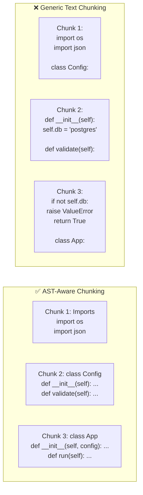

# 9.16.3 Code RAG

## Introduction

Code RAG systems help developers find relevant code, understand unfamiliar codebases, and generate contextually accurate completions. But code is fundamentally different from natural language — it has syntax trees, scope rules, import graphs, and type systems. Chunking a Python module the same way you chunk an article produces chunks that break mid-function, lose import context, and strip the type information the LLM needs.

This lesson covers how to build RAG systems purpose-built for code: AST-aware chunking that respects language structure, repository indexing that captures cross-file relationships, and retrieval strategies that bring the right code context to the LLM.

## Prerequisites

- RAG pipeline fundamentals (Lessons 9.1–9.5)
- Basic understanding of Abstract Syntax Trees (ASTs)
- Familiarity with Python's `ast` module (or tree-sitter)
- Version control concepts (git, commits, branches)

---

## Why Generic Chunking Fails for Code



| Problem | Generic Chunking | AST-Aware Chunking |
|---------|------------------|--------------------|
| Function split mid-body | ✗ Happens frequently | ✓ Never — function is the atomic unit |
| Class methods separated from class | ✗ Methods in different chunks | ✓ Class and methods stay together |
| Imports lost | ✗ Imports in chunk 1, usage in chunk 5 | ✓ Imports included with dependent code |
| Decorators separated from function | ✗ Decorator in one chunk, function in next | ✓ Decorator + function kept together |
| Docstrings detached | ✗ Docstring in previous chunk | ✓ Docstring stays with its function/class |

---

## AST-Aware Chunking

```python
import ast
import textwrap
from dataclasses import dataclass, field
from typing import Optional
from enum import Enum


class CodeNodeType(Enum):
    """Types of code units we can chunk."""
    MODULE = "module"
    CLASS = "class"
    FUNCTION = "function"
    METHOD = "method"
    IMPORT_BLOCK = "import_block"
    CONSTANT_BLOCK = "constant_block"
    TYPE_ALIAS = "type_alias"


@dataclass
class CodeChunk:
    """A chunk of code with structural metadata.

    Code chunks preserve the AST context: what class a method
    belongs to, what the function signature is, which modules
    are imported, and the full file path for locating the code.
    """
    content: str
    file_path: str
    node_type: CodeNodeType
    name: str                          # function/class/module name
    qualified_name: str                # e.g., "config.Config.validate"
    signature: str = ""                # function/method signature
    docstring: str = ""
    parent_class: Optional[str] = None # for methods
    decorators: list[str] = field(default_factory=list)
    imports_used: list[str] = field(default_factory=list)
    line_start: int = 0
    line_end: int = 0
    language: str = "python"


class PythonASTChunker:
    """Chunk Python source code using the Abstract Syntax Tree.

    Walks the AST to produce chunks that align with the code's
    logical structure — never splitting a function, class, or
    decorated block.

    Chunking strategy:
    1. Parse source code into AST
    2. Collect top-level import statements into a single import block
    3. Collect module-level constants into a constants block
    4. Extract each class as a unit (with all methods)
    5. For large classes, split into: class header + individual methods
    6. Extract standalone functions as individual chunks
    7. Attach import context to each chunk
    """

    def __init__(self, max_chunk_lines: int = 100):
        self.max_chunk_lines = max_chunk_lines

    def chunk_file(self, source: str, file_path: str) -> list[CodeChunk]:
        """Parse and chunk a Python source file."""
        try:
            tree = ast.parse(source)
        except SyntaxError:
            # If file doesn't parse, fall back to text-based splitting
            return self._fallback_chunk(source, file_path)

        lines = source.splitlines()
        chunks = []

        # Collect imports
        imports = self._extract_imports(tree)
        if imports:
            import_lines = [ast.get_source_segment(source, node) or "" for node in imports]
            chunks.append(
                CodeChunk(
                    content="\n".join(import_lines),
                    file_path=file_path,
                    node_type=CodeNodeType.IMPORT_BLOCK,
                    name="imports",
                    qualified_name=f"{self._module_name(file_path)}.imports",
                )
            )

        # Collect module-level assignments (constants)
        constants = self._extract_constants(tree, source)
        if constants:
            chunks.append(
                CodeChunk(
                    content="\n".join(constants),
                    file_path=file_path,
                    node_type=CodeNodeType.CONSTANT_BLOCK,
                    name="constants",
                    qualified_name=f"{self._module_name(file_path)}.constants",
                )
            )

        # Process each top-level definition
        for node in ast.iter_child_nodes(tree):
            if isinstance(node, ast.ClassDef):
                chunks.extend(self._chunk_class(node, source, lines, file_path))
            elif isinstance(node, (ast.FunctionDef, ast.AsyncFunctionDef)):
                chunks.append(self._chunk_function(node, source, lines, file_path))

        return chunks

    def _chunk_class(
        self,
        node: ast.ClassDef,
        source: str,
        lines: list[str],
        file_path: str,
    ) -> list[CodeChunk]:
        """Chunk a class definition.

        If the class fits within max_chunk_lines, keep it as one chunk.
        Otherwise, split into class header + individual methods.
        """
        class_source = self._get_node_source(node, lines)
        module = self._module_name(file_path)
        class_lines = node.end_lineno - node.lineno + 1

        if class_lines <= self.max_chunk_lines:
            # Small class — keep as single chunk
            return [
                CodeChunk(
                    content=class_source,
                    file_path=file_path,
                    node_type=CodeNodeType.CLASS,
                    name=node.name,
                    qualified_name=f"{module}.{node.name}",
                    docstring=ast.get_docstring(node) or "",
                    decorators=[
                        ast.get_source_segment(source, d) or ""
                        for d in node.decorator_list
                    ],
                    line_start=node.lineno,
                    line_end=node.end_lineno,
                )
            ]

        # Large class — split into class header + methods
        chunks = []

        # Class header: class definition + docstring + class variables
        header_lines = []
        decorators = [
            ast.get_source_segment(source, d) or "" for d in node.decorator_list
        ]
        for dec in decorators:
            header_lines.append(f"@{dec}")

        bases = ", ".join(
            ast.get_source_segment(source, b) or "" for b in node.bases
        )
        header_lines.append(f"class {node.name}({bases}):" if bases else f"class {node.name}:")

        docstring = ast.get_docstring(node)
        if docstring:
            header_lines.append(f'    """{docstring}"""')

        # Add class-level assignments
        for child in ast.iter_child_nodes(node):
            if isinstance(child, (ast.Assign, ast.AnnAssign)):
                segment = ast.get_source_segment(source, child)
                if segment:
                    header_lines.append(f"    {segment}")

        chunks.append(
            CodeChunk(
                content="\n".join(header_lines),
                file_path=file_path,
                node_type=CodeNodeType.CLASS,
                name=node.name,
                qualified_name=f"{module}.{node.name}",
                docstring=docstring or "",
                line_start=node.lineno,
                line_end=node.lineno + len(header_lines),
            )
        )

        # Individual methods
        for child in ast.iter_child_nodes(node):
            if isinstance(child, (ast.FunctionDef, ast.AsyncFunctionDef)):
                chunk = self._chunk_function(
                    child, source, lines, file_path, parent_class=node.name
                )
                chunks.append(chunk)

        return chunks

    def _chunk_function(
        self,
        node: ast.FunctionDef | ast.AsyncFunctionDef,
        source: str,
        lines: list[str],
        file_path: str,
        parent_class: str = None,
    ) -> CodeChunk:
        """Create a chunk for a function or method."""
        func_source = self._get_node_source(node, lines)
        module = self._module_name(file_path)

        if parent_class:
            qualified = f"{module}.{parent_class}.{node.name}"
        else:
            qualified = f"{module}.{node.name}"

        # Build signature string
        sig = ast.get_source_segment(source, node.args) or ""
        returns = ""
        if node.returns:
            returns = f" -> {ast.get_source_segment(source, node.returns) or ''}"
        signature = f"def {node.name}({sig}){returns}"

        return CodeChunk(
            content=func_source,
            file_path=file_path,
            node_type=CodeNodeType.METHOD if parent_class else CodeNodeType.FUNCTION,
            name=node.name,
            qualified_name=qualified,
            signature=signature,
            docstring=ast.get_docstring(node) or "",
            parent_class=parent_class,
            decorators=[
                ast.get_source_segment(source, d) or ""
                for d in node.decorator_list
            ],
            line_start=node.lineno,
            line_end=node.end_lineno,
        )

    @staticmethod
    def _extract_imports(tree: ast.Module) -> list[ast.stmt]:
        """Extract all top-level import statements."""
        imports = []
        for node in ast.iter_child_nodes(tree):
            if isinstance(node, (ast.Import, ast.ImportFrom)):
                imports.append(node)
        return imports

    @staticmethod
    def _extract_constants(tree: ast.Module, source: str) -> list[str]:
        """Extract module-level constant assignments."""
        constants = []
        for node in ast.iter_child_nodes(tree):
            if isinstance(node, (ast.Assign, ast.AnnAssign)):
                segment = ast.get_source_segment(source, node)
                if segment:
                    constants.append(segment)
        return constants

    @staticmethod
    def _get_node_source(node: ast.AST, lines: list[str]) -> str:
        """Extract the source code for an AST node."""
        start = node.lineno - 1
        end = node.end_lineno
        return "\n".join(lines[start:end])

    @staticmethod
    def _module_name(file_path: str) -> str:
        """Convert file path to module-like name."""
        import os
        name = os.path.splitext(os.path.basename(file_path))[0]
        return name

    def _fallback_chunk(self, source: str, file_path: str) -> list[CodeChunk]:
        """Fall back to indentation-based chunking for unparseable code."""
        chunks = []
        current_block = []
        current_name = "unknown"

        for line in source.splitlines():
            if line.strip().startswith(("def ", "class ", "async def ")):
                if current_block:
                    chunks.append(
                        CodeChunk(
                            content="\n".join(current_block),
                            file_path=file_path,
                            node_type=CodeNodeType.FUNCTION,
                            name=current_name,
                            qualified_name=f"{self._module_name(file_path)}.{current_name}",
                        )
                    )
                current_block = [line]
                current_name = line.strip().split("(")[0].split()[-1]
            else:
                current_block.append(line)

        if current_block:
            chunks.append(
                CodeChunk(
                    content="\n".join(current_block),
                    file_path=file_path,
                    node_type=CodeNodeType.FUNCTION,
                    name=current_name,
                    qualified_name=f"{self._module_name(file_path)}.{current_name}",
                )
            )

        return chunks
```

---

## Repository Indexing and Cross-File Context

A single file rarely tells the whole story. When a developer asks "How does the authentication flow work?", the RAG system needs to find code across multiple files — the auth middleware, the user model, the login handler, the token validator. This requires a **repository map**:

```python
import os
from dataclasses import dataclass, field


@dataclass
class FileNode:
    """A file in the repository with its code structure."""
    path: str
    language: str
    imports: list[str] = field(default_factory=list)
    exports: list[str] = field(default_factory=list)
    classes: list[str] = field(default_factory=list)
    functions: list[str] = field(default_factory=list)
    file_docstring: str = ""


@dataclass
class ImportEdge:
    """A dependency between two files."""
    source_file: str   # File that does the importing
    target_file: str   # File being imported from
    imported_names: list[str] = field(default_factory=list)


class RepositoryIndexer:
    """Build a structural index of a code repository.

    Creates a graph of files, their exports, and the import
    relationships between them. This enables the retriever to
    find not just the function the user asked about, but also
    the related code it depends on or that depends on it.

    Inspired by Aider's "repo map" approach: use the AST to
    build a map of what each file defines and what it imports,
    then use graph analysis to find the most relevant context
    for a given query.
    """

    SUPPORTED_EXTENSIONS = {
        ".py": "python",
        ".js": "javascript",
        ".ts": "typescript",
        ".jsx": "javascript",
        ".tsx": "typescript",
    }

    def __init__(self, repo_path: str, ignore_patterns: list[str] = None):
        self.repo_path = repo_path
        self.ignore_patterns = ignore_patterns or [
            "__pycache__",
            "node_modules",
            ".git",
            ".venv",
            "venv",
            "dist",
            "build",
        ]

    def index_repository(self) -> dict:
        """Build the repository index.

        Returns:
            dict with 'files', 'edges', and 'graph' keys.
        """
        files = {}
        edges = []

        for root, dirs, filenames in os.walk(self.repo_path):
            # Skip ignored directories
            dirs[:] = [
                d for d in dirs
                if not any(p in os.path.join(root, d) for p in self.ignore_patterns)
            ]

            for filename in filenames:
                ext = os.path.splitext(filename)[1]
                if ext not in self.SUPPORTED_EXTENSIONS:
                    continue

                file_path = os.path.join(root, filename)
                rel_path = os.path.relpath(file_path, self.repo_path)

                try:
                    with open(file_path, "r", encoding="utf-8") as f:
                        source = f.read()
                except (UnicodeDecodeError, PermissionError):
                    continue

                language = self.SUPPORTED_EXTENSIONS[ext]
                file_node = self._analyze_file(source, rel_path, language)
                files[rel_path] = file_node

                # Extract import edges
                file_edges = self._extract_edges(file_node, rel_path)
                edges.extend(file_edges)

        # Build adjacency graph
        graph = self._build_graph(files, edges)

        return {"files": files, "edges": edges, "graph": graph}

    def _analyze_file(
        self, source: str, file_path: str, language: str
    ) -> FileNode:
        """Analyze a single source file."""
        if language == "python":
            return self._analyze_python(source, file_path)
        # Extend for other languages with tree-sitter
        return FileNode(path=file_path, language=language)

    def _analyze_python(self, source: str, file_path: str) -> FileNode:
        """Analyze a Python source file using the ast module."""
        import ast as ast_module

        try:
            tree = ast_module.parse(source)
        except SyntaxError:
            return FileNode(path=file_path, language="python")

        imports = []
        exports = []
        classes = []
        functions = []

        for node in ast_module.iter_child_nodes(tree):
            if isinstance(node, ast_module.Import):
                for alias in node.names:
                    imports.append(alias.name)
            elif isinstance(node, ast_module.ImportFrom):
                module = node.module or ""
                for alias in node.names:
                    imports.append(f"{module}.{alias.name}")
            elif isinstance(node, ast_module.ClassDef):
                classes.append(node.name)
                exports.append(node.name)
            elif isinstance(node, (ast_module.FunctionDef, ast_module.AsyncFunctionDef)):
                functions.append(node.name)
                if not node.name.startswith("_"):
                    exports.append(node.name)

        docstring = ast_module.get_docstring(tree) or ""

        return FileNode(
            path=file_path,
            language="python",
            imports=imports,
            exports=exports,
            classes=classes,
            functions=functions,
            file_docstring=docstring,
        )

    def _extract_edges(self, file_node: FileNode, file_path: str) -> list[ImportEdge]:
        """Extract import dependency edges from a file."""
        edges = []
        for imp in file_node.imports:
            # Convert import path to potential file path
            parts = imp.split(".")
            possible_paths = [
                os.path.join(*parts) + ".py",
                os.path.join(*parts, "__init__.py"),
            ]
            for target in possible_paths:
                edges.append(
                    ImportEdge(
                        source_file=file_path,
                        target_file=target,
                        imported_names=[parts[-1]] if parts else [],
                    )
                )
        return edges

    @staticmethod
    def _build_graph(
        files: dict[str, FileNode],
        edges: list[ImportEdge],
    ) -> dict[str, list[str]]:
        """Build an adjacency list from files and edges."""
        graph = {path: [] for path in files}
        file_paths = set(files.keys())

        for edge in edges:
            if edge.target_file in file_paths:
                graph.setdefault(edge.source_file, []).append(edge.target_file)

        return graph
```

### Context Expansion

When the retriever finds a relevant function, it often needs to also pull in:

```python
class ContextExpander:
    """Expand code context by following dependencies.

    When a function is retrieved, this expander adds:
    1. The imports that function uses
    2. The class definition if it's a method
    3. Type definitions used in the signature
    4. Called functions from the same module
    5. Related test files

    This mirrors how a human developer would explore —
    finding `process_payment()`, then looking at `Payment`
    class, then checking `validate_card()`.
    """

    def __init__(self, repo_index: dict):
        self.files = repo_index["files"]
        self.graph = repo_index["graph"]

    def expand(
        self,
        chunk: CodeChunk,
        all_chunks: list[CodeChunk],
        max_context_chunks: int = 5,
    ) -> list[CodeChunk]:
        """Expand context around a retrieved code chunk."""
        context = [chunk]
        seen = {chunk.qualified_name}

        # 1. Add the import block from the same file
        for c in all_chunks:
            if (
                c.file_path == chunk.file_path
                and c.node_type == CodeNodeType.IMPORT_BLOCK
                and c.qualified_name not in seen
            ):
                context.append(c)
                seen.add(c.qualified_name)

        # 2. If it's a method, add the class header
        if chunk.parent_class:
            for c in all_chunks:
                if (
                    c.file_path == chunk.file_path
                    and c.node_type == CodeNodeType.CLASS
                    and c.name == chunk.parent_class
                    and c.qualified_name not in seen
                ):
                    context.append(c)
                    seen.add(c.qualified_name)

        # 3. Add related functions from the same file
        called_functions = self._extract_called_names(chunk.content)
        for c in all_chunks:
            if len(context) >= max_context_chunks:
                break
            if (
                c.name in called_functions
                and c.qualified_name not in seen
            ):
                context.append(c)
                seen.add(c.qualified_name)

        # 4. Add definitions from imported files
        file_node = self.files.get(chunk.file_path)
        if file_node:
            imported_files = self.graph.get(chunk.file_path, [])
            for imp_file in imported_files:
                if len(context) >= max_context_chunks:
                    break
                for c in all_chunks:
                    if (
                        c.file_path == imp_file
                        and c.node_type in (CodeNodeType.CLASS, CodeNodeType.FUNCTION)
                        and c.qualified_name not in seen
                    ):
                        context.append(c)
                        seen.add(c.qualified_name)
                        break

        return context

    @staticmethod
    def _extract_called_names(source: str) -> set[str]:
        """Extract function/method names called in the source."""
        import re
        # Match function calls: name(
        pattern = r"\b([a-zA-Z_][a-zA-Z0-9_]*)\s*\("
        matches = re.findall(pattern, source)
        # Filter out Python builtins and common keywords
        builtins_set = {"print", "len", "range", "str", "int", "float",
                        "list", "dict", "set", "tuple", "isinstance",
                        "hasattr", "getattr", "setattr", "super", "type",
                        "if", "for", "while", "return"}
        return {m for m in matches if m not in builtins_set}
```

---

## Language-Aware Chunking Strategies

Different programming languages require different chunking strategies:

| Language | Atomic Unit | Grouping Strategy | Key Metadata |
|----------|-------------|-------------------|--------------|
| **Python** | Function / Method | Class → Methods, Module → Functions | Decorators, type hints, docstrings |
| **JavaScript/TypeScript** | Function / Arrow function | Module exports, Class methods, React components | JSDoc, type annotations, export type |
| **Java/C#** | Method | Class → Methods, Interface contracts | Annotations, visibility modifiers, generics |
| **Go** | Function | Package → Functions, Interface + implementations | Receiver type, exported/unexported |
| **Rust** | Function / impl block | Module → Functions, trait + implementations | Lifetimes, generics, derive macros |

### Multi-Language Chunking Configuration

```python
from dataclasses import dataclass


@dataclass
class LanguageChunkConfig:
    """Configuration for language-specific chunking."""
    extension: str
    parser: str             # "ast" (Python) or "tree-sitter"
    atomic_units: list[str] # What constitutes a chunk
    max_chunk_lines: int
    include_comments: bool
    signature_format: str   # How to format function signatures


LANGUAGE_CONFIGS = {
    "python": LanguageChunkConfig(
        extension=".py",
        parser="ast",
        atomic_units=["function", "class", "method"],
        max_chunk_lines=100,
        include_comments=True,
        signature_format="def {name}({params}) -> {return_type}",
    ),
    "javascript": LanguageChunkConfig(
        extension=".js",
        parser="tree-sitter",
        atomic_units=["function", "arrow_function", "class", "method"],
        max_chunk_lines=80,
        include_comments=True,
        signature_format="function {name}({params})",
    ),
    "typescript": LanguageChunkConfig(
        extension=".ts",
        parser="tree-sitter",
        atomic_units=["function", "arrow_function", "class", "method", "interface", "type_alias"],
        max_chunk_lines=80,
        include_comments=True,
        signature_format="function {name}({params}): {return_type}",
    ),
}
```

---

## API Documentation Integration

Production code RAG systems often need to combine code from the repository with official API documentation:

```python
@dataclass
class APIDocChunk:
    """A chunk from API documentation."""
    content: str
    library: str        # e.g., "numpy", "react"
    version: str        # e.g., "1.24.0"
    symbol_name: str    # e.g., "numpy.array"
    symbol_type: str    # "function", "class", "method", "constant"
    parameters: list[dict] = field(default_factory=list)
    return_type: str = ""
    examples: list[str] = field(default_factory=list)
    deprecated: bool = False
    deprecation_notice: str = ""


class CodeRAGPipeline:
    """Complete code RAG pipeline combining repo code + API docs.

    Query flow:
    1. Parse the developer question
    2. Search repo chunks for relevant internal code
    3. Expand context (imports, parent classes, callees)
    4. Search API docs for relevant library documentation
    5. Combine internal code + API docs as context
    6. Generate response with code citations
    """

    def __init__(self, repo_index, code_store, doc_store):
        self.repo_index = repo_index
        self.code_store = code_store
        self.doc_store = doc_store
        self.expander = ContextExpander(repo_index)

    async def answer(
        self,
        question: str,
        question_embedding: list[float],
        repo_chunks: list[CodeChunk],
    ) -> dict:
        """Answer a code question with full context."""
        # Step 1: Retrieve relevant code chunks
        code_results = await self.code_store.search(
            query_vector=question_embedding,
            limit=5,
        )

        # Step 2: Expand context for each result
        expanded = []
        for result in code_results:
            chunk = self._payload_to_chunk(result.payload)
            context = self.expander.expand(chunk, repo_chunks)
            expanded.extend(context)

        # Step 3: Retrieve relevant API documentation
        api_docs = await self.doc_store.search(
            query_vector=question_embedding,
            limit=3,
        )

        # Step 4: Build context
        context = self._build_context(expanded, api_docs)

        return {
            "context": context,
            "code_chunks": expanded,
            "api_docs": api_docs,
        }

    def _build_context(
        self,
        code_chunks: list[CodeChunk],
        api_docs: list,
    ) -> str:
        """Build the LLM context from code and docs."""
        parts = ["## Relevant Code\n"]

        seen_files = set()
        for chunk in code_chunks:
            if chunk.file_path not in seen_files:
                parts.append(f"\n### {chunk.file_path}\n")
                seen_files.add(chunk.file_path)

            parts.append(f"```python\n# {chunk.qualified_name}")
            if chunk.docstring:
                parts.append(f"# {chunk.docstring[:100]}...")
            parts.append(chunk.content)
            parts.append("```\n")

        if api_docs:
            parts.append("\n## API Documentation\n")
            for doc in api_docs:
                payload = doc.payload if hasattr(doc, "payload") else doc
                parts.append(f"### {payload.get('symbol_name', 'Unknown')}")
                parts.append(payload.get("content", ""))
                parts.append("")

        return "\n".join(parts)

    @staticmethod
    def _payload_to_chunk(payload: dict) -> CodeChunk:
        """Convert a vector store payload to a CodeChunk."""
        return CodeChunk(
            content=payload.get("content", ""),
            file_path=payload.get("file_path", ""),
            node_type=CodeNodeType(payload.get("node_type", "function")),
            name=payload.get("name", ""),
            qualified_name=payload.get("qualified_name", ""),
            signature=payload.get("signature", ""),
            docstring=payload.get("docstring", ""),
            parent_class=payload.get("parent_class"),
        )
```

---

## Summary

| Component | Code-Specific Adaptation |
|-----------|-------------------------|
| **Chunking** | AST-aware: never split functions, keep classes with methods, preserve decorators + docstrings |
| **Metadata** | Qualified name, signature, parent class, file path, line range, language |
| **Repository indexing** | Import graph + export map for cross-file context discovery |
| **Context expansion** | Follow imports, include parent class, add called functions |
| **Multi-language** | Per-language config for atomic units, parsers (ast vs tree-sitter), signature format |
| **API docs** | Combine internal code with official library documentation |

### Key Takeaways

1. **AST-aware chunking** is non-negotiable for code — generic text chunking produces chunks that break mid-function and lose critical context
2. **Repository indexing** captures the import/export graph that connects files — enabling the retriever to find related code, not just the exact match
3. **Context expansion** mimics how developers explore — finding a function, then checking its class, its dependencies, and its callers
4. **Multi-language support** requires per-language configurations because each language has different structural units (classes vs modules vs packages)
5. **API documentation integration** bridges the gap between "how does our code use library X" and "what does library X's API actually do"

## Practice Exercises

1. **Build an AST chunker** that parses a Python file and produces one chunk per function/class, preserving decorators and docstrings
2. **Create a repository indexer** that walks a project directory and builds an import graph showing which files depend on which
3. **Implement context expansion** that, given a retrieved function, also retrieves its imports, parent class, and called functions
4. **Build a multi-language chunker** that selects the right parsing strategy based on file extension

---

← [Previous: Medical RAG](./02-medical-rag.md) | [Next: Financial RAG →](./04-financial-rag.md)
