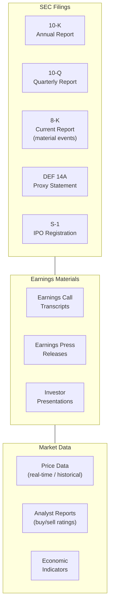

# 9.16.4 Financial RAG

## Introduction

Financial RAG systems operate in a domain defined by numbers, tables, time-sensitivity, and strict regulatory requirements. A financial analyst asking "What was Apple's gross margin in Q3 2024?" expects a precise percentage from a specific SEC filing — not a paraphrased estimate from an outdated blog post. The stakes are high: inaccurate financial data can drive bad investment decisions, trigger compliance violations, or create legal liability.

This lesson covers how to build RAG systems for financial applications: parsing SEC filings and earnings transcripts, preserving table structures during chunking, handling temporal data so stale numbers don't contaminate responses, and adding the regulatory guardrails financial applications require.

## Prerequisites

- RAG pipeline fundamentals (Lessons 9.1–9.5)
- Basic understanding of financial documents (10-K, 10-Q, earnings calls)
- Table data handling concepts
- Temporal data awareness

---

## Financial Document Landscape



### Document Priority and Reliability

| Source | Authority Level | Update Frequency | Typical Staleness Risk |
|--------|----------------|-------------------|----------------------|
| SEC 10-K/10-Q | Highest — legally required, audited | Quarterly / Annually | Low within filing period |
| 8-K filings | High — event-driven, timely | As events occur | Very low |
| Earnings transcripts | High — direct management statements | Quarterly | Low |
| Press releases | Medium — company-reviewed | As needed | Medium |
| Analyst reports | Medium — expert analysis | Varies | Medium-High |
| News articles | Lower — may contain errors | Continuous | High |
| Social media | Lowest — unverified | Real-time | Extreme |

---

## Table-Preserving Chunking

Financial documents are table-heavy — income statements, balance sheets, segment breakdowns. A chunker that converts tables to flat text destroys the structure that gives financial data its meaning:

```python
import re
from dataclasses import dataclass, field
from typing import Optional
from enum import Enum


class FinancialSectionType(Enum):
    """Section types in financial documents."""
    INCOME_STATEMENT = "income_statement"
    BALANCE_SHEET = "balance_sheet"
    CASH_FLOW = "cash_flow"
    SEGMENT_DATA = "segment_data"
    RISK_FACTORS = "risk_factors"
    MD_AND_A = "md_and_a"  # Management Discussion & Analysis
    NOTES = "notes"
    FORWARD_LOOKING = "forward_looking"
    EXECUTIVE_COMP = "executive_compensation"
    NARRATIVE = "narrative"


@dataclass
class FinancialChunk:
    """A chunk from a financial document with financial metadata.

    Financial chunks track the fiscal period, whether they contain
    tables, and whether the data is forward-looking (projected)
    vs historical (reported).
    """
    content: str
    source_filing: str        # e.g., "AAPL 10-K 2024"
    filing_type: str          # "10-K", "10-Q", "8-K"
    section_type: FinancialSectionType
    company_ticker: str
    company_name: str
    fiscal_period: str        # "FY2024", "Q3 2024"
    filing_date: str
    contains_table: bool = False
    table_data: Optional[list[list[str]]] = None  # Parsed table rows
    is_forward_looking: bool = False
    is_audited: bool = False
    currency: str = "USD"
    metrics_mentioned: list[str] = field(default_factory=list)
    page_number: int = 0


class FinancialDocumentChunker:
    """Chunk financial documents while preserving table structures.

    Financial documents have three content types that need
    different handling:
    1. Tables — preserve as structured data (never split a table)
    2. Narrative sections — chunk by paragraph/section
    3. Footnotes — keep with the table or section they reference

    Key principles:
    - Never split a table across chunks
    - Keep column headers with data rows
    - Preserve fiscal period context in every chunk
    - Tag forward-looking statements explicitly
    - Track which financial metrics appear in each chunk
    """

    SECTION_PATTERNS = {
        FinancialSectionType.INCOME_STATEMENT: [
            r"(?i)consolidated\s+statements?\s+of\s+(?:income|operations|earnings)",
            r"(?i)income\s+statement",
            r"(?i)profit\s+and\s+loss",
        ],
        FinancialSectionType.BALANCE_SHEET: [
            r"(?i)consolidated\s+balance\s+sheet",
            r"(?i)statements?\s+of\s+financial\s+(?:position|condition)",
        ],
        FinancialSectionType.CASH_FLOW: [
            r"(?i)consolidated\s+statements?\s+of\s+cash\s+flows?",
            r"(?i)cash\s+flow\s+statement",
        ],
        FinancialSectionType.MD_AND_A: [
            r"(?i)management.{0,5}s?\s+discussion\s+and\s+analysis",
            r"(?i)item\s+7[\.\s]",
        ],
        FinancialSectionType.RISK_FACTORS: [
            r"(?i)risk\s+factors",
            r"(?i)item\s+1A[\.\s]",
        ],
        FinancialSectionType.FORWARD_LOOKING: [
            r"(?i)forward[- ]looking\s+statements?",
            r"(?i)(?:guidance|outlook|projections?)\s+for",
        ],
    }

    FINANCIAL_METRICS = [
        "revenue", "net income", "gross margin", "operating income",
        "EBITDA", "EPS", "earnings per share", "free cash flow",
        "total assets", "total liabilities", "shareholders equity",
        "operating expenses", "cost of goods sold", "COGS",
        "gross profit", "net profit margin", "ROE", "ROA",
        "debt-to-equity", "current ratio", "working capital",
    ]

    FORWARD_LOOKING_INDICATORS = [
        r"(?i)(?:we|the company)\s+(?:expect|anticipate|believe|project|estimate|plan|intend)",
        r"(?i)(?:guidance|outlook|forecast|projection)\s+(?:for|of|is)",
        r"(?i)(?:forward[- ]looking|future|upcoming|next\s+(?:quarter|fiscal|year))",
        r"(?i)(?:may|might|could|should|would)\s+(?:result|lead|cause|impact)",
    ]

    def __init__(self, max_narrative_words: int = 400):
        self.max_narrative_words = max_narrative_words

    def chunk_filing(
        self, text: str, metadata: dict
    ) -> list[FinancialChunk]:
        """Chunk a financial filing into structured chunks."""
        sections = self._split_into_sections(text)
        chunks = []

        for section_text, section_type in sections:
            # Detect tables within the section
            table_blocks, narrative_blocks = self._separate_tables(section_text)

            # Create table chunks (never split)
            for table_text, table_data in table_blocks:
                chunk = FinancialChunk(
                    content=table_text,
                    source_filing=metadata.get("filing_id", ""),
                    filing_type=metadata.get("filing_type", ""),
                    section_type=section_type,
                    company_ticker=metadata.get("ticker", ""),
                    company_name=metadata.get("company_name", ""),
                    fiscal_period=metadata.get("fiscal_period", ""),
                    filing_date=metadata.get("filing_date", ""),
                    contains_table=True,
                    table_data=table_data,
                    is_forward_looking=self._is_forward_looking(table_text),
                    is_audited=metadata.get("is_audited", False),
                    currency=metadata.get("currency", "USD"),
                    metrics_mentioned=self._extract_metrics(table_text),
                )
                chunks.append(chunk)

            # Create narrative chunks (split by paragraph)
            for narrative in narrative_blocks:
                sub_chunks = self._chunk_narrative(
                    narrative, section_type, metadata
                )
                chunks.extend(sub_chunks)

        return chunks

    def _split_into_sections(
        self, text: str
    ) -> list[tuple[str, FinancialSectionType]]:
        """Split filing into sections based on headers."""
        sections = []
        current_text = ""
        current_type = FinancialSectionType.NARRATIVE

        for line in text.split("\n"):
            detected_type = self._detect_section_type(line)
            if detected_type and detected_type != current_type:
                if current_text.strip():
                    sections.append((current_text, current_type))
                current_text = line + "\n"
                current_type = detected_type
            else:
                current_text += line + "\n"

        if current_text.strip():
            sections.append((current_text, current_type))

        return sections

    def _detect_section_type(self, text: str) -> Optional[FinancialSectionType]:
        """Detect which section type a header belongs to."""
        for section_type, patterns in self.SECTION_PATTERNS.items():
            for pattern in patterns:
                if re.search(pattern, text):
                    return section_type
        return None

    def _separate_tables(
        self, text: str
    ) -> tuple[list[tuple[str, list]], list[str]]:
        """Separate table content from narrative content.

        Tables are identified by:
        - Lines with multiple tab or pipe delimiters
        - Lines with aligned numeric columns
        - Markdown-style tables (| col1 | col2 |)
        """
        lines = text.split("\n")
        table_blocks = []
        narrative_blocks = []

        current_table_lines = []
        current_narrative_lines = []
        in_table = False

        for line in lines:
            is_table_line = self._is_table_line(line)

            if is_table_line and not in_table:
                # Start of table — save narrative so far
                if current_narrative_lines:
                    narrative_blocks.append("\n".join(current_narrative_lines))
                    current_narrative_lines = []
                in_table = True
                current_table_lines = [line]
            elif is_table_line and in_table:
                current_table_lines.append(line)
            elif not is_table_line and in_table:
                # End of table
                table_text = "\n".join(current_table_lines)
                table_data = self._parse_table(current_table_lines)
                table_blocks.append((table_text, table_data))
                current_table_lines = []
                in_table = False
                current_narrative_lines.append(line)
            else:
                current_narrative_lines.append(line)

        # Handle remaining content
        if current_table_lines:
            table_text = "\n".join(current_table_lines)
            table_data = self._parse_table(current_table_lines)
            table_blocks.append((table_text, table_data))
        if current_narrative_lines:
            narrative_blocks.append("\n".join(current_narrative_lines))

        return table_blocks, narrative_blocks

    @staticmethod
    def _is_table_line(line: str) -> bool:
        """Check if a line is part of a table."""
        # Multiple pipe delimiters (markdown table)
        if line.count("|") >= 2:
            return True
        # Multiple tab delimiters
        if line.count("\t") >= 2:
            return True
        # Lines with aligned numbers (financial data)
        numbers = re.findall(r"[\$€£]?\s*[\d,]+\.?\d*", line)
        if len(numbers) >= 2:
            return True
        return False

    @staticmethod
    def _parse_table(lines: list[str]) -> list[list[str]]:
        """Parse table lines into a list of rows."""
        rows = []
        for line in lines:
            if "|" in line:
                cells = [cell.strip() for cell in line.split("|") if cell.strip()]
                if cells and not all(c == "-" * len(c) for c in cells):
                    rows.append(cells)
            elif "\t" in line:
                cells = [cell.strip() for cell in line.split("\t") if cell.strip()]
                rows.append(cells)
        return rows

    def _chunk_narrative(
        self,
        text: str,
        section_type: FinancialSectionType,
        metadata: dict,
    ) -> list[FinancialChunk]:
        """Chunk narrative text into right-sized pieces."""
        paragraphs = text.split("\n\n")
        chunks = []
        current = ""

        for para in paragraphs:
            if len((current + para).split()) > self.max_narrative_words and current:
                chunks.append(
                    FinancialChunk(
                        content=current.strip(),
                        source_filing=metadata.get("filing_id", ""),
                        filing_type=metadata.get("filing_type", ""),
                        section_type=section_type,
                        company_ticker=metadata.get("ticker", ""),
                        company_name=metadata.get("company_name", ""),
                        fiscal_period=metadata.get("fiscal_period", ""),
                        filing_date=metadata.get("filing_date", ""),
                        is_forward_looking=self._is_forward_looking(current),
                        is_audited=metadata.get("is_audited", False),
                        metrics_mentioned=self._extract_metrics(current),
                    )
                )
                current = para
            else:
                current += "\n\n" + para if current else para

        if current.strip():
            chunks.append(
                FinancialChunk(
                    content=current.strip(),
                    source_filing=metadata.get("filing_id", ""),
                    filing_type=metadata.get("filing_type", ""),
                    section_type=section_type,
                    company_ticker=metadata.get("ticker", ""),
                    company_name=metadata.get("company_name", ""),
                    fiscal_period=metadata.get("fiscal_period", ""),
                    filing_date=metadata.get("filing_date", ""),
                    is_forward_looking=self._is_forward_looking(current),
                    is_audited=metadata.get("is_audited", False),
                    metrics_mentioned=self._extract_metrics(current),
                )
            )

        return chunks

    def _is_forward_looking(self, text: str) -> bool:
        """Check if text contains forward-looking statements."""
        for pattern in self.FORWARD_LOOKING_INDICATORS:
            if re.search(pattern, text):
                return True
        return False

    def _extract_metrics(self, text: str) -> list[str]:
        """Extract financial metrics mentioned in text."""
        found = []
        text_lower = text.lower()
        for metric in self.FINANCIAL_METRICS:
            if metric.lower() in text_lower:
                found.append(metric)
        return found
```

---

## Temporal Data Handling

Financial data has an expiration date. Last quarter's revenue is historical fact; next quarter's guidance is a forward-looking estimate. A RAG system that treats both the same will mislead users:

```python
from dataclasses import dataclass
from datetime import datetime, timedelta
from typing import Optional


@dataclass
class TemporalScore:
    """Temporal scoring result for a financial chunk."""
    age_days: int
    freshness_score: float  # 0.0 (stale) to 1.0 (fresh)
    is_superseded: bool     # Newer filing exists for same period
    staleness_warning: Optional[str] = None


class TemporalDataHandler:
    """Handle time-sensitivity in financial data retrieval.

    Financial data staleness depends on the data type:
    - Market prices: stale in minutes
    - Earnings data: stale when next quarter reports
    - Annual reports: stale when next annual report filed
    - Regulatory filings: valid until superseded
    - Forward-looking statements: only valid for stated period

    This handler scores chunks by freshness and flags
    superseded data.
    """

    # How quickly different data types become stale
    STALENESS_WINDOWS = {
        "10-K": timedelta(days=365),   # Annual — stale after next annual
        "10-Q": timedelta(days=90),    # Quarterly — stale after next quarter
        "8-K": timedelta(days=30),     # Event — relevant for ~30 days
        "earnings_call": timedelta(days=90),
        "press_release": timedelta(days=30),
        "analyst_report": timedelta(days=90),
        "market_data": timedelta(hours=24),
    }

    def score_freshness(
        self,
        chunk: FinancialChunk,
        query_date: datetime = None,
        existing_filings: list[dict] = None,
    ) -> TemporalScore:
        """Score a chunk's temporal relevance."""
        query_date = query_date or datetime.now()

        # Parse filing date
        try:
            filing_date = datetime.strptime(chunk.filing_date, "%Y-%m-%d")
        except (ValueError, TypeError):
            return TemporalScore(
                age_days=0,
                freshness_score=0.5,
                is_superseded=False,
                staleness_warning="Unable to determine filing date",
            )

        age = query_date - filing_date
        staleness_window = self.STALENESS_WINDOWS.get(
            chunk.filing_type, timedelta(days=180)
        )

        # Calculate freshness score (exponential decay)
        if age.days <= 0:
            freshness = 1.0
        else:
            half_life = staleness_window.days / 2
            freshness = 0.5 ** (age.days / half_life) if half_life > 0 else 0.0
            freshness = max(0.05, freshness)  # Never fully zero

        # Check if superseded by newer filing
        is_superseded = False
        warning = None

        if existing_filings:
            for filing in existing_filings:
                if (
                    filing.get("ticker") == chunk.company_ticker
                    and filing.get("filing_type") == chunk.filing_type
                    and filing.get("filing_date", "") > chunk.filing_date
                ):
                    is_superseded = True
                    warning = (
                        f"This {chunk.filing_type} from {chunk.fiscal_period} has been "
                        f"superseded by a newer filing dated {filing['filing_date']}"
                    )
                    freshness *= 0.3  # Heavily penalize superseded data
                    break

        # Flag forward-looking statements that are past their horizon
        if chunk.is_forward_looking and age.days > staleness_window.days:
            warning = (
                f"Forward-looking statement from {chunk.fiscal_period} — "
                f"the projection period has likely passed. "
                f"Check actual results in subsequent filings."
            )
            freshness *= 0.2

        return TemporalScore(
            age_days=age.days,
            freshness_score=freshness,
            is_superseded=is_superseded,
            staleness_warning=warning,
        )

    def filter_by_period(
        self,
        chunks: list[FinancialChunk],
        target_period: str,
    ) -> list[FinancialChunk]:
        """Filter chunks to a specific fiscal period.

        If the user asks about 'Q3 2024', return only chunks
        from that period — don't mix in Q2 data.
        """
        return [c for c in chunks if c.fiscal_period == target_period]
```

---

## Financial Retrieval with Regulatory Compliance

```python
import re


FINANCIAL_SYSTEM_PROMPT = """You are a financial analysis assistant providing 
information based on official SEC filings and earnings materials.

CRITICAL RULES:
1. Only cite data from the provided SEC filings and official sources.
2. Always specify the exact filing, company, and fiscal period for each data point.
3. Clearly distinguish between REPORTED (historical) and PROJECTED (forward-looking) figures.
4. Use exact numbers from filings — never round or estimate.
5. When financial data is from a superseded filing, flag it as outdated.
6. Do not provide investment advice, buy/sell recommendations, or price targets.
7. Flag any forward-looking statements with appropriate disclaimers.
8. If data is insufficient to answer, say so — never fabricate financial figures.

RESPONSE FORMAT:
- Data point with exact figure, source filing, and fiscal period
- Comparison context (YoY, QoQ) when available
- Any relevant risk factors or caveats
- Forward-looking statement warnings when applicable

MANDATORY DISCLAIMER:
📊 This information is derived from publicly available SEC filings and is 
provided for informational purposes only. It does not constitute investment 
advice. Past performance does not guarantee future results. Always consult 
a qualified financial advisor for investment decisions."""


class FinancialResponseValidator:
    """Validate financial RAG responses for accuracy and compliance.

    Financial responses must:
    1. Not contain investment advice
    2. Flag forward-looking statements
    3. Include source citations with fiscal periods
    4. Not present superseded data without warning
    5. Include the required disclaimer
    """

    INVESTMENT_ADVICE_PATTERNS = [
        r"(?i)(?:you should|I recommend|we suggest)\s+(?:buy|sell|hold|invest)",
        r"(?i)(?:buy|sell|strong buy|strong sell|outperform|underperform)\s+rating",
        r"(?i)price\s+target\s+(?:of|is|set at)\s+\$?\d+",
        r"(?i)(?:this is|would be)\s+a\s+good\s+(?:investment|buy|opportunity)",
    ]

    def validate(self, response: str, chunks_used: list[FinancialChunk]) -> dict:
        """Run all compliance checks on a financial response."""
        issues = []

        # 1. Check for investment advice
        for pattern in self.INVESTMENT_ADVICE_PATTERNS:
            if re.search(pattern, response):
                issues.append(
                    "Response contains language that could be interpreted "
                    "as investment advice. This must be removed."
                )
                break

        # 2. Check for forward-looking statements
        has_forward = any(c.is_forward_looking for c in chunks_used)
        if has_forward and "forward-looking" not in response.lower():
            response += (
                "\n\n⚠️ *This response includes forward-looking statements "
                "based on company projections. Actual results may differ "
                "materially from these estimates.*"
            )

        # 3. Check for superseded data warnings
        # (temporal handler should have already flagged these)

        # 4. Verify numbers are cited with sources
        numbers_without_source = re.findall(
            r"\$[\d,.]+\s+(?:billion|million|thousand)?\s*(?![\(\[])",
            response,
        )
        if len(numbers_without_source) > 2:
            issues.append(
                "Multiple financial figures without inline source citations. "
                "Each data point should reference the specific filing."
            )

        # 5. Ensure disclaimer
        if "does not constitute investment advice" not in response.lower():
            response += (
                "\n\n📊 *This information is derived from publicly available "
                "SEC filings and is provided for informational purposes only. "
                "It does not constitute investment advice.*"
            )

        return {
            "response": response,
            "issues": issues,
            "passed_compliance": len(issues) == 0,
        }
```

---

## Summary

| Component | Financial-Specific Adaptation |
|-----------|------------------------------|
| **Chunking** | Table-preserving: never split a table, keep headers with data rows |
| **Metadata** | Filing type, fiscal period, ticker, filing date, is_audited, is_forward_looking |
| **Temporal handling** | Freshness scoring with exponential decay, superseded filing detection |
| **Forward-looking** | Automatic detection and flagging of projections vs reported data |
| **Compliance** | No investment advice, source citation enforcement, mandatory disclaimer |
| **Retrieval** | Period-aware filtering, freshness-weighted scoring |

### Key Takeaways

1. **Table preservation** is non-negotiable in financial RAG — income statements, balance sheets, and segment data lose meaning when flattened to text
2. **Temporal awareness** prevents stale data contamination — last quarter's revenue shouldn't be presented as current when a newer filing exists
3. **Forward-looking vs historical** must be clearly distinguished — the LLM should never present projections as reported facts
4. **Regulatory compliance** requires programmatic enforcement — investment advice detection, mandatory disclaimers, and source citation checks
5. **Filing type hierarchy** matters — audited 10-K data outranks an analyst blog post about the same metric

## Practice Exercises

1. **Build a table-preserving chunker** that separates tables from narrative in financial documents and keeps table structures intact
2. **Implement a temporal freshness scorer** that penalizes stale data and flags superseded filings
3. **Create a financial response validator** that detects investment advice language and enforces forward-looking statement disclaimers
4. **Design a period-aware retrieval filter** that returns only chunks from a specific fiscal period (e.g., "Q3 FY2024")

---

← [Previous: Code RAG](./03-code-rag.md) | [Next: Customer Support RAG →](./05-customer-support-rag.md)
