# 9.16.5 Customer Support RAG

## Introduction

Customer support RAG is the most widely deployed domain-specific RAG application. It powers chatbots that answer product questions, resolve common issues, and route complex problems to human agents. Unlike legal or medical RAG where accuracy is paramount and speed is secondary, customer support RAG must balance accuracy, speed, tone, and knowing when to hand off — all while handling queries in multiple languages and across multiple product versions.

This lesson covers how to build RAG systems for customer support: structuring FAQ and knowledge base content for optimal retrieval, integrating ticket history for context-aware responses, detecting when escalation is needed, and supporting multi-language customer bases.

## Prerequisites

- RAG pipeline fundamentals (Lessons 9.1–9.5)
- Conversational interface basics (Unit 5)
- Basic understanding of support workflows (tickets, SLAs, escalation)

---

## Customer Support Content Types

```mermaid
graph TB
    subgraph Knowledge["Knowledge Sources"]
        A["📖 Product Documentation<br/>Feature descriptions, specs"]
        B["❓ FAQ / Knowledge Base<br/>Q&A pairs, how-to guides"]
        C["🎫 Ticket History<br/>Past resolutions, known issues"]
        D["📋 Internal Runbooks<br/>Agent procedures, scripts"]
        E["📢 Release Notes<br/>What changed, when"]
    end

    subgraph Context["Dynamic Context"]
        F["👤 Customer Profile<br/>Plan, usage, history"]
        G["📦 Product Version<br/>Which version are they on?"]
        H["🔧 System Status<br/>Is there an active outage?"]
    end

    Knowledge --> I["RAG Pipeline"]
    Context --> I
    I --> J["Response + Actions"]
```



### Content Priority Matrix

| Source | Query: How do I...? | Query: It's broken! | Query: Cancel account |
|--------|---------------------|---------------------|----------------------|
| **Product docs** | ★★★ Primary | ★★ Secondary | ★ Low |
| **FAQ/KB** | ★★★ Primary | ★★★ Primary | ★★ Secondary |
| **Ticket history** | ★ Low | ★★★ Primary | ★★ Secondary |
| **Release notes** | ★★ Secondary | ★★★ Primary | ★ Low |
| **Internal runbooks** | ★ Low | ★★ Secondary | ★★★ Primary |

---

## Q&A-Pair-Aware Chunking

FAQ and knowledge base articles have a natural Q&A structure. Generic chunking destroys this structure by splitting questions from their answers:

```python
import re
from dataclasses import dataclass, field
from typing import Optional
from enum import Enum


class SupportContentType(Enum):
    """Types of customer support content."""
    FAQ = "faq"
    HOW_TO = "how_to"
    TROUBLESHOOTING = "troubleshooting"
    PRODUCT_DOCS = "product_docs"
    RELEASE_NOTES = "release_notes"
    RUNBOOK = "runbook"
    TICKET_RESOLUTION = "ticket_resolution"


@dataclass
class SupportChunk:
    """A chunk from customer support content.

    Support chunks carry product version, category, and
    intent information to enable version-aware, intent-matched
    retrieval.
    """
    content: str
    source_type: SupportContentType
    source_title: str
    question: str = ""           # The FAQ question (if Q&A pair)
    answer: str = ""             # The FAQ answer (if Q&A pair)
    product: str = ""            # Which product
    product_version: str = ""    # Which version (e.g., "3.2.1")
    min_version: str = ""        # Minimum applicable version
    max_version: str = ""        # Maximum applicable version
    category: str = ""           # e.g., "billing", "technical", "account"
    tags: list[str] = field(default_factory=list)
    language: str = "en"
    last_updated: str = ""
    helpfulness_score: float = 0.0  # From user feedback
    view_count: int = 0


class SupportContentChunker:
    """Chunk support content while preserving Q&A structures.

    Chunking strategies by content type:
    - FAQ: Keep question + answer as a single chunk
    - How-to: Keep step sequences together
    - Troubleshooting: Keep symptom + cause + solution together
    - Product docs: Section-based with feature context
    - Release notes: Keep per-version change blocks together
    """

    def chunk_faq(
        self, text: str, metadata: dict
    ) -> list[SupportChunk]:
        """Chunk FAQ content into Q&A pairs.

        Supports multiple FAQ formats:
        - Q: ... A: ...
        - **Question:** ... **Answer:** ...
        - ### Question\\n Answer
        """
        qa_patterns = [
            # Q: / A: format
            r"(?:^|\n)\s*Q:\s*(.+?)\s*\n\s*A:\s*(.+?)(?=\n\s*Q:|\Z)",
            # **Question:** / **Answer:** format
            r"\*\*(?:Question|Q)\*?\*?:?\s*(.+?)\s*\n\s*\*\*(?:Answer|A)\*?\*?:?\s*(.+?)(?=\*\*(?:Question|Q)|\Z)",
            # ### Header as question, body as answer
            r"###\s+(.+?)\s*\n\s*(.+?)(?=###|\Z)",
        ]

        chunks = []
        for pattern in qa_patterns:
            matches = re.findall(pattern, text, re.DOTALL)
            if matches:
                for question, answer in matches:
                    chunks.append(
                        SupportChunk(
                            content=f"Q: {question.strip()}\nA: {answer.strip()}",
                            source_type=SupportContentType.FAQ,
                            source_title=metadata.get("title", ""),
                            question=question.strip(),
                            answer=answer.strip(),
                            product=metadata.get("product", ""),
                            product_version=metadata.get("version", ""),
                            category=metadata.get("category", ""),
                            tags=metadata.get("tags", []),
                            language=metadata.get("language", "en"),
                            last_updated=metadata.get("last_updated", ""),
                        )
                    )
                break  # Use the first pattern that matches

        return chunks

    def chunk_troubleshooting(
        self, text: str, metadata: dict
    ) -> list[SupportChunk]:
        """Chunk troubleshooting guides into problem-solution blocks.

        Each block should contain:
        - Symptom / Error message
        - Possible cause(s)
        - Step-by-step solution
        - Verification step
        """
        # Split on problem headers
        problem_pattern = r"(?=(?:^|\n)\s*(?:Problem|Issue|Error|Symptom|Bug)\s*[:#])"
        blocks = re.split(problem_pattern, text, flags=re.IGNORECASE)

        chunks = []
        for block in blocks:
            block = block.strip()
            if not block or len(block.split()) < 10:
                continue

            # Extract the problem/symptom as the "question"
            first_line = block.split("\n")[0].strip()
            first_line = re.sub(r"^(?:Problem|Issue|Error|Symptom|Bug)\s*[:#]\s*", "", first_line, flags=re.IGNORECASE)

            chunks.append(
                SupportChunk(
                    content=block,
                    source_type=SupportContentType.TROUBLESHOOTING,
                    source_title=metadata.get("title", ""),
                    question=first_line,
                    product=metadata.get("product", ""),
                    product_version=metadata.get("version", ""),
                    category="technical",
                    tags=metadata.get("tags", []),
                    language=metadata.get("language", "en"),
                    last_updated=metadata.get("last_updated", ""),
                )
            )

        return chunks

    def chunk_release_notes(
        self, text: str, metadata: dict
    ) -> list[SupportChunk]:
        """Chunk release notes by version blocks.

        Each version block stays together so the retriever
        can return all changes for a specific version.
        """
        # Split on version headers
        version_pattern = r"(?=(?:^|\n)\s*(?:v|Version\s+)?\d+\.\d+(?:\.\d+)?)"
        blocks = re.split(version_pattern, text, flags=re.IGNORECASE)

        chunks = []
        for block in blocks:
            block = block.strip()
            if not block:
                continue

            # Extract version number
            version_match = re.search(
                r"(?:v|Version\s+)?(\d+\.\d+(?:\.\d+)?)", block
            )
            version = version_match.group(1) if version_match else ""

            chunks.append(
                SupportChunk(
                    content=block,
                    source_type=SupportContentType.RELEASE_NOTES,
                    source_title=metadata.get("title", ""),
                    product=metadata.get("product", ""),
                    product_version=version,
                    category="release",
                    tags=metadata.get("tags", []),
                    language=metadata.get("language", "en"),
                    last_updated=metadata.get("last_updated", ""),
                )
            )

        return chunks
```

---

## Ticket History Integration

Past support tickets are a gold mine — if a customer reports the same error 50 other customers had last month, the resolution from those tickets is exactly what the agent needs:

```python
from dataclasses import dataclass, field
from typing import Optional
from datetime import datetime


@dataclass
class SupportTicket:
    """A resolved support ticket for RAG ingestion."""
    ticket_id: str
    subject: str
    description: str
    resolution: str
    category: str
    product: str
    product_version: str
    customer_plan: str       # "free", "pro", "enterprise"
    resolution_time_hours: float
    satisfaction_score: Optional[float] = None  # 1-5
    resolved_by: str = ""    # "agent", "bot", "self-service"
    tags: list[str] = field(default_factory=list)
    created_at: str = ""
    resolved_at: str = ""


class TicketHistoryProcessor:
    """Process support tickets for RAG ingestion.

    Not all tickets are equally useful. This processor:
    1. Filters to resolved tickets with positive outcomes
    2. Deduplicates similar issues
    3. Extracts the reusable resolution pattern
    4. Weights by satisfaction score and recency
    """

    def __init__(self, min_satisfaction: float = 3.0):
        self.min_satisfaction = min_satisfaction

    def process_tickets(
        self, tickets: list[SupportTicket]
    ) -> list[SupportChunk]:
        """Convert resolved tickets into retrievable chunks."""
        # Filter to quality resolutions
        quality_tickets = [
            t for t in tickets
            if t.resolution
            and (t.satisfaction_score is None or t.satisfaction_score >= self.min_satisfaction)
        ]

        # Group by category + product for deduplication
        groups = {}
        for ticket in quality_tickets:
            key = (ticket.category, ticket.product, ticket.product_version)
            groups.setdefault(key, []).append(ticket)

        chunks = []
        for (category, product, version), group in groups.items():
            # Sort by satisfaction score (highest first)
            group.sort(
                key=lambda t: t.satisfaction_score or 3.0, reverse=True
            )

            # Take top tickets per group (avoid too many duplicates)
            for ticket in group[:5]:
                chunk = SupportChunk(
                    content=(
                        f"Issue: {ticket.subject}\n"
                        f"Description: {ticket.description}\n"
                        f"Resolution: {ticket.resolution}"
                    ),
                    source_type=SupportContentType.TICKET_RESOLUTION,
                    source_title=f"Ticket #{ticket.ticket_id}",
                    question=ticket.subject,
                    answer=ticket.resolution,
                    product=product,
                    product_version=version,
                    category=category,
                    tags=ticket.tags,
                    helpfulness_score=ticket.satisfaction_score or 0.0,
                )
                chunks.append(chunk)

        return chunks
```

---

## Escalation Detection

Knowing when to stop trying and hand off to a human is critical for customer satisfaction:

```python
import re
from dataclasses import dataclass
from enum import Enum


class EscalationLevel(Enum):
    """Escalation urgency levels."""
    NONE = "none"           # Continue with bot
    SOFT = "soft"           # Offer human option
    HARD = "hard"           # Transfer immediately
    EMERGENCY = "emergency" # Priority transfer + alert


@dataclass
class EscalationSignal:
    """A detected escalation trigger."""
    level: EscalationLevel
    trigger_type: str       # "sentiment", "keyword", "repetition", "topic"
    reason: str
    confidence: float


class EscalationDetector:
    """Detect when a conversation should be escalated to a human.

    Escalation triggers:
    1. Sentiment — frustration, anger, threats
    2. Keywords — "speak to a person", "cancel", "lawsuit"
    3. Repetition — asking the same question 3+ times
    4. Topic — billing disputes, data deletion, legal
    5. Failure — bot has said "I don't know" 2+ times
    6. Vulnerability — mentions of harm, distress
    """

    KEYWORD_TRIGGERS = {
        EscalationLevel.EMERGENCY: [
            r"(?i)(?:sue|lawsuit|legal\s+action|attorney|lawyer)",
            r"(?i)(?:data\s+breach|security\s+incident|compromised)",
            r"(?i)(?:harm|hurt|danger|unsafe|emergency)",
        ],
        EscalationLevel.HARD: [
            r"(?i)(?:speak|talk)\s+(?:to|with)\s+(?:a\s+)?(?:human|person|agent|manager|supervisor)",
            r"(?i)(?:cancel|close|delete)\s+(?:my\s+)?(?:account|subscription)",
            r"(?i)(?:refund|money\s+back|charge\s+back|dispute\s+charge)",
            r"(?i)(?:completely\s+)?(?:unacceptable|outrageous|ridiculous)",
            r"(?i)(?:report|complain)\s+(?:to|about)",
        ],
        EscalationLevel.SOFT: [
            r"(?i)(?:frustrated|annoyed|disappointed|upset|unhappy)",
            r"(?i)(?:not\s+(?:working|helping)|doesn.t\s+(?:work|help))",
            r"(?i)(?:this\s+is\s+(?:the\s+)?(?:worst|terrible|awful))",
            r"(?i)(?:how\s+many\s+times|already\s+(?:told|asked|explained))",
        ],
    }

    SENTIMENT_INDICATORS = {
        "negative": [
            r"(?i)(?:hate|terrible|worst|awful|horrible|useless|waste|stupid|broken|garbage)",
        ],
        "threatening": [
            r"(?i)(?:sue|lawsuit|bbb|better\s+business|attorney\s+general|ftc|consumer\s+protection)",
        ],
    }

    def detect(
        self,
        current_message: str,
        conversation_history: list[dict] = None,
    ) -> EscalationSignal:
        """Analyze a message and conversation for escalation signals."""
        signals = []

        # 1. Keyword detection
        for level, patterns in self.KEYWORD_TRIGGERS.items():
            for pattern in patterns:
                if re.search(pattern, current_message):
                    signals.append(
                        EscalationSignal(
                            level=level,
                            trigger_type="keyword",
                            reason=f"Keyword match: {pattern}",
                            confidence=0.9,
                        )
                    )

        # 2. Sentiment detection (simplified — use a sentiment model in production)
        negative_count = 0
        for patterns in self.SENTIMENT_INDICATORS.values():
            for pattern in patterns:
                negative_count += len(re.findall(pattern, current_message))

        if negative_count >= 3:
            signals.append(
                EscalationSignal(
                    level=EscalationLevel.HARD,
                    trigger_type="sentiment",
                    reason=f"High negative sentiment ({negative_count} indicators)",
                    confidence=0.8,
                )
            )
        elif negative_count >= 1:
            signals.append(
                EscalationSignal(
                    level=EscalationLevel.SOFT,
                    trigger_type="sentiment",
                    reason=f"Negative sentiment detected ({negative_count} indicators)",
                    confidence=0.6,
                )
            )

        # 3. Repetition detection (same question asked multiple times)
        if conversation_history:
            repetition_signal = self._check_repetition(
                current_message, conversation_history
            )
            if repetition_signal:
                signals.append(repetition_signal)

            # 4. Bot failure detection
            failure_signal = self._check_bot_failures(conversation_history)
            if failure_signal:
                signals.append(failure_signal)

        # Return the highest-severity signal
        if not signals:
            return EscalationSignal(
                level=EscalationLevel.NONE,
                trigger_type="none",
                reason="No escalation triggers detected",
                confidence=1.0,
            )

        level_priority = {
            EscalationLevel.EMERGENCY: 0,
            EscalationLevel.HARD: 1,
            EscalationLevel.SOFT: 2,
            EscalationLevel.NONE: 3,
        }
        signals.sort(key=lambda s: level_priority.get(s.level, 99))
        return signals[0]

    def _check_repetition(
        self,
        current: str,
        history: list[dict],
    ) -> Optional[EscalationSignal]:
        """Check if user is repeating the same question."""
        user_messages = [
            m["content"] for m in history
            if m.get("role") == "user"
        ]

        if len(user_messages) < 2:
            return None

        # Simple word overlap check (use embeddings in production)
        current_words = set(current.lower().split())
        repeat_count = 0
        for msg in user_messages[-5:]:
            msg_words = set(msg.lower().split())
            overlap = len(current_words & msg_words) / max(len(current_words), 1)
            if overlap > 0.6:
                repeat_count += 1

        if repeat_count >= 2:
            return EscalationSignal(
                level=EscalationLevel.HARD,
                trigger_type="repetition",
                reason=f"User has asked a similar question {repeat_count + 1} times",
                confidence=0.85,
            )
        return None

    @staticmethod
    def _check_bot_failures(history: list[dict]) -> Optional[EscalationSignal]:
        """Check if the bot has failed to help multiple times."""
        failure_phrases = [
            "i don't know",
            "i'm not sure",
            "i cannot help with",
            "i don't have information",
            "please contact support",
        ]

        bot_messages = [
            m["content"].lower() for m in history
            if m.get("role") == "assistant"
        ]

        failure_count = sum(
            1 for msg in bot_messages
            if any(phrase in msg for phrase in failure_phrases)
        )

        if failure_count >= 2:
            return EscalationSignal(
                level=EscalationLevel.HARD,
                trigger_type="bot_failure",
                reason=f"Bot has failed to answer {failure_count} times",
                confidence=0.9,
            )
        return None
```

---

## Multi-Language Support

Global products need support in multiple languages. The RAG system must handle queries and content in different languages:

```python
from dataclasses import dataclass
from enum import Enum


class LanguageStrategy(Enum):
    """How to handle multi-language content."""
    TRANSLATE_QUERY = "translate_query"       # Translate query → English, search English KB
    TRANSLATE_RESPONSE = "translate_response" # Search English KB, translate response
    NATIVE_KB = "native_kb"                   # Maintain separate KB per language
    MULTILINGUAL_EMBED = "multilingual_embed" # Use multilingual embeddings


@dataclass
class LanguageConfig:
    """Configuration for a supported language."""
    code: str           # ISO 639-1 code
    name: str
    strategy: LanguageStrategy
    embedding_model: str
    has_native_kb: bool


LANGUAGE_CONFIGS = {
    "en": LanguageConfig(
        code="en",
        name="English",
        strategy=LanguageStrategy.NATIVE_KB,
        embedding_model="text-embedding-3-small",
        has_native_kb=True,
    ),
    "es": LanguageConfig(
        code="es",
        name="Spanish",
        strategy=LanguageStrategy.MULTILINGUAL_EMBED,
        embedding_model="multilingual-e5-large",
        has_native_kb=True,
    ),
    "ja": LanguageConfig(
        code="ja",
        name="Japanese",
        strategy=LanguageStrategy.TRANSLATE_QUERY,
        embedding_model="multilingual-e5-large",
        has_native_kb=False,
    ),
    "de": LanguageConfig(
        code="de",
        name="German",
        strategy=LanguageStrategy.TRANSLATE_RESPONSE,
        embedding_model="text-embedding-3-small",
        has_native_kb=False,
    ),
}


class MultiLanguageSupport:
    """Handle multi-language queries and responses.

    Four strategies depending on available resources:
    1. Native KB — full KB in that language (best quality)
    2. Multilingual embeddings — search across languages
    3. Translate query — translate to English, search English KB
    4. Translate response — search English KB, translate answer

    Strategy selection depends on:
    - Does a native KB exist for this language?
    - Is the embedding model multilingual?
    - What's the acceptable latency? (translation adds time)
    - What's the acceptable quality? (translation may lose nuance)
    """

    def __init__(self, translator=None):
        self.translator = translator
        self.configs = LANGUAGE_CONFIGS

    async def process_query(
        self,
        query: str,
        detected_language: str,
    ) -> dict:
        """Process a query based on the language strategy.

        Returns the processed query (possibly translated)
        and the strategy being used for this request.
        """
        config = self.configs.get(detected_language)
        if not config:
            # Unsupported language — fall back to translate approach
            config = LanguageConfig(
                code=detected_language,
                name=detected_language,
                strategy=LanguageStrategy.TRANSLATE_QUERY,
                embedding_model="multilingual-e5-large",
                has_native_kb=False,
            )

        if config.strategy == LanguageStrategy.TRANSLATE_QUERY:
            translated = await self._translate(query, detected_language, "en")
            return {
                "search_query": translated,
                "response_language": detected_language,
                "strategy": config.strategy,
                "embedding_model": config.embedding_model,
            }

        return {
            "search_query": query,
            "response_language": detected_language,
            "strategy": config.strategy,
            "embedding_model": config.embedding_model,
        }

    async def format_response(
        self,
        response: str,
        target_language: str,
        strategy: LanguageStrategy,
    ) -> str:
        """Format/translate response for the target language."""
        if strategy == LanguageStrategy.TRANSLATE_RESPONSE:
            return await self._translate(response, "en", target_language)
        return response

    async def _translate(
        self, text: str, source_lang: str, target_lang: str
    ) -> str:
        """Translate text between languages.

        In production, use a translation API (Google Translate,
        DeepL, Azure Translator) or an LLM with translation
        instructions.
        """
        if self.translator:
            return await self.translator.translate(text, source_lang, target_lang)
        # Placeholder — return original text
        return text
```

---

## Product Version Filtering

A customer on version 2.x asking "How do I export data?" should not receive instructions for version 3.x's completely redesigned export feature:

```python
import re
from typing import Optional


class VersionFilter:
    """Filter support content by product version.

    Ensures customers receive instructions applicable to
    their specific product version:
    - Exact match preferred (v3.2 instructions for v3.2 user)
    - Same major version acceptable (v3.1 instructions for v3.2 user)
    - Different major version excluded (v2.x instructions for v3.x user)
    - Unversioned content always included
    """

    def filter_chunks(
        self,
        chunks: list[SupportChunk],
        customer_version: str,
    ) -> list[SupportChunk]:
        """Filter chunks to those applicable to the customer's version."""
        if not customer_version:
            return chunks

        customer_major, customer_minor, customer_patch = self._parse_version(
            customer_version
        )

        scored = []
        for chunk in chunks:
            score = self._version_score(
                chunk, customer_major, customer_minor, customer_patch
            )
            if score > 0:
                scored.append((chunk, score))

        # Sort by version relevance score
        scored.sort(key=lambda x: x[1], reverse=True)
        return [chunk for chunk, _ in scored]

    def _version_score(
        self,
        chunk: SupportChunk,
        target_major: int,
        target_minor: int,
        target_patch: int,
    ) -> float:
        """Score a chunk's version relevance (0 = exclude, 1.0 = perfect match)."""
        # Unversioned content is always somewhat relevant
        if not chunk.product_version:
            return 0.5

        chunk_major, chunk_minor, chunk_patch = self._parse_version(
            chunk.product_version
        )

        # Different major version — exclude
        if chunk_major != target_major:
            return 0.0

        # Same major, same minor, same patch — exact match
        if chunk_minor == target_minor and chunk_patch == target_patch:
            return 1.0

        # Same major, same minor — very relevant
        if chunk_minor == target_minor:
            return 0.9

        # Same major, different minor — somewhat relevant
        return 0.6

    @staticmethod
    def _parse_version(version_str: str) -> tuple[int, int, int]:
        """Parse a version string into (major, minor, patch)."""
        match = re.match(r"v?(\d+)(?:\.(\d+))?(?:\.(\d+))?", version_str)
        if not match:
            return (0, 0, 0)
        return (
            int(match.group(1)),
            int(match.group(2) or 0),
            int(match.group(3) or 0),
        )
```

---

## Complete Customer Support RAG Pipeline

```python
SUPPORT_SYSTEM_PROMPT = """You are a helpful customer support assistant for {product_name}.

RESPONSE GUIDELINES:
1. Be friendly, empathetic, and professional.
2. Answer based on the provided knowledge base articles and documentation.
3. If you find a matching FAQ or troubleshooting guide, provide the step-by-step solution.
4. Always confirm the customer's product version when instructions are version-specific.
5. If you cannot answer the question, say so clearly and offer to connect them with a human agent.
6. Never make up features, pricing, or policies.
7. For billing questions, verify details from official documentation only.
8. For technical issues, ask for error messages or screenshots if the initial info is insufficient.

TONE:
- Warm but professional
- Acknowledge the customer's frustration when appropriate
- Use simple language — avoid jargon
- Be concise — respect the customer's time

ACTIONS YOU CAN TAKE:
- Provide step-by-step instructions
- Link to relevant documentation
- Offer to escalate to a human agent
- Create a support ticket for follow-up"""


class CustomerSupportRAG:
    """Complete customer support RAG pipeline.

    Query flow:
    1. Detect language
    2. Check for escalation signals
    3. Identify product + version context
    4. Retrieve from FAQ, docs, and ticket history
    5. Filter by product version
    6. Generate response with appropriate tone
    7. Check for escalation in response context
    8. Translate response if needed
    """

    def __init__(self, vector_store, language_support, escalation_detector):
        self.vector_store = vector_store
        self.language_support = language_support
        self.escalation_detector = escalation_detector
        self.version_filter = VersionFilter()

    async def handle_query(
        self,
        query: str,
        customer_context: dict,
        conversation_history: list[dict] = None,
    ) -> dict:
        """Handle a customer support query end-to-end."""

        # Step 1: Check for escalation
        escalation = self.escalation_detector.detect(
            query, conversation_history
        )
        if escalation.level in (EscalationLevel.HARD, EscalationLevel.EMERGENCY):
            return {
                "action": "escalate",
                "response": self._escalation_message(escalation),
                "escalation": escalation,
            }

        # Step 2: Process language
        language = customer_context.get("language", "en")
        lang_result = await self.language_support.process_query(
            query, language
        )

        # Step 3: Retrieve relevant content
        search_results = await self.vector_store.search(
            query=lang_result["search_query"],
            limit=10,
        )

        # Step 4: Convert to SupportChunks and filter by version
        chunks = [self._to_support_chunk(r) for r in search_results]
        customer_version = customer_context.get("product_version", "")
        filtered = self.version_filter.filter_chunks(chunks, customer_version)

        # Step 5: Build context for generation
        context = self._build_context(filtered[:5])

        # Step 6: Generate (translate response if needed)
        response = context  # Placeholder — LLM generation would go here

        if lang_result["strategy"] == LanguageStrategy.TRANSLATE_RESPONSE:
            response = await self.language_support.format_response(
                response, language, lang_result["strategy"]
            )

        # Step 7: Offer soft escalation if detected
        if escalation.level == EscalationLevel.SOFT:
            response += (
                "\n\nWould you like me to connect you with a support agent "
                "who can help further?"
            )

        return {
            "action": "respond",
            "response": response,
            "sources": [c.source_title for c in filtered[:5]],
            "escalation": escalation,
        }

    def _build_context(self, chunks: list[SupportChunk]) -> str:
        """Build LLM context from support chunks."""
        parts = []
        for chunk in chunks:
            if chunk.question:
                parts.append(f"**Q:** {chunk.question}\n**A:** {chunk.answer}")
            else:
                parts.append(chunk.content)
            parts.append(f"_(Source: {chunk.source_title}, v{chunk.product_version})_\n")
        return "\n\n".join(parts)

    @staticmethod
    def _escalation_message(signal: EscalationSignal) -> str:
        """Generate an escalation handoff message."""
        if signal.level == EscalationLevel.EMERGENCY:
            return (
                "I understand this is urgent. I'm connecting you with "
                "a senior support agent immediately. Please hold for "
                "just a moment."
            )
        return (
            "I'd like to connect you with a support agent who can help "
            "with this directly. Let me transfer you now."
        )

    @staticmethod
    def _to_support_chunk(search_result) -> SupportChunk:
        """Convert a vector store result to a SupportChunk."""
        payload = search_result.payload if hasattr(search_result, "payload") else search_result
        return SupportChunk(
            content=payload.get("content", ""),
            source_type=SupportContentType(payload.get("source_type", "faq")),
            source_title=payload.get("source_title", ""),
            question=payload.get("question", ""),
            answer=payload.get("answer", ""),
            product=payload.get("product", ""),
            product_version=payload.get("product_version", ""),
            category=payload.get("category", ""),
            language=payload.get("language", "en"),
        )
```

---

## Summary

| Component | Customer Support Adaptation |
|-----------|---------------------------|
| **Chunking** | Q&A-pair-aware: keep questions with answers, symptoms with solutions |
| **Metadata** | Product, version, category, language, helpfulness score, tags |
| **Ticket history** | Filter to quality resolutions, deduplicate, weight by satisfaction |
| **Escalation** | Multi-signal detection: keywords, sentiment, repetition, bot failures |
| **Multi-language** | Four strategies: native KB, multilingual embeddings, translate query/response |
| **Version filtering** | Exact match preferred, same major acceptable, different major excluded |
| **Tone** | Friendly, empathetic, professional — programmatically enforced via system prompt |

### Key Takeaways

1. **Q&A-pair-aware chunking** preserves the natural structure of FAQ content — never split a question from its answer
2. **Ticket history** is a gold mine of real-world resolutions but must be filtered for quality and deduplicated
3. **Escalation detection** is a safety net — recognizing frustration, repetition, and topic sensitivity prevents bad customer experiences
4. **Multi-language support** requires choosing the right strategy for each language based on available resources and quality requirements
5. **Version filtering** prevents the dangerous mistake of giving v2.x customers instructions that only work on v3.x

## Practice Exercises

1. **Build a Q&A-pair chunker** that parses FAQ articles into individual Q&A chunks while preserving the question-answer relationship
2. **Implement an escalation detector** that monitors conversation history for keyword triggers, sentiment, and repetition patterns
3. **Create a version filter** that scores and filters support content by product version compatibility
4. **Design a multi-language pipeline** that selects the appropriate language strategy and translates queries/responses as needed

---

← [Previous: Financial RAG](./04-financial-rag.md) | [Back to Overview →](./00-rag-for-specific-domains.md)
