# 9.17 RAG Security & Guardrails — Overview

## Introduction

A RAG pipeline is an attack surface. Every component — the user query, the document store, the retrieval step, the LLM generation — can be exploited. Unlike a static website that serves the same content to everyone, a RAG system dynamically assembles context from potentially untrusted documents and feeds it to an LLM that generates novel text. This creates security challenges that traditional web security doesn't address.

This section covers the six dimensions of RAG security: defending against prompt injection hidden in retrieved documents, preventing context poisoning of your vector store, handling PII in the retrieval pipeline, validating LLM outputs for accuracy and safety, implementing access control so users only see documents they're authorized for, and building guardrails that enforce all of these at every pipeline stage.

## Prerequisites

- **RAG pipeline fundamentals** (Lessons 9.1–9.5): You must understand the full ingestion → retrieval → generation flow
- **Prompt engineering** (Unit 6): Understanding how prompts work and can be manipulated
- **Production RAG patterns** (Lesson 9.15): Caching, monitoring, error handling
- **Web security basics** (Unit 1, Lesson 11): Authentication, authorization, input validation
- **Domain-specific RAG** (Lesson 9.16): PII handling patterns from medical/legal domains

## The RAG Threat Model

Every stage of the RAG pipeline has distinct attack vectors:

```mermaid
flowchart TB
    subgraph Attacks["🔴 Attack Vectors"]
        A1["Prompt Injection<br/>Malicious queries"]
        A2["Context Poisoning<br/>Adversarial documents"]
        A3["Data Exfiltration<br/>PII leakage"]
        A4["Privilege Escalation<br/>Unauthorized access"]
        A5["Output Manipulation<br/>Hallucinated / harmful content"]
        A6["Resource Abuse<br/>DoS, cost attacks"]
    end

    subgraph Pipeline["RAG Pipeline"]
        P1["📥 User Query"]
        P2["🔍 Retrieval"]
        P3["📄 Context Assembly"]
        P4["🤖 LLM Generation"]
        P5["📤 Response Delivery"]
    end

    subgraph Defenses["🟢 Defense Layers"]
        D1["Input Validation<br/>Query sanitization"]
        D2["Access Control<br/>Permission filtering"]
        D3["Content Scanning<br/>PII redaction"]
        D4["Output Validation<br/>Factuality + safety checks"]
        D5["Rate Limiting<br/>Audit logging"]
    end

    A1 --> P1
    A2 --> P2
    A3 --> P3
    A4 --> P2
    A5 --> P4
    A6 --> P1

    P1 --> D1
    P2 --> D2
    P3 --> D3
    P4 --> D4
    P5 --> D5
```



## OWASP Top 10 for LLM Applications (2025) — RAG Mapping

The OWASP Top 10 for LLM Applications identifies the most critical risks. Here's how each maps to RAG-specific concerns:

| OWASP Risk | ID | RAG-Specific Manifestation | Lesson |
|------------|-----|---------------------------|--------|
| **Prompt Injection** | LLM01 | Malicious instructions hidden in retrieved documents override system prompt | 01 |
| **Sensitive Information Disclosure** | LLM02 | PII in indexed documents leaks through generated responses | 03 |
| **Supply Chain** | LLM03 | Compromised embedding models or document sources | 02 |
| **Data and Model Poisoning** | LLM04 | Adversarial documents injected into vector store | 02 |
| **Improper Output Handling** | LLM05 | Generated responses contain XSS, SQL injection, or unsafe code | 04 |
| **Excessive Agency** | LLM06 | RAG agent takes unauthorized actions based on retrieved instructions | 01 |
| **System Prompt Leakage** | LLM07 | Retrieval context manipulation causes system prompt extraction | 01 |
| **Vector and Embedding Weaknesses** | LLM08 | Embedding space attacks, unauthorized access to vector store | 02, 05 |
| **Misinformation** | LLM09 | Hallucinated content presented with false source citations | 04 |
| **Unbounded Consumption** | LLM10 | Adversarial queries triggering expensive retrieval + generation | 06 |

## Defense-in-Depth Architecture

Security is not a single checkpoint — it's a series of layers, each catching what the previous one missed:

```python
from dataclasses import dataclass, field
from enum import Enum
from typing import Optional


class ThreatCategory(Enum):
    """Categories of threats to a RAG pipeline."""
    PROMPT_INJECTION = "prompt_injection"
    CONTEXT_POISONING = "context_poisoning"
    PII_LEAKAGE = "pii_leakage"
    OUTPUT_MANIPULATION = "output_manipulation"
    UNAUTHORIZED_ACCESS = "unauthorized_access"
    RESOURCE_ABUSE = "resource_abuse"


class DefenseLayer(Enum):
    """Where in the pipeline a defense operates."""
    INPUT = "input"          # Before retrieval
    RETRIEVAL = "retrieval"  # During/after retrieval
    CONTEXT = "context"      # During context assembly
    GENERATION = "generation"  # During LLM call
    OUTPUT = "output"        # After generation


@dataclass
class SecurityEvent:
    """A detected security event in the RAG pipeline."""
    threat_category: ThreatCategory
    defense_layer: DefenseLayer
    severity: str           # "critical", "high", "medium", "low"
    description: str
    blocked: bool           # Was the threat stopped?
    user_id: Optional[str] = None
    query: Optional[str] = None
    document_ids: list[str] = field(default_factory=list)


@dataclass
class RAGSecurityConfig:
    """Configuration for RAG pipeline security.

    Each setting controls a defense mechanism. All are
    enabled by default — disable at your own risk.
    """
    # Input layer
    enable_input_validation: bool = True
    max_query_length: int = 2000
    enable_injection_detection: bool = True

    # Retrieval layer
    enable_access_control: bool = True
    enable_source_verification: bool = True

    # Context layer
    enable_pii_detection: bool = True
    enable_content_scanning: bool = True
    max_context_documents: int = 10

    # Generation layer
    enable_output_validation: bool = True
    confidence_threshold: float = 0.7

    # Output layer
    enable_content_moderation: bool = True
    enable_audit_logging: bool = True

    # Rate limiting
    max_queries_per_minute: int = 30
    max_queries_per_hour: int = 500
```

## Lesson Navigation

| # | Lesson | Focus |
|---|--------|-------|
| 01 | [Prompt Injection in RAG](./01-prompt-injection.md) | Direct/indirect injection, document-borne attacks, input/context separation |
| 02 | [Context Poisoning](./02-context-poisoning.md) | Adversarial documents, embedding space attacks, source verification |
| 03 | [PII Handling in RAG](./03-pii-handling.md) | Detection, redaction, sensitivity-based access, audit logging |
| 04 | [Output Validation](./04-output-validation.md) | Factual consistency, harmful content filtering, confidence thresholds |
| 05 | [Access Control Patterns](./05-access-control.md) | RBAC, document permissions, metadata filtering, query-time checks |
| 06 | [Guardrails Implementation](./06-guardrails-implementation.md) | Full pipeline integration, rate limiting, monitoring, abuse prevention |

## Glossary

| Term | Definition |
|------|-----------|
| **Prompt Injection** | Attack where malicious text overrides the LLM's system instructions |
| **Indirect Injection** | Injection hidden in retrieved documents rather than user input |
| **Context Poisoning** | Inserting adversarial content into the vector store to corrupt retrieval |
| **PII** | Personally Identifiable Information — data that can identify an individual |
| **Guardrail** | A programmatic check that enforces safety or quality constraints |
| **RBAC** | Role-Based Access Control — permissions assigned by user role |
| **Defense-in-Depth** | Multiple overlapping security layers so no single failure is catastrophic |
| **Content Moderation** | Filtering generated text for harmful, biased, or inappropriate content |
| **Audit Trail** | Immutable log of all security-relevant actions for compliance review |
| **Rate Limiting** | Restricting the number of requests a user can make in a time window |

---

← [Previous: RAG for Specific Domains](../16-rag-for-specific-domains/00-rag-for-specific-domains.md) | [Next: Prompt Injection in RAG →](./01-prompt-injection.md)
