# 9.17.3 PII Handling in RAG

## Introduction

A RAG system that retrieves internal documents will inevitably encounter Personally Identifiable Information — names, emails, phone numbers, social security numbers, medical record numbers, financial account details. If this PII flows into the LLM prompt as retrieved context, it can appear in the generated response and be exposed to unauthorized users.

PII handling in RAG is not just a security best practice — it's a legal requirement. GDPR, HIPAA, CCPA, and dozens of other regulations mandate strict controls on how personal data is processed, stored, and disclosed. A single PII leak through a RAG response can trigger mandatory breach notifications, regulatory fines, and loss of customer trust.

This lesson covers how to detect PII in retrieved content, redact it before it reaches the LLM, manage document sensitivity levels, and build audit trails for compliance.

## Prerequisites

- RAG pipeline fundamentals (Lessons 9.1–9.5)
- Prompt injection defenses (Lesson 9.17.1)
- Basic understanding of privacy regulations (GDPR, HIPAA, CCPA)

---

## Where PII Enters RAG

```mermaid
flowchart LR
    subgraph Sources["PII Entry Points"]
        S1["📄 Internal Documents<br/>Employee records, contracts"]
        S2["📧 Email Archives<br/>Names, addresses, conversations"]
        S3["📊 Database Exports<br/>Customer tables, transactions"]
        S4["📝 User Uploads<br/>Resumes, forms, reports"]
        S5["💬 Chat History<br/>Previous conversations"]
    end

    subgraph Pipeline["RAG Pipeline"]
        P1["Chunk & Embed"] --> P2["Vector Store"]
        P2 --> P3["Retrieve"]
        P3 --> P4["Generate"]
    end

    S1 & S2 & S3 & S4 & S5 --> P1

    P3 -->|"⚠️ PII in context"| P4
    P4 -->|"⚠️ PII in response"| U["👤 User"]

    style P3 fill:#e74c3c,color:#fff
    style P4 fill:#e67e22,color:#fff
```



### The Two PII Problems in RAG

| Problem | Description | Example |
|---------|-------------|---------|
| **PII in context** | Retrieved chunks contain PII that gets sent to the LLM | A contract chunk includes "John Smith, SSN 123-45-6789" |
| **PII in response** | The LLM includes PII from context in its generated answer | "Based on the contract, John Smith (SSN 123-45-6789) is..." |

You must address **both** — redacting PII before it goes to the LLM is the primary defense, but output filtering catches anything that slips through.

---

## PII Detection

### Pattern-Based Detection

```python
import re
from dataclasses import dataclass, field
from enum import Enum
from typing import Optional


class PIIType(Enum):
    """Categories of personally identifiable information."""
    EMAIL = "email"
    PHONE = "phone"
    SSN = "ssn"
    CREDIT_CARD = "credit_card"
    DATE_OF_BIRTH = "date_of_birth"
    ADDRESS = "address"
    NAME = "name"
    IP_ADDRESS = "ip_address"
    PASSPORT = "passport"
    DRIVERS_LICENSE = "drivers_license"
    MEDICAL_RECORD = "medical_record_number"
    BANK_ACCOUNT = "bank_account"
    NATIONAL_ID = "national_id"


class PIISensitivity(Enum):
    """Sensitivity level of PII — determines handling rules."""
    LOW = "low"          # Can be logged, may appear in some contexts
    MEDIUM = "medium"    # Should be redacted from responses
    HIGH = "high"        # Must be redacted everywhere, including logs
    CRITICAL = "critical"  # Must be redacted + triggers audit alert


# Map PII types to sensitivity levels
PII_SENSITIVITY_MAP = {
    PIIType.EMAIL: PIISensitivity.MEDIUM,
    PIIType.PHONE: PIISensitivity.MEDIUM,
    PIIType.SSN: PIISensitivity.CRITICAL,
    PIIType.CREDIT_CARD: PIISensitivity.CRITICAL,
    PIIType.DATE_OF_BIRTH: PIISensitivity.HIGH,
    PIIType.ADDRESS: PIISensitivity.HIGH,
    PIIType.NAME: PIISensitivity.LOW,
    PIIType.IP_ADDRESS: PIISensitivity.LOW,
    PIIType.PASSPORT: PIISensitivity.CRITICAL,
    PIIType.DRIVERS_LICENSE: PIISensitivity.HIGH,
    PIIType.MEDICAL_RECORD: PIISensitivity.CRITICAL,
    PIIType.BANK_ACCOUNT: PIISensitivity.CRITICAL,
    PIIType.NATIONAL_ID: PIISensitivity.CRITICAL,
}


@dataclass
class PIIMatch:
    """A single PII detection in text."""
    pii_type: PIIType
    sensitivity: PIISensitivity
    start: int
    end: int
    matched_text: str
    confidence: float  # 0.0 to 1.0


@dataclass
class PIIScanResult:
    """Result of scanning text for PII."""
    contains_pii: bool
    matches: list[PIIMatch] = field(default_factory=list)
    highest_sensitivity: Optional[PIISensitivity] = None
    redacted_text: Optional[str] = None


class PIIDetector:
    """Detect personally identifiable information using regex patterns.

    This detector uses pattern matching for structured PII
    (emails, SSNs, credit cards, etc.). For unstructured PII
    like names and addresses, consider supplementing with a
    Named Entity Recognition (NER) model.

    Detection is conservative — we'd rather flag a false positive
    than miss real PII. False positives can be reviewed;
    missed PII causes breaches.
    """

    # Regex patterns for each PII type
    PII_PATTERNS = {
        PIIType.EMAIL: {
            "pattern": r"\b[A-Za-z0-9._%+-]+@[A-Za-z0-9.-]+\.[A-Z|a-z]{2,}\b",
            "confidence": 0.95,
        },
        PIIType.PHONE: {
            "pattern": (
                r"(?:\+?1[-.\s]?)?"
                r"(?:\(?\d{3}\)?[-.\s]?)"
                r"\d{3}[-.\s]?\d{4}"
            ),
            "confidence": 0.85,
        },
        PIIType.SSN: {
            "pattern": r"\b\d{3}[-\s]?\d{2}[-\s]?\d{4}\b",
            "confidence": 0.90,
        },
        PIIType.CREDIT_CARD: {
            "pattern": (
                r"\b(?:4\d{3}|5[1-5]\d{2}|6011|3[47]\d{2})"
                r"[-\s]?\d{4}[-\s]?\d{4}[-\s]?\d{4}\b"
            ),
            "confidence": 0.90,
        },
        PIIType.DATE_OF_BIRTH: {
            "pattern": (
                r"(?i)(?:date\s*of\s*birth|DOB|born|birthday)"
                r"\s*[:=]?\s*"
                r"(?:\d{1,2}[-/]\d{1,2}[-/]\d{2,4}|\w+\s+\d{1,2},?\s*\d{4})"
            ),
            "confidence": 0.80,
        },
        PIIType.IP_ADDRESS: {
            "pattern": (
                r"\b(?:(?:25[0-5]|2[0-4]\d|[01]?\d\d?)\.){3}"
                r"(?:25[0-5]|2[0-4]\d|[01]?\d\d?)\b"
            ),
            "confidence": 0.85,
        },
        PIIType.PASSPORT: {
            "pattern": r"(?i)(?:passport\s*(?:no|number|#)\s*[:=]?\s*)[A-Z0-9]{6,9}",
            "confidence": 0.75,
        },
        PIIType.MEDICAL_RECORD: {
            "pattern": r"(?i)(?:MRN|medical\s*record\s*(?:no|number|#))\s*[:=]?\s*\d{6,10}",
            "confidence": 0.85,
        },
    }

    def scan(self, text: str) -> PIIScanResult:
        """Scan text for all known PII patterns."""
        matches = []

        for pii_type, config in self.PII_PATTERNS.items():
            for match in re.finditer(config["pattern"], text):
                sensitivity = PII_SENSITIVITY_MAP.get(
                    pii_type, PIISensitivity.MEDIUM
                )
                matches.append(PIIMatch(
                    pii_type=pii_type,
                    sensitivity=sensitivity,
                    start=match.start(),
                    end=match.end(),
                    matched_text=match.group(),
                    confidence=config["confidence"],
                ))

        # Determine highest sensitivity
        highest = None
        if matches:
            sensitivity_order = [
                PIISensitivity.LOW,
                PIISensitivity.MEDIUM,
                PIISensitivity.HIGH,
                PIISensitivity.CRITICAL,
            ]
            highest = max(
                (m.sensitivity for m in matches),
                key=lambda s: sensitivity_order.index(s),
            )

        return PIIScanResult(
            contains_pii=len(matches) > 0,
            matches=matches,
            highest_sensitivity=highest,
        )
```

---

## PII Redaction

### Redaction Strategies

```python
from dataclasses import dataclass
from enum import Enum


class RedactionStrategy(Enum):
    """How to redact detected PII."""
    MASK = "mask"               # Replace with [REDACTED]
    TYPE_LABEL = "type_label"   # Replace with [EMAIL], [SSN], etc.
    HASH = "hash"               # Replace with hash (preserves uniqueness)
    PARTIAL = "partial"         # Show partial (e.g., ***-**-6789)
    REMOVE = "remove"           # Remove entirely


@dataclass
class RedactionConfig:
    """Configuration for PII redaction behavior."""
    default_strategy: RedactionStrategy = RedactionStrategy.TYPE_LABEL
    # Override strategy per sensitivity level
    sensitivity_strategies: dict[PIISensitivity, RedactionStrategy] | None = None
    # Override strategy per PII type
    type_strategies: dict[PIIType, RedactionStrategy] | None = None
    # Minimum confidence to redact (lower = more aggressive)
    min_confidence: float = 0.5

    def get_strategy(self, pii_match: PIIMatch) -> RedactionStrategy:
        """Determine the redaction strategy for a specific match."""
        # Type-specific override takes priority
        if self.type_strategies and pii_match.pii_type in self.type_strategies:
            return self.type_strategies[pii_match.pii_type]

        # Sensitivity-level override
        if (
            self.sensitivity_strategies
            and pii_match.sensitivity in self.sensitivity_strategies
        ):
            return self.sensitivity_strategies[pii_match.sensitivity]

        return self.default_strategy


class PIIRedactor:
    """Redact PII from text before it reaches the LLM.

    The redactor replaces detected PII with safe placeholders.
    Different strategies serve different purposes:

    - MASK: "[REDACTED]" — simple, no information leak
    - TYPE_LABEL: "[EMAIL]", "[SSN]" — tells LLM what was there
    - HASH: "PII_a3f2b1" — preserves entity uniqueness across chunks
    - PARTIAL: "***-**-6789" — useful when partial info is needed
    - REMOVE: "" — removes entirely (may break sentence flow)

    TYPE_LABEL is recommended for most RAG uses because it tells
    the LLM "there was an email here" without revealing the actual
    address, allowing it to generate contextually appropriate
    responses like "Contact the email on file."
    """

    def __init__(self, config: RedactionConfig | None = None):
        self.config = config or RedactionConfig()

    def redact(
        self,
        text: str,
        scan_result: PIIScanResult,
    ) -> str:
        """Redact all detected PII from text.

        Processes matches in reverse order (by position) to
        preserve string indices while replacing.
        """
        if not scan_result.contains_pii:
            return text

        # Sort matches by position (reverse) to replace from end
        sorted_matches = sorted(
            scan_result.matches,
            key=lambda m: m.start,
            reverse=True,
        )

        redacted = text
        for match in sorted_matches:
            # Skip low-confidence matches
            if match.confidence < self.config.min_confidence:
                continue

            strategy = self.config.get_strategy(match)
            replacement = self._get_replacement(match, strategy)
            redacted = redacted[: match.start] + replacement + redacted[match.end :]

        return redacted

    def _get_replacement(
        self,
        match: PIIMatch,
        strategy: RedactionStrategy,
    ) -> str:
        """Generate replacement text for a PII match."""
        if strategy == RedactionStrategy.MASK:
            return "[REDACTED]"

        if strategy == RedactionStrategy.TYPE_LABEL:
            return f"[{match.pii_type.value.upper()}]"

        if strategy == RedactionStrategy.HASH:
            import hashlib
            hash_val = hashlib.sha256(
                match.matched_text.encode()
            ).hexdigest()[:8]
            return f"PII_{hash_val}"

        if strategy == RedactionStrategy.PARTIAL:
            return self._partial_redact(match)

        if strategy == RedactionStrategy.REMOVE:
            return ""

        return "[REDACTED]"

    @staticmethod
    def _partial_redact(match: PIIMatch) -> str:
        """Show only the last few characters of PII."""
        text = match.matched_text

        if match.pii_type == PIIType.SSN:
            # Show last 4: ***-**-6789
            digits = re.sub(r"\D", "", text)
            return f"***-**-{digits[-4:]}" if len(digits) >= 4 else "[SSN]"

        if match.pii_type == PIIType.CREDIT_CARD:
            # Show last 4: ****-****-****-1234
            digits = re.sub(r"\D", "", text)
            return f"****-****-****-{digits[-4:]}" if len(digits) >= 4 else "[CREDIT_CARD]"

        if match.pii_type == PIIType.EMAIL:
            # Show domain: ***@example.com
            parts = text.split("@")
            return f"***@{parts[1]}" if len(parts) == 2 else "[EMAIL]"

        if match.pii_type == PIIType.PHONE:
            # Show last 4: ***-***-5678
            digits = re.sub(r"\D", "", text)
            return f"***-***-{digits[-4:]}" if len(digits) >= 4 else "[PHONE]"

        # Default: show last 25% of characters
        visible = max(1, len(text) // 4)
        return "*" * (len(text) - visible) + text[-visible:]
```

---

## Applying PII Redaction in the RAG Pipeline

```python
from dataclasses import dataclass, field


@dataclass
class PIIProtectedChunk:
    """A retrieved chunk with PII handling applied."""
    original_source: str
    redacted_content: str
    pii_detected: bool
    pii_count: int
    highest_sensitivity: PIISensitivity | None
    redaction_log: list[str] = field(default_factory=list)


class PIIProtectedRetriever:
    """Wrap a retriever with PII detection and redaction.

    This class sits between the vector store retrieval and the
    LLM generation step. It scans every retrieved chunk for PII
    and redacts it before the content is included in the prompt.

    Usage:
        retriever = PIIProtectedRetriever(
            detector=PIIDetector(),
            redactor=PIIRedactor(config),
        )
        safe_chunks = retriever.process_chunks(raw_chunks)
        # safe_chunks are PII-free and ready for the LLM
    """

    def __init__(
        self,
        detector: PIIDetector,
        redactor: PIIRedactor,
        block_critical: bool = True,
    ):
        self.detector = detector
        self.redactor = redactor
        self.block_critical = block_critical

    def process_chunks(
        self,
        chunks: list[dict],
    ) -> list[PIIProtectedChunk]:
        """Process retrieved chunks through PII pipeline.

        Args:
            chunks: Raw retrieved chunks with 'content' and
                    'source' keys.

        Returns:
            PII-protected chunks safe for LLM consumption.
        """
        protected = []

        for chunk in chunks:
            content = chunk.get("content", "")
            source = chunk.get("source", "unknown")

            # Step 1: Detect PII
            scan_result = self.detector.scan(content)

            # Step 2: Block chunks with critical PII if configured
            if (
                self.block_critical
                and scan_result.highest_sensitivity == PIISensitivity.CRITICAL
            ):
                protected.append(PIIProtectedChunk(
                    original_source=source,
                    redacted_content=(
                        "[This content was blocked because it contains "
                        "highly sensitive personal information that cannot "
                        "be safely included in the response.]"
                    ),
                    pii_detected=True,
                    pii_count=len(scan_result.matches),
                    highest_sensitivity=PIISensitivity.CRITICAL,
                    redaction_log=[
                        f"BLOCKED: {len(scan_result.matches)} PII items "
                        f"with CRITICAL sensitivity in {source}"
                    ],
                ))
                continue

            # Step 3: Redact detected PII
            if scan_result.contains_pii:
                redacted = self.redactor.redact(content, scan_result)
                log_entries = [
                    f"Redacted {m.pii_type.value} "
                    f"(confidence: {m.confidence:.0%}) in {source}"
                    for m in scan_result.matches
                ]
            else:
                redacted = content
                log_entries = []

            protected.append(PIIProtectedChunk(
                original_source=source,
                redacted_content=redacted,
                pii_detected=scan_result.contains_pii,
                pii_count=len(scan_result.matches),
                highest_sensitivity=scan_result.highest_sensitivity,
                redaction_log=log_entries,
            ))

        return protected
```

---

## Audit Logging for Compliance

Regulations like GDPR and HIPAA require you to maintain records of how personal data is processed. In a RAG system, this means logging every PII detection, redaction, and access event:

```python
import json
import uuid
from dataclasses import dataclass, field, asdict
from datetime import datetime
from enum import Enum
from typing import Optional


class AuditAction(Enum):
    """Actions that are logged for compliance."""
    PII_DETECTED = "pii_detected"
    PII_REDACTED = "pii_redacted"
    PII_BLOCKED = "pii_blocked"
    DOCUMENT_ACCESSED = "document_accessed"
    SENSITIVE_QUERY = "sensitive_query"
    ACCESS_DENIED = "access_denied"
    DATA_EXPORTED = "data_exported"


@dataclass
class AuditEntry:
    """A single audit log entry."""
    entry_id: str
    timestamp: str
    action: str
    user_id: str
    query_id: str
    details: dict
    document_ids: list[str] = field(default_factory=list)
    pii_types_found: list[str] = field(default_factory=list)
    sensitivity_level: Optional[str] = None


class ComplianceAuditLogger:
    """Audit logger for PII-related events in the RAG pipeline.

    GDPR Article 30 requires a "record of processing activities."
    HIPAA requires audit trails for access to protected health
    information (PHI). This logger creates immutable records
    of every PII-related event.

    In production, write logs to:
    - An append-only database (not the main application DB)
    - A SIEM system (Splunk, Elastic Security, etc.)
    - Cloud audit services (AWS CloudTrail, Azure Monitor)

    NEVER log the actual PII values — only log metadata about
    what was detected and what action was taken.
    """

    def __init__(self):
        # In production, replace with a proper audit store
        self._log: list[AuditEntry] = []

    def log_pii_detection(
        self,
        user_id: str,
        query_id: str,
        document_id: str,
        scan_result: PIIScanResult,
    ) -> AuditEntry:
        """Log a PII detection event."""
        entry = AuditEntry(
            entry_id=str(uuid.uuid4()),
            timestamp=datetime.utcnow().isoformat(),
            action=AuditAction.PII_DETECTED.value,
            user_id=user_id,
            query_id=query_id,
            document_ids=[document_id],
            pii_types_found=[m.pii_type.value for m in scan_result.matches],
            sensitivity_level=(
                scan_result.highest_sensitivity.value
                if scan_result.highest_sensitivity
                else None
            ),
            details={
                "match_count": len(scan_result.matches),
                "pii_types": list(set(
                    m.pii_type.value for m in scan_result.matches
                )),
                "max_confidence": max(
                    (m.confidence for m in scan_result.matches), default=0
                ),
            },
        )
        self._log.append(entry)
        return entry

    def log_redaction(
        self,
        user_id: str,
        query_id: str,
        document_id: str,
        pii_types: list[PIIType],
        strategy: RedactionStrategy,
    ) -> AuditEntry:
        """Log a PII redaction event."""
        entry = AuditEntry(
            entry_id=str(uuid.uuid4()),
            timestamp=datetime.utcnow().isoformat(),
            action=AuditAction.PII_REDACTED.value,
            user_id=user_id,
            query_id=query_id,
            document_ids=[document_id],
            pii_types_found=[t.value for t in pii_types],
            details={
                "redaction_strategy": strategy.value,
                "types_redacted": [t.value for t in pii_types],
            },
        )
        self._log.append(entry)
        return entry

    def log_access_denied(
        self,
        user_id: str,
        query_id: str,
        document_id: str,
        reason: str,
    ) -> AuditEntry:
        """Log when access to a document is denied."""
        entry = AuditEntry(
            entry_id=str(uuid.uuid4()),
            timestamp=datetime.utcnow().isoformat(),
            action=AuditAction.ACCESS_DENIED.value,
            user_id=user_id,
            query_id=query_id,
            document_ids=[document_id],
            details={"reason": reason},
        )
        self._log.append(entry)
        return entry

    def get_user_audit_trail(self, user_id: str) -> list[dict]:
        """Get all audit entries for a specific user.

        Useful for GDPR Subject Access Requests (SAR) — a user
        has the right to know how their data was processed.
        """
        return [
            asdict(entry)
            for entry in self._log
            if entry.user_id == user_id
        ]

    def export_compliance_report(
        self,
        start_date: str,
        end_date: str,
    ) -> dict:
        """Generate a compliance report for a date range.

        Summarizes PII processing activities for regulatory
        reporting (GDPR Article 30, HIPAA audit requirements).
        """
        filtered = [
            e for e in self._log
            if start_date <= e.timestamp <= end_date
        ]

        # Count by action type
        action_counts: dict[str, int] = {}
        pii_type_counts: dict[str, int] = {}

        for entry in filtered:
            action_counts[entry.action] = action_counts.get(entry.action, 0) + 1
            for pii_type in entry.pii_types_found:
                pii_type_counts[pii_type] = pii_type_counts.get(pii_type, 0) + 1

        return {
            "report_period": {"start": start_date, "end": end_date},
            "total_events": len(filtered),
            "events_by_action": action_counts,
            "pii_types_encountered": pii_type_counts,
            "unique_users": len(set(e.user_id for e in filtered)),
            "unique_documents": len(set(
                doc_id
                for e in filtered
                for doc_id in e.document_ids
            )),
        }
```

---

## Document Sensitivity Classification

Not all documents carry the same PII risk. Classifying documents by sensitivity level allows the pipeline to apply stricter controls to higher-risk content:

```python
from dataclasses import dataclass
from enum import Enum


class SensitivityLevel(Enum):
    """Document sensitivity classification."""
    PUBLIC = "public"              # No restrictions
    INTERNAL = "internal"          # Employees only
    CONFIDENTIAL = "confidential"  # Need-to-know basis
    RESTRICTED = "restricted"      # Specific authorization required
    REGULATED = "regulated"        # Subject to regulatory controls (HIPAA, etc.)


@dataclass
class SensitivityPolicy:
    """Policy for handling documents at each sensitivity level."""
    level: SensitivityLevel
    requires_pii_scan: bool
    redaction_required: bool
    audit_required: bool
    allowed_roles: list[str]
    max_chunks_per_response: int
    allowed_in_logs: bool


# Default sensitivity policies
SENSITIVITY_POLICIES = {
    SensitivityLevel.PUBLIC: SensitivityPolicy(
        level=SensitivityLevel.PUBLIC,
        requires_pii_scan=False,
        redaction_required=False,
        audit_required=False,
        allowed_roles=["*"],
        max_chunks_per_response=10,
        allowed_in_logs=True,
    ),
    SensitivityLevel.INTERNAL: SensitivityPolicy(
        level=SensitivityLevel.INTERNAL,
        requires_pii_scan=True,
        redaction_required=False,
        audit_required=False,
        allowed_roles=["employee", "admin"],
        max_chunks_per_response=5,
        allowed_in_logs=True,
    ),
    SensitivityLevel.CONFIDENTIAL: SensitivityPolicy(
        level=SensitivityLevel.CONFIDENTIAL,
        requires_pii_scan=True,
        redaction_required=True,
        audit_required=True,
        allowed_roles=["manager", "admin"],
        max_chunks_per_response=3,
        allowed_in_logs=False,
    ),
    SensitivityLevel.RESTRICTED: SensitivityPolicy(
        level=SensitivityLevel.RESTRICTED,
        requires_pii_scan=True,
        redaction_required=True,
        audit_required=True,
        allowed_roles=["admin", "legal"],
        max_chunks_per_response=2,
        allowed_in_logs=False,
    ),
    SensitivityLevel.REGULATED: SensitivityPolicy(
        level=SensitivityLevel.REGULATED,
        requires_pii_scan=True,
        redaction_required=True,
        audit_required=True,
        allowed_roles=["compliance", "admin"],
        max_chunks_per_response=1,
        allowed_in_logs=False,
    ),
}


class DocumentSensitivityClassifier:
    """Classify documents by sensitivity level.

    Classification is based on:
    1. Explicit metadata labels (most reliable)
    2. Source system (e.g., HR system → CONFIDENTIAL)
    3. PII content scanning (automated detection)
    4. Keyword matching (regulated terms like "HIPAA", "PHI")

    Documents should be classified at ingestion time.
    The sensitivity label is stored in metadata and used
    at retrieval time to enforce access control.
    """

    # Keywords that indicate regulated content
    REGULATED_KEYWORDS = [
        r"(?i)\b(?:HIPAA|PHI|protected\s+health)\b",
        r"(?i)\b(?:PCI[-\s]?DSS|cardholder\s+data)\b",
        r"(?i)\b(?:FERPA|student\s+records?)\b",
        r"(?i)\b(?:COPPA|children'?s?\s+privacy)\b",
        r"(?i)\b(?:SOX|Sarbanes[-\s]Oxley)\b",
    ]

    CONFIDENTIAL_KEYWORDS = [
        r"(?i)\b(?:confidential|proprietary|trade\s+secret)\b",
        r"(?i)\b(?:not\s+for\s+distribution|internal\s+only)\b",
        r"(?i)\b(?:attorney[-\s]client|privileged)\b",
    ]

    # Source system to sensitivity mapping
    SOURCE_SENSITIVITY = {
        "hr_system": SensitivityLevel.CONFIDENTIAL,
        "legal_system": SensitivityLevel.RESTRICTED,
        "medical_records": SensitivityLevel.REGULATED,
        "financial_system": SensitivityLevel.RESTRICTED,
        "public_website": SensitivityLevel.PUBLIC,
        "internal_wiki": SensitivityLevel.INTERNAL,
    }

    def classify(
        self,
        content: str,
        metadata: dict,
        pii_scan: PIIScanResult | None = None,
    ) -> SensitivityLevel:
        """Classify a document's sensitivity level."""
        # 1. Check explicit metadata label (highest priority)
        explicit = metadata.get("sensitivity_level")
        if explicit:
            try:
                return SensitivityLevel(explicit)
            except ValueError:
                pass  # Invalid label, continue to auto-detect

        # 2. Check source system
        source = metadata.get("source_system", "")
        if source in self.SOURCE_SENSITIVITY:
            return self.SOURCE_SENSITIVITY[source]

        # 3. Check for regulated content keywords
        for pattern in self.REGULATED_KEYWORDS:
            if re.search(pattern, content):
                return SensitivityLevel.REGULATED

        # 4. Check for confidential keywords
        for pattern in self.CONFIDENTIAL_KEYWORDS:
            if re.search(pattern, content):
                return SensitivityLevel.CONFIDENTIAL

        # 5. Check PII scan results
        if pii_scan and pii_scan.contains_pii:
            if pii_scan.highest_sensitivity == PIISensitivity.CRITICAL:
                return SensitivityLevel.RESTRICTED
            if pii_scan.highest_sensitivity == PIISensitivity.HIGH:
                return SensitivityLevel.CONFIDENTIAL
            if pii_scan.highest_sensitivity == PIISensitivity.MEDIUM:
                return SensitivityLevel.INTERNAL

        # Default: internal (safer than public)
        return SensitivityLevel.INTERNAL
```

---

## Summary

| Component | Purpose | When Applied |
|-----------|---------|--------------|
| **PII Detector** | Find PII in text using regex patterns | At ingestion + retrieval |
| **PII Redactor** | Replace PII with safe placeholders | Before sending context to LLM |
| **Audit Logger** | Record all PII processing events | Every PII detection/redaction/access |
| **Sensitivity Classifier** | Assign documents a security level | At ingestion time |
| **Sensitivity Policies** | Define handling rules per level | At retrieval time |

### Key Takeaways

1. **Scan twice** — PII detection should run at ingestion (to classify and label documents) AND at retrieval (to redact before the LLM sees it)
2. **TYPE_LABEL redaction is best for RAG** — replacing PII with `[EMAIL]` or `[SSN]` tells the LLM what was there without revealing the actual value
3. **Block critical PII entirely** — chunks containing SSNs, credit cards, or medical records should be excluded from context, not just redacted
4. **Audit everything** — regulations require records of how personal data was processed, and your audit trail is your evidence of compliance
5. **Classify documents at ingestion** — sensitivity labels in metadata enable role-based access control at retrieval time

## Practice Exercises

1. **Build a PII detector** that scans text for emails, phone numbers, SSNs, and credit card numbers and returns match locations with confidence scores
2. **Implement a PII redactor** with configurable strategies (mask, type label, partial, hash) that processes retrieved chunks before they reach the LLM
3. **Create an audit logger** that records PII detection and redaction events and generates compliance reports for a date range
4. **Design sensitivity policies** for a healthcare RAG system handling patient records under HIPAA

---

← [Previous: Context Poisoning](./02-context-poisoning.md) | [Next: Output Validation →](./04-output-validation.md)
