# 9.17.4 Output Validation

## Introduction

Even with input sanitization, content scanning, and PII redaction, the LLM can still generate harmful, inaccurate, or policy-violating output. The model might hallucinate facts not present in any source, fabricate citations, repeat subtly injected instructions that bypassed earlier filters, or generate content that violates your organization's policies.

Output validation is the last line of defense before a response reaches the user. It checks the generated text against multiple criteria — factual grounding in retrieved sources, harmful content, PII leakage, citation accuracy, and confidence thresholds — and either passes, modifies, or blocks the response.

This lesson covers building a comprehensive output validation layer for RAG systems.

## Prerequisites

- Prompt injection defenses (Lesson 9.17.1)
- Context poisoning detection (Lesson 9.17.2)
- PII handling (Lesson 9.17.3)

---

## What Output Validation Catches

```mermaid
flowchart TB
    LLM["🤖 LLM Response"] --> OV["Output Validation Layer"]

    OV --> C1{"Factual\nGrounding?"}
    OV --> C2{"Harmful\nContent?"}
    OV --> C3{"PII\nLeakage?"}
    OV --> C4{"Citation\nAccuracy?"}
    OV --> C5{"Confidence\nThreshold?"}

    C1 -->|"Pass"| OK["✅ Deliver to User"]
    C1 -->|"Fail"| Block["🚫 Block / Modify"]

    C2 -->|"Safe"| OK
    C2 -->|"Harmful"| Block

    C3 -->|"Clean"| OK
    C3 -->|"PII Found"| Block

    C4 -->|"Verified"| OK
    C4 -->|"Fabricated"| Block

    C5 -->|"Above threshold"| OK
    C5 -->|"Below threshold"| Block

    style Block fill:#e74c3c,color:#fff
    style OK fill:#27ae60,color:#fff
```



---

## Factual Grounding Checker

The most important output validation for RAG: does the response actually match the retrieved sources, or did the LLM hallucinate?

```python
from dataclasses import dataclass, field
from enum import Enum
from typing import Optional


class GroundingLevel(Enum):
    """How well a claim is supported by source documents."""
    FULLY_GROUNDED = "fully_grounded"        # Directly stated in sources
    PARTIALLY_GROUNDED = "partially_grounded"  # Partially supported
    INFERRED = "inferred"                     # Reasonable inference
    UNGROUNDED = "ungrounded"                 # Not in any source
    CONTRADICTED = "contradicted"             # Contradicts sources


@dataclass
class GroundingCheck:
    """Result of checking a single claim against sources."""
    claim: str
    grounding_level: GroundingLevel
    supporting_sources: list[str]
    confidence: float
    explanation: str


@dataclass
class GroundingResult:
    """Overall grounding analysis of a response."""
    is_grounded: bool
    overall_score: float  # 0.0 = fully hallucinated, 1.0 = fully grounded
    claims_checked: list[GroundingCheck]
    ungrounded_claims: list[str]
    contradicted_claims: list[str]


class FactualGroundingChecker:
    """Verify that LLM output is grounded in retrieved sources.

    Hallucination is the #1 reliability problem in RAG.
    Even with relevant context, LLMs can:
    - Invent facts not present in any source
    - Combine facts from different sources incorrectly
    - State the opposite of what sources say
    - Fabricate specific numbers, dates, or names

    This checker breaks the response into claims and verifies
    each one against the retrieved source chunks.

    Approach: Use a second LLM call (or the same model with
    a different prompt) to perform claim extraction and
    verification. This is more reliable than string matching
    because it handles paraphrasing and inference.
    """

    def __init__(
        self,
        min_grounding_score: float = 0.7,
        allow_inference: bool = True,
    ):
        self.min_grounding_score = min_grounding_score
        self.allow_inference = allow_inference

    def build_verification_prompt(
        self,
        response: str,
        source_chunks: list[dict],
    ) -> list[dict]:
        """Build a prompt for claim verification.

        This prompt asks the LLM to:
        1. Extract factual claims from the response
        2. Check each claim against the source documents
        3. Rate the grounding level of each claim

        In production, use a structured output format
        (JSON mode or function calling) for reliable parsing.
        """
        sources_text = "\n\n---\n\n".join(
            f"Source {i + 1} ({chunk.get('source', 'unknown')}):\n{chunk['content']}"
            for i, chunk in enumerate(source_chunks)
        )

        return [
            {
                "role": "system",
                "content": (
                    "You are a fact-checking assistant. Your job is to "
                    "verify whether claims in a response are supported "
                    "by the provided source documents.\n\n"
                    "For each factual claim in the response, determine:\n"
                    "- FULLY_GROUNDED: Directly stated in sources\n"
                    "- PARTIALLY_GROUNDED: Partially supported\n"
                    "- INFERRED: Reasonable inference from sources\n"
                    "- UNGROUNDED: Not found in any source\n"
                    "- CONTRADICTED: Contradicts what sources say\n\n"
                    "Respond in JSON format:\n"
                    '{"claims": [\n'
                    '  {"claim": "...", "grounding": "...", '
                    '"sources": [...], "explanation": "..."}\n'
                    "]}"
                ),
            },
            {
                "role": "user",
                "content": (
                    f"SOURCE DOCUMENTS:\n{sources_text}\n\n"
                    f"---\n\n"
                    f"RESPONSE TO VERIFY:\n{response}\n\n"
                    f"Extract and verify each factual claim."
                ),
            },
        ]

    def evaluate_grounding(
        self,
        claims: list[GroundingCheck],
    ) -> GroundingResult:
        """Evaluate overall grounding from individual claim checks."""
        if not claims:
            return GroundingResult(
                is_grounded=True,
                overall_score=1.0,
                claims_checked=[],
                ungrounded_claims=[],
                contradicted_claims=[],
            )

        # Calculate score
        scores = {
            GroundingLevel.FULLY_GROUNDED: 1.0,
            GroundingLevel.PARTIALLY_GROUNDED: 0.7,
            GroundingLevel.INFERRED: 0.5 if self.allow_inference else 0.2,
            GroundingLevel.UNGROUNDED: 0.0,
            GroundingLevel.CONTRADICTED: -0.5,
        }

        total_score = sum(
            scores.get(c.grounding_level, 0.0) for c in claims
        )
        overall_score = max(0.0, total_score / len(claims))

        ungrounded = [
            c.claim for c in claims
            if c.grounding_level == GroundingLevel.UNGROUNDED
        ]
        contradicted = [
            c.claim for c in claims
            if c.grounding_level == GroundingLevel.CONTRADICTED
        ]

        return GroundingResult(
            is_grounded=overall_score >= self.min_grounding_score,
            overall_score=overall_score,
            claims_checked=claims,
            ungrounded_claims=ungrounded,
            contradicted_claims=contradicted,
        )
```

---

## Harmful Content Filter

Detect and block responses that contain harmful, offensive, or policy-violating content:

```python
import re
from dataclasses import dataclass, field
from enum import Enum


class HarmCategory(Enum):
    """Categories of harmful content."""
    VIOLENCE = "violence"
    HATE_SPEECH = "hate_speech"
    SEXUAL_CONTENT = "sexual_content"
    SELF_HARM = "self_harm"
    DANGEROUS_INSTRUCTIONS = "dangerous_instructions"
    ILLEGAL_ACTIVITY = "illegal_activity"
    MISINFORMATION = "misinformation"
    DISCRIMINATION = "discrimination"


@dataclass
class HarmDetection:
    """A detected harmful content segment."""
    category: HarmCategory
    severity: str  # "low", "medium", "high"
    matched_text: str
    explanation: str


@dataclass
class HarmFilterResult:
    """Result of harm content filtering."""
    is_safe: bool
    detections: list[HarmDetection] = field(default_factory=list)
    blocked: bool = False
    modified_response: Optional[str] = None


class HarmfulContentFilter:
    """Filter LLM responses for harmful content.

    This filter catches content that shouldn't appear in
    RAG responses regardless of what's in the source documents.
    Even if a source document contains harmful content, the
    response should not reproduce it.

    Two detection approaches:
    1. Pattern-based: Fast, catches known patterns
    2. LLM-based: Slower, catches nuanced harmful content

    The pattern-based approach is shown here. For production
    systems, supplement with a content moderation API
    (OpenAI Moderation, Perspective API, Azure Content Safety).
    """

    # Patterns for dangerous instruction content
    DANGEROUS_PATTERNS = {
        HarmCategory.DANGEROUS_INSTRUCTIONS: [
            r"(?i)how\s+to\s+(?:make|build|create|manufacture)\s+(?:a\s+)?(?:bomb|explosive|weapon)",
            r"(?i)(?:synthesize|produce|manufacture)\s+(?:drugs?|narcotics?|methamphetamine)",
            r"(?i)instructions?\s+for\s+(?:hacking|breaking\s+into|bypassing\s+security)",
        ],
        HarmCategory.ILLEGAL_ACTIVITY: [
            r"(?i)how\s+to\s+(?:launder|hide)\s+(?:money|funds|income)",
            r"(?i)(?:forging|counterfeiting|faking)\s+(?:documents?|identity|ID)",
            r"(?i)(?:evading|avoiding|dodging)\s+(?:law\s+enforcement|police|authorities)",
        ],
    }

    # Domain-specific unsafe patterns (customize per use case)
    DOMAIN_UNSAFE_PATTERNS = {
        "medical": [
            r"(?i)(?:you\s+should|I\s+recommend)\s+(?:take|increase|double)\s+(?:your\s+)?(?:dose|dosage|medication)",
            r"(?i)(?:stop|discontinue|quit)\s+(?:taking\s+)?(?:your\s+)?(?:medication|medicine|prescription)",
        ],
        "financial": [
            r"(?i)(?:guaranteed|risk-?free)\s+(?:returns?|profits?|investment)",
            r"(?i)(?:you\s+should|I\s+recommend)\s+(?:invest|buy|sell)\s+(?:all|everything)",
        ],
        "legal": [
            r"(?i)(?:you\s+(?:don'?t|do\s+not)\s+need|skip|ignore)\s+(?:a\s+)?(?:lawyer|attorney|legal\s+advice)",
            r"(?i)this\s+(?:constitutes|is)\s+(?:legal|official)\s+(?:advice|guidance|counsel)",
        ],
    }

    def __init__(self, domain: str | None = None):
        self.domain = domain
        self.patterns = dict(self.DANGEROUS_PATTERNS)
        if domain and domain in self.DOMAIN_UNSAFE_PATTERNS:
            self.patterns[HarmCategory.MISINFORMATION] = (
                self.DOMAIN_UNSAFE_PATTERNS[domain]
            )

    def filter_response(self, response: str) -> HarmFilterResult:
        """Filter a response for harmful content."""
        detections = []

        for category, patterns in self.patterns.items():
            for pattern in patterns:
                matches = re.finditer(pattern, response)
                for match in matches:
                    detections.append(HarmDetection(
                        category=category,
                        severity="high",
                        matched_text=match.group(),
                        explanation=(
                            f"Content matches {category.value} pattern"
                        ),
                    ))

        # Determine if response should be blocked
        has_high_severity = any(
            d.severity == "high" for d in detections
        )

        return HarmFilterResult(
            is_safe=len(detections) == 0,
            detections=detections,
            blocked=has_high_severity,
        )
```

---

## Citation Verification

When the RAG system includes citations in its response, verify that they actually exist and support the claims:

```python
import re
from dataclasses import dataclass, field


@dataclass
class CitationCheck:
    """Result of verifying a single citation."""
    citation_text: str  # e.g., "[Source 2]" or "(Company Policy v3)"
    claim: str          # The claim the citation supports
    source_found: bool  # Was the cited source in the retrieved docs?
    content_matches: bool  # Does the source actually say this?
    explanation: str


@dataclass
class CitationVerificationResult:
    """Overall citation verification."""
    all_verified: bool
    total_citations: int
    verified_count: int
    fabricated_count: int
    misattributed_count: int
    checks: list[CitationCheck]


class CitationVerifier:
    """Verify that citations in LLM responses are accurate.

    LLMs frequently fabricate citations — they'll say
    "According to Source 3..." when Source 3 doesn't contain
    that information, or cite a document that wasn't even
    in the retrieved set.

    This verifier:
    1. Extracts citations from the response
    2. Maps each citation to a retrieved source
    3. Checks if the cited source supports the claim
    """

    # Common citation patterns in LLM responses
    CITATION_PATTERNS = [
        r"\[Source\s*(\d+)\]",                     # [Source 1]
        r"\[(\d+)\]",                               # [1]
        r"(?:According to|Based on|From)\s+([^,.\n]+)",  # According to X
        r"\(Source:\s*([^)]+)\)",                    # (Source: X)
        r"(?:as stated in|per|see)\s+([^,.\n]+)",   # as stated in X
    ]

    def extract_citations(self, response: str) -> list[dict]:
        """Extract citation references from the response."""
        citations = []
        seen = set()

        for pattern in self.CITATION_PATTERNS:
            for match in re.finditer(pattern, response):
                ref = match.group(1).strip()
                if ref not in seen:
                    seen.add(ref)

                    # Get surrounding text as the "claim"
                    start = max(0, match.start() - 100)
                    end = min(len(response), match.end() + 100)
                    context = response[start:end].strip()

                    citations.append({
                        "reference": ref,
                        "full_match": match.group(),
                        "claim_context": context,
                        "position": match.start(),
                    })

        return citations

    def verify_citations(
        self,
        response: str,
        source_chunks: list[dict],
    ) -> CitationVerificationResult:
        """Verify all citations in a response."""
        citations = self.extract_citations(response)
        checks = []
        fabricated = 0
        misattributed = 0

        for citation in citations:
            ref = citation["reference"]

            # Try to match citation to a source
            matched_source = self._find_source(ref, source_chunks)

            if matched_source is None:
                # Citation references a non-existent source
                checks.append(CitationCheck(
                    citation_text=citation["full_match"],
                    claim=citation["claim_context"],
                    source_found=False,
                    content_matches=False,
                    explanation=f"No source matching '{ref}' was retrieved",
                ))
                fabricated += 1
            else:
                # Source exists — check if content supports the claim
                # (Simplified: check for keyword overlap)
                content_match = self._check_content_overlap(
                    citation["claim_context"],
                    matched_source.get("content", ""),
                )
                if not content_match:
                    misattributed += 1

                checks.append(CitationCheck(
                    citation_text=citation["full_match"],
                    claim=citation["claim_context"],
                    source_found=True,
                    content_matches=content_match,
                    explanation=(
                        "Source content supports claim"
                        if content_match
                        else "Source exists but doesn't support this claim"
                    ),
                ))

        verified = sum(
            1 for c in checks if c.source_found and c.content_matches
        )

        return CitationVerificationResult(
            all_verified=fabricated == 0 and misattributed == 0,
            total_citations=len(checks),
            verified_count=verified,
            fabricated_count=fabricated,
            misattributed_count=misattributed,
            checks=checks,
        )

    def _find_source(
        self,
        reference: str,
        source_chunks: list[dict],
    ) -> dict | None:
        """Try to match a citation reference to a source chunk."""
        # Try numeric reference (e.g., "1" → source_chunks[0])
        try:
            idx = int(reference) - 1
            if 0 <= idx < len(source_chunks):
                return source_chunks[idx]
        except ValueError:
            pass

        # Try matching by source name
        for chunk in source_chunks:
            source_name = chunk.get("source", "")
            if reference.lower() in source_name.lower():
                return chunk

        return None

    @staticmethod
    def _check_content_overlap(
        claim_context: str,
        source_content: str,
    ) -> bool:
        """Check if a claim has meaningful keyword overlap with source.

        This is a simplified check. In production, use semantic
        similarity or an LLM-based verification.
        """
        # Extract significant words (3+ chars, not stop words)
        stop_words = {
            "the", "and", "for", "are", "was", "were", "has", "have",
            "been", "this", "that", "with", "from", "not", "but",
            "based", "according", "source", "stated",
        }

        claim_words = set(
            w.lower() for w in re.findall(r"\b\w{3,}\b", claim_context)
            if w.lower() not in stop_words
        )

        source_words = set(
            w.lower() for w in re.findall(r"\b\w{3,}\b", source_content)
            if w.lower() not in stop_words
        )

        if not claim_words:
            return True  # No significant claim words to check

        overlap = len(claim_words & source_words) / len(claim_words)
        return overlap >= 0.3  # At least 30% keyword overlap
```

---

## Confidence Thresholds

When the model isn't confident in its answer — low retrieval scores, ambiguous sources, or insufficient context — the response should say so explicitly rather than guessing:

```python
from dataclasses import dataclass
from enum import Enum


class ConfidenceLevel(Enum):
    """Response confidence levels."""
    HIGH = "high"          # Strong evidence, clear answer
    MEDIUM = "medium"      # Some evidence, reasonable answer
    LOW = "low"            # Weak evidence, uncertain answer
    INSUFFICIENT = "insufficient"  # Not enough info to answer


@dataclass
class ConfidenceAssessment:
    """Assessment of response confidence."""
    level: ConfidenceLevel
    score: float  # 0.0 to 1.0
    factors: dict[str, float]
    recommendation: str


class ResponseConfidenceAssessor:
    """Assess confidence in a RAG response based on retrieval quality.

    A confident response requires:
    1. High similarity scores from retrieval
    2. Multiple corroborating sources
    3. Consistency across sources
    4. The query is within the knowledge base scope

    When confidence is low, the response should:
    - Explicitly state uncertainty
    - Qualify claims with "Based on available information..."
    - Suggest the user verify with authoritative sources
    - Avoid presenting uncertain information as fact
    """

    def __init__(
        self,
        min_similarity: float = 0.7,
        min_sources: int = 1,
        high_confidence_threshold: float = 0.8,
        medium_confidence_threshold: float = 0.5,
    ):
        self.min_similarity = min_similarity
        self.min_sources = min_sources
        self.high_threshold = high_confidence_threshold
        self.medium_threshold = medium_confidence_threshold

    def assess(
        self,
        retrieval_scores: list[float],
        source_count: int,
        grounding_score: float | None = None,
    ) -> ConfidenceAssessment:
        """Assess response confidence from retrieval metrics."""
        factors = {}

        # Factor 1: Best retrieval score
        best_score = max(retrieval_scores) if retrieval_scores else 0.0
        factors["best_retrieval_score"] = best_score

        # Factor 2: Average retrieval score
        avg_score = (
            sum(retrieval_scores) / len(retrieval_scores)
            if retrieval_scores
            else 0.0
        )
        factors["avg_retrieval_score"] = avg_score

        # Factor 3: Number of relevant sources
        relevant_sources = sum(
            1 for s in retrieval_scores if s >= self.min_similarity
        )
        source_factor = min(1.0, relevant_sources / max(self.min_sources, 1))
        factors["source_coverage"] = source_factor

        # Factor 4: Grounding score (if available)
        if grounding_score is not None:
            factors["grounding_score"] = grounding_score

        # Calculate overall confidence
        weights = {
            "best_retrieval_score": 0.3,
            "avg_retrieval_score": 0.2,
            "source_coverage": 0.2,
            "grounding_score": 0.3,
        }

        total_weight = sum(
            weights[k] for k in factors if k in weights
        )
        overall = sum(
            factors[k] * weights.get(k, 0) for k in factors
        ) / total_weight if total_weight > 0 else 0.0

        # Determine level
        if overall >= self.high_threshold:
            level = ConfidenceLevel.HIGH
            recommendation = "Response is well-supported. Deliver as-is."
        elif overall >= self.medium_threshold:
            level = ConfidenceLevel.MEDIUM
            recommendation = (
                "Add a qualifier: 'Based on available information...'"
            )
        elif relevant_sources > 0:
            level = ConfidenceLevel.LOW
            recommendation = (
                "Add strong disclaimer about uncertainty. "
                "Suggest user verify with authoritative sources."
            )
        else:
            level = ConfidenceLevel.INSUFFICIENT
            recommendation = (
                "Do not answer this question. Respond with: "
                "'I don't have sufficient information to answer "
                "this question reliably.'"
            )

        return ConfidenceAssessment(
            level=level,
            score=overall,
            factors=factors,
            recommendation=recommendation,
        )
```

---

## Combined Output Validator

Bringing all validation checks together into a single pipeline:

```python
from dataclasses import dataclass, field
from enum import Enum


class OutputDecision(Enum):
    """Final decision on the LLM output."""
    PASS = "pass"                     # Deliver as-is
    PASS_WITH_DISCLAIMER = "pass_with_disclaimer"  # Add confidence note
    MODIFY = "modify"                 # Remove/replace specific content
    REGENERATE = "regenerate"         # Ask LLM to try again
    BLOCK = "block"                   # Do not deliver, show error


@dataclass
class OutputValidationResult:
    """Combined result of all output validation checks."""
    decision: OutputDecision
    original_response: str
    final_response: str
    checks_passed: list[str]
    checks_failed: list[str]
    warnings: list[str]
    confidence: ConfidenceAssessment | None = None


class OutputValidator:
    """Combined output validation pipeline.

    Runs all checks in sequence and makes a final decision:

    Pipeline order:
    1. PII scan (from Lesson 9.17.3) — catch PII that leaked through
    2. Harm filter — block dangerous content
    3. Citation verification — flag fabricated sources
    4. Grounding check — detect hallucinations
    5. Confidence assessment — add disclaimers if uncertain
    6. Final decision — pass, modify, or block
    """

    def __init__(
        self,
        pii_detector: "PIIDetector",
        pii_redactor: "PIIRedactor",
        harm_filter: HarmfulContentFilter,
        citation_verifier: CitationVerifier,
        confidence_assessor: ResponseConfidenceAssessor,
    ):
        self.pii_detector = pii_detector
        self.pii_redactor = pii_redactor
        self.harm_filter = harm_filter
        self.citation_verifier = citation_verifier
        self.confidence_assessor = confidence_assessor

    def validate(
        self,
        response: str,
        source_chunks: list[dict],
        retrieval_scores: list[float],
    ) -> OutputValidationResult:
        """Run the full output validation pipeline."""
        passed = []
        failed = []
        warnings = []
        modified = response

        # 1. PII check on output
        pii_scan = self.pii_detector.scan(response)
        if pii_scan.contains_pii:
            modified = self.pii_redactor.redact(modified, pii_scan)
            failed.append("pii_check")
            warnings.append(
                f"PII detected in output: {len(pii_scan.matches)} instances redacted"
            )
        else:
            passed.append("pii_check")

        # 2. Harm filter
        harm_result = self.harm_filter.filter_response(modified)
        if harm_result.blocked:
            return OutputValidationResult(
                decision=OutputDecision.BLOCK,
                original_response=response,
                final_response=(
                    "I'm unable to provide this response as it contains "
                    "content that violates our safety policies. Please "
                    "rephrase your question."
                ),
                checks_passed=passed,
                checks_failed=["harm_filter"],
                warnings=[
                    f"Blocked: {d.category.value}" for d in harm_result.detections
                ],
            )
        if not harm_result.is_safe:
            failed.append("harm_filter")
            warnings.extend(
                f"Harm warning: {d.category.value}" for d in harm_result.detections
            )
        else:
            passed.append("harm_filter")

        # 3. Citation verification
        citation_result = self.citation_verifier.verify_citations(
            modified, source_chunks,
        )
        if citation_result.fabricated_count > 0:
            failed.append("citation_check")
            warnings.append(
                f"{citation_result.fabricated_count} fabricated citations detected"
            )
        else:
            passed.append("citation_check")

        # 4. Confidence assessment
        confidence = self.confidence_assessor.assess(
            retrieval_scores=retrieval_scores,
            source_count=len(source_chunks),
        )

        # 5. Final decision
        if confidence.level == ConfidenceLevel.INSUFFICIENT:
            decision = OutputDecision.BLOCK
            modified = (
                "I don't have sufficient information in the knowledge "
                "base to answer this question reliably. Please consult "
                "the appropriate subject matter expert."
            )
        elif confidence.level == ConfidenceLevel.LOW:
            decision = OutputDecision.PASS_WITH_DISCLAIMER
            modified = (
                f"**Note: This response is based on limited information "
                f"and may not be fully accurate. Please verify with "
                f"authoritative sources.**\n\n{modified}"
            )
        elif failed:
            decision = OutputDecision.MODIFY
        else:
            decision = OutputDecision.PASS

        return OutputValidationResult(
            decision=decision,
            original_response=response,
            final_response=modified,
            checks_passed=passed,
            checks_failed=failed,
            warnings=warnings,
            confidence=confidence,
        )
```

---

## Summary

| Validator | What It Catches | Action on Failure |
|-----------|----------------|-------------------|
| **Factual grounding** | Hallucinated claims not in sources | Regenerate or add disclaimer |
| **Harm filter** | Dangerous, illegal, or policy-violating content | Block response |
| **PII check** | Personal data leaked into output | Redact before delivery |
| **Citation verification** | Fabricated or misattributed sources | Flag or remove citations |
| **Confidence threshold** | Low-quality answers from weak retrieval | Add disclaimer or refuse |

### Key Takeaways

1. **Output validation is the last line of defense** — even with strong input and retrieval protections, the LLM can still generate problematic output
2. **Factual grounding is the most important RAG check** — use a second LLM call to verify claims against source documents
3. **Block dangerous content regardless of source** — harm filtering should override everything else
4. **Add confidence disclaimers** — when retrieval scores are low, the response should explicitly state uncertainty rather than present guesses as facts
5. **Pipeline order matters** — PII redaction should happen before the response is logged, harm checking should happen before any output reaches the user

## Practice Exercises

1. **Build a factual grounding checker** that uses a verification prompt to extract claims from a response and check each one against retrieved source documents
2. **Implement a domain-specific harm filter** for a medical or financial RAG system that catches unsafe advice patterns
3. **Create a citation verifier** that detects fabricated or misattributed source references in LLM responses
4. **Design a confidence assessment system** that uses retrieval scores and source count to determine when to add disclaimers

---

← [Previous: PII Handling](./03-pii-handling.md) | [Next: Access Control Patterns →](./05-access-control.md)
