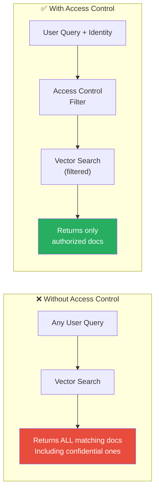

# 9.17.5 Access Control Patterns

## Introduction

In most RAG systems, different users should see different documents. An HR manager can access employee records, but a marketing intern cannot. A doctor can see patient charts, but an office administrator cannot. A premium customer gets detailed product documentation, while a free-tier user gets only basic guides.

Access control in RAG determines which documents a user's query is allowed to retrieve. Without it, every user can find every document in the knowledge base — a massive data exposure risk. The challenge is enforcing these permissions _at retrieval time_ without destroying search performance.

This lesson covers user-level permissions, role-based access control (RBAC), metadata-based filtering, query-time permission checks, and multi-tenant isolation.

## Prerequisites

- RAG pipeline fundamentals (Lessons 9.1–9.5)
- PII handling and sensitivity classification (Lesson 9.17.3)
- Basic understanding of authentication and authorization concepts

---

## Why Standard Vector Search Isn't Enough

Vector databases like Pinecone, Weaviate, and Qdrant retrieve documents by semantic similarity alone — they don't natively enforce "User A can see this document but User B cannot." You must add an access control layer:



### Access Control Strategies

| Strategy | How It Works | Performance | Complexity |
|----------|-------------|-------------|------------|
| **Pre-filter** | Add permissions to metadata, filter before search | Fast (vector DB handles it) | Low |
| **Post-filter** | Search everything, filter results after | Slow (wastes retrieval) | Low |
| **Separate indexes** | One vector index per tenant/role | Fast (no filtering needed) | High |
| **Hybrid** | Pre-filter for broad permissions, post-filter for fine-grained | Balanced | Medium |

---

## Role-Based Access Control (RBAC)

RBAC assigns permissions based on roles, not individual users. This scales better — you manage 10 roles instead of 10,000 users:

```python
from dataclasses import dataclass, field
from enum import Enum
from typing import Optional


class Permission(Enum):
    """Granular permissions for document access."""
    READ = "read"
    READ_CONFIDENTIAL = "read_confidential"
    READ_RESTRICTED = "read_restricted"
    READ_REGULATED = "read_regulated"
    WRITE = "write"
    ADMIN = "admin"


@dataclass
class Role:
    """A role with a set of permissions."""
    name: str
    permissions: set[Permission]
    description: str
    max_sensitivity: str = "internal"  # Maximum document sensitivity this role can access


# Define organizational roles
ROLES = {
    "public_user": Role(
        name="public_user",
        permissions={Permission.READ},
        description="External users with access to public documents only",
        max_sensitivity="public",
    ),
    "employee": Role(
        name="employee",
        permissions={Permission.READ},
        description="Internal employees with access to internal documents",
        max_sensitivity="internal",
    ),
    "manager": Role(
        name="manager",
        permissions={Permission.READ, Permission.READ_CONFIDENTIAL},
        description="Managers with access to confidential documents",
        max_sensitivity="confidential",
    ),
    "hr_staff": Role(
        name="hr_staff",
        permissions={
            Permission.READ, Permission.READ_CONFIDENTIAL,
            Permission.READ_RESTRICTED,
        },
        description="HR staff with access to employee records",
        max_sensitivity="restricted",
    ),
    "compliance_officer": Role(
        name="compliance_officer",
        permissions={
            Permission.READ, Permission.READ_CONFIDENTIAL,
            Permission.READ_RESTRICTED, Permission.READ_REGULATED,
        },
        description="Compliance with access to regulated content",
        max_sensitivity="regulated",
    ),
    "admin": Role(
        name="admin",
        permissions={
            Permission.READ, Permission.READ_CONFIDENTIAL,
            Permission.READ_RESTRICTED, Permission.READ_REGULATED,
            Permission.WRITE, Permission.ADMIN,
        },
        description="Full access to all documents",
        max_sensitivity="regulated",
    ),
}


@dataclass
class User:
    """A user with assigned roles and optional extra permissions."""
    user_id: str
    username: str
    roles: list[str]
    department: str
    extra_permissions: set[Permission] = field(default_factory=set)
    # Specific document IDs this user is explicitly granted/denied
    granted_documents: set[str] = field(default_factory=set)
    denied_documents: set[str] = field(default_factory=set)


class RBACManager:
    """Manage role-based access control for RAG retrieval.

    Access is determined by:
    1. User's roles → role permissions
    2. Document's sensitivity level → required permissions
    3. Document's explicit access list (if any)
    4. User's explicit grants/denials (override roles)

    The most restrictive rule wins — if any rule denies access,
    the document is excluded from retrieval.
    """

    # Map sensitivity levels to required permissions
    SENSITIVITY_PERMISSIONS = {
        "public": Permission.READ,
        "internal": Permission.READ,
        "confidential": Permission.READ_CONFIDENTIAL,
        "restricted": Permission.READ_RESTRICTED,
        "regulated": Permission.READ_REGULATED,
    }

    def __init__(self, roles: dict[str, Role] | None = None):
        self.roles = roles or ROLES

    def get_user_permissions(self, user: User) -> set[Permission]:
        """Get the combined permissions for a user across all roles."""
        permissions = set(user.extra_permissions)
        for role_name in user.roles:
            role = self.roles.get(role_name)
            if role:
                permissions.update(role.permissions)
        return permissions

    def get_max_sensitivity(self, user: User) -> str:
        """Get the maximum sensitivity level a user can access."""
        sensitivity_order = [
            "public", "internal", "confidential", "restricted", "regulated",
        ]
        max_level = "public"

        for role_name in user.roles:
            role = self.roles.get(role_name)
            if role:
                role_level = role.max_sensitivity
                if sensitivity_order.index(role_level) > sensitivity_order.index(max_level):
                    max_level = role_level

        return max_level

    def can_access_document(
        self,
        user: User,
        document_metadata: dict,
    ) -> tuple[bool, str]:
        """Check if a user can access a specific document.

        Returns:
            (allowed, reason)
        """
        doc_id = document_metadata.get("document_id", "")

        # 1. Check explicit denials (highest priority)
        if doc_id in user.denied_documents:
            return False, f"User explicitly denied access to {doc_id}"

        # 2. Check explicit grants (overrides role-based checks)
        if doc_id in user.granted_documents:
            return True, f"User explicitly granted access to {doc_id}"

        # 3. Check document access list
        doc_allowed_roles = document_metadata.get("allowed_roles", [])
        if doc_allowed_roles:
            if not any(role in doc_allowed_roles for role in user.roles):
                return False, (
                    f"User roles {user.roles} not in document's "
                    f"allowed roles {doc_allowed_roles}"
                )

        # 4. Check sensitivity level
        doc_sensitivity = document_metadata.get("sensitivity", "internal")
        required_perm = self.SENSITIVITY_PERMISSIONS.get(
            doc_sensitivity, Permission.READ,
        )
        user_perms = self.get_user_permissions(user)

        if required_perm not in user_perms:
            return False, (
                f"User lacks {required_perm.value} permission "
                f"required for {doc_sensitivity} documents"
            )

        # 5. Check department restrictions
        doc_departments = document_metadata.get("restricted_to_departments", [])
        if doc_departments and user.department not in doc_departments:
            return False, (
                f"User department '{user.department}' not in "
                f"allowed departments {doc_departments}"
            )

        return True, "Access granted"
```

---

## Metadata-Based Retrieval Filtering

The most performant approach: store access control metadata alongside document embeddings and filter at the vector database level:

```python
from dataclasses import dataclass, field
from typing import Any


@dataclass
class DocumentACL:
    """Access Control List for a document chunk.

    This metadata is stored alongside the embedding in the
    vector database. At query time, the vector DB filters
    by these fields BEFORE computing similarity scores.

    This is efficient because the vector DB handles filtering
    natively — no post-processing needed.
    """
    sensitivity_level: str
    allowed_roles: list[str]
    allowed_departments: list[str]
    allowed_users: list[str]
    tenant_id: str
    owner_id: str
    expiry_date: str | None = None  # ISO format, for time-limited access


class MetadataFilterBuilder:
    """Build vector database metadata filters for access control.

    Different vector databases have different filter syntax.
    This builder generates the appropriate filter for each DB.

    Supported databases:
    - Pinecone
    - Weaviate
    - Qdrant
    - ChromaDB
    """

    def __init__(self, user: User, rbac: RBACManager):
        self.user = user
        self.rbac = rbac

    def build_pinecone_filter(self) -> dict:
        """Build a Pinecone metadata filter.

        Pinecone uses a dict-based filter syntax with
        $in, $eq, $gte, etc. operators.
        """
        max_sensitivity = self.rbac.get_max_sensitivity(self.user)
        allowed_levels = self._get_allowed_sensitivity_levels(max_sensitivity)

        return {
            "$and": [
                # Sensitivity level must be accessible
                {"sensitivity_level": {"$in": allowed_levels}},
                # Must match at least one of these OR conditions
                {"$or": [
                    # User's roles match document's allowed roles
                    {"allowed_roles": {"$in": self.user.roles}},
                    # User is explicitly allowed
                    {"allowed_users": {"$in": [self.user.user_id]}},
                    # Document has no role restrictions
                    {"allowed_roles": {"$eq": []}},
                ]},
            ],
        }

    def build_qdrant_filter(self) -> dict:
        """Build a Qdrant filter.

        Qdrant uses a nested must/should/must_not structure.
        """
        max_sensitivity = self.rbac.get_max_sensitivity(self.user)
        allowed_levels = self._get_allowed_sensitivity_levels(max_sensitivity)

        return {
            "must": [
                {
                    "key": "sensitivity_level",
                    "match": {"any": allowed_levels},
                },
            ],
            "should": [
                {
                    "key": "allowed_roles",
                    "match": {"any": self.user.roles},
                },
                {
                    "key": "allowed_users",
                    "match": {"value": self.user.user_id},
                },
            ],
        }

    def build_chroma_filter(self) -> dict:
        """Build a ChromaDB where filter.

        ChromaDB uses a simpler filter syntax with
        $in, $eq, $and, $or operators.
        """
        max_sensitivity = self.rbac.get_max_sensitivity(self.user)
        allowed_levels = self._get_allowed_sensitivity_levels(max_sensitivity)

        return {
            "$and": [
                {"sensitivity_level": {"$in": allowed_levels}},
                {"$or": [
                    {"allowed_roles": {"$in": self.user.roles}},
                    {"allowed_users": {"$eq": self.user.user_id}},
                ]},
            ],
        }

    def _get_allowed_sensitivity_levels(self, max_level: str) -> list[str]:
        """Get all sensitivity levels up to and including max_level."""
        all_levels = [
            "public", "internal", "confidential", "restricted", "regulated",
        ]
        max_idx = all_levels.index(max_level)
        return all_levels[: max_idx + 1]
```

---

## Query-Time Permission Checks

Even with metadata filtering, add a runtime permission check on retrieved results as a defense-in-depth measure:

```python
from dataclasses import dataclass, field
from datetime import datetime


@dataclass
class AccessControlledChunk:
    """A retrieved chunk with access control applied."""
    content: str
    source: str
    similarity_score: float
    access_granted: bool
    denial_reason: str | None = None


class QueryTimeAccessController:
    """Enforce access control on retrieved chunks at query time.

    This is the post-filter defense layer. Even if metadata
    filtering is in place at the vector DB level, this controller
    double-checks every retrieved chunk before it enters the
    LLM context.

    Why both pre-filter AND post-filter?
    - Pre-filter (metadata): Performance — reduces search space
    - Post-filter (this): Safety — catches anything that slipped
      through misconfigured metadata or filter bugs
    """

    def __init__(self, rbac: RBACManager, audit_logger=None):
        self.rbac = rbac
        self.audit_logger = audit_logger

    def filter_chunks(
        self,
        user: User,
        chunks: list[dict],
        query_id: str = "",
    ) -> list[AccessControlledChunk]:
        """Apply access control to retrieved chunks.

        Args:
            user: The user making the query.
            chunks: Retrieved chunks with metadata.
            query_id: ID for audit logging.

        Returns:
            List of chunks with access decisions applied.
            Denied chunks are included (for logging) but
            marked as not granted.
        """
        results = []

        for chunk in chunks:
            metadata = chunk.get("metadata", {})
            allowed, reason = self.rbac.can_access_document(user, metadata)

            # Check time-based access expiry
            expiry = metadata.get("expiry_date")
            if expiry and allowed:
                try:
                    expiry_dt = datetime.fromisoformat(expiry)
                    if datetime.now() > expiry_dt:
                        allowed = False
                        reason = f"Access expired on {expiry}"
                except ValueError:
                    pass

            # Log access decisions
            if self.audit_logger and not allowed:
                self.audit_logger.log_access_denied(
                    user_id=user.user_id,
                    query_id=query_id,
                    document_id=metadata.get("document_id", "unknown"),
                    reason=reason,
                )

            results.append(AccessControlledChunk(
                content=chunk.get("content", "") if allowed else "",
                source=chunk.get("source", "unknown"),
                similarity_score=chunk.get("similarity_score", 0.0),
                access_granted=allowed,
                denial_reason=None if allowed else reason,
            ))

        return results

    def get_authorized_chunks(
        self,
        user: User,
        chunks: list[dict],
        query_id: str = "",
    ) -> list[dict]:
        """Convenience method — return only authorized chunks.

        Use this when you just need the filtered list and don't
        care about denial reasons.
        """
        controlled = self.filter_chunks(user, chunks, query_id)
        return [
            {
                "content": c.content,
                "source": c.source,
                "similarity_score": c.similarity_score,
            }
            for c in controlled
            if c.access_granted
        ]
```

---

## Multi-Tenant Isolation

When multiple organizations share the same RAG infrastructure, their data must be completely isolated:

```python
from dataclasses import dataclass


@dataclass
class Tenant:
    """A tenant in a multi-tenant RAG system."""
    tenant_id: str
    tenant_name: str
    isolation_level: str  # "strict" or "shared"
    # Strict: separate collection/namespace per tenant
    # Shared: same collection, filtered by tenant_id metadata


class MultiTenantRetriever:
    """Enforce tenant isolation in RAG retrieval.

    Multi-tenancy approaches:

    1. Collection-per-tenant (strictest):
       - Each tenant gets their own vector collection
       - No risk of cross-tenant data leakage
       - Higher infrastructure cost
       - Best for regulated industries (healthcare, finance)

    2. Namespace-per-tenant (balanced):
       - Shared collection with tenant namespaces (Pinecone)
       - Good isolation with lower cost
       - Supported by some vector DBs natively

    3. Metadata-filtered (cheapest):
       - Single collection, filter by tenant_id in metadata
       - Lowest cost but highest risk if filters fail
       - Requires rigorous testing of filter logic

    Recommendation: Use collection-per-tenant for regulated
    data, metadata-filtered for low-risk internal tools.
    """

    def __init__(self, isolation_level: str = "strict"):
        self.isolation_level = isolation_level

    def get_collection_name(self, tenant: Tenant) -> str:
        """Get the vector collection name for a tenant.

        For strict isolation, each tenant has a separate collection.
        For shared isolation, all tenants use the same collection.
        """
        if self.isolation_level == "strict":
            return f"tenant_{tenant.tenant_id}_documents"
        return "shared_documents"

    def build_tenant_filter(self, tenant: Tenant) -> dict:
        """Build a metadata filter that enforces tenant isolation.

        This filter MUST be applied to every query when using
        shared collections. Missing this filter = cross-tenant
        data leakage.
        """
        if self.isolation_level == "strict":
            # Collection-level isolation, no filter needed
            return {}

        # Metadata-based isolation
        return {
            "tenant_id": {"$eq": tenant.tenant_id},
        }

    def validate_chunk_tenant(
        self,
        chunk: dict,
        expected_tenant_id: str,
    ) -> bool:
        """Post-retrieval validation that a chunk belongs to the tenant.

        Defense-in-depth: even with metadata filtering, verify
        every retrieved chunk belongs to the correct tenant.
        """
        chunk_tenant = chunk.get("metadata", {}).get("tenant_id")
        if chunk_tenant != expected_tenant_id:
            # CRITICAL: Cross-tenant data leakage detected
            # Log this as a security incident
            print(
                f"SECURITY ALERT: Cross-tenant leakage detected! "
                f"Expected tenant {expected_tenant_id}, "
                f"got {chunk_tenant}"
            )
            return False
        return True

    def prepare_document_for_indexing(
        self,
        tenant: Tenant,
        document: dict,
    ) -> dict:
        """Add tenant isolation metadata before indexing.

        Every document MUST have tenant_id in its metadata.
        This is enforced at ingestion time.
        """
        metadata = document.get("metadata", {})
        metadata["tenant_id"] = tenant.tenant_id
        metadata["tenant_name"] = tenant.tenant_name

        document["metadata"] = metadata
        return document
```

---

## Full Access-Controlled RAG Pipeline

Putting all access control patterns together:

```python
from dataclasses import dataclass


@dataclass
class SecureRetrievalResult:
    """Result of a secure, access-controlled retrieval."""
    authorized_chunks: list[dict]
    denied_count: int
    total_retrieved: int
    user_max_sensitivity: str
    warnings: list[str]


class SecureRAGRetriever:
    """RAG retriever with full access control.

    Combines all access control layers:
    1. Tenant isolation (who owns the data)
    2. Pre-filter (metadata-based, handled by vector DB)
    3. Post-filter (runtime permission check)
    4. Audit logging (compliance trail)
    """

    def __init__(
        self,
        rbac: RBACManager,
        tenant_retriever: MultiTenantRetriever,
        access_controller: QueryTimeAccessController,
    ):
        self.rbac = rbac
        self.tenant_retriever = tenant_retriever
        self.access_controller = access_controller

    def retrieve(
        self,
        user: User,
        tenant: Tenant,
        query: str,
        top_k: int = 10,
    ) -> SecureRetrievalResult:
        """Perform access-controlled retrieval.

        Steps:
        1. Build tenant + permission metadata filters
        2. Query vector DB with combined filters
        3. Post-filter results with runtime permission check
        4. Return only authorized chunks
        """
        warnings = []

        # Step 1: Build metadata filters
        tenant_filter = self.tenant_retriever.build_tenant_filter(tenant)

        filter_builder = MetadataFilterBuilder(user, self.rbac)
        access_filter = filter_builder.build_pinecone_filter()

        # Combine tenant and access filters
        combined_filter = {
            "$and": [
                tenant_filter,
                access_filter,
            ],
        } if tenant_filter else access_filter

        # Step 2: Query vector DB (simulated here)
        # In production: vector_db.query(query, filter=combined_filter, top_k=top_k)
        raw_results = self._simulated_vector_search(
            query, combined_filter, top_k,
        )

        # Step 3: Post-filter with runtime checks
        authorized = self.access_controller.get_authorized_chunks(
            user=user,
            chunks=raw_results,
            query_id=f"q_{user.user_id}_{hash(query)}",
        )

        # Step 4: Validate tenant isolation
        for chunk in authorized:
            if not self.tenant_retriever.validate_chunk_tenant(
                chunk, tenant.tenant_id,
            ):
                warnings.append("Cross-tenant data detected and removed")
                authorized.remove(chunk)

        denied_count = len(raw_results) - len(authorized)
        if denied_count > 0:
            warnings.append(
                f"{denied_count} chunks filtered by access control"
            )

        return SecureRetrievalResult(
            authorized_chunks=authorized,
            denied_count=denied_count,
            total_retrieved=len(raw_results),
            user_max_sensitivity=self.rbac.get_max_sensitivity(user),
            warnings=warnings,
        )

    def _simulated_vector_search(
        self,
        query: str,
        metadata_filter: dict,
        top_k: int,
    ) -> list[dict]:
        """Simulated vector search — replace with actual DB call."""
        # In production:
        # return pinecone_index.query(
        #     vector=embed(query),
        #     filter=metadata_filter,
        #     top_k=top_k,
        #     include_metadata=True,
        # )
        return []
```

---

## Summary

| Pattern | What It Controls | Where Applied |
|---------|-----------------|---------------|
| **RBAC** | Who can access what, based on roles | Permission evaluation |
| **Metadata filtering** | Vector DB pre-filters by ACL metadata | At query time (vector DB level) |
| **Query-time checks** | Runtime verification of every result | Post-retrieval, pre-generation |
| **Multi-tenant isolation** | Complete data separation between orgs | At ingestion + retrieval |
| **Audit logging** | Record of every access decision | Every retrieval event |

### Key Takeaways

1. **Pre-filter at the vector DB level** — store permissions in metadata and let the vector DB filter before computing similarity, not after
2. **Post-filter as defense-in-depth** — runtime permission checks on retrieved results catch anything that slipped through metadata filters
3. **RBAC scales better than per-user permissions** — manage 10 roles instead of 10,000 individual user access lists
4. **Multi-tenant isolation is non-negotiable for regulated data** — use separate collections for strict isolation, metadata filtering only for low-risk data
5. **Audit everything** — log every access decision (grants AND denials) for compliance reporting

## Practice Exercises

1. **Implement an RBAC system** with roles, permissions, and sensitivity-level checks that determines whether a user can access a specific document
2. **Build metadata filters** for Pinecone, Qdrant, or ChromaDB that enforce role-based access control at the vector database level
3. **Create a query-time access controller** that double-checks retrieved results and logs denied access attempts
4. **Design multi-tenant isolation** for a SaaS RAG platform with both strict (separate collections) and shared (metadata-filtered) modes

---

← [Previous: Output Validation](./04-output-validation.md) | [Next: Guardrails Implementation →](./06-guardrails-implementation.md)
