# 9.17.6 Guardrails Implementation

## Introduction

The previous five lessons built individual defense components — injection detection, poisoning prevention, PII redaction, output validation, and access control. This lesson ties them all together into a complete guardrails system that wraps every stage of the RAG pipeline.

A guardrails system is middleware that intercepts, validates, and controls the flow of data through your RAG application. It runs automatically on every request — the developer doesn't need to remember to call security functions manually. If any check fails, the guardrail decides whether to block, modify, or flag the request.

This lesson covers full pipeline integration, rate limiting, abuse prevention, monitoring and alerting, and practical implementation patterns.

## Prerequisites

- Prompt injection (Lesson 9.17.1)
- Context poisoning (Lesson 9.17.2)
- PII handling (Lesson 9.17.3)
- Output validation (Lesson 9.17.4)
- Access control (Lesson 9.17.5)

---

## Guardrails Architecture

```mermaid
flowchart TB
    User["👤 User Request"] --> RateLimit["🚦 Rate Limiter"]
    RateLimit -->|"Allowed"| InputGuard["🛡️ Input Guardrail"]
    RateLimit -->|"Blocked"| Deny["🚫 429 Too Many Requests"]

    InputGuard -->|"Safe"| Retrieval["🔍 Retrieval"]
    InputGuard -->|"Blocked"| Deny2["🚫 Blocked: Injection Detected"]

    Retrieval --> AccessControl["🔐 Access Control Filter"]
    AccessControl --> RetrievalGuard["🛡️ Retrieval Guardrail"]

    RetrievalGuard -->|"Clean"| LLM["🤖 LLM Generation"]
    RetrievalGuard -->|"PII Redacted"| LLM

    LLM --> OutputGuard["🛡️ Output Guardrail"]
    OutputGuard -->|"Pass"| Response["✅ Response to User"]
    OutputGuard -->|"Modified"| Response
    OutputGuard -->|"Blocked"| Deny3["🚫 Unsafe Response Blocked"]

    subgraph Monitoring["📊 Monitoring & Alerting"]
        Log["Audit Log"]
        Metrics["Metrics"]
        Alerts["Alerts"]
    end

    InputGuard -.-> Log
    RetrievalGuard -.-> Log
    OutputGuard -.-> Log
    RateLimit -.-> Metrics
    InputGuard -.-> Metrics
    OutputGuard -.-> Alerts

    style RateLimit fill:#3498db,color:#fff
    style InputGuard fill:#2ecc71,color:#fff
    style AccessControl fill:#9b59b6,color:#fff
    style RetrievalGuard fill:#2ecc71,color:#fff
    style OutputGuard fill:#2ecc71,color:#fff
```



---

## Rate Limiting and Abuse Prevention

Before any security check, rate limiting prevents resource exhaustion and brute-force attacks:

```python
import time
from dataclasses import dataclass, field
from collections import defaultdict
from enum import Enum


class RateLimitResult(Enum):
    """Result of a rate limit check."""
    ALLOWED = "allowed"
    THROTTLED = "throttled"     # Slowed down but not blocked
    BLOCKED = "blocked"         # Request denied


@dataclass
class RateLimitConfig:
    """Configuration for rate limiting."""
    requests_per_minute: int = 20
    requests_per_hour: int = 200
    tokens_per_minute: int = 50000
    max_query_length: int = 2000
    burst_limit: int = 5       # Max requests in 10 seconds
    # Stricter limits for users who have been flagged
    flagged_requests_per_minute: int = 5
    flagged_requests_per_hour: int = 20


@dataclass
class UserRequestLog:
    """Track a user's request history for rate limiting."""
    timestamps: list[float] = field(default_factory=list)
    total_tokens: int = 0
    violation_count: int = 0
    is_flagged: bool = False


class RateLimiter:
    """Rate limiter for RAG API requests.

    Prevents:
    - Denial of service (flooding with requests)
    - Cost abuse (consuming expensive LLM tokens)
    - Brute-force injection attempts (rapid-fire queries)
    - Data scraping (systematic querying to extract KB content)

    Uses a sliding window algorithm for smooth rate limiting
    (no thundering herd at window boundaries).
    """

    def __init__(self, config: RateLimitConfig | None = None):
        self.config = config or RateLimitConfig()
        self._user_logs: dict[str, UserRequestLog] = defaultdict(UserRequestLog)

    def check(self, user_id: str, query_length: int = 0) -> RateLimitResult:
        """Check if a request is allowed."""
        now = time.time()
        log = self._user_logs[user_id]

        # Select limits based on flagged status
        rpm = (
            self.config.flagged_requests_per_minute
            if log.is_flagged
            else self.config.requests_per_minute
        )
        rph = (
            self.config.flagged_requests_per_hour
            if log.is_flagged
            else self.config.requests_per_hour
        )

        # Clean old timestamps
        log.timestamps = [
            ts for ts in log.timestamps if now - ts < 3600
        ]

        # Check burst limit (10-second window)
        recent_burst = sum(
            1 for ts in log.timestamps if now - ts < 10
        )
        if recent_burst >= self.config.burst_limit:
            log.violation_count += 1
            return RateLimitResult.BLOCKED

        # Check per-minute limit
        recent_minute = sum(
            1 for ts in log.timestamps if now - ts < 60
        )
        if recent_minute >= rpm:
            log.violation_count += 1
            return RateLimitResult.THROTTLED

        # Check per-hour limit
        if len(log.timestamps) >= rph:
            log.violation_count += 1
            return RateLimitResult.BLOCKED

        # Check query length
        if query_length > self.config.max_query_length:
            return RateLimitResult.BLOCKED

        # Allow and record
        log.timestamps.append(now)

        # Auto-flag users with too many violations
        if log.violation_count >= 10 and not log.is_flagged:
            log.is_flagged = True

        return RateLimitResult.ALLOWED

    def get_user_status(self, user_id: str) -> dict:
        """Get rate limit status for a user."""
        now = time.time()
        log = self._user_logs[user_id]
        recent_minute = sum(
            1 for ts in log.timestamps if now - ts < 60
        )
        recent_hour = len(
            [ts for ts in log.timestamps if now - ts < 3600]
        )

        rpm_limit = (
            self.config.flagged_requests_per_minute
            if log.is_flagged
            else self.config.requests_per_minute
        )
        rph_limit = (
            self.config.flagged_requests_per_hour
            if log.is_flagged
            else self.config.requests_per_hour
        )

        return {
            "requests_this_minute": recent_minute,
            "requests_this_hour": recent_hour,
            "rpm_limit": rpm_limit,
            "rph_limit": rph_limit,
            "is_flagged": log.is_flagged,
            "violation_count": log.violation_count,
        }
```

---

## Input Guardrail

The first guardrail layer — validates user input before any processing:

```python
from dataclasses import dataclass
from enum import Enum


class GuardrailDecision(Enum):
    """Decision from a guardrail check."""
    PASS = "pass"
    MODIFY = "modify"
    BLOCK = "block"
    FLAG = "flag"  # Allow but alert


@dataclass
class GuardrailResult:
    """Result of a guardrail check."""
    decision: GuardrailDecision
    original_input: str
    processed_input: str
    reasons: list[str]
    metadata: dict


class InputGuardrail:
    """Guardrail for user input validation.

    Checks performed:
    1. Injection pattern detection
    2. Query length validation
    3. Language/encoding validation
    4. Topic scope checking (is the query relevant?)
    5. Repeated query detection (data scraping)

    This guardrail sits between the API endpoint and the
    retrieval step. If the input fails, retrieval never happens.
    """

    def __init__(
        self,
        sanitizer: "InputSanitizer",  # From Lesson 9.17.1
        max_query_length: int = 2000,
        allowed_topics: list[str] | None = None,
    ):
        self.sanitizer = sanitizer
        self.max_query_length = max_query_length
        self.allowed_topics = allowed_topics
        self._recent_queries: dict[str, list[str]] = {}

    def check(
        self,
        user_id: str,
        query: str,
    ) -> GuardrailResult:
        """Run input through all guardrail checks."""
        reasons = []
        decision = GuardrailDecision.PASS
        processed = query

        # 1. Length check
        if len(query) > self.max_query_length:
            processed = query[:self.max_query_length]
            reasons.append(f"Query truncated from {len(query)} to {self.max_query_length} chars")
            decision = GuardrailDecision.MODIFY

        # 2. Injection scan
        scan_result = self.sanitizer.scan(processed)
        if scan_result.blocked:
            return GuardrailResult(
                decision=GuardrailDecision.BLOCK,
                original_input=query,
                processed_input="",
                reasons=[f"Injection detected: {', '.join(scan_result.triggers)}"],
                metadata={"risk_level": scan_result.risk_level.value},
            )
        if scan_result.risk_level.value in ("medium", "high"):
            processed = scan_result.sanitized_query
            reasons.append(f"Input sanitized (risk: {scan_result.risk_level.value})")
            decision = GuardrailDecision.FLAG

        # 3. Repeated query detection (anti-scraping)
        if user_id not in self._recent_queries:
            self._recent_queries[user_id] = []
        user_queries = self._recent_queries[user_id]

        # Check for systematic querying patterns
        if len(user_queries) >= 5:
            # Simple check: if last 5 queries are very similar
            similar_count = sum(
                1 for prev in user_queries[-5:]
                if self._similarity(prev, query) > 0.8
            )
            if similar_count >= 3:
                reasons.append("Repeated similar queries detected — possible data scraping")
                decision = GuardrailDecision.FLAG

        user_queries.append(query)
        if len(user_queries) > 50:
            self._recent_queries[user_id] = user_queries[-50:]

        return GuardrailResult(
            decision=decision,
            original_input=query,
            processed_input=processed,
            reasons=reasons,
            metadata={"risk_level": getattr(scan_result, "risk_level", "none")},
        )

    @staticmethod
    def _similarity(a: str, b: str) -> float:
        """Simple Jaccard similarity between two strings."""
        words_a = set(a.lower().split())
        words_b = set(b.lower().split())
        if not words_a or not words_b:
            return 0.0
        intersection = len(words_a & words_b)
        union = len(words_a | words_b)
        return intersection / union if union > 0 else 0.0
```

---

## Retrieval Guardrail

Applied to retrieved chunks before they enter the LLM context:

```python
@dataclass
class RetrievalGuardrailResult:
    """Result of retrieval guardrail processing."""
    safe_chunks: list[dict]
    blocked_count: int
    redacted_count: int
    total_processed: int
    warnings: list[str]


class RetrievalGuardrail:
    """Guardrail for retrieved content before LLM generation.

    Checks performed on each retrieved chunk:
    1. Content scanning (injection in documents)
    2. PII detection and redaction
    3. Access control verification
    4. Content integrity verification

    This guardrail ensures the LLM only receives clean,
    authorized, PII-free content.
    """

    def __init__(
        self,
        content_scanner: "DocumentContentScanner",  # From Lesson 9.17.1
        pii_detector: "PIIDetector",  # From Lesson 9.17.3
        pii_redactor: "PIIRedactor",
        access_controller: "QueryTimeAccessController",  # From Lesson 9.17.5
    ):
        self.content_scanner = content_scanner
        self.pii_detector = pii_detector
        self.pii_redactor = pii_redactor
        self.access_controller = access_controller

    def process(
        self,
        user: "User",
        chunks: list[dict],
        query_id: str = "",
    ) -> RetrievalGuardrailResult:
        """Process retrieved chunks through all guardrails."""
        safe_chunks = []
        blocked = 0
        redacted = 0
        warnings = []

        for chunk in chunks:
            content = chunk.get("content", "")
            source = chunk.get("source", "unknown")

            # 1. Access control check
            metadata = chunk.get("metadata", {})
            from typing import TYPE_CHECKING
            # Simplified access check
            allowed = True  # In practice: self.access_controller.can_access(user, metadata)

            if not allowed:
                blocked += 1
                continue

            # 2. Content scanning (injection in documents)
            scan = self.content_scanner.scan_document(content, source)
            if not scan.is_safe:
                if scan.risk_score > 0.7:
                    blocked += 1
                    warnings.append(f"Blocked chunk from {source}: injection detected")
                    continue
                # Use cleaned content for lower-risk detections
                content = scan.cleaned_content or content
                warnings.append(f"Cleaned chunk from {source}: suspicious content removed")

            # 3. PII detection and redaction
            pii_result = self.pii_detector.scan(content)
            if pii_result.contains_pii:
                content = self.pii_redactor.redact(content, pii_result)
                redacted += 1

            safe_chunks.append({
                "content": content,
                "source": source,
                "similarity_score": chunk.get("similarity_score", 0.0),
                "metadata": metadata,
            })

        return RetrievalGuardrailResult(
            safe_chunks=safe_chunks,
            blocked_count=blocked,
            redacted_count=redacted,
            total_processed=len(chunks),
            warnings=warnings,
        )
```

---

## Output Guardrail

Final checks on LLM-generated responses:

```python
@dataclass
class OutputGuardrailResult:
    """Result of output guardrail processing."""
    decision: GuardrailDecision
    original_response: str
    final_response: str
    checks: dict[str, bool]
    warnings: list[str]


class OutputGuardrail:
    """Guardrail for LLM output before delivery to user.

    Checks performed:
    1. PII leakage detection
    2. Harmful content filtering
    3. Citation verification
    4. Factual grounding assessment
    5. Confidence thresholds

    This is the last line of defense. If something passes
    here, the user sees it.
    """

    def __init__(
        self,
        output_validator: "OutputValidator",  # From Lesson 9.17.4
    ):
        self.output_validator = output_validator

    def check(
        self,
        response: str,
        source_chunks: list[dict],
        retrieval_scores: list[float],
    ) -> OutputGuardrailResult:
        """Run output through all guardrail checks."""
        result = self.output_validator.validate(
            response=response,
            source_chunks=source_chunks,
            retrieval_scores=retrieval_scores,
        )

        # Map OutputDecision to GuardrailDecision
        decision_map = {
            "pass": GuardrailDecision.PASS,
            "pass_with_disclaimer": GuardrailDecision.MODIFY,
            "modify": GuardrailDecision.MODIFY,
            "regenerate": GuardrailDecision.BLOCK,
            "block": GuardrailDecision.BLOCK,
        }

        decision = decision_map.get(
            result.decision.value, GuardrailDecision.BLOCK,
        )

        checks = {
            check_name: True for check_name in result.checks_passed
        }
        for check_name in result.checks_failed:
            checks[check_name] = False

        return OutputGuardrailResult(
            decision=decision,
            original_response=response,
            final_response=result.final_response,
            checks=checks,
            warnings=result.warnings,
        )
```

---

## Complete Guardrails Pipeline

All guardrails orchestrated into a single pipeline:

```python
import uuid
import time
from dataclasses import dataclass, field


@dataclass
class PipelineResult:
    """Complete result of a guardrailed RAG request."""
    request_id: str
    user_id: str
    query: str
    response: str
    success: bool
    blocked: bool
    block_reason: str | None
    processing_time_ms: float
    guardrail_events: list[dict] = field(default_factory=list)


class GuardrailedRAGPipeline:
    """Complete RAG pipeline with guardrails at every stage.

    This is the main entry point for all RAG queries. It
    orchestrates:

    1. Rate limiting
    2. Input guardrail
    3. Retrieval (with access control)
    4. Retrieval guardrail
    5. LLM generation
    6. Output guardrail
    7. Response delivery

    Every stage is logged and monitored. Any stage can
    block the request.

    Usage:
        pipeline = GuardrailedRAGPipeline(
            rate_limiter=RateLimiter(),
            input_guardrail=InputGuardrail(sanitizer),
            retrieval_guardrail=RetrievalGuardrail(...),
            output_guardrail=OutputGuardrail(validator),
        )

        result = pipeline.process(
            user_id="user_123",
            query="What is the refund policy?",
        )

        if result.success:
            return result.response
        else:
            return result.block_reason
    """

    def __init__(
        self,
        rate_limiter: RateLimiter,
        input_guardrail: InputGuardrail,
        retrieval_guardrail: RetrievalGuardrail,
        output_guardrail: OutputGuardrail,
    ):
        self.rate_limiter = rate_limiter
        self.input_guardrail = input_guardrail
        self.retrieval_guardrail = retrieval_guardrail
        self.output_guardrail = output_guardrail

    def process(
        self,
        user_id: str,
        query: str,
        user: "User | None" = None,
    ) -> PipelineResult:
        """Process a query through the full guardrailed pipeline."""
        request_id = str(uuid.uuid4())
        start_time = time.time()
        events = []

        # ── Stage 1: Rate Limiting ─────────────────────────
        rate_result = self.rate_limiter.check(user_id, len(query))
        events.append({
            "stage": "rate_limit",
            "result": rate_result.value,
        })

        if rate_result == RateLimitResult.BLOCKED:
            return self._blocked_result(
                request_id, user_id, query,
                "Rate limit exceeded. Please try again later.",
                start_time, events,
            )

        if rate_result == RateLimitResult.THROTTLED:
            time.sleep(2)  # Slow down throttled users

        # ── Stage 2: Input Guardrail ───────────────────────
        input_result = self.input_guardrail.check(user_id, query)
        events.append({
            "stage": "input_guardrail",
            "decision": input_result.decision.value,
            "reasons": input_result.reasons,
        })

        if input_result.decision == GuardrailDecision.BLOCK:
            return self._blocked_result(
                request_id, user_id, query,
                "Your query was blocked by our safety system. "
                "Please rephrase your question.",
                start_time, events,
            )

        safe_query = input_result.processed_input

        # ── Stage 3: Retrieval ─────────────────────────────
        # In production, call your vector DB here
        raw_chunks = self._retrieve(safe_query, user)
        events.append({
            "stage": "retrieval",
            "chunks_retrieved": len(raw_chunks),
        })

        # ── Stage 4: Retrieval Guardrail ───────────────────
        retrieval_result = self.retrieval_guardrail.process(
            user=user,
            chunks=raw_chunks,
            query_id=request_id,
        )
        events.append({
            "stage": "retrieval_guardrail",
            "safe_chunks": len(retrieval_result.safe_chunks),
            "blocked": retrieval_result.blocked_count,
            "redacted": retrieval_result.redacted_count,
        })

        if not retrieval_result.safe_chunks:
            return self._blocked_result(
                request_id, user_id, query,
                "I don't have sufficient information to answer "
                "this question. Please try a different query.",
                start_time, events,
            )

        # ── Stage 5: LLM Generation ───────────────────────
        llm_response = self._generate(safe_query, retrieval_result.safe_chunks)
        retrieval_scores = [
            c.get("similarity_score", 0.0)
            for c in retrieval_result.safe_chunks
        ]
        events.append({
            "stage": "generation",
            "response_length": len(llm_response),
        })

        # ── Stage 6: Output Guardrail ──────────────────────
        output_result = self.output_guardrail.check(
            response=llm_response,
            source_chunks=retrieval_result.safe_chunks,
            retrieval_scores=retrieval_scores,
        )
        events.append({
            "stage": "output_guardrail",
            "decision": output_result.decision.value,
            "checks": output_result.checks,
        })

        if output_result.decision == GuardrailDecision.BLOCK:
            return self._blocked_result(
                request_id, user_id, query,
                "I'm unable to provide a safe response to this "
                "question. Please rephrase or contact support.",
                start_time, events,
            )

        # ── Stage 7: Deliver Response ──────────────────────
        elapsed = (time.time() - start_time) * 1000

        return PipelineResult(
            request_id=request_id,
            user_id=user_id,
            query=query,
            response=output_result.final_response,
            success=True,
            blocked=False,
            block_reason=None,
            processing_time_ms=elapsed,
            guardrail_events=events,
        )

    def _blocked_result(
        self,
        request_id: str,
        user_id: str,
        query: str,
        reason: str,
        start_time: float,
        events: list[dict],
    ) -> PipelineResult:
        """Create a blocked pipeline result."""
        elapsed = (time.time() - start_time) * 1000
        return PipelineResult(
            request_id=request_id,
            user_id=user_id,
            query=query,
            response=reason,
            success=False,
            blocked=True,
            block_reason=reason,
            processing_time_ms=elapsed,
            guardrail_events=events,
        )

    def _retrieve(self, query: str, user=None) -> list[dict]:
        """Retrieve documents from vector store.

        Replace with actual vector DB call in production.
        """
        return []

    def _generate(self, query: str, chunks: list[dict]) -> str:
        """Generate response using LLM.

        Replace with actual LLM call in production.
        """
        return ""
```

---

## Monitoring and Alerting

Track guardrail performance and trigger alerts on anomalies:

```python
from dataclasses import dataclass, field
from collections import defaultdict
from datetime import datetime
from enum import Enum


class AlertSeverity(Enum):
    """Alert severity levels."""
    INFO = "info"
    WARNING = "warning"
    CRITICAL = "critical"


@dataclass
class SecurityAlert:
    """A security alert triggered by guardrail activity."""
    alert_id: str
    severity: AlertSeverity
    category: str
    message: str
    timestamp: str
    user_id: str | None = None
    metadata: dict = field(default_factory=dict)


class GuardrailMonitor:
    """Monitor guardrail activity and trigger alerts.

    Tracks:
    - Block rates (how often each guardrail blocks requests)
    - Injection attempt frequency
    - PII detection rates
    - Response times
    - User-level risk scores

    Alerts on:
    - Spike in injection attempts (potential attack)
    - High PII detection rate (data quality issue)
    - Elevated block rate (possible false positives)
    - Specific users with many violations
    """

    def __init__(
        self,
        block_rate_threshold: float = 0.1,   # Alert if >10% blocked
        injection_spike_threshold: int = 10,  # Alert if >10 in 5 min
    ):
        self.block_rate_threshold = block_rate_threshold
        self.injection_spike_threshold = injection_spike_threshold

        self._metrics: dict[str, list] = defaultdict(list)
        self._alerts: list[SecurityAlert] = []

    def record_event(self, pipeline_result: PipelineResult) -> None:
        """Record a pipeline result for monitoring."""
        now = datetime.utcnow().isoformat()

        for event in pipeline_result.guardrail_events:
            stage = event.get("stage", "unknown")
            self._metrics[stage].append({
                "timestamp": now,
                "result": event,
                "user_id": pipeline_result.user_id,
                "blocked": pipeline_result.blocked,
            })

        # Check for alert conditions
        self._check_alerts(pipeline_result)

    def _check_alerts(self, result: PipelineResult) -> None:
        """Check if any alert conditions are met."""
        import uuid

        # Alert: Injection detected
        for event in result.guardrail_events:
            if (
                event.get("stage") == "input_guardrail"
                and event.get("decision") == "block"
            ):
                self._alerts.append(SecurityAlert(
                    alert_id=str(uuid.uuid4()),
                    severity=AlertSeverity.WARNING,
                    category="injection_attempt",
                    message=(
                        f"Injection attempt blocked from user "
                        f"{result.user_id}: {event.get('reasons', [])}"
                    ),
                    timestamp=datetime.utcnow().isoformat(),
                    user_id=result.user_id,
                    metadata=event,
                ))

        # Alert: High block rate
        recent = self._metrics.get("input_guardrail", [])[-100:]
        if len(recent) >= 20:
            block_rate = sum(
                1 for m in recent if m.get("blocked")
            ) / len(recent)
            if block_rate > self.block_rate_threshold:
                self._alerts.append(SecurityAlert(
                    alert_id=str(uuid.uuid4()),
                    severity=AlertSeverity.CRITICAL,
                    category="high_block_rate",
                    message=(
                        f"Block rate {block_rate:.1%} exceeds "
                        f"threshold {self.block_rate_threshold:.1%}"
                    ),
                    timestamp=datetime.utcnow().isoformat(),
                ))

    def get_dashboard_metrics(self) -> dict:
        """Get metrics for a monitoring dashboard."""
        now = datetime.utcnow()

        total_requests = sum(len(v) for v in self._metrics.values()) // max(
            len(self._metrics), 1
        )

        # Approximate from available data
        blocks = sum(
            1
            for events in self._metrics.values()
            for e in events
            if e.get("blocked")
        )

        return {
            "total_requests": total_requests,
            "total_blocks": blocks,
            "block_rate": blocks / total_requests if total_requests > 0 else 0,
            "active_alerts": len([
                a for a in self._alerts
                if a.severity in (AlertSeverity.WARNING, AlertSeverity.CRITICAL)
            ]),
            "stages_monitored": list(self._metrics.keys()),
            "recent_alerts": [
                {
                    "severity": a.severity.value,
                    "category": a.category,
                    "message": a.message,
                    "timestamp": a.timestamp,
                }
                for a in self._alerts[-10:]
            ],
        }
```

---

## Configuration-Driven Guardrails

Make guardrail behavior configurable without code changes:

```python
from dataclasses import dataclass, field


@dataclass
class GuardrailConfig:
    """Complete guardrail configuration.

    This config drives all guardrail behavior. Store it in
    a config file (YAML, JSON) or environment variables so
    you can tune guardrails without deploying new code.

    Conservative defaults — start strict and relax as you
    gain confidence in your system's behavior.
    """

    # ── Rate Limiting ────────────────────────────────────
    rate_limit_enabled: bool = True
    requests_per_minute: int = 20
    requests_per_hour: int = 200
    burst_limit: int = 5

    # ── Input Guardrail ──────────────────────────────────
    input_guardrail_enabled: bool = True
    max_query_length: int = 2000
    block_on_injection: bool = True
    injection_risk_threshold: str = "medium"  # Block at this level or above

    # ── Retrieval Guardrail ──────────────────────────────
    retrieval_guardrail_enabled: bool = True
    scan_content_for_injection: bool = True
    redact_pii: bool = True
    block_critical_pii: bool = True

    # ── Output Guardrail ─────────────────────────────────
    output_guardrail_enabled: bool = True
    check_factual_grounding: bool = True
    check_harmful_content: bool = True
    check_citations: bool = True
    verify_pii_in_output: bool = True

    # ── Confidence ───────────────────────────────────────
    min_confidence_score: float = 0.5
    add_disclaimer_below: float = 0.7
    refuse_below: float = 0.3

    # ── Monitoring ───────────────────────────────────────
    monitoring_enabled: bool = True
    alert_on_block_rate: float = 0.1
    alert_on_injection_spike: int = 10
    log_all_requests: bool = True
    log_blocked_only: bool = False

    # ── Domain-Specific ──────────────────────────────────
    domain: str | None = None  # "medical", "financial", "legal", etc.
    custom_harm_patterns: list[str] = field(default_factory=list)
    custom_pii_patterns: dict = field(default_factory=dict)
```

---

## Summary

| Component | Purpose | Stage |
|-----------|---------|-------|
| **Rate Limiter** | Prevent abuse and resource exhaustion | Before everything |
| **Input Guardrail** | Block injection, validate input | Before retrieval |
| **Retrieval Guardrail** | Scan content, redact PII, check access | After retrieval, before generation |
| **Output Guardrail** | Validate grounding, filter harm, check PII | After generation, before delivery |
| **Monitor** | Track metrics, trigger alerts | Continuously |
| **Config** | Drive guardrail behavior without code changes | At initialization |

### Key Takeaways

1. **Guardrails are middleware, not manual checks** — they run automatically on every request so developers don't need to remember to call security functions
2. **Every pipeline stage gets its own guardrail** — input, retrieval, and output each have different threats and need different defenses
3. **Rate limiting is the first defense** — it prevents abuse before any expensive processing happens
4. **Configuration-driven guardrails** allow tuning security strictness without code deployments — start strict and relax as you gain confidence
5. **Monitoring and alerting turn guardrails into an active defense** — you need to know when attacks are happening, not just block them silently

## Practice Exercises

1. **Build a rate limiter** with sliding window, burst detection, and automatic flagging of abusive users
2. **Implement the full guardrailed pipeline** that chains input, retrieval, and output guardrails around a RAG query
3. **Create a monitoring dashboard** that tracks block rates, injection attempts, and PII detections across all guardrail stages
4. **Design a guardrail configuration** for a medical RAG system with strict PII handling, domain-specific harm filtering, and high confidence thresholds

---

← [Previous: Access Control Patterns](./05-access-control.md) | [Back to Overview →](./00-rag-security-guardrails.md)
