# 9.18 RAG Cost Optimization — Overview

## Introduction

A RAG system that works is not the same as a RAG system you can afford. Every query flows through a cost pipeline: embedding the query, searching a vector database, retrieving documents, assembling a prompt, and generating a response with an LLM. Each of these steps costs money — sometimes fractions of a cent, sometimes several cents — and those costs compound across thousands or millions of queries per month. A system that costs $0.05 per query seems cheap until you realize that 100K queries/month means $5,000/month, or $60,000/year, just for inference.

Cost optimization in RAG is not about finding the cheapest option. It's about understanding where your money goes, what tradeoffs each optimization introduces, and how to build a system that delivers the quality your users need at a price your business can sustain. This means making deliberate choices: when to use a $0.02/1M-token embedding model vs. a $0.13 one, when local inference beats API calls, when binary quantization saves enough storage to justify the recall loss, and when fine-tuning a smaller model costs less than running RAG on a larger one.

This lesson covers six dimensions of RAG cost optimization: reducing embedding costs through batching and model selection, optimizing vector storage with quantization and tiered architectures, cutting LLM costs with prompt caching and model routing, improving retrieval efficiency to reduce compute, comparing real-world costs across configurations, and analyzing when RAG is cheaper than fine-tuning (and vice versa).

## Prerequisites

- **RAG pipeline fundamentals** (Lessons 9.1–9.5): Full understanding of ingestion → retrieval → generation flow
- **Embedding models** (Lessons 9.2–9.3): How embeddings work and how different models compare
- **Vector databases** (Lesson 9.4): Index types, storage mechanics, query patterns
- **Production RAG** (Lesson 9.15): Caching, monitoring, error handling in production systems
- **Python proficiency** (Unit 2): dataclasses, async/await, type hints
- **API integration** (Unit 4): Understanding API pricing, rate limits, batch endpoints

## The Anatomy of RAG Costs

Every RAG query incurs costs across multiple stages. Understanding where your money goes is the first step toward optimization:

```mermaid
flowchart TB
    subgraph Query["💰 Per-Query Cost Breakdown"]
        Q1["📝 Query Embedding<br/>~$0.000002/query<br/>(text-embedding-3-small)"]
        Q2["🔍 Vector Search<br/>~$0.0001/query<br/>(managed DB)"]
        Q3["📄 Document Retrieval<br/>~$0.00005/query<br/>(storage I/O)"]
        Q4["🤖 LLM Generation<br/>~$0.002–$0.05/query<br/>(dominates cost)"]
    end

    subgraph Fixed["📊 Fixed / Recurring Costs"]
        F1["💾 Vector Storage<br/>$0.10–$0.25/GB/day"]
        F2["🔄 Ingestion Pipeline<br/>Embedding + chunking<br/>(one-time per doc)"]
        F3["🏗️ Infrastructure<br/>Compute, networking,<br/>monitoring"]
    end

    subgraph Optimization["🎯 Optimization Levers"]
        O1["Cheaper Embeddings<br/>Local models, batching"]
        O2["Storage Compression<br/>Quantization, tiering"]
        O3["Smarter Retrieval<br/>Pre-filtering, ANN tuning"]
        O4["LLM Cost Reduction<br/>Caching, model routing,<br/>prompt caching"]
    end

    Q1 --> O1
    Q2 --> O3
    Q3 --> O2
    Q4 --> O4
    F1 --> O2
    F2 --> O1

    style Q4 fill:#ff6b6b,color:#fff
    style O4 fill:#51cf66,color:#fff
    style O1 fill:#51cf66,color:#fff
    style O2 fill:#51cf66,color:#fff
    style O3 fill:#51cf66,color:#fff
```



## The Cost Pyramid

Not all costs are equal. LLM generation dominates, typically accounting for 70–90% of total per-query cost:

```
┌─────────────────────┐
│    LLM Generation   │  70-90% of per-query cost
│  $0.002–$0.05/query │  ← Optimize this FIRST
├─────────────────────┤
│  Vector Search &    │  5-15% of per-query cost
│  Retrieval          │  ← Optimize with efficient indexing
├─────────────────────┤
│  Query Embedding    │  1-5% of per-query cost
│                     │  ← Optimize with batching & local models
├─────────────────────┤
│  Storage (amort.)   │  <1% of per-query cost
│                     │  ← Optimize with quantization
└─────────────────────┘
```

## Cost at Scale — Why Optimization Matters

| Monthly Queries | Naive Cost/Query | Optimized Cost/Query | Naive Monthly | Optimized Monthly | Annual Savings |
|----------------|-----------------|---------------------|---------------|-------------------|----------------|
| 10,000 | $0.05 | $0.008 | $500 | $80 | $5,040 |
| 100,000 | $0.05 | $0.008 | $5,000 | $800 | $50,400 |
| 1,000,000 | $0.05 | $0.008 | $50,000 | $8,000 | $504,000 |
| 10,000,000 | $0.05 | $0.008 | $500,000 | $80,000 | $5,040,000 |

> **The 84% reduction** from $0.05 to $0.008 per query comes from combining multiple optimizations: model routing (60% savings), prompt caching (15% savings), embedding optimization (5% savings), and retrieval efficiency (4% savings).

## The Optimization Framework


## Key Pricing Reference (2025–2026)

These are the real API prices you'll see throughout this lesson:

### Embedding Models

| Model | Price per 1M Tokens | Batch Price | Dimensions | Best For |
|-------|--------------------:|------------:|------------|----------|
| text-embedding-3-small | $0.02 | $0.01 | 1,536 | Cost-efficient production |
| text-embedding-3-large | $0.13 | $0.065 | 3,072 | Maximum quality |
| text-embedding-ada-002 | $0.10 | $0.05 | 1,536 | Legacy systems |
| all-MiniLM-L6-v2 (local) | Free | Free | 384 | Self-hosted, low latency |
| BGE-small-en (local) | Free | Free | 384 | Self-hosted, high quality |

### LLM Models (Per 1M Tokens)

| Model | Input Price | Cached Input | Output Price | Best For |
|-------|------------:|-------------:|-------------:|----------|
| GPT-4.1 | $2.00 | $0.50 | $8.00 | Complex reasoning |
| GPT-4.1-mini | $0.40 | $0.10 | $1.60 | Balanced quality/cost |
| GPT-4.1-nano | $0.10 | $0.025 | $0.40 | Simple extraction |
| GPT-5-mini | $0.25 | $0.025 | $2.00 | Next-gen balanced |
| GPT-5.2 | $1.75 | $0.175 | $14.00 | Maximum capability |

### Cost Savings Mechanisms

| Mechanism | Savings | How It Works |
|-----------|---------|-------------|
| Prompt Caching | Up to 90% on input | Cached prefix reuse (≥1024 tokens) |
| Batch API | 50% | Async processing, 24h completion |
| Flex Processing | 25–50% | Variable latency, off-peak routing |
| Model Routing | 60–80% | Use nano/mini for simple queries |
| Local Embeddings | 100% API cost | Self-hosted models, compute-only cost |

## Lesson Structure

| # | Sub-lesson | Focus |
|---|-----------|-------|
| 01 | [Embedding Cost Reduction](01-embedding-cost-reduction.md) | Batch processing, model selection, local models, query caching |
| 02 | [Storage Optimization](02-storage-optimization.md) | Quantization (int8, binary), compression, tiered storage, TTL |
| 03 | [LLM Cost Optimization](03-llm-cost-optimization.md) | Model routing, prompt caching, response caching, semantic cache |
| 04 | [Retrieval Efficiency](04-retrieval-efficiency.md) | Pre-filtering, ANN tuning, index sharding, query routing |
| 05 | [Cost Comparison Analysis](05-cost-comparison-analysis.md) | Per-1M-query tables, TCO analysis, vendor comparison |
| 06 | [RAG vs. Fine-tuning Break-even](06-rag-vs-finetuning-breakeven.md) | Break-even analysis, decision framework, hybrid approaches |

## Key Takeaways Preview

1. **LLM generation is 70–90% of your cost** — optimize it first with model routing and prompt caching
2. **Prompt caching can cut input costs by 90%** — structure prompts with static prefixes
3. **Model routing saves 60–80%** — use GPT-4.1-nano for simple queries, escalate only when needed
4. **Binary quantization compresses storage 32x** — with <2% recall loss on high-dimensional embeddings
5. **Batch embedding is half price** — plan ingestion pipelines around batch API endpoints
6. **Local embedding models are free** — all-MiniLM-L6-v2 handles most retrieval tasks well
7. **RAG beats fine-tuning for dynamic knowledge** — but fine-tuning wins at very high query volumes with static data
8. **Measure before optimizing** — track per-query costs by stage to find your actual bottleneck

---

**Next:** [Embedding Cost Reduction →](01-embedding-cost-reduction.md)
