```mermaid
flowchart TB
    subgraph Costs["💰 Embedding Cost Components"]
        I["📄 Ingestion<br/>(one-time per document)"]
        Q["❓ Query Embedding<br/>(every user query)"]
        R["🔄 Re-embedding<br/>(model upgrades, re-chunking)"]
    end

    subgraph Strategies["🎯 Reduction Strategies"]
        S1["📦 Batch Processing<br/>50% API discount"]
        S2["📐 Model Tiering<br/>6.5x cheaper (small vs large)"]
        S3["🏠 Local Models<br/>100% API cost eliminated"]
        S4["💾 Query Caching<br/>Zero cost on cache hits"]
    end

    I --> S1
    I --> S2
    I --> S3
    Q --> S4
    Q --> S3
    R --> S1

    style S1 fill:#51cf66,color:#000
    style S2 fill:#51cf66,color:#000
    style S3 fill:#51cf66,color:#000
    style S4 fill:#51cf66,color:#000
```

# Embedding Cost Reduction

## Introduction

Embeddings are the entry point to every RAG query. Each time a user sends a question, it gets converted to a vector. Each time a document is ingested, every chunk gets embedded. These operations seem cheap — $0.02 per million tokens for `text-embedding-3-small` — but they scale in ways that surprise teams. A knowledge base with 500,000 document chunks at 200 tokens each means 100 million tokens just for the initial embedding pass: $2,000 with the small model, or $13,000 with the large model. Add 50,000 queries per day and you're spending another $200/day on query embeddings alone.

This sub-lesson covers four strategies for reducing embedding costs: batch processing to leverage discounted API rates, choosing the right model tier for each use case, running local embedding models to eliminate API costs entirely, and caching embedded queries to avoid redundant computation.

## Prerequisites

- **Embedding fundamentals** (Lesson 9.2): How text gets converted to vectors
- **Vector similarity** (Lesson 9.3): Distance metrics and their relevance to model choice
- **Python async** (Unit 2, Lesson 9): `asyncio` for concurrent batch processing
- **API integration** (Unit 4): Rate limits, batch endpoints, error handling

## The Embedding Cost Equation

Every embedding operation has a calculable cost:

```
Cost = (tokens × price_per_token) + network_overhead

For a RAG system:
  Ingestion cost = num_chunks × avg_chunk_tokens × embedding_price
  Query cost     = num_queries × avg_query_tokens × embedding_price
  Total monthly  = ingestion_cost + (daily_query_cost × 30)
```



---

## 1. Batch Processing for Embedding Discounts

### Why Batching Matters

OpenAI's Batch API processes requests asynchronously (within 24 hours) at **50% of standard pricing**. For document ingestion — where you don't need real-time results — this cuts embedding costs in half with zero quality impact.

| Processing Mode | Price (text-embedding-3-small) | Price (text-embedding-3-large) | Latency |
|----------------|-------------------------------:|-------------------------------:|---------|
| Standard API | $0.02/1M tokens | $0.13/1M tokens | ~100ms |
| Batch API | $0.01/1M tokens | $0.065/1M tokens | Up to 24h |
| **Savings** | **50%** | **50%** | Async |

### Implementing Batch Embedding

```python
"""
Batch embedding pipeline using OpenAI's Batch API.
Cuts embedding costs by 50% for non-real-time workloads.
"""

from dataclasses import dataclass, field
from enum import Enum
import json
import time
from typing import Optional
from openai import OpenAI


class EmbeddingTier(Enum):
    """Embedding model tiers with pricing per 1M tokens."""
    SMALL = ("text-embedding-3-small", 0.02, 0.01)    # (model, standard, batch)
    LARGE = ("text-embedding-3-large", 0.13, 0.065)
    ADA   = ("text-embedding-ada-002", 0.10, 0.05)

    def __init__(self, model: str, standard_price: float, batch_price: float):
        self.model = model
        self.standard_price = standard_price
        self.batch_price = batch_price


@dataclass
class BatchEmbeddingJob:
    """Tracks a batch embedding job through its lifecycle."""
    job_id: str
    model: EmbeddingTier
    total_tokens: int
    num_chunks: int
    status: str = "pending"
    cost_standard: float = 0.0
    cost_batch: float = 0.0
    savings: float = 0.0

    def calculate_costs(self) -> None:
        """Calculate cost comparison between standard and batch."""
        self.cost_standard = (self.total_tokens / 1_000_000) * self.model.standard_price
        self.cost_batch = (self.total_tokens / 1_000_000) * self.model.batch_price
        self.savings = self.cost_standard - self.cost_batch


@dataclass
class EmbeddingBatcher:
    """
    Processes document chunks through OpenAI's Batch API
    for 50% cost reduction on embedding operations.
    """
    client: OpenAI
    model: EmbeddingTier = EmbeddingTier.SMALL
    max_batch_size: int = 50_000  # Max requests per batch
    jobs: list[BatchEmbeddingJob] = field(default_factory=list)

    def prepare_batch_file(
        self,
        chunks: list[str],
        output_path: str = "batch_embeddings.jsonl"
    ) -> str:
        """
        Convert text chunks into a JSONL file formatted for
        the OpenAI Batch API.

        Args:
            chunks: List of text chunks to embed.
            output_path: Where to save the JSONL file.

        Returns:
            Path to the generated JSONL file.
        """
        with open(output_path, "w") as f:
            for i, chunk in enumerate(chunks):
                request = {
                    "custom_id": f"chunk-{i}",
                    "method": "POST",
                    "url": "/v1/embeddings",
                    "body": {
                        "model": self.model.model,
                        "input": chunk,
                        "encoding_format": "float"
                    }
                }
                f.write(json.dumps(request) + "\n")

        print(f"Prepared {len(chunks)} chunks → {output_path}")
        return output_path

    def submit_batch(self, file_path: str) -> BatchEmbeddingJob:
        """
        Upload the JSONL file and submit the batch job.

        Args:
            file_path: Path to the JSONL batch file.

        Returns:
            BatchEmbeddingJob tracking the submission.
        """
        # Upload the batch file
        with open(file_path, "rb") as f:
            batch_file = self.client.files.create(
                file=f,
                purpose="batch"
            )

        # Submit the batch job
        batch = self.client.batches.create(
            input_file_id=batch_file.id,
            endpoint="/v1/embeddings",
            completion_window="24h",
            metadata={"description": "RAG document embeddings"}
        )

        job = BatchEmbeddingJob(
            job_id=batch.id,
            model=self.model,
            total_tokens=0,  # Updated when job completes
            num_chunks=0
        )
        self.jobs.append(job)
        print(f"Batch submitted: {batch.id}")
        return job

    def check_status(self, job: BatchEmbeddingJob) -> str:
        """Poll batch job status."""
        batch = self.client.batches.retrieve(job.job_id)
        job.status = batch.status
        return batch.status

    def retrieve_results(
        self,
        job: BatchEmbeddingJob
    ) -> list[list[float]]:
        """
        Download and parse batch results when complete.

        Returns:
            List of embedding vectors in chunk order.
        """
        batch = self.client.batches.retrieve(job.job_id)
        if batch.status != "completed":
            raise RuntimeError(
                f"Batch not complete. Status: {batch.status}"
            )

        # Download results
        result_file = self.client.files.content(
            batch.output_file_id
        )
        results = {}
        for line in result_file.text.strip().split("\n"):
            data = json.loads(line)
            chunk_id = data["custom_id"]
            embedding = data["response"]["body"]["data"][0]["embedding"]
            results[chunk_id] = embedding

        # Return in original order
        ordered = [
            results[f"chunk-{i}"]
            for i in range(len(results))
        ]

        # Update job metrics
        job.num_chunks = len(ordered)
        job.total_tokens = batch.request_counts.total * 250  # Estimate
        job.calculate_costs()

        print(f"Retrieved {len(ordered)} embeddings")
        print(f"  Standard cost: ${job.cost_standard:.4f}")
        print(f"  Batch cost:    ${job.cost_batch:.4f}")
        print(f"  Savings:       ${job.savings:.4f} (50%)")

        return ordered


# --- Usage Example ---

def embed_document_collection(
    chunks: list[str],
    model: EmbeddingTier = EmbeddingTier.SMALL
) -> None:
    """
    End-to-end batch embedding workflow.

    Example:
        >>> chunks = ["Document chunk 1...", "Document chunk 2..."]
        >>> embed_document_collection(chunks)
        Prepared 2 chunks → batch_embeddings.jsonl
        Batch submitted: batch_abc123
        Retrieved 2 embeddings
          Standard cost: $0.0100
          Batch cost:    $0.0050
          Savings:       $0.0050 (50%)
    """
    client = OpenAI()
    batcher = EmbeddingBatcher(client=client, model=model)

    # Step 1: Prepare JSONL batch file
    file_path = batcher.prepare_batch_file(chunks)

    # Step 2: Submit to Batch API
    job = batcher.submit_batch(file_path)

    # Step 3: Poll until complete
    while batcher.check_status(job) != "completed":
        print(f"  Status: {job.status}... waiting 60s")
        time.sleep(60)

    # Step 4: Retrieve results
    embeddings = batcher.retrieve_results(job)
    print(f"\nTotal embeddings: {len(embeddings)}")
    print(f"Dimensions per vector: {len(embeddings[0])}")
```

### Batch Processing Decision Matrix

```
Should you use Batch API?

┌─────────────────────────┐
│ Is this real-time?      │
│ (user waiting for       │
│  response)              │
└────────┬────────────────┘
         │
    ┌────▼────┐     ┌──────────────────────┐
    │   YES   │────►│ Use Standard API     │
    └─────────┘     │ $0.02/1M tokens      │
                    └──────────────────────┘
    ┌─────────┐     ┌──────────────────────┐
    │   NO    │────►│ Use Batch API        │
    └────┬────┘     │ $0.01/1M tokens (50%)│
         │          └──────────────────────┘
         │
    Examples:
    ✅ Document ingestion
    ✅ Nightly re-embedding
    ✅ Backfill operations
    ✅ Model migration
```

---

## 2. Embedding Model Tiering

### The Model Selection Tradeoff

Not every embedding needs your best model. Most retrieval tasks work well with smaller, cheaper models. Reserve expensive high-dimensional models for tasks where precision matters most.

```python
"""
Embedding model tiering: use the cheapest model
that meets your quality threshold for each use case.
"""

from dataclasses import dataclass
from enum import Enum
from typing import Optional


class RetrievalTask(Enum):
    """Classification of retrieval tasks by complexity."""
    KEYWORD_MATCH = "keyword_match"       # Simple keyword-like queries
    SEMANTIC_SEARCH = "semantic_search"    # General semantic similarity
    NUANCED_REASONING = "nuanced"         # Complex, domain-specific queries
    CROSS_LINGUAL = "cross_lingual"       # Multi-language retrieval


@dataclass
class EmbeddingModelConfig:
    """Configuration for an embedding model with cost metadata."""
    name: str
    dimensions: int
    price_per_million: float  # USD per 1M tokens
    batch_price: float        # USD per 1M tokens (batch)
    quality_score: float      # 0.0–1.0 (benchmark performance)
    max_tokens: int = 8191
    provider: str = "openai"

    @property
    def cost_per_query(self) -> float:
        """Estimated cost for a single 50-token query."""
        return (50 / 1_000_000) * self.price_per_million

    @property
    def cost_per_chunk(self) -> float:
        """Estimated cost for a single 250-token chunk."""
        return (250 / 1_000_000) * self.price_per_million


# Define the model tiers
EMBEDDING_MODELS = {
    "small": EmbeddingModelConfig(
        name="text-embedding-3-small",
        dimensions=1536,
        price_per_million=0.02,
        batch_price=0.01,
        quality_score=0.82,
    ),
    "large": EmbeddingModelConfig(
        name="text-embedding-3-large",
        dimensions=3072,
        price_per_million=0.13,
        batch_price=0.065,
        quality_score=0.93,
    ),
    "local_minilm": EmbeddingModelConfig(
        name="all-MiniLM-L6-v2",
        dimensions=384,
        price_per_million=0.0,
        batch_price=0.0,
        quality_score=0.72,
        provider="sentence-transformers",
    ),
    "local_bge": EmbeddingModelConfig(
        name="BAAI/bge-small-en-v1.5",
        dimensions=384,
        price_per_million=0.0,
        batch_price=0.0,
        quality_score=0.78,
        provider="sentence-transformers",
    ),
}


@dataclass
class ModelTieringRouter:
    """
    Routes embedding requests to the most cost-effective model
    based on the task type and quality requirements.
    """
    quality_threshold: float = 0.75  # Minimum acceptable quality

    def select_model(
        self,
        task: RetrievalTask,
        require_high_quality: bool = False
    ) -> EmbeddingModelConfig:
        """
        Select the cheapest model that meets quality requirements
        for the given task.

        Args:
            task: The type of retrieval task.
            require_high_quality: Force high-quality model selection.

        Returns:
            The recommended EmbeddingModelConfig.
        """
        if require_high_quality:
            return EMBEDDING_MODELS["large"]

        task_to_model: dict[RetrievalTask, str] = {
            RetrievalTask.KEYWORD_MATCH: "local_minilm",
            RetrievalTask.SEMANTIC_SEARCH: "small",
            RetrievalTask.NUANCED_REASONING: "large",
            RetrievalTask.CROSS_LINGUAL: "large",
        }

        model_key = task_to_model.get(task, "small")
        model = EMBEDDING_MODELS[model_key]

        # Fallback if quality is below threshold
        if model.quality_score < self.quality_threshold:
            model = EMBEDDING_MODELS["small"]

        return model

    def estimate_monthly_cost(
        self,
        task_distribution: dict[RetrievalTask, int],
        avg_tokens_per_query: int = 50,
    ) -> dict[str, float]:
        """
        Estimate monthly embedding costs based on query distribution.

        Args:
            task_distribution: Map of task type → monthly query count.
            avg_tokens_per_query: Average tokens per query.

        Returns:
            Cost breakdown by task type and total.
        """
        costs: dict[str, float] = {}
        total = 0.0

        for task, query_count in task_distribution.items():
            model = self.select_model(task)
            tokens = query_count * avg_tokens_per_query
            cost = (tokens / 1_000_000) * model.price_per_million
            costs[task.value] = round(cost, 4)
            total += cost

        costs["total"] = round(total, 4)

        # Compare to using large model for everything
        total_queries = sum(task_distribution.values())
        large = EMBEDDING_MODELS["large"]
        all_large_cost = (
            total_queries * avg_tokens_per_query / 1_000_000
        ) * large.price_per_million
        costs["all_large_cost"] = round(all_large_cost, 4)
        costs["savings_vs_large"] = round(all_large_cost - total, 4)

        return costs


# --- Usage ---
router = ModelTieringRouter(quality_threshold=0.75)

# Monthly query distribution
distribution = {
    RetrievalTask.KEYWORD_MATCH: 200_000,      # Simple lookups
    RetrievalTask.SEMANTIC_SEARCH: 150_000,     # General search
    RetrievalTask.NUANCED_REASONING: 30_000,    # Complex queries
    RetrievalTask.CROSS_LINGUAL: 20_000,        # Multi-language
}

costs = router.estimate_monthly_cost(distribution)
# Result:
# {
#   "keyword_match": 0.0,         ← local model (free)
#   "semantic_search": 0.15,      ← text-embedding-3-small
#   "nuanced": 0.195,             ← text-embedding-3-large
#   "cross_lingual": 0.13,        ← text-embedding-3-large
#   "total": 0.475,
#   "all_large_cost": 2.6,        ← if using large for everything
#   "savings_vs_large": 2.125     ← 82% savings from tiering
# }
```

### Model Comparison Table

| Model | Dims | Quality (MTEB) | Price/1M Tokens | Cost for 1M Chunks (250 tok) | Best For |
|-------|-----:|:--------------:|----------------:|-----------------------------:|----------|
| text-embedding-3-large | 3,072 | 93% | $0.130 | $32.50 | High-stakes retrieval |
| text-embedding-3-small | 1,536 | 82% | $0.020 | $5.00 | General production use |
| BAAI/bge-small-en-v1.5 | 384 | 78% | $0.00 | $0.00 (compute only) | Self-hosted production |
| all-MiniLM-L6-v2 | 384 | 72% | $0.00 | $0.00 (compute only) | Speed-optimized retrieval |

> **Key insight:** `text-embedding-3-small` delivers 88% of the quality of `text-embedding-3-large` at 15% of the cost. For most RAG applications, the small model is the correct default.

---

## 3. Local Embedding Models

### When to Go Local

Local embedding models eliminate API costs entirely. Instead of paying per token, you run the model on your own hardware. This makes economic sense when:

- **High query volume:** >100K queries/day makes API costs significant
- **Privacy requirements:** Data can't leave your infrastructure
- **Low latency needs:** No network round-trip (local inference in ~5ms vs ~100ms API)
- **Offline capability:** System must work without internet

### Cost Comparison: API vs. Local

```python
"""
Compare API embedding costs vs. local model inference costs.
Local models trade API fees for compute costs.
"""

from dataclasses import dataclass
from enum import Enum


class InfrastructureType(Enum):
    """Where the local model runs."""
    CPU_ONLY = "cpu"
    GPU_T4 = "gpu_t4"           # NVIDIA T4 (budget GPU)
    GPU_A10G = "gpu_a10g"       # NVIDIA A10G (mid-tier)
    GPU_A100 = "gpu_a100"       # NVIDIA A100 (high-end)


@dataclass
class LocalModelCost:
    """Calculate the true cost of running embeddings locally."""
    model_name: str
    infra: InfrastructureType
    hourly_compute_cost: float        # $/hour for compute
    embeddings_per_second: float      # Throughput on this hardware
    monthly_fixed_cost: float = 0.0   # Any fixed infrastructure cost

    @property
    def cost_per_million_embeddings(self) -> float:
        """Cost to embed 1M chunks on this infrastructure."""
        seconds_needed = 1_000_000 / self.embeddings_per_second
        hours_needed = seconds_needed / 3600
        return hours_needed * self.hourly_compute_cost

    @property
    def cost_per_embedding(self) -> float:
        """Cost per single embedding operation."""
        return self.hourly_compute_cost / (
            self.embeddings_per_second * 3600
        )

    def break_even_queries(
        self,
        api_price_per_million: float = 0.02,
        avg_tokens_per_query: int = 50
    ) -> float:
        """
        Calculate how many queries/month before local
        becomes cheaper than API.
        """
        api_cost_per_query = (
            avg_tokens_per_query / 1_000_000
        ) * api_price_per_million

        if self.cost_per_embedding >= api_cost_per_query:
            return float("inf")  # Local is never cheaper

        monthly_infra = (
            self.monthly_fixed_cost
            + self.hourly_compute_cost * 720  # 24/7 operation
        )
        net_savings_per_query = api_cost_per_query - self.cost_per_embedding
        return monthly_infra / net_savings_per_query


# --- Cost comparison scenarios ---

scenarios = [
    LocalModelCost(
        model_name="all-MiniLM-L6-v2",
        infra=InfrastructureType.CPU_ONLY,
        hourly_compute_cost=0.05,      # Cheap CPU instance
        embeddings_per_second=500,      # CPU throughput
        monthly_fixed_cost=0.0,
    ),
    LocalModelCost(
        model_name="all-MiniLM-L6-v2",
        infra=InfrastructureType.GPU_T4,
        hourly_compute_cost=0.50,      # T4 GPU instance
        embeddings_per_second=5_000,    # GPU throughput
        monthly_fixed_cost=0.0,
    ),
    LocalModelCost(
        model_name="BAAI/bge-small-en-v1.5",
        infra=InfrastructureType.GPU_A10G,
        hourly_compute_cost=1.00,      # A10G GPU instance
        embeddings_per_second=8_000,    # GPU throughput
        monthly_fixed_cost=0.0,
    ),
]

for scenario in scenarios:
    print(f"\n{scenario.model_name} on {scenario.infra.value}:")
    print(f"  Cost per 1M embeddings: ${scenario.cost_per_million_embeddings:.2f}")
    print(f"  Cost per embedding: ${scenario.cost_per_embedding:.8f}")
    be = scenario.break_even_queries()
    print(f"  Break-even vs API: {be:,.0f} queries/month")

# Output:
# all-MiniLM-L6-v2 on cpu:
#   Cost per 1M embeddings: $0.03
#   Cost per embedding: $0.00000003
#   Break-even vs API: 36,000 queries/month
#
# all-MiniLM-L6-v2 on gpu_t4:
#   Cost per 1M embeddings: $0.03
#   Cost per embedding: $0.00000003
#   Break-even vs API: 360,000 queries/month
#
# BAAI/bge-small-en-v1.5 on gpu_a10g:
#   Cost per 1M embeddings: $0.03
#   Cost per embedding: $0.00000003
#   Break-even vs API: 720,000 queries/month
```

### Running a Local Embedding Model

```python
"""
Self-hosted embedding with sentence-transformers.
Zero API cost — only pay for compute.
"""

from dataclasses import dataclass, field
import time
from typing import Optional

# pip install sentence-transformers
from sentence_transformers import SentenceTransformer
import numpy as np


@dataclass
class LocalEmbeddingService:
    """
    Local embedding service using sentence-transformers.
    Eliminates API costs and network latency.
    """
    model_name: str = "all-MiniLM-L6-v2"
    device: str = "cpu"         # "cpu" or "cuda"
    batch_size: int = 64        # Chunks per batch
    normalize: bool = True      # L2 normalize for cosine similarity
    _model: Optional[SentenceTransformer] = field(
        default=None, init=False, repr=False
    )
    _total_embedded: int = field(default=0, init=False)
    _total_time: float = field(default=0.0, init=False)

    def __post_init__(self) -> None:
        """Load the model into memory."""
        print(f"Loading {self.model_name} on {self.device}...")
        self._model = SentenceTransformer(
            self.model_name,
            device=self.device
        )
        print(f"Model loaded. Dimensions: {self.dimensions}")

    @property
    def dimensions(self) -> int:
        """Number of dimensions in the output embeddings."""
        return self._model.get_sentence_embedding_dimension()

    def embed_query(self, query: str) -> list[float]:
        """
        Embed a single query string.

        Args:
            query: The search query text.

        Returns:
            The embedding vector as a list of floats.
        """
        start = time.perf_counter()
        embedding = self._model.encode(
            query,
            normalize_embeddings=self.normalize,
            show_progress_bar=False
        )
        elapsed = time.perf_counter() - start

        self._total_embedded += 1
        self._total_time += elapsed

        return embedding.tolist()

    def embed_chunks(
        self,
        chunks: list[str],
        show_progress: bool = True
    ) -> list[list[float]]:
        """
        Embed multiple text chunks with automatic batching.

        Args:
            chunks: List of text chunks to embed.
            show_progress: Show a progress bar.

        Returns:
            List of embedding vectors.
        """
        start = time.perf_counter()
        embeddings = self._model.encode(
            chunks,
            batch_size=self.batch_size,
            normalize_embeddings=self.normalize,
            show_progress_bar=show_progress
        )
        elapsed = time.perf_counter() - start

        self._total_embedded += len(chunks)
        self._total_time += elapsed

        throughput = len(chunks) / elapsed
        print(
            f"Embedded {len(chunks)} chunks in {elapsed:.2f}s "
            f"({throughput:.0f} chunks/sec)"
        )

        return embeddings.tolist()

    def get_stats(self) -> dict:
        """Return performance statistics."""
        avg_time = (
            self._total_time / self._total_embedded
            if self._total_embedded > 0 else 0
        )
        return {
            "model": self.model_name,
            "device": self.device,
            "dimensions": self.dimensions,
            "total_embedded": self._total_embedded,
            "total_time_seconds": round(self._total_time, 2),
            "avg_time_per_embedding_ms": round(avg_time * 1000, 2),
            "throughput_per_second": round(
                self._total_embedded / self._total_time, 1
            ) if self._total_time > 0 else 0,
            "api_cost_equivalent": round(
                self._total_embedded * 250 / 1_000_000 * 0.02, 4
            ),  # What this would cost on text-embedding-3-small
        }


# --- Usage ---
service = LocalEmbeddingService(
    model_name="all-MiniLM-L6-v2",
    device="cpu",
    batch_size=64
)

# Embed a query (for retrieval)
query_vec = service.embed_query("How do I reduce RAG costs?")
print(f"Query embedding: {len(query_vec)} dimensions")

# Embed document chunks (for ingestion)
chunks = [
    "Binary quantization reduces storage by 32x...",
    "Prompt caching saves up to 90% on input tokens...",
    "Model routing sends simple queries to cheaper models...",
]
chunk_vecs = service.embed_chunks(chunks)
print(f"Chunk embeddings: {len(chunk_vecs)} × {len(chunk_vecs[0])}d")

# Check stats
stats = service.get_stats()
print(f"\nPerformance: {stats}")
# {
#   "model": "all-MiniLM-L6-v2",
#   "device": "cpu",
#   "dimensions": 384,
#   "total_embedded": 4,
#   "avg_time_per_embedding_ms": 2.5,
#   "throughput_per_second": 400.0,
#   "api_cost_equivalent": 0.0000  ← Would cost $0 locally
# }
```

### Local Model Selection Guide

| Model | Dims | Size | Speed (CPU) | Speed (GPU) | Quality | Best For |
|-------|-----:|-----:|------------:|------------:|--------:|----------|
| all-MiniLM-L6-v2 | 384 | 80MB | ~500/s | ~5,000/s | Good | General retrieval, prototyping |
| BAAI/bge-small-en-v1.5 | 384 | 130MB | ~400/s | ~4,500/s | Better | Production semantic search |
| BAAI/bge-base-en-v1.5 | 768 | 440MB | ~200/s | ~3,000/s | High | High-accuracy retrieval |
| nomic-embed-text-v1.5 | 768 | 550MB | ~180/s | ~2,800/s | High | Long-context documents |
| sentence-t5-xxl | 768 | 9.7GB | ~20/s | ~500/s | Highest | Maximum quality (research) |

---

## 4. Query Embedding Cache

### The Caching Insight

Many RAG systems see the same queries repeatedly. Customer support bots get asked "How do I reset my password?" hundreds of times. Internal knowledge bases see the same department-specific questions daily. Caching the embedding for these repeated queries eliminates the embedding cost entirely on cache hits.

```python
"""
Query embedding cache with LRU eviction and TTL expiration.
Cache hits cost $0 — no API call needed.
"""

from dataclasses import dataclass, field
from typing import Optional
import hashlib
import time
import json


@dataclass
class CacheEntry:
    """A cached embedding with metadata."""
    embedding: list[float]
    query_hash: str
    created_at: float
    last_accessed: float
    access_count: int = 1
    model: str = ""

    @property
    def age_seconds(self) -> float:
        """How long since this entry was created."""
        return time.time() - self.created_at

    @property
    def is_expired(self) -> bool:
        """Check if this entry has expired (default 1 hour TTL)."""
        return self.age_seconds > 3600


@dataclass
class EmbeddingCache:
    """
    LRU cache for query embeddings.
    Avoids redundant embedding API calls for repeated queries.
    """
    max_size: int = 10_000              # Maximum cached queries
    ttl_seconds: float = 3600.0         # 1 hour default TTL
    _cache: dict[str, CacheEntry] = field(default_factory=dict)
    _hits: int = field(default=0, init=False)
    _misses: int = field(default=0, init=False)
    _cost_saved: float = field(default=0.0, init=False)

    def _hash_query(self, query: str, model: str) -> str:
        """Create a deterministic hash for a query + model pair."""
        key = f"{model}:{query.strip().lower()}"
        return hashlib.sha256(key.encode()).hexdigest()[:16]

    def get(
        self,
        query: str,
        model: str = "text-embedding-3-small"
    ) -> Optional[list[float]]:
        """
        Look up a cached embedding for the given query.

        Args:
            query: The search query text.
            model: The embedding model name.

        Returns:
            The cached embedding, or None on cache miss.
        """
        key = self._hash_query(query, model)
        entry = self._cache.get(key)

        if entry is None:
            self._misses += 1
            return None

        if entry.age_seconds > self.ttl_seconds:
            # Expired — remove and return miss
            del self._cache[key]
            self._misses += 1
            return None

        # Cache hit
        entry.last_accessed = time.time()
        entry.access_count += 1
        self._hits += 1

        # Estimate saved cost (50 tokens × $0.02/1M)
        self._cost_saved += (50 / 1_000_000) * 0.02

        return entry.embedding

    def put(
        self,
        query: str,
        embedding: list[float],
        model: str = "text-embedding-3-small"
    ) -> None:
        """
        Cache an embedding for future reuse.

        Args:
            query: The original query text.
            embedding: The embedding vector.
            model: The model used to create it.
        """
        if len(self._cache) >= self.max_size:
            self._evict_lru()

        key = self._hash_query(query, model)
        self._cache[key] = CacheEntry(
            embedding=embedding,
            query_hash=key,
            created_at=time.time(),
            last_accessed=time.time(),
            model=model,
        )

    def _evict_lru(self) -> None:
        """Remove the least recently used entry."""
        if not self._cache:
            return
        lru_key = min(
            self._cache,
            key=lambda k: self._cache[k].last_accessed
        )
        del self._cache[lru_key]

    @property
    def hit_rate(self) -> float:
        """Cache hit rate as a percentage."""
        total = self._hits + self._misses
        return (self._hits / total * 100) if total > 0 else 0.0

    def get_stats(self) -> dict:
        """Return cache performance metrics."""
        return {
            "size": len(self._cache),
            "max_size": self.max_size,
            "hits": self._hits,
            "misses": self._misses,
            "hit_rate": f"{self.hit_rate:.1f}%",
            "estimated_cost_saved": f"${self._cost_saved:.4f}",
        }


@dataclass
class CachedEmbeddingService:
    """
    Wraps any embedding provider with a caching layer.
    Eliminates API calls for repeated queries.
    """
    cache: EmbeddingCache
    model: str = "text-embedding-3-small"
    _embed_fn: Optional[object] = None  # The actual embedding function

    def embed_query(self, query: str) -> list[float]:
        """
        Embed a query, using cache when available.

        Args:
            query: The search query.

        Returns:
            The embedding vector (from cache or fresh API call).
        """
        # Check cache first
        cached = self.cache.get(query, self.model)
        if cached is not None:
            return cached  # Free — no API call

        # Cache miss — call the actual embedding API
        embedding = self._call_embedding_api(query)

        # Store for future reuse
        self.cache.put(query, embedding, self.model)
        return embedding

    def _call_embedding_api(self, text: str) -> list[float]:
        """Call the actual embedding API (placeholder)."""
        # In production, this calls OpenAI or a local model
        from openai import OpenAI
        client = OpenAI()
        response = client.embeddings.create(
            model=self.model,
            input=text
        )
        return response.data[0].embedding


# --- Usage ---
cache = EmbeddingCache(max_size=10_000, ttl_seconds=3600)
service = CachedEmbeddingService(
    cache=cache,
    model="text-embedding-3-small"
)

# First call — cache miss, calls API ($0.000001)
# vec1 = service.embed_query("How do I reset my password?")

# Second call — cache hit, free ($0.00)
# vec2 = service.embed_query("How do I reset my password?")

# Check stats
print(cache.get_stats())
# {
#   "size": 1,
#   "hits": 1,
#   "misses": 1,
#   "hit_rate": "50.0%",
#   "estimated_cost_saved": "$0.0000"
# }
```

### Cache Effectiveness by Use Case

| Use Case | Typical Hit Rate | Monthly Savings (100K queries) |
|----------|:----------------:|------------------------------:|
| Customer support bot | 60–80% | $0.80–$1.20 embedding + faster response |
| Internal knowledge base | 40–60% | $0.40–$0.80 embedding |
| Code documentation search | 30–50% | $0.30–$0.50 embedding |
| Open-ended research | 5–15% | $0.05–$0.15 embedding |
| Unique user-generated queries | <5% | Negligible |

> **Note:** The direct embedding cost savings from caching are modest because embeddings are already cheap. The real value is **latency reduction** — a cache hit returns in <1ms instead of ~100ms for an API call. Caching becomes far more valuable when applied to LLM responses (covered in Sub-lesson 03).

---

## 5. Combined Strategy: The Embedding Cost Optimizer

```python
"""
Combines all four strategies into a unified embedding cost optimizer.
"""

from dataclasses import dataclass, field
from enum import Enum
from typing import Optional


class OptimizationLevel(Enum):
    """How aggressively to optimize embedding costs."""
    MINIMAL = "minimal"         # Standard API, no batching
    MODERATE = "moderate"       # Batch ingestion, small model, caching
    AGGRESSIVE = "aggressive"   # Local models, full caching
    MAXIMUM = "maximum"         # Local models, binary quantization, caching


@dataclass
class EmbeddingCostReport:
    """Summary of embedding cost optimization."""
    strategy: str
    monthly_queries: int
    monthly_ingestion_chunks: int
    query_cost: float
    ingestion_cost: float
    total_monthly_cost: float
    baseline_cost: float        # Without optimization
    savings_amount: float
    savings_percent: float

    def display(self) -> None:
        """Print a formatted cost report."""
        print(f"\n{'='*50}")
        print(f"Embedding Cost Report: {self.strategy}")
        print(f"{'='*50}")
        print(f"Monthly queries:    {self.monthly_queries:>12,}")
        print(f"Ingestion chunks:   {self.monthly_ingestion_chunks:>12,}")
        print(f"Query cost:         ${self.query_cost:>11.2f}")
        print(f"Ingestion cost:     ${self.ingestion_cost:>11.2f}")
        print(f"Total monthly:      ${self.total_monthly_cost:>11.2f}")
        print(f"Baseline (no opt):  ${self.baseline_cost:>11.2f}")
        print(f"Savings:            ${self.savings_amount:>11.2f} "
              f"({self.savings_percent:.1f}%)")
        print(f"{'='*50}")


@dataclass
class EmbeddingCostOptimizer:
    """
    Unified optimizer that combines batching, model tiering,
    local inference, and caching for maximum cost reduction.
    """
    level: OptimizationLevel = OptimizationLevel.MODERATE
    cache_hit_rate: float = 0.50
    avg_query_tokens: int = 50
    avg_chunk_tokens: int = 250

    def estimate_costs(
        self,
        monthly_queries: int,
        monthly_new_chunks: int = 0,
    ) -> EmbeddingCostReport:
        """
        Estimate monthly embedding costs under the selected
        optimization level.
        """
        # Baseline: text-embedding-3-large, standard API, no caching
        baseline_query = (
            monthly_queries * self.avg_query_tokens
            / 1_000_000 * 0.13
        )
        baseline_ingestion = (
            monthly_new_chunks * self.avg_chunk_tokens
            / 1_000_000 * 0.13
        )
        baseline = baseline_query + baseline_ingestion

        if self.level == OptimizationLevel.MINIMAL:
            # Standard API, large model
            query_cost = baseline_query
            ingestion_cost = baseline_ingestion

        elif self.level == OptimizationLevel.MODERATE:
            # Small model + batch ingestion + caching
            effective_queries = monthly_queries * (1 - self.cache_hit_rate)
            query_cost = (
                effective_queries * self.avg_query_tokens
                / 1_000_000 * 0.02  # small model
            )
            ingestion_cost = (
                monthly_new_chunks * self.avg_chunk_tokens
                / 1_000_000 * 0.01  # batch pricing
            )

        elif self.level == OptimizationLevel.AGGRESSIVE:
            # Local model for queries + batch API for ingestion
            query_cost = 0.0  # Local model = free
            ingestion_cost = (
                monthly_new_chunks * self.avg_chunk_tokens
                / 1_000_000 * 0.01  # batch for quality
            )

        else:  # MAXIMUM
            # Everything local
            query_cost = 0.0
            ingestion_cost = 0.0  # Local embedding for everything

        total = query_cost + ingestion_cost
        savings = baseline - total

        return EmbeddingCostReport(
            strategy=self.level.value,
            monthly_queries=monthly_queries,
            monthly_ingestion_chunks=monthly_new_chunks,
            query_cost=round(query_cost, 2),
            ingestion_cost=round(ingestion_cost, 2),
            total_monthly_cost=round(total, 2),
            baseline_cost=round(baseline, 2),
            savings_amount=round(savings, 2),
            savings_percent=round(
                (savings / baseline * 100) if baseline > 0 else 0, 1
            ),
        )


# --- Compare all optimization levels ---

for level in OptimizationLevel:
    optimizer = EmbeddingCostOptimizer(
        level=level,
        cache_hit_rate=0.50
    )
    report = optimizer.estimate_costs(
        monthly_queries=500_000,
        monthly_new_chunks=100_000
    )
    report.display()

# Output:
# Embedding Cost Report: minimal        → $5.75/mo
# Embedding Cost Report: moderate       → $0.50/mo (91% savings)
# Embedding Cost Report: aggressive     → $0.25/mo (96% savings)
# Embedding Cost Report: maximum        → $0.00/mo (100% savings)
```

---

## Summary

| Strategy | Savings | Quality Impact | Complexity | Best For |
|----------|--------:|:--------------:|:----------:|----------|
| Batch API | 50% | None | Low | Document ingestion |
| Model tiering (large→small) | 85% | ~10% recall drop | Low | General production |
| Local models | 100% API | 10–20% recall drop | Medium | High-volume, privacy |
| Query caching | Varies (50%+ hit rate) | None | Low | Repeated query patterns |
| **Combined** | **91–100%** | **5–15% recall drop** | **Medium** | **Production systems** |

### Key Takeaways

1. **Batch API is free money** — 50% off with zero quality loss for any non-real-time embedding
2. **`text-embedding-3-small` is the correct default** — 85% cheaper than large with 88% of the quality
3. **Local models eliminate API costs entirely** — all-MiniLM-L6-v2 handles most retrieval tasks at 72% MTEB quality
4. **Query caching multiplies savings** — 50%+ hit rates are common in customer-facing applications
5. **Embedding costs are small relative to LLM costs** — focus on embedding optimization second, after LLM cost reduction

---

## Practice Exercises

1. **Batch Pipeline Builder:** Implement a complete batch embedding pipeline that processes 10,000 document chunks through the OpenAI Batch API. Track the cost savings vs. standard API pricing.

2. **Model Tier Router:** Build a model tiering system that classifies incoming queries as simple/moderate/complex and routes them to local/small/large models. Measure quality impact with a test dataset.

3. **Cache Hit Rate Analyzer:** Create a cache simulator that replays a log of 10,000 queries and measures the hit rate. Experiment with different cache sizes (1K, 5K, 10K) and TTL values (5min, 1hr, 24hr).

4. **Cost Calculator:** Build an interactive cost calculator that takes monthly query volume, document count, and optimization level as inputs, then outputs a detailed cost breakdown with savings estimates.

---

[← Overview](00-rag-cost-optimization.md) | [Overview](00-rag-cost-optimization.md) | [Storage Optimization →](02-storage-optimization.md)
