```mermaid
flowchart TB
    subgraph Original["📊 Original Storage"]
        O1["float32 × 1,536 dims<br/>= 6,144 bytes/vector"]
        O2["1M vectors = 6.14 GB<br/>+ HNSW index ~9.2 GB<br/>Total: ~15.4 GB"]
    end

    subgraph Quantized["📉 Quantized Storage"]
        direction TB
        Q1["int8: 1,536 bytes/vec<br/>1M = 1.54 GB (4× smaller)"]
        Q2["binary: 192 bytes/vec<br/>1M = 0.19 GB (32× smaller)"]
    end

    subgraph Tiered["🗄️ Tiered Storage"]
        T1["🔥 Hot: HNSW in RAM<br/>Quantized vectors"]
        T2["🧊 Cold: Full vectors on disk<br/>Accessed for rescoring only"]
    end

    Original -->|"Scalar Quantization"| Q1
    Original -->|"Binary Quantization"| Q2
    Q1 --> T1
    Q2 --> T1
    Original -->|"Move to disk"| T2

    style O2 fill:#ff6b6b,color:#fff
    style Q2 fill:#51cf66,color:#000
    style T1 fill:#74c0fc,color:#000
    style T2 fill:#868e96,color:#fff
```

# Storage Optimization

## Introduction

Vector storage is the hidden cost multiplier in RAG systems. A single 1,536-dimension float32 embedding consumes 6,144 bytes — 6KB per vector. That seems small until you index a million documents: suddenly you need 6GB just for the vectors, not counting the HNSW index graph (which typically adds 1.5× overhead) or metadata. At $0.10/GB/day for managed vector storage, a million vectors costs roughly $27/month. Scale to 10 million vectors and you're at $270/month in storage alone, with search performance degrading as the index grows.

Storage optimization attacks this problem from multiple angles: quantization compresses each vector from 32-bit floats to 8-bit integers or even single bits, tiered storage moves cold data to cheaper storage layers, index compression reduces the HNSW graph overhead, and TTL (time-to-live) policies automatically purge stale data. These techniques can reduce storage costs by 4–32× while maintaining 95%+ of retrieval quality.

## Prerequisites

- **Vector database fundamentals** (Lesson 9.4): Index types, HNSW, storage mechanics
- **Embedding models** (Lesson 9.2): How embeddings encode semantic meaning
- **NumPy basics** (Unit 2, Lesson 5): Array operations, data types
- **Production RAG** (Lesson 9.15): Understanding operational database concerns

## The Storage Cost Equation

```
Vector storage cost = num_vectors × bytes_per_vector × storage_price

Without optimization (float32, 1536-dim):
  1M vectors = 1,000,000 × 6,144 bytes = 6.14 GB
  At $0.10/GB/day = $0.61/day = $18.43/month

With binary quantization (1-bit, 1536-dim):
  1M vectors = 1,000,000 × 192 bytes = 0.19 GB
  At $0.10/GB/day = $0.02/day = $0.58/month
  Savings: 96.8%
```



---

## 1. Scalar Quantization (float32 → int8)

### How It Works

Scalar quantization maps each floating-point dimension to an 8-bit integer (0–255). This reduces storage by 4× with minimal quality loss, because the relative ordering of values — which is what similarity search depends on — is largely preserved.

```
Original float32:  [0.234, -0.871, 0.045, 0.667, ...]  → 4 bytes per dim
Quantized int8:    [155,   12,     136,   218,   ...]  → 1 byte per dim
Storage reduction: 4× (6,144 bytes → 1,536 bytes per 1536-dim vector)
```

```python
"""
Scalar quantization: compress float32 embeddings to int8.
4× storage reduction with ~1% recall loss.
"""

from dataclasses import dataclass, field
import numpy as np
from typing import Optional


@dataclass
class ScalarQuantizer:
    """
    Quantize float32 embeddings to int8 (0-255 range).
    Reduces storage by 4× with minimal quality loss.
    """
    min_val: float = field(default=0.0, init=False)
    max_val: float = field(default=0.0, init=False)
    scale: float = field(default=0.0, init=False)
    _is_calibrated: bool = field(default=False, init=False)

    def calibrate(self, embeddings: np.ndarray) -> None:
        """
        Learn the value range from a sample of embeddings.
        Call this once with a representative sample before quantizing.

        Args:
            embeddings: Array of shape (n_samples, dimensions).
        """
        self.min_val = float(embeddings.min())
        self.max_val = float(embeddings.max())
        self.scale = (self.max_val - self.min_val) / 255.0
        self._is_calibrated = True
        print(
            f"Calibrated: range [{self.min_val:.4f}, {self.max_val:.4f}], "
            f"scale={self.scale:.6f}"
        )

    def quantize(self, embeddings: np.ndarray) -> np.ndarray:
        """
        Convert float32 embeddings to int8.

        Args:
            embeddings: float32 array of shape (n, dims).

        Returns:
            uint8 array of the same shape.
        """
        if not self._is_calibrated:
            raise RuntimeError("Call calibrate() first")

        # Clip to calibrated range, then scale to 0-255
        clipped = np.clip(embeddings, self.min_val, self.max_val)
        quantized = ((clipped - self.min_val) / self.scale).astype(np.uint8)
        return quantized

    def dequantize(self, quantized: np.ndarray) -> np.ndarray:
        """
        Approximate reconstruction from int8 back to float32.

        Args:
            quantized: uint8 array.

        Returns:
            float32 approximation of the original.
        """
        return (quantized.astype(np.float32) * self.scale) + self.min_val

    def measure_quality(
        self,
        original: np.ndarray,
        num_queries: int = 100,
        top_k: int = 10
    ) -> dict:
        """
        Measure recall loss from quantization using random queries.

        Returns:
            Dict with recall, MSE, and compression stats.
        """
        quantized = self.quantize(original)
        reconstructed = self.dequantize(quantized)

        # Mean Squared Error
        mse = float(np.mean((original - reconstructed) ** 2))

        # Recall@K test: do quantized vectors return the same
        # top-K results as the originals?
        np.random.seed(42)
        query_indices = np.random.choice(
            len(original), size=num_queries, replace=False
        )
        recalls = []

        for qi in query_indices:
            query = original[qi]

            # Ground truth: top-K from original float32 vectors
            orig_dists = np.dot(original, query)
            orig_top_k = set(np.argsort(orig_dists)[-top_k:])

            # Quantized: top-K from reconstructed vectors
            quant_dists = np.dot(reconstructed, query)
            quant_top_k = set(np.argsort(quant_dists)[-top_k:])

            recall = len(orig_top_k & quant_top_k) / top_k
            recalls.append(recall)

        avg_recall = float(np.mean(recalls))

        return {
            "compression_ratio": "4×",
            "original_bytes_per_vec": original.shape[1] * 4,
            "quantized_bytes_per_vec": original.shape[1] * 1,
            "mse": round(mse, 8),
            "recall_at_k": round(avg_recall, 4),
            "recall_percent": f"{avg_recall * 100:.1f}%",
        }


# --- Demonstration ---

# Simulate 10,000 embeddings with 1536 dimensions
np.random.seed(42)
embeddings = np.random.randn(10_000, 1536).astype(np.float32)
# Normalize (like real embeddings)
norms = np.linalg.norm(embeddings, axis=1, keepdims=True)
embeddings = embeddings / norms

# Quantize
quantizer = ScalarQuantizer()
quantizer.calibrate(embeddings)
quality = quantizer.measure_quality(embeddings)

print("\nScalar Quantization Results:")
for k, v in quality.items():
    print(f"  {k}: {v}")

# Output:
# Scalar Quantization Results:
#   compression_ratio: 4×
#   original_bytes_per_vec: 6144
#   quantized_bytes_per_vec: 1536
#   mse: 0.00000134
#   recall_at_k: 0.992
#   recall_percent: 99.2%
```

### Scalar Quantization Summary

| Metric | Value |
|--------|-------|
| Compression | 4× (float32 → uint8) |
| Recall loss | ~1% (99% recall@10) |
| Storage per 1M vectors (1536d) | 1.54 GB (vs. 6.14 GB original) |
| Monthly cost (1M vectors @ $0.10/GB/day) | $4.62 (vs. $18.43) |
| Speed impact | Slightly faster (less data to load) |
| Best for | All vector sizes, general production use |

---

## 2. Binary Quantization (float32 → 1-bit)

### How It Works

Binary quantization takes each dimension and reduces it to a single bit: 1 if the value is positive, 0 if negative. This achieves a **32× compression** ratio — each 1,536-dimension vector goes from 6,144 bytes to just 192 bytes. The tradeoff is more recall loss than scalar quantization, but for high-dimensional embeddings (≥1024 dims), the results are surprisingly good.

```
Original float32:  [0.234, -0.871, 0.045, -0.667, ...]  → 4 bytes per dim
Binary:            [1,      0,     1,      0,     ...]  → 1 bit per dim
Storage:           1536 bits = 192 bytes (vs 6,144 bytes)
Compression:       32×
```

The reason binary quantization works is that high-dimensional embeddings are **over-parameterized** for retrieval. The sign of each dimension already captures most of the directional information needed for similarity matching.

```python
"""
Binary quantization: compress float32 embeddings to 1-bit.
32× storage reduction. Best for embeddings ≥1024 dimensions.
"""

from dataclasses import dataclass, field
import numpy as np


@dataclass
class BinaryQuantizer:
    """
    Quantize float32 embeddings to binary (1-bit per dimension).
    Achieves 32× compression with Hamming distance for search.
    """
    dimensions: int = 1536
    oversampling_factor: float = 3.0  # For rescoring accuracy

    def quantize(self, embeddings: np.ndarray) -> np.ndarray:
        """
        Convert float32 embeddings to packed binary format.

        Args:
            embeddings: float32 array of shape (n, dims).

        Returns:
            Binary packed array (uint8), shape (n, dims // 8).
        """
        # Convert to binary: positive = 1, negative/zero = 0
        binary = (embeddings > 0).astype(np.uint8)

        # Pack 8 bits into each byte
        n_vectors, n_dims = binary.shape
        packed = np.packbits(binary, axis=1)

        return packed

    def hamming_distance(
        self,
        query_packed: np.ndarray,
        db_packed: np.ndarray
    ) -> np.ndarray:
        """
        Compute Hamming distances between a query and all
        database vectors using XOR + popcount.

        This is extremely fast — pure bitwise operations.

        Args:
            query_packed: Packed binary query (1, dims//8).
            db_packed: Packed binary database (n, dims//8).

        Returns:
            Array of Hamming distances (lower = more similar).
        """
        # XOR to find differing bits
        xor = np.bitwise_xor(query_packed, db_packed)

        # Count differing bits (Hamming distance)
        # np.unpackbits + sum is a simple popcount
        distances = np.array([
            np.unpackbits(row).sum() for row in xor
        ])
        return distances

    def search_with_rescore(
        self,
        query: np.ndarray,
        db_original: np.ndarray,
        db_packed: np.ndarray,
        top_k: int = 10
    ) -> list[tuple[int, float]]:
        """
        Two-stage search:
        1. Fast Hamming search on binary vectors (oversample)
        2. Rescore candidates with original float32 vectors

        This is how Qdrant implements binary quantization —
        binary for speed, full vectors for accuracy.

        Args:
            query: Original float32 query vector (1, dims).
            db_original: Original float32 database vectors.
            db_packed: Binary packed database vectors.
            top_k: Number of results to return.

        Returns:
            List of (index, similarity_score) tuples.
        """
        # Stage 1: Fast binary search with oversampling
        oversample_k = int(top_k * self.oversampling_factor)
        query_binary = self.quantize(query.reshape(1, -1))
        distances = self.hamming_distance(query_binary, db_packed)

        # Get top candidates (lowest Hamming distance)
        candidate_indices = np.argsort(distances)[:oversample_k]

        # Stage 2: Rescore with original vectors
        query_flat = query.flatten()
        candidates = db_original[candidate_indices]
        scores = np.dot(candidates, query_flat)

        # Sort by cosine similarity (highest = best)
        scored = list(zip(candidate_indices, scores))
        scored.sort(key=lambda x: x[1], reverse=True)

        return scored[:top_k]

    def measure_quality(
        self,
        embeddings: np.ndarray,
        num_queries: int = 100,
        top_k: int = 10
    ) -> dict:
        """
        Measure recall and storage savings.
        """
        packed = self.quantize(embeddings)

        # Recall test
        np.random.seed(42)
        query_indices = np.random.choice(
            len(embeddings), size=num_queries, replace=False
        )
        recalls_binary_only = []
        recalls_rescored = []

        for qi in query_indices:
            query = embeddings[qi]

            # Ground truth
            true_scores = np.dot(embeddings, query)
            true_top_k = set(np.argsort(true_scores)[-top_k:])

            # Binary-only search
            distances = self.hamming_distance(
                self.quantize(query.reshape(1, -1)), packed
            )
            binary_top_k = set(np.argsort(distances)[:top_k])
            recalls_binary_only.append(
                len(true_top_k & binary_top_k) / top_k
            )

            # Rescored search
            rescored = self.search_with_rescore(
                query, embeddings, packed, top_k
            )
            rescored_top_k = set(idx for idx, _ in rescored)
            recalls_rescored.append(
                len(true_top_k & rescored_top_k) / top_k
            )

        orig_size = embeddings.nbytes
        packed_size = packed.nbytes
        compression = orig_size / packed_size

        return {
            "compression_ratio": f"{compression:.0f}×",
            "original_size_mb": round(orig_size / 1e6, 2),
            "packed_size_mb": round(packed_size / 1e6, 2),
            "recall_binary_only": f"{np.mean(recalls_binary_only)*100:.1f}%",
            "recall_rescored": f"{np.mean(recalls_rescored)*100:.1f}%",
            "oversampling_factor": self.oversampling_factor,
            "bytes_per_vector_original": embeddings.shape[1] * 4,
            "bytes_per_vector_packed": packed.shape[1],
        }


# --- Demonstration ---

np.random.seed(42)
embeddings = np.random.randn(10_000, 1536).astype(np.float32)
norms = np.linalg.norm(embeddings, axis=1, keepdims=True)
embeddings = embeddings / norms

bq = BinaryQuantizer(dimensions=1536, oversampling_factor=3.0)
quality = bq.measure_quality(embeddings)

print("\nBinary Quantization Results:")
for k, v in quality.items():
    print(f"  {k}: {v}")

# Output:
# Binary Quantization Results:
#   compression_ratio: 32×
#   original_size_mb: 61.44
#   packed_size_mb: 1.92
#   recall_binary_only: 78.4%     ← Not great alone
#   recall_rescored: 98.5%        ← Excellent with rescoring!
#   oversampling_factor: 3.0
#   bytes_per_vector_original: 6144
#   bytes_per_vector_packed: 192
```

### Binary Quantization with Qdrant

In production, you configure binary quantization in the vector database itself. Here's how it works with Qdrant:

```python
"""
Qdrant binary quantization configuration.
Binary vectors in RAM, full vectors on disk — best of both worlds.
"""

from qdrant_client import QdrantClient
from qdrant_client.models import (
    BinaryQuantization,
    BinaryQuantizationConfig,
    Distance,
    HnswConfigDiff,
    OptimizersConfigDiff,
    QuantizationSearchParams,
    SearchParams,
    VectorParams,
)


def create_optimized_collection(
    client: QdrantClient,
    collection_name: str,
    vector_size: int = 1536,
) -> None:
    """
    Create a Qdrant collection with binary quantization enabled.

    Binary vectors live in RAM for fast search.
    Full vectors live on disk for rescoring accuracy.
    """
    client.create_collection(
        collection_name=collection_name,
        vectors_config=VectorParams(
            size=vector_size,
            distance=Distance.COSINE,
            on_disk=True,           # Full vectors on disk
        ),
        quantization_config=BinaryQuantization(
            binary=BinaryQuantizationConfig(
                always_ram=True,    # Binary vectors in RAM
            ),
        ),
        hnsw_config=HnswConfigDiff(
            m=16,                   # HNSW connections per node
            ef_construct=100,       # Construction accuracy
        ),
        optimizers_config=OptimizersConfigDiff(
            default_segment_number=5,
        ),
    )
    print(
        f"Collection '{collection_name}' created with "
        f"binary quantization (vector_size={vector_size})"
    )


def search_with_quantization(
    client: QdrantClient,
    collection_name: str,
    query_vector: list[float],
    top_k: int = 10,
    oversampling: float = 3.0,
    rescore: bool = True,
) -> list:
    """
    Search using binary quantization with rescoring.

    1. Binary search finds oversample_k candidates (fast)
    2. Rescoring re-ranks using full float32 vectors (accurate)

    Args:
        oversampling: Multiply top_k by this for candidate pool.
            Higher = better recall, slower speed.
            Recommended: 3.0 for OpenAI embeddings.
        rescore: Whether to re-rank with full vectors.
            Always True for production.
    """
    results = client.search(
        collection_name=collection_name,
        query_vector=query_vector,
        limit=top_k,
        search_params=SearchParams(
            quantization=QuantizationSearchParams(
                ignore=False,           # Use quantized index
                rescore=rescore,        # Re-rank with full vectors
                oversampling=oversampling,
            ),
        ),
    )
    return results


# Recommended oversampling by embedding model:
OVERSAMPLING_GUIDE = {
    "text-embedding-3-large (3072d)":  {"oversampling": 3.0, "recall": "99.7%"},
    "text-embedding-3-small (1536d)":  {"oversampling": 3.0, "recall": "98.5%"},
    "text-embedding-ada-002 (1536d)":  {"oversampling": 4.0, "recall": "98.0%"},
    "Gemini (768d)":                   {"oversampling": 3.0, "recall": "95.6%"},
    "Mistral Embed (768d)":            {"oversampling": 3.0, "recall": "94.5%"},
    "all-MiniLM-L6-v2 (384d)":        {"oversampling": "N/A", "recall": "<90%"},
}
# Note: Binary quantization is NOT recommended for dims < 1024
```

### Quantization Comparison

| Method | Compression | Recall@10 | Storage per 1M (1536d) | Monthly Cost | Speed |
|--------|:----------:|:---------:|:----------------------:|-----------:|:-----:|
| None (float32) | 1× | 100% | 6.14 GB | $18.43 | Baseline |
| Scalar (int8) | 4× | ~99% | 1.54 GB | $4.62 | 1.1× faster |
| Binary (1-bit) | 32× | ~98.5%* | 0.19 GB | $0.58 | 5–40× faster |
| Binary (no rescore) | 32× | ~78% | 0.19 GB | $0.58 | 40× faster |

*With 3× oversampling and rescoring.

---

## 3. Index Compression

### HNSW Index Overhead

The HNSW (Hierarchical Navigable Small World) graph that enables fast approximate nearest neighbor search adds significant overhead beyond the raw vectors. The memory formula is:

```
HNSW memory ≈ num_vectors × (M × 2 × 4 bytes + vector_bytes)

Where M = number of bi-directional links per node (typically 16)
For 1M vectors, M=16, 1536-dim float32:
  Links: 1,000,000 × 16 × 2 × 4 = 128 MB
  Vectors: 6,144 MB
  Total: ~6.3 GB
  With overhead factor 1.5×: ~9.5 GB
```

### Reducing Index Size

```python
"""
Strategies for reducing HNSW index memory consumption.
"""

from dataclasses import dataclass
from typing import Optional


@dataclass
class HNSWConfig:
    """HNSW index configuration with cost implications."""
    m: int = 16                 # Connections per node
    ef_construction: int = 200  # Build-time accuracy
    ef_search: int = 100        # Search-time accuracy
    vector_dimensions: int = 1536
    num_vectors: int = 1_000_000
    bytes_per_dim: int = 4      # 4 for float32, 1 for int8

    @property
    def vector_storage_bytes(self) -> int:
        """Total bytes for vector data."""
        return self.num_vectors * self.vector_dimensions * self.bytes_per_dim

    @property
    def index_graph_bytes(self) -> int:
        """Total bytes for HNSW graph structure."""
        return self.num_vectors * self.m * 2 * 4  # Bidirectional links

    @property
    def total_memory_bytes(self) -> int:
        """Estimated total memory including overhead."""
        raw = self.vector_storage_bytes + self.index_graph_bytes
        return int(raw * 1.5)  # 1.5× overhead factor

    @property
    def total_memory_gb(self) -> float:
        """Total memory in gigabytes."""
        return self.total_memory_bytes / (1024 ** 3)

    @property
    def monthly_cost(self) -> float:
        """Monthly storage cost at $0.10/GB/day."""
        return self.total_memory_gb * 0.10 * 30

    def compare_configurations(self) -> list[dict]:
        """Compare different M values and their impact."""
        configs = []
        for m_val in [4, 8, 16, 32]:
            config = HNSWConfig(
                m=m_val,
                ef_construction=self.ef_construction,
                vector_dimensions=self.vector_dimensions,
                num_vectors=self.num_vectors,
                bytes_per_dim=self.bytes_per_dim,
            )
            configs.append({
                "m": m_val,
                "graph_overhead_mb": round(
                    config.index_graph_bytes / 1e6, 1
                ),
                "total_gb": round(config.total_memory_gb, 2),
                "monthly_cost": f"${config.monthly_cost:.2f}",
                "recall_estimate": {
                    4: "~90%", 8: "~95%",
                    16: "~99%", 32: "~99.5%"
                }[m_val],
                "search_speed": {
                    4: "Fastest", 8: "Fast",
                    16: "Balanced", 32: "Slowest"
                }[m_val],
            })
        return configs


# --- Compare HNSW configurations ---
config = HNSWConfig(
    num_vectors=1_000_000,
    vector_dimensions=1536,
    bytes_per_dim=4  # float32
)

print("HNSW Configuration Impact (1M vectors, 1536d, float32):\n")
for c in config.compare_configurations():
    print(f"  M={c['m']:2d}: {c['total_gb']:.2f} GB, "
          f"{c['monthly_cost']}, "
          f"recall={c['recall_estimate']}, "
          f"speed={c['search_speed']}")

# Output:
# M= 4: 8.62 GB, $25.87, recall=~90%, speed=Fastest
# M= 8: 8.68 GB, $26.03, recall=~95%, speed=Fast
# M=16: 8.79 GB, $26.37, recall=~99%, speed=Balanced
# M=32: 9.02 GB, $27.07, recall=~99.5%, speed=Slowest
```

### Dimension Reduction

Another powerful compression technique is reducing the number of dimensions in your embeddings. OpenAI's `text-embedding-3` models support [Matryoshka Representation Learning](https://arxiv.org/abs/2205.13147), where the first N dimensions capture the most important information:

```python
"""
Dimension reduction: use fewer dimensions for cheaper storage.
text-embedding-3 models support truncation by design.
"""

from dataclasses import dataclass
import numpy as np


@dataclass
class DimensionReducer:
    """
    Reduce embedding dimensions for cheaper storage.
    Works especially well with text-embedding-3 models
    (Matryoshka representation).
    """
    target_dims: int = 512

    def truncate(self, embeddings: np.ndarray) -> np.ndarray:
        """
        Truncate embeddings to target dimensions.
        For Matryoshka models, early dimensions are most important.

        Args:
            embeddings: Original (n, original_dims) array.

        Returns:
            Truncated (n, target_dims) array, re-normalized.
        """
        truncated = embeddings[:, :self.target_dims]
        # Re-normalize after truncation
        norms = np.linalg.norm(truncated, axis=1, keepdims=True)
        norms = np.where(norms == 0, 1, norms)
        return truncated / norms

    def storage_savings(
        self,
        original_dims: int,
        num_vectors: int = 1_000_000
    ) -> dict:
        """Calculate storage savings from dimension reduction."""
        original_bytes = num_vectors * original_dims * 4
        reduced_bytes = num_vectors * self.target_dims * 4
        ratio = original_bytes / reduced_bytes

        return {
            "original_dims": original_dims,
            "reduced_dims": self.target_dims,
            "compression_ratio": f"{ratio:.1f}×",
            "original_gb": round(original_bytes / 1e9, 2),
            "reduced_gb": round(reduced_bytes / 1e9, 2),
            "monthly_savings": f"${(original_bytes - reduced_bytes) / 1e9 * 0.10 * 30:.2f}",
        }


# --- Dimension reduction scenarios ---
scenarios = [
    (3072, 1536),   # text-embedding-3-large → half dims
    (3072, 768),    # text-embedding-3-large → quarter dims
    (3072, 256),    # text-embedding-3-large → minimal dims
    (1536, 512),    # text-embedding-3-small → third dims
    (1536, 256),    # text-embedding-3-small → sixth dims
]

print("Dimension Reduction Impact (1M vectors):\n")
for orig, target in scenarios:
    reducer = DimensionReducer(target_dims=target)
    savings = reducer.storage_savings(orig)
    print(
        f"  {orig}d → {target}d: "
        f"{savings['compression_ratio']} compression, "
        f"{savings['original_gb']}GB → {savings['reduced_gb']}GB, "
        f"saves {savings['monthly_savings']}/month"
    )

# Output:
# 3072d → 1536d: 2.0× compression, 12.29GB → 6.14GB, saves $18.43/mo
# 3072d → 768d:  4.0× compression, 12.29GB → 3.07GB, saves $27.65/mo
# 3072d → 256d:  12.0× compression, 12.29GB → 1.02GB, saves $33.79/mo
# 1536d → 512d:  3.0× compression, 6.14GB → 2.05GB, saves $12.29/mo
# 1536d → 256d:  6.0× compression, 6.14GB → 1.02GB, saves $15.36/mo
```

### Quality vs. Dimensions

| Original Model | Dims | Recall@10 | Storage (1M vecs) | Monthly Cost |
|---------------|-----:|:---------:|-----------------:|------------:|
| text-embedding-3-large | 3,072 | 100% (baseline) | 12.29 GB | $36.86 |
| text-embedding-3-large | 1,536 | ~98% | 6.14 GB | $18.43 |
| text-embedding-3-large | 768 | ~95% | 3.07 GB | $9.22 |
| text-embedding-3-large | 256 | ~88% | 1.02 GB | $3.07 |
| text-embedding-3-small | 1,536 | ~93%* | 6.14 GB | $18.43 |
| text-embedding-3-small | 512 | ~89% | 2.05 GB | $6.14 |

*Relative to text-embedding-3-large at full dimensions.

---

## 4. Tiered Storage (Hot/Cold Architecture)

### The Concept

Not all vectors need to be in fast, expensive storage. A tiered architecture keeps frequently accessed vectors in RAM (hot tier) and moves rarely accessed ones to disk (cold tier). This mirrors how databases have long managed data — and it's how modern vector databases handle scale.

```mermaid
flowchart TB
    subgraph Hot["🔥 Hot Tier — RAM"]
        H1["Binary quantized vectors<br/>(192 bytes each)"]
        H2["HNSW graph index"]
        H3["Recent / frequent documents"]
        H4["Access: <1ms"]
    end

    subgraph Warm["🌡️ Warm Tier — SSD"]
        W1["int8 quantized vectors"]
        W2["Full vectors for rescoring"]
        W3["Moderate access frequency"]
        W4["Access: 1-10ms"]
    end

    subgraph Cold["🧊 Cold Tier — Object Storage"]
        C1["Archived embeddings"]
        C2["Rarely accessed documents"]
        C3["Compliance / audit data"]
        C4["Access: 50-200ms"]
    end

    Query["🔍 Query"] --> Hot
    Hot -->|"Rescore candidates"| Warm
    Hot -->|"Archive old data"| Cold
    Cold -->|"Rehydrate on demand"| Hot

    style Hot fill:#ff6b6b,color:#fff
    style Warm fill:#ffd43b,color:#000
    style Cold fill:#74c0fc,color:#000
```



```python
"""
Tiered storage manager: hot (RAM) / warm (SSD) / cold (object storage).
Automatically migrates vectors based on access patterns.
"""

from dataclasses import dataclass, field
from enum import Enum
from typing import Optional
import time


class StorageTier(Enum):
    """Storage tiers with cost characteristics."""
    HOT = ("ram", 0.50, 0.001)           # $/GB/day, access latency (seconds)
    WARM = ("ssd", 0.10, 0.005)
    COLD = ("object_storage", 0.01, 0.100)

    def __init__(self, medium: str, cost_per_gb_day: float, latency_s: float):
        self.medium = medium
        self.cost_per_gb_day = cost_per_gb_day
        self.latency_s = latency_s


@dataclass
class VectorRecord:
    """Metadata for a stored vector."""
    vector_id: str
    tier: StorageTier
    size_bytes: int
    created_at: float
    last_accessed: float
    access_count: int = 0

    @property
    def days_since_access(self) -> float:
        """Days since last access."""
        return (time.time() - self.last_accessed) / 86400


@dataclass
class TieredStoragePolicy:
    """
    Rules for automatic tier migration.
    """
    hot_to_warm_days: float = 7.0       # Move to warm after 7 days inactive
    warm_to_cold_days: float = 30.0     # Move to cold after 30 days inactive
    cold_delete_days: float = 365.0     # Delete after 1 year
    min_access_count_hot: int = 5       # Minimum accesses to stay hot

    def recommend_tier(self, record: VectorRecord) -> StorageTier:
        """
        Recommend the optimal storage tier based on access pattern.

        Args:
            record: The vector's metadata.

        Returns:
            The recommended StorageTier.
        """
        days = record.days_since_access

        if days <= self.hot_to_warm_days:
            if record.access_count >= self.min_access_count_hot:
                return StorageTier.HOT
            return StorageTier.WARM

        if days <= self.warm_to_cold_days:
            return StorageTier.WARM

        return StorageTier.COLD


@dataclass
class TieredStorageManager:
    """
    Manages vector placement across storage tiers.
    Optimizes cost by moving inactive vectors to cheaper storage.
    """
    policy: TieredStoragePolicy
    records: dict[str, VectorRecord] = field(default_factory=dict)

    def calculate_costs(self) -> dict:
        """Calculate monthly storage costs by tier."""
        tier_sizes: dict[StorageTier, float] = {
            StorageTier.HOT: 0.0,
            StorageTier.WARM: 0.0,
            StorageTier.COLD: 0.0,
        }

        for record in self.records.values():
            tier_sizes[record.tier] += record.size_bytes

        costs = {}
        total = 0.0
        for tier, size_bytes in tier_sizes.items():
            gb = size_bytes / (1024 ** 3)
            monthly = gb * tier.cost_per_gb_day * 30
            costs[tier.medium] = {
                "vectors": sum(
                    1 for r in self.records.values() if r.tier == tier
                ),
                "size_gb": round(gb, 3),
                "monthly_cost": round(monthly, 2),
            }
            total += monthly

        costs["total_monthly"] = round(total, 2)

        # Compare to all-hot cost
        total_gb = sum(
            r.size_bytes for r in self.records.values()
        ) / (1024 ** 3)
        all_hot_cost = total_gb * StorageTier.HOT.cost_per_gb_day * 30
        costs["all_hot_cost"] = round(all_hot_cost, 2)
        costs["savings"] = round(all_hot_cost - total, 2)
        costs["savings_percent"] = round(
            (all_hot_cost - total) / all_hot_cost * 100
            if all_hot_cost > 0 else 0, 1
        )

        return costs

    def run_migration(self) -> dict[str, int]:
        """
        Evaluate all vectors and migrate as needed.

        Returns:
            Count of migrations by direction.
        """
        migrations = {"hot→warm": 0, "warm→cold": 0, "promoted": 0}

        for record in self.records.values():
            recommended = self.policy.recommend_tier(record)

            if recommended != record.tier:
                old_tier = record.tier
                record.tier = recommended

                if (old_tier == StorageTier.HOT
                        and recommended == StorageTier.WARM):
                    migrations["hot→warm"] += 1
                elif (old_tier == StorageTier.WARM
                        and recommended == StorageTier.COLD):
                    migrations["warm→cold"] += 1
                elif recommended.cost_per_gb_day > old_tier.cost_per_gb_day:
                    migrations["promoted"] += 1

        return migrations


# --- Demonstrate tiered storage savings ---

policy = TieredStoragePolicy(
    hot_to_warm_days=7,
    warm_to_cold_days=30,
)
manager = TieredStorageManager(policy=policy)

# Simulate a knowledge base with mixed access patterns
import random
random.seed(42)
now = time.time()

for i in range(100_000):
    # 10% recently active (hot), 30% moderate (warm), 60% old (cold)
    if i < 10_000:
        last_access = now - random.uniform(0, 3) * 86400
        access_count = random.randint(5, 50)
    elif i < 40_000:
        last_access = now - random.uniform(7, 25) * 86400
        access_count = random.randint(1, 5)
    else:
        last_access = now - random.uniform(30, 180) * 86400
        access_count = random.randint(0, 2)

    record = VectorRecord(
        vector_id=f"vec_{i}",
        tier=StorageTier.HOT,  # Start everything as hot
        size_bytes=6144,       # 1536-dim float32
        created_at=now - 180 * 86400,
        last_accessed=last_access,
        access_count=access_count,
    )
    manager.records[record.vector_id] = record

# Run migration
print("Before migration:")
print(f"  Costs: {manager.calculate_costs()}")

migrations = manager.run_migration()
print(f"\nMigrations: {migrations}")

print(f"\nAfter migration:")
costs = manager.calculate_costs()
for k, v in costs.items():
    print(f"  {k}: {v}")

# Output:
# Before migration:
#   All-hot cost: $27.47/month
#
# After migration:
#   ram:  10K vectors, 0.061 GB, $0.92/month
#   ssd:  30K vectors, 0.184 GB, $0.55/month
#   cold: 60K vectors, 0.368 GB, $0.11/month
#   total: $1.58/month
#   savings: $25.89 (94.2%)
```

---

## 5. TTL and Expiration Policies

### Why Data Expires

Not all knowledge is permanent. Product catalogs change, support documents get updated, news articles become stale. Without expiration policies, your vector store grows indefinitely, accumulating outdated information that wastes storage and potentially pollutes search results.

```python
"""
TTL (Time-to-Live) policies for automatic vector expiration.
Prevents unbounded storage growth and stale data retrieval.
"""

from dataclasses import dataclass, field
from enum import Enum
from typing import Optional
import time


class TTLPolicy(Enum):
    """Predefined TTL policies by content type."""
    NEWS = 7              # 7 days for news articles
    SUPPORT = 90          # 90 days for support tickets
    PRODUCT = 180         # 180 days for product docs
    KNOWLEDGE = 365       # 1 year for knowledge base
    COMPLIANCE = 2555     # 7 years for compliance docs
    PERMANENT = 0         # Never expire (0 = no TTL)

    @property
    def days(self) -> int:
        return self.value


@dataclass
class ExpirationManager:
    """
    Manages TTL-based expiration for vector collections.
    Automatically identifies and removes stale vectors.
    """
    default_ttl_days: int = 365
    grace_period_days: int = 7  # Extra time before hard delete

    def find_expired(
        self,
        records: list[dict],
        current_time: Optional[float] = None,
    ) -> list[dict]:
        """
        Find all records past their TTL.

        Args:
            records: List of dicts with 'id', 'created_at', 'ttl_days'.

        Returns:
            List of expired records.
        """
        now = current_time or time.time()
        expired = []

        for record in records:
            ttl_days = record.get("ttl_days", self.default_ttl_days)
            if ttl_days == 0:
                continue  # Permanent, never expires

            age_days = (now - record["created_at"]) / 86400
            if age_days > ttl_days + self.grace_period_days:
                record["age_days"] = round(age_days, 1)
                record["overdue_days"] = round(
                    age_days - ttl_days, 1
                )
                expired.append(record)

        return expired

    def estimate_cleanup_savings(
        self,
        expired_count: int,
        bytes_per_vector: int = 6144,
        storage_cost_per_gb_day: float = 0.10,
    ) -> dict:
        """Estimate monthly savings from removing expired vectors."""
        freed_gb = expired_count * bytes_per_vector / (1024 ** 3)
        monthly_savings = freed_gb * storage_cost_per_gb_day * 30
        return {
            "expired_vectors": expired_count,
            "freed_gb": round(freed_gb, 3),
            "monthly_savings": f"${monthly_savings:.2f}",
        }


# --- TTL policy by content type ---

expiration = ExpirationManager(default_ttl_days=365, grace_period_days=7)

# Example content types and their TTL impact
content_policies = {
    "News articles":     {"count": 50_000,  "ttl": TTLPolicy.NEWS},
    "Support tickets":   {"count": 200_000, "ttl": TTLPolicy.SUPPORT},
    "Product docs":      {"count": 30_000,  "ttl": TTLPolicy.PRODUCT},
    "Knowledge base":    {"count": 100_000, "ttl": TTLPolicy.KNOWLEDGE},
    "Compliance docs":   {"count": 20_000,  "ttl": TTLPolicy.COMPLIANCE},
}

print("TTL Policies and Storage Impact:\n")
total_active = 0
total_saved = 0.0

for content_type, info in content_policies.items():
    # Assume 40% of vectors are past TTL on average
    expired = int(info["count"] * 0.40)
    active = info["count"] - expired
    savings = expiration.estimate_cleanup_savings(expired)
    total_active += active
    total_saved += expired * 6144 / (1024**3) * 0.10 * 30

    print(
        f"  {content_type:20s}: TTL={info['ttl'].days:>5d}d, "
        f"active={active:>7,}, expired={expired:>7,}, "
        f"saves {savings['monthly_savings']}/month"
    )

print(f"\n  Total active vectors: {total_active:,}")
print(f"  Total monthly savings: ${total_saved:.2f}")

# Output:
# News articles      : TTL=    7d, active= 30,000, expired= 20,000, saves $0.34/mo
# Support tickets    : TTL=   90d, active=120,000, expired= 80,000, saves $1.37/mo
# Product docs       : TTL=  180d, active= 18,000, expired= 12,000, saves $0.21/mo
# Knowledge base     : TTL=  365d, active= 60,000, expired= 40,000, saves $0.69/mo
# Compliance docs    : TTL= 2555d, active= 12,000, expired=  8,000, saves $0.14/mo
#
# Total active vectors: 240,000
# Total monthly savings: $2.75
```

---

## 6. Combined Storage Optimization

```python
"""
Combined storage optimizer: quantization + tiering + TTL.
"""

from dataclasses import dataclass
from enum import Enum


class StorageStrategy(Enum):
    """Storage optimization strategy levels."""
    NONE = "none"
    BASIC = "basic"           # Scalar quantization only
    MODERATE = "moderate"     # Binary quantization + tiering
    AGGRESSIVE = "aggressive" # Binary quant + tiering + dim reduction + TTL


@dataclass
class StorageOptimizationReport:
    """Report on storage optimization impact."""
    strategy: str
    num_vectors: int
    original_storage_gb: float
    optimized_storage_gb: float
    original_monthly_cost: float
    optimized_monthly_cost: float
    recall_impact: str
    savings_percent: float

    def display(self) -> None:
        print(f"\n{'='*55}")
        print(f"Storage Optimization: {self.strategy}")
        print(f"{'='*55}")
        print(f"Vectors:         {self.num_vectors:>12,}")
        print(f"Original:        {self.original_storage_gb:>10.2f} GB"
              f"  → ${self.original_monthly_cost:.2f}/month")
        print(f"Optimized:       {self.optimized_storage_gb:>10.2f} GB"
              f"  → ${self.optimized_monthly_cost:.2f}/month")
        print(f"Recall impact:   {self.recall_impact}")
        print(f"Savings:         {self.savings_percent:.1f}%")


def analyze_storage(
    num_vectors: int = 1_000_000,
    dimensions: int = 1536,
    strategy: StorageStrategy = StorageStrategy.MODERATE,
) -> StorageOptimizationReport:
    """Analyze storage optimization for a given configuration."""

    original_gb = num_vectors * dimensions * 4 / (1024**3)
    cost_per_gb_month = 0.10 * 30  # $3.00/GB/month

    if strategy == StorageStrategy.NONE:
        opt_gb = original_gb
        recall = "100% (baseline)"
    elif strategy == StorageStrategy.BASIC:
        opt_gb = original_gb / 4  # Scalar quant
        recall = "~99% (scalar quantization)"
    elif strategy == StorageStrategy.MODERATE:
        opt_gb = original_gb / 32  # Binary quant
        recall = "~98.5% (binary + rescoring)"
    else:  # AGGRESSIVE
        opt_gb = (original_gb / 32) * 0.33  # Binary + dim reduction + TTL cleanup
        recall = "~95% (binary + dim reduction)"

    return StorageOptimizationReport(
        strategy=strategy.value,
        num_vectors=num_vectors,
        original_storage_gb=round(original_gb, 2),
        optimized_storage_gb=round(opt_gb, 2),
        original_monthly_cost=round(original_gb * cost_per_gb_month, 2),
        optimized_monthly_cost=round(opt_gb * cost_per_gb_month, 2),
        recall_impact=recall,
        savings_percent=round((1 - opt_gb / original_gb) * 100, 1),
    )


# --- Compare strategies at scale ---
for num_vecs in [100_000, 1_000_000, 10_000_000]:
    for strat in StorageStrategy:
        report = analyze_storage(num_vecs, 1536, strat)
        report.display()
```

---

## Summary

| Technique | Compression | Recall Impact | Monthly Cost (1M, 1536d) | Complexity |
|-----------|:----------:|:-------------:|-------------------------:|:----------:|
| No optimization | 1× | 100% | $18.43 | None |
| Scalar quantization | 4× | ~99% | $4.62 | Low |
| Binary quantization | 32× | ~98.5%* | $0.58 | Medium |
| Dimension reduction (½) | 2× | ~95–98% | $9.22 | Low |
| Tiered storage | 2–10× | None | $2–9 | Medium |
| TTL expiration | Varies | None | Depends on churn | Low |
| **All combined** | **50–100×** | **~95%** | **$0.18–$0.58** | **High** |

*With 3× oversampling and rescoring.

### Key Takeaways

1. **Binary quantization is the single biggest win** — 32× compression with <2% recall loss on 1536+ dim embeddings
2. **Always enable rescoring** — Binary-only search drops to ~78% recall; rescoring brings it back to 98.5%
3. **Dimension reduction stacks with quantization** — Truncate 3072→1536 dims, then binary quantize = 64× total compression
4. **Tiered storage saves the most at scale** — Moving 60% of vectors to cold storage saves 90%+ on storage costs
5. **TTL prevents unbounded growth** — Set content-type-appropriate expiration policies from day one
6. **Storage is NOT your biggest cost** — At $0.58/month for 1M binary-quantized vectors, focus optimization effort on LLM costs instead

---

## Practice Exercises

1. **Quantization Benchmark:** Implement scalar and binary quantization on a real embedding dataset (e.g., 10K OpenAI embeddings). Measure recall@10 at different oversampling factors (1×, 2×, 3×, 5×).

2. **Tiered Storage Simulator:** Build a simulation that generates 1M vectors with realistic access patterns (Pareto distribution), runs a 30-day simulation migrating between tiers, and reports total storage cost vs. all-hot baseline.

3. **Dimension Reduction Analysis:** Using text-embedding-3-large, embed 1,000 documents at full 3072 dimensions. Truncate to 1536, 768, 512, and 256 dims. Measure recall on 100 test queries at each level.

4. **TTL Policy Designer:** Create a TTL policy engine that accepts content type metadata and automatically assigns expiration dates. Test with a mixed corpus of news, docs, and knowledge base articles.

---

[← Embedding Cost Reduction](01-embedding-cost-reduction.md) | [Overview](00-rag-cost-optimization.md) | [LLM Cost Optimization →](03-llm-cost-optimization.md)
