# LLM Cost Optimization

## Introduction

LLM generation is where the money goes. In a typical RAG query, embedding the query costs $0.000001, searching the vector database costs $0.0001, but generating the response with an LLM costs $0.002–$0.05. That's 2,000–50,000× more expensive than the embedding step. At scale — 100K queries/month — the LLM alone can cost $200–$5,000/month while everything else combined is under $50.

This makes LLM cost optimization the highest-leverage activity in the entire RAG cost stack. The four strategies covered here — model routing, prompt caching, response caching, and semantic caching — can reduce LLM costs by 60–90% without meaningful quality degradation. The key insight: most queries don't need your most expensive model, most prompts share common prefixes, and many questions have been asked before.

## Prerequisites

- **LLM API integration** (Unit 4): Understanding API pricing, token counting
- **Prompt engineering** (Unit 6): Prompt structure, system messages, few-shot examples
- **RAG pipeline** (Lessons 9.1–9.5): Context assembly, prompt construction
- **Caching patterns** (Lesson 9.15): Production caching strategies
- **Production RAG** (Lesson 9.15): Monitoring, error handling

## The LLM Cost Breakdown

```mermaid
flowchart TB
    subgraph LLMCost["💰 LLM Cost per Query"]
        direction TB
        I["📥 Input Tokens<br/>System prompt + context + query<br/>Typically 1,000–4,000 tokens"]
        O["📤 Output Tokens<br/>Generated response<br/>Typically 200–500 tokens"]
    end

    subgraph Pricing["💲 Token Pricing (GPT-4.1)"]
        IP["Input: $2.00/1M tokens<br/>= $0.002 per 1K tokens"]
        OP["Output: $8.00/1M tokens<br/>= $0.008 per 1K tokens"]
        CP["Cached Input: $0.50/1M<br/>= $0.0005 per 1K tokens (75% off)"]
    end

    subgraph Example["📊 Typical RAG Query Cost"]
        E1["Input: 2,000 tokens × $0.002/1K = $0.004"]
        E2["Output: 300 tokens × $0.008/1K = $0.0024"]
        E3["Total: $0.0064 per query"]
        E4["100K queries/month = $640"]
    end

    I --> IP
    O --> OP
    I -->|"With caching"| CP
    IP --> E1
    OP --> E2
    E1 --> E3
    E2 --> E3

    style LLMCost fill:#ff6b6b,color:#fff
    style Example fill:#ffd43b,color:#000
```



---

## 1. Model Routing — The Biggest Win

### The Core Idea

Not every query needs GPT-4.1. A simple factual lookup ("What is our return policy?") can be answered by GPT-4.1-nano at $0.10/$0.40 per 1M tokens — **20× cheaper** than GPT-4.1. A complex analytical question ("Compare our Q3 performance against industry benchmarks and suggest strategy adjustments") needs the full model. Model routing classifies each query and sends it to the cheapest model that can handle it well.

```python
"""
Intelligent model routing: send queries to the cheapest model
that meets quality requirements. Saves 60-80% on LLM costs.
"""

from dataclasses import dataclass, field
from enum import Enum
from typing import Optional


class QueryComplexity(Enum):
    """Query complexity levels with routing implications."""
    SIMPLE = "simple"           # Factual lookups, yes/no, short answers
    MODERATE = "moderate"       # Summarization, explanation, multi-step
    COMPLEX = "complex"         # Analysis, reasoning, nuanced interpretation
    CRITICAL = "critical"       # High-stakes, must be maximally accurate


class ModelTier(Enum):
    """LLM model tiers with pricing (per 1M tokens)."""
    NANO = ("gpt-4.1-nano", 0.10, 0.40, 0.025)
    MINI = ("gpt-4.1-mini", 0.40, 1.60, 0.10)
    STANDARD = ("gpt-4.1", 2.00, 8.00, 0.50)
    PREMIUM = ("gpt-5.2", 1.75, 14.00, 0.175)

    def __init__(
        self,
        model: str,
        input_price: float,
        output_price: float,
        cached_input_price: float,
    ):
        self.model = model
        self.input_price = input_price
        self.output_price = output_price
        self.cached_input_price = cached_input_price

    def cost_per_query(
        self,
        input_tokens: int = 2000,
        output_tokens: int = 300,
        cached_ratio: float = 0.0,
    ) -> float:
        """Calculate cost for a single query."""
        cached_tokens = int(input_tokens * cached_ratio)
        uncached_tokens = input_tokens - cached_tokens

        input_cost = (
            (uncached_tokens / 1_000_000) * self.input_price
            + (cached_tokens / 1_000_000) * self.cached_input_price
        )
        output_cost = (output_tokens / 1_000_000) * self.output_price
        return input_cost + output_cost


@dataclass
class QueryClassifier:
    """
    Classify query complexity to determine optimal model routing.
    Uses heuristic rules — production systems often use a cheap
    classifier model or keyword matching.
    """
    # Keywords suggesting simple queries
    simple_indicators: list[str] = field(default_factory=lambda: [
        "what is", "how do i", "where is", "when does",
        "what's the", "can i", "is there", "how much",
        "return policy", "hours", "contact", "phone",
        "address", "price", "cost", "deadline",
    ])

    # Keywords suggesting complex queries
    complex_indicators: list[str] = field(default_factory=lambda: [
        "compare", "analyze", "explain why", "implications",
        "trade-off", "strategy", "recommend", "evaluate",
        "synthesize", "contrast", "pros and cons",
        "what would happen if", "historical trend",
    ])

    def classify(self, query: str) -> QueryComplexity:
        """
        Classify a query's complexity level.

        Args:
            query: The user's question.

        Returns:
            The estimated complexity level.
        """
        query_lower = query.lower().strip()
        query_words = len(query_lower.split())

        # Short queries are usually simple
        if query_words <= 8:
            for indicator in self.simple_indicators:
                if indicator in query_lower:
                    return QueryComplexity.SIMPLE

        # Check for complexity indicators
        complex_score = sum(
            1 for ind in self.complex_indicators
            if ind in query_lower
        )
        if complex_score >= 2:
            return QueryComplexity.COMPLEX
        if complex_score >= 1:
            return QueryComplexity.MODERATE

        # Long queries tend to be more complex
        if query_words > 30:
            return QueryComplexity.COMPLEX
        if query_words > 15:
            return QueryComplexity.MODERATE

        return QueryComplexity.SIMPLE


@dataclass
class ModelRouter:
    """
    Routes queries to the most cost-effective model.
    Maintains quality thresholds while minimizing cost.
    """
    classifier: QueryClassifier = field(default_factory=QueryClassifier)
    routing_map: dict[QueryComplexity, ModelTier] = field(
        default_factory=lambda: {
            QueryComplexity.SIMPLE: ModelTier.NANO,
            QueryComplexity.MODERATE: ModelTier.MINI,
            QueryComplexity.COMPLEX: ModelTier.STANDARD,
            QueryComplexity.CRITICAL: ModelTier.PREMIUM,
        }
    )
    # Tracking
    _route_counts: dict[str, int] = field(default_factory=dict)
    _total_cost: float = field(default=0.0, init=False)
    _baseline_cost: float = field(default=0.0, init=False)

    def route(
        self,
        query: str,
        force_tier: Optional[ModelTier] = None,
        input_tokens: int = 2000,
        output_tokens: int = 300,
    ) -> dict:
        """
        Route a query to the optimal model.

        Args:
            query: The user's question.
            force_tier: Override automatic classification.
            input_tokens: Estimated input tokens.
            output_tokens: Estimated output tokens.

        Returns:
            Dict with model, tier, complexity, and cost info.
        """
        complexity = self.classifier.classify(query)
        tier = force_tier or self.routing_map[complexity]
        cost = tier.cost_per_query(input_tokens, output_tokens)
        baseline = ModelTier.STANDARD.cost_per_query(
            input_tokens, output_tokens
        )

        # Track
        tier_name = tier.model
        self._route_counts[tier_name] = (
            self._route_counts.get(tier_name, 0) + 1
        )
        self._total_cost += cost
        self._baseline_cost += baseline

        return {
            "query": query[:80] + ("..." if len(query) > 80 else ""),
            "complexity": complexity.value,
            "model": tier.model,
            "cost": round(cost, 6),
            "baseline_cost": round(baseline, 6),
            "savings": f"{(1 - cost/baseline) * 100:.0f}%"
            if baseline > 0 else "0%",
        }

    def get_report(self) -> dict:
        """Generate a routing performance report."""
        total_queries = sum(self._route_counts.values())
        savings = self._baseline_cost - self._total_cost

        return {
            "total_queries": total_queries,
            "route_distribution": self._route_counts,
            "total_cost": f"${self._total_cost:.4f}",
            "baseline_cost": f"${self._baseline_cost:.4f}",
            "savings": f"${savings:.4f}",
            "savings_percent": f"{(savings/self._baseline_cost)*100:.1f}%"
            if self._baseline_cost > 0 else "0%",
        }


# --- Usage Example ---

router = ModelRouter()

# Simulate diverse query workload
queries = [
    # Simple queries → Nano ($0.10/$0.40)
    "What is our return policy?",
    "How much does shipping cost?",
    "Where is the nearest store?",
    "What are your business hours?",
    "Can I cancel my order?",
    # Moderate queries → Mini ($0.40/$1.60)
    "Explain the difference between our Basic and Premium plans",
    "Summarize the key changes in our updated privacy policy",
    "How does the warranty process work for international customers?",
    # Complex queries → Standard ($2.00/$8.00)
    "Compare our Q3 2025 revenue trends against the industry average "
    "and recommend strategic adjustments for Q4",
    "Analyze the pros and cons of our current pricing strategy in "
    "the context of recent competitor moves and market dynamics",
]

print("Model Routing Results:\n")
for query in queries:
    result = router.route(query)
    print(
        f"  [{result['complexity']:>8s}] {result['model']:>15s} "
        f"${result['cost']:.6f} (saves {result['savings']}) "
        f"← \"{result['query']}\""
    )

print(f"\n{router.get_report()}")

# Output:
# [  simple]   gpt-4.1-nano $0.000320 (saves 95%) ← "What is our return policy?"
# [  simple]   gpt-4.1-nano $0.000320 (saves 95%) ← "How much does shipping cost?"
# [moderate]   gpt-4.1-mini $0.001280 (saves 80%) ← "Explain the difference..."
# [ complex]       gpt-4.1  $0.006400 (saves  0%) ← "Compare our Q3 2025..."
#
# Total savings: ~65-80% depending on query mix
```

### Model Routing Impact by Query Distribution

| Query Mix | Nano % | Mini % | Standard % | Avg Cost/Query | Savings vs All-Standard |
|-----------|:------:|:------:|:----------:|---------------:|:----------------------:|
| Support bot (mostly simple) | 70% | 25% | 5% | $0.0008 | 87% |
| Knowledge base (mixed) | 40% | 40% | 20% | $0.0020 | 69% |
| Research assistant (complex) | 10% | 30% | 60% | $0.0046 | 28% |
| All standard (no routing) | 0% | 0% | 100% | $0.0064 | 0% (baseline) |

---

## 2. OpenAI Prompt Caching

### How Prompt Caching Works

OpenAI automatically caches prompt prefixes longer than 1,024 tokens. When subsequent requests share the same prefix — like a system prompt with instructions, RAG context template, and few-shot examples — the cached portion costs **75–90% less** on input tokens. No code changes needed; caching is automatic.

```
Standard Input Cost (GPT-4.1):  $2.00 / 1M tokens
Cached Input Cost (GPT-4.1):   $0.50 / 1M tokens → 75% savings

For prompts where 80% is static (system prompt + template):
  Effective input cost = 0.20 × $2.00 + 0.80 × $0.50 = $0.80 / 1M
  Savings: 60% on input tokens
```



```mermaid
flowchart LR
    subgraph Prompt["📝 Prompt Structure"]
        direction TB
        S["🔒 STATIC PREFIX (cached)<br/>System prompt: 500 tokens<br/>Instructions: 300 tokens<br/>Few-shot examples: 400 tokens<br/>RAG template: 200 tokens<br/>─────────────────<br/>Total: 1,400 tokens → CACHED"]
        D["🔄 DYNAMIC SUFFIX<br/>Retrieved context: 500 tokens<br/>User query: 50 tokens<br/>─────────────────<br/>Total: 550 tokens → FULL PRICE"]
    end

    subgraph Cost["💰 Cost Impact"]
        C1["Cached: 1,400 × $0.50/1M = $0.0007"]
        C2["Full: 550 × $2.00/1M = $0.0011"]
        C3["Total: $0.0018 per query"]
        C4["Without caching: $0.0039"]
        C5["Savings: 54% on input tokens"]
    end

    S --> C1
    D --> C2
    C1 --> C3
    C2 --> C3

    style S fill:#51cf66,color:#000
    style D fill:#ff6b6b,color:#fff
    style C5 fill:#ffd43b,color:#000
```

### Optimizing Prompt Structure for Caching

```python
"""
Optimize RAG prompt structure for maximum cache hit rate.
Static content FIRST, dynamic content LAST.
"""

from dataclasses import dataclass, field
from typing import Optional


@dataclass
class CacheOptimizedPrompt:
    """
    Builds RAG prompts with cache-friendly structure.
    Static prefix → cached (cheap), dynamic suffix → full price.
    """
    # Static components (cached across requests)
    system_prompt: str = ""
    instructions: str = ""
    few_shot_examples: list[dict[str, str]] = field(default_factory=list)
    output_format: str = ""

    # Pricing (per 1M tokens)
    input_price: float = 2.00       # GPT-4.1 standard
    cached_price: float = 0.50      # GPT-4.1 cached
    output_price: float = 8.00      # GPT-4.1 output

    def _estimate_tokens(self, text: str) -> int:
        """Rough token estimate (1 token ≈ 4 chars)."""
        return max(1, len(text) // 4)

    @property
    def static_prefix(self) -> str:
        """Build the static portion of the prompt (cacheable)."""
        parts = []

        if self.system_prompt:
            parts.append(self.system_prompt)

        if self.instructions:
            parts.append(self.instructions)

        if self.few_shot_examples:
            parts.append("## Examples\n")
            for ex in self.few_shot_examples:
                parts.append(f"Q: {ex['question']}")
                parts.append(f"A: {ex['answer']}\n")

        if self.output_format:
            parts.append(self.output_format)

        return "\n\n".join(parts)

    @property
    def static_tokens(self) -> int:
        """Token count of the static prefix."""
        return self._estimate_tokens(self.static_prefix)

    @property
    def is_cache_eligible(self) -> bool:
        """Prompt caching requires ≥1,024 tokens in the prefix."""
        return self.static_tokens >= 1024

    def build_prompt(
        self,
        context: str,
        query: str,
    ) -> dict:
        """
        Build a complete RAG prompt with cache-optimized structure.

        Args:
            context: Retrieved document context (dynamic).
            query: User's question (dynamic).

        Returns:
            Dict with messages array and cost estimate.
        """
        # Messages array — static content in system, dynamic in user
        messages = [
            {
                "role": "system",
                "content": self.static_prefix
            },
            {
                "role": "user",
                "content": (
                    f"## Retrieved Context\n{context}\n\n"
                    f"## Question\n{query}"
                )
            }
        ]

        # Cost estimation
        dynamic_text = f"{context}\n{query}"
        dynamic_tokens = self._estimate_tokens(dynamic_text)
        output_tokens_est = 300  # Typical response length

        cached_cost = (
            self.static_tokens / 1_000_000
        ) * self.cached_price
        dynamic_cost = (
            dynamic_tokens / 1_000_000
        ) * self.input_price
        output_cost = (
            output_tokens_est / 1_000_000
        ) * self.output_price
        total_with_cache = cached_cost + dynamic_cost + output_cost

        # Without caching comparison
        total_without = (
            (self.static_tokens + dynamic_tokens) / 1_000_000
        ) * self.input_price + output_cost

        return {
            "messages": messages,
            "static_tokens": self.static_tokens,
            "dynamic_tokens": dynamic_tokens,
            "output_tokens_est": output_tokens_est,
            "cost_with_cache": round(total_with_cache, 6),
            "cost_without_cache": round(total_without, 6),
            "input_savings": f"{(1 - (cached_cost + dynamic_cost) / ((self.static_tokens + dynamic_tokens) / 1_000_000 * self.input_price)) * 100:.0f}%",
            "cache_eligible": self.is_cache_eligible,
        }


# --- Build a cache-optimized RAG prompt ---

prompt = CacheOptimizedPrompt(
    system_prompt=(
        "You are a helpful customer support assistant for TechCorp. "
        "You answer questions using ONLY the provided context. "
        "If the context doesn't contain the answer, say "
        "'I don't have that information.' "
        "Always cite the source document. "
        "Be concise but thorough. Use bullet points for lists."
    ),
    instructions=(
        "## Instructions\n"
        "1. Read the retrieved context carefully\n"
        "2. Answer the question using ONLY information from the context\n"
        "3. If multiple documents are relevant, synthesize them\n"
        "4. Include document references in your answer\n"
        "5. If the question is ambiguous, ask for clarification\n"
        "6. Format your response with clear headings and bullet points\n"
        "7. Keep your response under 300 words unless the question "
        "requires a longer explanation\n"
        "8. If the context contradicts itself, note the discrepancy"
    ),
    few_shot_examples=[
        {
            "question": "What is the return policy for electronics?",
            "answer": (
                "Based on the TechCorp Return Policy (doc-2847):\n"
                "- Electronics can be returned within **30 days** "
                "of purchase\n"
                "- Items must be in original packaging\n"
                "- A 15% restocking fee applies to opened items\n"
                "- Defective items are exempt from the restocking fee\n"
                "Source: Return Policy v3.2, Section 4.1"
            )
        },
        {
            "question": "How do I contact technical support?",
            "answer": (
                "TechCorp Technical Support (doc-1923):\n"
                "- **Phone:** 1-800-TECH-123 (Mon-Fri 8AM-8PM EST)\n"
                "- **Email:** support@techcorp.com (24h response)\n"
                "- **Chat:** Available on techcorp.com/support\n"
                "- **Priority support** available for Premium plan "
                "subscribers\n"
                "Source: Support Directory v2.1"
            )
        },
    ],
    output_format=(
        "## Output Format\n"
        "Structure your response as:\n"
        "1. **Direct answer** (1-2 sentences)\n"
        "2. **Details** (bullet points with specifics)\n"
        "3. **Source** (document reference)\n"
        "4. **Related** (if applicable, mention related topics)"
    ),
)

# Build a query
result = prompt.build_prompt(
    context=(
        "[doc-3847] Shipping Policy v4.0:\n"
        "Standard shipping: 5-7 business days, free over $50.\n"
        "Express shipping: 2-3 business days, $12.99.\n"
        "Same-day delivery: Available in select cities, $24.99."
    ),
    query="How long does shipping take?"
)

print(f"Cache eligible: {result['cache_eligible']}")
print(f"Static tokens (cached): {result['static_tokens']}")
print(f"Dynamic tokens (full price): {result['dynamic_tokens']}")
print(f"Cost with cache: ${result['cost_with_cache']:.6f}")
print(f"Cost without cache: ${result['cost_without_cache']:.6f}")
print(f"Input savings: {result['input_savings']}")

# Output:
# Cache eligible: True
# Static tokens (cached): ~1,200
# Dynamic tokens (full price): ~120
# Cost with cache: $0.003240
# Cost without cache: $0.005040
# Input savings: ~56%
```

### Extended Prompt Cache Retention

For higher cache hit rates, use the `prompt_cache_retention` parameter:

```python
"""
Extended prompt cache retention: keep cache warm for up to 24 hours.
Available on GPT-4.1, GPT-5, GPT-5.1, GPT-5.2.
"""

from openai import OpenAI


def query_with_extended_cache(
    client: OpenAI,
    system_prompt: str,
    context: str,
    query: str,
    model: str = "gpt-4.1",
) -> dict:
    """
    Make a RAG query with extended prompt caching enabled.

    The static system prompt stays cached for up to 24 hours,
    vs. 5-10 minutes with default in-memory caching.
    """
    response = client.responses.create(
        model=model,
        input=[
            {"role": "system", "content": system_prompt},
            {"role": "user", "content": f"Context:\n{context}\n\nQuestion: {query}"},
        ],
        # Keep cache warm for 24 hours
        prompt_cache_retention="24h",
    )

    # Check cache usage
    usage = response.usage
    cached_tokens = usage.prompt_tokens_details.cached_tokens
    total_input = usage.prompt_tokens

    cache_ratio = cached_tokens / total_input if total_input > 0 else 0

    return {
        "response": response.output_text,
        "total_input_tokens": total_input,
        "cached_tokens": cached_tokens,
        "cache_hit_ratio": f"{cache_ratio:.1%}",
        "model": model,
    }


# Usage: First request caches the prefix; subsequent requests hit cache
# client = OpenAI()
# result = query_with_extended_cache(
#     client=client,
#     system_prompt="...(long system prompt)...",
#     context="...(retrieved docs)...",
#     query="How long does shipping take?"
# )
# print(f"Cache hit: {result['cache_hit_ratio']}")
# First call: cache_hit_ratio = 0.0% (cold start)
# Second call: cache_hit_ratio = ~65% (prefix cached)
```

### Prompt Caching Impact

| Model | Standard Input | Cached Input | Savings | Min Prefix |
|-------|:-------------:|:------------:|:-------:|:----------:|
| GPT-4.1 | $2.00/1M | $0.50/1M | 75% | 1,024 tokens |
| GPT-4.1-mini | $0.40/1M | $0.10/1M | 75% | 1,024 tokens |
| GPT-4.1-nano | $0.10/1M | $0.025/1M | 75% | 1,024 tokens |
| GPT-5-mini | $0.25/1M | $0.025/1M | 90% | 1,024 tokens |
| GPT-5.2 | $1.75/1M | $0.175/1M | 90% | 1,024 tokens |

> **Key insight:** Prompt caching is **free to use** — no extra cost, no code changes needed. Structure your prompts correctly and savings happen automatically.

---

## 3. Response Caching

### Exact Match Response Cache

If the same query with the same context produces the same answer, cache the entire response. This is the most aggressive caching strategy — it skips the LLM call entirely.

```python
"""
Response caching: cache complete LLM responses.
Cache hit = $0 LLM cost (skips the API call entirely).
"""

from dataclasses import dataclass, field
import hashlib
import json
import time
from typing import Optional


@dataclass
class ResponseCacheEntry:
    """A cached LLM response."""
    response_text: str
    model: str
    input_tokens: int
    output_tokens: int
    created_at: float
    access_count: int = 0
    last_accessed: float = 0.0

    @property
    def estimated_cost_saved_per_hit(self) -> float:
        """Estimated cost saved per cache hit (GPT-4.1 pricing)."""
        input_cost = (self.input_tokens / 1_000_000) * 2.00
        output_cost = (self.output_tokens / 1_000_000) * 8.00
        return input_cost + output_cost


@dataclass
class ResponseCache:
    """
    Cache complete LLM responses by query + context hash.
    When hit, the LLM call is skipped entirely = $0 cost.
    """
    max_entries: int = 5_000
    ttl_seconds: float = 3600.0  # 1 hour default
    _cache: dict[str, ResponseCacheEntry] = field(default_factory=dict)
    _hits: int = field(default=0, init=False)
    _misses: int = field(default=0, init=False)
    _total_cost_saved: float = field(default=0.0, init=False)

    def _make_key(
        self,
        query: str,
        context: str,
        model: str,
    ) -> str:
        """Generate a cache key from query + context + model."""
        content = f"{model}:{query.strip().lower()}:{context.strip()}"
        return hashlib.sha256(content.encode()).hexdigest()[:24]

    def get(
        self,
        query: str,
        context: str,
        model: str = "gpt-4.1",
    ) -> Optional[str]:
        """
        Look up a cached response.

        Returns:
            The cached response text, or None on miss.
        """
        key = self._make_key(query, context, model)
        entry = self._cache.get(key)

        if entry is None:
            self._misses += 1
            return None

        if (time.time() - entry.created_at) > self.ttl_seconds:
            del self._cache[key]
            self._misses += 1
            return None

        # Hit!
        entry.access_count += 1
        entry.last_accessed = time.time()
        self._hits += 1
        self._total_cost_saved += entry.estimated_cost_saved_per_hit

        return entry.response_text

    def put(
        self,
        query: str,
        context: str,
        response: str,
        model: str = "gpt-4.1",
        input_tokens: int = 2000,
        output_tokens: int = 300,
    ) -> None:
        """Cache a response for future reuse."""
        if len(self._cache) >= self.max_entries:
            self._evict_lru()

        key = self._make_key(query, context, model)
        self._cache[key] = ResponseCacheEntry(
            response_text=response,
            model=model,
            input_tokens=input_tokens,
            output_tokens=output_tokens,
            created_at=time.time(),
            last_accessed=time.time(),
        )

    def _evict_lru(self) -> None:
        """Remove least recently used entry."""
        if not self._cache:
            return
        lru_key = min(
            self._cache,
            key=lambda k: self._cache[k].last_accessed
        )
        del self._cache[lru_key]

    @property
    def hit_rate(self) -> float:
        total = self._hits + self._misses
        return (self._hits / total * 100) if total > 0 else 0.0

    def get_stats(self) -> dict:
        return {
            "entries": len(self._cache),
            "hits": self._hits,
            "misses": self._misses,
            "hit_rate": f"{self.hit_rate:.1f}%",
            "total_cost_saved": f"${self._total_cost_saved:.2f}",
        }
```

### When Response Caching Works

| Scenario | Expected Hit Rate | Monthly Savings (100K queries) |
|----------|:-----------------:|------------------------------:|
| FAQ / support bot | 40–60% | $256–$384 |
| Documentation search | 20–40% | $128–$256 |
| Internal knowledge base | 15–30% | $96–$192 |
| Code search | 10–20% | $64–$128 |
| Open-ended research | <5% | <$32 |

---

## 4. Semantic Caching

### Beyond Exact Matching

Exact-match caching misses near-identical queries: "What's the return policy?" and "What is your return policy?" produce different cache keys but should return the same response. Semantic caching solves this by matching queries based on **embedding similarity** rather than exact string matching.

```python
"""
Semantic cache: match queries by meaning, not exact string.
"What's the return policy?" ≈ "What is your return policy?"
Both hit the same cached response.
"""

from dataclasses import dataclass, field
import numpy as np
import time
from typing import Optional


@dataclass
class SemanticCacheEntry:
    """A cached response with its query embedding."""
    query: str
    query_embedding: np.ndarray
    context_hash: str          # Hash of retrieved context
    response: str
    model: str
    created_at: float
    input_tokens: int = 2000
    output_tokens: int = 300
    access_count: int = 0


@dataclass
class SemanticCache:
    """
    Similarity-based response cache.
    Matches queries by semantic similarity, not exact string match.
    """
    similarity_threshold: float = 0.95   # How similar queries must be
    max_entries: int = 5_000
    ttl_seconds: float = 3600.0
    _entries: list[SemanticCacheEntry] = field(default_factory=list)
    _embeddings_matrix: Optional[np.ndarray] = field(
        default=None, init=False, repr=False
    )
    _hits: int = field(default=0, init=False)
    _misses: int = field(default=0, init=False)
    _total_cost_saved: float = field(default=0.0, init=False)

    def _rebuild_matrix(self) -> None:
        """Rebuild the embeddings matrix for fast similarity search."""
        if not self._entries:
            self._embeddings_matrix = None
            return
        self._embeddings_matrix = np.stack([
            e.query_embedding for e in self._entries
        ])

    def find_similar(
        self,
        query_embedding: np.ndarray,
        context_hash: str,
    ) -> Optional[str]:
        """
        Find a cached response for a semantically similar query.

        Args:
            query_embedding: Embedding of the new query.
            context_hash: Hash of the retrieved context
                (must match for the response to be relevant).

        Returns:
            Cached response text, or None if no match.
        """
        if self._embeddings_matrix is None or len(self._entries) == 0:
            self._misses += 1
            return None

        # Compute cosine similarities
        query_norm = query_embedding / np.linalg.norm(query_embedding)
        db_norms = self._embeddings_matrix / np.linalg.norm(
            self._embeddings_matrix, axis=1, keepdims=True
        )
        similarities = np.dot(db_norms, query_norm)

        # Find best match
        best_idx = int(np.argmax(similarities))
        best_sim = float(similarities[best_idx])
        best_entry = self._entries[best_idx]

        # Check similarity threshold and context match
        now = time.time()
        is_expired = (now - best_entry.created_at) > self.ttl_seconds
        context_matches = best_entry.context_hash == context_hash

        if (
            best_sim >= self.similarity_threshold
            and context_matches
            and not is_expired
        ):
            # Semantic cache hit!
            best_entry.access_count += 1
            self._hits += 1

            # Cost saved (full LLM call avoided)
            cost = (
                (best_entry.input_tokens / 1_000_000) * 2.00
                + (best_entry.output_tokens / 1_000_000) * 8.00
            )
            self._total_cost_saved += cost

            return best_entry.response

        self._misses += 1
        return None

    def store(
        self,
        query: str,
        query_embedding: np.ndarray,
        context_hash: str,
        response: str,
        model: str = "gpt-4.1",
        input_tokens: int = 2000,
        output_tokens: int = 300,
    ) -> None:
        """Store a response for semantic matching."""
        if len(self._entries) >= self.max_entries:
            # Remove oldest entry
            self._entries.pop(0)

        self._entries.append(SemanticCacheEntry(
            query=query,
            query_embedding=query_embedding,
            context_hash=context_hash,
            response=response,
            model=model,
            created_at=time.time(),
            input_tokens=input_tokens,
            output_tokens=output_tokens,
        ))
        self._rebuild_matrix()

    @property
    def hit_rate(self) -> float:
        total = self._hits + self._misses
        return (self._hits / total * 100) if total > 0 else 0.0

    def get_stats(self) -> dict:
        return {
            "entries": len(self._entries),
            "similarity_threshold": self.similarity_threshold,
            "hits": self._hits,
            "misses": self._misses,
            "hit_rate": f"{self.hit_rate:.1f}%",
            "total_cost_saved": f"${self._total_cost_saved:.2f}",
        }


# --- Example ---
# cache = SemanticCache(similarity_threshold=0.95)
#
# These queries would match semantically:
#   "What's the return policy?" ≈ "What is your return policy?"
#   similarity = 0.98 → CACHE HIT
#
# These would NOT match:
#   "What's the return policy?" vs "How do I return a broken item?"
#   similarity = 0.87 → CACHE MISS (different intent)
```

### Semantic vs. Exact Caching

| Feature | Exact Cache | Semantic Cache |
|---------|:-----------:|:--------------:|
| Match method | String hash | Embedding similarity |
| "What's X?" = "What is X?" | ❌ Miss | ✅ Hit |
| Lookup speed | O(1) hash | O(n) similarity* |
| Extra cost | None | Embedding per query |
| False positives | None | Possible at low threshold |
| Best threshold | N/A | 0.95+ |
| Implementation | Simple | Moderate |

*O(log n) with approximate nearest neighbor index.

---

## 5. Combining All LLM Optimizations

```python
"""
Combined LLM cost optimizer: model routing + prompt caching +
response caching + semantic caching layered together.
"""

from dataclasses import dataclass
from enum import Enum


class LLMOptimizationLevel(Enum):
    """How aggressively to optimize LLM costs."""
    NONE = "none"               # Single model, no caching
    BASIC = "basic"             # Prompt caching only (free, automatic)
    MODERATE = "moderate"       # + Model routing
    AGGRESSIVE = "aggressive"   # + Response caching
    MAXIMUM = "maximum"         # + Semantic caching


@dataclass
class LLMCostEstimator:
    """
    Estimate LLM costs under different optimization strategies.
    """
    monthly_queries: int = 100_000
    avg_input_tokens: int = 2000
    avg_output_tokens: int = 300
    cache_hit_rate: float = 0.30     # Response cache hit rate
    semantic_hit_rate: float = 0.15  # Additional semantic cache hits
    prompt_cache_ratio: float = 0.65 # Fraction of input that's cached

    def estimate(self, level: LLMOptimizationLevel) -> dict:
        """Estimate monthly LLM costs for given optimization level."""

        if level == LLMOptimizationLevel.NONE:
            # All queries to GPT-4.1, no caching
            input_cost = (
                self.monthly_queries * self.avg_input_tokens
                / 1_000_000 * 2.00
            )
            output_cost = (
                self.monthly_queries * self.avg_output_tokens
                / 1_000_000 * 8.00
            )

        elif level == LLMOptimizationLevel.BASIC:
            # GPT-4.1 with prompt caching
            cached_tokens = int(
                self.avg_input_tokens * self.prompt_cache_ratio
            )
            uncached_tokens = self.avg_input_tokens - cached_tokens

            input_cost = self.monthly_queries * (
                uncached_tokens / 1_000_000 * 2.00
                + cached_tokens / 1_000_000 * 0.50
            )
            output_cost = (
                self.monthly_queries * self.avg_output_tokens
                / 1_000_000 * 8.00
            )

        elif level == LLMOptimizationLevel.MODERATE:
            # Model routing + prompt caching
            # 50% nano, 35% mini, 15% standard
            queries_nano = int(self.monthly_queries * 0.50)
            queries_mini = int(self.monthly_queries * 0.35)
            queries_std = self.monthly_queries - queries_nano - queries_mini

            input_cost = (
                queries_nano * self.avg_input_tokens / 1_000_000 * 0.025  # nano cached
                + queries_mini * self.avg_input_tokens / 1_000_000 * 0.10  # mini cached
                + queries_std * self.avg_input_tokens / 1_000_000 * 0.50   # std cached
            )
            output_cost = (
                queries_nano * self.avg_output_tokens / 1_000_000 * 0.40
                + queries_mini * self.avg_output_tokens / 1_000_000 * 1.60
                + queries_std * self.avg_output_tokens / 1_000_000 * 8.00
            )

        elif level == LLMOptimizationLevel.AGGRESSIVE:
            # Model routing + prompt caching + response caching
            cached_queries = int(self.monthly_queries * self.cache_hit_rate)
            remaining = self.monthly_queries - cached_queries

            queries_nano = int(remaining * 0.50)
            queries_mini = int(remaining * 0.35)
            queries_std = remaining - queries_nano - queries_mini

            input_cost = (
                queries_nano * self.avg_input_tokens / 1_000_000 * 0.025
                + queries_mini * self.avg_input_tokens / 1_000_000 * 0.10
                + queries_std * self.avg_input_tokens / 1_000_000 * 0.50
            )
            output_cost = (
                queries_nano * self.avg_output_tokens / 1_000_000 * 0.40
                + queries_mini * self.avg_output_tokens / 1_000_000 * 1.60
                + queries_std * self.avg_output_tokens / 1_000_000 * 8.00
            )

        else:  # MAXIMUM
            # Everything + semantic caching
            total_cache_rate = self.cache_hit_rate + self.semantic_hit_rate
            cached_queries = int(self.monthly_queries * total_cache_rate)
            remaining = self.monthly_queries - cached_queries

            queries_nano = int(remaining * 0.50)
            queries_mini = int(remaining * 0.35)
            queries_std = remaining - queries_nano - queries_mini

            input_cost = (
                queries_nano * self.avg_input_tokens / 1_000_000 * 0.025
                + queries_mini * self.avg_input_tokens / 1_000_000 * 0.10
                + queries_std * self.avg_input_tokens / 1_000_000 * 0.50
            )
            output_cost = (
                queries_nano * self.avg_output_tokens / 1_000_000 * 0.40
                + queries_mini * self.avg_output_tokens / 1_000_000 * 1.60
                + queries_std * self.avg_output_tokens / 1_000_000 * 8.00
            )

        total = input_cost + output_cost
        baseline_total = (
            self.monthly_queries * self.avg_input_tokens / 1_000_000 * 2.00
            + self.monthly_queries * self.avg_output_tokens / 1_000_000 * 8.00
        )
        savings = baseline_total - total

        return {
            "strategy": level.value,
            "monthly_cost": f"${total:.2f}",
            "baseline_cost": f"${baseline_total:.2f}",
            "savings": f"${savings:.2f}",
            "savings_percent": f"{(savings/baseline_total)*100:.1f}%",
        }


# --- Compare all levels ---
estimator = LLMCostEstimator(monthly_queries=100_000)

print("LLM Cost Optimization Comparison (100K queries/month):\n")
print(f"{'Strategy':<15} {'Monthly Cost':>12} {'Savings':>10} {'%':>6}")
print("-" * 50)

for level in LLMOptimizationLevel:
    result = estimator.estimate(level)
    print(
        f"{result['strategy']:<15} {result['monthly_cost']:>12} "
        f"{result['savings']:>10} {result['savings_percent']:>6}"
    )

# Output:
# Strategy        Monthly Cost   Savings      %
# --------------------------------------------------
# none                $640.00      $0.00   0.0%
# basic               $405.00    $235.00  36.7%
# moderate             $66.90    $573.10  89.5%
# aggressive           $46.83    $593.17  92.7%
# maximum              $39.80    $600.20  93.8%
```

---

## Summary

| Strategy | Savings | Quality Impact | Complexity | How It Works |
|----------|--------:|:--------------:|:----------:|-------------|
| Prompt caching | 36–56% input | None | None (automatic) | Static prefix reuse |
| Model routing | 60–87% | Slight on simple queries | Medium | Route by query complexity |
| Response caching | 30–60% additional | None (exact match) | Low | Skip LLM on cache hit |
| Semantic caching | 10–20% additional | Risk of wrong match | Medium | Similarity-based matching |
| **All combined** | **90–94%** | **Minimal** | **Medium** | **Layered optimization** |

### Key Takeaways

1. **Model routing is the biggest single win** — sending simple queries to GPT-4.1-nano saves 95% per query
2. **Prompt caching is free** — structure prompts with static prefixes ≥1,024 tokens and savings happen automatically
3. **Response caching eliminates LLM costs entirely** for repeated queries — 30–60% hit rates are common in support bots
4. **Semantic caching catches near-misses** — "What's X?" matches "What is X?" with 0.95+ similarity
5. **Layer optimizations** — prompt caching + model routing + response caching = 90%+ total LLM cost reduction
6. **Monitor cache quality** — semantic caching with too-low thresholds (<0.92) can return wrong answers

---

## Practice Exercises

1. **Model Router Builder:** Implement a query complexity classifier using keyword matching and query length heuristics. Test it on 50 diverse queries and measure routing accuracy.

2. **Prompt Cache Optimizer:** Take an existing RAG prompt and restructure it for maximum cache hit rate. Move all static content to the front, measure the static-to-dynamic token ratio.

3. **Response Cache Simulator:** Build a response cache with LRU eviction and TTL. Replay a log of 10K queries, measure hit rate, and calculate total cost savings at GPT-4.1 pricing.

4. **Semantic Cache Experiment:** Implement semantic caching with configurable similarity thresholds. Test with paraphrased queries and measure the tradeoff between hit rate and answer accuracy at thresholds of 0.90, 0.95, and 0.98.

---

[← Storage Optimization](02-storage-optimization.md) | [Overview](00-rag-cost-optimization.md) | [Retrieval Efficiency →](04-retrieval-efficiency.md)
