# Retrieval Efficiency

## Introduction

Retrieval efficiency determines how much compute you burn for each vector search. A naïve brute-force search over 10 million vectors computes cosine similarity against every single one — that's 10 million distance calculations per query. With HNSW, it drops to ~1,000 calculations. With pre-filtering, it might drop to 100. Each reduction in compute translates directly to lower infrastructure costs and lower latency, which in turn enables cheaper hardware and higher throughput.

This sub-lesson covers four strategies that reduce retrieval compute: pre-filtering to shrink the search space before vector search, tuning ANN (Approximate Nearest Neighbor) parameters for optimal speed-recall tradeoffs, index sharding and partitioning for horizontal scalability, and query routing to direct queries to the right index segment.

## Prerequisites

- **Vector databases** (Lesson 9.4): Index types, HNSW, IVF, search parameters
- **Hybrid search** (Lesson 9.6): Combining keyword and vector search
- **Production RAG** (Lesson 9.15): Scaling, monitoring, performance tuning
- **Embedding models** (Lesson 9.2): Dimension sizes, distance metrics

## The Retrieval Cost Stack


---

## 1. Pre-filtering Before Vector Search

### Why Pre-filter?

If you know the query is about "product documentation" and your vector store contains support tickets, blog posts, product docs, and legal documents, why search all four? Pre-filtering narrows the search space using metadata (category, date, language, access level) before the expensive vector similarity computation happens.

```
Without pre-filtering:  Search 10,000,000 vectors  → ~1,000 distance calcs (HNSW)
With pre-filtering:     Filter to 500,000 vectors  → ~800 distance calcs (smaller index)
                        20× smaller search space, faster response, same quality
```

```python
"""
Pre-filtering strategies: reduce vector search space
with metadata filters before similarity computation.
"""

from dataclasses import dataclass, field
from enum import Enum
from typing import Optional, Any
import time


class FilterOperator(Enum):
    """Supported filter operators."""
    EQUALS = "eq"
    NOT_EQUALS = "ne"
    IN = "in"
    NOT_IN = "not_in"
    GREATER_THAN = "gt"
    LESS_THAN = "lt"
    RANGE = "range"
    EXISTS = "exists"


@dataclass
class MetadataFilter:
    """A single metadata filter condition."""
    field: str
    operator: FilterOperator
    value: Any

    def to_qdrant(self) -> dict:
        """Convert to Qdrant filter format."""
        if self.operator == FilterOperator.EQUALS:
            return {"key": self.field, "match": {"value": self.value}}
        elif self.operator == FilterOperator.IN:
            return {"key": self.field, "match": {"any": self.value}}
        elif self.operator == FilterOperator.RANGE:
            return {
                "key": self.field,
                "range": {"gte": self.value[0], "lte": self.value[1]}
            }
        elif self.operator == FilterOperator.GREATER_THAN:
            return {"key": self.field, "range": {"gt": self.value}}
        elif self.operator == FilterOperator.LESS_THAN:
            return {"key": self.field, "range": {"lt": self.value}}
        else:
            raise ValueError(f"Unsupported operator: {self.operator}")

    def to_pinecone(self) -> dict:
        """Convert to Pinecone filter format."""
        op_map = {
            FilterOperator.EQUALS: "$eq",
            FilterOperator.NOT_EQUALS: "$ne",
            FilterOperator.IN: "$in",
            FilterOperator.NOT_IN: "$nin",
            FilterOperator.GREATER_THAN: "$gt",
            FilterOperator.LESS_THAN: "$lt",
        }
        if self.operator == FilterOperator.RANGE:
            return {
                self.field: {
                    "$gte": self.value[0],
                    "$lte": self.value[1],
                }
            }
        return {self.field: {op_map[self.operator]: self.value}}


@dataclass
class PreFilterBuilder:
    """
    Build metadata filters from query context.
    Automatically narrows search space before vector search.
    """
    filters: list[MetadataFilter] = field(default_factory=list)

    def add_category(self, categories: list[str]) -> "PreFilterBuilder":
        """Filter by document category."""
        self.filters.append(MetadataFilter(
            field="category",
            operator=FilterOperator.IN,
            value=categories,
        ))
        return self

    def add_date_range(
        self,
        start: str,
        end: str,
    ) -> "PreFilterBuilder":
        """Filter by document date range."""
        self.filters.append(MetadataFilter(
            field="created_date",
            operator=FilterOperator.RANGE,
            value=[start, end],
        ))
        return self

    def add_language(self, language: str) -> "PreFilterBuilder":
        """Filter by document language."""
        self.filters.append(MetadataFilter(
            field="language",
            operator=FilterOperator.EQUALS,
            value=language,
        ))
        return self

    def add_access_level(
        self,
        user_roles: list[str],
    ) -> "PreFilterBuilder":
        """Filter by user access permissions."""
        self.filters.append(MetadataFilter(
            field="access_level",
            operator=FilterOperator.IN,
            value=user_roles,
        ))
        return self

    def add_source(self, sources: list[str]) -> "PreFilterBuilder":
        """Filter by data source."""
        self.filters.append(MetadataFilter(
            field="source",
            operator=FilterOperator.IN,
            value=sources,
        ))
        return self

    def to_qdrant_filter(self) -> dict:
        """Build Qdrant-compatible filter."""
        if not self.filters:
            return {}
        conditions = [f.to_qdrant() for f in self.filters]
        return {"must": conditions}

    def to_pinecone_filter(self) -> dict:
        """Build Pinecone-compatible filter."""
        if not self.filters:
            return {}
        if len(self.filters) == 1:
            return self.filters[0].to_pinecone()
        conditions = [f.to_pinecone() for f in self.filters]
        return {"$and": conditions}

    def estimated_selectivity(
        self,
        total_vectors: int,
    ) -> dict:
        """
        Estimate how much the filters reduce the search space.
        Uses rough heuristics — actual selectivity depends on data.
        """
        # Rough estimates per filter type
        selectivity = 1.0
        for f in self.filters:
            if f.operator == FilterOperator.EQUALS:
                selectivity *= 0.10  # ~10% of docs match one value
            elif f.operator == FilterOperator.IN:
                selectivity *= min(0.30, len(f.value) * 0.10)
            elif f.operator == FilterOperator.RANGE:
                selectivity *= 0.25  # Date ranges ~25%
            elif f.operator == FilterOperator.GREATER_THAN:
                selectivity *= 0.50

        filtered_vectors = int(total_vectors * selectivity)
        return {
            "total_vectors": total_vectors,
            "estimated_filtered": filtered_vectors,
            "reduction": f"{(1 - selectivity) * 100:.0f}%",
            "search_speedup": f"{1/selectivity:.1f}×" if selectivity > 0 else "∞",
        }


# --- Usage Example ---

# Build filters from query context
filters = (
    PreFilterBuilder()
    .add_category(["product_docs", "faq"])
    .add_language("en")
    .add_date_range("2025-01-01", "2026-12-31")
)

# Estimate selectivity
estimate = filters.estimated_selectivity(total_vectors=10_000_000)
print(f"Pre-filter estimate: {estimate}")
# {
#   "total_vectors": 10,000,000,
#   "estimated_filtered": 50,000,   ← Only search these
#   "reduction": "99.5%",
#   "search_speedup": "200.0×"
# }

# Export to vector DB format
print(f"\nQdrant filter: {filters.to_qdrant_filter()}")
print(f"Pinecone filter: {filters.to_pinecone_filter()}")
```

### Pre-filtering Impact

| Filter Strategy | Search Space Reduction | Latency Impact | Quality Impact |
|----------------|:---------------------:|:--------------:|:--------------:|
| No filtering | 0% | Baseline | 100% recall |
| Category only | 70–90% | 2–5× faster | Same (scoped) |
| Category + date | 85–95% | 3–10× faster | Same (fresher) |
| Category + date + language | 90–98% | 5–20× faster | Same |
| Category + date + access | 92–99% | 10–50× faster | Same + secure |

---

## 2. ANN Parameter Tuning

### HNSW Parameters and Their Cost Impact

HNSW has two critical parameters that directly affect compute cost:

- **`ef_search`** (search-time accuracy): Higher values check more candidates, improving recall but increasing latency and compute
- **`M`** (graph connectivity): Higher values create more connections, improving recall but increasing memory and build time

```python
"""
HNSW parameter tuning: find the optimal balance between
search speed, recall, and infrastructure cost.
"""

from dataclasses import dataclass
import numpy as np
from typing import Optional


@dataclass
class HNSWBenchmark:
    """
    Benchmark HNSW parameters to find optimal cost-recall tradeoff.
    """
    ef_search: int
    m: int
    recall_at_10: float         # Fraction of true top-10 found
    avg_latency_ms: float       # Average search latency
    p99_latency_ms: float       # 99th percentile latency
    memory_gb: float            # Total index memory
    qps: float                  # Queries per second

    @property
    def cost_per_query(self) -> float:
        """Estimated compute cost per query (based on latency)."""
        # Rough estimate: $0.01/hour for CPU time
        hours = self.avg_latency_ms / 3_600_000
        return hours * 0.01

    @property
    def monthly_infra_cost(self) -> float:
        """Monthly infrastructure cost for this configuration."""
        # RAM cost: ~$10/GB/month (cloud pricing)
        return self.memory_gb * 10


@dataclass
class HNSWTuner:
    """
    Systematically tune HNSW parameters for cost optimization.
    """
    num_vectors: int = 1_000_000
    dimensions: int = 1536
    target_recall: float = 0.95  # Minimum acceptable recall

    def generate_benchmarks(self) -> list[HNSWBenchmark]:
        """
        Generate benchmark results for different parameter combinations.
        (In production, run actual benchmarks on your data.)
        """
        configs = []

        # ef_search × M combinations with simulated results
        # Real values would come from actual benchmarks
        benchmark_data = [
            # (ef, M, recall, latency_ms, p99, mem_gb, qps)
            (16,  4, 0.82, 0.5,  1.2,  6.5,  8000),
            (32,  4, 0.88, 0.8,  2.0,  6.5,  5000),
            (64,  4, 0.91, 1.5,  3.5,  6.5,  3000),
            (16,  8, 0.88, 0.6,  1.5,  7.0,  7000),
            (32,  8, 0.93, 1.0,  2.5,  7.0,  4500),
            (64,  8, 0.96, 1.8,  4.0,  7.0,  2500),
            (128, 8, 0.98, 3.5,  8.0,  7.0,  1200),
            (16, 16, 0.91, 0.8,  2.0,  8.0,  5500),
            (32, 16, 0.95, 1.2,  3.0,  8.0,  3800),
            (64, 16, 0.98, 2.2,  5.0,  8.0,  2000),
            (128,16, 0.99, 4.5, 10.0,  8.0,   900),
            (256,16, 0.995,9.0, 20.0,  8.0,   450),
            (32, 32, 0.97, 1.8,  4.5, 10.0,  2500),
            (64, 32, 0.99, 3.5,  8.0, 10.0,  1300),
            (128,32, 0.995,7.0, 15.0, 10.0,   600),
        ]

        for ef, m, recall, lat, p99, mem, qps in benchmark_data:
            configs.append(HNSWBenchmark(
                ef_search=ef, m=m,
                recall_at_10=recall,
                avg_latency_ms=lat,
                p99_latency_ms=p99,
                memory_gb=mem,
                qps=qps,
            ))

        return configs

    def find_optimal(
        self,
        benchmarks: list[HNSWBenchmark],
        max_latency_ms: float = 5.0,
    ) -> list[HNSWBenchmark]:
        """
        Find configurations that meet recall and latency targets
        at minimum cost.

        Returns:
            Sorted list of viable configurations (cheapest first).
        """
        viable = [
            b for b in benchmarks
            if b.recall_at_10 >= self.target_recall
            and b.avg_latency_ms <= max_latency_ms
        ]

        # Sort by total cost (infra + per-query compute)
        viable.sort(key=lambda b: (
            b.monthly_infra_cost + b.cost_per_query * 100_000  # 100K queries
        ))

        return viable

    def display_analysis(self) -> None:
        """Print a comprehensive tuning analysis."""
        benchmarks = self.generate_benchmarks()
        optimal = self.find_optimal(benchmarks, max_latency_ms=5.0)

        print(f"HNSW Tuning Analysis ({self.num_vectors:,} vectors, "
              f"{self.dimensions}d)\n")
        print(f"Target: recall ≥ {self.target_recall}, latency ≤ 5ms\n")

        print(f"{'ef':>4} {'M':>3} {'Recall':>7} {'Lat(ms)':>8} "
              f"{'P99(ms)':>8} {'QPS':>6} {'RAM(GB)':>8} {'$/mo':>8}")
        print("-" * 60)

        for b in benchmarks:
            marker = " ✅" if b in optimal else ""
            print(
                f"{b.ef_search:>4} {b.m:>3} "
                f"{b.recall_at_10:>6.1%} "
                f"{b.avg_latency_ms:>7.1f} "
                f"{b.p99_latency_ms:>7.1f} "
                f"{b.qps:>6,.0f} "
                f"{b.memory_gb:>7.1f} "
                f"${b.monthly_infra_cost:>6.0f}{marker}"
            )

        if optimal:
            best = optimal[0]
            print(f"\n🏆 Recommended: ef_search={best.ef_search}, "
                  f"M={best.m}")
            print(f"   Recall: {best.recall_at_10:.1%}, "
                  f"Latency: {best.avg_latency_ms:.1f}ms, "
                  f"Cost: ${best.monthly_infra_cost:.0f}/month")


# --- Run analysis ---
tuner = HNSWTuner(
    num_vectors=1_000_000,
    dimensions=1536,
    target_recall=0.95,
)
tuner.display_analysis()

# Output:
#  ef   M  Recall  Lat(ms)  P99(ms)    QPS  RAM(GB)     $/mo
# ------------------------------------------------------------
#   32   8  93.0%      1.0      2.5  4,500      7.0     $70
#   64   8  96.0%      1.8      4.0  2,500      7.0     $70 ✅
#   32  16  95.0%      1.2      3.0  3,800      8.0     $80 ✅
#   64  16  98.0%      2.2      5.0  2,000      8.0     $80 ✅
#   ...
# 🏆 Recommended: ef_search=64, M=8
#    Recall: 96.0%, Latency: 1.8ms, Cost: $70/month
```

### ANN Algorithm Comparison

| Algorithm | Best For | Recall@10 | Build Time | Query Speed | Memory |
|-----------|----------|:---------:|:----------:|:-----------:|:------:|
| HNSW | General purpose | 95–99% | Moderate | Very fast | High |
| IVF-Flat | Large datasets | 90–95% | Fast | Fast | Moderate |
| IVF-PQ | Memory-constrained | 85–93% | Fast | Fast | Low |
| ScaNN | Google-scale | 95–99% | Slow | Very fast | High |
| Brute-force | Small datasets (<100K) | 100% | None | Slow at scale | Low |

---

## 3. Index Sharding and Partitioning

### Why Shard?

A single index with 100 million vectors becomes unwieldy: searches slow down, updates cause lock contention, and you can't scale reads independently of writes. Sharding splits the index into partitions, each handling a subset of data. This enables parallel search, independent scaling, and lower per-shard resource requirements.

```mermaid
flowchart TB
    Query["🔍 User Query"]

    subgraph Router["Query Router"]
        R["Determine relevant shards<br/>from query metadata"]
    end

    subgraph Shards["Index Shards"]
        S1["🗂️ Shard 1<br/>Product Docs<br/>2M vectors"]
        S2["🗂️ Shard 2<br/>Support Tickets<br/>5M vectors"]
        S3["🗂️ Shard 3<br/>Blog Posts<br/>1M vectors"]
        S4["🗂️ Shard 4<br/>Legal Docs<br/>500K vectors"]
    end

    subgraph Results["Result Merge"]
        M["Merge & re-rank<br/>top-K from all searched shards"]
    end

    Query --> Router
    Router -->|"product query"| S1
    Router -->|"support query"| S2
    Router -.->|"skipped"| S3
    Router -.->|"skipped"| S4
    S1 --> Results
    S2 --> Results

    style S3 fill:#868e96,color:#fff
    style S4 fill:#868e96,color:#fff
    style S1 fill:#51cf66,color:#000
    style S2 fill:#51cf66,color:#000
```



```python
"""
Index sharding: split a large vector index into smaller,
independently searchable partitions for efficiency.
"""

from dataclasses import dataclass, field
from enum import Enum
from typing import Optional
import time


class ShardingStrategy(Enum):
    """How to partition vectors across shards."""
    BY_CATEGORY = "category"           # One shard per document category
    BY_DATE = "date"                   # One shard per time period
    BY_TENANT = "tenant"               # One shard per customer/tenant
    BY_HASH = "hash"                   # Consistent hash distribution
    BY_SIZE = "size"                   # Equal-sized shards


@dataclass
class ShardConfig:
    """Configuration for a single shard."""
    shard_id: str
    category: str
    num_vectors: int
    dimensions: int = 1536
    bytes_per_vector: int = 192  # Binary quantized

    @property
    def size_mb(self) -> float:
        """Storage size in MB."""
        return self.num_vectors * self.bytes_per_vector / (1024 ** 2)

    @property
    def estimated_search_ms(self) -> float:
        """Estimated HNSW search latency based on index size."""
        # Rough: ~0.5ms base + 0.1ms per 1M vectors
        return 0.5 + (self.num_vectors / 1_000_000) * 0.1


@dataclass
class ShardedIndex:
    """
    Manages a sharded vector index.
    Routes queries to relevant shards, skipping irrelevant ones.
    """
    shards: list[ShardConfig] = field(default_factory=list)
    strategy: ShardingStrategy = ShardingStrategy.BY_CATEGORY

    @property
    def total_vectors(self) -> int:
        """Total vectors across all shards."""
        return sum(s.num_vectors for s in self.shards)

    @property
    def total_size_mb(self) -> float:
        """Total storage in MB."""
        return sum(s.size_mb for s in self.shards)

    def route_query(
        self,
        query: str,
        target_categories: Optional[list[str]] = None,
    ) -> list[ShardConfig]:
        """
        Route a query to the relevant shard(s).

        Args:
            query: The search query.
            target_categories: Categories to search (None = all).

        Returns:
            List of shards to search.
        """
        if target_categories is None:
            return self.shards  # Search all

        return [
            s for s in self.shards
            if s.category in target_categories
        ]

    def estimate_search_cost(
        self,
        target_shards: list[ShardConfig],
        parallel: bool = True,
    ) -> dict:
        """
        Estimate the search cost for querying specific shards.

        Args:
            target_shards: Shards that will be searched.
            parallel: Whether shards are searched in parallel.
        """
        searched_vectors = sum(s.num_vectors for s in target_shards)
        skipped_vectors = self.total_vectors - searched_vectors

        if parallel:
            latency = max(s.estimated_search_ms for s in target_shards)
        else:
            latency = sum(s.estimated_search_ms for s in target_shards)

        # All-shards baseline
        baseline_latency = (
            max(s.estimated_search_ms for s in self.shards)
            if parallel else
            sum(s.estimated_search_ms for s in self.shards)
        )

        return {
            "shards_searched": len(target_shards),
            "shards_skipped": len(self.shards) - len(target_shards),
            "vectors_searched": f"{searched_vectors:,}",
            "vectors_skipped": f"{skipped_vectors:,}",
            "reduction": f"{(skipped_vectors / self.total_vectors) * 100:.1f}%",
            "estimated_latency_ms": round(latency, 2),
            "baseline_latency_ms": round(baseline_latency, 2),
            "speedup": f"{baseline_latency / latency:.1f}×"
            if latency > 0 else "∞",
        }


# --- Example: Category-based sharding ---

index = ShardedIndex(
    strategy=ShardingStrategy.BY_CATEGORY,
    shards=[
        ShardConfig("shard-products", "product_docs", 2_000_000),
        ShardConfig("shard-support", "support_tickets", 5_000_000),
        ShardConfig("shard-blog", "blog_posts", 1_000_000),
        ShardConfig("shard-legal", "legal_docs", 500_000),
        ShardConfig("shard-hr", "hr_policies", 200_000),
        ShardConfig("shard-finance", "finance_reports", 300_000),
    ]
)

print(f"Total index: {index.total_vectors:,} vectors, "
      f"{index.total_size_mb:.0f} MB\n")

# Product query → only search product + support shards
target = index.route_query(
    "What's the warranty on the X200 laptop?",
    target_categories=["product_docs", "support_tickets"]
)
cost = index.estimate_search_cost(target, parallel=True)

print("Product query routing:")
for k, v in cost.items():
    print(f"  {k}: {v}")

# Output:
# Total index: 9,000,000 vectors, 1,640 MB
#
# Product query routing:
#   shards_searched: 2
#   shards_skipped: 4
#   vectors_searched: 7,000,000
#   vectors_skipped: 2,000,000
#   reduction: 22.2%
#   estimated_latency_ms: 1.00
#   baseline_latency_ms: 1.00
#   speedup: 1.0×  (parallel search — latency is max shard)

# HR query → only search HR shard
target_hr = index.route_query(
    "What's the parental leave policy?",
    target_categories=["hr_policies"]
)
cost_hr = index.estimate_search_cost(target_hr, parallel=True)
print(f"\nHR query routing:")
for k, v in cost_hr.items():
    print(f"  {k}: {v}")

# HR query routing:
#   shards_searched: 1
#   shards_skipped: 5
#   vectors_searched: 200,000
#   vectors_skipped: 8,800,000
#   reduction: 97.8%
#   estimated_latency_ms: 0.52
#   speedup: 1.9×
```

---

## 4. Query Routing to Relevant Indexes

### Intelligent Query Classification

Query routing takes sharding further: instead of relying on explicit category tags from the user, the system automatically classifies the query intent and routes it to the right index partition.

```python
"""
Automatic query routing: classify query intent and
route to optimal index partitions without user input.
"""

from dataclasses import dataclass, field
from enum import Enum
from typing import Optional
import re


class QueryDomain(Enum):
    """Domains that map to index partitions."""
    PRODUCT = "product"
    SUPPORT = "support"
    BILLING = "billing"
    LEGAL = "legal"
    HR = "hr"
    GENERAL = "general"


@dataclass
class RoutingRule:
    """A rule that maps query patterns to domains."""
    domain: QueryDomain
    keywords: list[str]
    patterns: list[str] = field(default_factory=list)
    priority: int = 0  # Higher = checked first


@dataclass
class QueryRouter:
    """
    Routes queries to the optimal index partition based
    on content analysis. No user input required.
    """
    rules: list[RoutingRule] = field(default_factory=list)
    default_domain: QueryDomain = QueryDomain.GENERAL
    _route_log: list[dict] = field(default_factory=list)

    def __post_init__(self):
        if not self.rules:
            self.rules = self._default_rules()

    def _default_rules(self) -> list[RoutingRule]:
        """Default routing rules based on common patterns."""
        return [
            RoutingRule(
                domain=QueryDomain.PRODUCT,
                keywords=[
                    "product", "feature", "specification", "model",
                    "version", "compatibility", "install", "setup",
                    "upgrade", "warranty", "dimensions",
                ],
                patterns=[
                    r"\b[A-Z]\d{3,4}\b",  # Product model numbers
                    r"how (to|do I) (use|install|configure)",
                ],
                priority=2,
            ),
            RoutingRule(
                domain=QueryDomain.SUPPORT,
                keywords=[
                    "error", "problem", "issue", "broken", "fix",
                    "troubleshoot", "not working", "help", "crash",
                    "bug", "ticket", "reset", "restart",
                ],
                patterns=[
                    r"error\s*(code|message)?:?\s*\w+",
                    r"(doesn't|does not|won't|can't)\s+\w+",
                ],
                priority=3,
            ),
            RoutingRule(
                domain=QueryDomain.BILLING,
                keywords=[
                    "price", "cost", "invoice", "payment", "bill",
                    "subscription", "refund", "charge", "plan",
                    "discount", "coupon", "cancel",
                ],
                priority=2,
            ),
            RoutingRule(
                domain=QueryDomain.LEGAL,
                keywords=[
                    "terms", "privacy", "compliance", "regulation",
                    "gdpr", "policy", "agreement", "contract",
                    "liability", "disclaimer",
                ],
                priority=1,
            ),
            RoutingRule(
                domain=QueryDomain.HR,
                keywords=[
                    "leave", "vacation", "salary", "benefits",
                    "onboarding", "training", "performance review",
                    "remote work", "parental", "health insurance",
                ],
                priority=1,
            ),
        ]

    def route(self, query: str) -> dict:
        """
        Classify and route a query to the optimal domain.

        Returns:
            Dict with domain, confidence, matched keywords/patterns.
        """
        query_lower = query.lower()
        scores: dict[QueryDomain, dict] = {}

        # Sort rules by priority (highest first)
        sorted_rules = sorted(
            self.rules, key=lambda r: r.priority, reverse=True
        )

        for rule in sorted_rules:
            matched_keywords = [
                kw for kw in rule.keywords
                if kw in query_lower
            ]
            matched_patterns = [
                p for p in rule.patterns
                if re.search(p, query, re.IGNORECASE)
            ]

            score = (
                len(matched_keywords) * 1.0
                + len(matched_patterns) * 2.0
                + rule.priority * 0.5
            )

            if score > 0:
                scores[rule.domain] = {
                    "score": score,
                    "matched_keywords": matched_keywords,
                    "matched_patterns": matched_patterns,
                }

        if not scores:
            result = {
                "query": query[:80],
                "domain": self.default_domain.value,
                "confidence": 0.0,
                "matched": [],
                "fallback": True,
            }
        else:
            best_domain = max(scores, key=lambda d: scores[d]["score"])
            best_score = scores[best_domain]["score"]
            total_score = sum(s["score"] for s in scores.values())

            result = {
                "query": query[:80],
                "domain": best_domain.value,
                "confidence": round(
                    best_score / total_score if total_score > 0 else 0, 2
                ),
                "matched_keywords": scores[best_domain]["matched_keywords"],
                "alternative_domains": [
                    d.value for d in scores if d != best_domain
                ],
                "fallback": False,
            }

        self._route_log.append(result)
        return result

    def get_routing_stats(self) -> dict:
        """Analyze routing distribution."""
        if not self._route_log:
            return {}

        domain_counts: dict[str, int] = {}
        for entry in self._route_log:
            domain = entry["domain"]
            domain_counts[domain] = domain_counts.get(domain, 0) + 1

        total = len(self._route_log)
        return {
            "total_routed": total,
            "distribution": {
                d: f"{c} ({c/total*100:.1f}%)"
                for d, c in sorted(
                    domain_counts.items(),
                    key=lambda x: x[1],
                    reverse=True
                )
            },
            "fallback_rate": f"{sum(1 for e in self._route_log if e.get('fallback', False)) / total * 100:.1f}%",
        }


# --- Usage ---

router = QueryRouter()

test_queries = [
    "How do I install the X200 on Windows 11?",
    "Error code E403 when connecting to server",
    "What's the price of the Premium plan?",
    "Can I get a refund for my last invoice?",
    "What's our parental leave policy?",
    "The product crashes when I open large files",
    "Tell me about the GDPR compliance features",
    "What are the system requirements for v3.0?",
]

print("Query Routing Results:\n")
for query in test_queries:
    result = router.route(query)
    keywords = ", ".join(result.get("matched_keywords", [])[:3])
    print(
        f"  [{result['domain']:>8s}] "
        f"(conf={result['confidence']:.0%}) "
        f"← \"{query[:60]}\""
    )
    if keywords:
        print(f"  {'':>12} matched: {keywords}")

print(f"\nRouting stats: {router.get_routing_stats()}")

# Output:
# [ product] (conf=75%) ← "How do I install the X200 on Windows 11?"
#              matched: install, product
# [ support] (conf=80%) ← "Error code E403 when connecting to server"
#              matched: error
# [ billing] (conf=67%) ← "What's the price of the Premium plan?"
#              matched: price, plan
# [ billing] (conf=75%) ← "Can I get a refund for my last invoice?"
#              matched: refund, invoice
# [      hr] (conf=100%) ← "What's our parental leave policy?"
#              matched: parental, leave
# [ support] (conf=80%) ← "The product crashes when I open large files"
#              matched: crash
# [   legal] (conf=100%) ← "Tell me about the GDPR compliance features"
#              matched: gdpr, compliance
# [ product] (conf=67%) ← "What are the system requirements for v3.0?"
#              matched: version
```

---

## 5. Combined Retrieval Optimization

```python
"""
Full retrieval optimization pipeline: pre-filter → routed shard →
tuned HNSW → efficient results.
"""

from dataclasses import dataclass


@dataclass
class RetrievalOptimizationReport:
    """Cost-efficiency report for retrieval optimization."""
    strategy: str
    vectors_total: int
    vectors_searched: int
    avg_latency_ms: float
    monthly_compute_cost: float
    recall: float

    def display(self) -> None:
        reduction = (
            (1 - self.vectors_searched / self.vectors_total) * 100
        )
        print(f"\n{'='*50}")
        print(f"Retrieval Strategy: {self.strategy}")
        print(f"{'='*50}")
        print(f"Total vectors:     {self.vectors_total:>12,}")
        print(f"Vectors searched:  {self.vectors_searched:>12,}")
        print(f"Search reduction:  {reduction:>11.1f}%")
        print(f"Avg latency:       {self.avg_latency_ms:>10.1f} ms")
        print(f"Monthly compute:   ${self.monthly_compute_cost:>10.2f}")
        print(f"Recall@10:         {self.recall:>10.1%}")


# Compare strategies
strategies = [
    RetrievalOptimizationReport(
        "Brute force (no index)", 10_000_000, 10_000_000,
        50.0, 500.0, 1.0
    ),
    RetrievalOptimizationReport(
        "HNSW (default params)", 10_000_000, 10_000_000,
        2.0, 150.0, 0.97
    ),
    RetrievalOptimizationReport(
        "HNSW + pre-filtering", 10_000_000, 1_000_000,
        1.0, 80.0, 0.97
    ),
    RetrievalOptimizationReport(
        "HNSW + sharding + routing", 10_000_000, 500_000,
        0.8, 60.0, 0.96
    ),
    RetrievalOptimizationReport(
        "Full optimization", 10_000_000, 200_000,
        0.5, 40.0, 0.95
    ),
]

for s in strategies:
    s.display()
```

---

## Summary

| Strategy | Search Space Reduction | Latency Impact | Quality Impact | Complexity |
|----------|:---------------------:|:--------------:|:--------------:|:----------:|
| Pre-filtering | 70–99% | 2–50× faster | None (if filters are correct) | Low |
| HNSW tuning | N/A | 1.5–3× (lower ef) | 1–5% recall tradeoff | Low |
| Index sharding | 50–98% | 1.5–10× faster | None (within shard) | Medium |
| Query routing | 50–95% | 2–20× faster | Depends on classification | Medium |
| **All combined** | **90–99%** | **5–50× faster** | **1–3% recall tradeoff** | **High** |

### Key Takeaways

1. **Pre-filtering is the easiest win** — adding metadata filters costs nothing and can eliminate 90%+ of unnecessary vector comparisons
2. **HNSW ef_search is your main tuning knob** — ef=64, M=8 is a good starting point for most workloads
3. **Sharding enables horizontal scaling** — split by category, tenant, or date for independent scaling
4. **Query routing eliminates irrelevant shards** — automatic intent classification routes queries to the right partition
5. **Combine strategies for maximum effect** — pre-filter + route to shard + tuned HNSW = 50× less compute
6. **Always benchmark on your data** — synthetic benchmarks don't capture your query distribution

---

## Practice Exercises

1. **Pre-filter Builder:** Implement a metadata filter system that automatically extracts filter criteria from natural language queries (e.g., "recent product docs" → category=product, date>30 days ago).

2. **HNSW Parameter Sweep:** Using a dataset of 100K embeddings, benchmark HNSW with ef_search ∈ {16, 32, 64, 128, 256} and M ∈ {4, 8, 16, 32}. Plot recall@10 vs. latency for each configuration.

3. **Sharding Simulator:** Build a sharding simulator with configurable shard counts and sizes. Measure query latency with serial vs. parallel shard search and varying routing accuracy.

4. **Query Router:** Implement a keyword + regex-based query router. Test it on 100 diverse queries, measure routing accuracy, and calculate the reduction in vectors searched per query.

---

[← LLM Cost Optimization](03-llm-cost-optimization.md) | [Overview](00-rag-cost-optimization.md) | [Cost Comparison Analysis →](05-cost-comparison-analysis.md)
