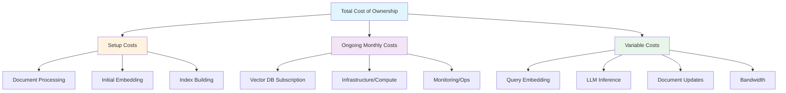
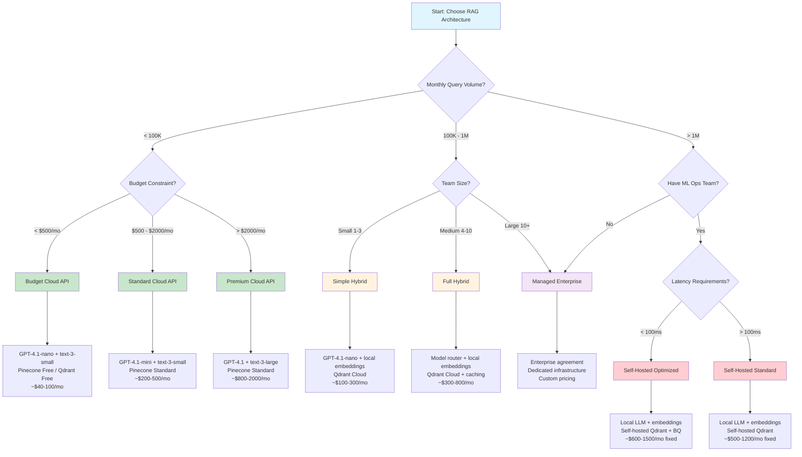

# Cost Comparison Analysis

## Introduction

Understanding the true cost of a RAG system requires more than looking at individual API prices. You need to account for every component — embeddings, storage, retrieval, LLM inference, infrastructure, and operational overhead — then compare different architectural choices across realistic query volumes.

This lesson builds comprehensive cost models using real 2025 pricing data. You'll learn to calculate total cost of ownership (TCO) for different RAG configurations, compare vendor options, and identify the most cost-effective architecture for your specific use case.

### What You'll Learn

- Build per-query and per-million-query cost models
- Calculate total cost of ownership across RAG architectures
- Compare cloud API vs. self-hosted vs. hybrid deployments
- Analyze cost scaling behavior at different query volumes
- Create cost projection tools for budget planning

### Prerequisites

- Completed lessons 01–04 in this unit (embedding, storage, LLM, retrieval optimization)
- Understanding of RAG pipeline components
- Basic Python dataclass and enum knowledge
- Familiarity with cloud infrastructure pricing concepts

---

## Section 1: Component Cost Modeling

Every RAG query touches multiple billable components. Before comparing architectures, you need a precise model for each cost component.

### Cost Component Breakdown

```
RAG Query Cost = Embedding Cost + Retrieval Cost + LLM Cost + Infrastructure Cost

Where:
  Embedding Cost  = (query tokens / 1M) × model price per 1M tokens
  Retrieval Cost  = vector search cost + metadata filter cost + network transfer
  LLM Cost        = (input tokens / 1M) × input price + (output tokens / 1M) × output price
  Infrastructure  = compute + storage + bandwidth (amortized per query)
```

### Python Cost Model

```python
"""
RAG component cost modeling with real 2025 pricing.
"""

from dataclasses import dataclass, field
from enum import Enum
from typing import Optional


class EmbeddingModel(Enum):
    """Embedding models with per-1M-token pricing (2025)."""
    TEXT_3_SMALL = ("text-embedding-3-small", 0.02)      # $0.02/1M tokens
    TEXT_3_LARGE = ("text-embedding-3-large", 0.13)       # $0.13/1M tokens
    COHERE_ENGLISH = ("embed-english-v3.0", 0.10)         # $0.10/1M tokens
    LOCAL_MINILM = ("all-MiniLM-L6-v2", 0.0)             # Free (compute cost separate)
    LOCAL_BGE_SMALL = ("bge-small-en-v1.5", 0.0)          # Free (compute cost separate)
    
    def __init__(self, model_name: str, price_per_million: float):
        self.model_name = model_name
        self.price_per_million = price_per_million


class LLMModel(Enum):
    """LLM models with per-1M-token pricing (input/output, 2025)."""
    GPT_41_NANO = ("gpt-4.1-nano", 0.10, 0.40)
    GPT_41_MINI = ("gpt-4.1-mini", 0.40, 1.60)
    GPT_41 = ("gpt-4.1", 2.00, 8.00)
    GPT_5_MINI = ("gpt-5-mini", 0.25, 2.00)
    GPT_5 = ("gpt-5.2", 1.75, 14.00)
    CLAUDE_HAIKU = ("claude-haiku", 0.25, 1.25)
    CLAUDE_SONNET = ("claude-sonnet", 3.00, 15.00)
    LOCAL_LLAMA = ("llama-3-8b", 0.0, 0.0)               # Free (compute cost separate)
    
    def __init__(self, model_name: str, input_price: float, output_price: float):
        self.model_name = model_name
        self.input_price = input_price
        self.output_price = output_price


class VectorDBProvider(Enum):
    """Vector database providers with monthly pricing estimates."""
    PINECONE_STARTER = ("Pinecone Starter", 0.0, 0.0)                  # Free tier
    PINECONE_STANDARD = ("Pinecone Standard", 50.0, 0.0)               # $50/mo minimum
    QDRANT_FREE = ("Qdrant Cloud Free", 0.0, 0.0)                      # 1GB free
    QDRANT_STANDARD = ("Qdrant Cloud Standard", 25.0, 0.0)             # ~$25/mo 1GB
    CHROMA_LOCAL = ("ChromaDB Local", 0.0, 0.0)                        # Self-hosted
    WEAVIATE_SANDBOX = ("Weaviate Sandbox", 0.0, 0.0)                  # Free sandbox
    WEAVIATE_STANDARD = ("Weaviate Standard", 25.0, 0.0)               # ~$25/mo
    SELF_HOSTED_QDRANT = ("Self-Hosted Qdrant", 0.0, 50.0)             # Server cost
    
    def __init__(self, display_name: str, monthly_base: float, infra_cost: float):
        self.display_name = display_name
        self.monthly_base = monthly_base
        self.infra_cost = infra_cost


@dataclass
class QueryProfile:
    """Describes a typical query's token characteristics."""
    avg_query_tokens: int = 50                    # Average query length
    avg_context_tokens: int = 2000                # Retrieved context sent to LLM
    avg_system_prompt_tokens: int = 500           # System prompt overhead
    avg_output_tokens: int = 300                  # LLM response length
    chunks_retrieved: int = 5                     # Number of chunks per query
    
    @property
    def total_input_tokens(self) -> int:
        """Total tokens sent to LLM per query."""
        return (self.avg_query_tokens + 
                self.avg_context_tokens + 
                self.avg_system_prompt_tokens)
    
    @property
    def total_llm_tokens(self) -> int:
        """Total LLM tokens (input + output) per query."""
        return self.total_input_tokens + self.avg_output_tokens


@dataclass
class ComponentCost:
    """Cost breakdown for a single RAG query."""
    embedding_cost: float = 0.0
    retrieval_cost: float = 0.0
    llm_input_cost: float = 0.0
    llm_output_cost: float = 0.0
    infrastructure_cost: float = 0.0
    
    @property
    def total(self) -> float:
        """Total cost per query."""
        return (self.embedding_cost + 
                self.retrieval_cost + 
                self.llm_input_cost + 
                self.llm_output_cost + 
                self.infrastructure_cost)
    
    @property
    def llm_total(self) -> float:
        """Combined LLM cost."""
        return self.llm_input_cost + self.llm_output_cost
    
    def breakdown_percentages(self) -> dict[str, float]:
        """Return cost breakdown as percentages."""
        total = self.total
        if total == 0:
            return {}
        
        return {
            "Embedding": (self.embedding_cost / total) * 100,
            "Retrieval": (self.retrieval_cost / total) * 100,
            "LLM Input": (self.llm_input_cost / total) * 100,
            "LLM Output": (self.llm_output_cost / total) * 100,
            "Infrastructure": (self.infrastructure_cost / total) * 100,
        }


def calculate_query_cost(
    embedding_model: EmbeddingModel,
    llm_model: LLMModel,
    profile: QueryProfile,
    infra_cost_per_query: float = 0.0
) -> ComponentCost:
    """
    Calculate the cost of a single RAG query.
    
    Args:
        embedding_model: The embedding model used for query encoding
        llm_model: The LLM model used for generation
        profile: Query token profile
        infra_cost_per_query: Amortized infrastructure cost per query
    
    Returns:
        ComponentCost with detailed breakdown
    """
    # Embedding cost: encode the query
    embedding_cost = (
        profile.avg_query_tokens / 1_000_000
    ) * embedding_model.price_per_million
    
    # LLM costs
    llm_input_cost = (
        profile.total_input_tokens / 1_000_000
    ) * llm_model.input_price
    
    llm_output_cost = (
        profile.avg_output_tokens / 1_000_000
    ) * llm_model.output_price
    
    return ComponentCost(
        embedding_cost=embedding_cost,
        retrieval_cost=0.0,  # Included in vector DB subscription
        llm_input_cost=llm_input_cost,
        llm_output_cost=llm_output_cost,
        infrastructure_cost=infra_cost_per_query
    )


# Example: Calculate cost per query for different configurations
def demonstrate_per_query_costs():
    """Show per-query costs for different model combinations."""
    profile = QueryProfile()
    
    configs = [
        ("Budget", EmbeddingModel.TEXT_3_SMALL, LLMModel.GPT_41_NANO),
        ("Standard", EmbeddingModel.TEXT_3_SMALL, LLMModel.GPT_41_MINI),
        ("Premium", EmbeddingModel.TEXT_3_LARGE, LLMModel.GPT_41),
        ("High-End", EmbeddingModel.TEXT_3_LARGE, LLMModel.GPT_5),
    ]
    
    print(f"{'Config':<12} {'Embed':>10} {'LLM Input':>12} "
          f"{'LLM Output':>12} {'Total':>12} {'Per 1M':>12}")
    print("-" * 72)
    
    for name, embed, llm in configs:
        cost = calculate_query_cost(embed, llm, profile)
        print(
            f"{name:<12} "
            f"${cost.embedding_cost:>9.7f} "
            f"${cost.llm_input_cost:>11.7f} "
            f"${cost.llm_output_cost:>11.7f} "
            f"${cost.total:>11.7f} "
            f"${cost.total * 1_000_000:>10.2f}"
        )
```

### Per-Query Cost Reference Table

| Configuration | Embedding | LLM Input | LLM Output | **Total/Query** | **Per 1M Queries** |
|:---|:---:|:---:|:---:|:---:|:---:|
| **Budget** (3-small + 4.1-nano) | $0.0000010 | $0.0002550 | $0.0001200 | **$0.0003760** | **$376** |
| **Standard** (3-small + 4.1-mini) | $0.0000010 | $0.0010200 | $0.0004800 | **$0.0015010** | **$1,501** |
| **Premium** (3-large + 4.1) | $0.0000065 | $0.0051000 | $0.0024000 | **$0.0075065** | **$7,507** |
| **High-End** (3-large + GPT-5.2) | $0.0000065 | $0.0044625 | $0.0042000 | **$0.0086690** | **$8,669** |

> **Key Insight**: LLM costs dominate — typically 99%+ of per-query costs. Embedding costs are nearly negligible at the query level. This is why LLM optimization (Lesson 03) has the biggest impact on your bill.

---

## Section 2: Total Cost of Ownership Calculator

Per-query costs tell only part of the story. A complete TCO model includes document ingestion, storage, infrastructure, and operational costs.

### TCO Model



### Python TCO Calculator

```python
"""
Total Cost of Ownership calculator for RAG systems.
"""

from dataclasses import dataclass, field
from typing import Optional


@dataclass
class DocumentCorpus:
    """Describes the document corpus for a RAG system."""
    total_documents: int = 10_000
    avg_tokens_per_document: int = 2_000
    avg_chunks_per_document: int = 8
    embedding_dimensions: int = 1536
    update_frequency_monthly: float = 0.05     # 5% of docs updated per month
    
    @property
    def total_chunks(self) -> int:
        """Total number of chunks in the corpus."""
        return self.total_documents * self.avg_chunks_per_document
    
    @property
    def total_tokens(self) -> int:
        """Total tokens across all documents."""
        return self.total_documents * self.avg_tokens_per_document
    
    @property
    def monthly_update_tokens(self) -> int:
        """Tokens that need re-embedding each month."""
        updated_docs = int(self.total_documents * self.update_frequency_monthly)
        return updated_docs * self.avg_tokens_per_document
    
    @property
    def storage_bytes_uncompressed(self) -> float:
        """Raw storage needed for vectors (float32)."""
        # Each float32 = 4 bytes
        return self.total_chunks * self.embedding_dimensions * 4
    
    @property
    def storage_gb(self) -> float:
        """Storage in GB (including ~2x overhead for index + metadata)."""
        raw_gb = self.storage_bytes_uncompressed / (1024 ** 3)
        return raw_gb * 2  # Index + metadata overhead


@dataclass
class SetupCosts:
    """One-time setup costs for a RAG system."""
    document_processing_hours: float = 10.0
    developer_hourly_rate: float = 75.0
    initial_embedding_cost: float = 0.0
    infrastructure_setup: float = 0.0
    
    @property
    def total(self) -> float:
        """Total setup costs."""
        return (
            self.document_processing_hours * self.developer_hourly_rate +
            self.initial_embedding_cost +
            self.infrastructure_setup
        )


@dataclass
class MonthlyCosts:
    """Recurring monthly costs."""
    vector_db_subscription: float = 0.0
    compute_infrastructure: float = 0.0
    monitoring_and_ops: float = 10.0
    document_update_embedding: float = 0.0
    
    @property
    def total(self) -> float:
        """Total monthly fixed costs."""
        return (
            self.vector_db_subscription +
            self.compute_infrastructure +
            self.monitoring_and_ops +
            self.document_update_embedding
        )


@dataclass
class TCOCalculator:
    """
    Complete TCO calculator for a RAG system.
    
    Calculates total cost including setup, monthly fixed costs,
    and variable per-query costs over a specified time horizon.
    """
    corpus: DocumentCorpus
    embedding_model: EmbeddingModel
    llm_model: LLMModel
    vector_db: VectorDBProvider
    query_profile: QueryProfile
    monthly_queries: int = 100_000
    
    def calculate_setup_costs(self) -> SetupCosts:
        """Calculate one-time setup costs."""
        # Initial embedding cost
        initial_embedding = (
            self.corpus.total_tokens / 1_000_000
        ) * self.embedding_model.price_per_million
        
        return SetupCosts(
            document_processing_hours=max(5, self.corpus.total_documents / 1000),
            initial_embedding_cost=initial_embedding,
            infrastructure_setup=200.0 if self.vector_db.infra_cost > 0 else 0.0
        )
    
    def calculate_monthly_fixed(self) -> MonthlyCosts:
        """Calculate recurring monthly costs."""
        # Document update embedding costs
        update_embedding = (
            self.corpus.monthly_update_tokens / 1_000_000
        ) * self.embedding_model.price_per_million
        
        return MonthlyCosts(
            vector_db_subscription=self.vector_db.monthly_base,
            compute_infrastructure=self.vector_db.infra_cost,
            monitoring_and_ops=10.0,
            document_update_embedding=update_embedding
        )
    
    def calculate_monthly_variable(self) -> float:
        """Calculate monthly variable costs based on query volume."""
        per_query = calculate_query_cost(
            self.embedding_model,
            self.llm_model,
            self.query_profile
        )
        return per_query.total * self.monthly_queries
    
    def calculate_tco(self, months: int = 12) -> dict:
        """
        Calculate total cost of ownership over a time period.
        
        Args:
            months: Number of months to project
        
        Returns:
            Detailed TCO breakdown dictionary
        """
        setup = self.calculate_setup_costs()
        monthly_fixed = self.calculate_monthly_fixed()
        monthly_variable = self.calculate_monthly_variable()
        
        total_monthly = monthly_fixed.total + monthly_variable
        total_cost = setup.total + (total_monthly * months)
        
        # Per-query effective cost (amortized setup over period)
        total_queries = self.monthly_queries * months
        effective_per_query = total_cost / total_queries if total_queries > 0 else 0
        
        return {
            "setup_costs": {
                "development": setup.document_processing_hours * setup.developer_hourly_rate,
                "initial_embedding": setup.initial_embedding_cost,
                "infrastructure": setup.infrastructure_setup,
                "total": setup.total,
            },
            "monthly_costs": {
                "fixed": {
                    "vector_db": monthly_fixed.vector_db_subscription,
                    "compute": monthly_fixed.compute_infrastructure,
                    "monitoring": monthly_fixed.monitoring_and_ops,
                    "doc_updates": monthly_fixed.document_update_embedding,
                    "total": monthly_fixed.total,
                },
                "variable": {
                    "query_costs": monthly_variable,
                    "total": monthly_variable,
                },
                "total": total_monthly,
            },
            "projections": {
                "months": months,
                "total_queries": total_queries,
                "total_cost": total_cost,
                "avg_monthly": total_cost / months,
                "effective_per_query": effective_per_query,
                "effective_per_1m_queries": effective_per_query * 1_000_000,
            }
        }
    
    def print_tco_report(self, months: int = 12) -> None:
        """Print a formatted TCO report."""
        tco = self.calculate_tco(months)
        
        print("=" * 60)
        print("RAG System — Total Cost of Ownership Report")
        print("=" * 60)
        
        print(f"\nConfiguration:")
        print(f"  Embedding:  {self.embedding_model.model_name}")
        print(f"  LLM:        {self.llm_model.model_name}")
        print(f"  Vector DB:  {self.vector_db.display_name}")
        print(f"  Documents:  {self.corpus.total_documents:,}")
        print(f"  Monthly Queries: {self.monthly_queries:,}")
        print(f"  Time Horizon: {months} months")
        
        print(f"\n--- Setup Costs (One-Time) ---")
        setup = tco["setup_costs"]
        print(f"  Development:       ${setup['development']:>10,.2f}")
        print(f"  Initial Embedding: ${setup['initial_embedding']:>10,.4f}")
        print(f"  Infrastructure:    ${setup['infrastructure']:>10,.2f}")
        print(f"  Total Setup:       ${setup['total']:>10,.2f}")
        
        print(f"\n--- Monthly Costs ---")
        monthly = tco["monthly_costs"]
        print(f"  Fixed:")
        print(f"    Vector DB:       ${monthly['fixed']['vector_db']:>10,.2f}")
        print(f"    Compute:         ${monthly['fixed']['compute']:>10,.2f}")
        print(f"    Monitoring:      ${monthly['fixed']['monitoring']:>10,.2f}")
        print(f"    Doc Updates:     ${monthly['fixed']['doc_updates']:>10,.4f}")
        print(f"    Subtotal Fixed:  ${monthly['fixed']['total']:>10,.2f}")
        print(f"  Variable:")
        print(f"    Query Costs:     ${monthly['variable']['total']:>10,.2f}")
        print(f"  Total Monthly:     ${monthly['total']:>10,.2f}")
        
        print(f"\n--- {months}-Month Projections ---")
        proj = tco["projections"]
        print(f"  Total Queries:     {proj['total_queries']:>10,}")
        print(f"  Total Cost:        ${proj['total_cost']:>10,.2f}")
        print(f"  Avg Monthly:       ${proj['avg_monthly']:>10,.2f}")
        print(f"  Effective/Query:   ${proj['effective_per_query']:>10.6f}")
        print(f"  Effective/1M:      ${proj['effective_per_1m_queries']:>10,.2f}")
        print("=" * 60)
```

---

## Section 3: Architecture Comparison

Different RAG architectures have dramatically different cost profiles. Let's compare the three main approaches: cloud API, self-hosted, and hybrid.

### Architecture Definitions

```python
"""
Compare RAG architectures: Cloud API, Self-Hosted, Hybrid.
"""

from dataclasses import dataclass
from enum import Enum


class ArchitectureType(Enum):
    """RAG deployment architecture types."""
    CLOUD_API = "Cloud API (Fully Managed)"
    SELF_HOSTED = "Self-Hosted (Full Control)"
    HYBRID = "Hybrid (Mixed)"


@dataclass
class ArchitectureConfig:
    """Configuration for a specific RAG architecture."""
    name: str
    architecture_type: ArchitectureType
    embedding_model: EmbeddingModel
    llm_model: LLMModel
    vector_db: VectorDBProvider
    
    # Optimization features
    prompt_caching_savings: float = 0.0       # 0.0 to 0.90
    response_caching_hit_rate: float = 0.0    # 0.0 to 0.50
    batch_embedding_discount: float = 0.0     # 0.0 to 0.50
    quantization_storage_savings: float = 0.0 # 0.0 to 0.97
    
    # Self-hosted compute costs (monthly)
    gpu_compute_monthly: float = 0.0          # GPU server costs
    cpu_compute_monthly: float = 0.0          # CPU server costs
    
    # Developer time
    setup_hours: float = 10.0
    monthly_maintenance_hours: float = 2.0
    developer_rate: float = 75.0


# Define three representative architectures
def get_cloud_api_config() -> ArchitectureConfig:
    """Fully managed cloud API architecture."""
    return ArchitectureConfig(
        name="Cloud API",
        architecture_type=ArchitectureType.CLOUD_API,
        embedding_model=EmbeddingModel.TEXT_3_SMALL,
        llm_model=LLMModel.GPT_41_MINI,
        vector_db=VectorDBProvider.PINECONE_STANDARD,
        prompt_caching_savings=0.75,       # OpenAI prompt caching
        response_caching_hit_rate=0.15,    # Basic response cache
        batch_embedding_discount=0.50,     # Batch API
        quantization_storage_savings=0.0,  # Managed by provider
        setup_hours=8.0,
        monthly_maintenance_hours=2.0,
    )


def get_self_hosted_config() -> ArchitectureConfig:
    """Self-hosted architecture with local models."""
    return ArchitectureConfig(
        name="Self-Hosted",
        architecture_type=ArchitectureType.SELF_HOSTED,
        embedding_model=EmbeddingModel.LOCAL_MINILM,
        llm_model=LLMModel.LOCAL_LLAMA,
        vector_db=VectorDBProvider.SELF_HOSTED_QDRANT,
        prompt_caching_savings=0.0,
        response_caching_hit_rate=0.20,
        batch_embedding_discount=0.0,
        quantization_storage_savings=0.75,    # Scalar quantization
        gpu_compute_monthly=500.0,            # GPU instance
        cpu_compute_monthly=100.0,            # CPU instance
        setup_hours=40.0,                     # More setup work
        monthly_maintenance_hours=8.0,        # More maintenance
    )


def get_hybrid_config() -> ArchitectureConfig:
    """Hybrid: local embeddings + cloud LLM + managed vector DB."""
    return ArchitectureConfig(
        name="Hybrid",
        architecture_type=ArchitectureType.HYBRID,
        embedding_model=EmbeddingModel.LOCAL_BGE_SMALL,
        llm_model=LLMModel.GPT_41_NANO,
        vector_db=VectorDBProvider.QDRANT_STANDARD,
        prompt_caching_savings=0.75,
        response_caching_hit_rate=0.25,
        batch_embedding_discount=0.0,
        quantization_storage_savings=0.50,    # Binary quantization
        cpu_compute_monthly=50.0,             # Small embedding server
        setup_hours=20.0,
        monthly_maintenance_hours=4.0,
    )
```

### Architecture Cost Comparison

```python
"""
Side-by-side architecture comparison.
"""

@dataclass
class ArchitectureTCO:
    """TCO results for an architecture."""
    name: str
    setup_cost: float
    monthly_fixed: float
    monthly_variable: float
    monthly_total: float
    annual_total: float
    cost_per_query: float
    cost_per_1m_queries: float
    
    # Cost breakdown
    pct_llm: float = 0.0
    pct_infrastructure: float = 0.0
    pct_storage: float = 0.0
    pct_dev_ops: float = 0.0


def compare_architectures(
    corpus: DocumentCorpus,
    profile: QueryProfile,
    monthly_queries: int = 100_000
) -> list[ArchitectureTCO]:
    """
    Compare three architecture approaches.
    
    Args:
        corpus: Document corpus description
        profile: Query token profile
        monthly_queries: Monthly query volume
    
    Returns:
        List of ArchitectureTCO results for comparison
    """
    configs = [
        get_cloud_api_config(),
        get_self_hosted_config(),
        get_hybrid_config(),
    ]
    
    results = []
    
    for config in configs:
        # --- Setup costs ---
        initial_embed_cost = (
            corpus.total_tokens / 1_000_000
        ) * config.embedding_model.price_per_million
        
        # Apply batch discount to initial embedding
        initial_embed_cost *= (1 - config.batch_embedding_discount)
        
        setup_cost = (
            config.setup_hours * config.developer_rate +
            initial_embed_cost
        )
        
        # --- Monthly fixed costs ---
        monthly_fixed = (
            config.vector_db.monthly_base +
            config.vector_db.infra_cost +
            config.gpu_compute_monthly +
            config.cpu_compute_monthly +
            config.monthly_maintenance_hours * config.developer_rate +
            10.0  # Monitoring baseline
        )
        
        # Document update embedding
        update_embed = (
            corpus.monthly_update_tokens / 1_000_000
        ) * config.embedding_model.price_per_million
        monthly_fixed += update_embed
        
        # --- Monthly variable costs ---
        per_query = calculate_query_cost(
            config.embedding_model,
            config.llm_model,
            profile
        )
        
        # Apply prompt caching savings to LLM input
        effective_llm_input = per_query.llm_input_cost * (
            1 - config.prompt_caching_savings
        )
        
        # Apply response cache hit rate (those queries skip LLM entirely)
        cache_miss_rate = 1 - config.response_caching_hit_rate
        effective_per_query = (
            per_query.embedding_cost +
            (effective_llm_input + per_query.llm_output_cost) * cache_miss_rate
        )
        
        monthly_variable = effective_per_query * monthly_queries
        monthly_total = monthly_fixed + monthly_variable
        annual_total = setup_cost + (monthly_total * 12)
        
        # Calculate breakdown percentages
        if annual_total > 0:
            annual_llm = monthly_variable * 12
            annual_infra = (
                config.gpu_compute_monthly + 
                config.cpu_compute_monthly +
                config.vector_db.infra_cost
            ) * 12
            annual_storage = config.vector_db.monthly_base * 12
            annual_dev = (
                config.monthly_maintenance_hours * config.developer_rate + 10
            ) * 12
            
            pct_llm = (annual_llm / annual_total) * 100
            pct_infra = (annual_infra / annual_total) * 100
            pct_storage = (annual_storage / annual_total) * 100
            pct_dev = (annual_dev / annual_total) * 100
        else:
            pct_llm = pct_infra = pct_storage = pct_dev = 0.0
        
        total_queries_annual = monthly_queries * 12
        
        results.append(ArchitectureTCO(
            name=config.name,
            setup_cost=setup_cost,
            monthly_fixed=monthly_fixed,
            monthly_variable=monthly_variable,
            monthly_total=monthly_total,
            annual_total=annual_total,
            cost_per_query=annual_total / total_queries_annual if total_queries_annual > 0 else 0,
            cost_per_1m_queries=(annual_total / total_queries_annual * 1_000_000) if total_queries_annual > 0 else 0,
            pct_llm=pct_llm,
            pct_infrastructure=pct_infra,
            pct_storage=pct_storage,
            pct_dev_ops=pct_dev,
        ))
    
    return results


def print_comparison_table(results: list[ArchitectureTCO]) -> None:
    """Print a formatted comparison table."""
    print("\n" + "=" * 75)
    print("Architecture Cost Comparison (12-Month TCO)")
    print("=" * 75)
    
    header = f"{'Metric':<30}"
    for r in results:
        header += f" {r.name:>13}"
    print(header)
    print("-" * 75)
    
    rows = [
        ("Setup Cost", [f"${r.setup_cost:>10,.2f}" for r in results]),
        ("Monthly Fixed", [f"${r.monthly_fixed:>10,.2f}" for r in results]),
        ("Monthly Variable", [f"${r.monthly_variable:>10,.2f}" for r in results]),
        ("Monthly Total", [f"${r.monthly_total:>10,.2f}" for r in results]),
        ("", ["" for _ in results]),
        ("Annual Total (12-mo)", [f"${r.annual_total:>10,.2f}" for r in results]),
        ("Cost per Query", [f"${r.cost_per_query:>10.6f}" for r in results]),
        ("Cost per 1M Queries", [f"${r.cost_per_1m_queries:>10,.2f}" for r in results]),
        ("", ["" for _ in results]),
        ("% LLM/API", [f"{r.pct_llm:>12.1f}%" for r in results]),
        ("% Infrastructure", [f"{r.pct_infrastructure:>12.1f}%" for r in results]),
        ("% Storage", [f"{r.pct_storage:>12.1f}%" for r in results]),
        ("% Dev/Ops", [f"{r.pct_dev_ops:>12.1f}%" for r in results]),
    ]
    
    for label, values in rows:
        row = f"{label:<30}"
        for v in values:
            row += f" {v:>13}"
        print(row)
    
    print("=" * 75)
    
    # Find cheapest
    cheapest = min(results, key=lambda r: r.annual_total)
    print(f"\n✅ Most cost-effective: {cheapest.name} "
          f"(${cheapest.annual_total:,.2f}/year)")
```

### Architecture Comparison Summary Table

| Metric | Cloud API | Self-Hosted | Hybrid |
|:---|:---:|:---:|:---:|
| **Setup Cost** | ~$600 | ~$3,000 | ~$1,500 |
| **Monthly Fixed** | $210 | $1,260 | $385 |
| **Monthly Variable (100K queries)** | ~$32 | ~$0 | ~$10 |
| **Annual TCO** | ~$3,500 | ~$18,120 | ~$6,240 |
| **Cost/1M Queries** | ~$2,900 | ~$15,100 | ~$5,200 |
| **Best For** | Low-medium volume | Very high volume | Medium volume |
| **Ops Complexity** | Low | High | Medium |

> **When does self-hosted win?** Only at very high volumes (>1M queries/month) where the fixed infrastructure cost is amortized across many queries, and you have the engineering team to maintain it. For most teams, cloud API or hybrid is more cost-effective.

---

## Section 4: Volume-Based Cost Projections

Cost-effectiveness changes dramatically with query volume. A configuration that's cheapest at 10K queries/month may be the most expensive at 1M queries/month.

### Scaling Analysis

```python
"""
Analyze how costs scale with query volume.
"""

from dataclasses import dataclass


@dataclass
class ScalingPoint:
    """Cost data at a specific query volume."""
    monthly_queries: int
    cloud_api_monthly: float
    self_hosted_monthly: float
    hybrid_monthly: float
    cheapest: str


def volume_scaling_analysis(
    corpus: DocumentCorpus,
    profile: QueryProfile,
    volumes: list[int] = None
) -> list[ScalingPoint]:
    """
    Calculate costs at different query volumes.
    
    Args:
        corpus: Document corpus description
        profile: Query token profile
        volumes: List of monthly query volumes to analyze
    
    Returns:
        List of ScalingPoint results
    """
    if volumes is None:
        volumes = [
            1_000, 5_000, 10_000, 25_000, 50_000,
            100_000, 250_000, 500_000, 1_000_000,
            2_500_000, 5_000_000, 10_000_000
        ]
    
    results = []
    
    for vol in volumes:
        comparisons = compare_architectures(corpus, profile, vol)
        
        cloud = next(r for r in comparisons if r.name == "Cloud API")
        self_hosted = next(r for r in comparisons if r.name == "Self-Hosted")
        hybrid = next(r for r in comparisons if r.name == "Hybrid")
        
        cheapest_obj = min(comparisons, key=lambda r: r.monthly_total)
        
        results.append(ScalingPoint(
            monthly_queries=vol,
            cloud_api_monthly=cloud.monthly_total,
            self_hosted_monthly=self_hosted.monthly_total,
            hybrid_monthly=hybrid.monthly_total,
            cheapest=cheapest_obj.name,
        ))
    
    return results


def print_scaling_table(points: list[ScalingPoint]) -> None:
    """Print a volume scaling table."""
    print("\n" + "=" * 80)
    print("Monthly Cost by Query Volume")
    print("=" * 80)
    print(f"{'Queries/Month':>15} {'Cloud API':>12} {'Self-Hosted':>12} "
          f"{'Hybrid':>12} {'Cheapest':>14}")
    print("-" * 80)
    
    for p in points:
        print(
            f"{p.monthly_queries:>15,} "
            f"${p.cloud_api_monthly:>10,.2f} "
            f"${p.self_hosted_monthly:>10,.2f} "
            f"${p.hybrid_monthly:>10,.2f} "
            f"  {p.cheapest:>12}"
        )
    
    print("=" * 80)
```

### Volume Scaling Reference

| Monthly Queries | Cloud API | Self-Hosted | Hybrid | Cheapest |
|---:|---:|---:|---:|:---|
| 1,000 | ~$210 | ~$1,260 | ~$385 | Cloud API |
| 10,000 | ~$213 | ~$1,260 | ~$386 | Cloud API |
| 50,000 | ~$226 | ~$1,260 | ~$390 | Cloud API |
| 100,000 | ~$242 | ~$1,260 | ~$395 | Cloud API |
| 250,000 | ~$290 | ~$1,260 | ~$410 | Cloud API |
| 500,000 | ~$370 | ~$1,260 | ~$435 | Cloud API |
| 1,000,000 | ~$530 | ~$1,260 | ~$485 | Hybrid |
| 2,500,000 | ~$1,010 | ~$1,260 | ~$635 | Hybrid |
| 5,000,000 | ~$1,810 | ~$1,260 | ~$885 | Self-Hosted |
| 10,000,000 | ~$3,410 | ~$1,260 | ~$1,385 | Self-Hosted |

> **Crossover points**: Cloud API is cheapest below ~800K queries/month. Hybrid wins from ~800K to ~4M. Self-Hosted becomes cheapest above ~4M queries/month. These crossover points shift based on your specific model choices and optimization levels.

### Cost Crossover Visualization

```
Monthly Cost ($)
│
3500 ┤                                          ╱ Cloud API
     │                                        ╱
3000 ┤                                      ╱
     │                                    ╱
2500 ┤                                  ╱
     │                                ╱
2000 ┤                              ╱
     │                            ╱
1500 ┤─ ─ ─ ─ ─ ─ ─ ─ ─ ─ ─ ─ ─ ─ ─ ─ ─ ─ ─ ─ Self-Hosted
     │                        ╱               ╱ Hybrid
1000 ┤                      ╱               ╱
     │                    ╱              ╱
 500 ┤              ╱─────────────────╱
     │         ╱───╱
 200 ┤────────╱
     │
   0 ┼──────┬──────┬──────┬──────┬──────┬──────┬───
     0    500K    1M    2M    3M    5M    10M
                  Monthly Queries
```

---

## Section 5: Vendor Comparison Framework

Choosing between vector database providers and LLM vendors requires comparing multiple dimensions beyond raw price.

### Multi-Dimensional Vendor Comparison

```python
"""
Vendor comparison framework for RAG system components.
"""

from dataclasses import dataclass, field
from enum import Enum


class FeatureSupport(Enum):
    """Level of feature support."""
    FULL = "✅ Full"
    PARTIAL = "⚠️ Partial"
    NONE = "❌ None"
    BETA = "🔄 Beta"


@dataclass
class VectorDBComparison:
    """Detailed comparison of a vector database provider."""
    name: str
    
    # Pricing
    free_tier: bool = False
    free_tier_limits: str = ""
    entry_price_monthly: float = 0.0
    price_per_gb: float = 0.0
    
    # Performance
    max_dimensions: int = 0
    max_vectors_free: int = 0
    avg_latency_ms: float = 0.0
    
    # Features
    hybrid_search: FeatureSupport = FeatureSupport.NONE
    metadata_filtering: FeatureSupport = FeatureSupport.NONE
    binary_quantization: FeatureSupport = FeatureSupport.NONE
    scalar_quantization: FeatureSupport = FeatureSupport.NONE
    multi_tenancy: FeatureSupport = FeatureSupport.NONE
    serverless: FeatureSupport = FeatureSupport.NONE
    
    # Operational
    self_host_option: bool = False
    managed_backups: bool = False
    sla_uptime: float = 0.0


def build_vectordb_comparison() -> list[VectorDBComparison]:
    """Build comparison table for major vector DB providers."""
    return [
        VectorDBComparison(
            name="Pinecone",
            free_tier=True,
            free_tier_limits="2GB storage, 100 namespaces",
            entry_price_monthly=50.0,
            price_per_gb=5.0,
            max_dimensions=20_000,
            max_vectors_free=500_000,
            avg_latency_ms=10.0,
            hybrid_search=FeatureSupport.FULL,
            metadata_filtering=FeatureSupport.FULL,
            binary_quantization=FeatureSupport.NONE,
            scalar_quantization=FeatureSupport.FULL,
            multi_tenancy=FeatureSupport.FULL,
            serverless=FeatureSupport.FULL,
            self_host_option=False,
            managed_backups=True,
            sla_uptime=99.95,
        ),
        VectorDBComparison(
            name="Qdrant",
            free_tier=True,
            free_tier_limits="1GB storage, 1 cluster",
            entry_price_monthly=25.0,
            price_per_gb=3.0,
            max_dimensions=65_536,
            max_vectors_free=1_000_000,
            avg_latency_ms=8.0,
            hybrid_search=FeatureSupport.FULL,
            metadata_filtering=FeatureSupport.FULL,
            binary_quantization=FeatureSupport.FULL,
            scalar_quantization=FeatureSupport.FULL,
            multi_tenancy=FeatureSupport.FULL,
            serverless=FeatureSupport.PARTIAL,
            self_host_option=True,
            managed_backups=True,
            sla_uptime=99.9,
        ),
        VectorDBComparison(
            name="Weaviate",
            free_tier=True,
            free_tier_limits="Sandbox cluster, limited resources",
            entry_price_monthly=25.0,
            price_per_gb=4.0,
            max_dimensions=65_536,
            max_vectors_free=200_000,
            avg_latency_ms=12.0,
            hybrid_search=FeatureSupport.FULL,
            metadata_filtering=FeatureSupport.FULL,
            binary_quantization=FeatureSupport.FULL,
            scalar_quantization=FeatureSupport.PARTIAL,
            multi_tenancy=FeatureSupport.FULL,
            serverless=FeatureSupport.FULL,
            self_host_option=True,
            managed_backups=True,
            sla_uptime=99.9,
        ),
        VectorDBComparison(
            name="ChromaDB",
            free_tier=True,
            free_tier_limits="Local only (no limits)",
            entry_price_monthly=0.0,
            price_per_gb=0.0,
            max_dimensions=65_536,
            max_vectors_free=0,  # No hosted limit
            avg_latency_ms=5.0,
            hybrid_search=FeatureSupport.PARTIAL,
            metadata_filtering=FeatureSupport.FULL,
            binary_quantization=FeatureSupport.NONE,
            scalar_quantization=FeatureSupport.NONE,
            multi_tenancy=FeatureSupport.NONE,
            serverless=FeatureSupport.NONE,
            self_host_option=True,
            managed_backups=False,
            sla_uptime=0.0,
        ),
    ]


def print_vectordb_comparison(comparisons: list[VectorDBComparison]) -> None:
    """Print formatted vector DB comparison."""
    print("\n" + "=" * 90)
    print("Vector Database Provider Comparison")
    print("=" * 90)
    
    for db in comparisons:
        print(f"\n{'─' * 40}")
        print(f"  {db.name}")
        print(f"{'─' * 40}")
        print(f"  Free Tier:           {'Yes' if db.free_tier else 'No'}")
        if db.free_tier:
            print(f"  Free Limits:         {db.free_tier_limits}")
        print(f"  Entry Price:         ${db.entry_price_monthly}/mo")
        print(f"  Price/GB:            ${db.price_per_gb}/mo")
        print(f"  Avg Latency:         {db.avg_latency_ms}ms")
        print(f"  Hybrid Search:       {db.hybrid_search.value}")
        print(f"  Binary Quantization: {db.binary_quantization.value}")
        print(f"  Scalar Quantization: {db.scalar_quantization.value}")
        print(f"  Self-Host:           {'Yes' if db.self_host_option else 'No'}")
        print(f"  Multi-Tenancy:       {db.multi_tenancy.value}")
        print(f"  SLA:                 {db.sla_uptime}%")
```

### Vector Database Comparison Table

| Feature | Pinecone | Qdrant | Weaviate | ChromaDB |
|:---|:---:|:---:|:---:|:---:|
| **Free Tier** | ✅ 2GB | ✅ 1GB | ✅ Sandbox | ✅ Local |
| **Entry Price** | $50/mo | ~$25/mo | ~$25/mo | Free |
| **Hybrid Search** | ✅ | ✅ | ✅ | ⚠️ Partial |
| **Binary Quantization** | ❌ | ✅ | ✅ | ❌ |
| **Scalar Quantization** | ✅ | ✅ | ⚠️ Partial | ❌ |
| **Self-Host Option** | ❌ | ✅ | ✅ | ✅ |
| **Serverless** | ✅ | ⚠️ Partial | ✅ | ❌ |
| **Multi-Tenancy** | ✅ | ✅ | ✅ | ❌ |
| **Best For** | Production SaaS | Cost-optimized | Feature-rich | Prototyping |

### LLM Provider Comparison

| Feature | OpenAI | Anthropic | Google | Local (Ollama) |
|:---|:---:|:---:|:---:|:---:|
| **Cheapest Model** | $0.10/1M in | $0.25/1M in | $0.075/1M in | Free (compute) |
| **Mid-Tier Model** | $0.40/1M in | $3.00/1M in | $1.25/1M in | Free (compute) |
| **Premium Model** | $2.00/1M in | $15.00/1M in | $5.00/1M in | Free (compute) |
| **Prompt Caching** | ✅ 75-90% off | ✅ 90% off | ✅ Context Cache | N/A |
| **Batch API** | ✅ 50% off | ✅ 50% off | ❌ | N/A |
| **Function Calling** | ✅ | ✅ | ✅ | ⚠️ Limited |
| **Rate Limits** | Tier-based | Tier-based | Per-model | Unlimited |
| **Streaming** | ✅ | ✅ | ✅ | ✅ |

---

## Section 6: Cost Optimization Decision Framework

With all the data in hand, how do you choose the right configuration? Use this decision framework based on your constraints.

### Decision Tree



### Configuration Recommendation Engine

```python
"""
Automated configuration recommendation based on constraints.
"""

from dataclasses import dataclass
from enum import Enum
from typing import Optional


class BudgetTier(Enum):
    """Monthly budget tiers."""
    MINIMAL = ("Minimal", 0, 100)
    LOW = ("Low", 100, 500)
    MEDIUM = ("Medium", 500, 2000)
    HIGH = ("High", 2000, 10000)
    ENTERPRISE = ("Enterprise", 10000, float("inf"))
    
    def __init__(self, label: str, min_budget: float, max_budget: float):
        self.label = label
        self.min_budget = min_budget
        self.max_budget = max_budget


class LatencyRequirement(Enum):
    """Latency requirements."""
    REAL_TIME = ("Real-time", 100)       # < 100ms retrieval
    INTERACTIVE = ("Interactive", 500)    # < 500ms retrieval
    BATCH = ("Batch", 5000)               # < 5s acceptable


class DataSensitivity(Enum):
    """Data sensitivity level."""
    PUBLIC = "Public data — cloud OK"
    INTERNAL = "Internal data — cloud with encryption"
    CONFIDENTIAL = "Confidential — self-hosted preferred"
    REGULATED = "Regulated — self-hosted required"


@dataclass
class ProjectConstraints:
    """Constraints that determine the optimal RAG configuration."""
    monthly_queries: int
    monthly_budget: float
    team_size: int
    latency: LatencyRequirement
    data_sensitivity: DataSensitivity
    corpus_size_documents: int
    update_frequency: str = "weekly"    # daily, weekly, monthly, rarely
    needs_streaming: bool = True
    needs_function_calling: bool = False


@dataclass
class Recommendation:
    """A recommended RAG configuration."""
    architecture: str
    embedding_model: str
    llm_model: str
    vector_db: str
    optimizations: list[str]
    estimated_monthly_cost: float
    confidence: str
    reasoning: str


def recommend_configuration(constraints: ProjectConstraints) -> Recommendation:
    """
    Generate a configuration recommendation based on constraints.
    
    Args:
        constraints: Project constraints and requirements
    
    Returns:
        Recommendation with specific component choices
    """
    optimizations = []
    
    # --- Data sensitivity check ---
    must_self_host = constraints.data_sensitivity in (
        DataSensitivity.CONFIDENTIAL,
        DataSensitivity.REGULATED
    )
    
    if must_self_host:
        return Recommendation(
            architecture="Self-Hosted",
            embedding_model="all-MiniLM-L6-v2 (local)",
            llm_model="Llama 3 8B (local)" if not constraints.needs_function_calling 
                      else "Llama 3 70B (local)",
            vector_db="Qdrant (self-hosted)",
            optimizations=[
                "Binary quantization (32x storage reduction)",
                "Response caching",
                "HNSW parameter tuning",
            ],
            estimated_monthly_cost=600.0 + (
                constraints.corpus_size_documents / 10000 * 50
            ),
            confidence="High",
            reasoning=(
                f"Data sensitivity ({constraints.data_sensitivity.value}) "
                f"requires self-hosted deployment."
            ),
        )
    
    # --- Volume-based routing ---
    if constraints.monthly_queries < 50_000:
        # Low volume → Cloud API is most cost-effective
        if constraints.monthly_budget < 200:
            llm = "gpt-4.1-nano"
            embed = "text-embedding-3-small"
            vdb = "Qdrant Cloud (free tier)"
            est_cost = 50 + (constraints.monthly_queries * 0.0004)
            optimizations = ["Response caching", "Prompt caching"]
        elif constraints.monthly_budget < 1000:
            llm = "gpt-4.1-mini"
            embed = "text-embedding-3-small"
            vdb = "Pinecone (Starter)" if constraints.monthly_queries < 10_000 else "Qdrant Cloud"
            est_cost = 100 + (constraints.monthly_queries * 0.0015)
            optimizations = ["Prompt caching (75% savings)", "Response caching"]
        else:
            llm = "gpt-4.1"
            embed = "text-embedding-3-large"
            vdb = "Pinecone Standard"
            est_cost = 200 + (constraints.monthly_queries * 0.0075)
            optimizations = ["Prompt caching", "Model routing for simple queries"]
        
        return Recommendation(
            architecture="Cloud API",
            embedding_model=embed,
            llm_model=llm,
            vector_db=vdb,
            optimizations=optimizations,
            estimated_monthly_cost=min(est_cost, constraints.monthly_budget),
            confidence="High",
            reasoning=(
                f"At {constraints.monthly_queries:,} queries/month, "
                f"Cloud API has lowest TCO with minimal ops overhead."
            ),
        )
    
    elif constraints.monthly_queries < 1_000_000:
        # Medium volume → Hybrid is most cost-effective
        optimizations = [
            "Local embeddings (zero API cost)",
            "Prompt caching (75% LLM input savings)",
            "Semantic caching (skip LLM for similar queries)",
            "Model routing (nano for simple, mini for complex)",
        ]
        
        est_cost = (
            150 +  # Infrastructure baseline
            constraints.monthly_queries * 0.0003  # Optimized per-query
        )
        
        return Recommendation(
            architecture="Hybrid",
            embedding_model="bge-small-en-v1.5 (local)",
            llm_model="gpt-4.1-nano + gpt-4.1-mini (routed)",
            vector_db="Qdrant Cloud",
            optimizations=optimizations,
            estimated_monthly_cost=min(est_cost, constraints.monthly_budget),
            confidence="High",
            reasoning=(
                f"At {constraints.monthly_queries:,} queries/month, "
                f"Hybrid architecture balances cost and ops complexity."
            ),
        )
    
    else:
        # High volume → Self-hosted or managed
        if constraints.team_size >= 5:
            optimizations = [
                "Local embeddings and LLM",
                "Binary quantization (32x storage savings)",
                "Response + semantic caching",
                "HNSW tuning for latency",
                "Index sharding by category",
            ]
            
            return Recommendation(
                architecture="Self-Hosted",
                embedding_model="bge-small-en-v1.5 (local)",
                llm_model="Llama 3 70B (local, quantized)",
                vector_db="Qdrant (self-hosted)",
                optimizations=optimizations,
                estimated_monthly_cost=1500.0,
                confidence="Medium",
                reasoning=(
                    f"At {constraints.monthly_queries:,} queries/month with "
                    f"{constraints.team_size} team members, self-hosted has "
                    f"lowest per-query cost."
                ),
            )
        else:
            return Recommendation(
                architecture="Managed Enterprise",
                embedding_model="Provider-managed",
                llm_model="Enterprise agreement",
                vector_db="Pinecone Enterprise or Qdrant Enterprise",
                optimizations=[
                    "Enterprise pricing (volume discounts)",
                    "Dedicated infrastructure",
                    "SLA guarantees",
                ],
                estimated_monthly_cost=5000.0,
                confidence="Low (requires vendor negotiation)",
                reasoning=(
                    f"At {constraints.monthly_queries:,} queries/month with "
                    f"only {constraints.team_size} team members, a managed "
                    f"enterprise solution avoids ops burden."
                ),
            )


# Example usage
def demonstrate_recommendations():
    """Show recommendations for different scenarios."""
    scenarios = [
        ProjectConstraints(
            monthly_queries=10_000,
            monthly_budget=200,
            team_size=1,
            latency=LatencyRequirement.INTERACTIVE,
            data_sensitivity=DataSensitivity.PUBLIC,
            corpus_size_documents=5_000,
        ),
        ProjectConstraints(
            monthly_queries=500_000,
            monthly_budget=2000,
            team_size=3,
            latency=LatencyRequirement.INTERACTIVE,
            data_sensitivity=DataSensitivity.INTERNAL,
            corpus_size_documents=50_000,
        ),
        ProjectConstraints(
            monthly_queries=5_000_000,
            monthly_budget=10000,
            team_size=8,
            latency=LatencyRequirement.REAL_TIME,
            data_sensitivity=DataSensitivity.CONFIDENTIAL,
            corpus_size_documents=200_000,
        ),
    ]
    
    for i, sc in enumerate(scenarios, 1):
        rec = recommend_configuration(sc)
        print(f"\n{'='*50}")
        print(f"Scenario {i}: {sc.monthly_queries:,} queries/mo, "
              f"${sc.monthly_budget:,} budget")
        print(f"{'='*50}")
        print(f"Architecture:  {rec.architecture}")
        print(f"Embedding:     {rec.embedding_model}")
        print(f"LLM:           {rec.llm_model}")
        print(f"Vector DB:     {rec.vector_db}")
        print(f"Est. Cost:     ${rec.estimated_monthly_cost:,.2f}/mo")
        print(f"Confidence:    {rec.confidence}")
        print(f"Reasoning:     {rec.reasoning}")
        print(f"Optimizations:")
        for opt in rec.optimizations:
            print(f"  • {opt}")
```

---

## Section 7: Cost Monitoring and Alerting

Even with the best architecture choice, costs can drift. Implement monitoring to catch unexpected spending before it becomes a problem.

### Cost Monitoring System

```python
"""
Cost monitoring and alerting for RAG systems.
"""

from dataclasses import dataclass, field
from datetime import datetime
from enum import Enum
from typing import Optional, Callable


class AlertSeverity(Enum):
    """Alert severity levels."""
    INFO = "info"
    WARNING = "warning"
    CRITICAL = "critical"


@dataclass
class CostAlert:
    """A cost alert triggered by monitoring."""
    severity: AlertSeverity
    component: str
    message: str
    current_value: float
    threshold: float
    timestamp: datetime = field(default_factory=datetime.now)


@dataclass
class CostThresholds:
    """Configurable cost thresholds for alerting."""
    daily_budget: float = 50.0
    monthly_budget: float = 1000.0
    per_query_max: float = 0.05
    cost_spike_pct: float = 50.0        # Alert if cost spikes 50% over average
    cache_hit_rate_min: float = 0.10     # Alert if cache hit rate drops below 10%


class CostMonitor:
    """
    Monitors RAG system costs and generates alerts.
    
    Tracks spending across components and alerts when
    thresholds are exceeded or anomalies detected.
    """
    
    def __init__(self, thresholds: CostThresholds):
        self.thresholds = thresholds
        self.daily_costs: list[dict] = []
        self.alerts: list[CostAlert] = []
        self._alert_handlers: list[Callable[[CostAlert], None]] = []
    
    def register_alert_handler(
        self, handler: Callable[[CostAlert], None]
    ) -> None:
        """Register a function to call when alerts are generated."""
        self._alert_handlers.append(handler)
    
    def record_query_cost(self, cost_breakdown: dict) -> list[CostAlert]:
        """
        Record the cost of a single query and check thresholds.
        
        Args:
            cost_breakdown: Dictionary with component costs
                {
                    "embedding": 0.000001,
                    "llm_input": 0.001,
                    "llm_output": 0.0005,
                    "total": 0.0015,
                    "cache_hit": False,
                    "model_used": "gpt-4.1-mini",
                }
        
        Returns:
            List of any alerts triggered
        """
        new_alerts = []
        total = cost_breakdown.get("total", 0)
        
        # Check per-query threshold
        if total > self.thresholds.per_query_max:
            alert = CostAlert(
                severity=AlertSeverity.WARNING,
                component="query",
                message=(
                    f"Query cost ${total:.6f} exceeds "
                    f"threshold ${self.thresholds.per_query_max:.6f}"
                ),
                current_value=total,
                threshold=self.thresholds.per_query_max,
            )
            new_alerts.append(alert)
        
        # Track daily spending
        self.daily_costs.append({
            "timestamp": datetime.now(),
            "cost": total,
            **cost_breakdown,
        })
        
        # Check daily budget
        today_costs = sum(
            entry["cost"] for entry in self.daily_costs
            if entry["timestamp"].date() == datetime.now().date()
        )
        
        if today_costs > self.thresholds.daily_budget:
            alert = CostAlert(
                severity=AlertSeverity.CRITICAL,
                component="daily_budget",
                message=(
                    f"Daily spending ${today_costs:.2f} exceeds "
                    f"budget ${self.thresholds.daily_budget:.2f}"
                ),
                current_value=today_costs,
                threshold=self.thresholds.daily_budget,
            )
            new_alerts.append(alert)
        elif today_costs > self.thresholds.daily_budget * 0.8:
            alert = CostAlert(
                severity=AlertSeverity.WARNING,
                component="daily_budget",
                message=(
                    f"Daily spending ${today_costs:.2f} at 80% of "
                    f"budget ${self.thresholds.daily_budget:.2f}"
                ),
                current_value=today_costs,
                threshold=self.thresholds.daily_budget,
            )
            new_alerts.append(alert)
        
        # Dispatch alerts
        for alert in new_alerts:
            self.alerts.append(alert)
            for handler in self._alert_handlers:
                handler(alert)
        
        return new_alerts
    
    def check_cache_health(
        self, total_queries: int, cache_hits: int
    ) -> Optional[CostAlert]:
        """
        Check if cache hit rate is healthy.
        
        Args:
            total_queries: Total queries in the period
            cache_hits: Number of cache hits
        
        Returns:
            Alert if cache performance is degraded
        """
        if total_queries == 0:
            return None
        
        hit_rate = cache_hits / total_queries
        
        if hit_rate < self.thresholds.cache_hit_rate_min:
            alert = CostAlert(
                severity=AlertSeverity.WARNING,
                component="cache",
                message=(
                    f"Cache hit rate {hit_rate:.1%} below minimum "
                    f"{self.thresholds.cache_hit_rate_min:.1%}. "
                    f"Consider reviewing cache configuration."
                ),
                current_value=hit_rate,
                threshold=self.thresholds.cache_hit_rate_min,
            )
            self.alerts.append(alert)
            return alert
        
        return None
    
    def generate_cost_report(self) -> dict:
        """Generate a summary cost report."""
        if not self.daily_costs:
            return {"status": "No data", "total": 0}
        
        total = sum(entry["cost"] for entry in self.daily_costs)
        count = len(self.daily_costs)
        avg = total / count if count > 0 else 0
        
        # Component breakdown
        components = {}
        for key in ["embedding", "llm_input", "llm_output"]:
            comp_total = sum(
                entry.get(key, 0) for entry in self.daily_costs
            )
            components[key] = {
                "total": comp_total,
                "percentage": (comp_total / total * 100) if total > 0 else 0,
            }
        
        return {
            "total_queries": count,
            "total_cost": total,
            "avg_cost_per_query": avg,
            "projected_monthly": avg * 30 * (count / max(1, len(set(
                e["timestamp"].date() for e in self.daily_costs
            )))),
            "components": components,
            "alerts_triggered": len(self.alerts),
            "critical_alerts": len([
                a for a in self.alerts 
                if a.severity == AlertSeverity.CRITICAL
            ]),
        }


# Example usage
def demonstrate_monitoring():
    """Show cost monitoring in action."""
    thresholds = CostThresholds(
        daily_budget=50.0,
        monthly_budget=1000.0,
        per_query_max=0.01,
    )
    
    monitor = CostMonitor(thresholds)
    
    # Register a simple alert handler
    def print_alert(alert: CostAlert):
        print(f"🚨 [{alert.severity.value.upper()}] "
              f"{alert.component}: {alert.message}")
    
    monitor.register_alert_handler(print_alert)
    
    # Simulate some queries
    queries = [
        {"embedding": 0.000001, "llm_input": 0.001, "llm_output": 0.0005,
         "total": 0.0015, "cache_hit": False, "model_used": "gpt-4.1-mini"},
        {"embedding": 0.000001, "llm_input": 0.0, "llm_output": 0.0,
         "total": 0.000001, "cache_hit": True, "model_used": "cache"},
        {"embedding": 0.0000065, "llm_input": 0.015, "llm_output": 0.008,
         "total": 0.0230065, "cache_hit": False, "model_used": "gpt-4.1"},
    ]
    
    for q in queries:
        monitor.record_query_cost(q)
    
    # Check cache health
    monitor.check_cache_health(total_queries=100, cache_hits=5)
    
    # Generate report
    report = monitor.generate_cost_report()
    print(f"\nCost Report:")
    print(f"  Total Queries: {report['total_queries']}")
    print(f"  Total Cost: ${report['total_cost']:.6f}")
    print(f"  Avg/Query: ${report['avg_cost_per_query']:.6f}")
    print(f"  Alerts: {report['alerts_triggered']}")
```

---

## Summary

### Key Takeaways

1. **LLM costs dominate** — typically 99%+ of per-query RAG costs come from LLM inference, making model routing and caching the highest-impact optimizations
2. **Architecture choice depends on volume** — Cloud API wins below ~800K queries/month, Hybrid from 800K–4M, Self-Hosted above 4M
3. **TCO includes hidden costs** — developer time, monitoring, document updates, and infrastructure maintenance significantly impact total cost
4. **Vendor choice is multi-dimensional** — price is only one factor; consider quantization support, self-hosting options, and feature completeness
5. **Monitor continuously** — costs drift over time; automated alerting catches problems early

### Cost Optimization Checklist

| Priority | Optimization | Impact | Effort |
|:---:|:---|:---:|:---:|
| 1 | Enable prompt caching | 75-90% LLM input savings | Low |
| 2 | Add model routing | 60-80% for simple queries | Medium |
| 3 | Implement response caching | 15-30% query avoidance | Low |
| 4 | Use batch API for embeddings | 50% embedding savings | Low |
| 5 | Switch to smaller embedding model | 85% embedding savings | Low |
| 6 | Add semantic caching | 10-25% additional savings | Medium |
| 7 | Enable quantization | 4-32x storage savings | Medium |
| 8 | Deploy local embedding model | 100% embedding API savings | High |
| 9 | Implement tiered storage | 40-60% storage savings | High |
| 10 | Full self-hosted deployment | Fixed cost at scale | Very High |

### What's Next

In the next lesson, [RAG vs. Fine-Tuning Break-Even Analysis](./06-rag-vs-finetuning-breakeven.md), you'll learn when RAG is more cost-effective than fine-tuning, how to calculate the break-even point between the two approaches, and when a hybrid strategy makes sense.

---

## Practice Exercises

### Exercise 1: Custom TCO Calculator
Build a TCO calculator for your specific use case:
1. Define your document corpus (size, update frequency)
2. Choose embedding and LLM models based on quality requirements
3. Calculate 12-month TCO for Cloud API, Self-Hosted, and Hybrid
4. Identify the crossover point where self-hosted becomes cheaper

### Exercise 2: Vendor Evaluation
Compare two vector database providers for your project:
1. List your must-have features (hybrid search, quantization, self-host)
2. Calculate storage costs for your corpus with and without quantization
3. Factor in free tier limits and paid tier pricing
4. Make a recommendation with justification

### Exercise 3: Cost Monitoring Dashboard
Design a cost monitoring system:
1. Define thresholds for daily and monthly budgets
2. Implement per-query cost tracking
3. Add cache hit rate monitoring
4. Create an alert system with severity levels
5. Build a daily cost report generator

---

## Navigation

| Previous | Up | Next |
|:---|:---:|---:|
| [Retrieval Efficiency](./04-retrieval-efficiency.md) | [Cost Optimization Overview](./00-rag-cost-optimization.md) | [RAG vs Fine-Tuning Break-Even](./06-rag-vs-finetuning-breakeven.md) |
