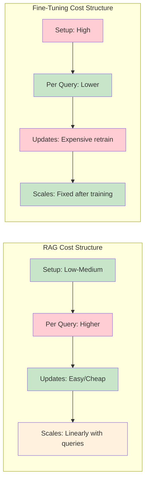
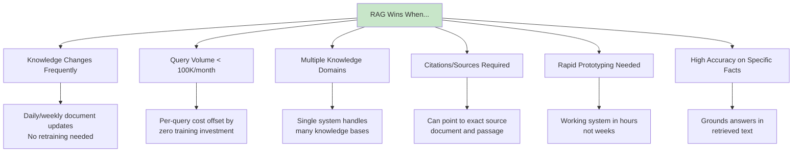
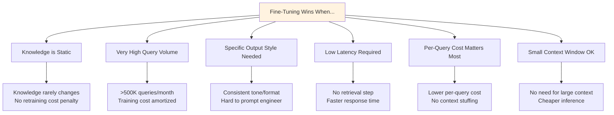
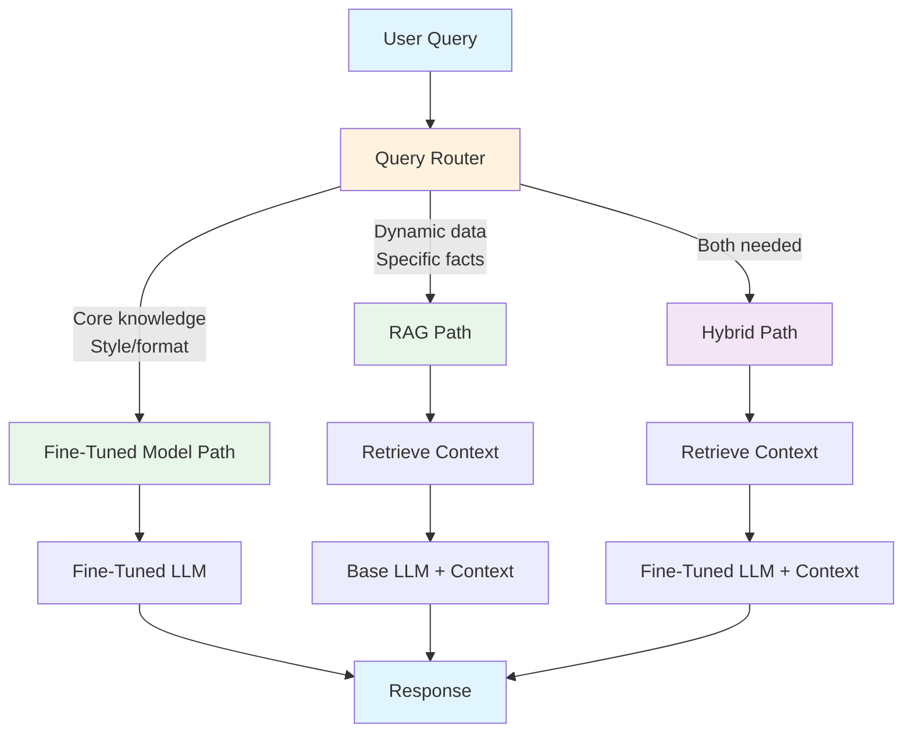

# RAG vs. Fine-Tuning Break-Even Analysis

## Introduction

RAG and fine-tuning are two fundamentally different approaches to giving an LLM access to specialized knowledge. RAG retrieves relevant context at query time from an external knowledge base, while fine-tuning bakes knowledge directly into model weights through additional training. Each approach has different cost structures, update characteristics, and quality tradeoffs.

This lesson builds a rigorous break-even framework to determine when RAG is more cost-effective than fine-tuning, when fine-tuning wins, and when a hybrid approach delivers the best value.

### What You'll Learn

- Compare cost structures of RAG vs. fine-tuning
- Calculate the break-even point between the two approaches
- Identify scenarios where each approach dominates
- Build a decision framework for choosing your approach
- Design hybrid strategies that combine both methods

### Prerequisites

- Completed lessons 01–05 in this unit (cost optimization foundations)
- Understanding of fine-tuning concepts (Unit 25 overview helpful but not required)
- Familiarity with RAG pipeline costs from previous lessons
- Basic understanding of LLM training concepts

---

## Section 1: Cost Structure Comparison

RAG and fine-tuning have fundamentally different cost profiles. RAG has ongoing per-query costs but low upfront investment. Fine-tuning has high upfront training costs but can reduce per-query costs by eliminating retrieval overhead.

### Side-by-Side Cost Structure



### Cost Comparison Model

```python
"""
RAG vs. Fine-Tuning cost comparison model.
"""

from dataclasses import dataclass, field
from enum import Enum
from typing import Optional


class Approach(Enum):
    """Knowledge integration approaches."""
    RAG = "Retrieval-Augmented Generation"
    FINE_TUNING = "Fine-Tuning"
    HYBRID = "Hybrid (RAG + Fine-Tuning)"


@dataclass
class RAGCosts:
    """
    Cost model for a RAG-based system.
    
    RAG costs are dominated by per-query LLM inference
    (due to large context windows) and ongoing storage.
    """
    # Setup costs (one-time)
    document_processing_hours: float = 10.0
    developer_hourly_rate: float = 75.0
    initial_embedding_cost: float = 0.20       # Embed 10K docs with text-3-small
    vector_db_setup: float = 0.0               # Usually free
    
    # Per-query costs
    embedding_per_query: float = 0.000001      # Query embedding
    retrieval_per_query: float = 0.0            # Included in DB subscription
    llm_input_per_query: float = 0.001020       # 2,550 tokens × $0.40/1M (4.1-mini)
    llm_output_per_query: float = 0.000480      # 300 tokens × $1.60/1M
    
    # Monthly fixed costs
    vector_db_monthly: float = 25.0             # Qdrant Cloud or similar
    monitoring_monthly: float = 10.0
    
    # Update costs (per update cycle)
    doc_update_embedding: float = 0.01          # Re-embed updated docs
    update_frequency_monthly: int = 4           # Weekly updates
    
    @property
    def setup_total(self) -> float:
        """Total one-time setup cost."""
        return (
            self.document_processing_hours * self.developer_hourly_rate +
            self.initial_embedding_cost +
            self.vector_db_setup
        )
    
    @property
    def per_query_total(self) -> float:
        """Total cost per query."""
        return (
            self.embedding_per_query +
            self.retrieval_per_query +
            self.llm_input_per_query +
            self.llm_output_per_query
        )
    
    @property
    def monthly_fixed(self) -> float:
        """Total monthly fixed costs."""
        return (
            self.vector_db_monthly +
            self.monitoring_monthly +
            self.doc_update_embedding * self.update_frequency_monthly
        )
    
    def total_cost(self, months: int, monthly_queries: int) -> float:
        """
        Calculate total cost over a time period.
        
        Args:
            months: Number of months
            monthly_queries: Queries per month
        
        Returns:
            Total cost including setup, fixed, and variable
        """
        return (
            self.setup_total +
            self.monthly_fixed * months +
            self.per_query_total * monthly_queries * months
        )


@dataclass
class FineTuningCosts:
    """
    Cost model for a fine-tuned model system.
    
    Fine-tuning has high upfront training costs but lower
    per-query costs since no retrieval context is needed.
    """
    # Training costs (per training run)
    data_preparation_hours: float = 20.0
    developer_hourly_rate: float = 75.0
    training_data_tokens: int = 10_000_000       # 10M tokens training data
    training_cost_per_token: float = 0.000008    # ~$8/1M tokens (GPT-4.1-mini FT)
    validation_cost: float = 50.0                # Evaluation runs
    
    # Per-query costs (no retrieval context needed)
    llm_input_per_query: float = 0.000220        # 550 tokens × $0.40/1M (no context)
    llm_output_per_query: float = 0.000480        # 300 tokens × $1.60/1M
    
    # Monthly fixed costs
    model_hosting_monthly: float = 0.0            # $0 for API-hosted FT models
    monitoring_monthly: float = 10.0
    
    # Retraining costs
    retrain_frequency_monthly: float = 0.25       # Retrain every 4 months
    retrain_cost_multiplier: float = 0.8          # Retraining is slightly cheaper
    
    @property
    def training_total(self) -> float:
        """Total cost for one training run."""
        return (
            self.data_preparation_hours * self.developer_hourly_rate +
            self.training_data_tokens * self.training_cost_per_token +
            self.validation_cost
        )
    
    @property
    def retrain_cost(self) -> float:
        """Cost of a single retraining run."""
        return self.training_total * self.retrain_cost_multiplier
    
    @property
    def per_query_total(self) -> float:
        """Total cost per query (no retrieval overhead)."""
        return self.llm_input_per_query + self.llm_output_per_query
    
    @property
    def monthly_fixed(self) -> float:
        """Total monthly fixed costs including amortized retraining."""
        return (
            self.model_hosting_monthly +
            self.monitoring_monthly +
            self.retrain_cost * self.retrain_frequency_monthly
        )
    
    def total_cost(self, months: int, monthly_queries: int) -> float:
        """
        Calculate total cost over a time period.
        
        Args:
            months: Number of months
            monthly_queries: Queries per month
        
        Returns:
            Total cost including training, fixed, and variable
        """
        return (
            self.training_total +
            self.monthly_fixed * months +
            self.per_query_total * monthly_queries * months
        )
```

### Cost Structure Summary Table

| Cost Component | RAG | Fine-Tuning | Winner |
|:---|:---:|:---:|:---:|
| **Setup/Training** | ~$750 | ~$1,680 | RAG ✅ |
| **Per-Query Cost** | ~$0.001501 | ~$0.000700 | Fine-Tuning ✅ |
| **Monthly Fixed** | ~$35 | ~$345 | RAG ✅ |
| **Knowledge Updates** | Easy (re-embed) | Hard (retrain) | RAG ✅ |
| **Scales with Queries** | Linear | Sub-linear | Fine-Tuning ✅ |
| **Data Requirements** | Unstructured docs | Curated Q&A pairs | RAG ✅ |

> **Key Insight**: RAG is cheaper to start and update, but fine-tuning has a lower per-query cost because it doesn't need to stuff retrieved context into the prompt. The break-even depends entirely on query volume.

---

## Section 2: Break-Even Analysis

The break-even point is the monthly query volume where RAG and fine-tuning have equal total cost over a given time horizon. Below that volume, RAG is cheaper. Above it, fine-tuning is cheaper.

### Mathematical Framework

The total cost for each approach over $n$ months with $q$ queries per month:

$$C_{\text{RAG}}(n, q) = S_R + F_R \cdot n + P_R \cdot q \cdot n$$

$$C_{\text{FT}}(n, q) = S_F + F_F \cdot n + P_F \cdot q \cdot n$$

Where:
- $S$ = setup/training cost
- $F$ = monthly fixed cost
- $P$ = per-query cost
- $n$ = months
- $q$ = monthly queries

**Break-even occurs when** $C_{\text{RAG}} = C_{\text{FT}}$:

$$S_R + F_R \cdot n + P_R \cdot q \cdot n = S_F + F_F \cdot n + P_F \cdot q \cdot n$$

**Solving for $q$ (break-even queries/month):**

$$q^* = \frac{(S_F - S_R) + (F_F - F_R) \cdot n}{(P_R - P_F) \cdot n}$$

### Python Break-Even Calculator

```python
"""
Break-even calculator for RAG vs. Fine-Tuning.
"""

from dataclasses import dataclass
from typing import Optional


@dataclass
class BreakEvenResult:
    """Results from a break-even analysis."""
    break_even_queries_monthly: float
    rag_cheaper_below: bool           # True if RAG is cheaper below break-even
    months_analyzed: int
    rag_total_at_breakeven: float
    ft_total_at_breakeven: float
    
    # Sensitivity data
    rag_cost_at_10k: float = 0.0
    ft_cost_at_10k: float = 0.0
    rag_cost_at_100k: float = 0.0
    ft_cost_at_100k: float = 0.0
    rag_cost_at_1m: float = 0.0
    ft_cost_at_1m: float = 0.0


class BreakEvenAnalyzer:
    """
    Calculates break-even points between RAG and fine-tuning.
    
    Uses the cost models from RAGCosts and FineTuningCosts
    to determine when each approach is more cost-effective.
    """
    
    def __init__(
        self,
        rag_costs: RAGCosts,
        ft_costs: FineTuningCosts
    ):
        self.rag = rag_costs
        self.ft = ft_costs
    
    def calculate_breakeven(
        self, months: int = 12
    ) -> BreakEvenResult:
        """
        Calculate the break-even query volume.
        
        Args:
            months: Time horizon for the analysis
        
        Returns:
            BreakEvenResult with the break-even point
        """
        # Cost difference components
        setup_diff = self.ft.training_total - self.rag.setup_total
        fixed_diff = self.ft.monthly_fixed - self.rag.monthly_fixed
        query_diff = self.rag.per_query_total - self.ft.per_query_total
        
        # Break-even formula: q* = (setup_diff + fixed_diff * n) / (query_diff * n)
        if query_diff <= 0:
            # RAG is cheaper per query — no break-even (RAG always wins)
            break_even_q = float('inf')
        else:
            numerator = setup_diff + (fixed_diff * months)
            denominator = query_diff * months
            break_even_q = numerator / denominator
        
        # Calculate costs at break-even point
        if break_even_q != float('inf') and break_even_q > 0:
            rag_at_be = self.rag.total_cost(months, break_even_q)
            ft_at_be = self.ft.total_cost(months, break_even_q)
        else:
            rag_at_be = ft_at_be = 0.0
        
        # Sensitivity analysis at key volumes
        result = BreakEvenResult(
            break_even_queries_monthly=max(0, break_even_q),
            rag_cheaper_below=True,   # RAG is cheaper below break-even
            months_analyzed=months,
            rag_total_at_breakeven=rag_at_be,
            ft_total_at_breakeven=ft_at_be,
            rag_cost_at_10k=self.rag.total_cost(months, 10_000),
            ft_cost_at_10k=self.ft.total_cost(months, 10_000),
            rag_cost_at_100k=self.rag.total_cost(months, 100_000),
            ft_cost_at_100k=self.ft.total_cost(months, 100_000),
            rag_cost_at_1m=self.rag.total_cost(months, 1_000_000),
            ft_cost_at_1m=self.ft.total_cost(months, 1_000_000),
        )
        
        return result
    
    def print_breakeven_report(self, months: int = 12) -> None:
        """Print a formatted break-even report."""
        result = self.calculate_breakeven(months)
        
        print("=" * 60)
        print("RAG vs. Fine-Tuning Break-Even Analysis")
        print(f"Time Horizon: {months} months")
        print("=" * 60)
        
        print(f"\n--- Cost Parameters ---")
        print(f"  RAG Setup:          ${self.rag.setup_total:>10,.2f}")
        print(f"  FT Training:        ${self.ft.training_total:>10,.2f}")
        print(f"  RAG Per-Query:      ${self.rag.per_query_total:>10.6f}")
        print(f"  FT Per-Query:       ${self.ft.per_query_total:>10.6f}")
        print(f"  RAG Monthly Fixed:  ${self.rag.monthly_fixed:>10,.2f}")
        print(f"  FT Monthly Fixed:   ${self.ft.monthly_fixed:>10,.2f}")
        
        print(f"\n--- Break-Even Point ---")
        if result.break_even_queries_monthly == float('inf'):
            print(f"  No break-even: RAG is always cheaper per query")
        else:
            print(f"  Break-Even Volume:  {result.break_even_queries_monthly:>10,.0f} queries/month")
            print(f"  RAG is cheaper:     < {result.break_even_queries_monthly:,.0f} queries/month")
            print(f"  FT is cheaper:      > {result.break_even_queries_monthly:,.0f} queries/month")
        
        print(f"\n--- Cost at Key Volumes ({months} months) ---")
        print(f"  {'Volume':<20} {'RAG':>12} {'Fine-Tuning':>12} {'Cheaper':>12}")
        print(f"  {'-'*56}")
        
        volumes = [
            ("10K queries/mo", result.rag_cost_at_10k, result.ft_cost_at_10k),
            ("100K queries/mo", result.rag_cost_at_100k, result.ft_cost_at_100k),
            ("1M queries/mo", result.rag_cost_at_1m, result.ft_cost_at_1m),
        ]
        
        for label, rag_cost, ft_cost in volumes:
            cheaper = "RAG ✅" if rag_cost < ft_cost else "FT ✅"
            savings = abs(rag_cost - ft_cost)
            print(f"  {label:<20} ${rag_cost:>10,.2f} ${ft_cost:>10,.2f} {cheaper}")
        
        print("=" * 60)
    
    def sensitivity_analysis(
        self, 
        months: int = 12,
        volumes: list[int] = None
    ) -> list[dict]:
        """
        Run sensitivity analysis across multiple volumes.
        
        Args:
            months: Time horizon
            volumes: Query volumes to analyze
        
        Returns:
            List of dicts with cost comparison at each volume
        """
        if volumes is None:
            volumes = [
                1_000, 5_000, 10_000, 25_000, 50_000,
                100_000, 250_000, 500_000, 1_000_000
            ]
        
        results = []
        
        for vol in volumes:
            rag_total = self.rag.total_cost(months, vol)
            ft_total = self.ft.total_cost(months, vol)
            savings = rag_total - ft_total
            
            results.append({
                "monthly_queries": vol,
                "rag_total": rag_total,
                "ft_total": ft_total,
                "savings": savings,               # Positive = FT cheaper
                "cheaper": "RAG" if savings > 0 else "Fine-Tuning",
                "savings_pct": abs(savings) / max(rag_total, ft_total) * 100,
            })
        
        return results
    
    def print_sensitivity_table(self, months: int = 12) -> None:
        """Print a sensitivity analysis table."""
        results = self.sensitivity_analysis(months)
        
        print(f"\n{'='*75}")
        print(f"Sensitivity Analysis — {months}-Month Total Cost")
        print(f"{'='*75}")
        print(f"{'Queries/Mo':>12} {'RAG Total':>12} {'FT Total':>12} "
              f"{'Savings':>12} {'Cheaper':>12}")
        print(f"{'-'*75}")
        
        for r in results:
            print(
                f"{r['monthly_queries']:>12,} "
                f"${r['rag_total']:>10,.2f} "
                f"${r['ft_total']:>10,.2f} "
                f"${abs(r['savings']):>10,.2f} "
                f"  {r['cheaper']:>10}"
            )
        
        print(f"{'='*75}")


# Example: Run a break-even analysis with default costs
def demonstrate_breakeven():
    """Demonstrate break-even analysis with realistic costs."""
    rag = RAGCosts()
    ft = FineTuningCosts()
    
    analyzer = BreakEvenAnalyzer(rag, ft)
    analyzer.print_breakeven_report(months=12)
    analyzer.print_sensitivity_table(months=12)
```

### Break-Even Reference Table (12-Month Horizon)

| Monthly Queries | RAG Total (12 mo) | FT Total (12 mo) | Cheaper | Savings |
|---:|---:|---:|:---|---:|
| 1,000 | ~$1,390 | ~$5,920 | RAG ✅ | $4,530 |
| 5,000 | ~$1,680 | ~$6,220 | RAG ✅ | $4,540 |
| 10,000 | ~$2,050 | ~$6,600 | RAG ✅ | $4,550 |
| 25,000 | ~$3,160 | ~$7,720 | RAG ✅ | $4,560 |
| 50,000 | ~$4,720 | ~$9,220 | RAG ✅ | $4,500 |
| 100,000 | ~$7,840 | ~$12,220 | RAG ✅ | $4,380 |
| 250,000 | ~$17,200 | ~$21,220 | RAG ✅ | $4,020 |
| 500,000 | ~$30,480 | ~$36,220 | RAG ✅ | $5,740 |
| 1,000,000 | ~$56,480 | ~$66,220 | RAG ✅ | $9,740 |

> **Important Note**: With the default model parameters (GPT-4.1-mini for both RAG and fine-tuning base), RAG is cheaper across most practical volumes because the fine-tuning retraining overhead and higher monthly fixed costs offset the per-query savings. The break-even shifts dramatically when you use a more expensive base model for RAG or when knowledge is truly static (no retraining needed).

---

## Section 3: When RAG Wins

RAG is the better choice in specific scenarios where its strengths — dynamic knowledge, low setup cost, and flexibility — outweigh its higher per-query cost.

### RAG Advantages



### RAG Advantage Calculator

```python
"""
Quantify RAG's advantages in specific scenarios.
"""

from dataclasses import dataclass
from enum import Enum


class UpdateFrequency(Enum):
    """How often knowledge changes."""
    REAL_TIME = ("Real-time", 30.0)      # 30 updates/month
    DAILY = ("Daily", 20.0)               # 20 updates/month
    WEEKLY = ("Weekly", 4.0)              # 4 updates/month
    MONTHLY = ("Monthly", 1.0)            # 1 update/month
    QUARTERLY = ("Quarterly", 0.25)       # Every 4 months
    RARELY = ("Rarely", 0.08)             # ~Once a year
    
    def __init__(self, label: str, updates_per_month: float):
        self.label = label
        self.updates_per_month = updates_per_month


@dataclass
class RAGAdvantageScore:
    """Quantified advantage of RAG over fine-tuning."""
    update_advantage: float        # 0-100, higher = RAG better
    cost_advantage: float          # 0-100
    flexibility_advantage: float   # 0-100
    accuracy_advantage: float      # 0-100
    time_to_deploy_advantage: float  # 0-100
    overall_score: float           # 0-100 weighted average
    recommendation: str


def calculate_rag_advantage(
    update_frequency: UpdateFrequency,
    monthly_queries: int,
    knowledge_domains: int,
    needs_citations: bool,
    needs_rapid_deploy: bool,
    factual_accuracy_critical: bool,
) -> RAGAdvantageScore:
    """
    Calculate RAG's advantage score for a given scenario.
    
    Args:
        update_frequency: How often knowledge changes
        monthly_queries: Expected monthly query volume
        knowledge_domains: Number of distinct knowledge domains
        needs_citations: Whether source citations are required
        needs_rapid_deploy: Whether fast deployment is critical
        factual_accuracy_critical: Whether factual accuracy is paramount
    
    Returns:
        RAGAdvantageScore with component and overall scores
    """
    # Update advantage: RAG shines with frequent updates
    update_scores = {
        UpdateFrequency.REAL_TIME: 95,
        UpdateFrequency.DAILY: 90,
        UpdateFrequency.WEEKLY: 80,
        UpdateFrequency.MONTHLY: 60,
        UpdateFrequency.QUARTERLY: 30,
        UpdateFrequency.RARELY: 10,
    }
    update_adv = update_scores.get(update_frequency, 50)
    
    # Cost advantage: RAG cheaper at low volumes
    if monthly_queries < 10_000:
        cost_adv = 90
    elif monthly_queries < 50_000:
        cost_adv = 75
    elif monthly_queries < 100_000:
        cost_adv = 60
    elif monthly_queries < 500_000:
        cost_adv = 40
    elif monthly_queries < 1_000_000:
        cost_adv = 25
    else:
        cost_adv = 10
    
    # Flexibility advantage: multiple domains favor RAG
    flexibility_adv = min(95, 30 + knowledge_domains * 15)
    
    # Accuracy advantage
    accuracy_adv = 80 if factual_accuracy_critical else 40
    if needs_citations:
        accuracy_adv = min(95, accuracy_adv + 20)
    
    # Time to deploy advantage
    deploy_adv = 85 if needs_rapid_deploy else 40
    
    # Weighted overall score
    weights = {
        "update": 0.30,
        "cost": 0.25,
        "flexibility": 0.15,
        "accuracy": 0.20,
        "deploy": 0.10,
    }
    
    overall = (
        update_adv * weights["update"] +
        cost_adv * weights["cost"] +
        flexibility_adv * weights["flexibility"] +
        accuracy_adv * weights["accuracy"] +
        deploy_adv * weights["deploy"]
    )
    
    # Generate recommendation
    if overall >= 70:
        recommendation = "Strong RAG recommendation"
    elif overall >= 50:
        recommendation = "RAG preferred, consider hybrid"
    elif overall >= 30:
        recommendation = "Hybrid approach recommended"
    else:
        recommendation = "Fine-tuning likely better"
    
    return RAGAdvantageScore(
        update_advantage=update_adv,
        cost_advantage=cost_adv,
        flexibility_advantage=flexibility_adv,
        accuracy_advantage=accuracy_adv,
        time_to_deploy_advantage=deploy_adv,
        overall_score=overall,
        recommendation=recommendation,
    )


# Example: Customer support knowledge base
support_score = calculate_rag_advantage(
    update_frequency=UpdateFrequency.WEEKLY,
    monthly_queries=25_000,
    knowledge_domains=3,         # Products, policies, troubleshooting
    needs_citations=True,        # Link to support articles
    needs_rapid_deploy=True,
    factual_accuracy_critical=True,
)

print(f"Customer Support RAG Score: {support_score.overall_score:.0f}/100")
print(f"Recommendation: {support_score.recommendation}")
# Output: Score ~81/100, "Strong RAG recommendation"
```

### Scenarios Where RAG Dominates

| Scenario | Update Freq | Volume | Domains | RAG Score |
|:---|:---:|:---:|:---:|:---:|
| Customer support KB | Weekly | 25K | 3 | ~81 ✅ |
| Legal document search | Monthly | 5K | 5 | ~77 ✅ |
| News/research assistant | Daily | 10K | 1 | ~80 ✅ |
| E-commerce product Q&A | Weekly | 50K | 1 | ~68 ✅ |
| Internal wiki assistant | Weekly | 2K | 4 | ~84 ✅ |
| Medical literature review | Monthly | 3K | 2 | ~75 ✅ |

---

## Section 4: When Fine-Tuning Wins

Fine-tuning excels when knowledge is static, query volume is very high, and the task requires a specific output style or format that's hard to achieve through prompting alone.

### Fine-Tuning Advantages



### Fine-Tuning Cost Advantage Model

```python
"""
Quantify fine-tuning advantages in specific scenarios.
"""

from dataclasses import dataclass


@dataclass
class FineTuningAdvantageScore:
    """Quantified advantage of fine-tuning over RAG."""
    volume_advantage: float          # 0-100
    stability_advantage: float       # 0-100
    latency_advantage: float         # 0-100
    style_advantage: float           # 0-100
    simplicity_advantage: float      # 0-100
    overall_score: float
    recommendation: str


def calculate_ft_advantage(
    monthly_queries: int,
    knowledge_stability: str,        # "static", "slow", "moderate", "fast"
    needs_custom_style: bool,
    latency_critical: bool,
    has_training_data: bool,
    team_has_ml_expertise: bool,
) -> FineTuningAdvantageScore:
    """
    Calculate fine-tuning's advantage score.
    
    Args:
        monthly_queries: Expected monthly query volume
        knowledge_stability: How stable the knowledge is
        needs_custom_style: Whether a specific output style is needed
        latency_critical: Whether sub-100ms latency is required
        has_training_data: Whether curated training data exists
        team_has_ml_expertise: Whether the team can manage fine-tuning
    
    Returns:
        FineTuningAdvantageScore with component and overall scores
    """
    # Volume advantage: FT wins at high volumes
    if monthly_queries > 5_000_000:
        vol_adv = 95
    elif monthly_queries > 1_000_000:
        vol_adv = 80
    elif monthly_queries > 500_000:
        vol_adv = 65
    elif monthly_queries > 100_000:
        vol_adv = 45
    elif monthly_queries > 50_000:
        vol_adv = 30
    else:
        vol_adv = 10
    
    # Stability advantage: FT wins with static knowledge
    stability_scores = {
        "static": 90,     # Never changes
        "slow": 65,       # Changes quarterly
        "moderate": 35,   # Changes monthly
        "fast": 10,       # Changes weekly or daily
    }
    stab_adv = stability_scores.get(knowledge_stability, 50)
    
    # Latency advantage
    lat_adv = 75 if latency_critical else 30
    
    # Style advantage
    style_adv = 80 if needs_custom_style else 20
    
    # Simplicity (no retrieval pipeline to maintain)
    # But offset by training complexity
    if has_training_data and team_has_ml_expertise:
        simp_adv = 60
    elif has_training_data:
        simp_adv = 40
    else:
        simp_adv = 15   # Need to create training data — huge effort
    
    # Weighted overall score
    weights = {
        "volume": 0.25,
        "stability": 0.30,
        "latency": 0.15,
        "style": 0.15,
        "simplicity": 0.15,
    }
    
    overall = (
        vol_adv * weights["volume"] +
        stab_adv * weights["stability"] +
        lat_adv * weights["latency"] +
        style_adv * weights["style"] +
        simp_adv * weights["simplicity"]
    )
    
    if overall >= 70:
        recommendation = "Strong fine-tuning recommendation"
    elif overall >= 50:
        recommendation = "Fine-tuning preferred, consider hybrid"
    elif overall >= 30:
        recommendation = "Hybrid approach recommended"
    else:
        recommendation = "RAG likely better"
    
    return FineTuningAdvantageScore(
        volume_advantage=vol_adv,
        stability_advantage=stab_adv,
        latency_advantage=lat_adv,
        style_advantage=style_adv,
        simplicity_advantage=simp_adv,
        overall_score=overall,
        recommendation=recommendation,
    )


# Example: Brand-voice chatbot with static FAQs
brand_score = calculate_ft_advantage(
    monthly_queries=2_000_000,
    knowledge_stability="static",
    needs_custom_style=True,
    latency_critical=True,
    has_training_data=True,
    team_has_ml_expertise=True,
)

print(f"Brand Chatbot FT Score: {brand_score.overall_score:.0f}/100")
print(f"Recommendation: {brand_score.recommendation}")
# Output: Score ~80/100, "Strong fine-tuning recommendation"
```

### Scenarios Where Fine-Tuning Dominates

| Scenario | Knowledge | Volume | Style | FT Score |
|:---|:---:|:---:|:---:|:---:|
| Brand-voice chatbot | Static | 2M | Custom | ~80 ✅ |
| Code completion model | Slow change | 5M | Custom | ~78 ✅ |
| Sentiment classifier | Static | 10M | Fixed format | ~85 ✅ |
| Translation assistant | Static | 1M | Specific | ~73 ✅ |
| Form data extraction | Static | 3M | Structured | ~82 ✅ |

---

## Section 5: Hybrid Approaches

The most cost-effective solution often combines both approaches: use fine-tuning for stable core knowledge and consistent style, and RAG for dynamic or specialized information.

### Hybrid Architecture



### Hybrid Strategy Implementation

```python
"""
Hybrid RAG + Fine-Tuning strategy with cost optimization.
"""

from dataclasses import dataclass, field
from enum import Enum
from typing import Optional


class QueryRoute(Enum):
    """Where to route a query in a hybrid system."""
    FINE_TUNED = "fine-tuned"       # Use fine-tuned model only
    RAG = "rag"                     # Use RAG pipeline
    HYBRID = "hybrid"              # Fine-tuned model + RAG context


@dataclass
class HybridConfig:
    """Configuration for a hybrid RAG + Fine-Tuning system."""
    # Fine-tuned model for core knowledge
    ft_model_name: str = "ft:gpt-4.1-mini:company:support-v3"
    ft_input_price: float = 0.40        # Same as base for OpenAI FT
    ft_output_price: float = 1.60
    ft_training_cost: float = 1680.0    # One-time training
    
    # RAG components for dynamic knowledge
    rag_embedding_model: str = "text-embedding-3-small"
    rag_embedding_price: float = 0.02   # Per 1M tokens
    rag_llm_name: str = "gpt-4.1-nano"  # Cheap model for RAG
    rag_llm_input_price: float = 0.10
    rag_llm_output_price: float = 0.40
    
    # Routing distribution (estimated)
    pct_fine_tuned: float = 0.50         # 50% of queries
    pct_rag: float = 0.30               # 30% of queries
    pct_hybrid: float = 0.20            # 20% of queries
    
    # Query profile
    avg_query_tokens: int = 50
    avg_context_tokens: int = 2000      # Only for RAG/hybrid paths
    avg_system_tokens: int = 200        # Shorter for FT (no RAG instructions)
    avg_output_tokens: int = 300


@dataclass
class HybridCostResult:
    """Cost analysis for a hybrid system."""
    ft_only_cost: float             # If everything went through FT
    rag_only_cost: float            # If everything went through RAG
    hybrid_cost: float              # Actual hybrid cost
    savings_vs_rag: float           # Savings compared to pure RAG
    savings_vs_ft: float            # Savings compared to pure FT
    savings_pct_vs_rag: float
    savings_pct_vs_ft: float
    effective_per_query: float


class HybridCostAnalyzer:
    """
    Analyze costs for a hybrid RAG + Fine-Tuning system.
    
    Models the cost of routing queries to different backends
    based on the query type and content.
    """
    
    def __init__(self, config: HybridConfig):
        self.config = config
    
    def _ft_query_cost(self) -> float:
        """Cost of a query through the fine-tuned model only."""
        input_tokens = (
            self.config.avg_query_tokens + self.config.avg_system_tokens
        )
        input_cost = (input_tokens / 1_000_000) * self.config.ft_input_price
        output_cost = (
            self.config.avg_output_tokens / 1_000_000
        ) * self.config.ft_output_price
        return input_cost + output_cost
    
    def _rag_query_cost(self) -> float:
        """Cost of a query through the RAG pipeline."""
        # Embedding cost
        embed_cost = (
            self.config.avg_query_tokens / 1_000_000
        ) * self.config.rag_embedding_price
        
        # LLM cost with retrieved context
        input_tokens = (
            self.config.avg_query_tokens +
            self.config.avg_context_tokens +
            self.config.avg_system_tokens + 300  # RAG instructions overhead
        )
        input_cost = (input_tokens / 1_000_000) * self.config.rag_llm_input_price
        output_cost = (
            self.config.avg_output_tokens / 1_000_000
        ) * self.config.rag_llm_output_price
        
        return embed_cost + input_cost + output_cost
    
    def _hybrid_query_cost(self) -> float:
        """Cost of a query through both FT model + RAG context."""
        # Embedding for retrieval
        embed_cost = (
            self.config.avg_query_tokens / 1_000_000
        ) * self.config.rag_embedding_price
        
        # FT model with retrieved context
        input_tokens = (
            self.config.avg_query_tokens +
            self.config.avg_context_tokens +
            self.config.avg_system_tokens
        )
        input_cost = (input_tokens / 1_000_000) * self.config.ft_input_price
        output_cost = (
            self.config.avg_output_tokens / 1_000_000
        ) * self.config.ft_output_price
        
        return embed_cost + input_cost + output_cost
    
    def analyze(
        self, monthly_queries: int, months: int = 12
    ) -> HybridCostResult:
        """
        Analyze hybrid system costs vs. pure approaches.
        
        Args:
            monthly_queries: Total monthly query volume
            months: Time horizon
        
        Returns:
            HybridCostResult with comparison data
        """
        # Hybrid cost (blended based on routing distribution)
        blended_per_query = (
            self._ft_query_cost() * self.config.pct_fine_tuned +
            self._rag_query_cost() * self.config.pct_rag +
            self._hybrid_query_cost() * self.config.pct_hybrid
        )
        
        total_queries = monthly_queries * months
        
        # Hybrid total (includes FT training + RAG infrastructure)
        rag_monthly_fixed = 35.0     # Vector DB + monitoring
        hybrid_total = (
            self.config.ft_training_cost +    # One-time FT training
            rag_monthly_fixed * months +       # RAG infrastructure
            blended_per_query * total_queries
        )
        
        # Pure RAG cost
        rag_setup = 750.0
        rag_per_query = self._rag_query_cost()
        rag_total = (
            rag_setup +
            rag_monthly_fixed * months +
            rag_per_query * total_queries
        )
        
        # Pure FT cost
        ft_monthly_fixed = 345.0     # Hosting + retraining amortized
        ft_per_query = self._ft_query_cost()
        ft_total = (
            self.config.ft_training_cost +
            ft_monthly_fixed * months +
            ft_per_query * total_queries
        )
        
        savings_vs_rag = rag_total - hybrid_total
        savings_vs_ft = ft_total - hybrid_total
        
        return HybridCostResult(
            ft_only_cost=ft_total,
            rag_only_cost=rag_total,
            hybrid_cost=hybrid_total,
            savings_vs_rag=savings_vs_rag,
            savings_vs_ft=savings_vs_ft,
            savings_pct_vs_rag=(savings_vs_rag / rag_total * 100) if rag_total > 0 else 0,
            savings_pct_vs_ft=(savings_vs_ft / ft_total * 100) if ft_total > 0 else 0,
            effective_per_query=hybrid_total / total_queries if total_queries > 0 else 0,
        )
    
    def print_hybrid_report(
        self, monthly_queries: int, months: int = 12
    ) -> None:
        """Print a formatted hybrid cost report."""
        result = self.analyze(monthly_queries, months)
        
        print("=" * 60)
        print("Hybrid RAG + Fine-Tuning Cost Analysis")
        print(f"Volume: {monthly_queries:,} queries/mo × {months} months")
        print("=" * 60)
        
        print(f"\n--- Per-Query Costs ---")
        print(f"  FT-only path:       ${self._ft_query_cost():.6f}")
        print(f"  RAG-only path:      ${self._rag_query_cost():.6f}")
        print(f"  Hybrid path:        ${self._hybrid_query_cost():.6f}")
        print(f"  Blended average:    ${result.effective_per_query:.6f}")
        
        print(f"\n--- Routing Distribution ---")
        print(f"  Fine-tuned only:    {self.config.pct_fine_tuned:.0%}")
        print(f"  RAG only:           {self.config.pct_rag:.0%}")
        print(f"  Hybrid (FT + RAG):  {self.config.pct_hybrid:.0%}")
        
        print(f"\n--- {months}-Month Total Cost ---")
        print(f"  Pure RAG:           ${result.rag_only_cost:>10,.2f}")
        print(f"  Pure Fine-Tuning:   ${result.ft_only_cost:>10,.2f}")
        print(f"  Hybrid:             ${result.hybrid_cost:>10,.2f}")
        
        print(f"\n--- Savings ---")
        print(f"  vs. Pure RAG:       ${result.savings_vs_rag:>10,.2f} "
              f"({result.savings_pct_vs_rag:.1f}%)")
        print(f"  vs. Pure FT:        ${result.savings_vs_ft:>10,.2f} "
              f"({result.savings_pct_vs_ft:.1f}%)")
        print("=" * 60)


# Example: Customer support with brand voice + dynamic KB
def demonstrate_hybrid():
    """Show hybrid analysis for customer support."""
    config = HybridConfig(
        pct_fine_tuned=0.50,    # FAQ and brand-voice responses
        pct_rag=0.30,           # Product/policy lookups
        pct_hybrid=0.20,        # Complex queries needing both
    )
    
    analyzer = HybridCostAnalyzer(config)
    
    for volume in [10_000, 100_000, 500_000]:
        analyzer.print_hybrid_report(volume, months=12)
        print()
```

### Hybrid Strategy Decision Matrix

| Query Type | Route To | Why | Example |
|:---|:---:|:---|:---|
| FAQs / common questions | Fine-Tuned | Static, high volume, consistent tone | "What's your return policy?" |
| Product-specific lookups | RAG | Dynamic catalog, need exact details | "What are the specs of Model X?" |
| Policy questions | RAG | Policies update regularly | "What changed in the 2025 terms?" |
| Brand-voice responses | Fine-Tuned | Consistent style matters | "Write me an apology email" |
| Complex troubleshooting | Hybrid | Need style + specific KB articles | "My X isn't connecting to Y" |
| Recent news/updates | RAG | Knowledge too new for training data | "What was announced last week?" |

---

## Section 6: Decision Framework

Use this comprehensive framework to choose between RAG, fine-tuning, and hybrid approaches based on your specific constraints.

### The Decision Matrix

```python
"""
Comprehensive decision framework for RAG vs. Fine-Tuning vs. Hybrid.
"""

from dataclasses import dataclass
from enum import Enum
from typing import Optional


class Decision(Enum):
    """Final recommendation."""
    RAG = "Use RAG"
    FINE_TUNING = "Use Fine-Tuning"
    HYBRID = "Use Hybrid (RAG + Fine-Tuning)"


@dataclass
class ProjectProfile:
    """Complete project profile for decision-making."""
    # Volume and budget
    monthly_queries: int
    monthly_budget: float
    
    # Knowledge characteristics
    knowledge_update_frequency: str    # "daily", "weekly", "monthly", "rarely"
    knowledge_domains: int             # Number of distinct domains
    corpus_size_documents: int
    knowledge_is_structured: bool      # Curated Q&A pairs available?
    
    # Quality requirements
    needs_citations: bool
    needs_custom_style: bool
    factual_accuracy_critical: bool
    latency_requirement_ms: int
    
    # Team and timeline
    team_size: int
    team_has_ml_expertise: bool
    deployment_deadline_weeks: int
    
    # Data constraints
    data_sensitivity: str              # "public", "internal", "confidential"


def make_decision(profile: ProjectProfile) -> tuple[Decision, str, list[str]]:
    """
    Make a recommendation based on the project profile.
    
    Args:
        profile: Complete project profile
    
    Returns:
        Tuple of (Decision, reasoning, action_items)
    """
    scores = {"rag": 0, "ft": 0, "hybrid": 0}
    reasons = []
    
    # --- Knowledge dynamics ---
    if profile.knowledge_update_frequency in ("daily", "weekly"):
        scores["rag"] += 30
        scores["hybrid"] += 15
        reasons.append(
            f"Frequent updates ({profile.knowledge_update_frequency}) "
            f"favor RAG (+30) or hybrid (+15)"
        )
    elif profile.knowledge_update_frequency == "monthly":
        scores["rag"] += 15
        scores["hybrid"] += 20
        reasons.append(
            "Monthly updates favor hybrid (+20) with RAG for dynamic content"
        )
    else:
        scores["ft"] += 25
        scores["hybrid"] += 10
        reasons.append(
            "Static knowledge favors fine-tuning (+25)"
        )
    
    # --- Volume ---
    if profile.monthly_queries < 50_000:
        scores["rag"] += 25
        reasons.append(
            f"Low volume ({profile.monthly_queries:,}/mo) favors RAG (+25)"
        )
    elif profile.monthly_queries < 500_000:
        scores["hybrid"] += 20
        scores["rag"] += 10
        reasons.append(
            f"Medium volume ({profile.monthly_queries:,}/mo) favors hybrid (+20)"
        )
    else:
        scores["ft"] += 20
        scores["hybrid"] += 15
        reasons.append(
            f"High volume ({profile.monthly_queries:,}/mo) favors FT (+20)"
        )
    
    # --- Citations ---
    if profile.needs_citations:
        scores["rag"] += 20
        scores["hybrid"] += 15
        reasons.append("Citation requirement favors RAG (+20)")
    
    # --- Custom style ---
    if profile.needs_custom_style:
        scores["ft"] += 15
        scores["hybrid"] += 15
        reasons.append("Custom style requirement favors FT (+15) and hybrid (+15)")
    
    # --- Accuracy ---
    if profile.factual_accuracy_critical:
        scores["rag"] += 15
        scores["hybrid"] += 10
        reasons.append("Factual accuracy favors RAG grounding (+15)")
    
    # --- Latency ---
    if profile.latency_requirement_ms < 200:
        scores["ft"] += 15
        reasons.append("Low latency requirement favors FT (+15)")
    
    # --- Team expertise ---
    if not profile.team_has_ml_expertise:
        scores["rag"] += 15
        scores["ft"] -= 10
        reasons.append("No ML expertise penalizes FT (-10), favors RAG (+15)")
    
    # --- Timeline ---
    if profile.deployment_deadline_weeks < 4:
        scores["rag"] += 20
        scores["ft"] -= 10
        reasons.append(
            f"Tight deadline ({profile.deployment_deadline_weeks} weeks) "
            f"favors RAG (+20)"
        )
    
    # --- Training data ---
    if not profile.knowledge_is_structured:
        scores["ft"] -= 15
        reasons.append("No structured training data penalizes FT (-15)")
    
    # --- Multiple domains ---
    if profile.knowledge_domains > 3:
        scores["rag"] += 10
        scores["hybrid"] += 10
        reasons.append(
            f"Multiple domains ({profile.knowledge_domains}) favor RAG/hybrid (+10)"
        )
    
    # --- Make decision ---
    best = max(scores, key=scores.get)
    
    decision_map = {
        "rag": Decision.RAG,
        "ft": Decision.FINE_TUNING,
        "hybrid": Decision.HYBRID,
    }
    
    decision = decision_map[best]
    
    # Generate action items
    action_items = []
    if decision == Decision.RAG:
        action_items = [
            "Set up vector database (Qdrant Cloud or Pinecone recommended)",
            "Implement document chunking and embedding pipeline",
            "Configure prompt caching for cost optimization",
            "Add response caching for common queries",
            "Set up cost monitoring with daily budget alerts",
        ]
    elif decision == Decision.FINE_TUNING:
        action_items = [
            "Prepare training dataset (minimum 100 high-quality examples)",
            "Run fine-tuning job on selected base model",
            "Evaluate fine-tuned model against test set",
            "Set up retraining pipeline for periodic updates",
            "Monitor output quality with automated evaluation",
        ]
    else:
        action_items = [
            "Fine-tune model on core/static knowledge + style",
            "Set up RAG pipeline for dynamic content",
            "Build query router to direct queries appropriately",
            "Implement shared caching across both paths",
            "Monitor routing accuracy and adjust thresholds",
        ]
    
    reasoning = (
        f"Scores — RAG: {scores['rag']}, FT: {scores['ft']}, "
        f"Hybrid: {scores['hybrid']}. "
        + " | ".join(reasons[:3])  # Top 3 reasons
    )
    
    return decision, reasoning, action_items


def print_decision_report(profile: ProjectProfile) -> None:
    """Print a formatted decision report."""
    decision, reasoning, actions = make_decision(profile)
    
    print("=" * 65)
    print("RAG vs. Fine-Tuning Decision Report")
    print("=" * 65)
    
    print(f"\n📊 Project Profile:")
    print(f"  Monthly Queries:     {profile.monthly_queries:,}")
    print(f"  Monthly Budget:      ${profile.monthly_budget:,.0f}")
    print(f"  Knowledge Updates:   {profile.knowledge_update_frequency}")
    print(f"  Domains:             {profile.knowledge_domains}")
    print(f"  Team Size:           {profile.team_size}")
    print(f"  ML Expertise:        {'Yes' if profile.team_has_ml_expertise else 'No'}")
    print(f"  Deadline:            {profile.deployment_deadline_weeks} weeks")
    
    print(f"\n🎯 Recommendation: {decision.value}")
    print(f"\n📝 Reasoning:")
    print(f"  {reasoning}")
    
    print(f"\n✅ Action Items:")
    for i, action in enumerate(actions, 1):
        print(f"  {i}. {action}")
    
    print("=" * 65)


# Example scenarios
def demonstrate_decisions():
    """Show decision framework for three different projects."""
    
    # Scenario 1: Startup customer support
    startup = ProjectProfile(
        monthly_queries=15_000,
        monthly_budget=500,
        knowledge_update_frequency="weekly",
        knowledge_domains=2,
        corpus_size_documents=500,
        knowledge_is_structured=False,
        needs_citations=True,
        needs_custom_style=False,
        factual_accuracy_critical=True,
        latency_requirement_ms=500,
        team_size=2,
        team_has_ml_expertise=False,
        deployment_deadline_weeks=3,
        data_sensitivity="internal",
    )
    
    print("\n--- Scenario 1: Startup Customer Support ---")
    print_decision_report(startup)
    
    # Scenario 2: Enterprise brand chatbot
    enterprise = ProjectProfile(
        monthly_queries=2_000_000,
        monthly_budget=10_000,
        knowledge_update_frequency="rarely",
        knowledge_domains=1,
        corpus_size_documents=200,
        knowledge_is_structured=True,
        needs_citations=False,
        needs_custom_style=True,
        factual_accuracy_critical=False,
        latency_requirement_ms=100,
        team_size=10,
        team_has_ml_expertise=True,
        deployment_deadline_weeks=12,
        data_sensitivity="public",
    )
    
    print("\n--- Scenario 2: Enterprise Brand Chatbot ---")
    print_decision_report(enterprise)
    
    # Scenario 3: Legal research assistant
    legal = ProjectProfile(
        monthly_queries=50_000,
        monthly_budget=3_000,
        knowledge_update_frequency="monthly",
        knowledge_domains=5,
        corpus_size_documents=100_000,
        knowledge_is_structured=False,
        needs_citations=True,
        needs_custom_style=False,
        factual_accuracy_critical=True,
        latency_requirement_ms=1000,
        team_size=4,
        team_has_ml_expertise=False,
        deployment_deadline_weeks=8,
        data_sensitivity="confidential",
    )
    
    print("\n--- Scenario 3: Legal Research Assistant ---")
    print_decision_report(legal)
```

### Quick Decision Reference

```
                    RAG                           Fine-Tuning
                    ───                           ───────────
Setup Time:         Hours to days                 Days to weeks
Setup Cost:         $500 - $2,000                 $1,500 - $10,000+
Per-Query Cost:     $0.0003 - $0.008              $0.0001 - $0.003
Knowledge Updates:  Minutes (re-embed)            Hours/days (retrain)
Best Volume:        < 500K queries/month          > 500K queries/month
Citations:          ✅ Built-in                    ❌ Not available
Custom Style:       ⚠️ Prompt engineering          ✅ Learned from data
Accuracy:           ✅ Grounded in docs            ⚠️ May hallucinate
Latency:            Higher (retrieval step)        Lower (direct inference)
Team Skill:         Software engineering           ML engineering
```

---

## Summary

### Key Takeaways

1. **RAG wins for dynamic knowledge** — when your knowledge base changes weekly or more frequently, the retraining cost of fine-tuning eliminates its per-query advantage
2. **Fine-tuning wins at very high volume with static knowledge** — above ~500K queries/month with rarely changing knowledge, the lower per-query cost offsets training investment
3. **Hybrid is often the best answer** — combine fine-tuning for core knowledge and style with RAG for dynamic content to get the best of both approaches
4. **The break-even depends on your specific costs** — model choice, optimization level, update frequency, and team expertise all shift the crossover point significantly
5. **Consider non-cost factors** — citations, accuracy grounding, deployment speed, and team expertise are often more important than pure cost optimization

### Decision Quick Reference

| Factor | Favors RAG | Favors Fine-Tuning |
|:---|:---|:---|
| **Knowledge updates** | Daily/Weekly | Quarterly/Never |
| **Query volume** | < 100K/month | > 500K/month |
| **Citations needed** | Yes | No |
| **Custom style** | No | Yes |
| **Team expertise** | Software eng | ML eng |
| **Deployment timeline** | < 4 weeks | > 8 weeks |
| **Training data** | Not available | Curated & ready |
| **Budget** | Limited | Flexible |

### What's Next

Congratulations! You've completed the **RAG Cost Optimization** lesson — the final lesson in Unit 9: Retrieval-Augmented Generation. You now have a comprehensive toolkit for building cost-effective RAG systems, from individual component optimization to full TCO analysis and architectural decision-making.

Continue to **Unit 10: Function Calling & Tool Use** to learn how to extend LLMs with external tools and APIs.

---

## Practice Exercises

### Exercise 1: Custom Break-Even Analysis
Analyze your specific use case:
1. Define your RAG costs (embedding model, LLM, vector DB)
2. Define your fine-tuning costs (training data, model, retraining)
3. Calculate the break-even query volume over 12 months
4. Plot the cost curves and identify the crossover point
5. Factor in knowledge update costs for your update frequency

### Exercise 2: Hybrid Architecture Design
Design a hybrid system for a customer support platform:
1. Categorize query types (FAQ, product lookup, troubleshooting, complaints)
2. Assign routing percentages to FT, RAG, and hybrid paths
3. Calculate the blended per-query cost
4. Compare against pure RAG and pure fine-tuning
5. Estimate 12-month TCO with your routing distribution

### Exercise 3: Decision Framework Application
Apply the decision framework to three different projects:
1. An internal HR knowledge assistant (small team, 5K queries/month)
2. A consumer-facing cooking recipe chatbot (500K queries/month)
3. A financial compliance document analyzer (50K queries/month, confidential)
4. For each, calculate scores and justify the recommendation
5. Identify which factors had the biggest impact on the decision

---

## Navigation

| Previous | Up | Next |
|:---|:---:|---:|
| [Cost Comparison Analysis](./05-cost-comparison-analysis.md) | [Cost Optimization Overview](./00-rag-cost-optimization.md) | [Unit 10: Function Calling & Tool Use](../../10-function-calling-tool-use/) |
