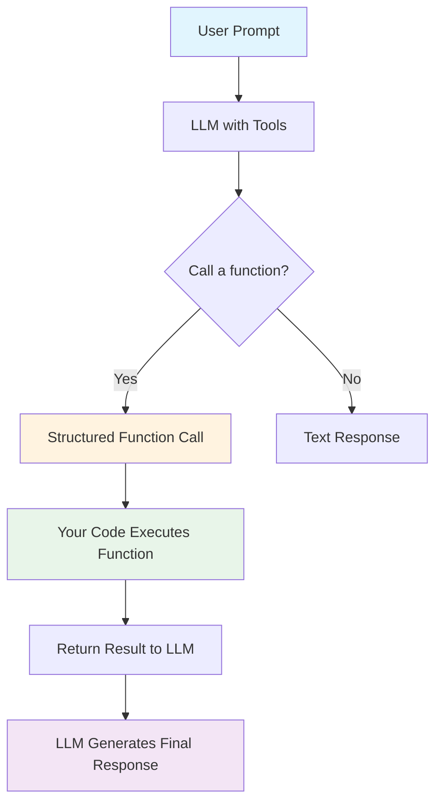

# Function Calling Concepts

## Overview

Function calling (also known as tool calling or tool use) is the mechanism that transforms AI models from text generators into action-takers. Instead of only producing natural language responses, models equipped with function calling can recognize when a user's request requires external capabilities — and generate structured requests to invoke those capabilities.

This lesson establishes the foundational understanding you need before writing any function calling code. We explore what function calling is, how models decide when to use it, how it compares to older prompt-based extraction techniques, which providers support it, and how reasoning models bring additional power to the process.

## What you'll learn

By the end of this lesson, you will be able to:

- ✅ Explain what function calling is and why it matters for production AI systems
- ✅ Describe how LLMs decide whether to call a function or respond with text
- ✅ Compare function calling against prompt-based extraction approaches
- ✅ Identify supported providers, models, and their API differences
- ✅ Understand how reasoning models enhance function calling accuracy
- ✅ Validate model responses before processing function calls
- ✅ Recognize key use cases from data retrieval to agentic workflows

## Prerequisites

- Completion of Unit 3 (AI/LLM Fundamentals) — understanding of how LLMs generate responses
- Completion of Unit 4 (AI API Integration) — experience making API calls to AI providers
- Familiarity with JSON structure and basic schema concepts
- Python programming proficiency (Unit 2)

## Lessons in this section

| # | Lesson | Description |
|---|--------|-------------|
| 01 | [What Is Function Calling?](./01-what-is-function-calling.md) | The bridge between AI and executable code — structured outputs, real-world capabilities, and terminology |
| 02 | [How LLMs Decide to Call Functions](./02-how-llms-decide-to-call.md) | Intent recognition, function matching, parameter extraction, and the call-vs-respond decision |
| 03 | [Function Calling vs. Prompt-Based Extraction](./03-function-calling-vs-prompting.md) | Reliability, schema enforcement, error handling, and when to use each approach |
| 04 | [Supported Providers and Models](./04-supported-providers-models.md) | OpenAI, Anthropic, Google, and open-source models — API differences and capabilities |
| 05 | [Reasoning Models and Function Calling](./05-reasoning-models.md) | GPT-5, o4-mini, Gemini 3, and Claude extended thinking — how reasoning improves tool use |
| 06 | [Response Validation Before Processing](./06-response-validation.md) | Checking finish reasons, detecting function calls vs. text, handling failures |
| 07 | [Use Cases for Function Calling](./07-use-cases.md) | Data retrieval, action execution, multi-step workflows, and agentic applications |

## Key concepts at a glance

> **🔑 Key insight:** The model never executes functions itself. It generates a structured request describing *which* function to call and *what arguments* to pass. Your application code handles the actual execution and returns results to the model.

## How this lesson connects

This lesson provides the conceptual foundation for the entire unit. Every subsequent lesson builds on these ideas:

- **Lesson 2 (Defining Functions)** — You'll define the tool schemas that models use to decide what to call
- **Lesson 3 (JSON Schema for Parameters)** — Deep dive into the schema language behind function definitions
- **Lesson 4 (Strict Mode)** — Guaranteeing the structured outputs we introduce here
- **Lessons 5-7 (Execution patterns)** — Implementing the execution loop described in this lesson

---

**Next:** [What Is Function Calling?](./01-what-is-function-calling.md)

---

[Back to Unit 10 Overview](../00-overview.md)
