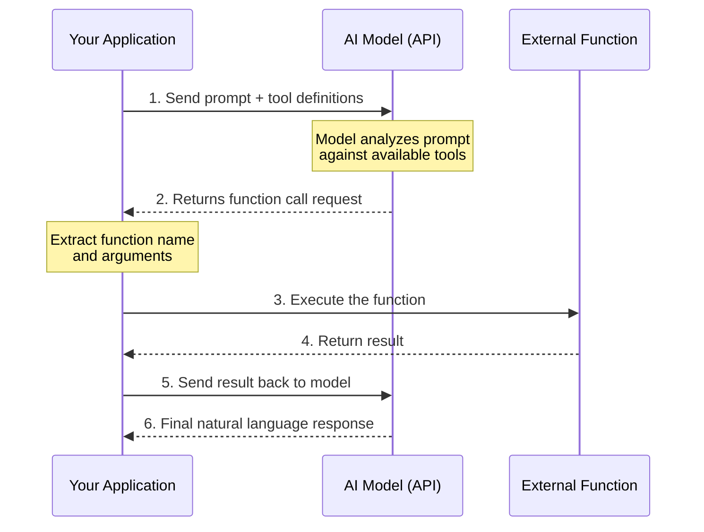

# What Is Function Calling?

## Introduction

Every AI application eventually hits the same wall: the model can *talk* about doing things, but it can't actually *do* them. It can describe how to check the weather, but it can't open a browser and look. It can explain how to query a database, but it can't run SQL. Function calling is the breakthrough that removes this wall.

Function calling (also called **tool calling** or **tool use**) is a mechanism where AI models generate structured requests to invoke external functions instead of producing only natural language text. The model analyzes a user's request, determines that an external capability is needed, and outputs a precisely formatted call — complete with function name and arguments — that your application code executes.

### What we'll cover

- What function calling is and why it exists
- The terminology landscape: function calling vs. tool calling vs. tool use
- The complete function calling lifecycle
- How function calling differs from plain text generation
- The bridge between natural language and executable code
- What the model does vs. what your code does

### Prerequisites

- Basic understanding of how LLMs generate text (Unit 3)
- Experience making API requests to OpenAI, Anthropic, or Google (Unit 4)
- Familiarity with JSON data format

---

## The problem function calling solves

Before function calling existed, developers had two options for connecting AI to external systems:

1. **Parse natural language output** — Ask the model to include structured data in its text response, then write fragile regex or string-parsing code to extract it
2. **Multi-step prompt chains** — Use elaborate prompts to coerce the model into producing JSON, then validate and fix the output manually

Both approaches were unreliable. Models would vary their output format unpredictably. A prompt asking for JSON might sometimes return markdown. Parameters would be missing or misspelled. Edge cases multiplied.

Function calling solves this by giving the model a **formal contract**: here are the functions available, here are their parameter schemas, and here is a structured format for calling them. The model's output is no longer free-form text — it's a validated, structured request that your code can process deterministically.

```python
# ❌ Before function calling: parsing natural language
response_text = "The weather in Paris is 18°C and partly cloudy."
# How do you reliably extract temperature, city, and condition?
# What if the model says "around 18 degrees" instead?

# ✅ With function calling: structured output
function_call = {
    "name": "get_weather",
    "arguments": {
        "location": "Paris, France",
        "units": "celsius"
    }
}
# Deterministic, type-safe, always the same structure
```

**Output:**
```
# The function_call dict above is what the model produces —
# not text to parse, but structured data to execute directly.
```

---

## Terminology: function calling, tool calling, and tool use

The AI industry uses several terms interchangeably, which can cause confusion. Here is what each provider calls this capability:

| Provider | Primary Term | API Field Name | Notes |
|----------|-------------|----------------|-------|
| OpenAI | **Function calling** | `tools` (type: `"function"`) | Originally `functions` field, now unified under `tools` |
| Anthropic | **Tool use** | `tools` with `input_schema` | Consistently uses "tool use" terminology |
| Google (Gemini) | **Function calling** | `function_declarations` in `Tool` | Uses Google-specific SDK types |
| Industry standard | **Tool calling** | Varies | Umbrella term used in research papers |

> **Note:** Throughout this course, we use "function calling" and "tool calling" interchangeably. When discussing a specific provider, we use their preferred terminology.

All three terms describe the same core concept: **the model generates a structured request to invoke an external capability**, rather than producing only natural language text.

### Why "tool" rather than "function"?

The term "tool" is broader than "function." A tool might be:
- A Python function your application defines
- An external API endpoint
- A database query engine
- A code execution sandbox
- A web search service
- A file system operation

OpenAI's `tools` parameter reflects this — it supports not just `function` type tools, but also built-in tools like `web_search`, `code_interpreter`, and `file_search`. Anthropic similarly distinguishes between **client tools** (your code) and **server tools** (Anthropic-hosted services like web search).

---

## The function calling lifecycle

Function calling follows a consistent multi-step pattern across all providers. Understanding this lifecycle is essential before writing any code.



Let's walk through each step:

### Step 1: Send prompt with tool definitions

Your application sends two things to the model:
- The user's message (e.g., "What's the weather in Tokyo?")
- A list of available tools with their schemas (e.g., a `get_weather` function that takes a `location` parameter)

```python
from openai import OpenAI

client = OpenAI()

tools = [
    {
        "type": "function",
        "name": "get_weather",
        "description": "Get the current weather for a given location.",
        "parameters": {
            "type": "object",
            "properties": {
                "location": {
                    "type": "string",
                    "description": "City and country, e.g. 'Tokyo, Japan'"
                },
                "units": {
                    "type": "string",
                    "enum": ["celsius", "fahrenheit"],
                    "description": "Temperature units"
                }
            },
            "required": ["location", "units"],
            "additionalProperties": False
        },
        "strict": True
    }
]

response = client.responses.create(
    model="gpt-4.1",
    input=[{"role": "user", "content": "What's the weather in Tokyo?"}],
    tools=tools
)
```

**Output:**
```
# The response object contains a function_call item
# (shown in Step 2 below)
```

### Step 2: Model returns a function call request

The model analyzes the user's intent against the available tools. If it determines a tool would help, it returns a **structured function call** instead of text:

```python
# The response.output contains a function_call item:
# {
#     "type": "function_call",
#     "call_id": "call_abc123",
#     "name": "get_weather",
#     "arguments": "{\"location\": \"Tokyo, Japan\", \"units\": \"celsius\"}"
# }
```

**Output:**
```
Function to call: get_weather
Arguments: {"location": "Tokyo, Japan", "units": "celsius"}
```

> **🔑 Key insight:** The model does NOT execute the function. It only tells you which function to call and what arguments to use. Execution is your responsibility.

### Step 3: Execute the function

Your application extracts the function name and arguments, then runs the actual code:

```python
import json

def get_weather(location: str, units: str) -> dict:
    """Call a weather API (simplified for demonstration)."""
    # In production, this would call a real weather API
    return {
        "location": location,
        "temperature": 22,
        "units": units,
        "condition": "partly cloudy"
    }

# Parse and execute
for item in response.output:
    if item.type == "function_call":
        args = json.loads(item.arguments)
        result = get_weather(**args)
        print(f"Function result: {result}")
```

**Output:**
```
Function result: {'location': 'Tokyo, Japan', 'temperature': 22, 'units': 'celsius', 'condition': 'partly cloudy'}
```

### Step 4-5: Return result to the model

You send the function's output back to the model so it can incorporate the real data into a natural language response:

```python
# Add the model's output and function result to the conversation
input_messages = [
    {"role": "user", "content": "What's the weather in Tokyo?"}
]
input_messages += response.output  # Include the function call
input_messages.append({
    "type": "function_call_output",
    "call_id": "call_abc123",
    "output": json.dumps(result)
})

# Get final response
final_response = client.responses.create(
    model="gpt-4.1",
    input=input_messages,
    tools=tools
)

print(final_response.output_text)
```

**Output:**
```
It's currently 22°C and partly cloudy in Tokyo, Japan.
```

### Step 6: The complete loop

The model transforms raw function output into a polished, human-readable response. This complete cycle — prompt → function call → execution → result → response — is the **function calling loop** that every tool-using AI application implements.

---

## What the model does vs. what your code does

This distinction is critical and frequently misunderstood:

| Responsibility | Model | Your Application |
|---------------|-------|-----------------|
| Analyze user intent | ✅ | — |
| Decide which function to call | ✅ | — |
| Extract and format arguments | ✅ | — |
| Execute the function | — | ✅ |
| Handle errors from execution | — | ✅ |
| Access external APIs/databases | — | ✅ |
| Generate final response from results | ✅ | — |
| Validate response before execution | — | ✅ |

> **Warning:** Never blindly execute function calls from the model without validation. The model might hallucinate function names, provide invalid arguments, or attempt calls that could have side effects. Always validate before executing, especially for functions that modify data or interact with external systems.

---

## Function calling across providers

While the lifecycle is the same, each provider uses different API structures. Here is how the same weather example looks across the three major providers:

### OpenAI (Responses API)

```python
from openai import OpenAI

client = OpenAI()

response = client.responses.create(
    model="gpt-4.1",
    input=[{"role": "user", "content": "What's the weather in Paris?"}],
    tools=[{
        "type": "function",
        "name": "get_weather",
        "description": "Get current weather for a location.",
        "parameters": {
            "type": "object",
            "properties": {
                "location": {"type": "string"}
            },
            "required": ["location"],
            "additionalProperties": False
        },
        "strict": True
    }]
)
# Response contains: item.type == "function_call"
# with item.name, item.arguments, item.call_id
```

**Output:**
```
# response.output includes a function_call with:
# name: "get_weather", arguments: '{"location": "Paris"}'
```

### Anthropic (Messages API)

```python
import anthropic

client = anthropic.Anthropic()

response = client.messages.create(
    model="claude-sonnet-4-20250514",
    max_tokens=1024,
    tools=[{
        "name": "get_weather",
        "description": "Get current weather for a location.",
        "input_schema": {
            "type": "object",
            "properties": {
                "location": {"type": "string"}
            },
            "required": ["location"]
        }
    }],
    messages=[
        {"role": "user", "content": "What's the weather in Paris?"}
    ]
)
# Response has stop_reason == "tool_use"
# Content block with type == "tool_use", name, input, id
```

**Output:**
```
# response.stop_reason: "tool_use"
# response.content includes a tool_use block with:
# name: "get_weather", input: {"location": "Paris"}, id: "toolu_abc123"
```

### Google Gemini

```python
from google import genai
from google.genai import types

client = genai.Client()

tools = types.Tool(function_declarations=[{
    "name": "get_weather",
    "description": "Get current weather for a location.",
    "parameters": {
        "type": "object",
        "properties": {
            "location": {
                "type": "string",
                "description": "The city name"
            }
        },
        "required": ["location"]
    }
}])

response = client.models.generate_content(
    model="gemini-3-flash-preview",
    contents="What's the weather in Paris?",
    config=types.GenerateContentConfig(tools=[tools])
)
# Response contains: part.function_call with .name and .args
```

**Output:**
```
# response.candidates[0].content.parts[0].function_call:
# name: "get_weather", args: {"location": "Paris"}
```

> **🤖 AI Context:** Notice how the core concept is identical across providers — define tools, send with prompt, receive structured call — but the field names differ (`parameters` vs. `input_schema`, `arguments` vs. `input` vs. `args`). Lesson 04 covers these differences in detail.

---

## Real-world capabilities unlocked

Function calling transforms what AI applications can do. Here are concrete capabilities that become possible:

### Augmenting knowledge

The model can retrieve information it doesn't have in its training data:

```python
# The model can call your search function to find current information
tools = [{
    "type": "function",
    "name": "search_knowledge_base",
    "description": "Search the company knowledge base for relevant articles.",
    "parameters": {
        "type": "object",
        "properties": {
            "query": {"type": "string", "description": "Search query"},
            "max_results": {"type": "integer", "description": "Maximum results to return"}
        },
        "required": ["query"],
        "additionalProperties": False
    },
    "strict": True
}]
```

**Output:**
```
# When a user asks about company policy, the model calls
# search_knowledge_base(query="vacation policy", max_results=5)
# instead of guessing or hallucinating
```

### Extending capabilities

The model can perform computations it cannot do natively:

```python
# Calculator, chart generation, data analysis
tools = [{
    "type": "function",
    "name": "create_chart",
    "description": "Create a chart from data points.",
    "parameters": {
        "type": "object",
        "properties": {
            "chart_type": {"type": "string", "enum": ["bar", "line", "pie"]},
            "title": {"type": "string"},
            "data": {
                "type": "array",
                "items": {
                    "type": "object",
                    "properties": {
                        "label": {"type": "string"},
                        "value": {"type": "number"}
                    },
                    "required": ["label", "value"],
                    "additionalProperties": False
                }
            }
        },
        "required": ["chart_type", "title", "data"],
        "additionalProperties": False
    },
    "strict": True
}]
```

**Output:**
```
# Model generates: create_chart(chart_type="bar", title="Q3 Sales", data=[...])
# Your code creates the actual chart
```

### Taking actions

The model can trigger real-world effects:

```python
# Booking appointments, sending emails, updating records
tools = [{
    "type": "function",
    "name": "schedule_meeting",
    "description": "Schedule a meeting with specified attendees.",
    "parameters": {
        "type": "object",
        "properties": {
            "attendees": {
                "type": "array",
                "items": {"type": "string"},
                "description": "Email addresses of attendees"
            },
            "date": {"type": "string", "description": "Date in YYYY-MM-DD format"},
            "time": {"type": "string", "description": "Time in HH:MM format"},
            "topic": {"type": "string", "description": "Meeting subject"}
        },
        "required": ["attendees", "date", "time", "topic"],
        "additionalProperties": False
    },
    "strict": True
}]
```

**Output:**
```
# User: "Schedule a meeting with Alice and Bob tomorrow at 2pm about Q4 planning"
# Model generates: schedule_meeting(
#     attendees=["alice@company.com", "bob@company.com"],
#     date="2025-07-16",
#     time="14:00",
#     topic="Q4 Planning"
# )
```

> **Warning:** Action-taking functions that have real-world side effects (sending emails, placing orders, deleting records) should always include a confirmation step before execution. Validate the call with the user before running it.

---

## Best practices

| Practice | Why it matters |
|----------|----------------|
| Always validate function calls before executing | Models can hallucinate function names or provide invalid arguments |
| Define clear, specific tool descriptions | The model relies on descriptions to choose the right tool |
| Use structured error responses | Return informative errors so the model can generate helpful user messages |
| Keep function sets focused (10-20 tools max) | Too many tools increase the risk of incorrect selection |
| Treat function calling as a conversation | The function call loop is a multi-turn interaction, not a one-shot request |

---

## Common pitfalls

| ❌ Mistake | ✅ Solution |
|-----------|-------------|
| Assuming the model executes functions | The model only generates call requests — your code executes them |
| Skipping argument validation | Always validate types, ranges, and required fields before execution |
| Not returning results to the model | The model needs function output to generate a useful final response |
| Using vague function descriptions | Write descriptions as if explaining the tool to a new developer |
| Ignoring the `call_id` field | Each function call has a unique ID that must match when returning results |

---

## Hands-on exercise

### Your task

Create a mental model of the function calling lifecycle by mapping a real-world scenario.

### Requirements

1. Choose a real-world task (e.g., ordering food, booking travel, checking inventory)
2. Identify what tools/functions the model would need
3. Write pseudocode for the complete lifecycle:
   - Define the tool schema (name, description, parameters)
   - Show what the model's function call output would look like
   - Show the function execution and result
   - Show the final response the model would generate
4. Identify at least one validation check you would add before execution

### Expected result

A complete lifecycle diagram with tool definitions, sample function calls, and expected outputs.

<details>
<summary>💡 Hints (click to expand)</summary>

- Start with a simple, single-function scenario
- Think about what information the model needs (in the schema) vs. what it already knows (from the prompt)
- Consider what could go wrong — what if the function fails?
- Remember: the model generates the call, your code executes it

</details>

<details>
<summary>✅ Solution (click to expand)</summary>

```python
# Scenario: Restaurant table reservation system

# Step 1: Define the tool
tools = [{
    "type": "function",
    "name": "reserve_table",
    "description": "Reserve a table at a restaurant for a specified number of guests, date, and time.",
    "parameters": {
        "type": "object",
        "properties": {
            "restaurant_name": {
                "type": "string",
                "description": "Name of the restaurant"
            },
            "party_size": {
                "type": "integer",
                "description": "Number of guests (1-20)"
            },
            "date": {
                "type": "string",
                "description": "Reservation date in YYYY-MM-DD format"
            },
            "time": {
                "type": "string",
                "description": "Reservation time in HH:MM format (24-hour)"
            },
            "special_requests": {
                "type": ["string", "null"],
                "description": "Any special requests (dietary needs, seating preferences)"
            }
        },
        "required": ["restaurant_name", "party_size", "date", "time", "special_requests"],
        "additionalProperties": False
    },
    "strict": True
}]

# Step 2: Model generates function call
# User: "Book a table for 4 at Chez Marie this Friday at 7pm, 
#         we need a high chair for a toddler"
# Model output:
function_call = {
    "name": "reserve_table",
    "arguments": {
        "restaurant_name": "Chez Marie",
        "party_size": 4,
        "date": "2025-07-18",
        "time": "19:00",
        "special_requests": "High chair needed for toddler"
    }
}

# Step 3: Validation before execution
def validate_reservation(args: dict) -> tuple[bool, str]:
    """Validate reservation parameters before executing."""
    from datetime import datetime, date
    
    # Check party size
    if not 1 <= args["party_size"] <= 20:
        return False, "Party size must be between 1 and 20"
    
    # Check date is in the future
    reservation_date = datetime.strptime(args["date"], "%Y-%m-%d").date()
    if reservation_date < date.today():
        return False, "Cannot book reservations in the past"
    
    # Check time format
    try:
        datetime.strptime(args["time"], "%H:%M")
    except ValueError:
        return False, "Invalid time format"
    
    return True, "Valid"

# Step 4: Execute and return result
valid, message = validate_reservation(function_call["arguments"])
if valid:
    result = {"status": "confirmed", "confirmation_id": "RES-2025-4872"}
else:
    result = {"status": "error", "message": message}

# Step 5: Model generates final response
# "Your table for 4 at Chez Marie has been reserved for Friday, 
#  July 18th at 7:00 PM. A high chair will be available. 
#  Your confirmation number is RES-2025-4872."
```

</details>

### Bonus challenges

- [ ] Add a second function (`search_restaurants`) and describe how the model would chain the two calls
- [ ] Design the error response format — what should the model receive when a function fails?
- [ ] Consider security: what validation would you add for a `delete_account` function?

---

## Summary

✅ **Function calling** lets AI models generate structured requests to invoke external capabilities instead of only producing text

✅ The model **never executes functions** — it generates a call request with the function name and arguments; your code handles execution

✅ The complete lifecycle is: **prompt → tool definitions → function call → execution → result → final response**

✅ All major providers (OpenAI, Anthropic, Google) support function calling with similar concepts but different API field names

✅ Always **validate function calls** before executing them, especially for functions with real-world side effects

**Next:** [How LLMs Decide to Call Functions](./02-how-llms-decide-to-call.md)

---

[Back to Function Calling Concepts](./00-function-calling-concepts.md) | [Next: How LLMs Decide to Call Functions →](./02-how-llms-decide-to-call.md)

<!--
Sources Consulted:
- OpenAI Function Calling Guide: https://platform.openai.com/docs/guides/function-calling
- Anthropic Tool Use Documentation: https://platform.claude.com/docs/en/docs/build-with-claude/tool-use
- Google Gemini Function Calling: https://ai.google.dev/gemini-api/docs/function-calling
-->
