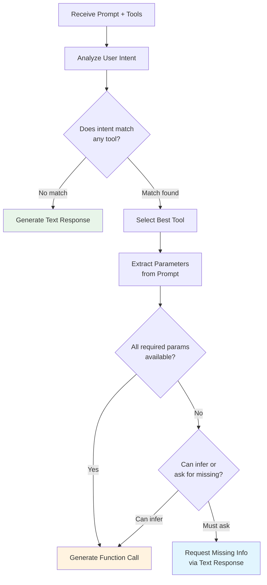

# How LLMs Decide to Call Functions

## Introduction

When you provide tools to an LLM, something remarkable happens behind the scenes: the model doesn't just randomly call functions — it makes a sophisticated decision about *whether* to call a function, *which* one to call, and *what arguments* to pass. Understanding this decision process helps you design better tool definitions and debug unexpected behavior.

This lesson explores the internal mechanics of how models evaluate user prompts against available tools and decide their next action.

### What we'll cover

- How models recognize user intent from natural language
- The function matching process: choosing the right tool
- Parameter extraction: turning prose into structured arguments
- The call-vs-respond decision: when the model skips function calling
- How confidence and ambiguity affect tool selection
- Provider-specific decision mechanisms

### Prerequisites

- Understanding of what function calling is ([Lesson 01](./01-what-is-function-calling.md))
- Familiarity with how LLMs process prompts (Unit 3)

---

## The decision pipeline

When a model receives a prompt along with tool definitions, it runs through a decision pipeline. While the exact implementation varies by provider, the conceptual process is consistent:



Let's examine each stage in detail.

---

## Stage 1: User intent recognition

The model's first task is understanding **what the user wants to accomplish**. This goes beyond keyword matching — the model performs semantic analysis of the entire prompt context.

### Direct intent

Some requests are explicit about what they need:

```python
# Clear, direct intent — model easily maps to a function
user_message = "What's the weather in London right now?"
# Intent: get current weather data
# Maps to: get_weather(location="London")
```

**Output:**
```
Intent detected: weather_query
Confidence: high
Matched function: get_weather
```

### Indirect intent

Other requests require inference:

```python
# Indirect intent — model must infer the needed action
user_message = "I'm heading to London tomorrow, should I bring an umbrella?"
# The user isn't directly asking for weather data,
# but the model recognizes that answering requires weather information
# Intent: determine if rain is expected → needs weather data
# Maps to: get_weather(location="London")
```

**Output:**
```
Intent detected: weather_query (inferred from umbrella context)
Confidence: high
Matched function: get_weather
```

### Conversational context

Models also consider the full conversation history, not just the latest message:

```python
messages = [
    {"role": "user", "content": "I'm planning a trip to Paris next week."},
    {"role": "assistant", "content": "That sounds wonderful! Paris is beautiful..."},
    {"role": "user", "content": "What will the temperature be like?"}
]
# The model infers "Paris" as the location from conversation context
# even though the latest message doesn't mention it
# Maps to: get_weather(location="Paris, France")
```

**Output:**
```
Intent detected: weather_query
Location extracted from context: "Paris, France"
Matched function: get_weather
```

---

## Stage 2: Function matching

Once the model understands the user's intent, it evaluates which available function (if any) can fulfill that intent. The model uses two primary sources of information:

### Tool descriptions drive selection

The `description` field in your tool definition is the most important factor in function matching. The model reads these descriptions to understand what each tool does and when to use it.

```python
# Well-described tools help the model make accurate choices
tools = [
    {
        "type": "function",
        "name": "get_current_weather",
        "description": "Get the current weather conditions for a specific city. "
                       "Returns temperature, humidity, and conditions. "
                       "Use this when a user asks about current weather, "
                       "temperature, or if they should bring rain gear.",
        "parameters": {
            "type": "object",
            "properties": {
                "location": {
                    "type": "string",
                    "description": "City and country, e.g. 'London, UK'"
                }
            },
            "required": ["location"],
            "additionalProperties": False
        },
        "strict": True
    },
    {
        "type": "function",
        "name": "get_weather_forecast",
        "description": "Get the weather forecast for upcoming days. "
                       "Returns predicted conditions for the next 1-7 days. "
                       "Use this when a user asks about future weather, "
                       "weekend conditions, or planning for upcoming events.",
        "parameters": {
            "type": "object",
            "properties": {
                "location": {
                    "type": "string",
                    "description": "City and country, e.g. 'London, UK'"
                },
                "days": {
                    "type": "integer",
                    "description": "Number of days to forecast (1-7)"
                }
            },
            "required": ["location", "days"],
            "additionalProperties": False
        },
        "strict": True
    }
]
```

**Output:**
```
# "What's the weather like today in London?"
# → get_current_weather(location="London, UK")

# "Will it rain in London this weekend?"
# → get_weather_forecast(location="London, UK", days=3)
```

> **💡 Tip:** Write tool descriptions as if you're explaining to a new team member when to use each function. Include the purpose, what it returns, and specific trigger scenarios. This directly improves the model's selection accuracy.

### Parameter descriptions guide extraction

Parameter descriptions help the model understand what format each argument should take:

```python
# Detailed parameter descriptions lead to better extraction
"parameters": {
    "type": "object",
    "properties": {
        "location": {
            "type": "string",
            # ✅ Good: specific format guidance
            "description": "City and state/country, e.g. 'San Francisco, CA' or 'Tokyo, Japan'"
        },
        "date": {
            "type": "string",
            # ✅ Good: explicit format requirement
            "description": "Date in ISO 8601 format (YYYY-MM-DD), e.g. '2025-07-15'"
        },
        "priority": {
            "type": "string",
            # ✅ Good: enum values are self-documenting
            "enum": ["low", "medium", "high", "critical"]
        }
    }
}
```

**Output:**
```
# With good descriptions, the model correctly formats:
# "Schedule something for next Tuesday" → date: "2025-07-22"
# "It's urgent" → priority: "critical"
```

---

## Stage 3: Parameter extraction

After selecting a function, the model extracts argument values from the user's natural language input. This is where the model's language understanding capabilities shine.

### Direct extraction

When parameter values are stated explicitly:

```python
# User: "What's the weather in Tokyo in celsius?"
# The model directly extracts:
extracted = {
    "location": "Tokyo, Japan",  # Adds country for clarity
    "units": "celsius"           # Direct match
}
```

**Output:**
```
Parameter extraction:
  location: "Tokyo, Japan" (from "Tokyo" + inferred country)
  units: "celsius" (directly stated)
```

### Inference-based extraction

When values must be inferred from context:

```python
# User: "Book a table for my wife and me tonight at 7"
# The model infers:
extracted = {
    "party_size": 2,           # "wife and me" = 2 people
    "date": "2025-07-15",      # "tonight" = today's date
    "time": "19:00"            # "7" in evening context = 19:00
}
```

**Output:**
```
Parameter extraction:
  party_size: 2 (inferred from "wife and me")
  date: "2025-07-15" (inferred from "tonight")
  time: "19:00" (inferred from "7" in dinner context)
```

### Type coercion

Models convert natural language values to the schema-specified types:

```python
# Schema expects: {"type": "integer"}
# User says: "around five" → 5
# User says: "a dozen" → 12
# User says: "half a million" → 500000

# Schema expects: {"type": "boolean"}
# User says: "yes please" → True
# User says: "no thanks" → False
# User says: "sure" → True

# Schema expects: {"type": "string", "enum": ["celsius", "fahrenheit"]}
# User says: "in metric" → "celsius"
# User says: "in freedom units" → "fahrenheit"
```

**Output:**
```
Type coercion examples:
  "around five" → integer: 5
  "yes please" → boolean: true
  "in metric" → enum: "celsius"
```

---

## Stage 4: The call-vs-respond decision

Not every prompt with tools results in a function call. The model evaluates whether calling a function is actually the right action.

### When the model calls a function

```python
# ✅ Clear need for external data/action
"What's the weather in Paris?"           # → calls get_weather
"Send an email to Alice about the meeting" # → calls send_email
"Search for flights to Tokyo"             # → calls search_flights
```

### When the model responds with text instead

```python
# ❌ Model responds with text, does NOT call a function

# 1. General knowledge question (no tool needed)
"What causes rain?"  
# Model can answer from training data — no tool needed

# 2. Ambiguous request
"Help me with the weather"
# Too vague — model asks for clarification instead of guessing

# 3. Unrelated to available tools
"Tell me a joke"
# No joke-telling tool available — model responds directly

# 4. Follow-up to a previous response
"Can you explain that in simpler terms?"
# References previous text, doesn't need a tool
```

**Output:**
```
Decision outcomes:
  "What's the weather?" → FUNCTION CALL (needs external data)
  "What causes rain?" → TEXT RESPONSE (general knowledge)
  "Help me with weather" → TEXT RESPONSE (too ambiguous)
  "Tell me a joke" → TEXT RESPONSE (no matching tool)
```

### How tool_choice affects the decision

All three providers let you override the model's decision with explicit configuration:

| Mode | Behavior | Use case |
|------|----------|----------|
| `auto` (default) | Model decides freely | General-purpose assistants |
| `required` / `any` | Must call at least one function | When you always need tool output |
| Specific function | Must call that exact function | Single-purpose interfaces |
| `none` | Cannot call any function | Temporarily disable tools |

```python
# OpenAI: Force the model to always call a function
response = client.responses.create(
    model="gpt-4.1",
    input=messages,
    tools=tools,
    tool_choice="required"  # Must call at least one tool
)

# Anthropic: Force a specific tool
response = client.messages.create(
    model="claude-sonnet-4-20250514",
    tools=tools,
    tool_choice={"type": "tool", "name": "get_weather"},  # Must call this tool
    messages=messages,
    max_tokens=1024
)

# Gemini: Force function calling
config = types.GenerateContentConfig(
    tools=[tools],
    tool_config=types.ToolConfig(
        function_calling_config=types.FunctionCallingConfig(mode="ANY")
    )
)
```

**Output:**
```
tool_choice="auto"     → Model decides (may or may not call)
tool_choice="required" → Model MUST call a function
tool_choice="none"     → Model CANNOT call any function
```

---

## Multiple tools: how the model chooses

When multiple tools are available, the model must rank which one best fits the user's intent. This ranking is influenced by:

### 1. Description relevance

```python
tools = [
    {
        "name": "search_products",
        "description": "Search the product catalog by name, category, or features."
    },
    {
        "name": "get_order_status",
        "description": "Check the current status of an existing order by order ID."
    },
    {
        "name": "create_support_ticket",
        "description": "Create a new customer support ticket for issues or complaints."
    }
]

# User: "Where is my order #12345?"
# Model evaluates:
#   search_products → low relevance (searching products, not orders)
#   get_order_status → HIGH relevance (matches "where is my order")
#   create_support_ticket → low relevance (not a complaint)
# Result: get_order_status(order_id="12345")
```

**Output:**
```
Tool ranking for "Where is my order #12345?":
  1. get_order_status (high match: order tracking)
  2. create_support_ticket (low match: not a complaint)
  3. search_products (no match: not product search)
Selected: get_order_status
```

### 2. Parameter fit

If the user provides information that closely matches a tool's parameter schema, that tool ranks higher:

```python
# User: "Find laptops under $1000 with at least 16GB RAM"
# search_products has: category, price_max, min_ram parameters
# → Strong parameter fit → selected

# User: "I can't log into my account"
# create_support_ticket has: issue_type, description parameters
# → Strong parameter fit → selected
```

### 3. System prompt guidance

You can steer the model's tool selection behavior through the system prompt:

```python
system_prompt = """You are a customer service agent. Follow these rules:

1. Always check order status before creating a support ticket
2. Only create support tickets for issues you cannot resolve directly
3. Use search_products only when the customer is looking to buy something new
4. If the customer's intent is ambiguous, ask for clarification rather than guessing
"""
```

**Output:**
```
With system prompt guidance:
  "My order is late" → get_order_status (check first, per rule 1)
  Not immediately → create_support_ticket (per rule 2)
```

---

## Parallel function calls

Modern models can recognize when multiple independent functions are needed and call them simultaneously:

```python
# User: "What's the weather in Paris and Tokyo?"
# The model recognizes two independent weather queries
# and generates TWO function calls in a single response:

# Call 1: get_weather(location="Paris, France")
# Call 2: get_weather(location="Tokyo, Japan")

# Your application can execute both in parallel
```

**Output:**
```
Model output contains 2 function calls:
  [0] get_weather(location="Paris, France")
  [1] get_weather(location="Tokyo, Japan")
Both can execute simultaneously
```

> **Note:** Parallel function calling can be disabled if you need sequential, one-at-a-time execution. OpenAI offers `parallel_tool_calls: false` for this purpose.

---

## When things go wrong

The model's decision process isn't perfect. Understanding common failure modes helps you design better tools:

### Ambiguous tool overlap

```python
# ❌ Bad: Two tools with overlapping descriptions
tools = [
    {"name": "find_restaurant", "description": "Find a restaurant"},
    {"name": "search_dining", "description": "Search for dining options"}
]
# The model may pick either one inconsistently

# ✅ Better: Clear differentiation
tools = [
    {
        "name": "search_restaurants",
        "description": "Search for restaurants by cuisine, location, and price range. "
                       "Returns a list of matching restaurants with ratings."
    },
    {
        "name": "get_restaurant_details",
        "description": "Get detailed information about a specific restaurant "
                       "including menu, hours, and reviews. Requires restaurant ID."
    }
]
```

### Missing context

```python
# User: "Book it"
# The model doesn't know what "it" refers to
# Result: May ask for clarification, or may hallucinate a booking call

# Solution: Ensure conversation history provides context
messages = [
    {"role": "user", "content": "Show me Italian restaurants in Manhattan"},
    {"role": "assistant", "content": "Here are the top 3: 1. Carbone 2. L'Artusi 3. Via Carota"},
    {"role": "user", "content": "Book the first one for tonight at 8"}
    # Now "the first one" resolves to "Carbone" from context
]
```

### Too many tools

```python
# ❌ 50+ tools — model struggles to select the right one
# Performance degrades, accuracy drops, latency increases

# ✅ Dynamic tool filtering — show only relevant tools per context
def get_relevant_tools(user_context: str) -> list[dict]:
    """Select a subset of tools based on conversation context."""
    all_tools = load_all_tools()  # 50+ tools
    
    if "order" in user_context.lower():
        return [t for t in all_tools if t["category"] == "orders"]
    elif "product" in user_context.lower():
        return [t for t in all_tools if t["category"] == "products"]
    else:
        return all_tools[:15]  # General subset
```

**Output:**
```
Full tool set: 50 tools (poor accuracy)
Filtered for "order" context: 8 tools (high accuracy)
Filtered for "product" context: 12 tools (high accuracy)
```

---

## Best practices

| Practice | Why it matters |
|----------|----------------|
| Write detailed, specific descriptions | Descriptions are the primary input for the model's selection algorithm |
| Include "when to use" guidance in descriptions | Helps the model distinguish between similar tools |
| Use enums for constrained values | Reduces extraction errors and provides clear options |
| Provide parameter format examples in descriptions | Guides the model to produce correctly formatted values |
| Keep active tool count under 20 | Accuracy degrades significantly beyond this threshold |
| Use system prompts to guide tool selection | Add rules about priority ordering and when to ask for clarification |

---

## Common pitfalls

| ❌ Mistake | ✅ Solution |
|-----------|-------------|
| Vague descriptions like "Handles weather" | Specific: "Get current temperature, humidity, and conditions for a city" |
| No parameter format guidance | Include examples: "Date in YYYY-MM-DD format, e.g. '2025-07-15'" |
| Overlapping tool responsibilities | Give each tool a distinct, non-overlapping purpose |
| Assuming the model always picks correctly | Add validation and fallback logic in your application |
| Not considering conversation context | The model uses the full message history, so ensure it's complete |

---

## Hands-on exercise

### Your task

Design a tool set for a travel booking assistant and predict how the model would handle various user inputs.

### Requirements

1. Define 4 travel-related tools with clear, non-overlapping descriptions:
   - Flight search
   - Hotel search
   - Car rental search
   - Trip itinerary creation
2. For each of these user inputs, predict which tool the model would call and what arguments it would extract:
   - "Find me flights from NYC to London next month"
   - "I need a hotel near the Eiffel Tower for 3 nights"
   - "Plan my entire vacation to Japan"
   - "What's a good rental car for a family road trip?"
3. Identify one input that would cause the model to respond with text instead of calling a tool

### Expected result

A complete tool set with predictions for each input, including extracted parameter values.

<details>
<summary>💡 Hints (click to expand)</summary>

- The trip itinerary tool might need to call multiple sub-tools
- "Plan my entire vacation" could trigger multiple function calls or a clarification response
- Think about what parameters are missing and whether the model can infer them
- Consider: does "next month" translate to specific dates?

</details>

<details>
<summary>✅ Solution (click to expand)</summary>

```python
tools = [
    {
        "type": "function",
        "name": "search_flights",
        "description": "Search for available flights between two airports. "
                       "Returns flight options with prices, airlines, and times. "
                       "Use when the user wants to find or book flights.",
        "parameters": {
            "type": "object",
            "properties": {
                "origin": {
                    "type": "string",
                    "description": "Departure city or airport code, e.g. 'NYC' or 'JFK'"
                },
                "destination": {
                    "type": "string",
                    "description": "Arrival city or airport code, e.g. 'London' or 'LHR'"
                },
                "departure_date": {
                    "type": "string",
                    "description": "Departure date in YYYY-MM-DD format"
                },
                "return_date": {
                    "type": ["string", "null"],
                    "description": "Return date in YYYY-MM-DD format, null for one-way"
                },
                "passengers": {
                    "type": "integer",
                    "description": "Number of passengers (default: 1)"
                }
            },
            "required": ["origin", "destination", "departure_date", "return_date", "passengers"],
            "additionalProperties": False
        },
        "strict": True
    },
    {
        "type": "function",
        "name": "search_hotels",
        "description": "Search for available hotel rooms near a location. "
                       "Returns hotel options with prices, ratings, and amenities. "
                       "Use when the user wants accommodation or lodging.",
        "parameters": {
            "type": "object",
            "properties": {
                "location": {
                    "type": "string",
                    "description": "City, landmark, or address to search near"
                },
                "check_in": {
                    "type": "string",
                    "description": "Check-in date in YYYY-MM-DD format"
                },
                "check_out": {
                    "type": "string",
                    "description": "Check-out date in YYYY-MM-DD format"
                },
                "guests": {
                    "type": "integer",
                    "description": "Number of guests"
                }
            },
            "required": ["location", "check_in", "check_out", "guests"],
            "additionalProperties": False
        },
        "strict": True
    },
    {
        "type": "function",
        "name": "search_car_rentals",
        "description": "Search for rental car options at a location. "
                       "Returns available vehicles with prices and features. "
                       "Use when the user needs a rental car or vehicle.",
        "parameters": {
            "type": "object",
            "properties": {
                "pickup_location": {
                    "type": "string",
                    "description": "City or airport for car pickup"
                },
                "pickup_date": {
                    "type": "string",
                    "description": "Pickup date in YYYY-MM-DD format"
                },
                "return_date": {
                    "type": "string",
                    "description": "Return date in YYYY-MM-DD format"
                },
                "car_type": {
                    "type": ["string", "null"],
                    "enum": ["economy", "compact", "midsize", "suv", "luxury", "minivan", null],
                    "description": "Preferred vehicle type, or null for all types"
                }
            },
            "required": ["pickup_location", "pickup_date", "return_date", "car_type"],
            "additionalProperties": False
        },
        "strict": True
    },
    {
        "type": "function",
        "name": "create_itinerary",
        "description": "Create a day-by-day travel itinerary for a destination. "
                       "Generates suggested activities, restaurants, and timing. "
                       "Use when the user wants trip planning or activity suggestions.",
        "parameters": {
            "type": "object",
            "properties": {
                "destination": {
                    "type": "string",
                    "description": "Travel destination city or country"
                },
                "num_days": {
                    "type": "integer",
                    "description": "Number of days for the itinerary"
                },
                "interests": {
                    "type": "array",
                    "items": {"type": "string"},
                    "description": "Traveler interests like 'food', 'history', 'nature'"
                }
            },
            "required": ["destination", "num_days", "interests"],
            "additionalProperties": False
        },
        "strict": True
    }
]

# Predictions:
# 1. "Find me flights from NYC to London next month"
#    → search_flights(origin="NYC", destination="London",
#        departure_date="2025-08-01", return_date=null, passengers=1)
#    Note: "next month" maps to approximate date

# 2. "I need a hotel near the Eiffel Tower for 3 nights"
#    → TEXT RESPONSE asking for specific dates
#    OR search_hotels(location="Eiffel Tower, Paris", 
#        check_in=inferred_today, check_out=3_days_later, guests=1)

# 3. "Plan my entire vacation to Japan"
#    → TEXT RESPONSE asking: How many days? What interests? Travel dates?
#    OR create_itinerary(destination="Japan", num_days=7, interests=["culture"])

# 4. "What's a good rental car for a family road trip?"
#    → TEXT RESPONSE asking: Where? When? How many people?
#    OR search_car_rentals with car_type="minivan" or "suv"

# Text-only response trigger:
# "What documents do I need to travel to Japan?"
# → No matching tool — model answers from training data
```

</details>

### Bonus challenges

- [ ] Add a system prompt that guides tool selection priority (e.g., "Always check flight availability before creating an itinerary")
- [ ] Design a scenario where parallel function calling would be triggered
- [ ] Create a tool description that is intentionally ambiguous and predict how it causes problems

---

## Summary

✅ Models analyze user intent **semantically**, not through keyword matching — they understand indirect requests and conversational context

✅ **Tool descriptions** are the most important factor in function selection — write them like documentation for a new developer

✅ Parameter extraction converts natural language to typed values through **inference, coercion, and context** from conversation history

✅ The **call-vs-respond decision** depends on whether the user's intent matches an available tool — models can choose to respond with text instead

✅ You can override the model's decision with **tool_choice** settings (auto, required, specific function, or none)

✅ Keep active tool sets **under 20 tools** and use dynamic filtering for larger tool libraries

**Next:** [Function Calling vs. Prompt-Based Extraction](./03-function-calling-vs-prompting.md)

---

[← Previous: What Is Function Calling?](./01-what-is-function-calling.md) | [Back to Function Calling Concepts](./00-function-calling-concepts.md) | [Next: Function Calling vs. Prompting →](./03-function-calling-vs-prompting.md)

<!--
Sources Consulted:
- OpenAI Function Calling Guide: https://platform.openai.com/docs/guides/function-calling
- OpenAI Best Practices for Defining Functions: https://platform.openai.com/docs/guides/function-calling#best-practices-for-defining-functions
- Anthropic Tool Use Documentation: https://platform.claude.com/docs/en/docs/build-with-claude/tool-use
- Google Gemini Function Calling: https://ai.google.dev/gemini-api/docs/function-calling
- Google Gemini Best Practices: https://ai.google.dev/gemini-api/docs/function-calling#best-practices
-->
