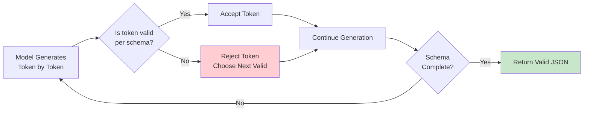
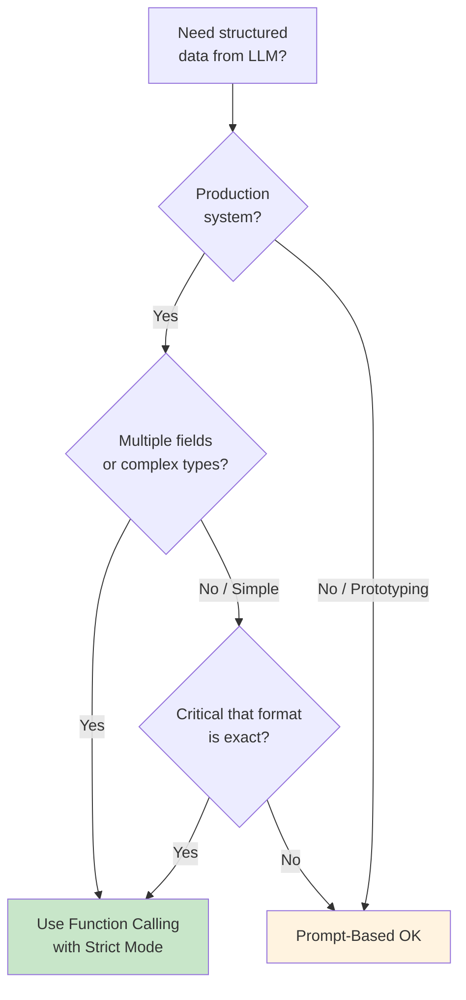

# Function Calling vs. Prompt-Based Extraction

## Introduction

Before function calling existed, developers relied on clever prompting to extract structured data from AI models. You would ask the model to "respond in JSON format" or "output only the values separated by commas" and then parse the result with custom code. This approach worked — sometimes. Function calling replaced it with a fundamentally more reliable mechanism.

This lesson compares both approaches head-to-head, examines where each excels, and explains why function calling is the production-grade choice for structured AI interactions.

### What we'll cover

- How prompt-based extraction works and its limitations
- How function calling provides structural guarantees
- Reliability comparison with real-world failure modes
- Schema enforcement and validation differences
- When prompt-based extraction still makes sense
- Structured outputs: the guarantee behind strict mode

### Prerequisites

- Understanding of function calling lifecycle ([Lesson 01](./01-what-is-function-calling.md))
- Experience with prompt engineering (Unit 6)
- Familiarity with JSON format

---

## Prompt-based extraction: the old approach

Before function calling, extracting structured data from an LLM required carefully crafted prompts and brittle parsing code.

### How it works

```python
# The prompt-based approach: ask the model to produce structured output
prompt = """Extract the following information from the user's message 
and return it as JSON:
- city (string)
- date (string in YYYY-MM-DD format)
- number_of_guests (integer)

User message: "I'd like to book a table for 4 at an Italian restaurant 
in Manhattan next Friday evening"

Respond with ONLY valid JSON, no other text."""

response = client.responses.create(
    model="gpt-4.1",
    input=[{"role": "user", "content": prompt}]
)

text = response.output_text
print(text)
```

**Output:**
```json
{
    "city": "Manhattan",
    "date": "2025-07-18",
    "number_of_guests": 4
}
```

This looks clean — but the problems emerge at scale.

### The fragility problem

The same prompt can produce different output formats across calls:

```python
# Run 1 — Clean JSON
'{"city": "Manhattan", "date": "2025-07-18", "number_of_guests": 4}'

# Run 2 — Wrapped in markdown code block
'```json\n{"city": "Manhattan", "date": "2025-07-18", "number_of_guests": 4}\n```'

# Run 3 — Extra text before JSON
'Here is the extracted information:\n{"city": "Manhattan", ...}'

# Run 4 — Different key names
'{"location": "Manhattan, NY", "reservation_date": "07/18/2025", "guests": "four"}'

# Run 5 — Explanation mixed in
'Based on the message, the details are: city is Manhattan, date is...'
```

**Output:**
```
5 runs, 5 different formats
Only Run 1 can be parsed with json.loads() directly
The others require regex, stripping, or error handling
```

### Parsing code becomes complex

To handle these variations, you end up writing defensive parsing code:

```python
import json
import re

def parse_llm_json(text: str) -> dict:
    """Attempt to parse JSON from an LLM response with fallbacks."""
    # Try direct parse
    try:
        return json.loads(text)
    except json.JSONDecodeError:
        pass
    
    # Try extracting from markdown code block
    code_block = re.search(r'```(?:json)?\s*([\s\S]*?)\s*```', text)
    if code_block:
        try:
            return json.loads(code_block.group(1))
        except json.JSONDecodeError:
            pass
    
    # Try finding JSON object in text
    json_match = re.search(r'\{[\s\S]*\}', text)
    if json_match:
        try:
            return json.loads(json_match.group(0))
        except json.JSONDecodeError:
            pass
    
    # Give up
    raise ValueError(f"Could not extract JSON from response: {text[:100]}...")

# Even this doesn't guarantee correct keys or value types
result = parse_llm_json(response_text)
# result might have "location" instead of "city"
# result["number_of_guests"] might be "four" instead of 4
```

**Output:**
```
parse_llm_json handles some variations, but:
  - Can't guarantee correct field names
  - Can't guarantee correct value types
  - Can't guarantee all required fields are present
  - Adds latency and complexity to every response
```

---

## Function calling: the structured approach

Function calling eliminates all of these problems by using a formal contract between your application and the model.

### How it works

```python
from openai import OpenAI
import json

client = OpenAI()

tools = [{
    "type": "function",
    "name": "extract_reservation",
    "description": "Extract restaurant reservation details from user message.",
    "parameters": {
        "type": "object",
        "properties": {
            "city": {
                "type": "string",
                "description": "The city for the reservation"
            },
            "date": {
                "type": "string",
                "description": "Reservation date in YYYY-MM-DD format"
            },
            "number_of_guests": {
                "type": "integer",
                "description": "Number of guests for the reservation"
            }
        },
        "required": ["city", "date", "number_of_guests"],
        "additionalProperties": False
    },
    "strict": True
}]

response = client.responses.create(
    model="gpt-4.1",
    input=[{
        "role": "user",
        "content": "I'd like to book a table for 4 at an Italian restaurant "
                   "in Manhattan next Friday evening"
    }],
    tools=tools,
    tool_choice="required"  # Force function call
)

# Extract the structured result
for item in response.output:
    if item.type == "function_call":
        result = json.loads(item.arguments)
        print(result)
```

**Output:**
```json
{"city": "Manhattan", "date": "2025-07-18", "number_of_guests": 4}
```

### The guarantees

With function calling (especially in strict mode), every response is:

1. **Valid JSON** — always parseable, never wrapped in markdown or mixed with text
2. **Schema-conformant** — field names match exactly, types are correct
3. **Complete** — all required fields are present
4. **Type-safe** — integers are integers, strings are strings, never `"four"` when you need `4`

```python
# With strict mode, these are GUARANTEED:
result = json.loads(item.arguments)

# ✅ Keys are always exactly as defined
assert "city" in result              # Never "location" or "City"
assert "date" in result              # Never "reservation_date"
assert "number_of_guests" in result  # Never "guests" or "num"

# ✅ Types are always correct
assert isinstance(result["city"], str)
assert isinstance(result["number_of_guests"], int)  # Never "4" or "four"

# ✅ No extra fields
assert set(result.keys()) == {"city", "date", "number_of_guests"}
```

**Output:**
```
All assertions pass — every time, guaranteed by strict mode.
```

---

## Head-to-head comparison

| Aspect | Prompt-Based Extraction | Function Calling |
|--------|------------------------|-----------------|
| **Output format** | Varies between calls | Always structured JSON |
| **Field names** | May differ ("city" vs "location") | Exactly as defined in schema |
| **Value types** | Strings for everything ("4", "true") | Correct types (int, bool) |
| **Required fields** | May be missing | Always present (with strict mode) |
| **Extra fields** | May include unexpected keys | None (with `additionalProperties: false`) |
| **Parsing code needed** | Complex regex + fallbacks | Simple `json.loads()` |
| **Enum values** | May use synonyms | Constrained to exact values |
| **Error handling** | Parse errors at runtime | Schema validation at API level |
| **Token usage** | Prompt tokens for format instructions | Tool definition tokens |
| **Multi-call consistency** | Varies significantly | 100% consistent structure |
| **Latency** | Similar base latency | Slightly lower (no format instructions in prompt) |

---

## Schema enforcement: the core advantage

The biggest difference is **schema enforcement**. Function calling uses JSON Schema to define exactly what the output must look like.

### Enums prevent value drift

```python
# ❌ Prompt-based: the model invents its own values
prompt = "Classify the sentiment as positive, negative, or neutral"
# Possible outputs: "Positive", "POSITIVE", "mostly positive", 
#                   "somewhat negative", "mixed", "N/A"

# ✅ Function calling: constrained to exact values
{
    "name": "classify_sentiment",
    "parameters": {
        "type": "object",
        "properties": {
            "sentiment": {
                "type": "string",
                "enum": ["positive", "negative", "neutral"]
            }
        },
        "required": ["sentiment"],
        "additionalProperties": False
    },
    "strict": True
}
# Output is ALWAYS one of: "positive", "negative", "neutral"
# Never "Positive", "POSITIVE", "mixed", or any variation
```

**Output:**
```
Prompt-based: 6+ possible value variations
Function calling: exactly 3 possible values (guaranteed)
```

### Nested objects maintain structure

```python
# ❌ Prompt-based: nested structures are unreliable
prompt = "Extract the address with street, city, state, and zip code as nested JSON"
# The model might flatten it, nest it differently, or use different key names

# ✅ Function calling: nested structure is guaranteed
{
    "name": "extract_address",
    "parameters": {
        "type": "object",
        "properties": {
            "address": {
                "type": "object",
                "properties": {
                    "street": {"type": "string"},
                    "city": {"type": "string"},
                    "state": {"type": "string"},
                    "zip_code": {"type": "string"}
                },
                "required": ["street", "city", "state", "zip_code"],
                "additionalProperties": False
            }
        },
        "required": ["address"],
        "additionalProperties": False
    },
    "strict": True
}
```

**Output:**
```json
{
    "address": {
        "street": "123 Main St",
        "city": "Springfield",
        "state": "IL",
        "zip_code": "62701"
    }
}
```

### Arrays are properly typed

```python
# ❌ Prompt-based: arrays come in many forms
# "item1, item2, item3"
# ["item1", "item2", "item3"]
# "1. item1\n2. item2\n3. item3"

# ✅ Function calling: arrays are always JSON arrays
{
    "name": "extract_items",
    "parameters": {
        "type": "object",
        "properties": {
            "items": {
                "type": "array",
                "items": {
                    "type": "object",
                    "properties": {
                        "name": {"type": "string"},
                        "quantity": {"type": "integer"},
                        "price": {"type": "number"}
                    },
                    "required": ["name", "quantity", "price"],
                    "additionalProperties": False
                }
            }
        },
        "required": ["items"],
        "additionalProperties": False
    },
    "strict": True
}
# Always returns a proper JSON array of objects
```

**Output:**
```json
{
    "items": [
        {"name": "Widget A", "quantity": 3, "price": 12.99},
        {"name": "Widget B", "quantity": 1, "price": 24.50}
    ]
}
```

---

## Structured outputs: the guarantee mechanism

OpenAI's **strict mode** and Anthropic's **structured outputs** use constrained decoding to guarantee schema conformance. This isn't just "trying harder" — it's a fundamentally different generation mechanism.

### How strict mode works



At each step of token generation, the model is **constrained** to only produce tokens that keep the output schema-valid. Invalid tokens are never emitted. This is why strict mode provides a **guarantee**, not just a best effort.

### Strict mode requirements (OpenAI)

To enable strict mode, your schema must follow specific rules:

```python
{
    "type": "function",
    "name": "my_function",
    "strict": True,  # Enable guaranteed schema adherence
    "parameters": {
        "type": "object",
        "properties": {
            "required_field": {"type": "string"},
            "optional_field": {
                "type": ["string", "null"]  # Optional = nullable
            }
        },
        "required": ["required_field", "optional_field"],  # ALL fields listed
        "additionalProperties": False  # MUST be false
    }
}
```

**Output:**
```
Strict mode rules:
  1. additionalProperties: false (on every object)
  2. ALL fields in required array (even optional ones)
  3. Optional fields use type: ["string", "null"]
  4. First request has schema processing latency (then cached)
```

> **Important:** OpenAI Responses API normalizes schemas into strict mode by default. If you want non-strict, best-effort function calling, explicitly set `strict: false`.

### Anthropic structured outputs

Anthropic offers similar guarantees through their `strict: true` parameter on tool definitions:

```python
import anthropic

client = anthropic.Anthropic()

response = client.messages.create(
    model="claude-sonnet-4-20250514",
    max_tokens=1024,
    tools=[{
        "name": "extract_data",
        "description": "Extract structured data from text.",
        "strict": True,  # Guarantee schema conformance
        "input_schema": {
            "type": "object",
            "properties": {
                "name": {"type": "string"},
                "age": {"type": "integer"}
            },
            "required": ["name", "age"]
        }
    }],
    messages=[{"role": "user", "content": "John is 30 years old"}]
)
```

**Output:**
```
With strict: true, Anthropic guarantees:
  - All required fields present
  - Correct types for all values
  - No extra fields
```

---

## When prompt-based extraction still makes sense

Despite function calling's advantages, there are scenarios where prompt-based extraction remains useful:

### 1. Free-form text analysis

When you want the model to generate natural language *about* structured data:

```python
# Function calling: great for extracting data
# But sometimes you want analysis, not extraction

prompt = """Analyze this customer review and provide:
1. A brief summary (2-3 sentences)
2. Key themes mentioned
3. Recommended follow-up action

Review: "The product arrived damaged. I've been a customer for 5 years 
and this is the worst experience I've had. The support team was helpful 
but it took 3 days to get a response."
"""
# Natural language analysis benefits from free-form response
# Forcing this into a rigid schema loses nuance
```

### 2. Exploratory / prototyping phase

When you're still figuring out what structure you need:

```python
# During prototyping, prompt-based extraction is faster to iterate on
prompt = "Extract whatever structured information you can from this text"
# No schema to define, modify, and redeploy
# Great for discovering what data is available before defining schemas
```

### 3. Very simple extractions

When the output is trivially simple and format doesn't matter:

```python
# For a simple yes/no, function calling adds overhead
prompt = "Does this text contain a question? Respond with only 'yes' or 'no'."
# Adding function calling machinery for a single boolean is overkill
```

### Decision framework



---

## Token cost comparison

Both approaches consume tokens, but in different ways:

```python
# Prompt-based: format instructions in the prompt
# ~50 tokens for format instructions
prompt = """Respond in JSON format with these fields:
- city (string)
- date (YYYY-MM-DD string)
- guests (integer)
Return ONLY the JSON, no other text.
"""

# Function calling: tool definitions
# ~40 tokens for tool schema
tool = {
    "type": "function",
    "name": "extract_reservation",
    "parameters": {
        "type": "object",
        "properties": {
            "city": {"type": "string"},
            "date": {"type": "string"},
            "guests": {"type": "integer"}
        },
        "required": ["city", "date", "guests"],
        "additionalProperties": False
    },
    "strict": True
}
# Tool definitions count as input tokens
```

**Output:**
```
Token cost comparison:
  Prompt-based: ~50 input tokens for format instructions
  Function calling: ~40 input tokens for tool definition
  
  Roughly equivalent — but function calling provides guarantees
  that prompt-based extraction cannot match.

Note: Tool definitions are injected as system-level tokens and
benefit from prompt caching across requests with the same tools.
```

> **💡 Tip:** OpenAI's tool definitions benefit from **prompt caching** — if you send the same tools across multiple requests, the tool definition tokens are cached and charged at a reduced rate. This makes function calling more cost-effective at scale.

---

## Best practices

| Practice | Why it matters |
|----------|----------------|
| Use function calling for any production structured output | Eliminates parsing failures and format drift |
| Enable strict mode for critical data extraction | Provides mathematical guarantees on schema conformance |
| Use prompt-based extraction only for prototyping | Switch to function calling before going to production |
| Combine both approaches where appropriate | Use function calling for structure, text for analysis |
| Define schemas with enums for constrained values | Prevents the model from inventing categories |

---

## Common pitfalls

| ❌ Mistake | ✅ Solution |
|-----------|-------------|
| Using prompt-based extraction in production | Switch to function calling with strict mode |
| Writing complex parsing code for LLM output | Let function calling handle structure — parse with `json.loads()` |
| Not using strict mode when it's available | Always set `strict: true` for guaranteed conformance |
| Over-engineering schemas for simple tasks | Use prompt-based extraction for quick prototypes |
| Assuming prompt-based is "good enough" | Test at scale — format drift emerges with volume |

---

## Hands-on exercise

### Your task

Convert a prompt-based extraction system to function calling and compare reliability.

### Requirements

1. Write a prompt-based extraction that extracts these fields from a product review:
   - `product_name` (string)
   - `rating` (integer, 1-5)
   - `sentiment` ("positive", "negative", "neutral")
   - `key_issues` (array of strings)
2. Write the equivalent function calling tool definition with strict mode
3. Identify 3 ways the prompt-based version could fail that function calling prevents
4. Write the parsing code for both approaches and compare complexity

### Expected result

Two implementations side-by-side showing the reliability and complexity differences.

<details>
<summary>💡 Hints (click to expand)</summary>

- For the prompt-based version, think about how the model might format the rating (1-5 vs "5 stars" vs "★★★★★")
- Enums in function calling guarantee sentiment values — what would the prompt-based version produce?
- Consider what happens when the review mentions no issues — does the prompt-based version return `[]`, `"none"`, or omit the field?

</details>

<details>
<summary>✅ Solution (click to expand)</summary>

```python
import json
from openai import OpenAI

client = OpenAI()

review = """I bought the UltraWidget Pro 3000 last month. Overall it's 
great - the build quality is excellent and setup was easy. However, the 
battery life is disappointing (only 4 hours) and the companion app 
crashes frequently. I'd give it 4 out of 5 stars."""

# ============================================================
# APPROACH 1: Prompt-Based Extraction
# ============================================================

prompt_response = client.responses.create(
    model="gpt-4.1",
    input=[{
        "role": "user",
        "content": f"""Extract the following from this product review 
and return ONLY valid JSON:
- product_name (string)
- rating (integer 1-5)
- sentiment (one of: "positive", "negative", "neutral")
- key_issues (array of strings, empty if none)

Review: {review}"""
    }]
)

# Parsing: complex, with multiple fallbacks
text = prompt_response.output_text
try:
    # Direct parse
    result_prompt = json.loads(text)
except json.JSONDecodeError:
    # Strip markdown
    import re
    match = re.search(r'```(?:json)?\s*([\s\S]*?)\s*```', text)
    if match:
        result_prompt = json.loads(match.group(1))
    else:
        raise ValueError(f"Failed to parse: {text}")

# STILL need to validate types and values
assert isinstance(result_prompt.get("rating"), int), "Rating must be int"
assert result_prompt.get("sentiment") in ["positive", "negative", "neutral"]

# ============================================================
# APPROACH 2: Function Calling
# ============================================================

fc_response = client.responses.create(
    model="gpt-4.1",
    input=[{
        "role": "user",
        "content": f"Analyze this product review: {review}"
    }],
    tools=[{
        "type": "function",
        "name": "analyze_review",
        "description": "Extract structured analysis from a product review.",
        "parameters": {
            "type": "object",
            "properties": {
                "product_name": {"type": "string"},
                "rating": {
                    "type": "integer",
                    "description": "Rating from 1 to 5"
                },
                "sentiment": {
                    "type": "string",
                    "enum": ["positive", "negative", "neutral"]
                },
                "key_issues": {
                    "type": "array",
                    "items": {"type": "string"},
                    "description": "List of issues mentioned"
                }
            },
            "required": ["product_name", "rating", "sentiment", "key_issues"],
            "additionalProperties": False
        },
        "strict": True
    }],
    tool_choice="required"
)

# Parsing: simple, guaranteed to work
for item in fc_response.output:
    if item.type == "function_call":
        result_fc = json.loads(item.arguments)
        # No validation needed — schema is guaranteed

# ============================================================
# 3 Failure Modes Prevented:
# ============================================================
# 1. Rating format: prompt might return "4/5", "4 stars", "★★★★" 
#    Function calling ALWAYS returns integer 4
#
# 2. Sentiment drift: prompt might return "mostly positive", "Positive"
#    Function calling ALWAYS returns one of the 3 enum values
#
# 3. Missing array: prompt might return "none" or omit key_issues
#    Function calling ALWAYS returns a proper JSON array (may be empty)
```

</details>

### Bonus challenges

- [ ] Test the prompt-based version 10 times and count how many produce different formats
- [ ] Add a `confidence_score` (float, 0.0-1.0) field and compare how each approach handles it
- [ ] Design a hybrid approach: function calling for structure + text response for qualitative analysis

---

## Summary

✅ **Prompt-based extraction** is fragile — output format, field names, and value types vary across calls, requiring complex parsing code

✅ **Function calling** provides structural guarantees through JSON Schema — field names, types, and required fields are enforced by the API

✅ **Strict mode** uses constrained decoding to mathematically guarantee schema conformance — invalid tokens are never generated

✅ Function calling eliminates the need for **regex parsing, markdown stripping, and type coercion** in your application code

✅ Prompt-based extraction still has value for **prototyping, free-form analysis, and trivially simple tasks**

✅ For production systems, always use **function calling with strict mode** for any structured data extraction

**Next:** [Supported Providers and Models](./04-supported-providers-models.md)

---

[← Previous: How LLMs Decide to Call Functions](./02-how-llms-decide-to-call.md) | [Back to Function Calling Concepts](./00-function-calling-concepts.md) | [Next: Supported Providers and Models →](./04-supported-providers-models.md)

<!--
Sources Consulted:
- OpenAI Function Calling Guide (Strict Mode): https://platform.openai.com/docs/guides/function-calling
- OpenAI Structured Outputs: https://platform.openai.com/docs/guides/structured-outputs
- Anthropic Structured Outputs: https://platform.claude.com/docs/en/build-with-claude/structured-outputs
- Google Gemini Function Calling: https://ai.google.dev/gemini-api/docs/function-calling
-->
