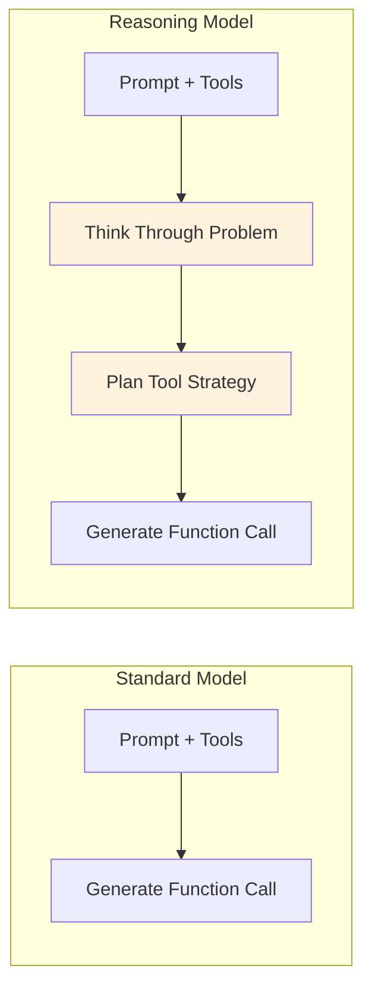

# Reasoning Models and Function Calling

## Introduction

Reasoning models — like GPT-5, o4-mini, Gemini 3 with thinking, and Claude with extended thinking — represent a significant evolution in function calling capability. These models don't just pattern-match tools to user intent. They *think through* the problem first, reason about which tools to use and in what order, and then generate more accurate function calls with better-crafted arguments.

However, reasoning models introduce special requirements that you must handle in your code. This lesson explains how each provider's reasoning models work with function calling and what you need to do differently.

### What we'll cover

- What reasoning models are and why they improve function calling
- OpenAI reasoning items: GPT-5 and o4-mini
- Google Gemini thinking process and thought signatures
- Anthropic Claude extended thinking
- Handling reasoning output in multi-turn conversations
- Performance trade-offs

### Prerequisites

- Understanding of function calling across providers ([Lesson 04](./04-supported-providers-models.md))
- Familiarity with multi-turn conversations (Unit 4)

---

## Why reasoning improves function calling

Standard models generate function calls based on pattern matching and learned associations. Reasoning models add an explicit **thinking step** before generating the call, which improves accuracy in several ways:



| Capability | Standard Model | Reasoning Model |
|-----------|---------------|-----------------|
| Simple tool selection | ✅ Good | ✅ Excellent |
| Complex multi-tool workflows | ⚠️ Sometimes wrong | ✅ Plans the sequence |
| Ambiguous parameter extraction | ⚠️ May guess | ✅ Reasons through context |
| Edge cases | ⚠️ Inconsistent | ✅ Considers alternatives |
| Unnecessary tool calls | ⚠️ May call when not needed | ✅ Reasons about necessity |

### When reasoning matters most

Reasoning models shine when the tool decision is **non-trivial**:

```python
# Simple case: reasoning doesn't add much
"What's the weather in Paris?"
# Any model correctly calls get_weather(location="Paris")

# Complex case: reasoning makes a difference
"If it's going to rain in Paris tomorrow, book me an indoor restaurant. 
Otherwise, find one with outdoor seating."
# Reasoning model: 
# 1. Think: "I need weather first, then restaurant based on result"
# 2. Call get_weather_forecast(location="Paris", days=1)
# 3. Based on result, call search_restaurants with appropriate filter
# Standard model might try to call both simultaneously or miss the condition
```

---

## OpenAI reasoning models

### GPT-5 and o4-mini reasoning items

OpenAI's reasoning models (GPT-5, o4-mini, o3) produce **reasoning items** in their output. These are internal thinking steps that appear alongside function calls.

```python
from openai import OpenAI
import json

client = OpenAI()

response = client.responses.create(
    model="gpt-5",
    input=[{
        "role": "user",
        "content": "Compare the weather in Paris and Tokyo and recommend "
                   "which city is better for an outdoor picnic today."
    }],
    tools=[{
        "type": "function",
        "name": "get_weather",
        "description": "Get current weather for a location.",
        "parameters": {
            "type": "object",
            "properties": {
                "location": {"type": "string"},
                "units": {"type": "string", "enum": ["celsius", "fahrenheit"]}
            },
            "required": ["location", "units"],
            "additionalProperties": False
        },
        "strict": True
    }]
)

# The response output contains BOTH reasoning items AND function calls
for item in response.output:
    print(f"Type: {item.type}")
    if item.type == "reasoning":
        print("  [Internal reasoning — not shown to user]")
    elif item.type == "function_call":
        print(f"  Function: {item.name}")
        print(f"  Arguments: {item.arguments}")
```

**Output:**
```
Type: reasoning
  [Internal reasoning — not shown to user]
Type: function_call
  Function: get_weather
  Arguments: {"location": "Paris, France", "units": "celsius"}
Type: function_call
  Function: get_weather
  Arguments: {"location": "Tokyo, Japan", "units": "celsius"}
```

### Critical: Passing reasoning items back

> **Warning:** When using reasoning models like GPT-5 or o4-mini, you **must** include reasoning items when sending tool call results back to the model. Omitting them breaks the model's reasoning chain.

```python
# ✅ CORRECT: Include ALL output items (reasoning + function calls)
input_messages = [
    {"role": "user", "content": "Compare weather in Paris and Tokyo..."}
]

# Add the ENTIRE model output — including reasoning items
input_messages += response.output  # This includes reasoning items!

# Add function call results
for item in response.output:
    if item.type == "function_call":
        result = get_weather(json.loads(item.arguments))
        input_messages.append({
            "type": "function_call_output",
            "call_id": item.call_id,
            "output": json.dumps(result)
        })

# Send back with all context
final = client.responses.create(
    model="gpt-5",
    input=input_messages,
    tools=tools
)
```

```python
# ❌ WRONG: Filtering out reasoning items
input_messages = [
    {"role": "user", "content": "Compare weather in Paris and Tokyo..."}
]

# Don't do this — it strips reasoning context!
for item in response.output:
    if item.type == "function_call":  # Skips reasoning items
        input_messages.append(item)
        result = get_weather(json.loads(item.arguments))
        input_messages.append({
            "type": "function_call_output",
            "call_id": item.call_id,
            "output": json.dumps(result)
        })
# The model loses its reasoning chain and may produce poor results
```

**Output:**
```
With reasoning items: Model remembers WHY it called those functions
Without reasoning items: Model may repeat calls or give inconsistent response
```

### Reasoning model best practices (OpenAI)

```python
# Use response.output directly — it preserves ordering
input_messages = [{"role": "user", "content": user_message}]
input_messages += response.output  # Always include everything

# Only add function_call_output items for function_call items
for item in response.output:
    if item.type == "function_call":
        result = execute_function(item.name, json.loads(item.arguments))
        input_messages.append({
            "type": "function_call_output",
            "call_id": item.call_id,
            "output": json.dumps(result)
        })
```

> **💡 Tip:** Don't add examples to the prompt when using reasoning models. OpenAI's documentation notes that adding examples may actually hurt performance for reasoning models, as they may conflict with the model's internal reasoning process.

---

## Google Gemini thinking models

### Gemini 3 and thinking process

Gemini 3 series models and Gemini 2.5 models use an internal "thinking" process that significantly improves function calling. The key mechanism is **thought signatures** — cryptographic tokens that maintain reasoning context across turns.

```python
from google import genai
from google.genai import types

client = genai.Client()

tools = types.Tool(function_declarations=[{
    "name": "get_weather",
    "description": "Get current weather for a location.",
    "parameters": {
        "type": "object",
        "properties": {
            "location": {"type": "string", "description": "City name"}
        },
        "required": ["location"]
    }
}])

# Enable thinking
config = types.GenerateContentConfig(
    tools=[tools],
    thinking_config=types.ThinkingConfig(include_thoughts=True)
)

response = client.models.generate_content(
    model="gemini-3-flash-preview",
    contents="What's the weather in Paris?",
    config=config
)
```

**Output:**
```
Response includes:
  - Thought parts (internal reasoning, may be visible with include_thoughts)
  - Function call with thought_signature attached
  - Signature must be preserved in multi-turn conversations
```

### Thought signatures: automatic handling

The Google Gen AI SDK handles thought signatures automatically. You don't need to do anything special:

```python
# The SDK handles thought signatures automatically
# Just use the chat interface or pass complete responses back

chat = client.chats.create(model="gemini-3-flash-preview", config=config)

# First turn — model calls function
response = chat.send_message("What's the weather in Paris?")

# If there's a function call, the SDK automatically preserves signatures
for part in response.candidates[0].content.parts:
    if part.function_call:
        # Execute function
        result = get_weather(part.function_call.args["location"])
        
        # Send result back — SDK preserves thought signatures
        function_response = types.Part.from_function_response(
            name=part.function_call.name,
            response={"result": result}
        )
        final = chat.send_message(function_response)
        print(final.text)
```

**Output:**
```
The SDK automatically:
  1. Preserves thought_signature from model response
  2. Sends it back with function results
  3. Maintains reasoning context across turns
```

### Manual thought signature handling

If you're building conversation history manually (not using the SDK's chat interface), you must handle thought signatures explicitly:

```python
# When manually managing conversation history:
# 1. Always send thought_signature back in its original Part
# 2. Don't merge Parts with signatures with those without
# 3. Don't combine two Parts that both have signatures

# Inspect thought signature (for debugging)
import base64

part = response.candidates[0].content.parts[0]
if part.thought_signature:
    sig = base64.b64encode(part.thought_signature).decode("utf-8")
    print(f"Thought signature present: {sig[:50]}...")
```

**Output:**
```
Thought signature present: dGhpcyBpcyBhIHRob3VnaHQgc2lnbmF0dXJ...
```

> **Important:** Thought signatures are **mandatory** for function calling with Gemini 3 models. If you're manipulating conversation history manually, you must preserve them. The SDK handles this automatically if you don't modify the history.

### Gemini temperature recommendation

```python
# Gemini 3 models: keep temperature at default (1.0)
config = types.GenerateContentConfig(
    tools=[tools],
    # ✅ Default temperature (1.0) — recommended for Gemini 3
    # ❌ Don't set temperature below 1.0 for Gemini 3:
    # temperature=0.0  ← May cause looping or degraded performance
)
```

> **Warning:** For Gemini 3 models, setting temperature below 1.0 may lead to unexpected behavior including looping or degraded performance, especially in complex reasoning and function calling tasks. Keep the default temperature of 1.0.

---

## Anthropic extended thinking

### Claude with extended thinking

Claude's extended thinking feature allows the model to "think" before responding, which improves complex tool use decisions:

```python
import anthropic

client = anthropic.Anthropic()

response = client.messages.create(
    model="claude-sonnet-4-20250514",
    max_tokens=8000,
    thinking={
        "type": "enabled",
        "budget_tokens": 5000  # Allocate tokens for thinking
    },
    tools=[{
        "name": "get_weather",
        "description": "Get current weather for a location.",
        "input_schema": {
            "type": "object",
            "properties": {
                "location": {"type": "string"},
                "units": {"type": "string", "enum": ["celsius", "fahrenheit"]}
            },
            "required": ["location", "units"]
        }
    }],
    messages=[{
        "role": "user",
        "content": "Should I bring a jacket to my outdoor meeting in San Francisco?"
    }]
)

# Response may contain thinking blocks AND tool_use blocks
for block in response.content:
    if block.type == "thinking":
        print(f"Thinking: {block.thinking[:100]}...")
    elif block.type == "tool_use":
        print(f"Tool: {block.name}")
        print(f"Input: {block.input}")
```

**Output:**
```
Thinking: The user is asking about weather for an outdoor meeting in San Francisco. 
I should check the current weather to advise about a jacket. San Francisco is known 
for microclimates and fog, so even if...
Tool: get_weather
Input: {'location': 'San Francisco, CA', 'units': 'fahrenheit'}
```

### Passing thinking blocks back

Similar to OpenAI's reasoning items, Claude's thinking blocks should be included when continuing the conversation:

```python
# Include the full response content (with thinking blocks) 
# when sending tool results back
response_2 = client.messages.create(
    model="claude-sonnet-4-20250514",
    max_tokens=8000,
    thinking={
        "type": "enabled",
        "budget_tokens": 5000
    },
    tools=[{
        "name": "get_weather",
        "description": "Get current weather for a location.",
        "input_schema": {
            "type": "object",
            "properties": {
                "location": {"type": "string"},
                "units": {"type": "string", "enum": ["celsius", "fahrenheit"]}
            },
            "required": ["location", "units"]
        }
    }],
    messages=[
        {"role": "user", "content": "Should I bring a jacket to my outdoor meeting in SF?"},
        {"role": "assistant", "content": response.content},  # Includes thinking + tool_use
        {
            "role": "user",
            "content": [{
                "type": "tool_result",
                "tool_use_id": tool_block.id,
                "content": json.dumps({
                    "temperature": 58,
                    "units": "fahrenheit",
                    "condition": "foggy",
                    "wind_speed": 15
                })
            }]
        }
    ]
)

print(response_2.content[-1].text)
```

**Output:**
```
Yes, I'd definitely recommend bringing a jacket! It's currently 58°F and foggy 
in San Francisco with 15 mph winds. The fog and wind can make it feel even cooler, 
especially for an outdoor meeting.
```

---

## Comparison across providers

| Feature | OpenAI (GPT-5, o4-mini) | Gemini 3 | Claude (Extended Thinking) |
|---------|------------------------|----------|--------------------------|
| **Mechanism** | Reasoning items in output | Thought signatures on parts | Thinking content blocks |
| **Visibility** | Summary available | Opt-in with `include_thoughts` | Full thinking text available |
| **Must pass back** | ✅ Yes — reasoning items | ✅ Yes — thought signatures | ✅ Yes — thinking blocks |
| **SDK auto-handles** | Yes (include `response.output`) | Yes (don't modify history) | Yes (include `response.content`) |
| **Manual handling** | Include all output items | Preserve signatures per part | Include all content blocks |
| **Temperature** | Low temp OK (e.g., 0) | Keep default 1.0 for Gemini 3 | Standard temperature |
| **Token cost** | Reasoning tokens billed separately | Thinking tokens included | Thinking tokens billed |

### The universal rule

Across all providers, the rule is the same:

> **🔑 Key insight:** When a reasoning model produces function calls, always pass the **complete model response** back when returning tool results. Never strip, filter, or modify the model's output — it contains reasoning context that the model needs to maintain coherence.

```python
# Universal pattern — works for all providers:

# 1. Get response (includes reasoning + function calls)
response = call_model(prompt, tools)

# 2. Preserve the ENTIRE response
preserved_response = response  # Don't filter!

# 3. Execute functions from the response
results = execute_function_calls(response)

# 4. Send back preserved response + results
final = call_model_with_results(preserved_response, results)
```

---

## Performance trade-offs

Reasoning models are more capable but come with costs:

| Aspect | Standard Model | Reasoning Model |
|--------|---------------|-----------------|
| **Latency** | Fast (1-3 seconds) | Slower (3-15+ seconds) |
| **Token usage** | Lower | Higher (reasoning tokens) |
| **Cost** | Lower | Higher |
| **Simple tool calls** | ✅ Sufficient | Overkill |
| **Complex tool chains** | ⚠️ May fail | ✅ Excels |
| **Ambiguous requests** | ⚠️ May guess | ✅ Reasons through |

### When to use reasoning models for function calling

```python
# ✅ Use reasoning models when:
# 1. Multi-step tool chains with dependencies
"If the stock price is above $150, sell 100 shares and email me the confirmation"

# 2. Complex conditional logic
"Find me the cheapest flight to a warm destination this weekend"

# 3. Ambiguous requests requiring judgment
"Help me plan a healthy meal with what's in my fridge"

# ❌ Use standard models when:
# 1. Simple, direct tool calls
"What's the weather in Paris?"

# 2. High-throughput, low-latency requirements
# Processing thousands of tool calls per minute

# 3. Cost-sensitive applications
# When reasoning tokens significantly increase cost
```

### Hybrid approach

A common production pattern is to use standard models for simple requests and reasoning models for complex ones:

```python
def select_model(user_message: str, available_tools: list) -> str:
    """Choose between standard and reasoning model based on complexity."""
    complexity_indicators = [
        "if", "then", "compare", "analyze", "plan",
        "best", "recommend", "decide", "multiple"
    ]
    
    message_lower = user_message.lower()
    complexity_score = sum(
        1 for indicator in complexity_indicators 
        if indicator in message_lower
    )
    
    if complexity_score >= 2 or len(available_tools) > 10:
        return "gpt-5"  # Reasoning model for complex requests
    else:
        return "gpt-4.1"  # Standard model for simple requests
```

**Output:**
```
"What's the weather?" → gpt-4.1 (simple, 0 indicators)
"Compare weather in 3 cities and recommend the best for hiking" 
  → gpt-5 (complex, 3 indicators: compare, recommend, best)
```

---

## Best practices

| Practice | Why it matters |
|----------|----------------|
| Always pass complete model output back | Reasoning context is essential for coherent multi-turn tool use |
| Use `response.output` / `response.content` directly | Don't manually filter or restructure model output |
| Choose model tier based on task complexity | Save reasoning models for tasks that benefit from thinking |
| Keep Gemini 3 temperature at default (1.0) | Lower temperatures cause unexpected behavior in reasoning models |
| Monitor reasoning token usage | Reasoning tokens add significant cost at scale |

---

## Common pitfalls

| ❌ Mistake | ✅ Solution |
|-----------|-------------|
| Stripping reasoning items from OpenAI output | Use `response.output` directly — include everything |
| Modifying Gemini conversation history | Let the SDK handle thought signatures automatically |
| Omitting Claude thinking blocks from follow-up | Include `response.content` completely in the assistant message |
| Using reasoning models for simple tool calls | Use standard models (GPT-4.1, Claude Sonnet) for simple cases |
| Setting Gemini 3 temperature below 1.0 | Keep default temperature to avoid looping and degraded performance |

---

## Hands-on exercise

### Your task

Design a multi-step tool-calling workflow that benefits from reasoning models.

### Requirements

1. Create a scenario that requires **conditional tool calling** — where the result of one tool call determines which tool to call next
2. Define 3 tools needed for the workflow
3. Write pseudocode showing:
   - The user's request
   - The reasoning model's thinking process (what it would reason about)
   - The sequence of tool calls with their dependencies
   - How results flow between steps
4. Explain why a standard model might fail at this task

### Expected result

A complete multi-step workflow showing reasoning model advantages.

<details>
<summary>💡 Hints (click to expand)</summary>

- Think about real-world scenarios with "if/then" logic
- The reasoning model's advantage is planning the full sequence before making the first call
- Consider: what information from tool call 1 is needed to decide tool call 2?
- Examples: travel planning, order fulfillment, troubleshooting workflows

</details>

<details>
<summary>✅ Solution (click to expand)</summary>

```python
# Scenario: Smart order fulfillment system
# User: "Process the return for order #1234. If the item is still in 
#        warranty, issue a full refund. Otherwise, offer store credit 
#        at 50% value."

# Tools needed:
tools = [
    {
        "type": "function",
        "name": "get_order_details",
        "description": "Get full details of an order including items, "
                       "purchase date, and warranty status.",
        "parameters": {
            "type": "object",
            "properties": {
                "order_id": {"type": "string"}
            },
            "required": ["order_id"],
            "additionalProperties": False
        },
        "strict": True
    },
    {
        "type": "function",
        "name": "process_refund",
        "description": "Issue a full monetary refund for an order.",
        "parameters": {
            "type": "object",
            "properties": {
                "order_id": {"type": "string"},
                "amount": {"type": "number"},
                "reason": {"type": "string"}
            },
            "required": ["order_id", "amount", "reason"],
            "additionalProperties": False
        },
        "strict": True
    },
    {
        "type": "function",
        "name": "issue_store_credit",
        "description": "Issue store credit to the customer's account.",
        "parameters": {
            "type": "object",
            "properties": {
                "order_id": {"type": "string"},
                "credit_amount": {"type": "number"},
                "expiration_days": {"type": "integer"}
            },
            "required": ["order_id", "credit_amount", "expiration_days"],
            "additionalProperties": False
        },
        "strict": True
    }
]

# Reasoning model's thinking process:
# "I need to:
# 1. First get the order details to check warranty status
# 2. Based on warranty: either refund or store credit
# 3. I can't call both refund and credit — I need to WAIT for
#    the order details before deciding which to call
# 4. Store credit should be 50% of the order value
# 5. I should start with get_order_details"

# Step 1: Model calls get_order_details(order_id="1234")
# Result: {purchase_date: "2025-01-15", amount: 99.99, warranty_until: "2026-01-15"}

# Step 2: Model reasons: "Warranty is until 2026-01-15, today is 2025-07-15.
#          The item IS in warranty. I should issue a full refund."
# Model calls: process_refund(order_id="1234", amount=99.99, reason="warranty return")

# Why standard model might fail:
# 1. May call both refund AND store_credit simultaneously
# 2. May not check warranty before deciding
# 3. May not calculate 50% correctly for store credit
# 4. May skip get_order_details entirely and guess at the amount
```

</details>

### Bonus challenges

- [ ] Modify the scenario so the reasoning model needs to make 3 sequential tool calls
- [ ] Implement the model selection function that chooses between standard and reasoning models
- [ ] Calculate the cost difference between using GPT-4.1 vs. GPT-5 for this workflow

---

## Summary

✅ **Reasoning models** (GPT-5, o4-mini, Gemini 3 with thinking, Claude with extended thinking) add a thinking step that significantly improves **complex, multi-step, and conditional** function calling

✅ All providers produce reasoning artifacts — **reasoning items** (OpenAI), **thought signatures** (Gemini), **thinking blocks** (Anthropic) — that must be preserved in multi-turn conversations

✅ The universal rule: **always pass the complete model response back** when returning tool results — never strip or filter reasoning content

✅ **Performance trade-off**: reasoning models are slower and more expensive but excel at complex tool chains; use standard models for simple, direct tool calls

✅ For Gemini 3 models, keep **temperature at the default (1.0)** to avoid degraded function calling performance

✅ Consider a **hybrid approach**: route simple requests to standard models and complex requests to reasoning models

**Next:** [Response Validation Before Processing](./06-response-validation.md)

---

[← Previous: Supported Providers and Models](./04-supported-providers-models.md) | [Back to Function Calling Concepts](./00-function-calling-concepts.md) | [Next: Response Validation →](./06-response-validation.md)

<!--
Sources Consulted:
- OpenAI Function Calling Guide (Reasoning Models): https://platform.openai.com/docs/guides/function-calling
- Google Gemini Thinking Models & Thought Signatures: https://ai.google.dev/gemini-api/docs/function-calling
- Google Gemini Thought Signatures: https://ai.google.dev/gemini-api/docs/thought-signatures
- Anthropic Extended Thinking: https://platform.claude.com/docs/en/docs/build-with-claude/extended-thinking
-->
