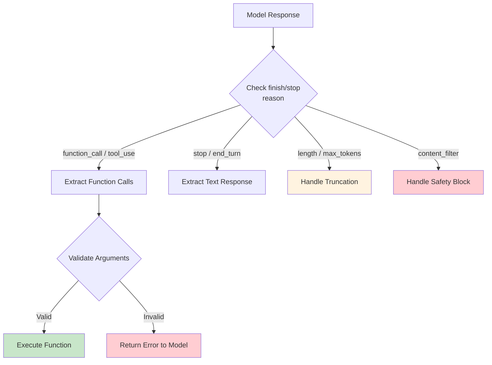

# Response Validation Before Processing

## Introduction

When a model returns a response, it might contain a function call, a text message, multiple function calls, or even a mix of both. Before executing any function, you must validate what you received. Skipping validation leads to runtime errors, security vulnerabilities, and silent failures that are difficult to debug.

This lesson covers how to inspect model responses across providers, detect function calls vs. text responses, handle edge cases, and build robust validation logic.

### What we'll cover

- Checking finish reasons and stop reasons by provider
- Detecting function calls vs. text responses
- Handling incomplete, malformed, or failed calls
- Validating arguments before execution
- Building a validation pipeline
- Provider-specific finish reason values

### Prerequisites

- Understanding of provider APIs ([Lesson 04](./04-supported-providers-models.md))
- Knowledge of reasoning model output ([Lesson 05](./05-reasoning-models.md))

---

## Why validation matters

The model's response is not guaranteed to contain a function call, even when tools are defined. The model might:

1. **Respond with text** — deciding no tool is needed
2. **Call a function** — with correct arguments
3. **Call multiple functions** — in parallel
4. **Produce an incomplete call** — due to token limits
5. **Hit a safety filter** — refusing to proceed
6. **Return malformed arguments** — in non-strict mode

Your code must handle all of these cases gracefully.



---

## Finish reasons by provider

Each provider uses a different field and different values to indicate why the model stopped generating:

### OpenAI Responses API

```python
from openai import OpenAI
import json

client = OpenAI()

response = client.responses.create(
    model="gpt-4.1",
    input=[{"role": "user", "content": "What's the weather in Paris?"}],
    tools=tools
)

# Check the response status
print(f"Status: {response.status}")

# Determine response type by examining output items
has_function_calls = any(
    item.type == "function_call" for item in response.output
)
has_text = any(
    item.type == "message" for item in response.output
)

print(f"Has function calls: {has_function_calls}")
print(f"Has text: {has_text}")
```

**Output:**
```
Status: completed
Has function calls: True
Has text: False
```

In the Responses API, you check the **output item types** rather than a single finish reason:

| Output Item Type | Meaning |
|-----------------|---------|
| `function_call` | Model wants to call a function |
| `message` | Model produced a text response |
| `reasoning` | Internal reasoning (reasoning models only) |

### OpenAI Chat Completions API

```python
response = client.chat.completions.create(
    model="gpt-4.1",
    messages=[{"role": "user", "content": "What's the weather in Paris?"}],
    tools=tools
)

choice = response.choices[0]
print(f"Finish reason: {choice.finish_reason}")
```

**Output:**
```
Finish reason: tool_calls
```

| Finish Reason | Meaning |
|--------------|---------|
| `tool_calls` | Model wants to call one or more functions |
| `stop` | Model finished normally with text |
| `length` | Response truncated due to `max_tokens` |
| `content_filter` | Response blocked by safety filter |

### Anthropic Messages API

```python
import anthropic

client = anthropic.Anthropic()

response = client.messages.create(
    model="claude-sonnet-4-20250514",
    max_tokens=1024,
    tools=tools_anthropic,
    messages=[{"role": "user", "content": "What's the weather in Paris?"}]
)

print(f"Stop reason: {response.stop_reason}")
```

**Output:**
```
Stop reason: tool_use
```

| Stop Reason | Meaning |
|------------|---------|
| `tool_use` | Model wants to call one or more tools |
| `end_turn` | Model finished normally with text |
| `max_tokens` | Response truncated due to token limit |
| `stop_sequence` | Hit a custom stop sequence |

### Google Gemini

```python
from google import genai

client = genai.Client()

response = client.models.generate_content(
    model="gemini-3-flash-preview",
    contents="What's the weather in Paris?",
    config=config
)

candidate = response.candidates[0]
print(f"Finish reason: {candidate.finish_reason}")

# Check if response contains function calls
has_function_call = any(
    part.function_call for part in candidate.content.parts
)
print(f"Has function call: {has_function_call}")
```

**Output:**
```
Finish reason: STOP
Has function call: True
```

| Finish Reason | Meaning |
|--------------|---------|
| `STOP` | Normal completion (may include function calls) |
| `MAX_TOKENS` | Response truncated |
| `SAFETY` | Blocked by safety filter |
| `RECITATION` | Blocked due to recitation concerns |

> **Note:** Gemini uses `STOP` for both text responses and function calls. You must check the response content parts to determine if function calls are present.

---

## Detecting function calls vs. text responses

Here is a robust pattern for each provider:

### OpenAI (Responses API)

```python
def process_openai_response(response) -> dict:
    """Process an OpenAI Responses API response."""
    function_calls = []
    text_parts = []
    reasoning_parts = []
    
    for item in response.output:
        if item.type == "function_call":
            function_calls.append({
                "name": item.name,
                "arguments": json.loads(item.arguments),
                "call_id": item.call_id
            })
        elif item.type == "message":
            for content in item.content:
                if content.type == "output_text":
                    text_parts.append(content.text)
        elif item.type == "reasoning":
            reasoning_parts.append(item)
    
    return {
        "has_function_calls": len(function_calls) > 0,
        "function_calls": function_calls,
        "text": "\n".join(text_parts) if text_parts else None,
        "has_reasoning": len(reasoning_parts) > 0,
        "reasoning": reasoning_parts
    }

result = process_openai_response(response)
if result["has_function_calls"]:
    for call in result["function_calls"]:
        print(f"Execute: {call['name']}({call['arguments']})")
elif result["text"]:
    print(f"Text response: {result['text']}")
```

**Output:**
```
Execute: get_weather({"location": "Paris, France", "units": "celsius"})
```

### Anthropic

```python
def process_anthropic_response(response) -> dict:
    """Process an Anthropic Messages API response."""
    function_calls = []
    text_parts = []
    thinking_parts = []
    
    for block in response.content:
        if block.type == "tool_use":
            function_calls.append({
                "name": block.name,
                "arguments": block.input,  # Already a dict
                "call_id": block.id
            })
        elif block.type == "text":
            text_parts.append(block.text)
        elif block.type == "thinking":
            thinking_parts.append(block.thinking)
    
    return {
        "has_function_calls": response.stop_reason == "tool_use",
        "function_calls": function_calls,
        "text": "\n".join(text_parts) if text_parts else None,
        "stop_reason": response.stop_reason
    }

result = process_anthropic_response(response)
if result["has_function_calls"]:
    for call in result["function_calls"]:
        print(f"Execute: {call['name']}({call['arguments']})")
else:
    print(f"Text: {result['text']}")
    print(f"Stop reason: {result['stop_reason']}")
```

**Output:**
```
Execute: get_weather({'location': 'Paris, France', 'units': 'celsius'})
```

### Gemini

```python
def process_gemini_response(response) -> dict:
    """Process a Gemini response."""
    function_calls = []
    text_parts = []
    
    candidate = response.candidates[0]
    
    for i, part in enumerate(candidate.content.parts):
        if part.function_call:
            function_calls.append({
                "name": part.function_call.name,
                "arguments": dict(part.function_call.args),
                "call_id": f"gemini_call_{i}"
            })
        elif part.text:
            text_parts.append(part.text)
    
    return {
        "has_function_calls": len(function_calls) > 0,
        "function_calls": function_calls,
        "text": "\n".join(text_parts) if text_parts else None,
        "finish_reason": candidate.finish_reason
    }
```

**Output:**
```
Same pattern: check for function calls, extract or fall back to text
```

---

## Validating arguments before execution

Even with strict mode, you should validate function call arguments before executing them — especially for functions with side effects.

### Type and range validation

```python
from dataclasses import dataclass
from typing import Any

@dataclass
class ValidationResult:
    """Result of argument validation."""
    is_valid: bool
    errors: list[str]
    sanitized_args: dict[str, Any] | None = None

def validate_arguments(
    function_name: str,
    arguments: dict[str, Any],
    schema: dict
) -> ValidationResult:
    """Validate function call arguments against expected constraints."""
    errors = []
    sanitized = dict(arguments)
    
    properties = schema.get("properties", {})
    required = schema.get("required", [])
    
    # Check required fields
    for field in required:
        if field not in arguments:
            errors.append(f"Missing required field: {field}")
    
    # Validate types and ranges
    for field, value in arguments.items():
        if field not in properties:
            errors.append(f"Unexpected field: {field}")
            continue
        
        prop = properties[field]
        expected_type = prop.get("type")
        
        # Check enum values
        if "enum" in prop and value not in prop["enum"]:
            errors.append(
                f"Invalid value for {field}: '{value}'. "
                f"Must be one of: {prop['enum']}"
            )
        
        # Check numeric ranges (custom validation)
        if expected_type == "integer" and isinstance(value, int):
            if "minimum" in prop and value < prop["minimum"]:
                errors.append(f"{field} must be >= {prop['minimum']}")
            if "maximum" in prop and value > prop["maximum"]:
                errors.append(f"{field} must be <= {prop['maximum']}")
        
        # Sanitize strings (prevent injection)
        if expected_type == "string" and isinstance(value, str):
            sanitized[field] = value.strip()
    
    return ValidationResult(
        is_valid=len(errors) == 0,
        errors=errors,
        sanitized_args=sanitized if len(errors) == 0 else None
    )

# Usage
result = validate_arguments(
    "get_weather",
    {"location": "Paris, France", "units": "celsius"},
    {
        "properties": {
            "location": {"type": "string"},
            "units": {"type": "string", "enum": ["celsius", "fahrenheit"]}
        },
        "required": ["location", "units"]
    }
)

print(f"Valid: {result.is_valid}")
print(f"Errors: {result.errors}")
```

**Output:**
```
Valid: True
Errors: []
```

### Security-critical validation

For functions that perform actions with real-world effects, add extra checks:

```python
def validate_dangerous_function(
    function_name: str,
    arguments: dict,
    user_permissions: dict
) -> ValidationResult:
    """Extra validation for functions with side effects."""
    errors = []
    
    # Permission check
    dangerous_functions = {
        "delete_record": "admin",
        "send_email": "write",
        "execute_query": "read",
        "transfer_funds": "admin"
    }
    
    required_permission = dangerous_functions.get(function_name)
    if required_permission and not user_permissions.get(required_permission):
        errors.append(
            f"Insufficient permissions for {function_name}. "
            f"Requires: {required_permission}"
        )
    
    # Rate limiting check
    if function_name in ["send_email", "transfer_funds"]:
        recent_calls = get_recent_call_count(function_name, minutes=5)
        if recent_calls > 10:
            errors.append(f"Rate limit exceeded for {function_name}")
    
    # Amount limits
    if function_name == "transfer_funds":
        amount = arguments.get("amount", 0)
        if amount > 10000:
            errors.append(
                f"Transfer amount ${amount} exceeds limit. "
                f"Amounts over $10,000 require manual approval."
            )
    
    return ValidationResult(
        is_valid=len(errors) == 0,
        errors=errors,
        sanitized_args=arguments if len(errors) == 0 else None
    )
```

**Output:**
```
For transfer_funds(amount=50000):
  Valid: False
  Errors: ["Transfer amount $50000 exceeds limit. Amounts over $10,000 require manual approval."]
```

---

## Handling edge cases

### Truncated responses (length / max_tokens)

When the model runs out of tokens mid-function-call, the arguments may be incomplete:

```python
def handle_truncated_response(response, provider: str) -> str | None:
    """Detect and handle truncated responses."""
    
    if provider == "openai_chat":
        if response.choices[0].finish_reason == "length":
            return "Response truncated — increase max_tokens"
    
    elif provider == "anthropic":
        if response.stop_reason == "max_tokens":
            return "Response truncated — increase max_tokens"
    
    elif provider == "gemini":
        if response.candidates[0].finish_reason == "MAX_TOKENS":
            return "Response truncated — increase max_tokens"
    
    return None  # Not truncated

# Check before processing
truncation_error = handle_truncated_response(response, "anthropic")
if truncation_error:
    print(f"⚠️ {truncation_error}")
    # Retry with higher max_tokens or simpler prompt
else:
    process_response(response)
```

**Output:**
```
⚠️ Response truncated — increase max_tokens
```

> **💡 Tip:** If you get truncated function calls, increase `max_tokens` or reduce the number of available tools. Truncated JSON arguments will fail to parse.

### Content filter / safety blocks

```python
def handle_safety_block(response, provider: str) -> str | None:
    """Detect safety-filtered responses."""
    
    if provider == "openai_chat":
        if response.choices[0].finish_reason == "content_filter":
            return "Response blocked by content filter"
    
    elif provider == "gemini":
        candidate = response.candidates[0]
        if candidate.finish_reason == "SAFETY":
            # Check which safety category triggered
            for rating in candidate.safety_ratings:
                if rating.blocked:
                    return f"Blocked by safety filter: {rating.category}"
    
    return None

safety_error = handle_safety_block(response, "gemini")
if safety_error:
    print(f"🔒 {safety_error}")
    # Return a safe fallback response to the user
```

**Output:**
```
🔒 Blocked by safety filter: HARM_CATEGORY_DANGEROUS_CONTENT
```

### No function call when expected

Sometimes the model responds with text even though you expected a function call:

```python
def ensure_function_call(response, provider: str, retry_count: int = 0):
    """Handle cases where the model doesn't call a function when expected."""
    processed = process_response(response, provider)
    
    if not processed["has_function_calls"]:
        if retry_count < 2:
            # Retry with stronger tool_choice
            print("No function call detected. Retrying with tool_choice=required...")
            # Re-send with tool_choice="required" or "any"
            return None  # Signal to retry
        else:
            # Give up after retries
            print(f"Model responded with text: {processed['text']}")
            return processed
    
    return processed
```

---

## Complete validation pipeline

Here is a production-ready validation pipeline that ties everything together:

```python
from dataclasses import dataclass, field
from typing import Any, Callable
from enum import Enum
import json
import logging

logger = logging.getLogger(__name__)

class ResponseType(Enum):
    FUNCTION_CALLS = "function_calls"
    TEXT = "text"
    TRUNCATED = "truncated"
    SAFETY_BLOCKED = "safety_blocked"
    ERROR = "error"

@dataclass
class ProcessedResponse:
    """Standardized response after validation."""
    response_type: ResponseType
    function_calls: list[dict] = field(default_factory=list)
    text: str | None = None
    errors: list[str] = field(default_factory=list)
    raw_response: Any = None

def validate_and_process(
    response: Any,
    provider: str,
    tool_schemas: dict[str, dict],
    permission_check: Callable | None = None
) -> ProcessedResponse:
    """Complete validation pipeline for any provider's response."""
    
    # Step 1: Check for truncation
    truncation = handle_truncated_response(response, provider)
    if truncation:
        logger.warning(f"Truncated response: {truncation}")
        return ProcessedResponse(
            response_type=ResponseType.TRUNCATED,
            errors=[truncation],
            raw_response=response
        )
    
    # Step 2: Check for safety blocks
    safety = handle_safety_block(response, provider)
    if safety:
        logger.warning(f"Safety block: {safety}")
        return ProcessedResponse(
            response_type=ResponseType.SAFETY_BLOCKED,
            errors=[safety],
            raw_response=response
        )
    
    # Step 3: Extract function calls
    processed = process_response(response, provider)
    
    if not processed["has_function_calls"]:
        return ProcessedResponse(
            response_type=ResponseType.TEXT,
            text=processed.get("text"),
            raw_response=response
        )
    
    # Step 4: Validate each function call
    validated_calls = []
    errors = []
    
    for call in processed["function_calls"]:
        # Check function exists
        if call["name"] not in tool_schemas:
            errors.append(f"Unknown function: {call['name']}")
            continue
        
        # Validate arguments
        schema = tool_schemas[call["name"]]
        validation = validate_arguments(
            call["name"], call["arguments"], schema
        )
        
        if not validation.is_valid:
            errors.extend(validation.errors)
            continue
        
        # Permission check (if provided)
        if permission_check and not permission_check(call["name"]):
            errors.append(f"Permission denied for {call['name']}")
            continue
        
        validated_calls.append({
            "name": call["name"],
            "arguments": validation.sanitized_args,
            "call_id": call["call_id"]
        })
    
    if errors:
        logger.warning(f"Validation errors: {errors}")
    
    return ProcessedResponse(
        response_type=ResponseType.FUNCTION_CALLS if validated_calls 
                       else ResponseType.ERROR,
        function_calls=validated_calls,
        errors=errors,
        raw_response=response
    )

# Usage
result = validate_and_process(
    response=api_response,
    provider="openai",
    tool_schemas={
        "get_weather": {
            "properties": {
                "location": {"type": "string"},
                "units": {"type": "string", "enum": ["celsius", "fahrenheit"]}
            },
            "required": ["location", "units"]
        }
    }
)

if result.response_type == ResponseType.FUNCTION_CALLS:
    for call in result.function_calls:
        execute_function(call["name"], call["arguments"])
elif result.response_type == ResponseType.TEXT:
    display_to_user(result.text)
elif result.response_type == ResponseType.TRUNCATED:
    retry_with_higher_tokens()
elif result.response_type == ResponseType.ERROR:
    log_errors(result.errors)
```

**Output:**
```
ResponseType.FUNCTION_CALLS
  → Execute validated function calls
  
ResponseType.TEXT
  → Display text to user
  
ResponseType.TRUNCATED
  → Retry with higher max_tokens
  
ResponseType.ERROR
  → Log errors and return error message to model
```

---

## Returning errors to the model

When validation fails, return a structured error to the model so it can try again or inform the user:

```python
# When a function call fails validation
error_result = {
    "status": "error",
    "error_type": "validation_error",
    "message": "Invalid argument: units must be 'celsius' or 'fahrenheit', "
               "got 'kelvin'",
    "suggestion": "Please use 'celsius' or 'fahrenheit' for the units parameter"
}

# Send error back as function_call_output
input_messages.append({
    "type": "function_call_output",
    "call_id": call["call_id"],
    "output": json.dumps(error_result)
})

# The model will either:
# 1. Retry with corrected arguments
# 2. Inform the user about the issue
# 3. Try a different approach
```

**Output:**
```
Model receives error → Retries: get_weather(location="Paris", units="celsius")
```

---

## Best practices

| Practice | Why it matters |
|----------|----------------|
| Always check finish/stop reason first | Catches truncation and safety blocks before processing |
| Validate arguments even with strict mode | Security-critical functions need extra checks |
| Return structured errors to the model | Enables self-correction and better user messages |
| Log all validation failures | Helps identify patterns in model misbehavior |
| Handle the "no function call" case | Models can always choose to respond with text |
| Set appropriate `max_tokens` | Prevents truncated function call arguments |

---

## Common pitfalls

| ❌ Mistake | ✅ Solution |
|-----------|-------------|
| Assuming every response has a function call | Always check for text responses and handle them |
| Ignoring truncated responses | Check finish reason before parsing arguments |
| Not validating arguments from non-strict models | Open-source models need explicit argument validation |
| Using `json.loads()` without try/except | Wrap in error handling for malformed arguments |
| Not returning errors back to the model | The model can self-correct if you tell it what went wrong |
| Treating all function calls as safe to execute | Add permission and rate-limiting checks for dangerous operations |

---

## Hands-on exercise

### Your task

Build a validation function that handles responses from any provider and detects all edge cases.

### Requirements

1. Write a `validate_response` function that:
   - Accepts responses from OpenAI, Anthropic, or Gemini
   - Detects: function calls, text responses, truncation, and safety blocks
   - Validates function call arguments against a schema
   - Returns a standardized result object
2. Test it with these scenarios:
   - Normal function call response
   - Text-only response (no function call)
   - Truncated response
   - Invalid function name (not in your tool set)
   - Invalid argument type (string where integer expected)

### Expected result

A robust validation function with test cases for each scenario.

<details>
<summary>💡 Hints (click to expand)</summary>

- Start with the `ProcessedResponse` dataclass from this lesson
- Use the `ResponseType` enum to categorize outcomes
- Each provider has different field names for the same concept
- Consider: what happens if `json.loads()` fails on arguments?

</details>

<details>
<summary>✅ Solution (click to expand)</summary>

```python
import json
from dataclasses import dataclass, field
from enum import Enum
from typing import Any

class ResponseType(Enum):
    FUNCTION_CALLS = "function_calls"
    TEXT = "text"
    TRUNCATED = "truncated"
    SAFETY_BLOCKED = "safety_blocked"
    ERROR = "error"

@dataclass
class ProcessedResponse:
    response_type: ResponseType
    function_calls: list[dict] = field(default_factory=list)
    text: str | None = None
    errors: list[str] = field(default_factory=list)

def validate_response(
    response: Any,
    provider: str,
    known_functions: set[str]
) -> ProcessedResponse:
    """Validate a model response from any provider."""
    errors = []
    function_calls = []
    text = None
    
    # Provider-specific extraction
    if provider == "openai":
        for item in response.output:
            if item.type == "function_call":
                try:
                    args = json.loads(item.arguments)
                except json.JSONDecodeError as e:
                    errors.append(f"Malformed arguments: {e}")
                    continue
                
                if item.name not in known_functions:
                    errors.append(f"Unknown function: {item.name}")
                    continue
                
                function_calls.append({
                    "name": item.name,
                    "arguments": args,
                    "call_id": item.call_id
                })
            elif item.type == "message":
                for content in item.content:
                    if hasattr(content, "text"):
                        text = content.text
    
    elif provider == "anthropic":
        if response.stop_reason == "max_tokens":
            return ProcessedResponse(
                response_type=ResponseType.TRUNCATED,
                errors=["Response truncated by max_tokens"]
            )
        
        for block in response.content:
            if block.type == "tool_use":
                if block.name not in known_functions:
                    errors.append(f"Unknown function: {block.name}")
                    continue
                function_calls.append({
                    "name": block.name,
                    "arguments": block.input,
                    "call_id": block.id
                })
            elif block.type == "text":
                text = block.text
    
    elif provider == "gemini":
        candidate = response.candidates[0]
        if candidate.finish_reason == "MAX_TOKENS":
            return ProcessedResponse(
                response_type=ResponseType.TRUNCATED,
                errors=["Response truncated by max_tokens"]
            )
        if candidate.finish_reason == "SAFETY":
            return ProcessedResponse(
                response_type=ResponseType.SAFETY_BLOCKED,
                errors=["Response blocked by safety filter"]
            )
        
        for i, part in enumerate(candidate.content.parts):
            if part.function_call:
                name = part.function_call.name
                if name not in known_functions:
                    errors.append(f"Unknown function: {name}")
                    continue
                function_calls.append({
                    "name": name,
                    "arguments": dict(part.function_call.args),
                    "call_id": f"gemini_{i}"
                })
            elif part.text:
                text = part.text
    
    # Determine response type
    if errors and not function_calls:
        return ProcessedResponse(
            response_type=ResponseType.ERROR,
            errors=errors
        )
    elif function_calls:
        return ProcessedResponse(
            response_type=ResponseType.FUNCTION_CALLS,
            function_calls=function_calls,
            errors=errors  # May have partial errors
        )
    else:
        return ProcessedResponse(
            response_type=ResponseType.TEXT,
            text=text
        )

# Test cases
known = {"get_weather", "search_products"}

# Test 1: Normal function call
# result = validate_response(normal_response, "openai", known)
# assert result.response_type == ResponseType.FUNCTION_CALLS

# Test 2: Text-only response
# result = validate_response(text_response, "anthropic", known)
# assert result.response_type == ResponseType.TEXT

# Test 3: Unknown function
# result = validate_response(bad_fn_response, "openai", known)
# assert result.response_type == ResponseType.ERROR
# assert "Unknown function" in result.errors[0]
```

</details>

### Bonus challenges

- [ ] Add rate limiting to the validation pipeline (max 5 function calls per minute per function)
- [ ] Implement argument type checking (verify integers, strings, enums match the schema)
- [ ] Build a retry mechanism that re-sends with `tool_choice="required"` when no function call is detected

---

## Summary

✅ Always check **finish/stop reason** before processing — it tells you if the response is complete, truncated, or blocked

✅ Detect response type first: **function calls, text, truncation, or safety block** — each requires different handling

✅ **Validate arguments** before execution, even with strict mode — add permission checks and rate limiting for dangerous functions

✅ Return **structured error messages** to the model when validation fails — the model can self-correct and retry

✅ Handle **provider differences**: OpenAI uses output item types, Anthropic uses `stop_reason`, Gemini uses `finish_reason` plus content inspection

✅ Build a **standardized validation pipeline** that works across providers and handles all edge cases

**Next:** [Use Cases for Function Calling](./07-use-cases.md)

---

[← Previous: Reasoning Models](./05-reasoning-models.md) | [Back to Function Calling Concepts](./00-function-calling-concepts.md) | [Next: Use Cases →](./07-use-cases.md)

<!--
Sources Consulted:
- OpenAI Function Calling Guide (Handling Function Calls): https://platform.openai.com/docs/guides/function-calling
- OpenAI API Reference (Finish Reasons): https://platform.openai.com/docs/api-reference
- Anthropic Tool Use (Stop Reason): https://platform.claude.com/docs/en/docs/build-with-claude/tool-use
- Google Gemini Function Calling (Best Practices): https://ai.google.dev/gemini-api/docs/function-calling#best-practices
- Google Gemini FinishReason: https://ai.google.dev/api/generate-content#FinishReason
-->
