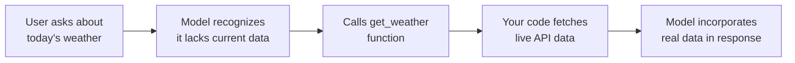
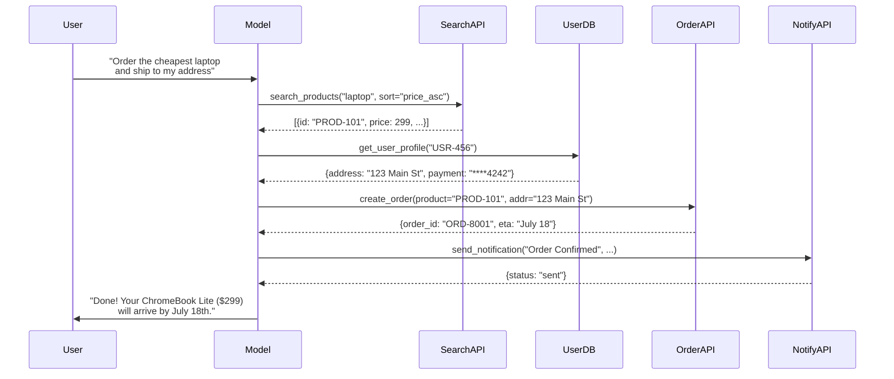
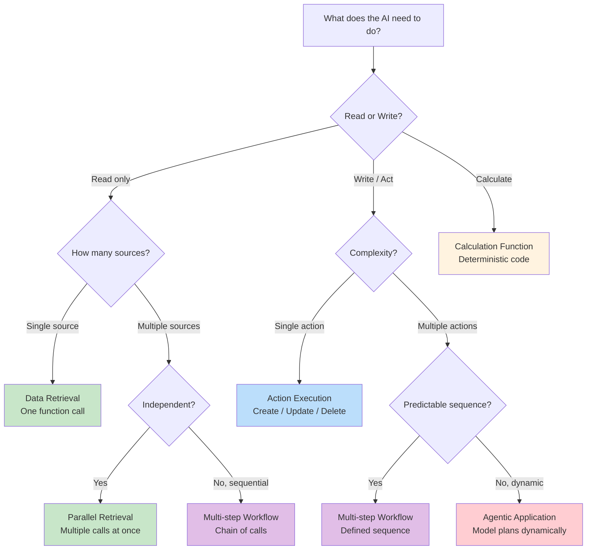

# Use Cases for Function Calling

## Introduction

Function calling is not just a feature — it changes what AI applications can do. Without function calling, an LLM can only generate text. With function calling, an LLM becomes the decision-making layer in a system that searches databases, sends emails, processes payments, and orchestrates complex workflows.

This lesson covers the six major categories of function calling use cases, with practical examples and code for each. By the end, you will see how function calling transforms AI from a text generator into an action-taking agent.

### What we'll cover

- Data retrieval: querying databases, APIs, and knowledge bases
- Action execution: creating, updating, and deleting resources
- Calculations and transformations: math, formatting, and data processing
- External API access: integrating third-party services
- Multi-step workflows: chaining function calls to complete tasks
- Agentic applications: autonomous systems that plan and act

### Prerequisites

- Understanding of function calling concepts ([Lessons 01–06](./00-function-calling-concepts.md))
- Familiarity with at least one provider's API format

---

## Data retrieval

The most common use case: the model recognizes it needs information it does not have and calls a function to fetch it.

### Why models need data retrieval

LLMs have a training cutoff date and no access to private data. Function calling bridges this gap:



### Example: database lookup

```python
import json
from datetime import datetime

# Define the tool
tools = [
    {
        "type": "function",
        "name": "search_orders",
        "description": "Search customer orders by customer ID, date range, or status. "
                       "Use when the user asks about their orders, shipments, or purchases.",
        "parameters": {
            "type": "object",
            "properties": {
                "customer_id": {
                    "type": "string",
                    "description": "The customer's unique ID (e.g., 'CUST-12345')"
                },
                "status": {
                    "type": "string",
                    "enum": ["pending", "shipped", "delivered", "cancelled"],
                    "description": "Filter orders by status"
                },
                "date_from": {
                    "type": "string",
                    "description": "Start date in ISO format (YYYY-MM-DD)"
                }
            },
            "required": ["customer_id"]
        }
    }
]

# Implement the function
def search_orders(
    customer_id: str,
    status: str | None = None,
    date_from: str | None = None
) -> list[dict]:
    """Query the orders database."""
    # In production, this would query a real database
    orders = [
        {
            "order_id": "ORD-7891",
            "date": "2025-07-10",
            "status": "shipped",
            "items": ["Wireless Headphones", "USB-C Cable"],
            "total": 89.99
        },
        {
            "order_id": "ORD-7845",
            "date": "2025-07-05",
            "status": "delivered",
            "items": ["Laptop Stand"],
            "total": 49.99
        }
    ]
    
    if status:
        orders = [o for o in orders if o["status"] == status]
    
    return orders

# User asks: "Where are my recent orders?"
# Model calls: search_orders(customer_id="CUST-12345")
result = search_orders("CUST-12345")
print(json.dumps(result, indent=2))
```

**Output:**
```json
[
  {
    "order_id": "ORD-7891",
    "date": "2025-07-10",
    "status": "shipped",
    "items": ["Wireless Headphones", "USB-C Cable"],
    "total": 89.99
  },
  {
    "order_id": "ORD-7845",
    "date": "2025-07-05",
    "status": "delivered",
    "items": ["Laptop Stand"],
    "total": 49.99
  }
]
```

### Other data retrieval patterns

| Pattern | Example Function | When the model uses it |
|---------|-----------------|----------------------|
| Database lookup | `search_products(query, category)` | User asks about available products |
| Knowledge base search | `search_docs(query, filters)` | User asks a domain-specific question |
| User profile fetch | `get_user_profile(user_id)` | User asks about account settings |
| Real-time data | `get_stock_price(symbol)` | User asks about current prices |
| Geolocation | `get_nearby_stores(lat, lng, radius)` | User asks "Where can I buy...?" |

---

## Action execution

Function calling enables the model to create, update, and delete resources — not just read them. This is where AI transitions from answering questions to performing tasks.

### Example: creating a calendar event

```python
from datetime import datetime, timedelta

tools = [
    {
        "type": "function",
        "name": "create_calendar_event",
        "description": "Create a new event on the user's calendar. "
                       "Use when the user asks to schedule, book, or set up a meeting.",
        "parameters": {
            "type": "object",
            "properties": {
                "title": {
                    "type": "string",
                    "description": "Event title"
                },
                "start_time": {
                    "type": "string",
                    "description": "Event start in ISO 8601 format"
                },
                "duration_minutes": {
                    "type": "integer",
                    "description": "Duration in minutes",
                    "minimum": 15,
                    "maximum": 480
                },
                "attendees": {
                    "type": "array",
                    "items": {"type": "string"},
                    "description": "List of attendee email addresses"
                },
                "description": {
                    "type": "string",
                    "description": "Optional event description"
                }
            },
            "required": ["title", "start_time", "duration_minutes"]
        }
    }
]

def create_calendar_event(
    title: str,
    start_time: str,
    duration_minutes: int,
    attendees: list[str] | None = None,
    description: str | None = None
) -> dict:
    """Create a calendar event (simulated)."""
    start = datetime.fromisoformat(start_time)
    end = start + timedelta(minutes=duration_minutes)
    
    event = {
        "event_id": "EVT-20250715-001",
        "title": title,
        "start": start.isoformat(),
        "end": end.isoformat(),
        "attendees": attendees or [],
        "description": description or "",
        "status": "confirmed",
        "calendar_link": "https://calendar.example.com/evt/20250715-001"
    }
    
    return event

# User: "Schedule a 30-minute team sync with alice@co.com tomorrow at 2pm"
result = create_calendar_event(
    title="Team Sync",
    start_time="2025-07-16T14:00:00",
    duration_minutes=30,
    attendees=["alice@co.com"]
)
print(f"Created: {result['title']} at {result['start']}")
print(f"Link: {result['calendar_link']}")
```

**Output:**
```
Created: Team Sync at 2025-07-16T14:00:00
Link: https://calendar.example.com/evt/20250715-001
```

### Action categories

| Action Type | Example Functions | Safety Consideration |
|------------|-------------------|---------------------|
| **Create** | `create_event`, `create_ticket`, `send_message` | Confirm before creating |
| **Update** | `update_profile`, `change_status`, `reschedule` | Validate permissions |
| **Delete** | `delete_event`, `cancel_order`, `remove_item` | Require confirmation |
| **Send** | `send_email`, `send_notification`, `post_message` | Preview before sending |

> **Warning:** Action-executing functions change state. Always validate user identity, check permissions, and consider requiring confirmation for destructive or irreversible actions.

---

## Calculations and transformations

Models are unreliable at complex math. Function calling offloads calculations to deterministic code:

### Example: financial calculations

```python
from decimal import Decimal, ROUND_HALF_UP

tools = [
    {
        "type": "function",
        "name": "calculate_loan_payment",
        "description": "Calculate monthly payment for a fixed-rate loan. "
                       "Use when the user asks about mortgage payments, loan costs, "
                       "or monthly installments.",
        "parameters": {
            "type": "object",
            "properties": {
                "principal": {
                    "type": "number",
                    "description": "Loan amount in dollars"
                },
                "annual_rate": {
                    "type": "number",
                    "description": "Annual interest rate as a percentage (e.g., 6.5)"
                },
                "term_years": {
                    "type": "integer",
                    "description": "Loan term in years"
                }
            },
            "required": ["principal", "annual_rate", "term_years"]
        }
    }
]

def calculate_loan_payment(
    principal: float,
    annual_rate: float,
    term_years: int
) -> dict:
    """Calculate fixed-rate loan monthly payment."""
    p = Decimal(str(principal))
    monthly_rate = Decimal(str(annual_rate)) / Decimal("100") / Decimal("12")
    num_payments = term_years * 12
    
    if monthly_rate == 0:
        monthly = p / num_payments
    else:
        # Standard amortization formula: M = P * [r(1+r)^n] / [(1+r)^n - 1]
        factor = (1 + monthly_rate) ** num_payments
        monthly = p * (monthly_rate * factor) / (factor - 1)
    
    monthly = monthly.quantize(Decimal("0.01"), rounding=ROUND_HALF_UP)
    total = monthly * num_payments
    total_interest = total - p
    
    return {
        "monthly_payment": float(monthly),
        "total_paid": float(total),
        "total_interest": float(total_interest),
        "num_payments": num_payments
    }

# User: "What's the monthly payment on a $350,000 mortgage at 6.5% for 30 years?"
result = calculate_loan_payment(350000, 6.5, 30)
print(f"Monthly payment: ${result['monthly_payment']:,.2f}")
print(f"Total paid: ${result['total_paid']:,.2f}")
print(f"Total interest: ${result['total_interest']:,.2f}")
```

**Output:**
```
Monthly payment: $2,212.24
Total paid: $796,406.40
Total interest: $446,406.40
```

### Why calculations belong in functions

| Task | Model alone | Function call |
|------|------------|---------------|
| Simple addition | Usually correct | Always correct |
| Mortgage calculation | Often wrong | Always correct |
| Unit conversions | Sometimes wrong | Always correct |
| Statistical analysis | Frequently wrong | Always correct |
| Currency math (precision) | Rounding errors | Decimal precision |

> **🤖 AI Context:** LLMs process math as text tokens, not numerical computation. Even simple division can produce errors. Always offload calculations to deterministic code.

---

## External API access

Function calling connects the model to any external service — weather APIs, payment processors, CRMs, notification services, and more.

### Example: multi-service integration

```python
import json

# Define multiple external API tools
tools = [
    {
        "type": "function",
        "name": "get_weather",
        "description": "Get current weather for a location. "
                       "Use when the user asks about weather conditions.",
        "parameters": {
            "type": "object",
            "properties": {
                "location": {"type": "string", "description": "City name"},
                "units": {"type": "string", "enum": ["celsius", "fahrenheit"]}
            },
            "required": ["location", "units"]
        }
    },
    {
        "type": "function",
        "name": "send_notification",
        "description": "Send a push notification to the user's device. "
                       "Use when the user asks to be reminded or notified.",
        "parameters": {
            "type": "object",
            "properties": {
                "title": {"type": "string"},
                "message": {"type": "string"},
                "priority": {"type": "string", "enum": ["low", "normal", "high"]}
            },
            "required": ["title", "message"]
        }
    },
    {
        "type": "function",
        "name": "search_flights",
        "description": "Search for available flights between cities. "
                       "Use when the user asks about flights or travel options.",
        "parameters": {
            "type": "object",
            "properties": {
                "origin": {"type": "string", "description": "Departure airport code (IATA)"},
                "destination": {"type": "string", "description": "Arrival airport code (IATA)"},
                "date": {"type": "string", "description": "Travel date (YYYY-MM-DD)"},
                "passengers": {"type": "integer", "minimum": 1, "maximum": 9}
            },
            "required": ["origin", "destination", "date"]
        }
    }
]

# Simulated implementations
def get_weather(location: str, units: str) -> dict:
    return {"location": location, "temp": 28, "units": units, "condition": "Partly cloudy"}

def send_notification(title: str, message: str, priority: str = "normal") -> dict:
    return {"status": "sent", "notification_id": "NOTIF-4521"}

def search_flights(
    origin: str, destination: str, date: str, passengers: int = 1
) -> dict:
    return {
        "flights": [
            {"airline": "Air France", "departure": "08:30", "arrival": "11:45", "price": 245},
            {"airline": "Lufthansa", "departure": "14:15", "arrival": "17:30", "price": 198}
        ],
        "origin": origin,
        "destination": destination,
        "date": date
    }

# Function dispatch
available_functions = {
    "get_weather": get_weather,
    "send_notification": send_notification,
    "search_flights": search_flights
}

def execute_function_call(name: str, arguments: dict) -> str:
    """Execute a function call and return JSON result."""
    func = available_functions.get(name)
    if not func:
        return json.dumps({"error": f"Unknown function: {name}"})
    
    try:
        result = func(**arguments)
        return json.dumps(result)
    except TypeError as e:
        return json.dumps({"error": f"Invalid arguments: {e}"})

# User: "Find flights from JFK to CDG on July 20th"
result = execute_function_call("search_flights", {
    "origin": "JFK",
    "destination": "CDG",
    "date": "2025-07-20"
})
print(result)
```

**Output:**
```json
{"flights": [{"airline": "Air France", "departure": "08:30", "arrival": "11:45", "price": 245}, {"airline": "Lufthansa", "departure": "14:15", "arrival": "17:30", "price": 198}], "origin": "JFK", "destination": "CDG", "date": "2025-07-20"}
```

---

## Multi-step workflows

Some tasks require multiple function calls in sequence, where each call depends on the result of the previous one. The model orchestrates the workflow by deciding which function to call next.

### Example: order processing workflow

```python
def process_order_workflow():
    """Example: User says 'Order the cheapest laptop and ship to my address'"""
    
    # Step 1: Model calls search_products
    products = search_products(query="laptop", sort_by="price_asc")
    # Returns: [{"id": "PROD-101", "name": "ChromeBook Lite", "price": 299}, ...]
    
    # Step 2: Model calls get_user_profile (needs shipping address)
    profile = get_user_profile(user_id="USR-456")
    # Returns: {"address": "123 Main St, NYC", "payment_method": "card_ending_4242"}
    
    # Step 3: Model calls create_order (combining results)
    order = create_order(
        product_id="PROD-101",
        quantity=1,
        shipping_address="123 Main St, NYC",
        payment_method="card_ending_4242"
    )
    # Returns: {"order_id": "ORD-8001", "status": "confirmed", "eta": "2025-07-18"}
    
    # Step 4: Model calls send_notification
    notification = send_notification(
        title="Order Confirmed",
        message="Your ChromeBook Lite will arrive by July 18th.",
        priority="normal"
    )
    
    return order
```



### Multi-step patterns

| Pattern | Description | Example |
|---------|------------|---------|
| **Sequential chain** | Each step depends on the previous | Search → Select → Purchase |
| **Fan-out gather** | Multiple independent calls, then combine | Get weather + flights + hotels in parallel |
| **Conditional branching** | Next call depends on previous result | If in stock → order, else → notify |
| **Loop until done** | Repeat until a condition is met | Paginate through search results |
| **Verify and retry** | Call, check result, retry if needed | Submit → Validate → Retry on error |

> **💡 Tip:** The model decides the next step at each turn. You do not need to hard-code the workflow. The model plans dynamically based on the available functions and the results it receives.

---

## Agentic applications

When function calling is combined with reasoning models and multiple tools, the system becomes an **agent** — an AI that plans, acts, observes, and adapts.

### What makes a system agentic

| Component | Purpose |
|-----------|---------|
| **Planning** | Model decides which steps to take |
| **Tool use** | Functions give the model capabilities |
| **Memory** | Conversation history preserves context |
| **Observation** | Model reads function results to decide next action |
| **Adaptation** | Model adjusts plan when something fails |

### Example: research assistant agent

```python
from dataclasses import dataclass

@dataclass
class AgentState:
    """Track agent progress through a complex task."""
    task: str
    steps_completed: list[str]
    findings: list[dict]
    status: str = "in_progress"

# The agent's tool set
agent_tools = [
    {
        "type": "function",
        "name": "web_search",
        "description": "Search the web for current information on any topic.",
        "parameters": {
            "type": "object",
            "properties": {
                "query": {"type": "string"},
                "num_results": {"type": "integer", "minimum": 1, "maximum": 10}
            },
            "required": ["query"]
        }
    },
    {
        "type": "function",
        "name": "read_webpage",
        "description": "Read and extract content from a specific URL.",
        "parameters": {
            "type": "object",
            "properties": {
                "url": {"type": "string"},
                "extract": {"type": "string", "description": "What to look for"}
            },
            "required": ["url"]
        }
    },
    {
        "type": "function",
        "name": "save_finding",
        "description": "Save a research finding with source attribution.",
        "parameters": {
            "type": "object",
            "properties": {
                "title": {"type": "string"},
                "content": {"type": "string"},
                "source_url": {"type": "string"},
                "confidence": {"type": "string", "enum": ["high", "medium", "low"]}
            },
            "required": ["title", "content", "source_url", "confidence"]
        }
    },
    {
        "type": "function",
        "name": "create_report",
        "description": "Compile saved findings into a structured research report.",
        "parameters": {
            "type": "object",
            "properties": {
                "title": {"type": "string"},
                "sections": {
                    "type": "array",
                    "items": {"type": "string"},
                    "description": "Section headings for the report"
                }
            },
            "required": ["title", "sections"]
        }
    }
]

# Agent loop (simplified)
def run_agent(task: str, max_steps: int = 10):
    """Run an agentic loop with function calling."""
    state = AgentState(task=task, steps_completed=[], findings=[])
    messages = [{"role": "user", "content": task}]
    
    for step in range(max_steps):
        response = call_model(messages, agent_tools)
        
        if has_function_calls(response):
            for call in extract_calls(response):
                result = execute_function_call(call["name"], call["arguments"])
                state.steps_completed.append(f"{call['name']}: {call['arguments']}")
                messages.append(make_result_message(call, result))
        else:
            # Model is done — return final text
            state.status = "completed"
            return get_text(response), state
    
    state.status = "max_steps_reached"
    return "Research incomplete — reached step limit", state

# User: "Research the current state of WebAssembly adoption in 2025"
# The agent would:
# 1. web_search("WebAssembly adoption 2025 statistics")
# 2. read_webpage(url, extract="adoption stats")
# 3. web_search("WebAssembly use cases production 2025")
# 4. read_webpage(url, extract="companies using wasm")
# 5. save_finding("Browser Support", "All major browsers...", url, "high")
# 6. save_finding("Production Usage", "Companies like...", url, "medium")
# 7. create_report("WebAssembly Adoption 2025", ["Browser Support", ...])
```

### Agent vs. single-turn function calling

| Aspect | Single-turn | Agentic |
|--------|------------|---------|
| **Function calls** | 1 or few | Many, across multiple turns |
| **Planning** | Implicit | Explicit (model plans steps) |
| **Error handling** | Return error to user | Retry or try alternative approach |
| **State** | Stateless | Accumulates context over time |
| **Complexity** | Answer one question | Complete a multi-part task |
| **Model choice** | Standard models | Reasoning models preferred |

> **🤖 AI Context:** Agentic applications are covered in depth in [Unit 11: AI Agents](../../11-ai-agents/). This lesson introduces the concept. The key insight: function calling is the foundation that makes agents possible.

---

## Choosing the right pattern

Use this decision guide to pick the right approach for your use case:



| Use Case Category | Complexity | Typical Functions | Example |
|-------------------|-----------|-------------------|---------|
| Data retrieval | Low | 1–3 read functions | Customer support bot |
| Calculations | Low | 1–2 math functions | Financial calculator |
| Action execution | Medium | 3–5 CRUD functions | Task management app |
| External APIs | Medium | 5–10 API functions | Travel booking assistant |
| Multi-step workflows | High | 5–15 functions | E-commerce order flow |
| Agentic applications | Very high | 10–30+ functions | Research assistant |

---

## Best practices

| Practice | Why it matters |
|----------|----------------|
| Start with data retrieval before adding actions | Easier to test; read-only is safe |
| Add confirmation steps for destructive actions | Prevents accidental deletes or sends |
| Keep functions focused (single responsibility) | The model selects better with clear purpose |
| Return structured results with status fields | Helps the model explain what happened to the user |
| Log all function executions in production | Essential for debugging and auditing |
| Use enum parameters to constrain choices | Prevents invalid values in action functions |

---

## Common pitfalls

| ❌ Mistake | ✅ Solution |
|-----------|-------------|
| Giving the model a "do everything" function | Split into focused functions with clear names |
| No confirmation for irreversible actions | Add a `confirm_action` step before delete/send |
| Returning raw database rows to the model | Format results into clean, relevant summaries |
| Using function calling for simple text tasks | Only use FC when the model needs external data or actions |
| Not handling function errors gracefully | Return structured error messages so the model can explain the issue |
| Mixing calculation logic inside the model prompt | Always offload math to deterministic function code |

---

## Hands-on exercise

### Your task

Build a personal assistant that uses function calling for at least three different use case categories from this lesson.

### Requirements

1. Define tools for these three categories:
   - **Data retrieval**: a `search_contacts` function
   - **Action execution**: a `send_email` function
   - **Calculation**: a `calculate_tip` function
2. Implement the function logic (simulated is fine)
3. Write a `dispatch_function` that routes function calls to the correct implementation
4. Test with these user messages:
   - "Find Alice's email address"
   - "Send Alice a meeting reminder at alice@example.com"
   - "What's a 20% tip on a $85.50 dinner?"

### Expected result

Each user message triggers the correct function, and the result is returned as structured JSON.

<details>
<summary>💡 Hints (click to expand)</summary>

- Use a dictionary to map function names to implementations
- Each function should return a dict with a `status` field
- The `send_email` function should include a `message_id` in its response
- Use `Decimal` for the tip calculation to avoid floating point errors

</details>

<details>
<summary>✅ Solution (click to expand)</summary>

```python
import json
from decimal import Decimal, ROUND_HALF_UP

# Tool definitions
tools = [
    {
        "type": "function",
        "name": "search_contacts",
        "description": "Search the user's contacts by name, email, or phone number.",
        "parameters": {
            "type": "object",
            "properties": {
                "query": {"type": "string", "description": "Search term (name, email, or phone)"}
            },
            "required": ["query"]
        }
    },
    {
        "type": "function",
        "name": "send_email",
        "description": "Send an email to a recipient.",
        "parameters": {
            "type": "object",
            "properties": {
                "to": {"type": "string", "description": "Recipient email address"},
                "subject": {"type": "string"},
                "body": {"type": "string"}
            },
            "required": ["to", "subject", "body"]
        }
    },
    {
        "type": "function",
        "name": "calculate_tip",
        "description": "Calculate tip amount and total for a bill.",
        "parameters": {
            "type": "object",
            "properties": {
                "bill_amount": {"type": "number", "description": "Total bill in dollars"},
                "tip_percentage": {"type": "number", "description": "Tip percentage (e.g., 20)"}
            },
            "required": ["bill_amount", "tip_percentage"]
        }
    }
]

# Implementations
def search_contacts(query: str) -> dict:
    contacts = [
        {"name": "Alice Chen", "email": "alice@example.com", "phone": "555-0101"},
        {"name": "Bob Smith", "email": "bob@example.com", "phone": "555-0102"}
    ]
    matches = [c for c in contacts if query.lower() in c["name"].lower()]
    return {"status": "success", "results": matches, "count": len(matches)}

def send_email(to: str, subject: str, body: str) -> dict:
    return {
        "status": "sent",
        "message_id": "MSG-20250715-001",
        "to": to,
        "subject": subject
    }

def calculate_tip(bill_amount: float, tip_percentage: float) -> dict:
    bill = Decimal(str(bill_amount))
    rate = Decimal(str(tip_percentage)) / Decimal("100")
    tip = (bill * rate).quantize(Decimal("0.01"), rounding=ROUND_HALF_UP)
    total = bill + tip
    return {
        "status": "success",
        "bill_amount": float(bill),
        "tip_percentage": float(tip_percentage),
        "tip_amount": float(tip),
        "total": float(total)
    }

# Dispatcher
functions = {
    "search_contacts": search_contacts,
    "send_email": send_email,
    "calculate_tip": calculate_tip
}

def dispatch_function(name: str, arguments: dict) -> str:
    func = functions.get(name)
    if not func:
        return json.dumps({"status": "error", "message": f"Unknown function: {name}"})
    try:
        result = func(**arguments)
        return json.dumps(result, indent=2)
    except Exception as e:
        return json.dumps({"status": "error", "message": str(e)})

# Test
print("Test 1: Search contacts")
print(dispatch_function("search_contacts", {"query": "Alice"}))
print()

print("Test 2: Send email")
print(dispatch_function("send_email", {
    "to": "alice@example.com",
    "subject": "Meeting Reminder",
    "body": "Don't forget our 2pm meeting tomorrow."
}))
print()

print("Test 3: Calculate tip")
print(dispatch_function("calculate_tip", {"bill_amount": 85.50, "tip_percentage": 20}))
```

**Output:**
```
Test 1: Search contacts
{
  "status": "success",
  "results": [{"name": "Alice Chen", "email": "alice@example.com", "phone": "555-0101"}],
  "count": 1
}

Test 2: Send email
{
  "status": "sent",
  "message_id": "MSG-20250715-001",
  "to": "alice@example.com",
  "subject": "Meeting Reminder"
}

Test 3: Calculate tip
{
  "status": "success",
  "bill_amount": 85.5,
  "tip_percentage": 20.0,
  "tip_amount": 17.1,
  "total": 102.6
}
```

</details>

### Bonus challenges

- [ ] Add a `get_weather` function and combine it with the other tools in a multi-step scenario (e.g., "Email Alice the weather forecast for her city")
- [ ] Add input validation to the `send_email` function (check email format, max body length)
- [ ] Implement a simple agent loop that calls the model repeatedly until it stops requesting function calls

---

## Summary

✅ **Data retrieval** is the most common use case — connecting the model to databases, APIs, and knowledge bases it cannot access on its own

✅ **Action execution** transforms the model from answering questions to performing tasks — always add confirmation for destructive actions

✅ **Calculations** should always be offloaded to deterministic code — LLMs process math as text and produce errors on anything non-trivial

✅ **External API access** connects the model to third-party services — define clear tool descriptions so the model picks the right API

✅ **Multi-step workflows** chain multiple function calls where each step depends on previous results — the model orchestrates the sequence dynamically

✅ **Agentic applications** combine function calling with planning and memory to create autonomous systems — this is the foundation for AI agents

**Next:** [Back to Unit Overview](../00-overview.md) | [Lesson 02: Defining Functions](../02-defining-functions/00-defining-functions.md)

---

[← Previous: Response Validation](./06-response-validation.md) | [Back to Function Calling Concepts](./00-function-calling-concepts.md)

<!--
Sources Consulted:
- OpenAI Function Calling Guide: https://platform.openai.com/docs/guides/function-calling
- OpenAI Responses API: https://platform.openai.com/docs/api-reference/responses
- Anthropic Tool Use Guide: https://platform.claude.com/docs/en/docs/build-with-claude/tool-use
- Google Gemini Function Calling: https://ai.google.dev/gemini-api/docs/function-calling
- Unit 11 AI Agents curriculum: Referenced for agentic applications context
-->
