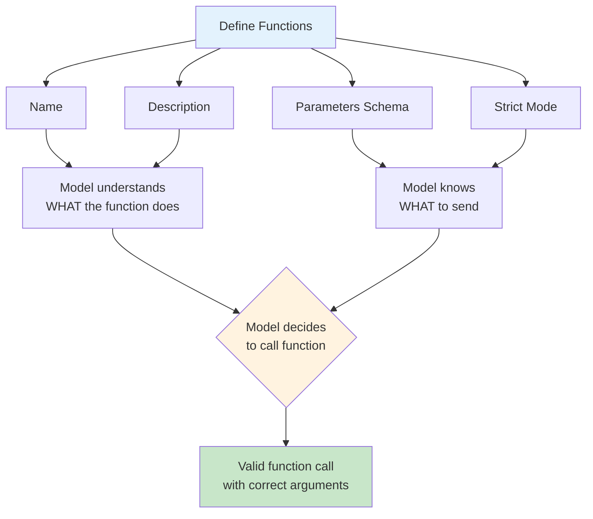

# Defining Functions

## Overview

Before a model can call a function, you must define it. The definition tells the model what the function does, what arguments it expects, and when to use it. A well-crafted definition is the difference between a model that reliably calls the right function with the right arguments and one that guesses, hallucinates parameters, or picks the wrong tool entirely.

This lesson covers every aspect of function definition — from the structural anatomy of a tool definition to provider-specific formats, naming conventions, description writing, token management, and organization strategies for large tool sets.

## Learning objectives

After completing this lesson, you will be able to:

- Understand the anatomy of a function definition (name, description, parameters, strict mode)
- Write function definitions in OpenAI, Anthropic, and Gemini formats
- Apply naming conventions that improve model accuracy
- Write descriptions that guide the model to use functions correctly
- Control when the AI should (and should not) use each function
- Manage token costs and context limits with large tool sets
- Organize functions for maintainability and performance

## Lesson contents

| # | Topic | Description |
|---|-------|-------------|
| 01 | [Function Definition Structure](./01-function-definition-structure.md) | Anatomy of a tool definition: name, description, parameters, strict mode |
| 02 | [Provider-Specific Formats](./02-provider-specific-formats.md) | OpenAI, Anthropic, and Gemini definition formats with conversion patterns |
| 03 | [Naming Conventions](./03-naming-conventions.md) | Verb-noun patterns, character rules, and avoiding ambiguity |
| 04 | [Description Writing](./04-description-writing.md) | Writing descriptions that guide AI understanding and tool selection |
| 05 | [When AI Should Use Each Function](./05-when-ai-should-use.md) | Trigger conditions, system prompt guidance, and edge case handling |
| 06 | [Token Management](./06-token-management.md) | Functions as input tokens, context limits, and dynamic tool selection |
| 07 | [Organization Strategies](./07-organization-strategies.md) | Grouping, category-based organization, and context-aware filtering |

## How it all fits together

## Connection to other lessons

- **Previous:** [Function Calling Concepts](../01-function-calling-concepts/00-function-calling-concepts.md) — What function calling is and how it works
- **Next:** [JSON Schema for Parameters](../03-json-schema-for-parameters/00-json-schema-for-parameters.md) — Deep dive into parameter schemas
- **Related:** [Handling Function Calls](../04-handling-function-calls/00-handling-function-calls.md) — Processing the model's function call responses

---

[← Previous: Function Calling Concepts](../01-function-calling-concepts/00-function-calling-concepts.md) | [Back to Unit Overview](../00-overview.md) | [Next: JSON Schema for Parameters →](../03-json-schema-for-parameters/00-json-schema-for-parameters.md)
