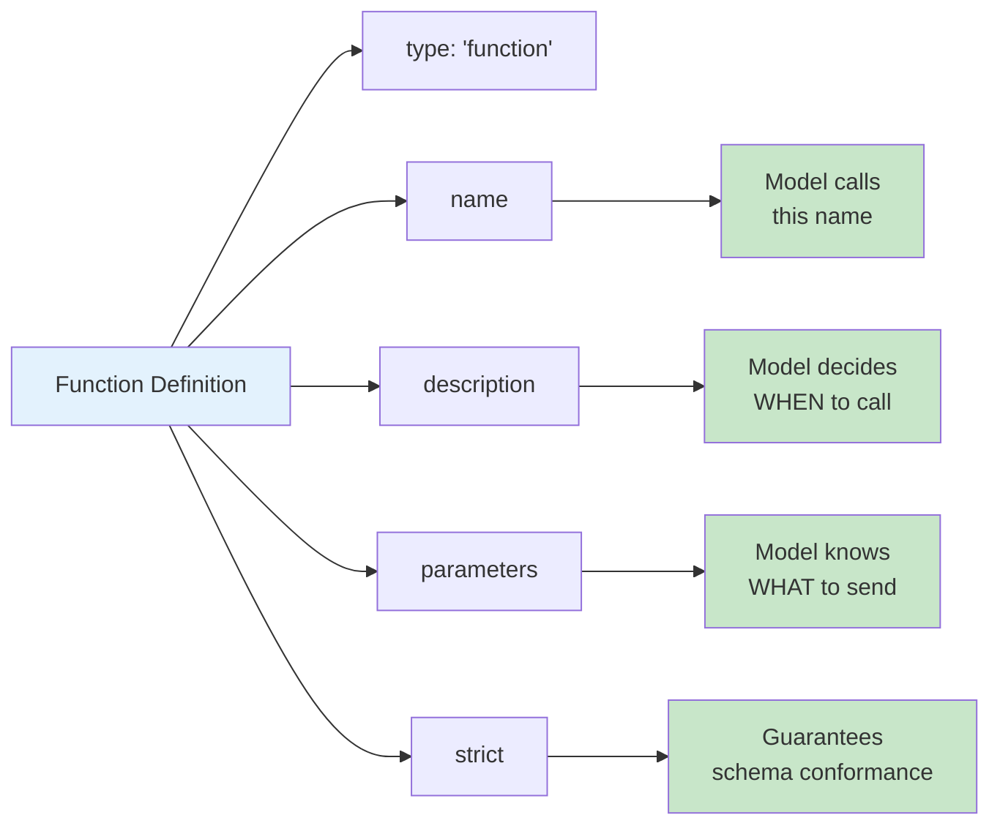

# Function Definition Structure

## Introduction

Every function calling interaction starts with a definition. The definition is how you teach the model what your function does, what arguments it needs, and how strictly it should follow the schema. A poorly defined function leads to wrong tool selections, missing arguments, and wasted tokens. A well-defined function produces reliable, predictable results on the first try.

This lesson breaks down the anatomy of a function definition — each field, what it does, why it matters, and how to set it correctly.

### What we'll cover

- The five fields of a function definition
- How `type`, `name`, `description`, `parameters`, and `strict` work together
- Strict mode vs. non-strict mode behavior
- Complete annotated examples
- The minimum viable definition

### Prerequisites

- Understanding of function calling concepts ([Lesson 01](../01-function-calling-concepts/00-function-calling-concepts.md))
- Basic familiarity with JSON

---

## Anatomy of a function definition

A function definition has five fields. Here is the complete structure with every field annotated:

```python
tool_definition = {
    "type": "function",           # 1. Type: always "function" for callable tools
    "name": "get_weather",        # 2. Name: unique identifier the model calls
    "description":                # 3. Description: tells the model WHEN and HOW
        "Get the current weather for a specific location. "
        "Use when the user asks about weather, temperature, "
        "or conditions in a city.",
    "parameters": {               # 4. Parameters: JSON Schema for arguments
        "type": "object",
        "properties": {
            "location": {
                "type": "string",
                "description": "City and country, e.g. 'Paris, France'"
            },
            "units": {
                "type": "string",
                "enum": ["celsius", "fahrenheit"],
                "description": "Temperature units to return"
            }
        },
        "required": ["location", "units"],
        "additionalProperties": False
    },
    "strict": True                # 5. Strict: enforce schema adherence
}
```



---

## Field 1: `type`

The `type` field identifies this tool as a callable function. For standard function calling, this is always `"function"`.

```python
{
    "type": "function",  # Always "function" for callable tools
    # ...
}
```

> **Note:** OpenAI also supports `"custom"` type tools for free-form text input with grammar constraints (Lark/regex), but `"function"` is the standard for JSON-schema-driven tools. Anthropic and Gemini do not use a `type` wrapper at the tool level.

---

## Field 2: `name`

The name is the unique identifier the model uses to invoke the function. It appears in the model's response when it wants to call this function.

```python
{
    "type": "function",
    "name": "get_weather",  # This exact string appears in the model's response
    # ...
}
```

### Name rules

| Rule | Details |
|------|---------|
| **Characters** | Letters, digits, underscores only. No spaces, periods, or dashes |
| **Case** | Use `snake_case` (most common) or `camelCase` |
| **Length** | Keep concise but descriptive — typically 2-4 words |
| **Uniqueness** | Must be unique within the tools array |
| **Pattern** | Use verb-noun: `get_weather`, `send_email`, `search_products` |

### Good vs. bad names

| ✅ Good | ❌ Bad | Why |
|---------|--------|-----|
| `get_weather` | `weather` | Missing verb — unclear if get, set, or check |
| `search_products` | `find-products` | Dashes not allowed |
| `create_order` | `doStuff` | Too vague — what does it create? |
| `get_user_profile` | `get.user.profile` | Periods not allowed |
| `calculate_shipping` | `calc ship cost` | Spaces not allowed |

> **💡 Tip:** Naming conventions are covered in depth in [Lesson 03: Naming Conventions](./03-naming-conventions.md). This section covers just the rules; that lesson covers strategy.

---

## Field 3: `description`

The description is the most impactful field for model accuracy. The model reads the description to decide whether to use this function and how to fill its parameters. A vague description leads to wrong tool selections; a specific one produces reliable results.

```python
{
    "type": "function",
    "name": "get_weather",
    "description": 
        "Get the current weather conditions for a specific location. "
        "Returns temperature, humidity, and conditions. "
        "Use when the user asks about weather, temperature, "
        "or atmospheric conditions in a city or region.",
    # ...
}
```

### What to include in descriptions

| Element | Example |
|---------|---------|
| **What it does** | "Get the current weather conditions for a specific location" |
| **What it returns** | "Returns temperature, humidity, and conditions" |
| **When to use it** | "Use when the user asks about weather or temperature" |
| **When NOT to use it** | "Do not use for weather forecasts or historical data" |
| **Format hints** | "Location should be a city name, not coordinates" |

### Bad vs. good descriptions

```python
# ❌ Bad: Too vague — model doesn't know when to use it
{
    "name": "get_weather",
    "description": "Gets weather"
}

# ✅ Good: Clear purpose, trigger conditions, format hints
{
    "name": "get_weather",
    "description": 
        "Get the current weather conditions for a specific location. "
        "Returns temperature in the requested units, humidity percentage, "
        "and a conditions summary (sunny, cloudy, rainy, etc.). "
        "Use when the user asks about current weather, temperature, "
        "or conditions in a city. Not for forecasts or historical data."
}
```

> **🔑 Key concept:** The description is your primary tool for guiding the model. Writing effective descriptions is covered in depth in [Lesson 04: Description Writing](./04-description-writing.md).

---

## Field 4: `parameters`

The `parameters` field defines the function's input arguments using JSON Schema. This tells the model what data to extract from the user's message and how to format it.

```python
{
    "type": "function",
    "name": "search_products",
    "description": "Search for products in the catalog.",
    "parameters": {
        "type": "object",              # Always "object" at the top level
        "properties": {
            "query": {
                "type": "string",
                "description": "Search terms to find products"
            },
            "category": {
                "type": "string",
                "enum": ["electronics", "clothing", "books", "home"],
                "description": "Product category to filter by"
            },
            "max_price": {
                "type": ["number", "null"],
                "description": "Maximum price in dollars, or null for no limit"
            },
            "in_stock_only": {
                "type": "boolean",
                "description": "If true, only return products currently in stock"
            }
        },
        "required": ["query", "category", "max_price", "in_stock_only"],
        "additionalProperties": False
    }
}
```

### Key schema rules

| Rule | Description |
|------|-------------|
| Top-level type | Always `"object"` |
| `properties` | Define each parameter as a key with type and description |
| `required` | Array of parameter names that must be provided |
| `additionalProperties` | Set to `false` for strict mode |
| Property types | `string`, `number`, `integer`, `boolean`, `array`, `object`, `null` |

### Making parameters optional in strict mode

In strict mode, all parameters must be listed in `required`. To make a parameter optional, use a union type with `null`:

```python
# ✅ Correct: optional parameter in strict mode
"max_price": {
    "type": ["number", "null"],
    "description": "Maximum price in dollars, or null for no limit"
}
# The model will send null when the user doesn't specify a price
```

```python
# ❌ Wrong: omitting from required (not allowed in strict mode)
"required": ["query", "category"]  # max_price missing — rejected
```

### Functions with no parameters

Some functions need no input at all. Use an empty properties object:

```python
{
    "type": "function",
    "name": "get_current_time",
    "description": "Get the current date and time in UTC.",
    "parameters": {
        "type": "object",
        "properties": {},
        "required": [],
        "additionalProperties": False
    },
    "strict": True
}
```

> **🤖 AI Context:** JSON Schema for parameters is covered in full depth in [Lesson 03: JSON Schema for Parameters](../03-json-schema-for-parameters/00-json-schema-for-parameters.md). This section covers the basics; that lesson covers advanced patterns like nested objects, arrays, enums, recursive schemas, and `anyOf`.

---

## Field 5: `strict`

The `strict` field controls whether the model's function call output is guaranteed to conform to your schema. When `strict` is `true`, the model uses constrained decoding to ensure every function call is valid JSON that matches your schema exactly.

### Strict mode behavior

| Aspect | `strict: true` | `strict: false` (or omitted) |
|--------|---------------|-------------------------------|
| **Schema adherence** | Guaranteed — every call conforms | Best effort — may deviate |
| **JSON validity** | Always valid JSON | Usually valid, but can fail |
| **Required fields** | All present, every time | Usually present, may miss some |
| **Enum values** | Always from the allowed set | Usually correct, can hallucinate |
| **Type safety** | Types always match | Usually match, can mismatch |
| **Schema requirements** | `additionalProperties: false`, all fields in `required` | No additional requirements |
| **Performance** | First request has ~1s overhead for schema caching | No overhead |

### Enabling strict mode

```python
# ✅ Recommended: strict mode enabled
tool = {
    "type": "function",
    "name": "get_weather",
    "description": "Get current weather for a location.",
    "parameters": {
        "type": "object",
        "properties": {
            "location": {
                "type": "string",
                "description": "City and country, e.g. 'Paris, France'"
            },
            "units": {
                "type": ["string", "null"],
                "enum": ["celsius", "fahrenheit"],
                "description": "Temperature units. Null defaults to celsius."
            }
        },
        "required": ["location", "units"],        # All fields required
        "additionalProperties": False              # No extra fields allowed
    },
    "strict": True
}
```

### Strict mode requirements (checklist)

To use `strict: true`, your schema must satisfy:

- [ ] `additionalProperties: false` on every `object` (including nested ones)
- [ ] Every property listed in `required` array
- [ ] Optional fields use `type: ["<type>", "null"]` instead of omitting from `required`
- [ ] No unsupported JSON Schema features (see [Structured Outputs docs](https://platform.openai.com/docs/guides/structured-outputs#supported-schemas))
- [ ] Root must be `type: "object"` (not `anyOf` at root)
- [ ] Max 5,000 total properties, max 10 levels of nesting

> **Warning:** In the OpenAI Responses API, strict mode is the default. If you don't set `strict: false` explicitly, the API will normalize your schema into strict mode (adding `additionalProperties: false` and making all fields required). This may change behavior if you had optional fields. Set `strict` explicitly to avoid surprises.

### When to use strict mode

| Scenario | Recommendation |
|----------|---------------|
| Production applications | ✅ Always use strict mode |
| Prototyping | Either works, but strict catches issues early |
| Complex schemas (nested objects, arrays) | ✅ Strict mode prevents malformed nesting |
| Functions with side effects (delete, send, pay) | ✅ Critical — must validate before executing |
| Open-source models (Llama, Mistral) | ❌ Not supported — validate manually |

---

## Complete annotated example

Here is a production-ready function definition with every field explained:

```python
import json

# A complete, production-ready function definition
tools = [
    {
        "type": "function",
        "name": "create_support_ticket",
        "description": (
            "Create a new customer support ticket in the helpdesk system. "
            "Use when the user reports a problem, requests help, or asks "
            "to file a complaint. Extract the issue category, priority, "
            "and a clear description from the user's message. "
            "Do not use for general questions that can be answered directly."
        ),
        "parameters": {
            "type": "object",
            "properties": {
                "title": {
                    "type": "string",
                    "description": "A short summary of the issue (5-10 words)"
                },
                "category": {
                    "type": "string",
                    "enum": [
                        "billing",
                        "technical",
                        "account",
                        "shipping",
                        "other"
                    ],
                    "description": "The category that best matches the issue"
                },
                "priority": {
                    "type": "string",
                    "enum": ["low", "medium", "high", "urgent"],
                    "description": (
                        "Issue priority. Use 'urgent' only for service outages "
                        "or security issues. Use 'high' for payment failures or "
                        "account lockouts. Default to 'medium' if unsure."
                    )
                },
                "description": {
                    "type": "string",
                    "description": (
                        "Detailed description of the issue, including any error "
                        "messages, steps to reproduce, and what the user expected "
                        "to happen"
                    )
                },
                "customer_email": {
                    "type": ["string", "null"],
                    "description": (
                        "Customer's email if provided in the conversation, "
                        "otherwise null"
                    )
                }
            },
            "required": [
                "title", "category", "priority", 
                "description", "customer_email"
            ],
            "additionalProperties": False
        },
        "strict": True
    }
]

# Pretty-print for inspection
print(json.dumps(tools, indent=2))
```

**Output:**
```json
[
  {
    "type": "function",
    "name": "create_support_ticket",
    "description": "Create a new customer support ticket in the helpdesk system. Use when the user reports a problem, requests help, or asks to file a complaint. Extract the issue category, priority, and a clear description from the user's message. Do not use for general questions that can be answered directly.",
    "parameters": {
      "type": "object",
      "properties": {
        "title": {
          "type": "string",
          "description": "A short summary of the issue (5-10 words)"
        },
        "category": {
          "type": "string",
          "enum": ["billing", "technical", "account", "shipping", "other"],
          "description": "The category that best matches the issue"
        },
        "priority": {
          "type": "string",
          "enum": ["low", "medium", "high", "urgent"],
          "description": "Issue priority. Use 'urgent' only for service outages or security issues. Use 'high' for payment failures or account lockouts. Default to 'medium' if unsure."
        },
        "description": {
          "type": "string",
          "description": "Detailed description of the issue, including any error messages, steps to reproduce, and what the user expected to happen"
        },
        "customer_email": {
          "type": ["string", "null"],
          "description": "Customer's email if provided in the conversation, otherwise null"
        }
      },
      "required": ["title", "category", "priority", "description", "customer_email"],
      "additionalProperties": false
    },
    "strict": true
  }
]
```

---

## The minimum viable definition

At minimum, a function definition needs a name and parameters. But minimal definitions produce poor results:

```python
# ⚠️ Technically valid, but the model will struggle
minimal_tool = {
    "type": "function",
    "name": "get_weather",
    "parameters": {
        "type": "object",
        "properties": {
            "location": {"type": "string"}
        }
    }
}

# ✅ Same function, production-quality
production_tool = {
    "type": "function",
    "name": "get_weather",
    "description": (
        "Get current weather conditions for a specific city. "
        "Returns temperature, humidity, and conditions summary. "
        "Use when the user asks about current weather or temperature."
    ),
    "parameters": {
        "type": "object",
        "properties": {
            "location": {
                "type": "string",
                "description": "City and country, e.g. 'Tokyo, Japan'"
            },
            "units": {
                "type": "string",
                "enum": ["celsius", "fahrenheit"],
                "description": "Temperature units to return"
            }
        },
        "required": ["location", "units"],
        "additionalProperties": False
    },
    "strict": True
}
```

| Aspect | Minimal | Production |
|--------|---------|------------|
| Model selects correctly | ~60% | ~95%+ |
| Arguments well-formed | Sometimes | Always (strict mode) |
| Handles edge cases | No | Guided by description |
| Debug-friendly | No — unclear intent | Yes — self-documenting |

---

## Best practices

| Practice | Why it matters |
|----------|----------------|
| Always include a `description` | The model relies on it to decide when to call the function |
| Always enable `strict: true` | Guarantees valid, schema-conformant arguments |
| Describe every parameter | Undescribed parameters get filled with guesses |
| Use `enum` for constrained values | Prevents hallucinated values like "kelvin" for temperature units |
| Put format hints in parameter descriptions | "ISO 8601 format, e.g. '2025-07-15'" guides extraction |
| Make all fields `required` with null for optional | Strict mode requirement — ensures consistent output shape |

---

## Common pitfalls

| ❌ Mistake | ✅ Solution |
|-----------|-------------|
| Missing `description` on the function | Always write a description — it's the most impactful field |
| Missing `description` on parameters | Every parameter needs a description with format hints |
| Forgetting `additionalProperties: false` | Required for strict mode — add to every object |
| Using dashes or spaces in names | Use underscores: `get_weather`, not `get-weather` |
| Omitting optional fields from `required` | In strict mode, include all fields in `required` and use `null` union type |
| Not specifying `strict: true` | Without it, schema adherence is best-effort only |

---

## Hands-on exercise

### Your task

Write a complete function definition for a `book_flight` function that an AI travel assistant would use.

### Requirements

1. The function should accept:
   - `origin` (required): departure airport code (3-letter IATA code)
   - `destination` (required): arrival airport code
   - `departure_date` (required): travel date in ISO format
   - `return_date` (optional): return date, or null for one-way trips
   - `cabin_class` (required): economy, business, or first
   - `passengers` (required): number of passengers (1-9)
2. Enable strict mode
3. Write a comprehensive description that tells the model when to use this function
4. Add descriptive text to every parameter

### Expected result

A valid JSON tool definition that passes strict mode validation.

<details>
<summary>💡 Hints (click to expand)</summary>

- Airport codes should be 3-letter strings — mention "IATA code like 'JFK', 'LAX', 'CDG'" in the description
- Use `["string", "null"]` for the optional `return_date`
- Use `enum` for `cabin_class` to prevent hallucinated values
- Use `integer` for `passengers` (not `number`)
- The description should mention both "flights" and "travel" to catch different phrasings

</details>

<details>
<summary>✅ Solution (click to expand)</summary>

```python
import json

book_flight_tool = {
    "type": "function",
    "name": "book_flight",
    "description": (
        "Search for and book available flights between two airports. "
        "Use when the user asks to book a flight, find flights, or "
        "travel between cities. Extracts origin, destination, dates, "
        "cabin class, and passenger count from the conversation. "
        "For one-way trips, set return_date to null."
    ),
    "parameters": {
        "type": "object",
        "properties": {
            "origin": {
                "type": "string",
                "description": (
                    "Departure airport IATA code, e.g. 'JFK', 'LAX', 'LHR'. "
                    "Must be exactly 3 uppercase letters."
                )
            },
            "destination": {
                "type": "string",
                "description": (
                    "Arrival airport IATA code, e.g. 'CDG', 'NRT', 'SFO'. "
                    "Must be exactly 3 uppercase letters."
                )
            },
            "departure_date": {
                "type": "string",
                "description": "Departure date in ISO 8601 format, e.g. '2025-08-15'"
            },
            "return_date": {
                "type": ["string", "null"],
                "description": (
                    "Return date in ISO 8601 format for round-trip flights, "
                    "or null for one-way trips"
                )
            },
            "cabin_class": {
                "type": "string",
                "enum": ["economy", "business", "first"],
                "description": "Cabin class preference"
            },
            "passengers": {
                "type": "integer",
                "description": "Number of passengers (1-9)"
            }
        },
        "required": [
            "origin", "destination", "departure_date",
            "return_date", "cabin_class", "passengers"
        ],
        "additionalProperties": False
    },
    "strict": True
}

print(json.dumps(book_flight_tool, indent=2))
```

**Output:**
```json
{
  "type": "function",
  "name": "book_flight",
  "description": "Search for and book available flights between two airports. Use when the user asks to book a flight, find flights, or travel between cities. Extracts origin, destination, dates, cabin class, and passenger count from the conversation. For one-way trips, set return_date to null.",
  "parameters": {
    "type": "object",
    "properties": {
      "origin": {
        "type": "string",
        "description": "Departure airport IATA code, e.g. 'JFK', 'LAX', 'LHR'. Must be exactly 3 uppercase letters."
      },
      "destination": {
        "type": "string",
        "description": "Arrival airport IATA code, e.g. 'CDG', 'NRT', 'SFO'. Must be exactly 3 uppercase letters."
      },
      "departure_date": {
        "type": "string",
        "description": "Departure date in ISO 8601 format, e.g. '2025-08-15'"
      },
      "return_date": {
        "type": ["string", "null"],
        "description": "Return date in ISO 8601 format for round-trip flights, or null for one-way trips"
      },
      "cabin_class": {
        "type": "string",
        "enum": ["economy", "business", "first"],
        "description": "Cabin class preference"
      },
      "passengers": {
        "type": "integer",
        "description": "Number of passengers (1-9)"
      }
    },
    "required": ["origin", "destination", "departure_date", "return_date", "cabin_class", "passengers"],
    "additionalProperties": false
  },
  "strict": true
}
```

</details>

### Bonus challenges

- [ ] Add a `flexible_dates` boolean parameter that indicates whether the user is flexible on travel dates
- [ ] Add an `airline_preference` parameter with an enum of major airlines (or null for no preference)
- [ ] Write a second tool `cancel_flight` and compare how the descriptions differ

---

## Summary

✅ A function definition has **five fields**: `type`, `name`, `description`, `parameters`, and `strict` — each serves a distinct purpose

✅ The **`name`** must be unique, use only letters/digits/underscores, and follow verb-noun patterns like `get_weather` or `create_order`

✅ The **`description`** is the most impactful field — it tells the model when to use the function, what it returns, and what format to follow

✅ The **`parameters`** field uses JSON Schema to define input arguments with types, descriptions, enums, and required fields

✅ **Strict mode** (`strict: true`) guarantees schema-conformant output — always enable it in production

✅ Optional parameters in strict mode use **`type: ["<type>", "null"]`** instead of omitting from `required`

**Next:** [Provider-Specific Formats](./02-provider-specific-formats.md)

---

[← Previous: Lesson Overview](./00-defining-functions.md) | [Back to Defining Functions](./00-defining-functions.md) | [Next: Provider-Specific Formats →](./02-provider-specific-formats.md)

<!--
Sources Consulted:
- OpenAI Function Calling Guide (Defining Functions): https://platform.openai.com/docs/guides/function-calling
- OpenAI Structured Outputs (Supported Schemas): https://platform.openai.com/docs/guides/structured-outputs
- Anthropic Tool Use (input_schema format): https://platform.claude.com/docs/en/docs/build-with-claude/tool-use
- Google Gemini Function Calling (Function Declarations): https://ai.google.dev/gemini-api/docs/function-calling
-->
