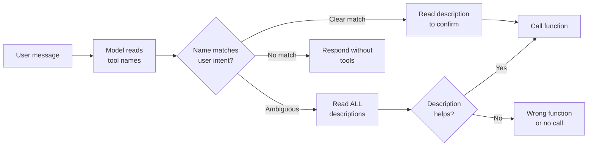

# Naming Conventions for Function Definitions

## Introduction

Function names are the first thing an LLM reads when deciding which tool to call. A well-chosen name tells the model exactly what the function does — before it even reads the description. A poorly chosen name forces the model to guess, which leads to incorrect tool selection and wasted tokens.

This lesson covers the naming rules that each provider enforces, the patterns that produce the best model accuracy, and the mistakes that cause silent failures.

### What we'll cover

- Character rules and constraints per provider
- Verb-noun naming patterns
- Underscores vs. camelCase and when to use each
- How naming affects model tool selection accuracy
- Names that create ambiguity and how to fix them

### Prerequisites

- Function definition anatomy ([Lesson 01](./01-function-definition-structure.md))
- Provider-specific formats ([Lesson 02](./02-provider-specific-formats.md))

---

## Provider naming constraints

Each provider enforces slightly different rules for function names.

### Character rules

| Rule | OpenAI | Anthropic | Gemini |
|------|--------|-----------|--------|
| Allowed characters | `a-z`, `A-Z`, `0-9`, `_`, `-` | `a-z`, `A-Z`, `0-9`, `_`, `-` | `a-z`, `A-Z`, `0-9`, `_` |
| Spaces | ❌ Not allowed | ❌ Not allowed | ❌ Not allowed |
| Periods/dots | ❌ Not allowed | ❌ Not allowed | ❌ Not allowed |
| Hyphens | ✅ Allowed | ✅ Allowed | ❌ Not allowed |
| Max length | 64 characters | 64 characters | 64 characters |
| Case sensitive | Yes | Yes | Yes |
| Must start with | Letter or underscore | Letter or underscore | Letter |

> **Warning:** Hyphens work in OpenAI and Anthropic but fail in Gemini. If you build multi-provider tools, avoid hyphens entirely.

### The safest character set

For cross-provider compatibility, use only these characters:

```
a-z  A-Z  0-9  _
```

Start with a lowercase letter, use underscores to separate words.

```python
# ✅ Works on all providers
"get_weather"
"search_products"
"create_calendar_event"

# ❌ Fails on Gemini
"get-weather"
"search-products"

# ❌ Fails on all providers
"get weather"
"get.weather"
"get/weather"
```

---

## Verb-noun naming pattern

The most effective naming pattern for function calling is **verb + noun**. This pattern mirrors how humans think about actions ("get the weather", "send a message") and gives the model a clear signal about what the function does.

### Structure

```
verb_noun
verb_adjective_noun
verb_noun_qualifier
```

### Common verb categories

| Verb | Use for | Examples |
|------|---------|---------|
| `get` | Retrieving a single item | `get_user`, `get_order_status` |
| `search` / `find` | Retrieving multiple items with filters | `search_products`, `find_restaurants` |
| `list` | Retrieving all items in a collection | `list_orders`, `list_users` |
| `create` | Creating a new resource | `create_ticket`, `create_calendar_event` |
| `update` | Modifying an existing resource | `update_profile`, `update_order` |
| `delete` / `remove` | Removing a resource | `delete_account`, `remove_item` |
| `send` | Transmitting a message or notification | `send_email`, `send_notification` |
| `calculate` / `compute` | Performing a computation | `calculate_shipping`, `compute_tax` |
| `validate` / `check` | Verifying correctness | `validate_address`, `check_availability` |
| `convert` | Transforming between formats | `convert_currency`, `convert_timezone` |

### Verb consistency

Pick one verb per action type and use it consistently across all your tools:

```python
# ✅ Consistent — always "get" for single retrieval
"get_user"
"get_order"
"get_product"

# ❌ Inconsistent — mixed verbs for same action
"get_user"
"fetch_order"        # Why not get_order?
"retrieve_product"   # Why not get_product?
```

When the model sees consistent naming, it learns the pattern. If `get_user` retrieves a user, it correctly infers that `get_order` retrieves an order — even without reading the description.

---

## Underscores vs. camelCase

Both conventions work across all providers, but they have different trade-offs.

### Comparison

| Convention | Example | Pros | Cons |
|------------|---------|------|------|
| `snake_case` | `get_user_profile` | Matches Python conventions, clear word boundaries | Longer than camelCase |
| `camelCase` | `getUserProfile` | Matches JavaScript conventions, compact | Harder to parse visually |

### Recommendation: match your codebase

```python
# Python project → snake_case
tools = [
    {"name": "get_user_profile", ...},
    {"name": "search_products", ...},
    {"name": "create_order", ...}
]

# JavaScript/TypeScript project → camelCase
tools = [
    {"name": "getUserProfile", ...},
    {"name": "searchProducts", ...},
    {"name": "createOrder", ...}
]
```

### Consistency matters more than convention

The critical rule is **don't mix conventions**:

```python
# ❌ Mixed conventions — confusing for both model and developers
tools = [
    {"name": "get_user", ...},         # snake_case
    {"name": "searchProducts", ...},    # camelCase
    {"name": "Create_Order", ...}       # Mixed
]

# ✅ Pick one, stick with it
tools = [
    {"name": "get_user", ...},
    {"name": "search_products", ...},
    {"name": "create_order", ...}
]
```

---

## How naming affects model accuracy

Function names are not just labels — they are the model's primary signal for tool selection. Research and practice show that naming quality directly impacts how often the model picks the right function.

### The selection process



When names are clear, the model quickly narrows candidates by name alone and only reads descriptions to confirm. When names are ambiguous, the model must read every description, which increases latency and error rates.

### Naming impact examples

| Scenario | Poor name | Good name | Why it matters |
|----------|-----------|-----------|----------------|
| User says "what's the weather?" | `api_call_1` | `get_weather` | Model can match by name alone |
| User says "find Italian restaurants" | `query` | `search_restaurants` | Verb+noun maps to user intent |
| User says "book a table" | `restaurant_action` | `create_reservation` | Specific action beats vague category |
| User says "cancel my order" | `update_order` | `cancel_order` | Different action = different function |
| Two similar tools | `process_data` / `process_info` | `validate_address` / `geocode_address` | Distinct names prevent confusion |

### Prefixing for related functions

When you have multiple functions that operate on the same resource, use the resource as a common suffix and the action as a prefix:

```python
# ✅ Clear grouping — model sees "order" functions as related
order_tools = [
    {"name": "create_order", ...},
    {"name": "get_order", ...},
    {"name": "update_order", ...},
    {"name": "cancel_order", ...},
    {"name": "list_orders", ...}
]

# ✅ Also clear — using resource prefix
order_tools = [
    {"name": "order_create", ...},
    {"name": "order_get", ...},
    {"name": "order_update", ...},
    {"name": "order_cancel", ...},
    {"name": "order_list", ...}
]
```

Both patterns work. The verb-first pattern (`create_order`) reads more naturally in English. The noun-first pattern (`order_create`) groups related functions together alphabetically. Pick one consistently.

---

## Names that create ambiguity

Some naming patterns reliably confuse models. Here are the most common ones and their fixes.

### Vague or generic names

```python
# ❌ Too generic — model can't distinguish purpose
{"name": "process", ...}
{"name": "handle", ...}
{"name": "do_action", ...}
{"name": "execute", ...}
{"name": "run", ...}

# ✅ Specific — model knows exactly what each does
{"name": "process_payment", ...}
{"name": "handle_refund", ...}
{"name": "send_notification", ...}
{"name": "validate_address", ...}
{"name": "generate_report", ...}
```

### Near-duplicate names

```python
# ❌ Model can't distinguish these reliably
{"name": "get_data", ...}
{"name": "fetch_data", ...}
{"name": "retrieve_data", ...}

# ✅ Distinct purpose in name
{"name": "get_user_profile", ...}
{"name": "search_transaction_history", ...}
{"name": "list_active_subscriptions", ...}
```

### Abbreviations and acronyms

```python
# ❌ Model may not understand abbreviations
{"name": "get_txn", ...}
{"name": "calc_roi", ...}
{"name": "upd_usr_prf", ...}

# ✅ Spell it out
{"name": "get_transaction", ...}
{"name": "calculate_return_on_investment", ...}
{"name": "update_user_profile", ...}
```

> **💡 Tip:** The 64-character limit is generous. A name like `calculate_return_on_investment` is only 35 characters. Spell things out.

### Boolean-sounding names

```python
# ❌ Sounds like it returns true/false, but it's an action
{"name": "is_available", ...}
{"name": "has_permission", ...}

# ✅ Clear about what it does
{"name": "check_availability", ...}     # Returns availability details
{"name": "verify_permission", ...}      # Returns permission details
```

---

## Best practices

| Practice | Why it matters |
|----------|----------------|
| Use verb_noun pattern consistently | Matches how users express intent in natural language |
| Avoid hyphens for multi-provider compatibility | Gemini rejects names with hyphens |
| Keep one naming convention (snake_case or camelCase) | Mixed conventions confuse both models and developers |
| Use specific nouns, not generic ones | `get_user` beats `get_data` for model accuracy |
| Limit function names to 2-4 words | Long enough to be descriptive, short enough to scan |
| Use consistent verbs for same action types | `get_X`, `create_X`, `delete_X` — not `get_X`, `fetch_Y`, `remove_Z` |

---

## Common pitfalls

| ❌ Mistake | ✅ Solution |
|-----------|-------------|
| Using the same verb for different actions | `process_order` (create) vs. `process_refund` (delete) → use `create_order` and `issue_refund` |
| Abbreviating to save characters | `upd_usr` → `update_user` — the 64-char limit is generous |
| Using hyphens (`get-weather`) | Use underscores (`get_weather`) for cross-provider support |
| Starting with numbers or special characters | Always start with a lowercase letter |
| Creating near-duplicate names | `get_data` / `fetch_data` → differentiate by resource, not verb |
| Using namespaces with dots (`api.get.user`) | Dots aren't allowed — use underscores (`api_get_user`) |

---

## Hands-on exercise

### Your task

You have an e-commerce API with these operations. Write properly named function definitions (name + one-line description only) for each.

### Operations to name

1. Look up a product by ID
2. Search for products by keyword and category
3. Add an item to the user's cart
4. Remove an item from the cart
5. Place a new order
6. Check order delivery status
7. Request a refund for an order
8. List the user's past orders

### Requirements

1. Use the verb_noun pattern
2. Use snake_case
3. Ensure no two names could be confused for the same action
4. Make every name work across all three providers (no hyphens)

### Expected result

Eight function names with descriptions, using consistent verbs and clear nouns.

<details>
<summary>💡 Hints (click to expand)</summary>

- Use `get` for single-item retrieval, `search` for filtered multi-item retrieval, `list` for unfiltered collections
- Use `create` for placing orders, `add` for adding to cart
- Use `request_refund` rather than `refund_order` — it's clearer about what the function initiates vs. completes
- Check that each verb is used for only one type of action

</details>

<details>
<summary>✅ Solution (click to expand)</summary>

```python
tools = [
    {
        "name": "get_product",
        "description": "Retrieve details for a single product by its ID."
    },
    {
        "name": "search_products",
        "description": "Search products by keyword, category, price range, or rating."
    },
    {
        "name": "add_cart_item",
        "description": "Add a product to the user's shopping cart with a specified quantity."
    },
    {
        "name": "remove_cart_item",
        "description": "Remove an item from the user's shopping cart."
    },
    {
        "name": "create_order",
        "description": "Place a new order from the items currently in the user's cart."
    },
    {
        "name": "get_order_status",
        "description": "Check the delivery status and tracking info for an order."
    },
    {
        "name": "request_refund",
        "description": "Initiate a refund request for a completed order."
    },
    {
        "name": "list_orders",
        "description": "List the user's past orders, optionally filtered by date range or status."
    }
]

# Verify: all snake_case, no hyphens, verb_noun pattern, no duplicates
for tool in tools:
    name = tool["name"]
    assert "_" in name, f"Missing underscore: {name}"
    assert "-" not in name, f"Hyphen found: {name}"
    assert name[0].islower(), f"Starts uppercase: {name}"
    print(f"✅ {name}: {tool['description']}")
```

**Output:**
```
✅ get_product: Retrieve details for a single product by its ID.
✅ search_products: Search products by keyword, category, price range, or rating.
✅ add_cart_item: Add a product to the user's shopping cart with a specified quantity.
✅ remove_cart_item: Remove an item from the user's shopping cart.
✅ create_order: Place a new order from the items currently in the user's cart.
✅ get_order_status: Check the delivery status and tracking info for an order.
✅ request_refund: Initiate a refund request for a completed order.
✅ list_orders: List the user's past orders, optionally filtered by date range or status.
```

</details>

### Bonus challenges

- [ ] Group these 8 functions by resource (product, cart, order) and propose a namespace prefix pattern
- [ ] Write a naming linter function that validates names against all three provider rules
- [ ] Add 4 more functions for user account management using the same conventions

---

## Summary

✅ Use only `a-z`, `A-Z`, `0-9`, and `_` in function names for cross-provider compatibility — avoid hyphens

✅ Follow the **verb_noun** pattern (`get_weather`, `create_order`) — it maps directly to how users express intent

✅ Pick **one naming convention** (snake_case or camelCase) and use it across all functions — never mix

✅ Use **specific nouns** over generic ones — `get_user_profile` beats `get_data` for model accuracy

✅ The model uses names as its **primary signal** for tool selection — clear names reduce the need to read descriptions and improve selection accuracy

**Next:** [Description Writing](./04-description-writing.md)

---

[← Previous: Provider-Specific Formats](./02-provider-specific-formats.md) | [Back to Defining Functions](./00-defining-functions.md) | [Next: Description Writing →](./04-description-writing.md)

<!--
Sources Consulted:
- OpenAI Function Calling Guide (best practices, naming): https://platform.openai.com/docs/guides/function-calling
- Anthropic Tool Use (naming constraints): https://platform.claude.com/docs/en/docs/build-with-claude/tool-use
- Google Gemini Function Calling (best practices, naming rules): https://ai.google.dev/gemini-api/docs/function-calling
-->
