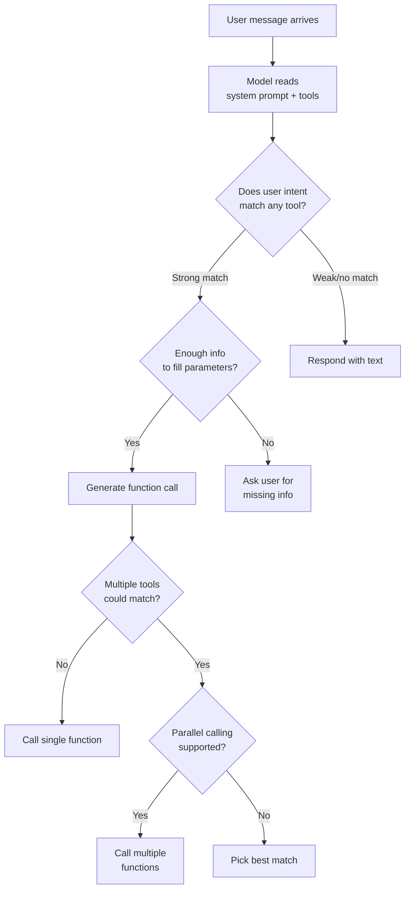
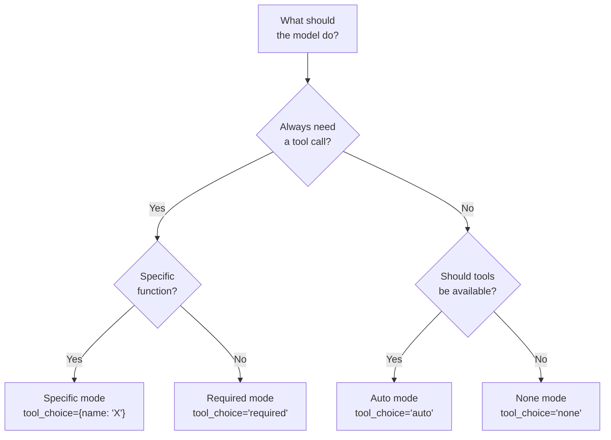

# When AI Should Use Functions

## Introduction

Defining functions is only half the problem. The other half is ensuring the model calls the right function at the right time — and does *not* call functions when a plain text response would be better. This is the tool selection problem, and solving it requires a combination of good descriptions, system prompt guidance, and an understanding of how models decide.

This lesson covers the mechanisms that control when an AI calls a function, how to write system prompts that guide tool selection, and how to handle edge cases where the model might make wrong decisions.

### What we'll cover

- How models decide whether to call a function
- Function calling modes (auto, required, none)
- System prompt strategies for guiding tool selection
- Handling ambiguous user requests
- Preventing unnecessary function calls

### Prerequisites

- Function definition anatomy ([Lesson 01](./01-function-definition-structure.md))
- Description writing ([Lesson 04](./04-description-writing.md))

---

## How models decide to call a function

When tools are available, the model follows a decision process at every turn:



The model considers three things in order:

1. **User intent vs. tool names** — Does any function name match what the user is asking?
2. **Description confirmation** — Does the description confirm this is the right function for this situation?
3. **Parameter availability** — Can the model fill all required parameters from the conversation context?

If all three are satisfied, the model generates a function call. If not, it either asks for more information or responds with plain text.

---

## Function calling modes

All three providers offer modes that control *whether* the model can call functions:

### Mode comparison

| Mode | OpenAI | Anthropic | Gemini | Behavior |
|------|--------|-----------|--------|----------|
| **Auto** | `tool_choice="auto"` | `tool_choice={"type": "auto"}` | `FUNCTION_CALLING_MODE_AUTO` | Model decides when to call functions (default) |
| **Required** | `tool_choice="required"` | `tool_choice={"type": "any"}` | `FUNCTION_CALLING_MODE_ANY` | Model must call at least one function |
| **None** | `tool_choice="none"` | `tool_choice={"type": "none"}` | `FUNCTION_CALLING_MODE_NONE` | Model cannot call any functions |
| **Specific** | `tool_choice={"type": "function", "name": "X"}` | `tool_choice={"type": "tool", "name": "X"}` | `allowed_function_names=["X"]` | Model must call a specific function |

### When to use each mode

```python
# AUTO (default) — model chooses freely
# Use for general chat with optional tool access
response = client.responses.create(
    model="gpt-4.1",
    input=messages,
    tools=tools,
    tool_choice="auto"        # Default — usually omit
)

# REQUIRED — model must call a function
# Use when the user action always needs a tool (e.g., after "Search for...")
response = client.responses.create(
    model="gpt-4.1",
    input=messages,
    tools=tools,
    tool_choice="required"
)

# NONE — disable tools for this turn
# Use when you want a summary or confirmation, not another tool call
response = client.responses.create(
    model="gpt-4.1",
    input=messages,
    tools=tools,
    tool_choice="none"
)

# SPECIFIC — force a particular function
# Use in multi-step workflows where you know the next step
response = client.responses.create(
    model="gpt-4.1",
    input=messages,
    tools=tools,
    tool_choice={"type": "function", "name": "get_weather"}
)
```

### Mode selection decision tree



---

## System prompt strategies

The system prompt is your strongest lever for controlling tool selection behavior. While function descriptions tell the model *what* each tool does, the system prompt tells the model *how to think* about using tools in general.

### Strategy 1: Define tool-use policy

Tell the model when it should and should not use tools:

```python
system_prompt = """You are a customer support assistant for TechStore.

TOOL USE POLICY:
- Always search the knowledge base BEFORE creating a ticket
- Only create tickets when the knowledge base cannot resolve the issue
- Never call tools to answer general questions about store hours, 
  return policy, or shipping times — answer those directly
- If the user asks about a specific order, use get_order_status
- If the user is angry or requests a manager, use escalate_ticket

IMPORTANT: Do not call tools just because they are available.
If you can answer from your training knowledge, do so directly."""
```

### Strategy 2: Define tool selection order

When multiple tools exist, specify the preferred sequence:

```python
system_prompt = """You are a travel planning assistant.

TOOL SELECTION ORDER:
1. For flight questions → search_flights FIRST
2. For hotel questions → search_hotels FIRST  
3. For complete trip planning:
   a. Search flights for the travel dates
   b. Search hotels for the destination
   c. Use calculate_budget to summarize costs
4. ONLY use book_flight or book_hotel after the user 
   explicitly confirms they want to book

Never book without explicit user confirmation."""
```

### Strategy 3: Define when NOT to use tools

Preventing unnecessary tool calls is as important as triggering the right ones:

```python
system_prompt = """You are a cooking assistant with recipe search tools.

DO NOT USE TOOLS WHEN:
- The user asks for general cooking tips (answer directly)
- The user asks what a cooking term means (answer directly)
- The user asks about substitutions for common ingredients (answer directly)
- The user is making casual conversation

USE TOOLS WHEN:
- The user asks for a specific recipe by name
- The user wants recipes matching specific ingredients
- The user wants nutritional information for a dish
- The user asks for meal planning suggestions"""
```

### Strategy 4: Handle multi-step workflows

For tools that depend on each other, define the workflow:

```python
system_prompt = """You are a banking assistant.

WORKFLOW RULES:
1. Before any account operation, verify the customer with get_customer_info
2. Before transferring funds:
   a. Call get_balance to check the source account has sufficient funds
   b. If insufficient, inform the user — do NOT attempt the transfer
   c. If sufficient, confirm the amount and destination with the user
   d. Only call transfer_funds after explicit user confirmation
3. After a transfer, call get_transaction to confirm it completed
4. Never perform two transfers in the same turn"""
```

---

## Handling ambiguous requests

Users rarely say exactly what they mean. The model needs guidance for requests that could match multiple tools.

### Common ambiguity patterns

| User says | Could mean | How to resolve |
|-----------|-----------|----------------|
| "Check my order" | `get_order_status` or `list_orders` | If they give an order ID → `get_order_status`. If not → `list_orders` |
| "I need help" | `search_knowledge_base` or `create_ticket` | Always search first → only create ticket if search fails |
| "Send this to John" | `send_email` or `send_notification` | Check context for what "this" is and who "John" is |
| "Book it" | `book_flight`, `book_hotel`, or both | Look at what was just searched — book the most recent result |
| "Can you do that?" | Call a tool or explain capabilities | If "that" refers to a recent tool result → repeat or modify the call. Otherwise → explain capabilities |

### Resolution strategies in the system prompt

```python
system_prompt = """You are a travel assistant.

AMBIGUITY RESOLUTION:
- If the user's request could match multiple tools, prefer the more specific one
- If you're unsure which tool to use, ask the user to clarify
- If the user says "book it" without specifying what, check the last 
  search result and confirm: "Would you like me to book the [flight/hotel] 
  we just found?"
- If the user provides partial parameters, ask for the missing ones 
  before calling the tool — do not guess

NEVER GUESS:
- Dates: Always confirm dates with the user
- Payment: Always confirm amount before any financial operation
- Destinations: If a city name is ambiguous (e.g., "Portland"), 
  ask which one"""
```

---

## Preventing unnecessary function calls

Models sometimes call functions when a text response would be better. This wastes tokens, adds latency, and can annoy users. Here are patterns to prevent it.

### Pattern 1: Conversational guardrails

```python
# ❌ Problem: Model calls get_weather for "nice weather today, huh?"
# ✅ Solution: Guide the model to distinguish chat from commands

system_prompt = """You are a helpful assistant with access to tools.

CONVERSATIONAL AWARENESS:
- If the user is making small talk or a casual observation, 
  respond conversationally — do NOT call tools
- Only call tools when the user is making a REQUEST, not a STATEMENT
- "Nice weather today" → respond conversationally
- "What's the weather in Tokyo?" → call get_weather
- "I love Italian food" → respond conversationally  
- "Find me Italian restaurants nearby" → call search_restaurants"""
```

### Pattern 2: Confirmation before consequential actions

```python
system_prompt = """CONFIRMATION REQUIRED for these tools:
- transfer_funds: Confirm amount, source, destination before calling
- cancel_order: Confirm order ID and that user really wants to cancel
- delete_account: ALWAYS confirm twice before calling

NEVER REQUIRE CONFIRMATION for:
- get_weather, search_products, get_order_status (read-only tools)"""
```

### Pattern 3: Rate limiting guidance

```python
system_prompt = """TOOL CALL LIMITS:
- Maximum 3 tool calls per user message
- If a task requires more than 3 calls, complete the first 3, 
  present results, then ask if the user wants to continue
- Never call the same function twice with the same parameters 
  in a single turn"""
```

---

## Provider-specific tool selection controls

Beyond modes, each provider offers additional controls:

### OpenAI: parallel tool calls

```python
# Allow or prevent multiple simultaneous tool calls
response = client.responses.create(
    model="gpt-4.1",
    input=messages,
    tools=tools,
    parallel_tool_calls=True     # Default: True
)
```

Set `parallel_tool_calls=False` when tools have dependencies (the output of one is the input of another).

### Anthropic: tool choice with disable_parallel

```python
response = client.messages.create(
    model="claude-sonnet-4-20250514",
    max_tokens=1024,
    tools=tools,
    messages=messages,
    tool_choice={
        "type": "auto",
        "disable_parallel_tool_use": True   # One tool at a time
    }
)
```

### Gemini: function calling config

```python
from google.genai import types

config = types.GenerateContentConfig(
    tools=[tools],
    tool_config=types.ToolConfig(
        function_calling_config=types.FunctionCallingConfig(
            mode="ANY",                      # Must call a function
            allowed_function_names=["get_weather", "search_products"]
        )
    )
)
```

Gemini's `allowed_function_names` lets you restrict which functions are available on a per-request basis, without redefining the tool list.

---

## Best practices

| Practice | Why it matters |
|----------|----------------|
| Use `auto` mode for general assistants | Lets the model use judgment — most flexible |
| Use `required` mode for action-driven inputs | Ensures the user's command produces a tool call |
| Use `none` mode after tool results to generate summaries | Prevents recursive tool calling |
| Define tool-use policy in the system prompt | Global guidance that overrides per-tool descriptions |
| Specify tool selection order for multi-step workflows | Prevents wrong-order execution |
| Add "DO NOT USE" rules for conversational messages | Prevents unnecessary tool calls on small talk |

---

## Common pitfalls

| ❌ Mistake | ✅ Solution |
|-----------|-------------|
| No system prompt guidance — relying only on descriptions | Add a tool-use policy to the system prompt |
| Using `required` mode for all requests | Only use `required` when you know a tool is needed |
| Allowing parallel calls on dependent tools | Set `parallel_tool_calls=False` when tools have data dependencies |
| No disambiguation for overlapping tools | Add cross-references in descriptions and system prompt rules |
| Model calls tools for casual conversation | Add conversational guardrails in the system prompt |
| Never confirming before destructive operations | Add confirmation requirements for write/delete operations |

---

## Hands-on exercise

### Your task

Write a system prompt for a restaurant assistant that has these five tools: `search_restaurants`, `get_restaurant_details`, `check_availability`, `make_reservation`, and `cancel_reservation`.

### Requirements

1. Define a clear tool-use policy
2. Specify the correct tool selection order for making a reservation
3. Add disambiguation rules for ambiguous requests
4. Include conversational guardrails (when NOT to use tools)
5. Add confirmation requirements for `make_reservation` and `cancel_reservation`

### Expected result

A system prompt of 15-25 lines that guides the model through all five scenarios correctly.

<details>
<summary>💡 Hints (click to expand)</summary>

- Start with the role and general behavior
- Then add TOOL USE POLICY as a distinct section
- Then WORKFLOW for reservation flow (search → details → availability → reserve)
- Then DISAMBIGUATION for ambiguous requests
- Then CONFIRMATION REQUIRED for destructive actions
- Test mentally: if a user says "I want Italian food", does your prompt prevent a tool call?

</details>

<details>
<summary>✅ Solution (click to expand)</summary>

```python
system_prompt = """You are a friendly restaurant assistant helping users find 
and book restaurants.

TOOL USE POLICY:
- Use search_restaurants when the user wants to find restaurants by cuisine, 
  location, or preference
- Use get_restaurant_details when the user asks about a specific restaurant 
  (menu, hours, reviews)
- Use check_availability before making any reservation
- Use make_reservation only after confirming availability AND getting user 
  confirmation
- Use cancel_reservation only when the user explicitly asks to cancel

RESERVATION WORKFLOW:
1. search_restaurants → find matching options
2. get_restaurant_details → show details of user's choice
3. check_availability → verify date/time/party size
4. If available → confirm details with user → make_reservation
5. If unavailable → suggest alternative times from check_availability

DO NOT USE TOOLS WHEN:
- User is making small talk ("I love sushi", "Great recommendation!")
- User asks general questions ("What's the difference between ramen types?")
- User asks about your capabilities ("What can you do?")

DISAMBIGUATION:
- "Book it" → book the most recently discussed restaurant, confirm first
- "Is it available?" → check_availability for the last discussed restaurant
- "Tell me more" → get_restaurant_details for the last search result

CONFIRMATION REQUIRED:
- make_reservation: Confirm restaurant, date, time, party size before calling
- cancel_reservation: Confirm reservation ID and that user wants to cancel"""
```

</details>

### Bonus challenges

- [ ] Add a `VALIDATED` mode version of this prompt for Gemini
- [ ] Add rate limiting rules (max tool calls per turn)
- [ ] Write three test conversations that exercise all five tools

---

## Summary

✅ Models decide to call functions by matching user intent to tool names, then confirming with descriptions, then checking parameter availability

✅ **Function calling modes** (auto, required, none, specific) control whether the model *can* call functions — use `auto` for general chat, `required` for action-driven inputs, and `none` for generating summaries

✅ The **system prompt** is your strongest lever — define tool-use policies, selection order, disambiguation rules, and conversational guardrails

✅ **Prevent unnecessary calls** by distinguishing user statements from requests, requiring confirmation for destructive actions, and setting tool call limits

✅ Use provider-specific controls like `parallel_tool_calls`, `disable_parallel_tool_use`, and `allowed_function_names` for fine-grained control

**Next:** [Token Management](./06-token-management.md)

---

[← Previous: Description Writing](./04-description-writing.md) | [Back to Defining Functions](./00-defining-functions.md) | [Next: Token Management →](./06-token-management.md)

<!--
Sources Consulted:
- OpenAI Function Calling Guide (tool_choice, parallel calls): https://platform.openai.com/docs/guides/function-calling
- OpenAI Best Practices (when to call, system prompts): https://platform.openai.com/docs/guides/function-calling#best-practices
- Anthropic Tool Use (tool_choice, disable_parallel): https://platform.claude.com/docs/en/docs/build-with-claude/tool-use
- Google Gemini Function Calling (modes, allowed_function_names): https://ai.google.dev/gemini-api/docs/function-calling
-->
