# Token Management for Function Definitions

## Introduction

Every function definition you send to an AI model costs tokens. The names, descriptions, parameter schemas, and strict mode metadata are all injected into the model's context window as part of the system message. More functions means more input tokens, higher latency, higher cost, and — beyond a threshold — worse model accuracy.

This lesson covers how function definitions consume tokens, where the limits are, and practical strategies for keeping token usage under control.

### What we'll cover

- How function definitions are tokenized
- Token costs per provider
- The performance cliff: when too many tools hurts accuracy
- Strategies for reducing token usage
- Dynamic tool selection for large tool sets

### Prerequisites

- Function definition anatomy ([Lesson 01](./01-function-definition-structure.md))
- Provider-specific formats ([Lesson 02](./02-provider-specific-formats.md))
- Description writing ([Lesson 04](./04-description-writing.md))

---

## How function definitions consume tokens

When you send a request with tools, the provider converts your function definitions into text and injects them into the model's context. This text counts as **input tokens** and is billed accordingly.

### What gets tokenized


The injected text includes:

| Component | Tokenized as | Example token cost |
|-----------|-------------|-------------------|
| Function name | Plain text | ~2-5 tokens |
| Description | Plain text | ~20-80 tokens |
| Parameter schema (JSON) | Structured text | ~30-200 tokens |
| Property descriptions | Plain text | ~10-30 tokens each |
| Enum values | Plain text | ~2-5 tokens each |
| Strict mode metadata | Structural text | ~5-10 tokens |

### Where it counts

| Provider | How tools are billed | Where in context |
|----------|---------------------|------------------|
| OpenAI | Input tokens (standard pricing) | Injected into system message |
| Anthropic | Input tokens + ~346 token overhead per tool-use request | Injected before conversation |
| Gemini | Input tokens (standard pricing) | Injected as tool declarations |

> **🔑 Key concept:** Function definitions are sent with **every request** in a conversation. If you have 15 functions and the user sends 10 messages, you pay for those 15 function definitions 10 times.

---

## Estimating token costs

Here is a practical way to estimate how many tokens your function definitions consume.

### Quick estimation method

As a rough rule, 1 token ≈ 4 characters in English text. JSON structure adds overhead:

```python
import json

def estimate_tool_tokens(tools: list[dict]) -> dict:
    """Estimate token usage for a set of tool definitions."""
    total_chars = len(json.dumps(tools))
    estimated_tokens = total_chars // 3  # JSON is denser than prose, ~3 chars/token
    
    return {
        "num_tools": len(tools),
        "total_characters": total_chars,
        "estimated_tokens": estimated_tokens,
        "estimated_cost_per_request_gpt4_1": round(estimated_tokens * 2 / 1_000_000, 6),
        "estimated_cost_10_turn_conversation": round(estimated_tokens * 2 * 10 / 1_000_000, 6)
    }

# Example: 5 medium-complexity tools
tools = [
    {
        "type": "function",
        "name": "search_products",
        "description": "Search products by keyword, category, and price range. Use when the user wants to browse or find products.",
        "parameters": {
            "type": "object",
            "properties": {
                "query": {"type": "string", "description": "Search keywords"},
                "category": {"type": "string", "enum": ["electronics", "clothing", "books", "home"]},
                "min_price": {"type": "number", "description": "Minimum price filter"},
                "max_price": {"type": "number", "description": "Maximum price filter"}
            },
            "required": ["query"],
            "additionalProperties": False
        },
        "strict": True
    },
    # ... 4 more similar tools
]

# Multiply by 5 for a realistic estimate
single_tool_chars = len(json.dumps(tools[0]))
print(f"Single tool: ~{single_tool_chars} chars, ~{single_tool_chars // 3} tokens")
print(f"5 tools: ~{single_tool_chars * 5} chars, ~{single_tool_chars * 5 // 3} tokens")
print(f"15 tools: ~{single_tool_chars * 15} chars, ~{single_tool_chars * 15 // 3} tokens")
```

**Output:**
```
Single tool: ~582 chars, ~194 tokens
5 tools: ~2910 chars, ~970 tokens
15 tools: ~8730 chars, ~2910 tokens
```

### Real-world token budgets

| Number of tools | Estimated tokens | Context impact (128K window) | Cost per request (GPT-4.1) |
|:-:|:-:|:-:|:-:|
| 5 tools | ~800-1,200 | < 1% | ~$0.002 |
| 10 tools | ~1,500-2,500 | ~2% | ~$0.004 |
| 20 tools | ~3,000-5,000 | ~3-4% | ~$0.008 |
| 50 tools | ~8,000-12,000 | ~8-10% | ~$0.020 |
| 100 tools | ~15,000-25,000 | ~15-20% | ~$0.040 |

> **Warning:** These numbers compound. A 10-turn conversation with 20 tools pays ~$0.08 just for tool definitions — before any user messages or responses.

---

## The performance cliff

More tools does not just cost more — it makes the model *worse* at selecting the right function.

### The accuracy curve

```mermaid
flowchart LR
    subgraph Accuracy
        A["1-10 tools<br>✅ High accuracy"] -.-> B["10-20 tools<br>⚠️ Good accuracy"]
        B -.-> C["20-40 tools<br>❌ Declining accuracy"]
        C -.-> D["40+ tools<br>❌ Significant errors"]
    end
```



### Why accuracy drops

| Factor | What happens with more tools |
|--------|------------------------------|
| **Name collision** | More functions → more similar names → more confusion |
| **Description scanning** | Model must read all descriptions → more chances to misparse |
| **Context pollution** | Tool definitions push out conversation history |
| **Decision fatigue** | More options → model hedges or picks wrong tool |

### Provider recommendations

| Provider | Recommended max | Hard limit | Source |
|----------|:-:|:-:|--------|
| OpenAI | 20 functions | None specified | Best practices guide |
| Anthropic | Not specified | None specified | — |
| Gemini | 10-20 functions | Not specified | Best practices guide |

> **🤖 AI Context:** OpenAI's best practices explicitly state: "We recommend aiming for fewer than 20 tools." Gemini's docs recommend "around 10-20 tools maximum" for best performance. Beyond this, consider fine-tuning or dynamic tool selection.

---

## Strategies for reducing token usage

### Strategy 1: Trim descriptions to minimum effective length

The largest token consumer is usually descriptions. Remove filler words:

```python
# ❌ Verbose — 42 tokens
{
    "description": (
        "This function is used to search for products in our catalog. "
        "It can be called when the user wants to find items. "
        "The function accepts various search parameters and filters. "
        "It returns a list of products that match."
    )
}

# ✅ Concise — 21 tokens  
{
    "description": (
        "Search product catalog by keyword, category, or price range. "
        "Use when user wants to find or browse products."
    )
}
```

### Strategy 2: Minimize parameter descriptions

```python
# ❌ Redundant — description repeats the name and type
{
    "query": {
        "type": "string",
        "description": "The query string parameter which contains the search terms that the user typed"
    }
}

# ✅ Only add info that the name and type don't convey
{
    "query": {
        "type": "string",
        "description": "User's search terms, verbatim"
    }
}
```

### Strategy 3: Use enums instead of long descriptions

```python
# ❌ Description-heavy — explaining valid values in text
{
    "sort_by": {
        "type": "string",
        "description": "Sort results by price (ascending), price (descending), rating, or newest first"
    }
}

# ✅ Enum is self-documenting and saves description tokens
{
    "sort_by": {
        "type": "string",
        "enum": ["price_asc", "price_desc", "rating", "newest"],
        "description": "Sort order"
    }
}
```

### Strategy 4: Combine always-sequential functions

OpenAI's best practices recommend: if two functions are always called in sequence, combine them:

```python
# ❌ Two functions that are always called together
{
    "name": "get_coordinates",
    "description": "Get latitude/longitude for an address.",
    "parameters": {"properties": {"address": {"type": "string"}}}
}
{
    "name": "get_weather_by_coords",
    "description": "Get weather at specific coordinates.",
    "parameters": {"properties": {"lat": {"type": "number"}, "lon": {"type": "number"}}}
}

# ✅ Combined — model only needs to call once
{
    "name": "get_weather",
    "description": "Get weather for a location. Handles geocoding internally.",
    "parameters": {"properties": {"location": {"type": "string", "description": "City name or address"}}}
}
```

This halves the token cost and eliminates a round trip.

### Strategy 5: Offload known values from the model

OpenAI's best practices recommend: "Don't make the model fill in information that you already have."

```python
# ❌ Model must fill user_id even though your app knows it
{
    "name": "get_orders",
    "parameters": {
        "properties": {
            "user_id": {"type": "string", "description": "Current user's ID"},
            "status": {"type": "string", "enum": ["pending", "shipped", "delivered"]}
        }
    }
}

# ✅ Remove user_id from the schema — inject it server-side
{
    "name": "get_orders",
    "parameters": {
        "properties": {
            "status": {"type": "string", "enum": ["pending", "shipped", "delivered"]}
        }
    }
}
# Then in your handler: user_id comes from the session, not the model
```

---

## Dynamic tool selection

When you have more than 20 tools, the best approach is to send only the relevant subset for each request.

### Approach 1: Category-based filtering

```python
# Full tool registry
ALL_TOOLS = {
    "product": [search_products, get_product, compare_products],
    "order": [create_order, get_order_status, cancel_order, list_orders],
    "account": [get_profile, update_profile, change_password],
    "payment": [add_payment_method, list_payment_methods, process_refund],
    "support": [search_kb, create_ticket, escalate_ticket]
}

def select_tools_by_category(user_message: str, categories: list[str] = None) -> list[dict]:
    """Select tools based on detected intent categories."""
    if categories is None:
        # Simple keyword-based detection (use a classifier in production)
        categories = detect_categories(user_message)
    
    selected = []
    for category in categories:
        selected.extend(ALL_TOOLS.get(category, []))
    
    return selected

def detect_categories(message: str) -> list[str]:
    """Detect which tool categories are relevant."""
    message_lower = message.lower()
    categories = []
    
    keyword_map = {
        "product": ["product", "search", "find", "browse", "item", "catalog"],
        "order": ["order", "delivery", "tracking", "ship", "cancel"],
        "account": ["account", "profile", "password", "settings"],
        "payment": ["payment", "refund", "credit card", "billing"],
        "support": ["help", "issue", "problem", "ticket", "support"]
    }
    
    for category, keywords in keyword_map.items():
        if any(kw in message_lower for kw in keywords):
            categories.append(category)
    
    # Default to most common categories if nothing detected
    return categories or ["product", "order"]

# Usage
user_msg = "Where's my order #12345?"
tools = select_tools_by_category(user_msg)
# Result: only order tools (4 tools instead of 15)
```

### Approach 2: Two-stage tool selection

Use a cheap, fast model to select tools, then a powerful model to execute:

```python
from openai import OpenAI

client = OpenAI()

def two_stage_tool_call(user_message: str, all_tools: list[dict]) -> dict:
    """Use a small model to select tools, then a large model to execute."""
    
    # Stage 1: Tool selection with a fast model
    tool_names = [t["name"] for t in all_tools]
    selection_prompt = (
        f"Given this user message: '{user_message}'\n"
        f"Which of these tools are relevant? {tool_names}\n"
        f"Return only the relevant tool names as a JSON array."
    )
    
    selection = client.responses.create(
        model="gpt-4.1-mini",         # Fast and cheap
        input=[{"role": "user", "content": selection_prompt}]
    )
    
    selected_names = json.loads(selection.output_text)
    selected_tools = [t for t in all_tools if t["name"] in selected_names]
    
    # Stage 2: Execute with selected tools using a powerful model
    response = client.responses.create(
        model="gpt-4.1",              # Accurate
        input=[{"role": "user", "content": user_message}],
        tools=selected_tools          # Only relevant tools
    )
    
    return response
```

### Approach 3: Embedding-based tool selection

Use semantic similarity to find the most relevant tools:

```python
import numpy as np
from openai import OpenAI

client = OpenAI()

def embed_text(text: str) -> list[float]:
    """Get embedding for a text string."""
    response = client.embeddings.create(
        model="text-embedding-3-small",
        input=text
    )
    return response.data[0].embedding

def cosine_similarity(a: list[float], b: list[float]) -> float:
    """Calculate cosine similarity between two vectors."""
    a, b = np.array(a), np.array(b)
    return float(np.dot(a, b) / (np.linalg.norm(a) * np.linalg.norm(b)))

# Pre-compute embeddings for all tools (do this once at startup)
tool_embeddings = {}
for tool in all_tools:
    text = f"{tool['name']} {tool['description']}"
    tool_embeddings[tool["name"]] = embed_text(text)

def select_tools_by_similarity(
    user_message: str,
    all_tools: list[dict],
    top_k: int = 5,
    threshold: float = 0.3
) -> list[dict]:
    """Select the top-k most relevant tools by semantic similarity."""
    message_embedding = embed_text(user_message)
    
    scores = []
    for tool in all_tools:
        similarity = cosine_similarity(
            message_embedding,
            tool_embeddings[tool["name"]]
        )
        scores.append((tool, similarity))
    
    # Sort by similarity, take top-k above threshold
    scores.sort(key=lambda x: x[1], reverse=True)
    selected = [tool for tool, score in scores[:top_k] if score > threshold]
    
    return selected
```

---

## Token budget planning

When designing a tool-enabled application, plan your token budget:

```python
# Token budget worksheet
CONTEXT_WINDOW = 128_000    # GPT-4.1
RESERVED_FOR_OUTPUT = 8_000  # Max response tokens
RESERVED_FOR_TOOLS = 3_000   # 10-15 tools
RESERVED_FOR_SYSTEM = 500    # System prompt
RESERVED_FOR_HISTORY = 116_500  # Remaining for conversation

# Per-request cost estimate
TOOLS_TOKENS_PER_REQUEST = 3_000
HISTORY_TOKENS_AVERAGE = 2_000
TOTAL_INPUT_TOKENS = TOOLS_TOKENS_PER_REQUEST + HISTORY_TOKENS_AVERAGE

# Cost per request (GPT-4.1 pricing: $2/1M input, $8/1M output)
INPUT_COST = TOTAL_INPUT_TOKENS * 2 / 1_000_000
OUTPUT_COST = 500 * 8 / 1_000_000  # Average 500 output tokens
TOTAL_COST_PER_REQUEST = INPUT_COST + OUTPUT_COST

print(f"Tools budget: {RESERVED_FOR_TOOLS:,} tokens ({RESERVED_FOR_TOOLS/CONTEXT_WINDOW:.1%} of context)")
print(f"Estimated cost per request: ${TOTAL_COST_PER_REQUEST:.4f}")
print(f"10-turn conversation: ${TOTAL_COST_PER_REQUEST * 10:.4f}")
```

**Output:**
```
Tools budget: 3,000 tokens (2.3% of context)
Estimated cost per request: $0.0140
10-turn conversation: $0.1400
```

---

## Best practices

| Practice | Why it matters |
|----------|----------------|
| Keep function count at 10-20 maximum per request | Accuracy drops and costs rise beyond this |
| Trim descriptions to minimum effective length | Descriptions are the biggest token consumer |
| Use enums instead of describing valid values | Self-documenting and saves tokens |
| Combine always-sequential functions | Fewer tools = fewer tokens + fewer round trips |
| Remove parameters the model doesn't need to fill | Inject known values (user_id, session data) server-side |
| Use dynamic tool selection for large tool sets | Send only relevant tools per request |

---

## Common pitfalls

| ❌ Mistake | ✅ Solution |
|-----------|-------------|
| Sending 50+ tools with every request | Use dynamic tool selection to send only relevant tools |
| Verbose descriptions ("This function is used to...") | Start with the verb: "Search products by..." |
| Redundant parameter descriptions | Only add info that name + type don't convey |
| Not accounting for per-request tool token costs | Tools are re-sent every turn — multiply by conversation length |
| Ignoring Anthropic's 346-token overhead | Budget for it separately from tool definition tokens |
| Optimizing descriptions too aggressively | Minimum viable description still needs purpose + when-to-use |

---

## Hands-on exercise

### Your task

You have 30 tools for a full-featured e-commerce platform. Design a dynamic tool selection system that sends at most 8 tools per request.

### Requirements

1. Organize the 30 tools into 5-6 categories
2. Write a `select_tools()` function that picks the right category(ies) based on user input
3. Always include 2-3 "core" tools that are available in every request
4. Estimate the token savings compared to sending all 30 tools
5. Handle the case where a user's request spans multiple categories

### Starting tool list

```python
ALL_TOOLS = [
    # Product (6)
    "search_products", "get_product", "compare_products",
    "get_reviews", "get_recommendations", "check_stock",
    # Cart (4)
    "add_to_cart", "remove_from_cart", "get_cart", "update_quantity",
    # Order (5)
    "create_order", "get_order_status", "cancel_order",
    "list_orders", "track_shipment",
    # Payment (4)
    "add_payment_method", "list_payment_methods",
    "process_refund", "get_invoice",
    # Account (5)
    "get_profile", "update_profile", "change_password",
    "get_addresses", "update_address",
    # Support (6)
    "search_kb", "create_ticket", "get_ticket_status",
    "escalate_ticket", "submit_feedback", "get_faq"
]
```

### Expected result

A working `select_tools()` function that returns 5-8 tools for any given input, with token savings analysis.

<details>
<summary>💡 Hints (click to expand)</summary>

- Core tools that should always be included: `search_products`, `get_order_status`, `search_kb`
- Category detection can be keyword-based for the exercise
- When a message spans categories (e.g., "refund my order"), include both relevant categories
- Calculate token savings: `(30 - avg_selected) / 30 * 100`

</details>

<details>
<summary>✅ Solution (click to expand)</summary>

```python
from dataclasses import dataclass, field

TOOL_CATEGORIES = {
    "product": ["search_products", "get_product", "compare_products",
                "get_reviews", "get_recommendations", "check_stock"],
    "cart": ["add_to_cart", "remove_from_cart", "get_cart", "update_quantity"],
    "order": ["create_order", "get_order_status", "cancel_order",
              "list_orders", "track_shipment"],
    "payment": ["add_payment_method", "list_payment_methods",
                "process_refund", "get_invoice"],
    "account": ["get_profile", "update_profile", "change_password",
                "get_addresses", "update_address"],
    "support": ["search_kb", "create_ticket", "get_ticket_status",
                "escalate_ticket", "submit_feedback", "get_faq"]
}

# Always available regardless of category
CORE_TOOLS = ["search_products", "get_order_status", "search_kb"]

CATEGORY_KEYWORDS = {
    "product": ["product", "search", "find", "browse", "item", "review",
                "recommend", "stock", "compare", "catalog"],
    "cart": ["cart", "add", "remove", "basket", "quantity"],
    "order": ["order", "delivery", "tracking", "ship", "cancel", "status"],
    "payment": ["payment", "refund", "credit card", "billing", "invoice",
                "pay", "charge"],
    "account": ["account", "profile", "password", "address", "settings"],
    "support": ["help", "issue", "problem", "ticket", "support", "faq",
                "feedback", "question"]
}

def select_tools(user_message: str, max_tools: int = 8) -> list[str]:
    """Select relevant tools based on user message."""
    message_lower = user_message.lower()
    
    # Detect relevant categories
    matched_categories = []
    for category, keywords in CATEGORY_KEYWORDS.items():
        if any(kw in message_lower for kw in keywords):
            matched_categories.append(category)
    
    # Default to product + support if nothing matched
    if not matched_categories:
        matched_categories = ["product", "support"]
    
    # Collect tools from matched categories
    selected = set(CORE_TOOLS)  # Always include core tools
    for category in matched_categories:
        for tool in TOOL_CATEGORIES[category]:
            selected.add(tool)
            if len(selected) >= max_tools:
                return list(selected)
    
    return list(selected)

# Test cases
test_messages = [
    "Where's my order #12345?",
    "I want to return this product and get a refund",
    "Show me laptop recommendations",
    "I need to change my password",
    "Help, nothing is working!"
]

for msg in test_messages:
    tools = select_tools(msg)
    print(f"\n'{msg}'")
    print(f"  Tools ({len(tools)}): {tools}")
    print(f"  Token savings: {(30 - len(tools)) / 30 * 100:.0f}%")
```

**Output:**
```
'Where's my order #12345?'
  Tools (8): ['search_products', 'get_order_status', 'search_kb', 'create_order', 'cancel_order', 'list_orders', 'track_shipment']
  Token savings: 77%

'I want to return this product and get a refund'
  Tools (8): ['search_products', 'get_order_status', 'search_kb', 'get_product', 'compare_products', 'add_payment_method', 'list_payment_methods', 'process_refund']
  Token savings: 73%

'Show me laptop recommendations'
  Tools (8): ['search_products', 'get_order_status', 'search_kb', 'get_product', 'compare_products', 'get_reviews', 'get_recommendations', 'check_stock']
  Token savings: 73%

'I need to change my password'
  Tools (8): ['search_products', 'get_order_status', 'search_kb', 'get_profile', 'update_profile', 'change_password', 'get_addresses', 'update_address']
  Token savings: 73%

'Help, nothing is working!'
  Tools (8): ['search_products', 'get_order_status', 'search_kb', 'create_ticket', 'get_ticket_status', 'escalate_ticket', 'submit_feedback', 'get_faq']
  Token savings: 73%
```

</details>

### Bonus challenges

- [ ] Replace keyword matching with embedding-based similarity
- [ ] Add a caching layer that remembers which tools were used in recent turns
- [ ] Calculate the actual dollar savings per conversation with 30 vs. 8 tools

---

## Summary

✅ Function definitions are injected as **input tokens** with every request — they compound across conversation turns

✅ Aim for **10-20 functions maximum** per request — accuracy degrades and costs rise beyond this threshold

✅ **Trim descriptions** to minimum effective length, use enums instead of text descriptions, and combine always-sequential functions

✅ **Remove parameters the model doesn't need to fill** — inject known values like user_id server-side

✅ For large tool sets (20+), use **dynamic tool selection** — category-based, two-stage, or embedding-based filtering

✅ **Budget tool tokens explicitly** — multiply per-request cost by expected conversation length

**Next:** [Organization Strategies](./07-organization-strategies.md)

---

[← Previous: When AI Should Use Functions](./05-when-ai-should-use.md) | [Back to Defining Functions](./00-defining-functions.md) | [Next: Organization Strategies →](./07-organization-strategies.md)

<!--
Sources Consulted:
- OpenAI Function Calling Guide (token usage, best practices): https://platform.openai.com/docs/guides/function-calling
- OpenAI Best Practices ("fewer than 20 tools", combining functions): https://platform.openai.com/docs/guides/function-calling#best-practices
- Anthropic Tool Use (346 token overhead): https://platform.claude.com/docs/en/docs/build-with-claude/tool-use
- Google Gemini Function Calling (10-20 tools recommended): https://ai.google.dev/gemini-api/docs/function-calling
- OpenAI Pricing: https://openai.com/api/pricing/
-->
