# JSON Schema for Parameters

## Overview

Every function call parameter is described using JSON Schema. The schema tells the model exactly what data to provide — what types to use, what values are valid, and how parameters relate to each other. A well-crafted schema is the difference between a model that sends `{"temperature": 72}` (correct integer) and one that sends `{"temperature": "seventy-two"}` (wrong type, broken function).

This lesson dives deep into JSON Schema as it applies to function calling across OpenAI, Anthropic, and Google Gemini. We cover the complete type system, strict mode requirements, advanced patterns like recursive schemas and union types, and the art of writing property descriptions that guide the model toward correct output.

## Learning objectives

After completing this lesson, you will be able to:

- Understand JSON Schema syntax and the OpenAPI subset used by AI providers
- Apply strict mode requirements for guaranteed schema conformance
- Define property types with appropriate constraints (string, number, boolean, array, object)
- Handle required vs. optional parameters correctly across providers
- Use enums to constrain values and improve model accuracy
- Build nested object schemas within provider limits
- Create reusable and recursive schemas using `$defs` and `$ref`
- Define array item schemas with length and uniqueness constraints
- Model union types with `anyOf` for flexible parameter structures
- Write property descriptions that guide the model toward correct values

## Lesson contents

| # | Topic | Description |
|---|-------|-------------|
| 01 | [JSON Schema Basics](./01-json-schema-basics.md) | Schema syntax overview, OpenAPI subset, type and property definitions |
| 02 | [Strict Mode Requirements](./02-strict-mode-requirements.md) | `additionalProperties: false`, all fields required, null unions, caching |
| 03 | [Property Types](./03-property-types.md) | String, number, integer, boolean with constraints and format validation |
| 04 | [Required vs. Optional Parameters](./04-required-optional-parameters.md) | Required array, strict mode patterns, null union for optional fields |
| 05 | [Enums for Constrained Values](./05-enums-constrained-values.md) | Enum definitions, accuracy improvements, limits, and best practices |
| 06 | [Nested Object Schemas](./06-nested-object-schemas.md) | Object properties, nesting depth limits, and `additionalProperties` rules |
| 07 | [Recursive and Reusable Schemas](./07-recursive-reusable-schemas.md) | `$defs`, `$ref`, root recursion, and real-world recursive patterns |
| 08 | [Array Item Schemas](./08-array-item-schemas.md) | Items schema, length constraints, uniqueness, and tuple validation |
| 09 | [anyOf for Union Types](./09-anyof-union-types.md) | Multiple valid schemas, discriminated unions, and provider restrictions |
| 10 | [Property Descriptions](./10-property-descriptions.md) | Writing descriptions that guide the model: purpose, format, edge cases |

## How it all fits together

```mermaid
flowchart TD
    A[JSON Schema] --> B[Types]
    A --> C[Constraints]
    A --> D[Structure]
    A --> E[Descriptions]
    
    B --> B1[string / number<br/>boolean / integer]
    B --> B2[array / object]
    
    C --> C1[format / pattern<br/>min / max / enum]
    C --> C2[required fields<br/>strict mode]
    
    D --> D1[Nested objects]
    D --> D2[$defs / $ref<br/>Recursive]
    D --> D3[anyOf unions]
    
    E --> E1[Purpose + format<br/>Edge cases]
    
    B1 --> F[Complete<br/>Parameter Schema]
    B2 --> F
    C1 --> F
    C2 --> F
    D1 --> F
    D2 --> F
    D3 --> F
    E1 --> F
    
    F --> G[Model generates<br/>valid arguments]
    
    style A fill:#e3f2fd
    style F fill:#fff3e0
    style G fill:#c8e6c9
```

## Why JSON Schema matters for function calling

JSON Schema serves three critical roles in function calling:

1. **Type safety** — The model knows to send a number, not a string that looks like a number
2. **Value constraints** — Enums, ranges, and patterns prevent invalid values before they reach your code
3. **Structural guidance** — Descriptions and schema structure tell the model *what* to send and *why*

All three major providers (OpenAI, Anthropic, and Google Gemini) use JSON Schema to define function parameters, but each has different levels of support and specific requirements. This lesson covers what works everywhere and what's provider-specific.

## Connection to other lessons

- **Previous:** [Defining Functions](../02-defining-functions/00-defining-functions.md) — Function structure, naming, and descriptions
- **Next:** [Handling Function Calls](../04-handling-function-calls/00-handling-function-calls.md) — Processing the model's function call responses
- **Related:** [Strict Mode Requirements](./02-strict-mode-requirements.md) — How strict mode changes schema rules

---

[← Previous: Defining Functions](../02-defining-functions/00-defining-functions.md) | [Back to Unit Overview](../00-overview.md) | [Next: Handling Function Calls →](../04-handling-function-calls/00-handling-function-calls.md)
