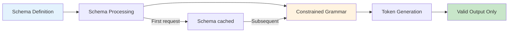
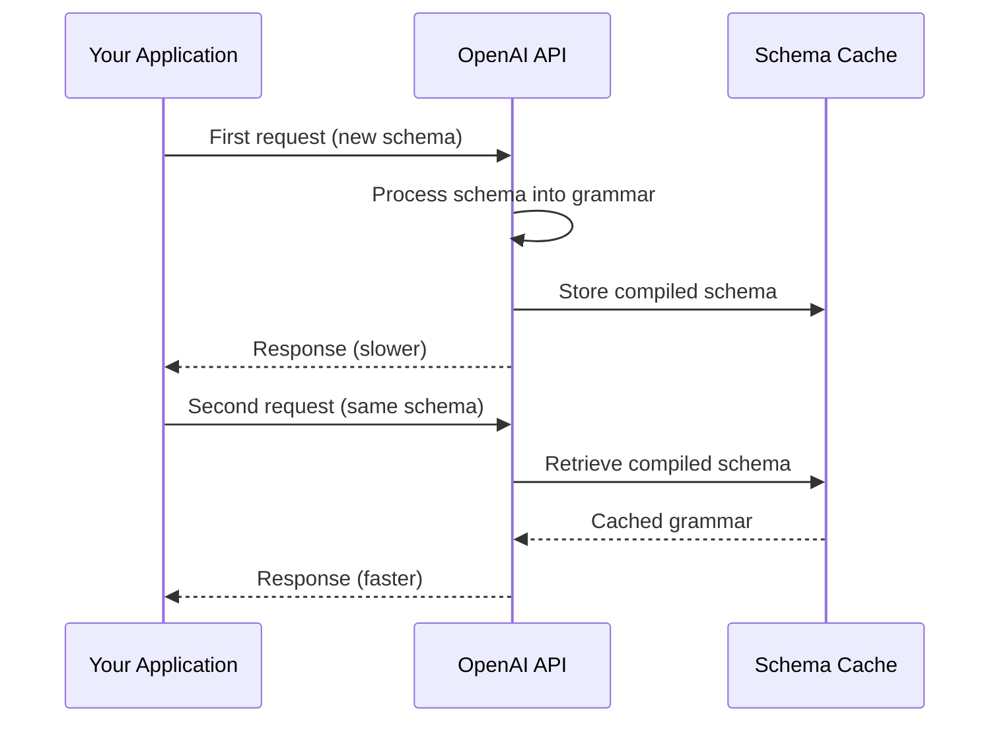

# Strict Mode Schema Requirements

## Introduction

Standard JSON Schema validation is lenient — if the model sends an extra property or omits a field, the schema might still pass. In production, that leniency breaks things. Strict mode eliminates ambiguity by enforcing exact schema conformance: every property must be declared, every declared property must be required, and no extra properties are allowed.

OpenAI introduced strict mode for Structured Outputs, and Anthropic followed with their own strict tool use. Understanding strict mode is essential because it transforms JSON Schema from a "best effort" guide into a guaranteed contract between the model and your code.

### What we'll cover

- What strict mode is and why it matters
- The `additionalProperties: false` requirement
- Why all fields must appear in `required`
- The null union pattern for optional parameters
- Schema caching and first-request latency
- Provider-specific strict mode differences

### Prerequisites

- JSON Schema basics ([previous lesson](./01-json-schema-basics.md))
- Understanding of function definitions ([Lesson 02](../02-defining-functions/00-defining-functions.md))

---

## What is strict mode?

Strict mode is a schema enforcement mechanism that guarantees the model's output matches your schema exactly. Without strict mode, the model *tries* to match the schema, but there are no guarantees. With strict mode, the provider uses constrained decoding — the model's token generation is restricted so that only schema-valid outputs are possible.

### Without strict mode vs. with strict mode

```python
import json

# Without strict mode — the model MIGHT generate this:
non_strict_output_1 = {"city": "London", "units": "celsius"}  # ✅ Correct
non_strict_output_2 = {"city": "London", "unit": "C"}          # ❌ Wrong key, wrong value
non_strict_output_3 = {"city": "London"}                        # ❌ Missing "units"

# With strict mode — the model ALWAYS generates this shape:
strict_output = {"city": "London", "units": "celsius"}          # ✅ Guaranteed

print("Non-strict: model output varies, may have wrong keys or missing fields")
print("Strict: model output always matches the schema exactly")
```

**Output:**
```
Non-strict: model output varies, may have wrong keys or missing fields
Strict: model output always matches the schema exactly
```

### How it works under the hood



When you enable strict mode, the provider:

1. **Parses** your schema into a constrained grammar (like a context-free grammar)
2. **Caches** the processed schema for future requests
3. **Restricts** token generation so the model can only produce schema-valid JSON
4. **Guarantees** every response matches your schema exactly

> **🤖 AI Context:** Without strict mode, models use best-effort JSON generation — they've been trained to produce valid JSON, but can make mistakes. Strict mode uses constrained decoding (similar to regex-guided generation) to make schema violations impossible.

---

## The `additionalProperties: false` requirement

In strict mode, you must set `additionalProperties: false` on every object in your schema — not just the root object, but every nested object too. This tells the model "only generate the properties I've explicitly defined."

### Why it's mandatory

Without `additionalProperties: false`, the model could add properties you didn't ask for:

```python
import json

# ❌ WITHOUT additionalProperties: false
# The model might generate unexpected fields
schema_no_ap = {
    "type": "object",
    "properties": {
        "city": {"type": "string", "description": "City name"},
        "country": {"type": "string", "description": "Country name"}
    },
    "required": ["city", "country"]
}

# Model might return:
unexpected_output = {
    "city": "Paris",
    "country": "France",
    "region": "Île-de-France",  # Not in schema!
    "continent": "Europe"        # Not in schema!
}

# ✅ WITH additionalProperties: false
# The model can ONLY generate city and country
schema_with_ap = {
    "type": "object",
    "properties": {
        "city": {"type": "string", "description": "City name"},
        "country": {"type": "string", "description": "Country name"}
    },
    "required": ["city", "country"],
    "additionalProperties": False
}

# Model always returns exactly:
expected_output = {
    "city": "Paris",
    "country": "France"
}

print("Without additionalProperties: false →", json.dumps(unexpected_output))
print("With additionalProperties: false    →", json.dumps(expected_output))
```

**Output:**
```
Without additionalProperties: false → {"city": "Paris", "country": "France", "region": "Île-de-France", "continent": "Europe"}
With additionalProperties: false    → {"city": "Paris", "country": "France"}
```

### Every nested object needs it

This is the most common mistake with strict mode. If you have a nested object, it needs its own `additionalProperties: false`:

```python
import json

# ✅ Correct: additionalProperties on EVERY object level
strict_schema = {
    "type": "object",
    "properties": {
        "user": {
            "type": "object",
            "properties": {
                "name": {"type": "string", "description": "User name"},
                "address": {
                    "type": "object",
                    "properties": {
                        "street": {"type": "string", "description": "Street address"},
                        "city": {"type": "string", "description": "City name"},
                        "zip": {"type": "string", "description": "ZIP or postal code"}
                    },
                    "required": ["street", "city", "zip"],
                    "additionalProperties": False  # ← Required on nested object
                }
            },
            "required": ["name", "address"],
            "additionalProperties": False  # ← Required on nested object
        }
    },
    "required": ["user"],
    "additionalProperties": False  # ← Required on root object
}

print(json.dumps(strict_schema, indent=2))
```

**Output:**
```json
{
  "type": "object",
  "properties": {
    "user": {
      "type": "object",
      "properties": {
        "name": { "type": "string", "description": "User name" },
        "address": {
          "type": "object",
          "properties": {
            "street": { "type": "string", "description": "Street address" },
            "city": { "type": "string", "description": "City name" },
            "zip": { "type": "string", "description": "ZIP or postal code" }
          },
          "required": ["street", "city", "zip"],
          "additionalProperties": false
        }
      },
      "required": ["name", "address"],
      "additionalProperties": false
    }
  },
  "required": ["user"],
  "additionalProperties": false
}
```

> **Warning:** If you forget `additionalProperties: false` on any object level, OpenAI's API will reject the schema entirely when `strict: true` is set. It's not a warning — it's a hard error.

---

## All fields must be in `required`

In strict mode, every property defined in `properties` must also appear in the `required` array. No exceptions. This seems counterintuitive — what about optional parameters? — but there's a good reason and a clean workaround.

### Why everything must be required

Strict mode needs deterministic behavior. If a property is optional, the model has to decide whether to include it or not, which introduces ambiguity in the constrained grammar. Making everything required removes that ambiguity.

```python
import json

# ❌ This FAILS in strict mode — "notes" is not in required
will_fail = {
    "type": "object",
    "properties": {
        "title": {"type": "string", "description": "Task title"},
        "priority": {"type": "string", "description": "Task priority"},
        "notes": {"type": "string", "description": "Optional notes"}
    },
    "required": ["title", "priority"],  # "notes" is missing!
    "additionalProperties": False
}

# ✅ This WORKS in strict mode — all properties in required
will_work = {
    "type": "object",
    "properties": {
        "title": {"type": "string", "description": "Task title"},
        "priority": {"type": "string", "description": "Task priority"},
        "notes": {
            "type": ["string", "null"],  # Null union for "optional"
            "description": "Optional notes, or null if not provided"
        }
    },
    "required": ["title", "priority", "notes"],  # All three listed
    "additionalProperties": False
}

print("❌ Fails:", json.dumps({"required": will_fail["required"]}, indent=2))
print("✅ Works:", json.dumps({"required": will_work["required"]}, indent=2))
```

**Output:**
```
❌ Fails: {
  "required": ["title", "priority"]
}
✅ Works: {
  "required": ["title", "priority", "notes"]
}
```

---

## The null union pattern for optional parameters

Since strict mode requires every property to be in `required`, you express "optional" by allowing the value to be `null`. This is called the **null union pattern** — the property is always present, but its value can be `null` when the model doesn't have data for it.

### How it works

```python
import json

# The null union pattern: type is an array of the real type + "null"
optional_property = {
    "type": ["string", "null"],
    "description": "Optional notes, or null if no notes are needed"
}

# The model can generate either:
valid_with_value = {"notes": "Remember to bring documentation"}
valid_with_null = {"notes": None}

print("With value:", json.dumps(valid_with_value))
print("With null: ", json.dumps(valid_with_null))
```

**Output:**
```
With value: {"notes": "Remember to bring documentation"}
With null:  {"notes": null}
```

### Complete example with mixed required and optional fields

```python
import json

# A function with truly required and "optional" (nullable) fields
create_event_schema = {
    "type": "object",
    "properties": {
        # Truly required — always has a value
        "title": {
            "type": "string",
            "description": "Event title"
        },
        "start_date": {
            "type": "string",
            "description": "Start date in YYYY-MM-DD format"
        },
        # "Optional" — model sends null when no value
        "end_date": {
            "type": ["string", "null"],
            "description": "End date in YYYY-MM-DD format, or null for single-day events"
        },
        "location": {
            "type": ["string", "null"],
            "description": "Event location, or null for virtual events"
        },
        "max_attendees": {
            "type": ["integer", "null"],
            "description": "Maximum number of attendees, or null for unlimited"
        },
        "is_public": {
            "type": "boolean",
            "description": "Whether the event is publicly visible"
        }
    },
    "required": [
        "title", "start_date", "end_date",
        "location", "max_attendees", "is_public"
    ],
    "additionalProperties": False
}

# Example outputs the model might generate:
full_event = {
    "title": "Team Standup",
    "start_date": "2025-04-01",
    "end_date": None,
    "location": "Conference Room B",
    "max_attendees": 15,
    "is_public": False
}

minimal_event = {
    "title": "All-Hands Meeting",
    "start_date": "2025-04-15",
    "end_date": None,
    "location": None,
    "max_attendees": None,
    "is_public": True
}

print("Full event:", json.dumps(full_event, indent=2))
print("\nMinimal event:", json.dumps(minimal_event, indent=2))
```

**Output:**
```json
Full event: {
  "title": "Team Standup",
  "start_date": "2025-04-01",
  "end_date": null,
  "location": "Conference Room B",
  "max_attendees": 15,
  "is_public": false
}

Minimal event: {
  "title": "All-Hands Meeting",
  "start_date": "2025-04-15",
  "end_date": null,
  "location": null,
  "max_attendees": null,
  "is_public": true
}
```

> **💡 Tip:** In your function implementation, handle `None` values gracefully. The model will send `null` for optional parameters it doesn't have data for.

---

## Schema caching and first-request latency

When you first send a strict-mode schema to OpenAI, the API processes and compiles it into a constrained grammar. This adds latency to the first request. Subsequent requests with the same schema use the cached version and are faster.

### How caching works



### What this means for your application

| Aspect | Impact |
|--------|--------|
| First request | Higher latency (schema compilation) |
| Subsequent requests | Normal latency (cached) |
| Schema changes | Triggers recompilation (higher latency again) |
| Different schemas | Each unique schema is cached separately |
| Cache scope | Per-organization, not per-API key |

```python
# Practical implication: warm up your schemas on startup
import json

def warm_up_schemas(client, tools: list[dict]) -> None:
    """Send a dummy request to pre-compile strict mode schemas."""
    for tool in tools:
        if tool.get("function", {}).get("strict"):
            try:
                # Simple request to trigger schema compilation
                client.chat.completions.create(
                    model="gpt-4o",
                    messages=[{"role": "user", "content": "test"}],
                    tools=[tool],
                    max_tokens=1
                )
            except Exception:
                pass  # We only care about triggering the cache

print("Schema warm-up: pre-compile strict schemas on application startup")
print("This avoids first-request latency for real user requests")
```

**Output:**
```
Schema warm-up: pre-compile strict schemas on application startup
This avoids first-request latency for real user requests
```

---

## Provider-specific strict mode differences

Each provider implements strict mode differently. Here's a comparison:

### OpenAI

```python
import json

# OpenAI: strict mode with "strict": true on the function
openai_strict_tool = {
    "type": "function",
    "function": {
        "name": "get_weather",
        "description": "Get weather for a location",
        "strict": True,  # ← Enable strict mode
        "parameters": {
            "type": "object",
            "properties": {
                "location": {
                    "type": "string",
                    "description": "City name"
                },
                "units": {
                    "type": ["string", "null"],
                    "enum": ["celsius", "fahrenheit", None],
                    "description": "Temperature unit, or null for default"
                }
            },
            "required": ["location", "units"],  # All must be required
            "additionalProperties": False        # Mandatory
        }
    }
}

print("OpenAI strict mode requirements:")
print("  1. strict: true on the function")
print("  2. additionalProperties: false on every object")
print("  3. All properties in required array")
print("  4. Null union for optional fields")
```

**Output:**
```
OpenAI strict mode requirements:
  1. strict: true on the function
  2. additionalProperties: false on every object
  3. All properties in required array
  4. Null union for optional fields
```

### Anthropic

```python
import json

# Anthropic: uses the Structured Outputs feature
anthropic_strict_tool = {
    "name": "get_weather",
    "description": "Get weather for a location",
    "strict": True,  # ← Enable strict mode (Anthropic's structured outputs)
    "input_schema": {
        "type": "object",
        "properties": {
            "location": {
                "type": "string",
                "description": "City name"
            },
            "units": {
                "type": "string",
                "enum": ["celsius", "fahrenheit"],
                "description": "Temperature unit"
            }
        },
        "required": ["location", "units"]
    }
}

print("Anthropic strict mode requirements:")
print("  1. strict: true on the tool definition")
print("  2. Standard input_schema with required fields")
print("  3. Guarantees schema conformance for tool inputs")
```

**Output:**
```
Anthropic strict mode requirements:
  1. strict: true on the tool definition
  2. Standard input_schema with required fields
  3. Guarantees schema conformance for tool inputs
```

### Google Gemini

```python
import json

# Gemini: VALIDATED mode for schema adherence
gemini_config = {
    "function_calling_config": {
        "mode": "VALIDATED",  # ← Ensures schema adherence
        "allowed_function_names": ["get_weather"]
    }
}

gemini_tool = {
    "name": "get_weather",
    "description": "Get weather for a location",
    "parameters": {
        "type": "object",
        "properties": {
            "location": {
                "type": "string",
                "description": "City name"
            },
            "units": {
                "type": "string",
                "enum": ["celsius", "fahrenheit"],
                "description": "Temperature unit"
            }
        },
        "required": ["location", "units"]
    }
}

print("Gemini schema adherence:")
print("  1. Use VALIDATED mode in function_calling_config")
print("  2. Standard OpenAPI schema subset")
print("  3. No additionalProperties support needed")
```

**Output:**
```
Gemini schema adherence:
  1. Use VALIDATED mode in function_calling_config
  2. Standard OpenAPI schema subset
  3. No additionalProperties support needed
```

### Quick comparison table

| Feature | OpenAI | Anthropic | Gemini |
|---------|--------|-----------|--------|
| Strict mode flag | `strict: true` on function | `strict: true` on tool | `VALIDATED` mode |
| `additionalProperties: false` | Required on all objects | Not required | Not supported |
| All properties in `required` | Required | Not required | Not required |
| Null union pattern | Required for optional fields | Not needed | Not needed |
| Schema caching | Yes (first-request latency) | — | — |
| Constrained decoding | Yes | Yes | Yes (VALIDATED mode) |

---

## Unsupported keywords in strict mode

Strict mode restricts which JSON Schema keywords you can use. The constrained grammar cannot represent all possible schema constructs.

### OpenAI strict mode restrictions

| ❌ Not Supported | ✅ Use Instead |
|-----------------|----------------|
| `allOf` | Flatten into a single schema |
| `oneOf` | Use `anyOf` |
| `not` | Remove and constrain positively |
| `if` / `then` / `else` | Simplify to separate functions |
| `dependentRequired` | Make all fields required |
| `dependentSchemas` | Flatten schema |
| `patternProperties` | Use explicit property names |
| `minLength` / `maxLength` (fine-tuned models) | Document in description |
| `minimum` / `maximum` (fine-tuned models) | Document in description |

> **Note:** Some constraints like `minLength`, `maxLength`, `minimum`, `maximum`, and `pattern` work with base models in strict mode but are NOT supported with fine-tuned models. Always check the current documentation.

---

## Best practices

| Practice | Why it matters |
|----------|----------------|
| Always use strict mode in production | Eliminates schema violation errors in your function handlers |
| Set `additionalProperties: false` on every object | Required by OpenAI; good practice everywhere |
| Use null unions for optional parameters | The only way to express "optional" in strict mode |
| Warm up schemas on application startup | Avoids first-request latency for real users |
| Keep schemas stable across requests | Schema changes trigger recompilation |
| Test schemas before deploying | Verify your schema is accepted in strict mode |

---

## Common pitfalls

| ❌ Mistake | ✅ Solution |
|-----------|-------------|
| Forgetting `additionalProperties: false` on nested objects | Apply it to every `"type": "object"` in the schema |
| Not listing all properties in `required` | Every property must be in `required` in strict mode |
| Using `default` values in strict mode | Not supported — use null union + handle in code |
| Using `oneOf` in strict mode | Use `anyOf` instead |
| Assuming all JSON Schema keywords work | Check provider docs for supported keywords |
| Not handling `null` in function implementations | Always check for `None` when using null unions |

---

## Hands-on exercise

### Your task

Convert the following non-strict schema to a valid strict-mode schema for OpenAI. The function updates user preferences.

```json
{
  "type": "object",
  "properties": {
    "user_id": {
      "type": "string",
      "description": "User ID"
    },
    "theme": {
      "type": "string",
      "enum": ["light", "dark", "system"],
      "description": "UI theme preference"
    },
    "notifications_enabled": {
      "type": "boolean",
      "description": "Enable email notifications"
    },
    "language": {
      "type": "string",
      "description": "Preferred language code, e.g., 'en', 'es', 'fr'"
    },
    "timezone": {
      "type": "string",
      "description": "IANA timezone, e.g., 'America/New_York'"
    }
  },
  "required": ["user_id"]
}
```

### Requirements

1. Make it valid for `"strict": true`
2. All five properties must be in `required`
3. Add `additionalProperties: false`
4. Use null unions for the four optional fields
5. Adjust `enum` for nullable `theme`

### Expected result

The schema passes OpenAI's strict mode validation and the model generates output like:

```json
{
  "user_id": "usr_12345",
  "theme": "dark",
  "notifications_enabled": true,
  "language": null,
  "timezone": "America/New_York"
}
```

<details>
<summary>💡 Hints (click to expand)</summary>

- Change `"type": "string"` to `"type": ["string", "null"]` for optional fields
- Add `null` to the `enum` array: `["light", "dark", "system", null]`
- Change the `type` for the enum field to `["string", "null"]`
- For `notifications_enabled`, use `["boolean", "null"]`
- Add `"additionalProperties": false` at the root

</details>

<details>
<summary>✅ Solution (click to expand)</summary>

```python
import json

strict_schema = {
    "type": "object",
    "properties": {
        "user_id": {
            "type": "string",
            "description": "User ID"
        },
        "theme": {
            "type": ["string", "null"],
            "enum": ["light", "dark", "system", None],
            "description": "UI theme preference, or null to keep current"
        },
        "notifications_enabled": {
            "type": ["boolean", "null"],
            "description": "Enable email notifications, or null to keep current"
        },
        "language": {
            "type": ["string", "null"],
            "description": "Preferred language code (e.g., 'en', 'es'), or null to keep current"
        },
        "timezone": {
            "type": ["string", "null"],
            "description": "IANA timezone (e.g., 'America/New_York'), or null to keep current"
        }
    },
    "required": ["user_id", "theme", "notifications_enabled", "language", "timezone"],
    "additionalProperties": False
}

tool = {
    "type": "function",
    "function": {
        "name": "update_preferences",
        "description": "Update user preferences. Send null for any field to keep the current value.",
        "strict": True,
        "parameters": strict_schema
    }
}

print(json.dumps(tool, indent=2))
```

</details>

### Bonus challenges

- [ ] Add a nested `notification_settings` object with its own `additionalProperties: false`
- [ ] Write a Python function that handles the `null` values from strict mode output
- [ ] Test what happens if you omit `additionalProperties: false` from a nested object

---

## Summary

✅ Strict mode guarantees the model's output matches your schema exactly — no missing fields, no extra properties

✅ `additionalProperties: false` is required on every object (root and nested) in OpenAI strict mode

✅ All properties must be in the `required` array — use null unions (`["type", "null"]`) for optional fields

✅ Schema caching means the first request is slower, but subsequent requests are fast

✅ Each provider implements strict mode differently — OpenAI is the most restrictive

**Next:** [Property Types](./03-property-types.md) — String, number, integer, and boolean types with constraints

---

## Further reading

- [OpenAI Structured Outputs — Supported Schemas](https://platform.openai.com/docs/guides/structured-outputs#supported-schemas) — Complete list of supported keywords
- [Anthropic Structured Outputs](https://docs.anthropic.com/en/docs/build-with-claude/structured-outputs) — Anthropic's strict tool use
- [JSON Schema Reference](https://json-schema.org/understanding-json-schema/reference) — Full JSON Schema specification

---

[← Previous: JSON Schema Basics](./01-json-schema-basics.md) | [Next: Property Types →](./03-property-types.md)

<!-- 
Sources Consulted:
- OpenAI Structured Outputs: https://platform.openai.com/docs/guides/structured-outputs
- OpenAI Function Calling: https://platform.openai.com/docs/guides/function-calling
- Anthropic Tool Use: https://docs.anthropic.com/en/docs/build-with-claude/tool-use/overview
- Anthropic Structured Outputs: https://docs.anthropic.com/en/docs/build-with-claude/structured-outputs
- Google Gemini Function Calling: https://ai.google.dev/gemini-api/docs/function-calling
-->
