# Enums for Constrained Values

## Introduction

When a parameter has a fixed set of valid values, describing those values in a text description and hoping the model picks one is unreliable. The model might generate "High" instead of "high", or "urgent" when you expected "critical". Enums solve this by defining the exact list of acceptable values in the schema itself, giving the model a clear, constrained set to choose from.

This lesson covers enum definition, why enums dramatically improve model accuracy, their limits across providers, and when to use enums versus description-only constraints.

### What we'll cover

- How enums work in JSON Schema
- Why enums improve function calling accuracy
- Enum limits: maximum values and character limits
- Enum vs. description-only constraints
- Enums with different types (string, integer, null)
- Provider-specific enum behavior

### Prerequisites

- Property types ([Lesson 03](./03-property-types.md))
- Required vs. optional parameters ([Lesson 04](./04-required-optional-parameters.md))

---

## How enums work

The `enum` keyword restricts a property to a fixed list of allowed values. The model must generate exactly one of the listed values — nothing else is valid.

### Basic enum

```python
import json

# String enum — the most common pattern
priority_property = {
    "type": "string",
    "enum": ["low", "medium", "high", "critical"],
    "description": "Priority level for the task"
}

# The model MUST generate one of: "low", "medium", "high", "critical"
# It CANNOT generate: "Low", "HIGH", "urgent", "normal", or any other value

print("Enum values:", priority_property["enum"])
print("Model must generate exactly one of these values")
```

**Output:**
```
Enum values: ['low', 'medium', 'high', 'critical']
Model must generate exactly one of these values
```

### Enum with description context

```python
import json

# A well-defined enum with context in the description
sort_property = {
    "type": "string",
    "enum": ["relevance", "price_asc", "price_desc", "rating", "newest"],
    "description": (
        "How to sort search results: "
        "'relevance' for best match, "
        "'price_asc' for cheapest first, "
        "'price_desc' for most expensive first, "
        "'rating' for highest rated, "
        "'newest' for most recently added"
    )
}

print("Enum:", sort_property["enum"])
print("Description helps the model choose the right value")
```

**Output:**
```
Enum: ['relevance', 'price_asc', 'price_desc', 'rating', 'newest']
Description helps the model choose the right value
```

> **🔑 Key concept:** The enum defines *what* values are valid; the description explains *when* to use each one. Both work together — the enum constrains the output, and the description guides the model's choice.

---

## Why enums improve accuracy

Enums give the model a guaranteed set of valid options. Without an enum, the model has to infer valid values from the description, which introduces room for error.

### Without enum (description only)

```python
import json

# ❌ Description-only approach — model must guess the format
description_only = {
    "type": "string",
    "description": (
        "File format for export. Use 'csv' for comma-separated values, "
        "'json' for JSON format, 'xml' for XML format, "
        "'xlsx' for Excel spreadsheet, or 'pdf' for PDF document."
    )
}

# What the model might generate:
possible_outputs = [
    "csv",        # ✅ Correct
    "CSV",        # ❌ Wrong case
    "json",       # ✅ Correct
    "JSON",       # ❌ Wrong case
    "excel",      # ❌ Wrong value (should be "xlsx")
    "pdf",        # ✅ Correct
    "PDF format", # ❌ Extra text
    "tsv",        # ❌ Not listed
]

valid = [v for v in possible_outputs if v in ["csv", "json", "xml", "xlsx", "pdf"]]
invalid = [v for v in possible_outputs if v not in ["csv", "json", "xml", "xlsx", "pdf"]]
print(f"Description-only: {len(valid)} valid, {len(invalid)} invalid out of {len(possible_outputs)} attempts")
```

**Output:**
```
Description-only: 3 valid, 5 invalid out of 8 attempts
```

### With enum (constrained)

```python
import json

# ✅ Enum approach — model picks from exact values
with_enum = {
    "type": "string",
    "enum": ["csv", "json", "xml", "xlsx", "pdf"],
    "description": "File format for export"
}

# The model can ONLY generate one of the five values
# No case errors, no typos, no creative interpretations
print(f"With enum: 100% accuracy — model must pick from {with_enum['enum']}")
```

**Output:**
```
With enum: 100% accuracy — model must pick from ['csv', 'json', 'xml', 'xlsx', 'pdf']
```

### Accuracy comparison

| Approach | Correct casing? | No typos? | No creative values? | Guaranteed valid? |
|----------|----------------|-----------|---------------------|-------------------|
| Description only | ❌ May vary | ❌ Possible | ❌ Possible | ❌ No |
| Enum | ✅ Exact | ✅ Always | ✅ Always | ✅ Yes (strict mode) |

---

## Enum limits

AI providers impose limits on enum values. These limits exist because enums are compiled into the constrained grammar.

### OpenAI limits

| Limit | Value |
|-------|-------|
| Maximum enum values | 1,000 |
| Maximum total string length | 15,000 characters (all enum string values combined) |
| Total across all properties | Part of the 5,000 total property limit |

```python
import json

# ✅ Good: small, focused enum (most common)
good_enum = {
    "type": "string",
    "enum": ["csv", "json", "xml", "xlsx", "pdf"],
    "description": "Export format"
}
print(f"Good enum: {len(good_enum['enum'])} values, "
      f"{sum(len(v) for v in good_enum['enum'])} total chars")

# ⚠️ Watch out: large enums consume schema budget
large_enum_values = [f"category_{i:04d}" for i in range(500)]
large_enum = {
    "type": "string",
    "enum": large_enum_values,
    "description": "Product category code"
}
total_chars = sum(len(v) for v in large_enum_values)
print(f"Large enum: {len(large_enum_values)} values, {total_chars} total chars")
print(f"  Within 1,000 value limit: ✅")
print(f"  Within 15,000 char limit: {'✅' if total_chars <= 15000 else '❌'}")
```

**Output:**
```
Good enum: 5 values, 18 total chars
Large enum: 500 values, 6500 total chars
  Within 1,000 value limit: ✅
  Within 15,000 char limit: ✅
```

### What to do when you hit limits

```python
# When you have too many valid values for an enum:

# Strategy 1: Use description instead of enum for very large sets
large_set_strategy = {
    "type": "string",
    "description": (
        "ISO 3166-1 alpha-2 country code, e.g., 'US', 'GB', 'DE', 'JP'. "
        "Must be a valid 2-letter country code."
    )
}

# Strategy 2: Group into categories, use enum for categories
category_strategy = {
    "type": "string",
    "enum": ["electronics", "clothing", "food", "home", "sports", "other"],
    "description": "Product category. Use 'other' if no category fits."
}

# Strategy 3: Two-parameter approach
two_param_strategy = {
    "type": "object",
    "properties": {
        "category": {
            "type": "string",
            "enum": ["electronics", "clothing", "food"],
            "description": "Main category"
        },
        "subcategory": {
            "type": "string",
            "description": "Specific subcategory within the main category"
        }
    }
}

print("Strategies for large value sets:")
print("  1. Description-only for very large sets (countries, timezones)")
print("  2. Group into enum categories")
print("  3. Split into category + subcategory parameters")
```

**Output:**
```
Strategies for large value sets:
  1. Description-only for very large sets (countries, timezones)
  2. Group into enum categories
  3. Split into category + subcategory parameters
```

---

## Enums with different types

Enums aren't limited to strings. You can use them with integers, numbers, and even mixed types (though mixed types should be avoided in function calling).

### Integer enum

```python
import json

# Integer enum — useful for specific valid quantities
integer_enum = {
    "type": "integer",
    "enum": [1, 5, 10, 25, 50, 100],
    "description": "Number of items per page"
}

print("Integer enum:", integer_enum["enum"])
print("Model must pick one of these exact values")
```

**Output:**
```
Integer enum: [1, 5, 10, 25, 50, 100]
Model must pick one of these exact values
```

### Nullable enum

For strict mode, add `null` to the enum to make it optional:

```python
import json

# Nullable enum for strict mode
nullable_enum = {
    "type": ["string", "null"],
    "enum": ["low", "medium", "high", None],
    "description": "Priority level, or null to use default priority"
}

print("Nullable enum:", json.dumps(nullable_enum["enum"]))
print("Model can generate 'low', 'medium', 'high', or null")
```

**Output:**
```
Nullable enum: ["low", "medium", "high", null]
Model can generate 'low', 'medium', 'high', or null
```

---

## When to use enum vs. description

Not every constrained value needs an enum. Here's a decision guide:

```mermaid
flowchart TD
    A[Parameter has<br/>fixed valid values?] -->|Yes| B{How many<br/>values?}
    A -->|No| C[Use type + description]
    
    B -->|≤ 20| D[Use enum ✅]
    B -->|21-1000| E{Values change<br/>frequently?}
    B -->|> 1000| F[Use description only]
    
    E -->|Rarely| D
    E -->|Often| G[Consider description<br/>or dynamic loading]
    
    style D fill:#c8e6c9
    style C fill:#e3f2fd
    style F fill:#fff3e0
```



| Scenario | Use Enum? | Why |
|----------|-----------|-----|
| 3-5 priority levels | ✅ Yes | Small, fixed set — perfect for enum |
| 10 status codes | ✅ Yes | Fixed set, critical to get right |
| 50 US states | ✅ Yes | Fixed, well-known, within limits |
| 200+ country codes | ⚠️ Maybe | Within limits but large — consider description |
| 10,000 product SKUs | ❌ No | Exceeds limits — use description or search |
| User-generated tags | ❌ No | Not a fixed set — use string type |
| Timezone names | ⚠️ Maybe | ~400 values, within limits but verbose |

---

## Enum naming conventions

How you name enum values affects model accuracy. Consistent, descriptive names help the model choose correctly.

```python
import json

# ❌ Bad: inconsistent naming
bad_enum = {
    "type": "string",
    "enum": ["Active", "INACTIVE", "pending_review", "on-hold", "done"],
    "description": "Account status"
}

# ✅ Good: consistent snake_case
good_enum = {
    "type": "string",
    "enum": ["active", "inactive", "pending_review", "on_hold", "completed"],
    "description": "Account status"
}

# ✅ Also good: consistent kebab-case
good_kebab = {
    "type": "string",
    "enum": ["active", "inactive", "pending-review", "on-hold", "completed"],
    "description": "Account status"
}

print("❌ Bad  (mixed case/style):", bad_enum["enum"])
print("✅ Good (consistent snake):", good_enum["enum"])
print("✅ Good (consistent kebab):", good_kebab["enum"])
```

**Output:**
```
❌ Bad  (mixed case/style): ['Active', 'INACTIVE', 'pending_review', 'on-hold', 'done']
✅ Good (consistent snake): ['active', 'inactive', 'pending_review', 'on_hold', 'completed']
✅ Good (consistent kebab): ['active', 'inactive', 'pending-review', 'on-hold', 'completed']
```

| Convention | Example | When to use |
|------------|---------|-------------|
| `snake_case` | `"pending_review"` | Most common, matches Python style |
| `kebab-case` | `"pending-review"` | Common in URLs and CLI arguments |
| `UPPER_SNAKE` | `"PENDING_REVIEW"` | Constants, status codes |
| `camelCase` | `"pendingReview"` | JavaScript-heavy projects |

> **💡 Tip:** Pick one convention and use it everywhere. The model performs better with consistent patterns.

---

## Best practices

| Practice | Why it matters |
|----------|----------------|
| Use enums for any fixed set of valid values | Eliminates typos and case errors |
| Keep enum values short and descriptive | Consumes less of the character budget |
| Use consistent naming conventions | Model learns patterns faster |
| Add descriptions explaining when to use each value | Guides the model's selection |
| Don't use enums for open-ended values | Tags, names, and free text aren't enum candidates |
| Add `null` to enum arrays for nullable enums | Required in strict mode for optional enum fields |

---

## Common pitfalls

| ❌ Mistake | ✅ Solution |
|-----------|-------------|
| Inconsistent casing (`"High"` vs `"high"`) | Use lowercase consistently |
| Too many enum values (>100) | Group into categories or use description |
| Enum without description | Add a description explaining each value |
| Forgetting `null` in nullable enum | Add `None` to the enum array for strict mode |
| Using enum for dynamic/changing values | Use description-based constraints instead |
| Duplicate enum values | Each value must be unique |

---

## Hands-on exercise

### Your task

Create a function schema for `configure_server` with these enum-heavy parameters:

1. `server_name` — required string
2. `region` — required, one of: "us-east-1", "us-west-2", "eu-west-1", "eu-central-1", "ap-southeast-1"
3. `instance_type` — required, one of: "micro", "small", "medium", "large", "xlarge"
4. `os` — required, one of: "ubuntu-22.04", "ubuntu-24.04", "debian-12", "amazon-linux-2023"
5. `storage_type` — required, one of: "ssd", "hdd", "nvme"
6. `environment` — required, one of: "development", "staging", "production"
7. `auto_scaling` — required boolean
8. `backup_frequency` — optional, one of: "hourly", "daily", "weekly", "monthly"

### Requirements

1. All enums use consistent naming (lowercase, kebab-case for OS names)
2. Include helpful descriptions for each parameter
3. Make it strict-mode compatible
4. Include a meaningful description for each enum option in the property description

<details>
<summary>💡 Hints (click to expand)</summary>

- Use kebab-case for OS names since they already have version numbers
- Use snake_case for other enum values
- For strict mode: `backup_frequency` needs null union + `None` in enum
- The description should explain what each enum value means

</details>

<details>
<summary>✅ Solution (click to expand)</summary>

```python
import json

configure_server_tool = {
    "type": "function",
    "function": {
        "name": "configure_server",
        "description": "Configure a new cloud server with specified parameters",
        "strict": True,
        "parameters": {
            "type": "object",
            "properties": {
                "server_name": {
                    "type": "string",
                    "description": "Name for the server instance, e.g., 'web-api-prod-01'"
                },
                "region": {
                    "type": "string",
                    "enum": ["us-east-1", "us-west-2", "eu-west-1",
                             "eu-central-1", "ap-southeast-1"],
                    "description": (
                        "AWS region: 'us-east-1' (Virginia), 'us-west-2' (Oregon), "
                        "'eu-west-1' (Ireland), 'eu-central-1' (Frankfurt), "
                        "'ap-southeast-1' (Singapore)"
                    )
                },
                "instance_type": {
                    "type": "string",
                    "enum": ["micro", "small", "medium", "large", "xlarge"],
                    "description": (
                        "Server size: 'micro' (1 vCPU, 1GB), 'small' (2 vCPU, 4GB), "
                        "'medium' (4 vCPU, 8GB), 'large' (8 vCPU, 16GB), "
                        "'xlarge' (16 vCPU, 32GB)"
                    )
                },
                "os": {
                    "type": "string",
                    "enum": ["ubuntu-22.04", "ubuntu-24.04",
                             "debian-12", "amazon-linux-2023"],
                    "description": "Operating system for the server"
                },
                "storage_type": {
                    "type": "string",
                    "enum": ["ssd", "hdd", "nvme"],
                    "description": (
                        "Storage type: 'ssd' (balanced), 'hdd' (cost-effective), "
                        "'nvme' (high-performance)"
                    )
                },
                "environment": {
                    "type": "string",
                    "enum": ["development", "staging", "production"],
                    "description": "Deployment environment for the server"
                },
                "auto_scaling": {
                    "type": "boolean",
                    "description": "Whether to enable auto-scaling for the server"
                },
                "backup_frequency": {
                    "type": ["string", "null"],
                    "enum": ["hourly", "daily", "weekly", "monthly", None],
                    "description": (
                        "Backup frequency, or null for no backups. "
                        "'hourly' for critical production, 'daily' recommended for most"
                    )
                }
            },
            "required": [
                "server_name", "region", "instance_type", "os",
                "storage_type", "environment", "auto_scaling",
                "backup_frequency"
            ],
            "additionalProperties": False
        }
    }
}

print(json.dumps(configure_server_tool, indent=2))
```

</details>

---

## Summary

✅ Enums restrict parameters to a fixed list of valid values, eliminating typos and case errors

✅ Enums significantly improve model accuracy compared to description-only constraints

✅ OpenAI limits: 1,000 enum values max, 15,000 total characters for string enum values

✅ Use consistent naming conventions (lowercase, snake_case or kebab-case) across all enums

✅ For large value sets (>1000), use description-based constraints or category grouping instead

**Next:** [Nested Object Schemas](./06-nested-object-schemas.md) — Building complex parameter structures with nested objects

---

## Further reading

- [JSON Schema Enum Reference](https://json-schema.org/understanding-json-schema/reference/enum) — Official enum documentation
- [OpenAI Structured Outputs](https://platform.openai.com/docs/guides/structured-outputs) — Enum limits in strict mode
- [Google Gemini Function Declarations](https://ai.google.dev/gemini-api/docs/function-calling#function_declarations) — Enum usage in Gemini

---

[← Previous: Required vs. Optional Parameters](./04-required-optional-parameters.md) | [Next: Nested Object Schemas →](./06-nested-object-schemas.md)

<!-- 
Sources Consulted:
- JSON Schema Enum Reference: https://json-schema.org/understanding-json-schema/reference/enum
- OpenAI Structured Outputs: https://platform.openai.com/docs/guides/structured-outputs
- Google Gemini Function Calling: https://ai.google.dev/gemini-api/docs/function-calling
- Anthropic Tool Use: https://platform.claude.com/docs/en/docs/build-with-claude/tool-use/overview
-->
