# Nested Object Schemas

## Introduction

Real-world functions rarely take only flat, primitive parameters. A shipping function needs an `address` object with street, city, state, and zip. A search function needs a `filters` object with price range, categories, and ratings. Nested objects let you define structured, multi-level parameters that mirror the data your application actually works with.

This lesson covers how to define nested object schemas, the rules for strict mode compliance at every nesting level, provider limits, and strategies for managing complexity.

### What we'll cover

- How nested objects work in function schemas
- Strict mode rules for nested objects
- Provider nesting limits and constraints
- Flattening strategies for deeply nested schemas
- Multi-level nesting patterns

### Prerequisites

- JSON Schema basics ([Lesson 01](./01-json-schema-basics.md))
- Strict mode requirements ([Lesson 02](./02-strict-mode-requirements.md))
- Required vs. optional parameters ([Lesson 04](./04-required-optional-parameters.md))

---

## Nested objects in function schemas

A nested object is a property whose type is `"object"` and has its own `properties`, `required`, and `additionalProperties` fields. Think of it as a schema within a schema.

### Basic nested object

```python
import json

# Function with a nested "address" object
create_order_tool = {
    "type": "function",
    "function": {
        "name": "create_order",
        "description": "Create a new order with shipping address",
        "parameters": {
            "type": "object",
            "properties": {
                "product_id": {
                    "type": "string",
                    "description": "Product identifier"
                },
                "quantity": {
                    "type": "integer",
                    "description": "Number of items to order"
                },
                "shipping_address": {
                    "type": "object",
                    "description": "Delivery address for the order",
                    "properties": {
                        "street": {
                            "type": "string",
                            "description": "Street address including number"
                        },
                        "city": {
                            "type": "string",
                            "description": "City name"
                        },
                        "state": {
                            "type": "string",
                            "description": "State or province code, e.g., 'CA'"
                        },
                        "zip_code": {
                            "type": "string",
                            "description": "Postal/ZIP code"
                        },
                        "country": {
                            "type": "string",
                            "description": "ISO 3166-1 alpha-2 country code, e.g., 'US'"
                        }
                    },
                    "required": ["street", "city", "state", "zip_code", "country"],
                    "additionalProperties": False
                }
            },
            "required": ["product_id", "quantity", "shipping_address"],
            "additionalProperties": False
        }
    }
}

print(json.dumps(create_order_tool, indent=2))
```

**Output:**
```json
{
  "type": "function",
  "function": {
    "name": "create_order",
    "description": "Create a new order with shipping address",
    "parameters": {
      "type": "object",
      "properties": {
        "product_id": {"type": "string", "description": "Product identifier"},
        "quantity": {"type": "integer", "description": "Number of items to order"},
        "shipping_address": {
          "type": "object",
          "description": "Delivery address for the order",
          "properties": {
            "street": {"type": "string", "description": "Street address including number"},
            "city": {"type": "string", "description": "City name"},
            "state": {"type": "string", "description": "State or province code, e.g., 'CA'"},
            "zip_code": {"type": "string", "description": "Postal/ZIP code"},
            "country": {"type": "string", "description": "ISO 3166-1 alpha-2 country code, e.g., 'US'"}
          },
          "required": ["street", "city", "state", "zip_code", "country"],
          "additionalProperties": false
        }
      },
      "required": ["product_id", "quantity", "shipping_address"],
      "additionalProperties": false
    }
  }
}
```

> **🔑 Key concept:** Every nested object must have its own `properties`, `required`, and (in strict mode) `additionalProperties: false`. The rules apply at every level, not just the top.

---

## Strict mode at every level

In strict mode, `additionalProperties: false` must be set on every object in the schema — not just the root. Missing it at any level causes a validation error.

### ❌ Common mistake: forgetting nested `additionalProperties`

```python
import json

# ❌ WRONG: additionalProperties missing on the nested object
wrong_schema = {
    "type": "object",
    "properties": {
        "name": {"type": "string", "description": "Customer name"},
        "address": {
            "type": "object",
            "description": "Customer address",
            "properties": {
                "city": {"type": "string", "description": "City"},
                "state": {"type": "string", "description": "State"}
            },
            "required": ["city", "state"]
            # ❌ Missing additionalProperties: false here!
        }
    },
    "required": ["name", "address"],
    "additionalProperties": False  # ✅ Present at root...
}

print("Root has additionalProperties:", "additionalProperties" in wrong_schema)
print("Nested has additionalProperties:", "additionalProperties" in wrong_schema["properties"]["address"])
print("⚠️ This will fail strict mode validation!")
```

**Output:**
```
Root has additionalProperties: True
Nested has additionalProperties: False
⚠️ This will fail strict mode validation!
```

### ✅ Correct: `additionalProperties` at every level

```python
import json

# ✅ CORRECT: additionalProperties: false at every object level
correct_schema = {
    "type": "object",
    "properties": {
        "name": {"type": "string", "description": "Customer name"},
        "address": {
            "type": "object",
            "description": "Customer address",
            "properties": {
                "city": {"type": "string", "description": "City"},
                "state": {"type": "string", "description": "State"}
            },
            "required": ["city", "state"],
            "additionalProperties": False  # ✅ Present on nested object too
        }
    },
    "required": ["name", "address"],
    "additionalProperties": False  # ✅ Present at root
}

# Verify both levels
def check_additional_properties(schema, path="root"):
    """Check additionalProperties at every object level."""
    if schema.get("type") == "object":
        has_it = "additionalProperties" in schema
        status = "✅" if has_it else "❌"
        print(f"  {status} {path}: additionalProperties = {schema.get('additionalProperties', 'MISSING')}")
        for prop_name, prop_schema in schema.get("properties", {}).items():
            check_additional_properties(prop_schema, f"{path}.{prop_name}")

check_additional_properties(correct_schema)
```

**Output:**
```
  ✅ root: additionalProperties = False
  ✅ root.address: additionalProperties = False
```

### Validation helper

```python
import json

def validate_strict_schema(schema, path="root"):
    """Validate that a schema is strict-mode compliant at all levels."""
    errors = []

    if schema.get("type") == "object":
        # Check additionalProperties
        if schema.get("additionalProperties") is not False:
            errors.append(f"{path}: missing additionalProperties: false")

        # Check that all properties are in required
        props = set(schema.get("properties", {}).keys())
        required = set(schema.get("required", []))
        missing = props - required
        if missing:
            errors.append(f"{path}: properties not in required: {missing}")

        # Recurse into nested properties
        for prop_name, prop_schema in schema.get("properties", {}).items():
            errors.extend(validate_strict_schema(prop_schema, f"{path}.{prop_name}"))

    return errors

# Test with a multi-level schema
test_schema = {
    "type": "object",
    "properties": {
        "user": {
            "type": "object",
            "properties": {
                "name": {"type": "string", "description": "Name"},
                "preferences": {
                    "type": "object",
                    "properties": {
                        "theme": {"type": "string", "description": "UI theme"}
                    },
                    "required": ["theme"],
                    "additionalProperties": False
                }
            },
            "required": ["name", "preferences"],
            "additionalProperties": False
        }
    },
    "required": ["user"],
    "additionalProperties": False
}

errors = validate_strict_schema(test_schema)
if errors:
    for e in errors:
        print(f"  ❌ {e}")
else:
    print("✅ Schema is strict-mode compliant at all levels")
```

**Output:**
```
✅ Schema is strict-mode compliant at all levels
```

---

## Provider nesting limits

Each provider imposes limits on how deep and wide nested schemas can be.

### Nesting depth limits

```mermaid
flowchart TD
    A[Root Object<br/>Level 0] --> B[Nested Object<br/>Level 1]
    B --> C[Nested Object<br/>Level 2]
    C --> D[Nested Object<br/>Level 3]
    D --> E["..."]
    E --> F["Level 10<br/>⚠️ OpenAI Max"]
    
    style A fill:#e3f2fd
    style F fill:#fff3e0
```



| Provider | Max nesting depth | Max total properties | Notes |
|----------|-------------------|---------------------|-------|
| OpenAI | 10 levels | 5,000 | Counts across all nesting levels |
| Anthropic | No documented limit | No documented limit | Keep reasonable for token efficiency |
| Gemini | No documented limit | No documented limit | Complex schemas may reduce accuracy |

```python
import json

# Calculating total properties across nesting levels
def count_properties(schema, depth=0):
    """Count total properties and max depth in a schema."""
    count = 0
    max_depth = depth

    if schema.get("type") == "object":
        props = schema.get("properties", {})
        count += len(props)
        for prop_schema in props.values():
            sub_count, sub_depth = count_properties(prop_schema, depth + 1)
            count += sub_count
            max_depth = max(max_depth, sub_depth)

    return count, max_depth

# Example: e-commerce order schema
order_schema = {
    "type": "object",
    "properties": {
        "order_id": {"type": "string", "description": "Order ID"},
        "customer": {
            "type": "object",
            "properties": {
                "name": {"type": "string", "description": "Name"},
                "email": {"type": "string", "description": "Email"},
                "address": {
                    "type": "object",
                    "properties": {
                        "street": {"type": "string", "description": "Street"},
                        "city": {"type": "string", "description": "City"},
                        "state": {"type": "string", "description": "State"},
                        "zip": {"type": "string", "description": "ZIP"}
                    },
                    "required": ["street", "city", "state", "zip"],
                    "additionalProperties": False
                }
            },
            "required": ["name", "email", "address"],
            "additionalProperties": False
        },
        "payment": {
            "type": "object",
            "properties": {
                "method": {
                    "type": "string",
                    "enum": ["credit_card", "paypal", "bank_transfer"],
                    "description": "Payment method"
                },
                "amount": {"type": "number", "description": "Total amount"}
            },
            "required": ["method", "amount"],
            "additionalProperties": False
        }
    },
    "required": ["order_id", "customer", "payment"],
    "additionalProperties": False
}

total_props, max_depth = count_properties(order_schema)
print(f"Total properties: {total_props}")
print(f"Max nesting depth: {max_depth}")
print(f"Within OpenAI limits: ✅ (5,000 props / 10 levels)")
```

**Output:**
```
Total properties: 12
Max nesting depth: 2
Within OpenAI limits: ✅ (5,000 props / 10 levels)
```

---

## Flattening deeply nested schemas

When a schema exceeds nesting limits or becomes hard to work with, flatten it by moving nested objects to the top level.

### Before: deeply nested

```python
import json

# ❌ Too deeply nested — hard to read and may hit limits
deep_schema = {
    "type": "object",
    "properties": {
        "company": {
            "type": "object",
            "properties": {
                "department": {
                    "type": "object",
                    "properties": {
                        "team": {
                            "type": "object",
                            "properties": {
                                "member": {
                                    "type": "object",
                                    "properties": {
                                        "name": {"type": "string", "description": "Name"}
                                    },
                                    "required": ["name"],
                                    "additionalProperties": False
                                }
                            },
                            "required": ["member"],
                            "additionalProperties": False
                        }
                    },
                    "required": ["team"],
                    "additionalProperties": False
                }
            },
            "required": ["department"],
            "additionalProperties": False
        }
    },
    "required": ["company"],
    "additionalProperties": False
}

def count_depth(schema, depth=0):
    max_d = depth
    if schema.get("type") == "object":
        for p in schema.get("properties", {}).values():
            max_d = max(max_d, count_depth(p, depth + 1))
    return max_d

print(f"Nesting depth: {count_depth(deep_schema)} levels")
print("⚠️ Hard to read and wastes nesting budget")
```

**Output:**
```
Nesting depth: 4 levels
⚠️ Hard to read and wastes nesting budget
```

### After: flattened with naming convention

```python
import json

# ✅ Flattened — same information, less nesting
flat_schema = {
    "type": "object",
    "properties": {
        "company_name": {
            "type": "string",
            "description": "Company name"
        },
        "department_name": {
            "type": "string",
            "description": "Department within the company"
        },
        "team_name": {
            "type": "string",
            "description": "Team within the department"
        },
        "member_name": {
            "type": "string",
            "description": "Team member name"
        }
    },
    "required": ["company_name", "department_name", "team_name", "member_name"],
    "additionalProperties": False
}

print(f"Nesting depth: {count_depth(flat_schema)} level")
print("✅ Same information, zero unnecessary nesting")
```

**Output:**
```
Nesting depth: 0 level
✅ Same information, zero unnecessary nesting
```

> **💡 Tip:** Use prefixed names (`company_name`, `department_name`) to maintain the logical grouping without actual nesting. Only use nested objects when the data truly has structure (like an address or a list of items).

---

## When to use nesting vs. flat parameters

```mermaid
flowchart TD
    A[Does the parameter<br/>group logically?] -->|Yes| B{Is it repeated<br/>or reused?}
    A -->|No| C[Use flat parameters ✅]
    
    B -->|Yes| D[Use nested object ✅]
    B -->|No| E{More than 3<br/>sub-fields?}
    
    E -->|Yes| D
    E -->|No| F{Would prefixed<br/>names be clear?}
    
    F -->|Yes| C
    F -->|No| D
    
    style C fill:#c8e6c9
    style D fill:#e3f2fd
```



| Scenario | Nested? | Reasoning |
|----------|---------|-----------|
| Address (street, city, state, zip) | ✅ Yes | Logically grouped, reusable pattern |
| User preferences (theme, language) | ✅ Yes | Distinct group within user data |
| Date range (start, end) | ✅ Yes | Paired values that belong together |
| First name + last name | ❌ No | Only 2 fields — flat is simpler |
| Single config setting | ❌ No | No grouping benefit |

---

## Multi-level nesting example

Here's a realistic multi-level schema for a project management function:

```python
import json

create_project_tool = {
    "type": "function",
    "function": {
        "name": "create_project",
        "description": "Create a new project with team and timeline configuration",
        "strict": True,
        "parameters": {
            "type": "object",
            "properties": {
                "name": {
                    "type": "string",
                    "description": "Project name"
                },
                "description": {
                    "type": "string",
                    "description": "Brief project description"
                },
                "owner": {
                    "type": "object",
                    "description": "Project owner details",
                    "properties": {
                        "name": {
                            "type": "string",
                            "description": "Owner's full name"
                        },
                        "email": {
                            "type": "string",
                            "description": "Owner's email address"
                        },
                        "role": {
                            "type": "string",
                            "enum": ["manager", "lead", "director"],
                            "description": "Owner's role"
                        }
                    },
                    "required": ["name", "email", "role"],
                    "additionalProperties": False
                },
                "timeline": {
                    "type": "object",
                    "description": "Project timeline",
                    "properties": {
                        "start_date": {
                            "type": "string",
                            "description": "Start date in YYYY-MM-DD format"
                        },
                        "end_date": {
                            "type": "string",
                            "description": "Target end date in YYYY-MM-DD format"
                        },
                        "milestones": {
                            "type": ["string", "null"],
                            "description": (
                                "Comma-separated milestone names, or null if none. "
                                "Example: 'Design Complete, MVP Launch, Beta Release'"
                            )
                        }
                    },
                    "required": ["start_date", "end_date", "milestones"],
                    "additionalProperties": False
                },
                "settings": {
                    "type": "object",
                    "description": "Project settings",
                    "properties": {
                        "visibility": {
                            "type": "string",
                            "enum": ["public", "private", "internal"],
                            "description": "Who can see this project"
                        },
                        "notifications": {
                            "type": "boolean",
                            "description": "Enable email notifications"
                        }
                    },
                    "required": ["visibility", "notifications"],
                    "additionalProperties": False
                }
            },
            "required": ["name", "description", "owner", "timeline", "settings"],
            "additionalProperties": False
        }
    }
}

# Verify the schema
total_props, max_depth = count_properties(create_project_tool["function"]["parameters"])
errors = validate_strict_schema(create_project_tool["function"]["parameters"])

print(f"Total properties: {total_props}")
print(f"Max nesting depth: {max_depth}")
print(f"Strict mode valid: {'✅' if not errors else '❌'}")
if errors:
    for e in errors:
        print(f"  {e}")
```

**Output:**
```
Total properties: 14
Max nesting depth: 1
Strict mode valid: ✅
```

---

## Best practices

| Practice | Why it matters |
|----------|----------------|
| Add `additionalProperties: false` at every object level | Required for strict mode — validation fails without it |
| Put all nested properties in `required` | Strict mode requires all properties listed as required |
| Keep nesting to 2-3 levels for most schemas | Deeper nesting reduces model accuracy and readability |
| Use flat parameters when grouping doesn't add clarity | Unnecessary nesting wastes the nesting budget |
| Name nested objects clearly | `shipping_address` not just `address` when context matters |
| Use the validation helper before sending to API | Catch strict mode errors before they become runtime failures |

---

## Common pitfalls

| ❌ Mistake | ✅ Solution |
|-----------|-------------|
| `additionalProperties` missing on nested objects | Add it at every `type: "object"` level |
| Nesting 5+ levels deep | Flatten with prefixed parameter names |
| Using nested objects for 1-2 simple fields | Use flat parameters: `start_date`, `end_date` |
| Not counting total properties across levels | Use the `count_properties` helper to check limits |
| Inconsistent required/additionalProperties across levels | Use the `validate_strict_schema` helper to verify |

---

## Hands-on exercise

### Your task

Create a function schema for `book_travel` with these nested parameters:

1. `traveler` — required object with `name` (string), `email` (string), `passport_country` (string)
2. `flight` — required object with:
   - `departure_airport` (string, 3-letter IATA code)
   - `arrival_airport` (string, 3-letter IATA code)
   - `departure_date` (string, YYYY-MM-DD)
   - `cabin_class` (enum: "economy", "premium_economy", "business", "first")
3. `hotel` — optional (nullable) object with `name` (string), `check_in` (string), `check_out` (string), `room_type` (enum: "standard", "deluxe", "suite")
4. `preferences` — required object with `meal_preference` (enum: "standard", "vegetarian", "vegan", "halal", "kosher"), `seat_preference` (enum: "window", "aisle", "middle", or null)

### Requirements

1. Full strict mode compliance (every object level)
2. The `hotel` parameter is nullable (the entire object can be null)
3. All properties described with clear descriptions
4. Use the validation helper to verify your schema

### Expected result

A schema that passes strict mode validation with 0 errors and counts ~15-18 total properties across 1-2 nesting levels.

<details>
<summary>💡 Hints (click to expand)</summary>

- For a nullable nested object: `"type": ["object", "null"]`
- When using `anyOf` for nullable objects in strict mode, each branch needs full compliance
- Seat preference uses the null union pattern: `"type": ["string", "null"]` with `None` in the enum
- Don't forget `additionalProperties: false` on traveler, flight, hotel, and preferences objects

</details>

<details>
<summary>✅ Solution (click to expand)</summary>

```python
import json

book_travel_tool = {
    "type": "function",
    "function": {
        "name": "book_travel",
        "description": "Book a complete travel package with flight and optional hotel",
        "strict": True,
        "parameters": {
            "type": "object",
            "properties": {
                "traveler": {
                    "type": "object",
                    "description": "Traveler personal information",
                    "properties": {
                        "name": {
                            "type": "string",
                            "description": "Full legal name as on passport"
                        },
                        "email": {
                            "type": "string",
                            "description": "Contact email for booking confirmations"
                        },
                        "passport_country": {
                            "type": "string",
                            "description": "ISO 3166-1 alpha-2 country code of passport, e.g., 'US'"
                        }
                    },
                    "required": ["name", "email", "passport_country"],
                    "additionalProperties": False
                },
                "flight": {
                    "type": "object",
                    "description": "Flight booking details",
                    "properties": {
                        "departure_airport": {
                            "type": "string",
                            "description": "3-letter IATA airport code, e.g., 'JFK'"
                        },
                        "arrival_airport": {
                            "type": "string",
                            "description": "3-letter IATA airport code, e.g., 'LHR'"
                        },
                        "departure_date": {
                            "type": "string",
                            "description": "Departure date in YYYY-MM-DD format"
                        },
                        "cabin_class": {
                            "type": "string",
                            "enum": ["economy", "premium_economy", "business", "first"],
                            "description": "Cabin class for the flight"
                        }
                    },
                    "required": ["departure_airport", "arrival_airport",
                                 "departure_date", "cabin_class"],
                    "additionalProperties": False
                },
                "hotel": {
                    "type": ["object", "null"],
                    "description": "Hotel booking details, or null if no hotel needed",
                    "properties": {
                        "name": {
                            "type": "string",
                            "description": "Hotel name"
                        },
                        "check_in": {
                            "type": "string",
                            "description": "Check-in date in YYYY-MM-DD format"
                        },
                        "check_out": {
                            "type": "string",
                            "description": "Check-out date in YYYY-MM-DD format"
                        },
                        "room_type": {
                            "type": "string",
                            "enum": ["standard", "deluxe", "suite"],
                            "description": "Type of hotel room"
                        }
                    },
                    "required": ["name", "check_in", "check_out", "room_type"],
                    "additionalProperties": False
                },
                "preferences": {
                    "type": "object",
                    "description": "Travel preferences",
                    "properties": {
                        "meal_preference": {
                            "type": "string",
                            "enum": ["standard", "vegetarian", "vegan",
                                     "halal", "kosher"],
                            "description": "Meal preference for the flight"
                        },
                        "seat_preference": {
                            "type": ["string", "null"],
                            "enum": ["window", "aisle", "middle", None],
                            "description": "Seat preference, or null for no preference"
                        }
                    },
                    "required": ["meal_preference", "seat_preference"],
                    "additionalProperties": False
                }
            },
            "required": ["traveler", "flight", "hotel", "preferences"],
            "additionalProperties": False
        }
    }
}

# Verify
total_props, max_depth = count_properties(book_travel_tool["function"]["parameters"])
errors = validate_strict_schema(book_travel_tool["function"]["parameters"])
print(f"Total properties: {total_props}")
print(f"Max nesting depth: {max_depth}")
print(f"Strict mode: {'✅ Valid' if not errors else '❌ Errors found'}")
print(json.dumps(book_travel_tool, indent=2, default=str))
```

</details>

### Bonus challenges

- [ ] Add a `return_flight` nested object (nullable) mirroring the `flight` structure
- [ ] Write a function that auto-adds `additionalProperties: false` to any object missing it

---

## Summary

✅ Nested objects define structured parameter groups using `type: "object"` with their own `properties` and `required`

✅ Strict mode requires `additionalProperties: false` and all properties in `required` at every nesting level — not just the root

✅ OpenAI limits nesting to 10 levels deep and 5,000 total properties across all levels

✅ Flatten unnecessary nesting with prefixed parameter names (`company_name` instead of `company.name`)

✅ Use nested objects when data is logically grouped (address, payment) and flat parameters when grouping doesn't add clarity

**Next:** [Recursive and Reusable Schemas](./07-recursive-reusable-schemas.md) — Building schemas that reference themselves

---

## Further reading

- [OpenAI Structured Outputs](https://platform.openai.com/docs/guides/structured-outputs) — Nesting limits and strict mode rules
- [JSON Schema Object Type](https://json-schema.org/understanding-json-schema/reference/object) — Object properties, additionalProperties, required
- [Anthropic Tool Use](https://docs.anthropic.com/en/docs/build-with-claude/tool-use/overview) — Nested schemas in Anthropic tools

---

[← Previous: Enums for Constrained Values](./05-enums-constrained-values.md) | [Next: Recursive and Reusable Schemas →](./07-recursive-reusable-schemas.md)

<!-- 
Sources Consulted:
- OpenAI Structured Outputs: https://platform.openai.com/docs/guides/structured-outputs
- JSON Schema Object Type: https://json-schema.org/understanding-json-schema/reference/object
- Anthropic Tool Use: https://platform.claude.com/docs/en/docs/build-with-claude/tool-use/overview
- Google Gemini Function Calling: https://ai.google.dev/gemini-api/docs/function-calling
-->
