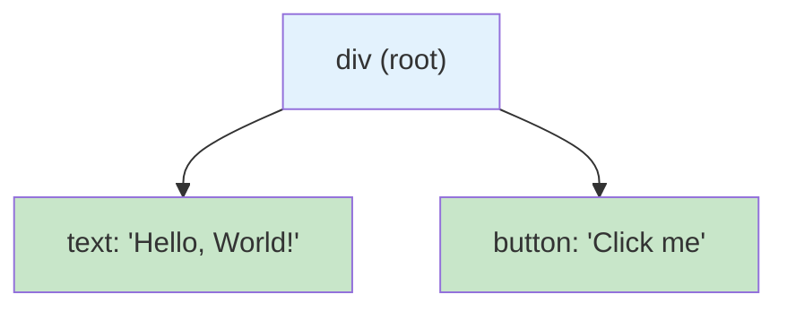

# Recursive and Reusable Schemas

## Introduction

Some data structures can't be represented with fixed nesting levels. A file system has folders containing folders. An organization chart has managers who manage managers. A UI tree has components containing components. These recursive structures need schemas that can reference themselves.

JSON Schema provides two tools for this: `$defs` for reusable schema definitions and `$ref` for referencing them. Together, they let you define a schema once and reference it multiple times — including from within itself, creating recursive patterns.

### What we'll cover

- Defining reusable schemas with `$defs`
- Referencing schemas with `$ref`
- Root-level recursion with `$ref: "#"`
- Recursive data structures: trees, linked lists, nested comments
- Provider support and limitations

### Prerequisites

- Nested object schemas ([Lesson 06](./06-nested-object-schemas.md))
- Strict mode requirements ([Lesson 02](./02-strict-mode-requirements.md))

---

## Reusable schemas with `$defs`

The `$defs` keyword holds a dictionary of named schema definitions. These definitions aren't properties — they're templates you reference elsewhere in the schema using `$ref`.

### Basic `$defs` and `$ref`

```python
import json

# Define an "address" schema once, reference it in multiple places
schema_with_defs = {
    "type": "object",
    "properties": {
        "billing_address": {
            "$ref": "#/$defs/address"
        },
        "shipping_address": {
            "$ref": "#/$defs/address"
        }
    },
    "required": ["billing_address", "shipping_address"],
    "additionalProperties": False,
    "$defs": {
        "address": {
            "type": "object",
            "properties": {
                "street": {"type": "string", "description": "Street address"},
                "city": {"type": "string", "description": "City name"},
                "state": {"type": "string", "description": "State code"},
                "zip_code": {"type": "string", "description": "ZIP/postal code"}
            },
            "required": ["street", "city", "state", "zip_code"],
            "additionalProperties": False
        }
    }
}

print(json.dumps(schema_with_defs, indent=2))
```

**Output:**
```json
{
  "type": "object",
  "properties": {
    "billing_address": {"$ref": "#/$defs/address"},
    "shipping_address": {"$ref": "#/$defs/address"}
  },
  "required": ["billing_address", "shipping_address"],
  "additionalProperties": false,
  "$defs": {
    "address": {
      "type": "object",
      "properties": {
        "street": {"type": "string", "description": "Street address"},
        "city": {"type": "string", "description": "City name"},
        "state": {"type": "string", "description": "State code"},
        "zip_code": {"type": "string", "description": "ZIP/postal code"}
      },
      "required": ["street", "city", "state", "zip_code"],
      "additionalProperties": false
    }
  }
}
```

> **🔑 Key concept:** `$ref: "#/$defs/address"` means "look in the current schema (`#`), go to `$defs`, find the definition named `address`, and use that schema here." The `#` symbol represents the root of the current schema.

### How `$ref` paths work

```python
# $ref path anatomy:
#
# "#/$defs/address"
#  │  │     │
#  │  │     └── Name of the definition
#  │  └──────── Location within the schema
#  └─────────── "#" means "this schema" (root)

# Other valid $ref values:
ref_examples = {
    "#/$defs/address": "Reference a named definition",
    "#/$defs/item":    "Reference another named definition",
    "#":               "Reference the root schema itself (recursion!)"
}

for ref, meaning in ref_examples.items():
    print(f"  {ref:25s} → {meaning}")
```

**Output:**
```
  #/$defs/address           → Reference a named definition
  #/$defs/item              → Reference another named definition
  #                         → Reference the root schema itself (recursion!)
```

---

## Root-level recursion

The most powerful use of `$ref` is root-level recursion: a schema that references itself. This lets you define structures of arbitrary depth.

### Recursive tree structure

```python
import json

# A UI component tree — components can contain child components
ui_tree_tool = {
    "type": "function",
    "function": {
        "name": "render_ui",
        "description": "Render a UI component tree",
        "strict": True,
        "parameters": {
            "type": "object",
            "properties": {
                "component": {
                    "$ref": "#/$defs/ui_node"
                }
            },
            "required": ["component"],
            "additionalProperties": False,
            "$defs": {
                "ui_node": {
                    "type": "object",
                    "properties": {
                        "type": {
                            "type": "string",
                            "enum": ["div", "span", "button", "input", "text"],
                            "description": "HTML element type"
                        },
                        "text": {
                            "type": ["string", "null"],
                            "description": "Text content, or null if none"
                        },
                        "children": {
                            "type": "array",
                            "description": "Child components",
                            "items": {
                                "$ref": "#/$defs/ui_node"
                            }
                        }
                    },
                    "required": ["type", "text", "children"],
                    "additionalProperties": False
                }
            }
        }
    }
}

print(json.dumps(ui_tree_tool, indent=2))
```

**Output:**
```json
{
  "type": "function",
  "function": {
    "name": "render_ui",
    "description": "Render a UI component tree",
    "strict": true,
    "parameters": {
      "type": "object",
      "properties": {
        "component": {"$ref": "#/$defs/ui_node"}
      },
      "required": ["component"],
      "additionalProperties": false,
      "$defs": {
        "ui_node": {
          "type": "object",
          "properties": {
            "type": {"type": "string", "enum": ["div", "span", "button", "input", "text"], "description": "HTML element type"},
            "text": {"type": ["string", "null"], "description": "Text content, or null if none"},
            "children": {"type": "array", "description": "Child components", "items": {"$ref": "#/$defs/ui_node"}}
          },
          "required": ["type", "text", "children"],
          "additionalProperties": false
        }
      }
    }
  }
}
```

The model could generate a response like:

```json
{
  "component": {
    "type": "div",
    "text": null,
    "children": [
      {
        "type": "text",
        "text": "Hello, World!",
        "children": []
      },
      {
        "type": "button",
        "text": "Click me",
        "children": []
      }
    ]
  }
}
```



---

## Linked list pattern

A linked list is another classic recursive structure. Each node points to the next node, or null for the end.

```python
import json

# Step-by-step process — each step links to the next
process_tool = {
    "type": "function",
    "function": {
        "name": "create_workflow",
        "description": "Create a sequential workflow as a linked list of steps",
        "strict": True,
        "parameters": {
            "type": "object",
            "properties": {
                "workflow_name": {
                    "type": "string",
                    "description": "Name of the workflow"
                },
                "first_step": {
                    "$ref": "#/$defs/step"
                }
            },
            "required": ["workflow_name", "first_step"],
            "additionalProperties": False,
            "$defs": {
                "step": {
                    "type": "object",
                    "properties": {
                        "action": {
                            "type": "string",
                            "description": "What this step does"
                        },
                        "assignee": {
                            "type": "string",
                            "description": "Who is responsible for this step"
                        },
                        "next_step": {
                            "anyOf": [
                                {"$ref": "#/$defs/step"},
                                {"type": "null"}
                            ],
                            "description": "Next step in the workflow, or null if this is the last step"
                        }
                    },
                    "required": ["action", "assignee", "next_step"],
                    "additionalProperties": False
                }
            }
        }
    }
}

# Example output the model might generate
example_output = {
    "workflow_name": "Code Review",
    "first_step": {
        "action": "Submit pull request",
        "assignee": "developer",
        "next_step": {
            "action": "Review code changes",
            "assignee": "reviewer",
            "next_step": {
                "action": "Merge to main branch",
                "assignee": "maintainer",
                "next_step": None
            }
        }
    }
}

print("Workflow:", example_output["workflow_name"])
step = example_output["first_step"]
i = 1
while step:
    print(f"  Step {i}: {step['action']} → {step['assignee']}")
    step = step["next_step"]
    i += 1
```

**Output:**
```
Workflow: Code Review
  Step 1: Submit pull request → developer
  Step 2: Review code changes → reviewer
  Step 3: Merge to main branch → maintainer
```

---

## Nested comments pattern

Threaded comments — where replies can have replies — are another natural recursive pattern:

```python
import json

comment_thread_tool = {
    "type": "function",
    "function": {
        "name": "create_comment_thread",
        "description": "Create a threaded comment discussion",
        "strict": True,
        "parameters": {
            "type": "object",
            "properties": {
                "topic": {
                    "type": "string",
                    "description": "Discussion topic"
                },
                "root_comment": {
                    "$ref": "#/$defs/comment"
                }
            },
            "required": ["topic", "root_comment"],
            "additionalProperties": False,
            "$defs": {
                "comment": {
                    "type": "object",
                    "properties": {
                        "author": {
                            "type": "string",
                            "description": "Comment author name"
                        },
                        "text": {
                            "type": "string",
                            "description": "Comment text content"
                        },
                        "replies": {
                            "type": "array",
                            "description": "Replies to this comment",
                            "items": {
                                "$ref": "#/$defs/comment"
                            }
                        }
                    },
                    "required": ["author", "text", "replies"],
                    "additionalProperties": False
                }
            }
        }
    }
}

print("Comment thread schema created with recursive replies")
print("Each comment can have nested replies to any depth")
```

**Output:**
```
Comment thread schema created with recursive replies
Each comment can have nested replies to any depth
```

---

## Multiple `$defs` in one schema

A schema can define multiple reusable types:

```python
import json

# Order schema reusing "address" and "line_item" definitions
order_schema = {
    "type": "object",
    "properties": {
        "order_id": {"type": "string", "description": "Order identifier"},
        "billing_address": {"$ref": "#/$defs/address"},
        "shipping_address": {"$ref": "#/$defs/address"},
        "items": {
            "type": "array",
            "description": "Products in the order",
            "items": {"$ref": "#/$defs/line_item"}
        }
    },
    "required": ["order_id", "billing_address", "shipping_address", "items"],
    "additionalProperties": False,
    "$defs": {
        "address": {
            "type": "object",
            "properties": {
                "street": {"type": "string", "description": "Street"},
                "city": {"type": "string", "description": "City"},
                "country": {"type": "string", "description": "Country code"}
            },
            "required": ["street", "city", "country"],
            "additionalProperties": False
        },
        "line_item": {
            "type": "object",
            "properties": {
                "product_name": {"type": "string", "description": "Product name"},
                "quantity": {"type": "integer", "description": "Quantity ordered"},
                "unit_price": {"type": "number", "description": "Price per unit"}
            },
            "required": ["product_name", "quantity", "unit_price"],
            "additionalProperties": False
        }
    }
}

print(f"Definitions: {list(order_schema['$defs'].keys())}")
print(f"'address' used {2} times (billing + shipping)")
print(f"'line_item' used in the items array")
```

**Output:**
```
Definitions: ['address', 'line_item']
'address' used 2 times (billing + shipping)
'line_item' used in the items array
```

---

## Provider support

| Feature | OpenAI | Anthropic | Gemini |
|---------|--------|-----------|--------|
| `$defs` | ✅ Supported | ✅ Supported | ❌ Not supported |
| `$ref: "#/$defs/name"` | ✅ Supported | ✅ Supported | ❌ Not supported |
| `$ref: "#"` (root recursion) | ✅ Supported | ✅ Supported | ❌ Not supported |
| Recursive depth | Limited by nesting limits | No documented limit | — |

> **⚠️ Warning:** Gemini does not support `$defs` and `$ref`. For Gemini, you must inline the schema at each point where it's used, and you cannot represent truly recursive structures. Use a fixed maximum depth instead.

### Gemini workaround: fixed-depth inlining

```python
import json

# For Gemini: manually inline to a fixed depth
# Instead of recursive $ref, define 3 levels explicitly
gemini_tree = {
    "type": "object",
    "properties": {
        "type": {"type": "string", "enum": ["div", "span", "text"]},
        "text": {"type": "string"},
        "children": {
            "type": "array",
            "items": {
                "type": "object",
                "properties": {
                    "type": {"type": "string", "enum": ["div", "span", "text"]},
                    "text": {"type": "string"},
                    "children": {
                        "type": "array",
                        "items": {
                            "type": "object",
                            "properties": {
                                "type": {"type": "string", "enum": ["div", "span", "text"]},
                                "text": {"type": "string"}
                                # No more children — depth limit reached
                            }
                        }
                    }
                }
            }
        }
    }
}

print("Gemini workaround: 3 levels of nesting defined explicitly")
print("Limitation: cannot represent deeper trees")
```

**Output:**
```
Gemini workaround: 3 levels of nesting defined explicitly
Limitation: cannot represent deeper trees
```

---

## Best practices

| Practice | Why it matters |
|----------|----------------|
| Use `$defs` when a schema appears 2+ times | Reduces duplication and schema size |
| Name definitions clearly (`address`, `line_item`) | Self-documenting schemas |
| Keep recursive structures simple (3-4 properties per node) | Complex recursive nodes confuse models |
| Terminate recursion with null or empty arrays | Model needs a clear way to end the recursion |
| Test with expected depth | Ensure the model generates reasonable depths |
| Fall back to fixed-depth for Gemini | Gemini doesn't support `$ref` or `$defs` |

---

## Common pitfalls

| ❌ Mistake | ✅ Solution |
|-----------|-------------|
| Forgetting `additionalProperties: false` on `$defs` objects | Every object in `$defs` needs strict mode compliance too |
| No termination condition for recursion | Use `null` union or empty array to end recursion |
| Overly complex recursive nodes | Keep nodes to 3-5 properties for model accuracy |
| Using `$ref` in Gemini schemas | Inline the schema or use fixed-depth approach |
| Circular `$defs` (A references B, B references A) | Simplify to single recursive type or flatten |

---

## Hands-on exercise

### Your task

Create a function schema for `create_org_chart` that builds an organizational hierarchy:

1. The function takes an `organization_name` (string) and a `root_person` (the CEO)
2. Each person has:
   - `name` (string) — the person's name
   - `title` (string) — job title
   - `department` (enum: "engineering", "marketing", "sales", "operations", "hr")
   - `direct_reports` (array of person objects — recursive!)
3. Use `$defs` to define the person schema once
4. Make it strict-mode compliant

### Requirements

1. The `person` definition is in `$defs`
2. `direct_reports` uses `$ref` to reference the person definition
3. Empty `direct_reports` array terminates the recursion (leaf employees)
4. Full strict mode compliance at all levels

### Expected result

A schema where the model generates a tree like:
```
CEO → [VP Engineering → [Lead 1, Lead 2], VP Marketing → [Lead 3]]
```

<details>
<summary>💡 Hints (click to expand)</summary>

- Define `person` in `$defs` with `direct_reports` as an array
- Array items use `$ref: "#/$defs/person"`
- Leaf employees have `"direct_reports": []` (empty array)
- Don't forget `additionalProperties: false` on the person definition

</details>

<details>
<summary>✅ Solution (click to expand)</summary>

```python
import json

create_org_chart_tool = {
    "type": "function",
    "function": {
        "name": "create_org_chart",
        "description": "Create an organizational hierarchy chart",
        "strict": True,
        "parameters": {
            "type": "object",
            "properties": {
                "organization_name": {
                    "type": "string",
                    "description": "Name of the organization"
                },
                "root_person": {
                    "$ref": "#/$defs/person",
                    "description": "The top-level person (e.g., CEO)"
                }
            },
            "required": ["organization_name", "root_person"],
            "additionalProperties": False,
            "$defs": {
                "person": {
                    "type": "object",
                    "properties": {
                        "name": {
                            "type": "string",
                            "description": "Person's full name"
                        },
                        "title": {
                            "type": "string",
                            "description": "Job title, e.g., 'VP of Engineering'"
                        },
                        "department": {
                            "type": "string",
                            "enum": ["engineering", "marketing",
                                     "sales", "operations", "hr"],
                            "description": "Department this person belongs to"
                        },
                        "direct_reports": {
                            "type": "array",
                            "description": "People who report directly to this person. Empty array for individual contributors.",
                            "items": {
                                "$ref": "#/$defs/person"
                            }
                        }
                    },
                    "required": ["name", "title", "department", "direct_reports"],
                    "additionalProperties": False
                }
            }
        }
    }
}

print(json.dumps(create_org_chart_tool, indent=2))
```

</details>

### Bonus challenges

- [ ] Add a nullable `assistant` field (a single person or null) to each person node
- [ ] Create a version that works with Gemini (fixed 3-level depth, no `$ref`)

---

## Summary

✅ `$defs` holds reusable schema definitions that can be referenced with `$ref: "#/$defs/name"`

✅ Root-level recursion (`$ref` pointing back to a definition) enables tree structures, linked lists, and threaded comments

✅ Recursive schemas need clear termination: null values for linked lists, empty arrays for trees

✅ OpenAI and Anthropic support `$defs` and `$ref`; Gemini requires inlining schemas to a fixed depth

✅ Keep recursive nodes simple (3-5 properties) and test with realistic depths to ensure model accuracy

**Next:** [Array Item Schemas](./08-array-item-schemas.md) — Defining schemas for array elements

---

## Further reading

- [OpenAI Structured Outputs — Recursive Schemas](https://platform.openai.com/docs/guides/structured-outputs) — `$defs` and `$ref` support
- [JSON Schema $defs Reference](https://json-schema.org/understanding-json-schema/structuring) — Schema structuring and reuse
- [Anthropic Tool Use](https://docs.anthropic.com/en/docs/build-with-claude/tool-use/overview) — Recursive schema support

---

[← Previous: Nested Object Schemas](./06-nested-object-schemas.md) | [Next: Array Item Schemas →](./08-array-item-schemas.md)

<!-- 
Sources Consulted:
- OpenAI Structured Outputs: https://platform.openai.com/docs/guides/structured-outputs
- JSON Schema Structuring: https://json-schema.org/understanding-json-schema/structuring
- Anthropic Tool Use: https://platform.claude.com/docs/en/docs/build-with-claude/tool-use/overview
- Google Gemini Function Calling: https://ai.google.dev/gemini-api/docs/function-calling
-->
