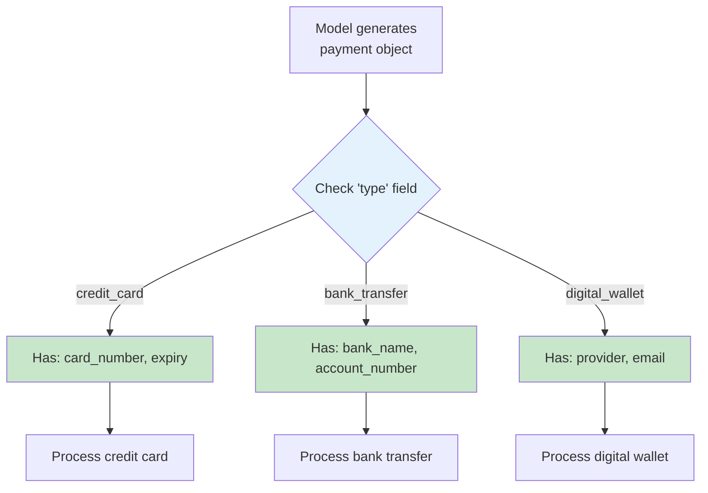

# anyOf for Union Types

## Introduction

Sometimes a parameter needs to accept more than one type of value. A notification target could be an email address object or a phone number object. A payment method could be a credit card, bank transfer, or digital wallet — each with different fields. The `anyOf` keyword lets you define multiple valid schemas for a single property, and the model's output must match at least one of them.

This lesson covers `anyOf` syntax, discriminated unions for type-safe handling, placement rules, and provider support.

### What we'll cover

- How `anyOf` works in function schemas
- Discriminated unions with a type field
- Placement rules: `anyOf` cannot be at the root
- Each branch must be independently valid
- Provider support and limitations

### Prerequisites

- Nested object schemas ([Lesson 06](./06-nested-object-schemas.md))
- Recursive and reusable schemas ([Lesson 07](./07-recursive-reusable-schemas.md))

---

## How `anyOf` works

The `anyOf` keyword takes an array of schemas. The value must be valid against at least one of the listed schemas.

### Basic `anyOf`

```python
import json

# A property that accepts either a string or null
# (This is what the null union pattern does under the hood)
nullable_string = {
    "anyOf": [
        {"type": "string"},
        {"type": "null"}
    ],
    "description": "A string value or null"
}

# A property that accepts different object shapes
notification_target = {
    "anyOf": [
        {
            "type": "object",
            "properties": {
                "channel": {"type": "string", "enum": ["email"]},
                "address": {"type": "string", "description": "Email address"}
            },
            "required": ["channel", "address"],
            "additionalProperties": False
        },
        {
            "type": "object",
            "properties": {
                "channel": {"type": "string", "enum": ["sms"]},
                "phone": {"type": "string", "description": "Phone number with country code"}
            },
            "required": ["channel", "phone"],
            "additionalProperties": False
        }
    ],
    "description": "Where to send the notification"
}

print("Nullable string:", json.dumps(nullable_string))
print()
print("Notification target (email or SMS):")
print(json.dumps(notification_target, indent=2))
```

**Output:**
```
Nullable string: {"anyOf": [{"type": "string"}, {"type": "null"}], "description": "A string value or null"}

Notification target (email or SMS):
{
  "anyOf": [
    {
      "type": "object",
      "properties": {
        "channel": {"type": "string", "enum": ["email"]},
        "address": {"type": "string", "description": "Email address"}
      },
      "required": ["channel", "address"],
      "additionalProperties": false
    },
    {
      "type": "object",
      "properties": {
        "channel": {"type": "string", "enum": ["sms"]},
        "phone": {"type": "string", "description": "Phone number with country code"}
      },
      "required": ["channel", "phone"],
      "additionalProperties": false
    }
  ],
  "description": "Where to send the notification"
}
```

> **🔑 Key concept:** `anyOf` means "match at least one of these schemas." The model generates output that conforms to one branch, and your code determines which branch was matched.

---

## Discriminated unions

A discriminated union uses a shared field (the "discriminator") to indicate which variant was chosen. This makes it easy to determine which branch the model picked.

### The discriminator pattern

```python
import json

# Payment method — discriminated by "type" field
payment_method_schema = {
    "anyOf": [
        {
            "type": "object",
            "properties": {
                "type": {
                    "type": "string",
                    "enum": ["credit_card"],
                    "description": "Payment type"
                },
                "card_number": {
                    "type": "string",
                    "description": "Card number (last 4 digits)"
                },
                "expiry": {
                    "type": "string",
                    "description": "Expiry date in MM/YY format"
                }
            },
            "required": ["type", "card_number", "expiry"],
            "additionalProperties": False
        },
        {
            "type": "object",
            "properties": {
                "type": {
                    "type": "string",
                    "enum": ["bank_transfer"],
                    "description": "Payment type"
                },
                "bank_name": {
                    "type": "string",
                    "description": "Name of the bank"
                },
                "account_number": {
                    "type": "string",
                    "description": "Account number (last 4 digits)"
                }
            },
            "required": ["type", "bank_name", "account_number"],
            "additionalProperties": False
        },
        {
            "type": "object",
            "properties": {
                "type": {
                    "type": "string",
                    "enum": ["digital_wallet"],
                    "description": "Payment type"
                },
                "provider": {
                    "type": "string",
                    "enum": ["paypal", "apple_pay", "google_pay"],
                    "description": "Wallet provider"
                },
                "email": {
                    "type": "string",
                    "description": "Account email for the wallet"
                }
            },
            "required": ["type", "provider", "email"],
            "additionalProperties": False
        }
    ],
    "description": "Payment method details"
}

# Handling the discriminated union in Python
def process_payment(payment: dict) -> str:
    """Process payment based on the discriminator field."""
    match payment["type"]:
        case "credit_card":
            return f"Charging card ending in {payment['card_number']}"
        case "bank_transfer":
            return f"Transferring from {payment['bank_name']} ({payment['account_number']})"
        case "digital_wallet":
            return f"Paying via {payment['provider']} ({payment['email']})"
        case _:
            return f"Unknown payment type: {payment['type']}"

# Test with different payment types
test_payments = [
    {"type": "credit_card", "card_number": "4242", "expiry": "12/25"},
    {"type": "bank_transfer", "bank_name": "Chase", "account_number": "9876"},
    {"type": "digital_wallet", "provider": "paypal", "email": "user@example.com"},
]

for payment in test_payments:
    print(process_payment(payment))
```

**Output:**
```
Charging card ending in 4242
Transferring from Chase (9876)
Paying via paypal (user@example.com)
```

### Why discriminated unions?



| Approach | How you determine the variant | Reliability |
|----------|-------------------------------|-------------|
| Check which fields exist | `if "card_number" in payment` | ⚠️ Fragile — fields may overlap |
| Discriminator field | `if payment["type"] == "credit_card"` | ✅ Reliable — explicit indicator |

---

## Placement rules

### `anyOf` cannot be at the root level

In OpenAI's strict mode, the root schema must be `type: "object"`. You cannot use `anyOf` at the root — it must be nested inside a property.

```python
import json

# ❌ WRONG: anyOf at root level
wrong_root = {
    "anyOf": [
        {
            "type": "object",
            "properties": {"name": {"type": "string"}},
            "required": ["name"],
            "additionalProperties": False
        },
        {
            "type": "object",
            "properties": {"id": {"type": "integer"}},
            "required": ["id"],
            "additionalProperties": False
        }
    ]
}

# ✅ CORRECT: anyOf inside a property
correct_wrapped = {
    "type": "object",
    "properties": {
        "identifier": {
            "anyOf": [
                {
                    "type": "object",
                    "properties": {"name": {"type": "string", "description": "Name"}},
                    "required": ["name"],
                    "additionalProperties": False
                },
                {
                    "type": "object",
                    "properties": {"id": {"type": "integer", "description": "ID"}},
                    "required": ["id"],
                    "additionalProperties": False
                }
            ],
            "description": "Identify by name or numeric ID"
        }
    },
    "required": ["identifier"],
    "additionalProperties": False
}

print("❌ Root-level anyOf: not allowed in strict mode")
print("✅ anyOf inside a property: correct approach")
print()
print(json.dumps(correct_wrapped, indent=2))
```

**Output:**
```
❌ Root-level anyOf: not allowed in strict mode
✅ anyOf inside a property: correct approach

{
  "type": "object",
  "properties": {
    "identifier": {
      "anyOf": [...],
      "description": "Identify by name or numeric ID"
    }
  },
  "required": ["identifier"],
  "additionalProperties": false
}
```

### Each branch must be independently valid

Every schema in the `anyOf` array must be a complete, valid schema on its own. In strict mode, each object branch needs its own `required` and `additionalProperties`.

```python
import json

# ❌ WRONG: branches sharing/missing fields
wrong_branches = {
    "anyOf": [
        {
            "type": "object",
            "properties": {
                "name": {"type": "string"}
            }
            # ❌ Missing required and additionalProperties
        },
        {
            "type": "object",
            "properties": {
                "id": {"type": "integer"}
            }
            # ❌ Missing required and additionalProperties
        }
    ]
}

# ✅ CORRECT: each branch is independently complete
correct_branches = {
    "anyOf": [
        {
            "type": "object",
            "properties": {
                "name": {"type": "string", "description": "Name"}
            },
            "required": ["name"],
            "additionalProperties": False
        },
        {
            "type": "object",
            "properties": {
                "id": {"type": "integer", "description": "Numeric ID"}
            },
            "required": ["id"],
            "additionalProperties": False
        }
    ]
}

print("Each anyOf branch must be a complete, self-contained schema")
```

**Output:**
```
Each anyOf branch must be a complete, self-contained schema
```

---

## `anyOf` with `$defs`

For complex union types, combine `anyOf` with `$defs` to keep the schema readable:

```python
import json

# Clean approach: define variants in $defs, reference in anyOf
search_tool = {
    "type": "function",
    "function": {
        "name": "search",
        "description": "Search using different filter types",
        "strict": True,
        "parameters": {
            "type": "object",
            "properties": {
                "query": {
                    "type": "string",
                    "description": "Search query text"
                },
                "filter": {
                    "anyOf": [
                        {"$ref": "#/$defs/date_filter"},
                        {"$ref": "#/$defs/category_filter"},
                        {"$ref": "#/$defs/price_filter"}
                    ],
                    "description": "Filter to apply to search results"
                }
            },
            "required": ["query", "filter"],
            "additionalProperties": False,
            "$defs": {
                "date_filter": {
                    "type": "object",
                    "properties": {
                        "filter_type": {
                            "type": "string",
                            "enum": ["date"],
                            "description": "Filter type"
                        },
                        "start_date": {
                            "type": "string",
                            "description": "Start date (YYYY-MM-DD)"
                        },
                        "end_date": {
                            "type": "string",
                            "description": "End date (YYYY-MM-DD)"
                        }
                    },
                    "required": ["filter_type", "start_date", "end_date"],
                    "additionalProperties": False
                },
                "category_filter": {
                    "type": "object",
                    "properties": {
                        "filter_type": {
                            "type": "string",
                            "enum": ["category"],
                            "description": "Filter type"
                        },
                        "categories": {
                            "type": "array",
                            "items": {"type": "string"},
                            "description": "Categories to include"
                        }
                    },
                    "required": ["filter_type", "categories"],
                    "additionalProperties": False
                },
                "price_filter": {
                    "type": "object",
                    "properties": {
                        "filter_type": {
                            "type": "string",
                            "enum": ["price"],
                            "description": "Filter type"
                        },
                        "min_price": {
                            "type": "number",
                            "description": "Minimum price"
                        },
                        "max_price": {
                            "type": "number",
                            "description": "Maximum price"
                        }
                    },
                    "required": ["filter_type", "min_price", "max_price"],
                    "additionalProperties": False
                }
            }
        }
    }
}

print(f"Filter variants: {list(search_tool['function']['parameters']['$defs'].keys())}")
print("Each variant has a 'filter_type' discriminator")
```

**Output:**
```
Filter variants: ['date_filter', 'category_filter', 'price_filter']
Each variant has a 'filter_type' discriminator
```

---

## Provider support

| Feature | OpenAI (strict) | OpenAI (standard) | Anthropic | Gemini |
|---------|-----------------|-------------------|-----------|--------|
| `anyOf` | ✅ | ✅ | ✅ | ❌ |
| `anyOf` at root | ❌ | ✅ | ✅ | ❌ |
| `anyOf` with `$ref` | ✅ | ✅ | ✅ | ❌ |
| `oneOf` | ❌ | ✅ | ✅ | ❌ |
| `allOf` | ❌ | ✅ | ✅ | ❌ |

### Gemini alternative: enum-based branching

Since Gemini doesn't support `anyOf`, use a discriminator enum with all possible fields:

```python
import json

# Gemini-compatible alternative to anyOf
gemini_payment = {
    "type": "object",
    "properties": {
        "payment_type": {
            "type": "string",
            "enum": ["credit_card", "bank_transfer", "digital_wallet"],
            "description": "Type of payment"
        },
        "card_number": {
            "type": "string",
            "description": "Last 4 digits of card (for credit_card type only)"
        },
        "expiry": {
            "type": "string",
            "description": "Card expiry MM/YY (for credit_card type only)"
        },
        "bank_name": {
            "type": "string",
            "description": "Bank name (for bank_transfer type only)"
        },
        "account_number": {
            "type": "string",
            "description": "Account number (for bank_transfer type only)"
        },
        "provider": {
            "type": "string",
            "description": "Wallet provider (for digital_wallet type only)"
        },
        "email": {
            "type": "string",
            "description": "Wallet email (for digital_wallet type only)"
        }
    },
    "required": ["payment_type"],
    "description": "Payment details. Include only the fields relevant to the chosen payment_type."
}

print("Gemini workaround: flat object with all fields + discriminator enum")
print("Downside: model might include irrelevant fields")
```

**Output:**
```
Gemini workaround: flat object with all fields + discriminator enum
Downside: model might include irrelevant fields
```

---

## Best practices

| Practice | Why it matters |
|----------|----------------|
| Use a discriminator field in each `anyOf` branch | Makes it easy to determine which variant was chosen |
| Use single-value enums as discriminators | `"enum": ["credit_card"]` is unambiguous |
| Put `anyOf` inside a property, not at root | Required for OpenAI strict mode |
| Each branch must be a complete valid schema | Independent `required` and `additionalProperties` per branch |
| Combine with `$defs` for readability | Named definitions are easier to maintain than inline schemas |
| Limit to 3-5 variants | More variants increase schema complexity and token cost |

---

## Common pitfalls

| ❌ Mistake | ✅ Solution |
|-----------|-------------|
| `anyOf` at root level | Wrap in an object property |
| Missing `additionalProperties` on `anyOf` branches | Add to every object branch |
| No discriminator field | Add a `type` enum to each branch |
| Overlapping branch schemas | Make each branch distinct with unique discriminator values |
| Using `anyOf` in Gemini | Use flat objects with enum discriminator instead |
| Too many variants (>5) | Consider separate functions or grouping |

---

## Hands-on exercise

### Your task

Create a function schema for `send_message` where the `destination` parameter uses `anyOf` to accept three types:

1. **Email**: `channel: "email"`, `address` (string), `subject` (string)
2. **SMS**: `channel: "sms"`, `phone_number` (string), `country_code` (string)
3. **Slack**: `channel: "slack"`, `workspace` (string), `channel_name` (string)

The function also takes:
- `message` (string) — the message content
- `urgent` (boolean) — whether to mark as urgent

### Requirements

1. Use `anyOf` with discriminated unions (the `channel` field as discriminator)
2. Full strict mode compliance on every branch
3. Define variants in `$defs` for clean organization
4. Write a Python handler function that routes based on the discriminator

<details>
<summary>💡 Hints (click to expand)</summary>

- Each branch's `channel` field should be an enum with a single value: `["email"]`, `["sms"]`, or `["slack"]`
- All three branches go inside the `anyOf` array on the `destination` property
- Put the branch definitions in `$defs` and reference them with `$ref`
- The handler uses `match destination["channel"]` to route

</details>

<details>
<summary>✅ Solution (click to expand)</summary>

```python
import json

send_message_tool = {
    "type": "function",
    "function": {
        "name": "send_message",
        "description": "Send a message to a destination via email, SMS, or Slack",
        "strict": True,
        "parameters": {
            "type": "object",
            "properties": {
                "message": {
                    "type": "string",
                    "description": "Message content to send"
                },
                "urgent": {
                    "type": "boolean",
                    "description": "Whether to mark the message as urgent"
                },
                "destination": {
                    "anyOf": [
                        {"$ref": "#/$defs/email_dest"},
                        {"$ref": "#/$defs/sms_dest"},
                        {"$ref": "#/$defs/slack_dest"}
                    ],
                    "description": "Where to send the message"
                }
            },
            "required": ["message", "urgent", "destination"],
            "additionalProperties": False,
            "$defs": {
                "email_dest": {
                    "type": "object",
                    "properties": {
                        "channel": {
                            "type": "string",
                            "enum": ["email"],
                            "description": "Email channel"
                        },
                        "address": {
                            "type": "string",
                            "description": "Recipient email address"
                        },
                        "subject": {
                            "type": "string",
                            "description": "Email subject line"
                        }
                    },
                    "required": ["channel", "address", "subject"],
                    "additionalProperties": False
                },
                "sms_dest": {
                    "type": "object",
                    "properties": {
                        "channel": {
                            "type": "string",
                            "enum": ["sms"],
                            "description": "SMS channel"
                        },
                        "phone_number": {
                            "type": "string",
                            "description": "Phone number"
                        },
                        "country_code": {
                            "type": "string",
                            "description": "Country code, e.g., '+1'"
                        }
                    },
                    "required": ["channel", "phone_number", "country_code"],
                    "additionalProperties": False
                },
                "slack_dest": {
                    "type": "object",
                    "properties": {
                        "channel": {
                            "type": "string",
                            "enum": ["slack"],
                            "description": "Slack channel"
                        },
                        "workspace": {
                            "type": "string",
                            "description": "Slack workspace name"
                        },
                        "channel_name": {
                            "type": "string",
                            "description": "Slack channel name, e.g., '#general'"
                        }
                    },
                    "required": ["channel", "workspace", "channel_name"],
                    "additionalProperties": False
                }
            }
        }
    }
}

# Handler function
def handle_send_message(args: dict) -> str:
    dest = args["destination"]
    prefix = "🚨 URGENT: " if args["urgent"] else ""
    
    match dest["channel"]:
        case "email":
            return f"{prefix}Sending email to {dest['address']}: {dest['subject']}"
        case "sms":
            return f"{prefix}Sending SMS to {dest['country_code']}{dest['phone_number']}"
        case "slack":
            return f"{prefix}Posting to {dest['workspace']}/{dest['channel_name']}"

# Test
test = {
    "message": "Deploy is ready",
    "urgent": True,
    "destination": {"channel": "slack", "workspace": "myteam", "channel_name": "#deploys"}
}
print(handle_send_message(test))
```

</details>

### Bonus challenges

- [ ] Add a fourth variant: **webhook** with `channel: "webhook"`, `url` (string), and `headers` (nullable object)
- [ ] Write a version that works with Gemini (flat object, no `anyOf`)

---

## Summary

✅ `anyOf` defines multiple valid schemas for a single property — the model's output must match at least one

✅ Discriminated unions use a shared field (like `type` or `channel`) with single-value enums to identify which variant was chosen

✅ `anyOf` cannot be at the root level in OpenAI strict mode — wrap it inside a property

✅ Each branch in `anyOf` must be a complete, independently valid schema with its own `required` and `additionalProperties`

✅ Gemini doesn't support `anyOf` — use flat objects with a discriminator enum and document which fields apply to each type

**Next:** [Property Descriptions](./10-property-descriptions.md) — Writing descriptions that guide model behavior

---

## Further reading

- [JSON Schema anyOf Reference](https://json-schema.org/understanding-json-schema/reference/combining#anyOf) — Official combining schemas documentation
- [OpenAI Structured Outputs](https://platform.openai.com/docs/guides/structured-outputs) — `anyOf` support and limitations
- [Anthropic Tool Use](https://docs.anthropic.com/en/docs/build-with-claude/tool-use/overview) — Union types in Anthropic tools

---

[← Previous: Array Item Schemas](./08-array-item-schemas.md) | [Next: Property Descriptions →](./10-property-descriptions.md)

<!-- 
Sources Consulted:
- JSON Schema Combining Schemas: https://json-schema.org/understanding-json-schema/reference/combining
- OpenAI Structured Outputs: https://platform.openai.com/docs/guides/structured-outputs
- Anthropic Tool Use: https://platform.claude.com/docs/en/docs/build-with-claude/tool-use/overview
- Google Gemini Function Calling: https://ai.google.dev/gemini-api/docs/function-calling
-->
