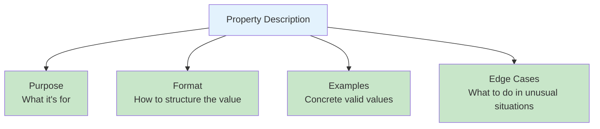

# Property Descriptions

## Introduction

In function calling, property descriptions are the primary way you communicate intent to the model. The schema constrains *what* values are valid — types, enums, required fields — but descriptions tell the model *when* to use each parameter, *what format* to follow, *what values* make sense, and *how* to handle edge cases. A well-described schema produces dramatically better results than one with perfect structure but empty descriptions.

This lesson covers description purpose, format guidance, edge case documentation, constraint explanation, and patterns that consistently improve model accuracy.

### What we'll cover

- Why descriptions matter more than you think
- Describing parameter purpose and context
- Format expectations and examples
- Edge case documentation
- Explaining constraints the schema can't enforce
- Description patterns that improve accuracy

### Prerequisites

- JSON Schema basics ([Lesson 01](./01-json-schema-basics.md))
- Property types ([Lesson 03](./03-property-types.md))
- Enums for constrained values ([Lesson 05](./05-enums-constrained-values.md))

---

## Why descriptions matter

The model reads your descriptions to decide *which* function to call, *what* values to generate, and *how* to interpret the user's request. Without descriptions, the model guesses based on property names alone.

### Without descriptions

```python
import json

# ❌ No descriptions — model must guess intent
no_descriptions = {
    "type": "function",
    "function": {
        "name": "search",
        "parameters": {
            "type": "object",
            "properties": {
                "q": {"type": "string"},
                "n": {"type": "integer"},
                "sort": {"type": "string"},
                "filter": {"type": "string"}
            },
            "required": ["q", "n", "sort", "filter"],
            "additionalProperties": False
        }
    }
}

print("What does 'q' mean? Query? Queue? Quantity?")
print("What does 'n' mean? Number of results? Page number?")
print("What valid values does 'sort' accept?")
print("What format should 'filter' use?")
```

**Output:**
```
What does 'q' mean? Query? Queue? Quantity?
What does 'n' mean? Number of results? Page number?
What valid values does 'sort' accept?
What format should 'filter' use?
```

### With descriptions

```python
import json

# ✅ Clear descriptions — model knows exactly what to generate
with_descriptions = {
    "type": "function",
    "function": {
        "name": "search_products",
        "description": "Search the product catalog by keyword with filters",
        "parameters": {
            "type": "object",
            "properties": {
                "query": {
                    "type": "string",
                    "description": "Search keywords, e.g., 'wireless headphones noise cancelling'"
                },
                "max_results": {
                    "type": "integer",
                    "description": "Maximum number of results to return (1-100, default: 10)"
                },
                "sort_by": {
                    "type": "string",
                    "enum": ["relevance", "price_asc", "price_desc", "rating", "newest"],
                    "description": (
                        "How to sort results: 'relevance' for best match (default), "
                        "'price_asc' for cheapest first, 'price_desc' for most expensive, "
                        "'rating' for highest rated, 'newest' for most recent"
                    )
                },
                "category": {
                    "type": ["string", "null"],
                    "description": "Product category to filter by, e.g., 'electronics', 'books'. Null for all categories."
                }
            },
            "required": ["query", "max_results", "sort_by", "category"],
            "additionalProperties": False
        }
    }
}

print("Clear naming + descriptions = model knows exactly what to generate")
print(f"Properties: {list(with_descriptions['function']['parameters']['properties'].keys())}")
```

**Output:**
```
Clear naming + descriptions = model knows exactly what to generate
Properties: ['query', 'max_results', 'sort_by', 'category']
```

---

## What to include in descriptions

Every description should answer the question: "If the model sees this property name and description, will it generate the right value?" A complete description covers four areas:



### 1. Purpose — what is this for?

```python
import json

# ❌ Vague purpose
vague = {"type": "string", "description": "The date"}

# ✅ Clear purpose
clear = {"type": "string", "description": "Start date for the report period"}

# ✅ Even better: purpose + context
better = {
    "type": "string",
    "description": "Start date for the report period. Data before this date is excluded."
}

print("Vague:", vague["description"])
print("Clear:", clear["description"])
print("Better:", better["description"])
```

**Output:**
```
Vague: The date
Clear: Start date for the report period
Better: Start date for the report period. Data before this date is excluded.
```

### 2. Format — how should the value be structured?

```python
import json

descriptions_with_format = {
    "date": "Date in YYYY-MM-DD format, e.g., '2025-03-15'",
    "phone": "Phone number with country code, e.g., '+1-555-123-4567'",
    "email": "Email address, e.g., 'user@example.com'",
    "currency": "Amount in USD with 2 decimal places, e.g., 49.99",
    "color": "Hex color code including #, e.g., '#FF5733'",
    "time": "Time in 24-hour HH:MM format, e.g., '14:30'",
    "url": "Full URL including protocol, e.g., 'https://example.com/page'"
}

print("Format examples in descriptions:")
for field, desc in descriptions_with_format.items():
    print(f"  {field}: \"{desc}\"")
```

**Output:**
```
Format examples in descriptions:
  date: "Date in YYYY-MM-DD format, e.g., '2025-03-15'"
  phone: "Phone number with country code, e.g., '+1-555-123-4567'"
  email: "Email address, e.g., 'user@example.com'"
  currency: "Amount in USD with 2 decimal places, e.g., 49.99"
  color: "Hex color code including #, e.g., '#FF5733'"
  time: "Time in 24-hour HH:MM format, e.g., '14:30'"
  url: "Full URL including protocol, e.g., 'https://example.com/page'"
```

### 3. Examples — concrete valid values

```python
import json

# Examples make abstract descriptions concrete
examples_property = {
    "type": "string",
    "description": (
        "Search query for finding products. "
        "Examples: 'wireless headphones', 'running shoes size 10', "
        "'laptop under 1000 dollars', 'organic coffee beans'"
    )
}

# Enum descriptions benefit from examples too
sort_property = {
    "type": "string",
    "enum": ["relevance", "price_asc", "price_desc", "rating"],
    "description": (
        "Sort order for results. Use 'relevance' when the user asks for "
        "'best match' or doesn't specify. Use 'price_asc' when they ask for "
        "'cheapest' or 'lowest price'. Use 'rating' when they ask for "
        "'best rated' or 'top rated'."
    )
}

print("Query description:", examples_property["description"][:60] + "...")
print("Sort description:", sort_property["description"][:60] + "...")
```

**Output:**
```
Query description: Search query for finding products. Examples: 'wireless head...
Sort description: Sort order for results. Use 'relevance' when the user asks ...
```

### 4. Edge cases — what to do in unusual situations

```python
import json

# Document what to do when the user's input is ambiguous
edge_case_examples = {
    "quantity": {
        "type": "integer",
        "description": (
            "Number of items to order (minimum 1). "
            "If the user says 'a few', use 3. "
            "If the user says 'several', use 5."
        )
    },
    "language": {
        "type": "string",
        "enum": ["en", "es", "fr", "de", "ja", "zh"],
        "description": (
            "Language code for the response. "
            "If the user doesn't specify, use 'en'. "
            "If the user says 'Chinese', use 'zh'. "
            "If the language isn't in the list, use the closest match."
        )
    },
    "date_range": {
        "type": "string",
        "description": (
            "Date in YYYY-MM-DD format. "
            "If the user says 'today', use today's date. "
            "If the user says 'last week', use the date 7 days ago. "
            "If the user gives an ambiguous date like 'next Friday', "
            "pick the closest upcoming Friday."
        )
    }
}

for name, prop in edge_case_examples.items():
    print(f"{name}: {prop['description'][:80]}...")
```

**Output:**
```
quantity: Number of items to order (minimum 1). If the user says 'a few', use 3. If th...
language: Language code for the response. If the user doesn't specify, use 'en'. If the u...
date_range: Date in YYYY-MM-DD format. If the user says 'today', use today's date. If the us...
```

---

## Explaining constraints the schema can't enforce

Many constraints can't be expressed in strict-mode JSON Schema. Descriptions are your only tool for communicating these rules.

### Constraints that need description help

```python
import json

# Range constraints (not supported in strict mode)
temperature = {
    "type": "number",
    "description": "Temperature in Celsius, between -273.15 and 1000.0"
}

# String length constraints (not supported in strict mode)
username = {
    "type": "string",
    "description": "Username, 3-30 characters, letters and numbers only, no spaces"
}

# Array length (not supported in strict mode)
tags = {
    "type": "array",
    "items": {"type": "string"},
    "description": "Tags for the item (provide 1-5 tags, each unique)"
}

# Cross-field dependencies
dates = {
    "start_date": {
        "type": "string",
        "description": "Start date in YYYY-MM-DD format. Must be before end_date."
    },
    "end_date": {
        "type": "string",
        "description": "End date in YYYY-MM-DD format. Must be after start_date."
    }
}

# Conditional requirements
shipping = {
    "shipping_method": {
        "type": "string",
        "enum": ["standard", "express", "overnight"],
        "description": "Shipping speed"
    },
    "delivery_instructions": {
        "type": ["string", "null"],
        "description": (
            "Special delivery instructions. Required for 'express' and "
            "'overnight' shipping. Null for 'standard' shipping."
        )
    }
}

print("Constraints documented in descriptions:")
print(f"  Range: {temperature['description']}")
print(f"  Length: {username['description']}")
print(f"  Array: {tags['description']}")
print(f"  Cross-field: {dates['start_date']['description']}")
print(f"  Conditional: {shipping['delivery_instructions']['description'][:60]}...")
```

**Output:**
```
Constraints documented in descriptions:
  Range: Temperature in Celsius, between -273.15 and 1000.0
  Length: Username, 3-30 characters, letters and numbers only, no spaces
  Array: Tags for the item (provide 1-5 tags, each unique)
  Cross-field: Start date in YYYY-MM-DD format. Must be before end_date.
  Conditional: Special delivery instructions. Required for 'express' and 'overn...
```

---

## Function-level descriptions

The function description (not property descriptions) tells the model *when to call this function*. It should clearly state the function's purpose and distinguish it from other available functions.

```python
import json

# ❌ Vague function description
vague_function = {
    "name": "search",
    "description": "Search for things"
}

# ✅ Specific function description
specific_function = {
    "name": "search_products",
    "description": (
        "Search the product catalog by keyword. Returns product name, price, "
        "and availability. Use this when the user wants to find, browse, or "
        "compare products. Do NOT use this for order lookups — use "
        "get_order_status instead."
    )
}

print("Vague:", vague_function["description"])
print()
print("Specific:", specific_function["description"])
```

**Output:**
```
Vague: Search for things

Specific: Search the product catalog by keyword. Returns product name, price, and availability. Use this when the user wants to find, browse, or compare products. Do NOT use this for order lookups — use get_order_status instead.
```

### Function description checklist

| Include | Example |
|---------|---------|
| What the function does | "Search the product catalog by keyword" |
| What it returns | "Returns product name, price, and availability" |
| When to use it | "Use when the user wants to find or compare products" |
| When NOT to use it | "Do NOT use for order lookups — use get_order_status" |

---

## Description length guidelines

Descriptions should be concise but complete. Too short and the model guesses; too long and you waste tokens.

```python
# ❌ Too short — model guesses
too_short = "The name"

# ❌ Too long — wastes tokens, buries the key info
too_long = (
    "This parameter represents the full name of the customer who is placing "
    "the order. The name should be the legal name as it appears on their "
    "government-issued identification document. This is important because "
    "the shipping label will use this name, and if it doesn't match the "
    "name on the ID, the package may not be delivered. In some countries, "
    "the name format is family name first, while in others it's given name "
    "first. We standardize on Western format (given name, family name). "
    "Examples include 'John Smith', 'María García', 'Yuki Tanaka'."
)

# ✅ Just right — purpose, format, example
just_right = "Customer's full name as it should appear on the shipping label, e.g., 'John Smith'"

print(f"Too short: {len(too_short)} chars — '{too_short}'")
print(f"Too long: {len(too_long)} chars")
print(f"Just right: {len(just_right)} chars — '{just_right}'")
```

**Output:**
```
Too short: 8 chars — 'The name'
Too long: 517 chars
Just right: 83 chars — 'Customer's full name as it should appear on the shipping label, e.g., 'John Smith''
```

| Description length | Verdict | Typical use |
|-------------------|---------|-------------|
| 5-15 chars | ❌ Too short | Only for self-explanatory fields like `"Email address"` |
| 20-100 chars | ✅ Ideal | Most properties |
| 100-200 chars | ✅ Good | Complex properties needing format + examples |
| 200+ chars | ⚠️ Consider trimming | Only for enum explanations or critical edge cases |

---

## Description patterns that improve accuracy

### Pattern 1: "Use X when the user says Y"

```python
# Map user language to parameter values
sort_desc = (
    "Sort order: 'relevance' (default, or when user says 'best match'), "
    "'price_asc' (when user says 'cheapest' or 'lowest price'), "
    "'price_desc' (when user says 'most expensive' or 'highest price'), "
    "'rating' (when user says 'best rated' or 'top rated')"
)
print("Pattern 1:", sort_desc[:60] + "...")
```

### Pattern 2: "Default to X if not specified"

```python
# Tell the model what to use when the user doesn't mention it
count_desc = "Number of results to return (1-50). Default to 10 if the user doesn't specify."
print("Pattern 2:", count_desc)
```

### Pattern 3: "Format as X, e.g., Y"

```python
# Format + concrete example
date_desc = "Date in YYYY-MM-DD format, e.g., '2025-06-15'"
print("Pattern 3:", date_desc)
```

### Pattern 4: "Null when X"

```python
# When to use null
filter_desc = "Category filter, or null to search all categories"
print("Pattern 4:", filter_desc)
```

---

## Complete example

Putting it all together — a well-described function schema:

```python
import json

book_restaurant_tool = {
    "type": "function",
    "function": {
        "name": "book_restaurant",
        "description": (
            "Make a restaurant reservation. Use when the user wants to book "
            "a table, make a reservation, or dine at a restaurant. "
            "Returns confirmation number and reservation details."
        ),
        "strict": True,
        "parameters": {
            "type": "object",
            "properties": {
                "restaurant_name": {
                    "type": "string",
                    "description": (
                        "Name of the restaurant to book, e.g., 'The Italian Place'. "
                        "Use the exact name the user provides."
                    )
                },
                "date": {
                    "type": "string",
                    "description": (
                        "Reservation date in YYYY-MM-DD format, e.g., '2025-07-20'. "
                        "If the user says 'tonight', use today's date. "
                        "If they say 'tomorrow', use tomorrow's date."
                    )
                },
                "time": {
                    "type": "string",
                    "description": (
                        "Reservation time in HH:MM 24-hour format, e.g., '19:30'. "
                        "If the user says '7pm', use '19:00'. "
                        "If they say 'around 8', use '20:00'."
                    )
                },
                "party_size": {
                    "type": "integer",
                    "description": (
                        "Number of guests (1-20). "
                        "If the user says 'just me', use 1. "
                        "If they say 'a couple', use 2."
                    )
                },
                "seating_preference": {
                    "type": "string",
                    "enum": ["indoor", "outdoor", "bar", "private_room"],
                    "description": (
                        "Seating preference: 'indoor' (default if not specified), "
                        "'outdoor' for patio/terrace, 'bar' for bar seating, "
                        "'private_room' for private dining"
                    )
                },
                "special_requests": {
                    "type": ["string", "null"],
                    "description": (
                        "Special requests like dietary needs, celebrations, "
                        "high chair needed, etc. Null if none mentioned."
                    )
                }
            },
            "required": [
                "restaurant_name", "date", "time",
                "party_size", "seating_preference", "special_requests"
            ],
            "additionalProperties": False
        }
    }
}

# Show the descriptions
print("Restaurant booking — description quality:")
for name, prop in book_restaurant_tool["function"]["parameters"]["properties"].items():
    desc = prop.get("description", "NONE")
    print(f"\n  {name}:")
    print(f"    {desc}")
```

**Output:**
```
Restaurant booking — description quality:

  restaurant_name:
    Name of the restaurant to book, e.g., 'The Italian Place'. Use the exact name the user provides.

  date:
    Reservation date in YYYY-MM-DD format, e.g., '2025-07-20'. If the user says 'tonight', use today's date. If they say 'tomorrow', use tomorrow's date.

  time:
    Reservation time in HH:MM 24-hour format, e.g., '19:30'. If the user says '7pm', use '19:00'. If they say 'around 8', use '20:00'.

  party_size:
    Number of guests (1-20). If the user says 'just me', use 1. If they say 'a couple', use 2.

  seating_preference:
    Seating preference: 'indoor' (default if not specified), 'outdoor' for patio/terrace, 'bar' for bar seating, 'private_room' for private dining

  special_requests:
    Special requests like dietary needs, celebrations, high chair needed, etc. Null if none mentioned.
```

---

## Best practices

| Practice | Why it matters |
|----------|----------------|
| Every property should have a description | Without it, the model guesses from the name alone |
| Include format and example | "YYYY-MM-DD, e.g., '2025-03-15'" eliminates ambiguity |
| Document defaults | "Default to 10 if not specified" prevents unnecessary prompting |
| Explain when to use null | "Null if the user doesn't mention any preferences" |
| Map user language to values | "Use 'price_asc' when user says 'cheapest'" |
| Keep descriptions under 200 chars | Longer descriptions waste tokens without adding accuracy |
| Write the function description too | It guides when the model calls vs. doesn't call the function |

---

## Common pitfalls

| ❌ Mistake | ✅ Solution |
|-----------|-------------|
| No descriptions at all | Add at least purpose + format for every property |
| Description repeats the property name | `"name": {"description": "The name"}` → add purpose |
| Format not documented | Always specify date, time, phone, currency formats |
| No examples given | Add `e.g., 'value'` for non-obvious fields |
| Missing edge case guidance | Document "if user says X, use Y" for ambiguous inputs |
| Constraints only in description | Use schema constraints where supported AND describe them |
| Function description missing | Without it, the model may not know when to call the function |

---

## Hands-on exercise

### Your task

Write descriptions for a `schedule_meeting` function with these parameters:

1. `title` — string
2. `start_time` — string (datetime)
3. `duration_minutes` — integer
4. `attendees` — array of strings (emails)
5. `room` — enum: "small", "medium", "large", "virtual"
6. `recurring` — enum: "none", "daily", "weekly", "biweekly", "monthly"
7. `notes` — nullable string

### Requirements

1. Every property has a description with purpose, format (if applicable), and an example
2. Include edge case guidance for ambiguous user inputs
3. The function description explains when to use this function vs. other options
4. The `room` description explains capacity for each option
5. Describe what each `recurring` value means
6. Document when `notes` should be null

<details>
<summary>💡 Hints (click to expand)</summary>

- For `start_time`: specify ISO 8601 format and how to handle "tomorrow at 2pm"
- For `duration_minutes`: document what "half hour" and "an hour" mean in minutes
- For `attendees`: specify email format and mention minimum 1 attendee
- For `room`: include capacities like "small (2-4 people)"
- For `recurring`: explain what "biweekly" means (every 2 weeks, not twice a week)

</details>

<details>
<summary>✅ Solution (click to expand)</summary>

```python
import json

schedule_meeting_tool = {
    "type": "function",
    "function": {
        "name": "schedule_meeting",
        "description": (
            "Schedule a meeting on the calendar. Use when the user wants to "
            "set up, book, or arrange a meeting. Returns a calendar invite link. "
            "Do NOT use for one-on-one messages — use send_message instead."
        ),
        "strict": True,
        "parameters": {
            "type": "object",
            "properties": {
                "title": {
                    "type": "string",
                    "description": (
                        "Meeting title as it will appear on the calendar, "
                        "e.g., 'Sprint Planning' or 'Q3 Budget Review'. "
                        "Use the title the user provides, or generate a concise "
                        "one from context."
                    )
                },
                "start_time": {
                    "type": "string",
                    "description": (
                        "Meeting start time in ISO 8601 format: "
                        "'YYYY-MM-DDTHH:MM:SS', e.g., '2025-07-15T14:00:00'. "
                        "If the user says 'tomorrow at 2pm', use tomorrow's date "
                        "with T14:00:00. If they say 'next Monday morning', "
                        "use the next Monday at T09:00:00."
                    )
                },
                "duration_minutes": {
                    "type": "integer",
                    "description": (
                        "Meeting duration in minutes (15-480). "
                        "If the user says 'half hour', use 30. "
                        "If they say 'an hour', use 60. "
                        "If not specified, default to 30."
                    )
                },
                "attendees": {
                    "type": "array",
                    "items": {"type": "string"},
                    "description": (
                        "Email addresses of attendees (at least 1 required), "
                        "e.g., ['alice@company.com', 'bob@company.com']. "
                        "Include all people the user mentions."
                    )
                },
                "room": {
                    "type": "string",
                    "enum": ["small", "medium", "large", "virtual"],
                    "description": (
                        "Meeting room size: 'small' (2-4 people), "
                        "'medium' (5-10 people), 'large' (11-30 people), "
                        "'virtual' for online-only meetings. "
                        "Default to 'virtual' if not specified. "
                        "Choose based on the number of attendees if not specified."
                    )
                },
                "recurring": {
                    "type": "string",
                    "enum": ["none", "daily", "weekly", "biweekly", "monthly"],
                    "description": (
                        "Recurrence pattern: 'none' for one-time meeting (default), "
                        "'daily' for every weekday, 'weekly' for same day each week, "
                        "'biweekly' for every 2 weeks (not twice a week), "
                        "'monthly' for same date each month"
                    )
                },
                "notes": {
                    "type": ["string", "null"],
                    "description": (
                        "Additional meeting notes or agenda items. "
                        "Include any context the user mentions about the meeting topic. "
                        "Null if the user doesn't mention any agenda or notes."
                    )
                }
            },
            "required": [
                "title", "start_time", "duration_minutes",
                "attendees", "room", "recurring", "notes"
            ],
            "additionalProperties": False
        }
    }
}

print(json.dumps(schedule_meeting_tool, indent=2))
```

</details>

### Bonus challenges

- [ ] Add a `priority` property with descriptions that map user phrases like "urgent", "when you get a chance", and "ASAP" to enum values
- [ ] Write a description review function that checks whether descriptions include format, examples, and edge cases

---

## Summary

✅ Descriptions are the primary way to communicate intent to the model — they determine accuracy more than schema structure alone

✅ Every description should include purpose, format (with `e.g.`), and edge case guidance for ambiguous user inputs

✅ Document constraints that the schema can't enforce: value ranges, string lengths, cross-field dependencies, and conditional requirements

✅ Function-level descriptions tell the model *when* to call the function — include what it does, what it returns, and when NOT to use it

✅ Map user language to parameter values: "Use 'price_asc' when the user says 'cheapest'" bridges natural language to structured output

**Next:** [Handling Function Calls](../04-handling-function-calls.md) — Processing the model's function call responses

---

## Further reading

- [OpenAI Function Calling Best Practices](https://platform.openai.com/docs/guides/function-calling) — Description guidelines
- [Anthropic Tool Use Guide](https://docs.anthropic.com/en/docs/build-with-claude/tool-use/overview) — Input schema descriptions
- [Google Gemini Function Declarations](https://ai.google.dev/gemini-api/docs/function-calling) — Parameter descriptions

---

[← Previous: anyOf for Union Types](./09-anyof-union-types.md) | [Next: Handling Function Calls →](../04-handling-function-calls/00-handling-function-calls.md)

<!-- 
Sources Consulted:
- OpenAI Function Calling: https://platform.openai.com/docs/guides/function-calling
- OpenAI Structured Outputs: https://platform.openai.com/docs/guides/structured-outputs
- Anthropic Tool Use: https://platform.claude.com/docs/en/docs/build-with-claude/tool-use/overview
- Google Gemini Function Calling: https://ai.google.dev/gemini-api/docs/function-calling
-->
