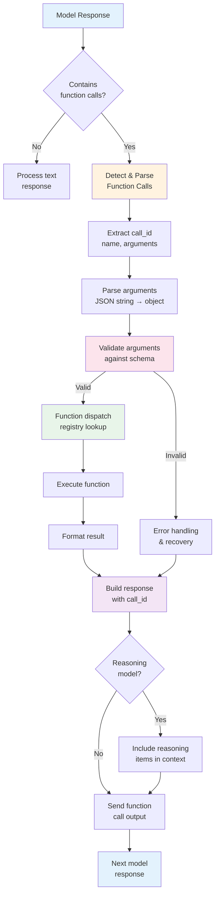

# Handling Function Calls

## Overview

When a model decides to use a function, it doesn't execute anything — it sends back a structured request describing which function to call and what arguments to pass. Your code must detect these requests, parse the arguments, validate them, execute the right function, and return results in the format the model expects. This is the critical bridge between the model's decision-making and your application's actual capabilities.

This lesson covers the complete function call handling pipeline: from detecting that a response contains function calls, through provider-specific parsing, call ID matching, reasoning item management, argument validation, function dispatch, and error recovery. Each provider (OpenAI, Anthropic, Google Gemini) structures function call responses differently, and handling these differences correctly is essential for building reliable, multi-provider applications.

## Learning objectives

After completing this lesson, you will be able to:

- Detect function calls in model responses across OpenAI, Anthropic, and Gemini
- Parse provider-specific response structures and extract call metadata
- Handle JSON string arguments (OpenAI) vs. object arguments (Anthropic, Gemini)
- Match call IDs correctly when returning function results to the model
- Preserve reasoning items for GPT-5 and o-series models during multi-turn tool use
- Validate function arguments against schemas before execution
- Build function dispatch systems using the registry pattern
- Implement robust error handling for parsing failures and unknown functions

## Lesson contents

| # | Topic | Description |
|---|-------|-------------|
| 01 | [Detecting Function Calls](./01-detecting-function-calls.md) | Identify function call responses across OpenAI, Anthropic, and Gemini |
| 02 | [Provider Response Structures](./02-provider-response-structures.md) | Compare `call_id`/`name`/`arguments` formats across providers |
| 03 | [Parsing Arguments](./03-parsing-arguments.md) | JSON string parsing, object arguments, malformed JSON recovery |
| 04 | [Call ID Matching](./04-call-id-matching.md) | Unique IDs, correct referencing, parallel call ordering |
| 05 | [Reasoning Items](./05-reasoning-items.md) | GPT-5/o-series reasoning context preservation in tool use |
| 06 | [Argument Validation](./06-argument-validation.md) | Schema validation, type checking, strict mode guarantees |
| 07 | [Function Dispatch](./07-function-dispatch.md) | Registry pattern, dynamic dispatch, handler mapping |
| 08 | [Error Handling](./08-error-handling.md) | Parse errors, unknown functions, validation failures, retry strategies |

## How it all fits together

## The function call handling pipeline

The model's response is just the beginning. Here's what happens after the model decides to call a function:

1. **Detection** — Your code checks whether the response contains function calls (the structure varies by provider)
2. **Parsing** — You extract the function name and arguments from the provider-specific format
3. **Validation** — You verify the arguments match your expected schema before executing anything
4. **Dispatch** — You route the call to the correct function implementation
5. **Execution** — The function runs and produces a result
6. **Response** — You send the result back to the model with the correct call ID
7. **Context** — For reasoning models, you also preserve reasoning items for continuity

Each of these steps can fail, and each provider handles them differently. The sub-lessons in this folder cover each step in depth with working code examples across all three major providers.

## Provider comparison at a glance

| Aspect | OpenAI (Responses API) | Anthropic | Google Gemini |
|--------|----------------------|-----------|---------------|
| Function call type | `type: "function_call"` in output | `tool_use` content block | `function_call` in parts |
| Call ID field | `call_id` | `id` | — (no explicit ID) |
| Arguments format | JSON **string** | Python **object** | Python **object** |
| Result format | `function_call_output` item | `tool_result` content block | `function_response` part |
| Parallel calls | Multiple items in `output` | Multiple `tool_use` blocks | Multiple `function_call` parts |
| Reasoning items | Must pass back for GPT-5/o-series | — | Thought signatures for Gemini 3 |
| Strict mode | Schema validation guaranteed | `strict: true` supported | — |

> **🤖 AI Context:** Understanding provider differences isn't just academic — production applications often need to support multiple providers for fallback, cost optimization, or feature access. A unified handling layer saves significant maintenance effort.

---

**Next:** [Detecting Function Calls](./01-detecting-function-calls.md) — Learn to identify when the model wants to call a function

---

[← Previous: Property Descriptions](../03-json-schema-for-parameters/10-property-descriptions.md) | [Next: Detecting Function Calls →](./01-detecting-function-calls.md)

<!-- 
Sources Consulted:
- OpenAI Function Calling: https://platform.openai.com/docs/guides/function-calling
- OpenAI Responses API Reference: https://platform.openai.com/docs/api-reference/responses
- OpenAI Reasoning Models: https://platform.openai.com/docs/guides/reasoning
- Anthropic Tool Use: https://platform.claude.com/docs/en/docs/build-with-claude/tool-use
- Google Gemini Function Calling: https://ai.google.dev/gemini-api/docs/function-calling
-->
