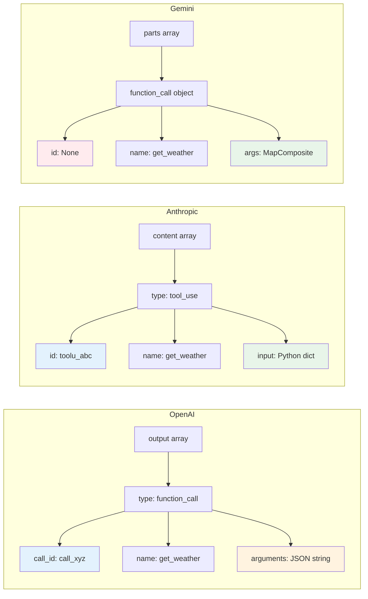

# Provider Response Structures

## Introduction

When a model decides to call a function, each provider wraps the call metadata in a different structure. OpenAI returns a `call_id`, `name`, and `arguments` as a JSON string. Anthropic returns an `id`, `name`, and `input` as a Python object. Gemini returns a `name` and `args` as an object with no explicit call ID. These differences aren't cosmetic — they affect how you parse arguments, match results, and build multi-turn conversations.

This lesson provides a field-by-field comparison of function call response structures across all three providers, with complete examples showing the raw response data and how to extract each field.

### What we'll cover

- OpenAI function call output structure (Responses API)
- Anthropic tool_use content block structure
- Gemini function_call part structure
- Field-by-field comparison table
- Building a normalized data model

### Prerequisites

- Detecting function calls ([Lesson 01](./01-detecting-function-calls.md))
- JSON Schema for parameters ([Lesson 03](../03-json-schema-for-parameters/00-json-schema-for-parameters.md))

---

## OpenAI response structure

The Responses API returns function calls as items in the `output` array with `type: "function_call"`. Each item contains four key fields.

### Raw response example

```python
# What the API actually returns (simplified)
{
    "id": "resp_67ccd2bed1ec8190b14f964abc054267",
    "object": "response",
    "status": "completed",
    "output": [
        {
            "type": "function_call",
            "id": "fc_12345xyz",
            "call_id": "call_12345xyz",
            "name": "get_weather",
            "arguments": "{\"location\":\"Paris, France\",\"units\":\"celsius\"}"
        }
    ]
}
```

### Field breakdown

| Field | Type | Description |
|-------|------|-------------|
| `type` | string | Always `"function_call"` for function call items |
| `id` | string | Unique identifier for this output item (internal) |
| `call_id` | string | The ID you must reference when sending results back |
| `name` | string | The function name the model wants to call |
| `arguments` | string | JSON-encoded string of the function arguments |

### Accessing fields with the Python SDK

```python
from openai import OpenAI
import json

client = OpenAI()

response = client.responses.create(
    model="gpt-4.1",
    input=[{"role": "user", "content": "What's the weather in Paris?"}],
    tools=[{
        "type": "function",
        "name": "get_weather",
        "description": "Get current weather for a location.",
        "parameters": {
            "type": "object",
            "properties": {
                "location": {"type": "string"},
                "units": {"type": "string", "enum": ["celsius", "fahrenheit"]}
            },
            "required": ["location", "units"],
            "additionalProperties": False
        },
        "strict": True
    }],
)

for item in response.output:
    if item.type == "function_call":
        # Fields available on the item object
        print(f"Item ID:     {item.id}")          # fc_12345xyz
        print(f"Call ID:     {item.call_id}")      # call_12345xyz
        print(f"Name:        {item.name}")         # get_weather
        print(f"Arguments:   {item.arguments}")    # JSON string
        print(f"Args type:   {type(item.arguments).__name__}")  # str
        
        # Parse the JSON string to get a dict
        args = json.loads(item.arguments)
        print(f"Parsed args: {args}")              # {'location': 'Paris, France', 'units': 'celsius'}
```

**Output:**
```
Item ID:     fc_12345xyz
Call ID:     call_12345xyz
Name:        get_weather
Arguments:   {"location":"Paris, France","units":"celsius"}
Args type:   str
Parsed args: {'location': 'Paris, France', 'units': 'celsius'}
```

> **🔑 Key concept:** OpenAI returns arguments as a **JSON string**, not a Python dict. You must call `json.loads()` to parse them. This is the most common source of bugs when developers switch from Anthropic or Gemini to OpenAI.

### Sending results back

OpenAI expects a `function_call_output` item referencing the `call_id`:

```python
# After executing your function
result = get_weather(location="Paris, France", units="celsius")

# Build the result item
function_result = {
    "type": "function_call_output",
    "call_id": item.call_id,        # Must match the original call_id
    "output": json.dumps(result),    # String output
}
```

---

## Anthropic response structure

Anthropic returns function calls as `tool_use` content blocks within the response's `content` array. The key difference: arguments arrive as a Python object, not a JSON string.

### Raw response example

```python
# What the API actually returns (simplified)
{
    "id": "msg_01XFDUDYJgAACzvnptvVoYEL",
    "type": "message",
    "role": "assistant",
    "stop_reason": "tool_use",
    "content": [
        {
            "type": "text",
            "text": "I'll check the weather in Paris for you."
        },
        {
            "type": "tool_use",
            "id": "toolu_01A09q90qw90lq917835lq9",
            "name": "get_weather",
            "input": {
                "location": "Paris, France",
                "units": "celsius"
            }
        }
    ]
}
```

### Field breakdown

| Field | Type | Description |
|-------|------|-------------|
| `type` | string | Always `"tool_use"` for tool use blocks |
| `id` | string | The ID you must reference when sending results back |
| `name` | string | The function name Claude wants to call |
| `input` | object | The function arguments as a **Python dict** — already parsed |

### Accessing fields with the Python SDK

```python
import anthropic

client = anthropic.Anthropic()

response = client.messages.create(
    model="claude-sonnet-4-20250514",
    max_tokens=1024,
    tools=[{
        "name": "get_weather",
        "description": "Get current weather for a location.",
        "input_schema": {
            "type": "object",
            "properties": {
                "location": {"type": "string"},
                "units": {"type": "string", "enum": ["celsius", "fahrenheit"]}
            },
            "required": ["location", "units"]
        }
    }],
    messages=[{"role": "user", "content": "What's the weather in Paris?"}],
)

for block in response.content:
    if block.type == "tool_use":
        # Fields available on the block object
        print(f"Block ID:    {block.id}")           # toolu_01A09q...
        print(f"Name:        {block.name}")         # get_weather
        print(f"Input:       {block.input}")        # Already a dict!
        print(f"Input type:  {type(block.input).__name__}")  # dict
        
        # No JSON parsing needed — input is already a Python dict
        location = block.input["location"]
        units = block.input["units"]
        print(f"Location:    {location}")
        print(f"Units:       {units}")
```

**Output:**
```
Block ID:    toolu_01A09q90qw90lq917835lq9
Name:        get_weather
Input:       {'location': 'Paris, France', 'units': 'celsius'}
Input type:  dict
Location:    Paris, France
Units:       celsius
```

> **🔑 Key concept:** Anthropic returns `input` as a **Python dict** — no JSON parsing required. This is the opposite of OpenAI's behavior and a common source of confusion when switching providers.

### Sending results back

Anthropic expects a `tool_result` content block in a `user` message:

```python
# After executing your function
result = get_weather(location="Paris, France", units="celsius")

# Build the result message
tool_result_message = {
    "role": "user",
    "content": [
        {
            "type": "tool_result",
            "tool_use_id": block.id,        # Must match the tool_use id
            "content": json.dumps(result),   # String content
        }
    ]
}
```

> **Note:** Anthropic uses `tool_use_id` in the result block, not `id`. The field name changes between the request (from Claude) and the response (to Claude).

---

## Google Gemini response structure

Gemini returns function calls as `function_call` objects within response parts. Arguments arrive as a Python dict-like object, and there's no explicit call ID.

### Raw response example

```python
# What the API returns (SDK representation)
# response.candidates[0].content.parts:
[
    Part(
        function_call=FunctionCall(
            id=None,
            name="get_weather",
            args={"location": "Paris, France", "units": "celsius"}
        )
    )
]
```

### Field breakdown

| Field | Type | Description |
|-------|------|-------------|
| `name` | string | The function name the model wants to call |
| `args` | MapComposite | Dict-like object containing function arguments |
| `id` | None | Gemini does not provide explicit call IDs |

### Accessing fields with the Python SDK

```python
from google import genai
from google.genai import types

client = genai.Client()

tools = types.Tool(function_declarations=[{
    "name": "get_weather",
    "description": "Get current weather for a location.",
    "parameters": {
        "type": "object",
        "properties": {
            "location": {"type": "string"},
            "units": {"type": "string", "enum": ["celsius", "fahrenheit"]}
        },
        "required": ["location", "units"],
    }
}])

response = client.models.generate_content(
    model="gemini-2.5-flash",
    contents="What's the weather in Paris?",
    config=types.GenerateContentConfig(tools=[tools]),
)

# Using SDK convenience property
if response.function_calls:
    for call in response.function_calls:
        print(f"Name:        {call.name}")          # get_weather
        print(f"Args:        {call.args}")           # Dict-like object
        print(f"Args type:   {type(call.args).__name__}")  # MapComposite
        
        # Convert to regular dict if needed
        args_dict = dict(call.args)
        print(f"As dict:     {args_dict}")

# Using manual part inspection
part = response.candidates[0].content.parts[0]
if part.function_call:
    fc = part.function_call
    print(f"Name:        {fc.name}")
    print(f"Args:        {fc.args}")
```

**Output:**
```
Name:        get_weather
Args:        {'location': 'Paris, France', 'units': 'celsius'}
Args type:   MapComposite
As dict:     {'location': 'Paris, France', 'units': 'celsius'}
```

> **🔑 Key concept:** Gemini's `args` is a `MapComposite` object that behaves like a dict but isn't one. Use `dict(call.args)` for a standard Python dict. Also note: **no call ID** — results are matched by function name and position.

### Sending results back

Gemini expects a `function_response` part appended to the conversation:

```python
# After executing your function
result = get_weather(location="Paris, France", units="celsius")

# Build the response part
function_response_part = types.Part.from_function_response(
    name=call.name,               # Match by function name
    response={"result": result},  # Wrap in a dict
)

# Append to conversation contents
contents.append(response.candidates[0].content)
contents.append(types.Content(role="user", parts=[function_response_part]))
```

---

## Field-by-field comparison

| Aspect | OpenAI (Responses API) | Anthropic | Google Gemini |
|--------|----------------------|-----------|---------------|
| **Container** | `output` array item | `content` block | `parts` element |
| **Type indicator** | `type: "function_call"` | `type: "tool_use"` | `part.function_call` exists |
| **Call ID** | `call_id` (string) | `id` (string) | None (match by name/position) |
| **Function name** | `name` (string) | `name` (string) | `name` (string) |
| **Arguments** | `arguments` (JSON **string**) | `input` (Python **dict**) | `args` (MapComposite **object**) |
| **Needs JSON parse** | ✅ Yes | ❌ No | ❌ No |
| **Result reference** | `call_id` in `function_call_output` | `tool_use_id` in `tool_result` | `name` in `function_response` |
| **Result container** | Input item | `user` message content block | `user` content part |
| **Text alongside calls** | Separate `message` item | Mixed in same `content` array | Separate `text` part |



---

## Building a normalized data model

To work across providers without littering your code with provider checks, normalize function call data into a single structure:

```python
from dataclasses import dataclass, field
from typing import Any
import json


@dataclass
class NormalizedFunctionCall:
    """Provider-agnostic function call representation."""
    provider: str
    name: str
    call_id: str
    arguments: dict          # Always a Python dict
    raw_response: Any = field(repr=False, default=None)
    
    @classmethod
    def from_openai(cls, item) -> "NormalizedFunctionCall":
        """Create from an OpenAI Responses API function_call item."""
        return cls(
            provider="openai",
            name=item.name,
            call_id=item.call_id,
            arguments=json.loads(item.arguments),
            raw_response=item,
        )
    
    @classmethod
    def from_anthropic(cls, block) -> "NormalizedFunctionCall":
        """Create from an Anthropic tool_use content block."""
        return cls(
            provider="anthropic",
            name=block.name,
            call_id=block.id,
            arguments=block.input,  # Already a dict
            raw_response=block,
        )
    
    @classmethod
    def from_gemini(cls, call, index: int = 0) -> "NormalizedFunctionCall":
        """Create from a Gemini function_call part."""
        return cls(
            provider="gemini",
            name=call.name,
            call_id=f"gemini_{index}",  # Synthetic ID
            arguments=dict(call.args) if call.args else {},
            raw_response=call,
        )


# Usage — arguments are always a dict regardless of provider
call = NormalizedFunctionCall.from_openai(openai_item)
print(call.arguments["location"])   # No JSON parsing needed

call = NormalizedFunctionCall.from_anthropic(anthropic_block)
print(call.arguments["location"])   # Same access pattern

call = NormalizedFunctionCall.from_gemini(gemini_call, index=0)
print(call.arguments["location"])   # Same access pattern
```

**Output:**
```
Paris, France
Paris, France
Paris, France
```

> **🤖 AI Context:** This normalization pattern is the foundation of multi-provider AI applications. Libraries like LiteLLM and LangChain implement similar abstractions internally. Understanding the raw structures helps you debug issues that abstraction layers can hide.

---

## Best practices

| Practice | Why it matters |
|----------|---------------|
| Normalize arguments to dicts early | Downstream code shouldn't care whether args started as a JSON string or object |
| Preserve the raw response | You may need provider-specific fields for error handling or debugging |
| Use class methods for construction | `from_openai()`, `from_anthropic()` make the conversion explicit and testable |
| Generate synthetic IDs for Gemini | Consistent ID handling simplifies result matching logic |
| Always use `call_id`, not `id`, for OpenAI results | `id` is the internal item ID; `call_id` is what you send back |

---

## Common pitfalls

| ❌ Mistake | ✅ Solution |
|-----------|-------------|
| Using `json.loads()` on Anthropic's `input` | `input` is already a dict — calling `json.loads()` on it raises `TypeError` |
| Referencing OpenAI's `id` instead of `call_id` | The result must use `call_id`, not the item `id` |
| Treating Gemini's `MapComposite` as a regular dict | Use `dict(call.args)` for a standard Python dict |
| Assuming arguments are always a dict | OpenAI returns a string — always check the provider before accessing args |
| Using Anthropic's `id` field name in the result | The result block uses `tool_use_id`, not `id` |

---

## Hands-on exercise

### Your task

Create a `normalize_calls` function that takes a provider name and a raw response, and returns a list of `NormalizedFunctionCall` objects with consistent dict arguments regardless of provider.

### Requirements

1. Handle all three providers: `"openai"`, `"anthropic"`, `"gemini"`
2. Arguments must always be a Python `dict` — parse JSON strings where needed
3. Generate synthetic call IDs for Gemini (`"gemini_0"`, `"gemini_1"`, etc.)
4. Include the provider name in each normalized object
5. Handle empty responses (no function calls) gracefully

### Expected result

```python
calls = normalize_calls("openai", mock_response)
for call in calls:
    print(f"[{call.provider}] {call.name}({call.arguments}) id={call.call_id}")

# [openai] get_weather({'location': 'Paris'}) id=call_123
```

<details>
<summary>💡 Hints (click to expand)</summary>

- Use the `NormalizedFunctionCall` dataclass with `@classmethod` constructors
- For OpenAI, wrap `json.loads()` in a try/except for safety
- Gemini's `call.args` might be `None` for no-argument functions

</details>

<details>
<summary>✅ Solution (click to expand)</summary>

```python
from dataclasses import dataclass, field
from typing import Any
from types import SimpleNamespace
import json


@dataclass
class NormalizedFunctionCall:
    provider: str
    name: str
    call_id: str
    arguments: dict
    raw_response: Any = field(repr=False, default=None)


def normalize_calls(provider: str, response) -> list[NormalizedFunctionCall]:
    """Normalize function calls from any provider into a consistent format."""
    calls = []

    if provider == "openai":
        for item in response.output:
            if getattr(item, "type", None) == "function_call":
                try:
                    args = json.loads(item.arguments)
                except (json.JSONDecodeError, TypeError):
                    args = {}
                calls.append(NormalizedFunctionCall(
                    provider="openai",
                    name=item.name,
                    call_id=item.call_id,
                    arguments=args,
                    raw_response=item,
                ))

    elif provider == "anthropic":
        for block in response.content:
            if getattr(block, "type", None) == "tool_use":
                calls.append(NormalizedFunctionCall(
                    provider="anthropic",
                    name=block.name,
                    call_id=block.id,
                    arguments=block.input if isinstance(block.input, dict) else {},
                    raw_response=block,
                ))

    elif provider == "gemini":
        if getattr(response, "function_calls", None):
            for idx, call in enumerate(response.function_calls):
                args = dict(call.args) if call.args else {}
                calls.append(NormalizedFunctionCall(
                    provider="gemini",
                    name=call.name,
                    call_id=f"gemini_{idx}",
                    arguments=args,
                    raw_response=call,
                ))

    return calls


# Test with mock data
mock_openai = SimpleNamespace(output=[
    SimpleNamespace(type="function_call", name="get_weather",
                    call_id="call_123", arguments='{"location": "Paris"}'),
])

mock_anthropic = SimpleNamespace(content=[
    SimpleNamespace(type="tool_use", id="toolu_abc",
                    name="get_weather", input={"location": "Paris"}),
])

mock_gemini = SimpleNamespace(function_calls=[
    SimpleNamespace(name="get_weather", args={"location": "Paris"}),
])

for provider, mock in [("openai", mock_openai), ("anthropic", mock_anthropic), ("gemini", mock_gemini)]:
    result = normalize_calls(provider, mock)
    for call in result:
        print(f"[{call.provider}] {call.name}({call.arguments}) id={call.call_id}")
```

**Output:**
```
[openai] get_weather({'location': 'Paris'}) id=call_123
[anthropic] get_weather({'location': 'Paris'}) id=toolu_abc
[gemini] get_weather({'location': 'Paris'}) id=gemini_0
```

</details>

### Bonus challenges

- [ ] Add a `build_result()` method to `NormalizedFunctionCall` that generates the correct provider-specific result format
- [ ] Handle OpenAI Chat Completions (legacy) format as a fourth provider variant
- [ ] Add type hints for all method signatures

---

## Summary

✅ OpenAI returns arguments as a **JSON string** in `call_id`/`name`/`arguments` — always parse with `json.loads()`

✅ Anthropic returns arguments as a **Python dict** in `id`/`name`/`input` — no parsing needed, but use `tool_use_id` (not `id`) when sending results

✅ Gemini returns arguments as a **MapComposite object** in `name`/`args` with **no call ID** — convert to dict with `dict(call.args)` and match results by name/position

✅ Normalizing all providers into a single data model with dict arguments simplifies downstream code significantly

✅ Always preserve the raw response for debugging — abstraction helps but shouldn't hide the data

**Next:** [Parsing Arguments](./03-parsing-arguments.md) — JSON string parsing, malformed JSON recovery, and type coercion

---

[← Previous: Detecting Function Calls](./01-detecting-function-calls.md) | [Next: Parsing Arguments →](./03-parsing-arguments.md)

<!-- 
Sources Consulted:
- OpenAI Function Calling: https://platform.openai.com/docs/guides/function-calling
- OpenAI Responses API Reference: https://platform.openai.com/docs/api-reference/responses
- Anthropic Tool Use: https://platform.claude.com/docs/en/docs/build-with-claude/tool-use
- Google Gemini Function Calling: https://ai.google.dev/gemini-api/docs/function-calling
-->
