# Parsing Function Arguments

## Introduction

After detecting a function call in the model's response, the next step is extracting the function name and parsing the arguments into a usable format. This sounds straightforward, but each provider handles arguments differently — OpenAI sends a JSON string that must be parsed, Anthropic and Gemini send objects that are already parsed. And even with strict mode enabled, edge cases arise: malformed JSON from non-strict calls, unexpected types, missing fields, and values that need coercion before your function can accept them.

This lesson covers the full argument parsing pipeline: name extraction, JSON parsing for OpenAI, direct object access for Anthropic and Gemini, handling malformed JSON gracefully, and type coercion strategies.

### What we'll cover

- Extracting the function name from each provider
- Parsing JSON string arguments (OpenAI)
- Working with object arguments (Anthropic, Gemini)
- Handling malformed JSON from non-strict mode
- Type coercion and conversion
- Building a robust argument parser

### Prerequisites

- Provider response structures ([Lesson 02](./02-provider-response-structures.md))
- JSON Schema for parameters ([Lesson 03](../03-json-schema-for-parameters/00-json-schema-for-parameters.md))

---

## Extracting the function name

The function name tells you which function to execute. All three providers provide it as a plain string, but the access path differs.

```python
# OpenAI Responses API
name = item.name                    # "get_weather"

# Anthropic
name = block.name                   # "get_weather"

# Gemini
name = call.name                    # "get_weather"

# OpenAI Chat Completions (legacy)
name = tool_call.function.name      # "get_weather"
```

### Name validation

Always validate the function name before proceeding. The model might hallucinate a function name that doesn't exist in your registry:

```python
AVAILABLE_FUNCTIONS = {
    "get_weather": get_weather,
    "send_email": send_email,
    "search_products": search_products,
}

def validate_function_name(name: str) -> bool:
    """Check if the function name exists in our registry."""
    if name not in AVAILABLE_FUNCTIONS:
        print(f"Unknown function: {name}")
        return False
    return True


# Usage
for item in response.output:
    if item.type == "function_call":
        if not validate_function_name(item.name):
            continue  # Skip unknown functions
        # Proceed with argument parsing...
```

**Output:**
```
Unknown function: calculate_tip
```

---

## JSON argument parsing (OpenAI)

OpenAI returns function arguments as a JSON string. This is the most error-prone step in the pipeline because string-to-dict conversion can fail.

### Basic parsing

```python
import json

def parse_openai_arguments(arguments_str: str) -> dict:
    """Parse OpenAI's JSON string arguments into a Python dict."""
    return json.loads(arguments_str)


# Example
raw = '{"location":"Paris, France","units":"celsius"}'
args = parse_openai_arguments(raw)
print(args)
print(type(args))
```

**Output:**
```
{'location': 'Paris, France', 'units': 'celsius'}
<class 'dict'>
```

### Why OpenAI uses a JSON string

OpenAI serializes arguments as a JSON string for several reasons:

1. **Streaming compatibility** — Arguments arrive token by token as a string, then you parse the complete string
2. **Type preservation** — JSON strings preserve exact numeric precision and escape sequences
3. **Schema enforcement** — With strict mode, the string is guaranteed to be valid JSON matching your schema
4. **Backward compatibility** — The format dates back to the original function calling API

### Safe parsing with error handling

```python
def parse_arguments_safely(arguments_str: str) -> dict | None:
    """Parse JSON arguments with error handling."""
    if not arguments_str:
        return {}
    
    try:
        parsed = json.loads(arguments_str)
        if not isinstance(parsed, dict):
            print(f"Expected dict, got {type(parsed).__name__}")
            return None
        return parsed
    except json.JSONDecodeError as e:
        print(f"JSON parse error: {e}")
        return None


# Test cases
print(parse_arguments_safely('{"location": "Paris"}'))
print(parse_arguments_safely(''))
print(parse_arguments_safely('not valid json'))
print(parse_arguments_safely('["array", "not", "dict"]'))
```

**Output:**
```
{'location': 'Paris'}
{}
JSON parse error: Expecting value: line 1 column 1 (char 0)
Expected dict, got list
```

---

## Object arguments (Anthropic, Gemini)

Anthropic and Gemini return arguments as objects — no JSON parsing needed. But each has quirks.

### Anthropic — direct dict access

```python
# block.input is already a Python dict
args = block.input
location = args["location"]       # Direct key access
units = args.get("units", "celsius")  # Safe access with default
```

### Gemini — MapComposite conversion

```python
# call.args is a MapComposite, not a regular dict
args = call.args

# Direct access works for simple values
location = args["location"]

# But for safety, convert to a regular dict
args_dict = dict(args)

# Nested objects may need recursive conversion
def to_dict(obj) -> dict:
    """Recursively convert MapComposite to regular dict."""
    if hasattr(obj, "items"):
        return {k: to_dict(v) for k, v in obj.items()}
    if isinstance(obj, (list, tuple)):
        return [to_dict(item) for item in obj]
    return obj


args_dict = to_dict(call.args)
print(args_dict)
```

**Output:**
```
{'location': 'Paris, France', 'units': 'celsius'}
```

### Unified argument extraction

```python
import json
from typing import Any


def extract_arguments(provider: str, raw_args: Any) -> dict:
    """Extract arguments as a Python dict from any provider format."""
    if provider == "openai":
        # OpenAI: JSON string → dict
        if isinstance(raw_args, str):
            return json.loads(raw_args)
        return raw_args  # Already parsed by SDK in some cases
    
    elif provider == "anthropic":
        # Anthropic: already a dict
        if isinstance(raw_args, dict):
            return raw_args
        return dict(raw_args)
    
    elif provider == "gemini":
        # Gemini: MapComposite → dict
        if raw_args is None:
            return {}
        return dict(raw_args)
    
    raise ValueError(f"Unknown provider: {provider}")


# All three produce the same result
print(extract_arguments("openai", '{"location": "Paris"}'))
print(extract_arguments("anthropic", {"location": "Paris"}))
print(extract_arguments("gemini", {"location": "Paris"}))
```

**Output:**
```
{'location': 'Paris'}
{'location': 'Paris'}
{'location': 'Paris'}
```

---

## Handling malformed JSON

When strict mode is disabled (or when using older models), OpenAI might return malformed JSON. Common issues include:

### Common malformation patterns

```python
# 1. Trailing comma (most common)
'{"location": "Paris", "units": "celsius",}'

# 2. Single quotes instead of double quotes
"{'location': 'Paris'}"

# 3. Unquoted keys
'{location: "Paris"}'

# 4. Truncated JSON (hit token limit)
'{"location": "Paris", "units": "cel'

# 5. Extra text around JSON
'Here is the data: {"location": "Paris"}'

# 6. Escaped unicode issues
'{"location": "Bogot\\u00e1"}'
```

### Recovery strategies

```python
import json
import re


def parse_with_recovery(raw: str) -> dict | None:
    """Try multiple strategies to parse potentially malformed JSON."""
    
    # Strategy 1: Direct parse (works for well-formed JSON)
    try:
        return json.loads(raw)
    except json.JSONDecodeError:
        pass
    
    # Strategy 2: Strip trailing commas
    cleaned = re.sub(r",\s*([}\]])", r"\1", raw)
    try:
        return json.loads(cleaned)
    except json.JSONDecodeError:
        pass
    
    # Strategy 3: Extract JSON from surrounding text
    json_match = re.search(r"\{[^{}]*\}", raw)
    if json_match:
        try:
            return json.loads(json_match.group())
        except json.JSONDecodeError:
            pass
    
    # Strategy 4: Fix single quotes (risky — may break strings with apostrophes)
    if "'" in raw and '"' not in raw:
        fixed = raw.replace("'", '"')
        try:
            return json.loads(fixed)
        except json.JSONDecodeError:
            pass
    
    # All strategies failed
    return None


# Test recovery strategies
test_cases = [
    '{"location": "Paris", "units": "celsius",}',       # Trailing comma
    '{"location": "Paris"}',                              # Valid JSON
    'The arguments are: {"location": "Paris"}',           # Extra text
]

for case in test_cases:
    result = parse_with_recovery(case)
    print(f"Input:  {case}")
    print(f"Result: {result}\n")
```

**Output:**
```
Input:  {"location": "Paris", "units": "celsius",}
Result: {'location': 'Paris', 'units': 'celsius'}

Input:  {"location": "Paris"}
Result: {'location': 'Paris'}

Input:  The arguments are: {"location": "Paris"}
Result: {'location': 'Paris'}
```

> **Warning:** Recovery strategies are a fallback — they can introduce bugs in edge cases. The best solution is to enable strict mode, which guarantees valid JSON matching your schema.

### When to use recovery vs. when to reject

```mermaid
flowchart TD
    A[Receive arguments] --> B{Strict mode<br/>enabled?}
    B -->|Yes| C[json.loads — always works]
    B -->|No| D[Try json.loads]
    D -->|Success| E[Use parsed args]
    D -->|Failure| F{Critical<br/>function?}
    F -->|Yes| G[Return error<br/>to model]
    F -->|No| H[Try recovery<br/>strategies]
    H -->|Success| E
    H -->|Failure| G
    
    style C fill:#c8e6c9
    style E fill:#c8e6c9
    style G fill:#ffcdd2
```



---

## Type coercion

Even when JSON is valid, the values might not match the types your function expects. The model might send `"42"` (string) when your function expects `42` (int), or `"true"` (string) when you expect `True` (bool).

### Common type mismatches

```python
# Model sends:                  # Your function expects:
{"count": "5"}                 # count: int
{"price": "29.99"}             # price: float  
{"active": "true"}             # active: bool
{"tags": "python,ai"}          # tags: list[str]
{"date": "2025-01-15"}         # date: datetime
```

### Type coercion function

```python
from datetime import datetime, date
from typing import Any, get_type_hints


def coerce_value(value: Any, target_type: type) -> Any:
    """Coerce a value to the target type."""
    if isinstance(value, target_type):
        return value  # Already correct type
    
    if target_type == int:
        return int(value)
    
    if target_type == float:
        return float(value)
    
    if target_type == bool:
        if isinstance(value, str):
            return value.lower() in ("true", "1", "yes")
        return bool(value)
    
    if target_type == str:
        return str(value)
    
    if target_type == list:
        if isinstance(value, str):
            return [item.strip() for item in value.split(",")]
        return list(value)
    
    # Can't coerce — return as-is
    return value


# Examples
print(coerce_value("42", int))           # 42
print(coerce_value("29.99", float))      # 29.99
print(coerce_value("true", bool))        # True
print(coerce_value("python,ai", list))   # ['python', 'ai']
```

**Output:**
```
42
29.99
True
['python', 'ai']
```

### Schema-aware coercion

For production systems, coerce based on the function's JSON Schema:

```python
def coerce_arguments(args: dict, schema: dict) -> dict:
    """Coerce argument values based on the JSON Schema definition."""
    properties = schema.get("properties", {})
    coerced = {}
    
    for key, value in args.items():
        if key in properties:
            prop_schema = properties[key]
            prop_type = prop_schema.get("type")
            
            type_map = {
                "integer": int,
                "number": float,
                "boolean": bool,
                "string": str,
            }
            
            if prop_type in type_map:
                try:
                    coerced[key] = coerce_value(value, type_map[prop_type])
                except (ValueError, TypeError):
                    coerced[key] = value  # Keep original on failure
            else:
                coerced[key] = value
        else:
            coerced[key] = value
    
    return coerced


# Example usage
schema = {
    "properties": {
        "location": {"type": "string"},
        "count": {"type": "integer"},
        "verbose": {"type": "boolean"},
    }
}

raw_args = {"location": "Paris", "count": "5", "verbose": "true"}
fixed_args = coerce_arguments(raw_args, schema)
print(fixed_args)
```

**Output:**
```
{'location': 'Paris', 'count': 5, 'verbose': True}
```

> **Tip:** With strict mode enabled on OpenAI, type coercion is rarely needed — the model is constrained to produce correctly typed values. Coercion is most useful as a safety net for non-strict calls or when working with models that occasionally produce string-wrapped numbers.

---

## Building a robust argument parser

Here's a complete parser that handles all providers, malformed JSON, and type coercion:

```python
import json
import re
from dataclasses import dataclass
from typing import Any


@dataclass
class ParsedArguments:
    """Result of argument parsing."""
    arguments: dict
    was_recovered: bool = False   # True if recovery strategies were used
    parse_error: str | None = None


def parse_arguments(
    provider: str,
    raw_args: Any,
    schema: dict | None = None,
    strict_mode: bool = True,
) -> ParsedArguments:
    """Parse function arguments from any provider with full error handling."""
    
    # Step 1: Extract dict from provider-specific format
    if provider == "openai" and isinstance(raw_args, str):
        try:
            args = json.loads(raw_args)
        except json.JSONDecodeError as e:
            if strict_mode:
                return ParsedArguments(
                    arguments={},
                    parse_error=f"JSON parse error (strict mode): {e}",
                )
            # Try recovery
            args = parse_with_recovery(raw_args)
            if args is None:
                return ParsedArguments(
                    arguments={},
                    parse_error=f"JSON recovery failed: {e}",
                )
            return ParsedArguments(arguments=args, was_recovered=True)
    elif isinstance(raw_args, dict):
        args = raw_args
    elif raw_args is None:
        args = {}
    else:
        args = dict(raw_args)  # MapComposite, etc.
    
    # Step 2: Type coercion (if schema provided)
    if schema and not strict_mode:
        args = coerce_arguments(args, schema)
    
    return ParsedArguments(arguments=args)


# Usage
result = parse_arguments("openai", '{"location": "Paris", "count": "5"}',
                         schema={"properties": {"count": {"type": "integer"}}},
                         strict_mode=False)

print(f"Arguments: {result.arguments}")
print(f"Recovered: {result.was_recovered}")
print(f"Error:     {result.parse_error}")
```

**Output:**
```
Arguments: {'location': 'Paris', 'count': 5}
Recovered: False
Error:     None
```

---

## Best practices

| Practice | Why it matters |
|----------|---------------|
| Enable strict mode whenever possible | Eliminates most parsing issues by guaranteeing valid JSON |
| Always wrap `json.loads()` in try/except | Even strict mode can't prevent every edge case |
| Validate function names before parsing args | Don't waste time parsing arguments for unknown functions |
| Use schema-aware coercion, not blind casting | Coercing `"Paris"` to `int` would crash — schema tells you it's a string |
| Log parse failures with the raw input | Essential for debugging why a function call failed |

---

## Common pitfalls

| ❌ Mistake | ✅ Solution |
|-----------|-------------|
| Calling `json.loads()` on Anthropic's `input` | It's already a dict — this raises `TypeError` |
| Not handling empty argument strings | `json.loads("")` raises `JSONDecodeError` — check first |
| Aggressive type coercion in strict mode | Strict mode guarantees types — coercion is unnecessary and may introduce bugs |
| Ignoring `was_recovered` flag | If recovery was used, the parsed args may not be exactly what the model intended |
| Assuming all values are strings | OpenAI with strict mode sends proper `int`, `float`, `bool` in JSON |

---

## Hands-on exercise

### Your task

Build a `robust_parse` function that accepts a raw argument string (simulating OpenAI's format), attempts to parse it, and applies type coercion based on a provided schema.

### Requirements

1. Parse valid JSON directly
2. Handle trailing commas, extra whitespace, and surrounding text
3. Apply type coercion based on the schema's `type` field for each property
4. Return a `ParsedArguments` dataclass with `arguments`, `was_recovered`, and `parse_error`
5. Never crash — always return a valid `ParsedArguments`

### Expected result

```python
schema = {"properties": {"temp": {"type": "number"}, "city": {"type": "string"}}}

result = robust_parse('{"temp": "72", "city": "NYC",}', schema)
# ParsedArguments(arguments={'temp': 72.0, 'city': 'NYC'}, was_recovered=True, parse_error=None)
```

<details>
<summary>💡 Hints (click to expand)</summary>

- Chain the recovery strategies: direct parse → strip trailing commas → regex extract
- Set `was_recovered = True` if the first `json.loads()` fails but a later strategy succeeds
- Apply coercion after successful parsing

</details>

<details>
<summary>✅ Solution (click to expand)</summary>

```python
import json
import re
from dataclasses import dataclass
from typing import Any


@dataclass
class ParsedArguments:
    arguments: dict
    was_recovered: bool = False
    parse_error: str | None = None


def coerce_value(value: Any, target_type: str) -> Any:
    """Coerce a value based on JSON Schema type string."""
    type_map = {
        "integer": int,
        "number": float,
        "boolean": lambda v: v.lower() in ("true", "1", "yes") if isinstance(v, str) else bool(v),
        "string": str,
    }
    if target_type in type_map and not isinstance(value, type_map[target_type] if target_type != "boolean" else bool):
        converter = type_map[target_type]
        return converter(value)
    return value


def robust_parse(raw: str, schema: dict | None = None) -> ParsedArguments:
    """Parse arguments with recovery and coercion."""
    if not raw or not raw.strip():
        return ParsedArguments(arguments={})

    recovered = False

    # Strategy 1: Direct parse
    try:
        args = json.loads(raw)
        if isinstance(args, dict):
            if schema:
                for key, prop in schema.get("properties", {}).items():
                    if key in args:
                        try:
                            args[key] = coerce_value(args[key], prop.get("type", ""))
                        except (ValueError, TypeError):
                            pass
            return ParsedArguments(arguments=args, was_recovered=False)
    except json.JSONDecodeError:
        pass

    # Strategy 2: Strip trailing commas
    cleaned = re.sub(r",\s*([}\]])", r"\1", raw)
    try:
        args = json.loads(cleaned)
        if isinstance(args, dict):
            recovered = True
        else:
            args = None
    except json.JSONDecodeError:
        args = None

    # Strategy 3: Extract JSON object from text
    if args is None:
        match = re.search(r"\{[^{}]*\}", raw)
        if match:
            try:
                args = json.loads(match.group())
                recovered = True
            except json.JSONDecodeError:
                args = None

    if args is None:
        return ParsedArguments(
            arguments={},
            parse_error=f"All parse strategies failed for: {raw[:100]}",
        )

    # Apply coercion
    if schema:
        for key, prop in schema.get("properties", {}).items():
            if key in args:
                try:
                    args[key] = coerce_value(args[key], prop.get("type", ""))
                except (ValueError, TypeError):
                    pass

    return ParsedArguments(arguments=args, was_recovered=recovered)


# Test cases
schema = {"properties": {"temp": {"type": "number"}, "city": {"type": "string"}}}

tests = [
    '{"temp": "72", "city": "NYC"}',          # Valid, needs coercion
    '{"temp": "72", "city": "NYC",}',          # Trailing comma
    'Here: {"temp": "72", "city": "NYC"}',     # Extra text
    'completely invalid',                       # Unrecoverable
]

for test in tests:
    result = robust_parse(test, schema)
    print(f"Input:     {test}")
    print(f"Result:    {result}\n")
```

**Output:**
```
Input:     {"temp": "72", "city": "NYC"}
Result:    ParsedArguments(arguments={'temp': 72.0, 'city': 'NYC'}, was_recovered=False, parse_error=None)

Input:     {"temp": "72", "city": "NYC",}
Result:    ParsedArguments(arguments={'temp': 72.0, 'city': 'NYC'}, was_recovered=True, parse_error=None)

Input:     Here: {"temp": "72", "city": "NYC"}
Result:    ParsedArguments(arguments={'temp': 72.0, 'city': 'NYC'}, was_recovered=True, parse_error=None)

Input:     completely invalid
Result:    ParsedArguments(arguments={}, was_recovered=False, parse_error="All parse strategies failed for: completely invalid")
```

</details>

### Bonus challenges

- [ ] Add support for nested object coercion (e.g., `{"address": {"zip": "10001"}}` where zip should be a string)
- [ ] Handle the case where `json.loads` succeeds but returns a list instead of a dict
- [ ] Add logging that records which recovery strategy was used

---

## Summary

✅ OpenAI sends arguments as a **JSON string** — always parse with `json.loads()` and handle `JSONDecodeError`

✅ Anthropic and Gemini send arguments as **objects** — no parsing needed, but convert Gemini's `MapComposite` to a regular dict

✅ Malformed JSON can be recovered using strategies like trailing comma removal, regex extraction, and quote fixing — but strict mode prevents the problem entirely

✅ Type coercion converts string-wrapped values to their correct types based on the JSON Schema — most useful for non-strict mode calls

✅ A robust parser chains direct parsing, recovery strategies, and schema-aware coercion into a reliable pipeline that never crashes

**Next:** [Call ID Matching](./04-call-id-matching.md) — Correctly referencing function calls when returning results

---

[← Previous: Provider Response Structures](./02-provider-response-structures.md) | [Next: Call ID Matching →](./04-call-id-matching.md)

<!-- 
Sources Consulted:
- OpenAI Function Calling: https://platform.openai.com/docs/guides/function-calling
- OpenAI Responses API Reference: https://platform.openai.com/docs/api-reference/responses
- Anthropic Tool Use: https://platform.claude.com/docs/en/docs/build-with-claude/tool-use
- Google Gemini Function Calling: https://ai.google.dev/gemini-api/docs/function-calling
-->
