# Call ID Matching

## Introduction

When a model makes a function call, it assigns a unique identifier to that call. When you send the result back, you must reference that exact identifier so the model knows which call your result belongs to. This matching is especially critical during parallel function calling — when the model makes multiple calls at once, each result must be paired with its correct call ID, and the order matters.

Each provider handles call IDs differently. OpenAI uses `call_id` strings that you reference in `function_call_output` items. Anthropic uses `id` strings that become `tool_use_id` in result blocks. Gemini skips explicit IDs entirely and matches results by function name and position. Understanding these differences is essential for reliable multi-turn function calling conversations.

### What we'll cover

- How call IDs work in the function calling loop
- OpenAI call ID format and matching
- Anthropic tool use ID format and matching
- Gemini's position-based matching
- Parallel call ordering requirements
- Building a call ID tracking system

### Prerequisites

- Detecting function calls ([Lesson 01](./01-detecting-function-calls.md))
- Provider response structures ([Lesson 02](./02-provider-response-structures.md))

---

## Why call IDs matter

Consider a scenario where the model calls two functions simultaneously:

```
User: "What's the weather in Paris and Tokyo?"
Model: [calls get_weather("Paris"), calls get_weather("Tokyo")]
```

Without call IDs, the model can't tell which result (15°C or 25°C) belongs to which city. Call IDs solve this by creating a unique reference for each function call:

```mermaid
sequenceDiagram
    participant User
    participant Model
    participant App
    
    User->>Model: "Weather in Paris and Tokyo?"
    Model->>App: get_weather("Paris") [call_id: call_abc]
    Model->>App: get_weather("Tokyo") [call_id: call_xyz]
    
    App->>App: Execute both functions
    
    App->>Model: Result for call_abc: 15°C
    App->>Model: Result for call_xyz: 25°C
    
    Model->>User: "Paris is 15°C, Tokyo is 25°C"
```



---

## OpenAI call ID matching

### The call_id field

Every function call in OpenAI's Responses API output includes a `call_id` field. You must reference this exact value when sending results back.

```python
from openai import OpenAI
import json

client = OpenAI()

tools = [{
    "type": "function",
    "name": "get_weather",
    "description": "Get current weather for a location.",
    "parameters": {
        "type": "object",
        "properties": {
            "location": {"type": "string"}
        },
        "required": ["location"],
        "additionalProperties": False
    },
    "strict": True
}]

response = client.responses.create(
    model="gpt-4.1",
    input=[{"role": "user", "content": "Weather in Paris and Tokyo?"}],
    tools=tools,
)

# Step 1: Collect all function calls with their call_ids
input_items = list(response.output)  # Preserve all output items

for item in response.output:
    if item.type == "function_call":
        # Extract call details
        call_id = item.call_id       # e.g., "call_12345xyz"
        name = item.name             # e.g., "get_weather"
        args = json.loads(item.arguments)
        
        # Step 2: Execute the function
        result = get_weather(**args)
        
        # Step 3: Append result with matching call_id
        input_items.append({
            "type": "function_call_output",
            "call_id": call_id,       # Must match exactly
            "output": json.dumps(result),
        })

# Step 4: Send results back to the model
final_response = client.responses.create(
    model="gpt-4.1",
    input=input_items,
    tools=tools,
)

print(final_response.output_text)
```

**Output:**
```
It's currently 15°C in Paris and 25°C in Tokyo.
```

### OpenAI call_id vs. id

OpenAI function call items have two ID fields. Don't confuse them:

| Field | Example | Purpose |
|-------|---------|---------|
| `id` | `"fc_12345xyz"` | Internal output item identifier |
| `call_id` | `"call_12345xyz"` | The ID you reference in `function_call_output` |

```python
for item in response.output:
    if item.type == "function_call":
        print(f"Item id:  {item.id}")       # fc_12345xyz — DON'T use this
        print(f"Call id:  {item.call_id}")   # call_12345xyz — USE this
```

> **Warning:** Using `id` instead of `call_id` is a common bug. The API will reject results with an unrecognized `call_id`.

---

## Anthropic call ID matching

### The tool_use id field

Anthropic assigns an `id` to each `tool_use` content block. When sending results, you reference this as `tool_use_id` in a `tool_result` block.

```python
import anthropic
import json

client = anthropic.Anthropic()

tools = [{
    "name": "get_weather",
    "description": "Get current weather for a location.",
    "input_schema": {
        "type": "object",
        "properties": {
            "location": {"type": "string"}
        },
        "required": ["location"]
    }
}]

response = client.messages.create(
    model="claude-sonnet-4-20250514",
    max_tokens=1024,
    tools=tools,
    messages=[{"role": "user", "content": "Weather in Paris and Tokyo?"}],
)

# Step 1: Collect tool use blocks
tool_results = []

for block in response.content:
    if block.type == "tool_use":
        tool_use_id = block.id       # e.g., "toolu_01A09q90qw90lq917835lq9"
        name = block.name            # e.g., "get_weather"
        args = block.input           # Already a dict
        
        # Step 2: Execute the function
        result = get_weather(**args)
        
        # Step 3: Create result block with matching tool_use_id
        tool_results.append({
            "type": "tool_result",
            "tool_use_id": tool_use_id,   # Must match the tool_use id
            "content": json.dumps(result),
        })

# Step 4: Send results back
final_response = client.messages.create(
    model="claude-sonnet-4-20250514",
    max_tokens=1024,
    tools=tools,
    messages=[
        {"role": "user", "content": "Weather in Paris and Tokyo?"},
        {"role": "assistant", "content": response.content},
        {"role": "user", "content": tool_results},
    ],
)
```

### Anthropic's field name change

Notice the field name changes between the call and the result:

| Direction | Block type | ID field name |
|-----------|-----------|---------------|
| From Claude | `tool_use` | `id` |
| To Claude | `tool_result` | `tool_use_id` |

```python
# The tool_use block has "id"
call_id = block.id                      # "toolu_01A09q..."

# The tool_result block needs "tool_use_id"
result = {"type": "tool_result", "tool_use_id": call_id}  # Same value, different key
```

> **Important:** This asymmetry is a common source of bugs. You must use `tool_use_id` in the result, not `id`.

---

## Gemini's position-based matching

### No explicit call IDs

Gemini does not assign unique IDs to function calls. Instead, you match results to calls by **function name**. The SDK's `Part.from_function_response()` takes the function name, not an ID.

```python
from google import genai
from google.genai import types

client = genai.Client()

tools = types.Tool(function_declarations=[{
    "name": "get_weather",
    "description": "Get current weather for a location.",
    "parameters": {
        "type": "object",
        "properties": {
            "location": {"type": "string"}
        },
        "required": ["location"],
    }
}])

config = types.GenerateContentConfig(tools=[tools])

contents = [
    types.Content(role="user", parts=[
        types.Part(text="What's the weather in Paris?")
    ])
]

response = client.models.generate_content(
    model="gemini-2.5-flash",
    contents=contents,
    config=config,
)

# Build result — matched by function name, not ID
for call in response.function_calls:
    result = get_weather(**dict(call.args))
    
    function_response_part = types.Part.from_function_response(
        name=call.name,               # Match by name
        response={"result": result},
    )

# Append model's response and function result to conversation
contents.append(response.candidates[0].content)
contents.append(types.Content(role="user", parts=[function_response_part]))

# Get final response
final_response = client.models.generate_content(
    model="gemini-2.5-flash",
    contents=contents,
    config=config,
)
```

### Parallel calls with the same function

When Gemini calls the same function multiple times, results must be returned **in the same order** as the calls. Since there's no ID to match, position is the only reference:

```python
# Model calls get_weather twice
# response.function_calls = [
#     FunctionCall(name="get_weather", args={"location": "Paris"}),
#     FunctionCall(name="get_weather", args={"location": "Tokyo"}),
# ]

# Return results in the SAME ORDER
response_parts = []
for call in response.function_calls:
    result = get_weather(**dict(call.args))
    response_parts.append(
        types.Part.from_function_response(
            name=call.name,
            response={"result": result},
        )
    )

# All responses in a single Content with parts in order
contents.append(response.candidates[0].content)
contents.append(types.Content(role="user", parts=response_parts))
```

> **🔑 Key concept:** With Gemini, the order of `function_response` parts must match the order of `function_call` parts. Swapping them would assign the wrong result to the wrong call.

---

## Parallel call ordering requirements

When the model makes multiple function calls, the order of results matters across all providers.

### Ordering rules by provider

| Provider | Ordering requirement |
|----------|---------------------|
| OpenAI | Results matched by `call_id` — order doesn't strictly matter |
| Anthropic | Results matched by `tool_use_id` — order doesn't strictly matter |
| Gemini | Results matched by **position** — order is critical |

### Safe pattern: preserve order everywhere

Even when IDs make ordering theoretically irrelevant, maintaining consistent order is a best practice:

```python
from dataclasses import dataclass
from typing import Any


@dataclass
class PendingCall:
    """Track a function call waiting for its result."""
    index: int              # Original position
    call_id: str            # Provider-specific ID
    name: str
    arguments: dict
    result: Any = None
    executed: bool = False


def process_calls_in_order(calls: list[PendingCall]) -> list[PendingCall]:
    """Execute function calls and preserve order."""
    for call in calls:
        try:
            func = FUNCTION_REGISTRY.get(call.name)
            if func:
                call.result = func(**call.arguments)
                call.executed = True
        except Exception as e:
            call.result = {"error": str(e)}
            call.executed = True
    
    # Return in original order
    return sorted(calls, key=lambda c: c.index)


# Build pending calls preserving order
pending = []
for idx, item in enumerate(response.output):
    if item.type == "function_call":
        pending.append(PendingCall(
            index=idx,
            call_id=item.call_id,
            name=item.name,
            arguments=json.loads(item.arguments),
        ))

# Process and get results in order
completed = process_calls_in_order(pending)
for call in completed:
    print(f"[{call.index}] {call.name} (id={call.call_id}): {call.result}")
```

**Output:**
```
[0] get_weather (id=call_abc): {'temp': 15, 'units': 'celsius'}
[1] get_weather (id=call_xyz): {'temp': 25, 'units': 'celsius'}
```

---

## Call ID format comparison

Each provider uses a distinct format for call IDs:

| Provider | Format | Example |
|----------|--------|---------|
| OpenAI (Responses API) | `call_` prefix + alphanumeric | `call_12345xyz` |
| OpenAI (Chat Completions) | `call_` prefix + alphanumeric | `call_abc123DEF` |
| Anthropic | `toolu_` prefix + alphanumeric | `toolu_01A09q90qw90lq917835lq9` |
| Gemini | No ID | — |

> **Note:** Treat call IDs as opaque strings. Never try to parse, modify, or generate them yourself. Always use the exact value the provider gives you.

---

## Building a call ID tracking system

For applications that process many function calls across turns, a tracking system ensures no calls are missed or duplicated:

```python
from dataclasses import dataclass, field
from datetime import datetime
from typing import Any
from enum import Enum


class CallStatus(Enum):
    PENDING = "pending"
    EXECUTING = "executing"
    COMPLETED = "completed"
    FAILED = "failed"


@dataclass
class TrackedCall:
    """A function call with lifecycle tracking."""
    call_id: str
    name: str
    arguments: dict
    status: CallStatus = CallStatus.PENDING
    result: Any = None
    error: str | None = None
    created_at: datetime = field(default_factory=datetime.now)
    completed_at: datetime | None = None


class CallTracker:
    """Track function calls across conversation turns."""
    
    def __init__(self):
        self._calls: dict[str, TrackedCall] = {}
    
    def register(self, call_id: str, name: str, arguments: dict) -> TrackedCall:
        """Register a new function call from the model."""
        tracked = TrackedCall(
            call_id=call_id,
            name=name,
            arguments=arguments,
        )
        self._calls[call_id] = tracked
        return tracked
    
    def complete(self, call_id: str, result: Any) -> None:
        """Mark a call as completed with its result."""
        if call_id not in self._calls:
            raise KeyError(f"Unknown call_id: {call_id}")
        call = self._calls[call_id]
        call.status = CallStatus.COMPLETED
        call.result = result
        call.completed_at = datetime.now()
    
    def fail(self, call_id: str, error: str) -> None:
        """Mark a call as failed."""
        if call_id not in self._calls:
            raise KeyError(f"Unknown call_id: {call_id}")
        call = self._calls[call_id]
        call.status = CallStatus.FAILED
        call.error = error
        call.completed_at = datetime.now()
    
    def get_pending(self) -> list[TrackedCall]:
        """Get all calls that haven't been completed yet."""
        return [c for c in self._calls.values() 
                if c.status == CallStatus.PENDING]
    
    def all_completed(self) -> bool:
        """Check if all registered calls are done."""
        return all(
            c.status in (CallStatus.COMPLETED, CallStatus.FAILED)
            for c in self._calls.values()
        )


# Usage
tracker = CallTracker()

# Register calls from the model's response
for item in response.output:
    if item.type == "function_call":
        tracker.register(
            call_id=item.call_id,
            name=item.name,
            arguments=json.loads(item.arguments),
        )

# Process pending calls
for call in tracker.get_pending():
    try:
        result = FUNCTION_REGISTRY[call.name](**call.arguments)
        tracker.complete(call.call_id, result)
    except Exception as e:
        tracker.fail(call.call_id, str(e))

# Verify all done
print(f"All completed: {tracker.all_completed()}")
```

**Output:**
```
All completed: True
```

---

## Best practices

| Practice | Why it matters |
|----------|---------------|
| Never modify call IDs | They're opaque identifiers — use as-is |
| Track calls before executing them | If execution fails, you can still send an error result |
| Return results for ALL calls | Missing results will confuse the model |
| Maintain order for Gemini | Position-based matching requires exact ordering |
| Use `call_id` not `id` for OpenAI | Wrong field = rejected API request |

---

## Common pitfalls

| ❌ Mistake | ✅ Solution |
|-----------|-------------|
| Using OpenAI's `item.id` instead of `item.call_id` | Always use `call_id` for `function_call_output` |
| Using `id` in Anthropic's `tool_result` | The field name is `tool_use_id` in results |
| Returning results out of order for Gemini | Process and return results in the same order as the calls |
| Forgetting to return a result for one call in a parallel batch | The model expects a result for every call it made |
| Generating custom call IDs | Always use the exact value the provider assigns |

---

## Hands-on exercise

### Your task

Build a `CallMatcher` class that accepts function calls from any provider, executes them, and produces correctly formatted results for that provider.

### Requirements

1. Accept calls from OpenAI, Anthropic, or Gemini format
2. Execute each call against a function registry
3. Produce provider-correct result format (with correct ID field names)
4. Preserve ordering for all providers
5. Handle execution failures gracefully (include error in result)

### Expected result

```python
matcher = CallMatcher(provider="openai", registry={"get_weather": get_weather})
results = matcher.process(response)
# [{"type": "function_call_output", "call_id": "call_123", "output": "..."}]
```

<details>
<summary>💡 Hints (click to expand)</summary>

- Store the provider so you know which result format to produce
- Use `json.dumps()` for the output value
- For Gemini, use `types.Part.from_function_response()` or build the dict manually

</details>

<details>
<summary>✅ Solution (click to expand)</summary>

```python
import json
from typing import Any, Callable


class CallMatcher:
    """Match function calls to implementations and produce provider-correct results."""
    
    def __init__(self, provider: str, registry: dict[str, Callable]):
        self.provider = provider
        self.registry = registry
    
    def process(self, calls: list[dict]) -> list[dict]:
        """Process a list of normalized calls and return formatted results."""
        results = []
        
        for idx, call in enumerate(calls):
            name = call["name"]
            args = call["arguments"]
            call_id = call.get("call_id", f"gemini_{idx}")
            
            # Execute function
            try:
                func = self.registry.get(name)
                if func is None:
                    output = json.dumps({"error": f"Unknown function: {name}"})
                else:
                    output = json.dumps(func(**args))
            except Exception as e:
                output = json.dumps({"error": str(e)})
            
            # Format result for the provider
            results.append(self._format_result(call_id, name, output))
        
        return results
    
    def _format_result(self, call_id: str, name: str, output: str) -> dict:
        """Format a result for the specific provider."""
        if self.provider == "openai":
            return {
                "type": "function_call_output",
                "call_id": call_id,
                "output": output,
            }
        elif self.provider == "anthropic":
            return {
                "type": "tool_result",
                "tool_use_id": call_id,
                "content": output,
            }
        elif self.provider == "gemini":
            return {
                "name": name,
                "response": json.loads(output),
            }
        raise ValueError(f"Unknown provider: {self.provider}")


# Test
def get_weather(location: str) -> dict:
    temps = {"Paris": 15, "Tokyo": 25}
    return {"temp": temps.get(location, 20), "units": "celsius"}


matcher = CallMatcher(provider="openai", registry={"get_weather": get_weather})
calls = [
    {"name": "get_weather", "arguments": {"location": "Paris"}, "call_id": "call_abc"},
    {"name": "get_weather", "arguments": {"location": "Tokyo"}, "call_id": "call_xyz"},
]
results = matcher.process(calls)
for r in results:
    print(r)
```

**Output:**
```
{'type': 'function_call_output', 'call_id': 'call_abc', 'output': '{"temp": 15, "units": "celsius"}'}
{'type': 'function_call_output', 'call_id': 'call_xyz', 'output': '{"temp": 25, "units": "celsius"}'}
```

</details>

### Bonus challenges

- [ ] Add async execution support using `asyncio.gather()` for parallel calls
- [ ] Implement a timeout for function execution (return error if too slow)
- [ ] Add logging that records call ID, function name, execution time, and success/failure

---

## Summary

✅ OpenAI uses `call_id` for matching — always use `call_id` (not `id`) in `function_call_output` items

✅ Anthropic uses `id` on `tool_use` blocks but requires `tool_use_id` in `tool_result` blocks — note the field name change

✅ Gemini has **no explicit call IDs** — match results by function name and maintain the same order as the calls

✅ Always return a result for every function call the model makes — missing results break the conversation

✅ A call tracking system prevents missed calls and provides lifecycle visibility in complex multi-turn conversations

**Next:** [Reasoning Items](./05-reasoning-items.md) — Handling GPT-5 and o-series reasoning context in function calling

---

[← Previous: Parsing Arguments](./03-parsing-arguments.md) | [Next: Reasoning Items →](./05-reasoning-items.md)

<!-- 
Sources Consulted:
- OpenAI Function Calling: https://platform.openai.com/docs/guides/function-calling
- OpenAI Responses API Reference: https://platform.openai.com/docs/api-reference/responses
- Anthropic Tool Use: https://platform.claude.com/docs/en/docs/build-with-claude/tool-use
- Google Gemini Function Calling: https://ai.google.dev/gemini-api/docs/function-calling
-->
